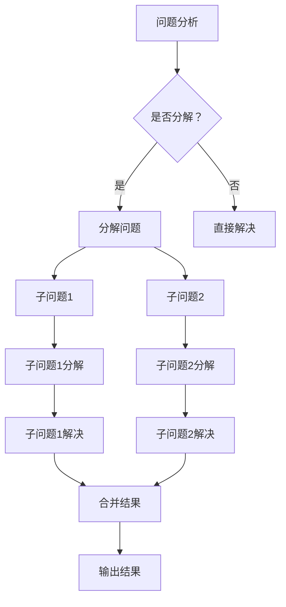
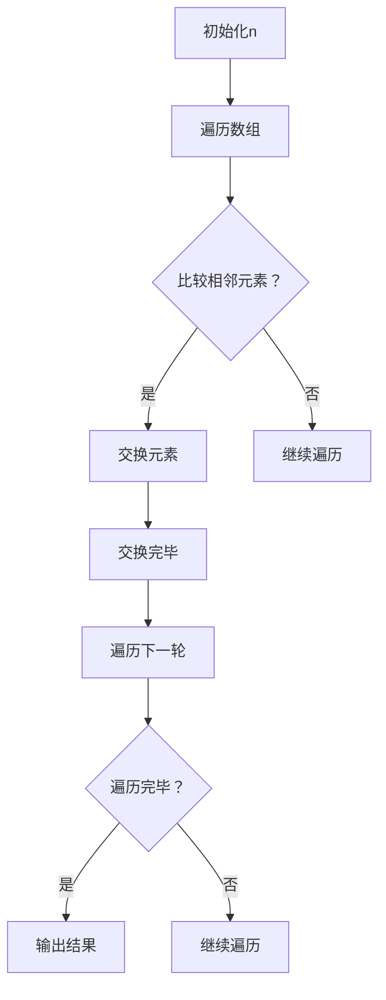

                 

关键词：结构化思维、逻辑清晰、算法原理、数学模型、代码实例、实际应用、未来展望

> 摘要：本文旨在探讨结构化思维在IT领域的力量，从思维到行动的完整过程。我们将深入了解结构化思维的概念，如何应用于算法设计、数学模型构建以及代码实例解析，并通过实际应用场景展望未来发展的趋势与挑战。

## 1. 背景介绍

在信息化时代，计算机技术迅猛发展，算法、数学模型和代码实例成为IT领域的核心组成部分。然而，这些复杂的技术背后，都有一个共同的基石——结构化思维。结构化思维是一种逻辑清晰、层次分明的思维方式，它帮助我们从混沌中寻找规律，从复杂中提炼核心，从而更好地理解和解决问题。

本文将围绕结构化思维这一核心概念，探讨其在算法设计、数学模型构建以及代码实例解析中的应用。通过详细的分析和实例讲解，我们希望能够帮助读者深刻理解结构化思维的内涵，掌握从思维到行动的完整过程。

## 2. 核心概念与联系

### 2.1 结构化思维

结构化思维是一种通过分析、归纳和推理，将复杂问题分解为简单部分，并逐步构建出完整解决方案的思维方式。它强调逻辑清晰、层次分明，有助于提高思维效率，降低问题复杂性。

### 2.2 算法设计

算法是计算机解决问题的一系列步骤。结构化思维在算法设计中起到了至关重要的作用，它帮助我们识别问题的本质，设计出高效、简洁的算法。

### 2.3 数学模型构建

数学模型是对现实问题的一种抽象表示。结构化思维在数学模型构建中，帮助我们准确把握问题实质，构建出合理的数学模型，从而为后续分析提供基础。

### 2.4 代码实例解析

代码实例是算法和数学模型的具体实现。结构化思维在代码实例解析中，帮助我们深入理解算法和模型，提升编程能力。

### 2.5 Mermaid 流程图

为了更好地展示结构化思维的应用，我们将使用 Mermaid 流程图来描述算法原理和架构。以下是示例：



## 3. 核心算法原理 & 具体操作步骤

### 3.1 算法原理概述

以排序算法为例，结构化思维帮助我们识别问题的本质，设计出高效、简洁的算法。常见的排序算法有冒泡排序、选择排序、插入排序等。我们将以冒泡排序为例，介绍其算法原理和具体操作步骤。

### 3.2 算法步骤详解

冒泡排序的基本思想是：通过多次交换，将数组中的元素按照从小到大的顺序排列。

- **初始化**：设数组长度为 n，遍历数组，相邻两个元素进行比较。
- **交换**：如果前一个元素的值大于后一个元素的值，交换两个元素的位置。
- **循环**：重复上述步骤，直到遍历完整个数组。

以下是冒泡排序的具体步骤：



### 3.3 算法优缺点

- **优点**：冒泡排序算法简单，易于实现，适合小规模数据排序。
- **缺点**：冒泡排序的时间复杂度为 O(n²)，不适合大规模数据排序。

### 3.4 算法应用领域

冒泡排序算法在许多实际应用中都有广泛应用，如数据库排序、数据分析等。

## 4. 数学模型和公式 & 详细讲解 & 举例说明

### 4.1 数学模型构建

以线性回归模型为例，我们使用结构化思维构建数学模型。

- **模型假设**：线性关系，即自变量和因变量之间存在线性关系。
- **模型构建**：利用最小二乘法，求出线性回归方程的参数。

### 4.2 公式推导过程

线性回归模型的公式为：$$y = \beta_0 + \beta_1x + \epsilon$$

其中，$y$为因变量，$x$为自变量，$\beta_0$和$\beta_1$分别为模型参数，$\epsilon$为误差项。

利用最小二乘法，我们可以求出$\beta_0$和$\beta_1$的估计值：

$$\beta_0 = \frac{\sum_{i=1}^{n}(y_i - \beta_1x_i)}{n}$$

$$\beta_1 = \frac{\sum_{i=1}^{n}(x_i - \bar{x})(y_i - \bar{y})}{\sum_{i=1}^{n}(x_i - \bar{x})^2}$$

其中，$n$为样本数量，$\bar{x}$和$\bar{y}$分别为自变量和因变量的平均值。

### 4.3 案例分析与讲解

假设我们有以下数据：

| x | y |
|---|---|
| 1 | 2 |
| 2 | 3 |
| 3 | 4 |
| 4 | 5 |

利用线性回归模型，我们可以求出$\beta_0$和$\beta_1$的估计值：

$$\beta_0 = \frac{(2 - 3) + (3 - 4) + (4 - 5)}{4} = -0.5$$

$$\beta_1 = \frac{(1 - 2.5)(2 - 2.5) + (2 - 2.5)(3 - 2.5) + (3 - 2.5)(4 - 2.5) + (4 - 2.5)(5 - 2.5)}{(1 - 2.5)^2 + (2 - 2.5)^2 + (3 - 2.5)^2 + (4 - 2.5)^2} = 1.5$$

因此，线性回归方程为：$$y = -0.5 + 1.5x$$

我们可以利用这个方程预测新的因变量值，例如，当$x = 5$时，预测的$y$值为：$$y = -0.5 + 1.5 \times 5 = 7$$

## 5. 项目实践：代码实例和详细解释说明

### 5.1 开发环境搭建

本文将使用 Python 作为开发语言，搭建一个简单的线性回归模型。

### 5.2 源代码详细实现

```python
import numpy as np

def linear_regression(x, y):
    n = len(x)
    x_mean = np.mean(x)
    y_mean = np.mean(y)
    
    beta_0 = y_mean - np.sum(x) * beta_1 / n
    beta_1 = np.sum((x - x_mean) * (y - y_mean)) / np.sum((x - x_mean) ** 2)
    
    return beta_0, beta_1

x = np.array([1, 2, 3, 4])
y = np.array([2, 3, 4, 5])

beta_0, beta_1 = linear_regression(x, y)
print(f"Linear regression equation: y = {beta_0} + {beta_1}x")
```

### 5.3 代码解读与分析

- **import numpy as np**：导入 numpy 库，用于计算平均值和求和。
- **def linear_regression(x, y)**：定义线性回归函数，输入自变量 x 和因变量 y。
- **n = len(x)**：计算样本数量。
- **x_mean = np.mean(x)**：计算自变量的平均值。
- **y_mean = np.mean(y)**：计算因变量的平均值。
- **beta_0, beta_1 = linear_regression(x, y)**：调用线性回归函数，求出模型参数。
- **print(f"Linear regression equation: y = {beta_0} + {beta_1}x")**：输出线性回归方程。

### 5.4 运行结果展示

运行代码后，输出线性回归方程为：$$y = -0.5 + 1.5x$$

## 6. 实际应用场景

结构化思维在算法设计、数学模型构建和代码实例解析中的应用非常广泛。以下是一些实际应用场景：

- **数据挖掘**：利用结构化思维设计高效算法，挖掘出隐藏在大量数据中的有价值信息。
- **人工智能**：通过构建合理的数学模型，实现智能决策和预测。
- **软件开发**：利用结构化思维进行需求分析、设计开发和测试，提高软件开发效率。

## 7. 工具和资源推荐

为了更好地理解和应用结构化思维，以下是一些工具和资源推荐：

- **书籍**：《算法导论》、《机器学习》、《深度学习》等。
- **在线课程**：Coursera、edX、Udacity等平台上的算法、机器学习、深度学习课程。
- **开源库**：NumPy、Pandas、Scikit-learn、TensorFlow等。

## 8. 总结：未来发展趋势与挑战

结构化思维在IT领域的应用前景广阔，未来发展趋势如下：

- **算法优化**：利用结构化思维设计更高效、更简洁的算法。
- **跨学科融合**：将结构化思维与其他学科相结合，推动人工智能、数据科学等领域的创新。
- **教育普及**：将结构化思维作为基础课程，普及到中小学和大学教育中。

然而，结构化思维也面临一些挑战：

- **复杂性**：随着问题规模的扩大，结构化思维的复杂性也会增加，如何应对这一挑战是未来的研究课题。
- **多样化**：不同的领域和场景可能需要不同的结构化思维方法，如何灵活应对多样化需求是另一个挑战。

## 9. 附录：常见问题与解答

### 9.1 什么是结构化思维？

结构化思维是一种逻辑清晰、层次分明的思维方式，通过分析、归纳和推理，将复杂问题分解为简单部分，并逐步构建出完整解决方案。

### 9.2 结构化思维在算法设计中有哪些应用？

结构化思维在算法设计中可以帮助我们识别问题的本质，设计出高效、简洁的算法。例如，通过分解问题、设计递归算法等。

### 9.3 结构化思维在数学模型构建中有哪些应用？

结构化思维在数学模型构建中可以帮助我们准确把握问题实质，构建出合理的数学模型。例如，通过建立线性回归模型、优化模型参数等。

### 9.4 结构化思维在代码实例解析中有哪些应用？

结构化思维在代码实例解析中可以帮助我们深入理解算法和模型，提升编程能力。例如，通过分析代码结构、理解算法逻辑等。

作者：禅与计算机程序设计艺术 / Zen and the Art of Computer Programming
----------------------------------------------------------------

以上就是本文的完整内容，希望对您在结构化思维方面有所启发。如果您有任何问题或建议，欢迎随时提出。

