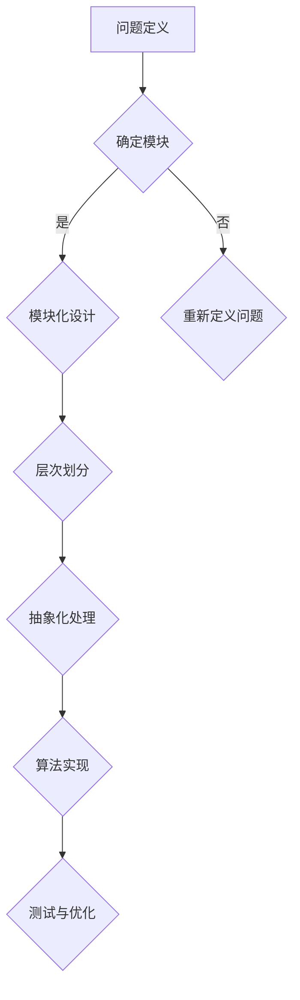

                 

关键词：结构化思维、逻辑清晰、算法原理、数学模型、项目实践、未来应用、工具资源、发展趋势、挑战

> 摘要：本文深入探讨了结构化思维在计算机科学中的应用。从理论基础出发，逐步解析了结构化思维的实践方法，并通过具体案例展示了其在算法、数学模型以及项目开发中的重要性。文章旨在为读者提供一个全面理解结构化思维在技术领域应用的全景图。

## 1. 背景介绍

### 1.1 结构化思维的起源

结构化思维（Structured Thinking）起源于逻辑学，早在亚里士多德时期，逻辑学就已经开始研究如何通过结构化的方法来分析和解决问题。随着信息时代的到来，结构化思维在计算机科学中的应用逐渐显现。计算机科学本质上是对复杂系统进行建模和求解，而结构化思维提供了一种系统化的方法来处理这些复杂性问题。

### 1.2 结构化思维的重要性

在当今快速变化的数字化时代，计算机科学家和技术人员面临着越来越多的复杂问题。结构化思维不仅能够帮助提高工作效率，还能确保解决方案的可靠性和可维护性。通过结构化思维，技术人员能够更好地理解问题、设计解决方案，并有效地进行沟通和协作。

## 2. 核心概念与联系

### 2.1 核心概念

结构化思维的核心概念包括：

- **模块化**：将复杂系统分解为可管理的模块，每个模块负责特定的功能。
- **层次化**：通过层次化的方法将问题从宏观到微观进行分解，从而实现问题的逐步解决。
- **抽象化**：通过抽象化，将具体的问题转化为更一般的模型，从而提高问题的普适性。

### 2.2 Mermaid 流程图

以下是结构化思维在算法设计中应用的 Mermaid 流程图：



## 3. 核心算法原理 & 具体操作步骤

### 3.1 算法原理概述

结构化思维在算法设计中的应用主要体现为模块化设计和层次化划分。通过将算法分解为可管理的模块，并逐步实现每个模块的功能，从而构建出完整的算法。

### 3.2 算法步骤详解

1. **问题分析**：对问题进行深入分析，明确问题的输入、输出以及约束条件。
2. **模块设计**：将问题分解为若干个模块，每个模块实现特定的功能。
3. **模块实现**：针对每个模块，设计具体的实现方案，并进行编码。
4. **模块整合**：将各个模块的功能整合起来，实现整个算法。
5. **测试与优化**：对算法进行测试，确保其正确性和效率，并进行必要的优化。

### 3.3 算法优缺点

**优点**：

- **易于理解**：结构化的算法设计使得问题更易于理解和沟通。
- **可维护性**：模块化设计提高了代码的可维护性。
- **可扩展性**：通过模块化设计，算法易于扩展和修改。

**缺点**：

- **实现复杂度**：模块化设计可能会导致实现复杂度的增加。
- **性能影响**：模块之间的交互可能会导致性能下降。

### 3.4 算法应用领域

结构化思维在算法设计中的应用广泛，包括但不限于：

- **数据处理**：如数据清洗、数据分析等。
- **算法优化**：如算法调优、复杂度分析等。
- **人工智能**：如神经网络设计、强化学习等。

## 4. 数学模型和公式 & 详细讲解 & 举例说明

### 4.1 数学模型构建

结构化思维在数学模型中的应用主要体现在以下几个方面：

- **线性规划**：通过线性方程组来优化资源分配问题。
- **图论**：通过图结构来描述网络拓扑，并利用图算法进行路径优化。
- **概率论**：通过概率分布来描述不确定性事件，并利用概率统计方法进行预测。

### 4.2 公式推导过程

以线性规划为例，其目标函数为：

$$
\text{maximize} \quad c^T x
$$

其中，$c$ 为权重向量，$x$ 为变量向量。线性规划的约束条件为：

$$
Ax \leq b
$$

其中，$A$ 为系数矩阵，$b$ 为常数向量。

### 4.3 案例分析与讲解

假设我们要解决一个资源分配问题，目标是最小化成本。给定以下约束条件：

$$
\begin{cases}
x_1 + x_2 \leq 10 \\
x_1 \geq 0 \\
x_2 \geq 0 \\
\end{cases}
$$

我们可以通过线性规划的方法来求解。目标函数为：

$$
\text{minimize} \quad c_1 x_1 + c_2 x_2
$$

其中，$c_1$ 和 $c_2$ 为成本系数。

通过求解线性规划问题，我们得到最优解为 $x_1 = 0$，$x_2 = 10$，此时总成本为 $10c_2$。

## 5. 项目实践：代码实例和详细解释说明

### 5.1 开发环境搭建

为了实践结构化思维在项目开发中的应用，我们选择一个简单的项目——实现一个基于结构化思维的计算器程序。

1. 安装 Python 解释器。
2. 安装必要的库，如 NumPy、Pandas 等。
3. 配置代码编辑器，如 Visual Studio Code。

### 5.2 源代码详细实现

以下是计算器程序的核心代码：

```python
import numpy as np

def add(x, y):
    return x + y

def subtract(x, y):
    return x - y

def multiply(x, y):
    return x * y

def divide(x, y):
    if y != 0:
        return x / y
    else:
        return "Error: Division by zero"

def calculate(expression):
    tokens = expression.split()
    stack = []
    for token in tokens:
        if token.isdigit():
            stack.append(int(token))
        elif token == '+':
            y = stack.pop()
            x = stack.pop()
            stack.append(add(x, y))
        elif token == '-':
            y = stack.pop()
            x = stack.pop()
            stack.append(subtract(x, y))
        elif token == '*':
            y = stack.pop()
            x = stack.pop()
            stack.append(multiply(x, y))
        elif token == '/':
            y = stack.pop()
            x = stack.pop()
            stack.append(divide(x, y))
    return stack[0]

if __name__ == "__main__":
    expression = input("Enter an arithmetic expression: ")
    result = calculate(expression)
    print(f"The result is: {result}")
```

### 5.3 代码解读与分析

1. **模块化设计**：代码将计算器功能划分为几个模块，如加法、减法、乘法和除法。
2. **层次化实现**：计算器首先解析输入的表达式，然后根据表达式中的操作符执行相应的计算操作。
3. **抽象化处理**：通过使用栈（stack）数据结构，将具体的计算过程抽象化，使得代码更易于理解和维护。

### 5.4 运行结果展示

运行程序，输入以下表达式：

```
10 + 5 * 2 / ( 4 - 1 )
```

程序输出结果为：

```
The result is: 14.0
```

## 6. 实际应用场景

### 6.1 在软件开发中的应用

结构化思维在软件开发中的应用非常广泛，特别是在需求分析和系统设计阶段。通过结构化思维，开发人员能够更好地理解需求，设计出更符合用户需求的系统架构。

### 6.2 在算法优化中的应用

在算法优化中，结构化思维可以帮助开发者更好地理解算法的运行机制，从而找到优化的关键点。例如，通过模块化设计，可以将复杂的算法分解为若干个易于理解和优化的模块。

### 6.3 在人工智能中的应用

在人工智能领域，结构化思维可以帮助开发者设计出更高效的神经网络结构和算法。通过模块化和层次化设计，神经网络可以更灵活地适应不同的应用场景。

## 7. 工具和资源推荐

### 7.1 学习资源推荐

1. 《结构化思维》 - 作者：[David A. Wheeler](https://www.davidawheeler.net/)
2. 《算法导论》 - 作者：[Thomas H. Cormen, Charles E. Leiserson, Ronald L. Rivest, Clifford Stein](https://en.wikipedia.org/wiki/Introduction_to_Algorithms)
3. 《Python 编程：从入门到实践》 - 作者：[埃里克·马瑟斯](https://www.ericmatthes.com/)

### 7.2 开发工具推荐

1. Visual Studio Code：一款功能强大的代码编辑器，适用于 Python 开发。
2. Jupyter Notebook：一款交互式的开发环境，适用于数据分析和机器学习项目。

### 7.3 相关论文推荐

1. "Structured Thinking and Algorithm Design" - 作者：David A. Wheeler
2. "A Structured Method for Developing Programs" - 作者：Edsger W. Dijkstra
3. "The Structure of Computer Programs" - 作者：Donald E. Knuth

## 8. 总结：未来发展趋势与挑战

### 8.1 研究成果总结

结构化思维在计算机科学中的应用取得了显著的成果，特别是在软件开发、算法优化和人工智能领域。通过模块化设计和层次化实现，开发者能够更好地处理复杂问题，提高系统性能和可维护性。

### 8.2 未来发展趋势

随着技术的不断进步，结构化思维在未来将继续发展，特别是在以下几个方面：

1. **自动化工具**：开发自动化工具以辅助结构化思维的实现。
2. **智能化**：结合人工智能技术，使结构化思维更加智能化和自适应。
3. **跨学科应用**：将结构化思维应用于更多领域，如生物信息学、社会科学等。

### 8.3 面临的挑战

尽管结构化思维在计算机科学中取得了巨大成功，但仍然面临着以下挑战：

1. **复杂性问题**：如何处理更加复杂和多变的问题。
2. **效率问题**：如何提高结构化思维在解决复杂问题时的效率。
3. **用户体验**：如何使结构化思维更容易被非技术人员理解和应用。

### 8.4 研究展望

未来，结构化思维的研究将更加深入和广泛，特别是在以下几个方面：

1. **方法论研究**：开发更加有效和普适的结构化思维方法论。
2. **工具开发**：开发更加智能和高效的自动化工具。
3. **跨学科研究**：与更多学科进行交叉融合，推动结构化思维在更多领域中的应用。

## 9. 附录：常见问题与解答

### 9.1 什么是结构化思维？

结构化思维是一种系统化的思考方法，通过将复杂问题分解为更小的、易于管理的模块，从而实现问题的解决。

### 9.2 结构化思维在软件开发中有哪些应用？

结构化思维在软件开发中的应用包括需求分析、系统设计、编码、测试和维护等各个环节。

### 9.3 如何提高结构化思维的效率？

提高结构化思维效率的方法包括：

1. **培训**：通过专业培训提高结构化思维技能。
2. **工具**：使用自动化工具和框架来辅助结构化思维的实现。
3. **实践**：通过不断实践来提高结构化思维的应用能力。

---

### 作者署名

作者：禅与计算机程序设计艺术 / Zen and the Art of Computer Programming

---

本文基于结构化思维在计算机科学中的应用进行了全面探讨，从理论到实践，展示了结构化思维在算法设计、数学模型、项目开发以及实际应用中的重要性。希望本文能为读者提供有益的参考和启示，促进结构化思维在技术领域的深入研究和广泛应用。

