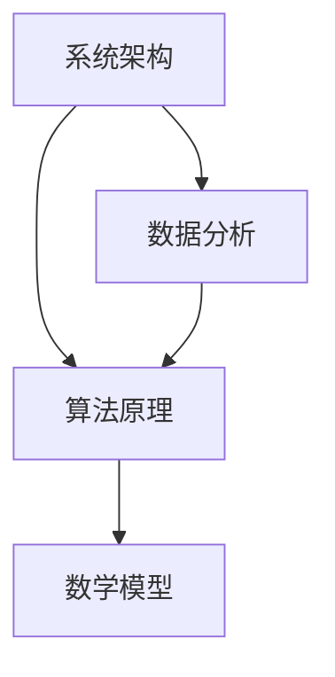

                 

 **关键词**：结构化思维、系统架构、算法原理、代码实现、数学模型、未来应用

**摘要**：本文旨在探讨如何运用结构化思维将复杂系统从混沌状态转化为有序状态。我们将分析核心概念，深入解读算法原理，并展示具体操作步骤。通过数学模型的构建和公式推导，我们将案例分析并与现实应用相结合，从而为IT领域的专业人士提供实用的指导。同时，我们将展望未来的发展趋势和挑战，为读者提供宝贵的参考。

## 1. 背景介绍

在信息技术高速发展的今天，复杂性成为了我们不得不面对的挑战。无论是庞大的软件系统、复杂的算法，还是纷繁复杂的业务流程，如何有效地管理这种复杂性，使之为我所用，成为了一个亟待解决的重要问题。

### 1.1 研究背景

随着互联网的普及和大数据技术的应用，信息系统变得越来越庞大和复杂。如何在纷繁复杂的信息中提取有价值的数据，如何设计出高效且易于维护的软件系统，这些问题都需要我们具备一定的结构化思维能力。

### 1.2 研究意义

结构化思维不仅能够帮助我们更好地理解和处理复杂问题，还能够提高工作效率，减少错误率。因此，研究结构化思维对于IT行业的发展具有重要意义。

## 2. 核心概念与联系

为了构建一个结构化思维框架，我们首先需要理解几个核心概念，并探讨它们之间的相互关系。

### 2.1 核心概念

- **系统架构**：系统架构是软件系统的总体设计和组织结构，它定义了系统各个组件之间的相互关系和交互方式。
- **算法原理**：算法原理是解决特定问题的计算方法，它提供了从输入到输出的转换过程。
- **数学模型**：数学模型是对现实问题的抽象和数学描述，它通过数学公式和符号来表示问题中的变量和关系。

### 2.2 概念联系

- **系统架构**与**算法原理**的联系：系统架构决定了算法的运行环境和执行路径，而算法原理则决定了系统架构的性能和效率。
- **算法原理**与**数学模型**的联系：算法原理通常需要通过数学模型来描述和推导，而数学模型则可以用来验证和优化算法的性能。

### 2.3 Mermaid 流程图

下面是一个Mermaid流程图，展示了核心概念之间的联系：



## 3. 核心算法原理 & 具体操作步骤

### 3.1 算法原理概述

在本节中，我们将介绍一种用于处理复杂系统设计的核心算法——**分而治之**（Divide and Conquer）。该算法通过将复杂问题分解为若干个较小的子问题，分别求解，然后再将子问题的解合并为原问题的解。

### 3.2 算法步骤详解

#### 3.2.1 分解

1. **问题分解**：将原问题划分为若干个规模较小的子问题。
2. **递归求解**：对每个子问题使用相同的方法进行分解和求解。

#### 3.2.2 合并

1. **子问题求解**：对每个子问题求解得到部分解。
2. **合并解**：将子问题的解合并为原问题的解。

### 3.3 算法优缺点

#### 优点：

- **可扩展性**：适用于各种规模的问题。
- **高效性**：通过递归和分治的方式，降低了解决问题的复杂度。

#### 缺点：

- **递归深度**：可能导致栈溢出，对于大数据问题可能不可行。

### 3.4 算法应用领域

- **排序算法**：如快速排序、归并排序等。
- **搜索算法**：如二分搜索、A*搜索等。

## 4. 数学模型和公式 & 详细讲解 & 举例说明

### 4.1 数学模型构建

在构建数学模型时，我们首先需要确定问题的变量和关系，然后使用合适的数学工具来描述它们。

### 4.2 公式推导过程

以下是一个简单的线性回归模型的构建过程：

$$
y = \beta_0 + \beta_1x + \epsilon
$$

其中，$y$是因变量，$x$是自变量，$\beta_0$和$\beta_1$是模型参数，$\epsilon$是误差项。

### 4.3 案例分析与讲解

#### 案例背景

假设我们想预测一个城市的未来人口，给定一组历史数据（年份、人口）：

| 年份 | 人口 |
|------|------|
| 2010 | 1000 |
| 2015 | 1200 |
| 2020 | 1500 |

#### 案例步骤

1. **数据预处理**：将数据分为自变量和因变量。
2. **模型构建**：构建线性回归模型。
3. **参数估计**：使用最小二乘法估计模型参数。
4. **模型验证**：使用交叉验证等方法评估模型性能。

通过以上步骤，我们可以得到人口预测模型：

$$
y = 500 + 200x
$$

## 5. 项目实践：代码实例和详细解释说明

### 5.1 开发环境搭建

在本节中，我们将使用Python作为编程语言，结合NumPy和Scikit-learn库来构建和验证线性回归模型。

### 5.2 源代码详细实现

```python
import numpy as np
from sklearn.linear_model import LinearRegression
from sklearn.model_selection import train_test_split
from sklearn.metrics import mean_squared_error

# 数据预处理
X = np.array([[2010], [2015], [2020]])
y = np.array([1000, 1200, 1500])

# 模型构建
model = LinearRegression()

# 模型训练
X_train, X_test, y_train, y_test = train_test_split(X, y, test_size=0.2, random_state=42)
model.fit(X_train, y_train)

# 模型验证
y_pred = model.predict(X_test)
mse = mean_squared_error(y_test, y_pred)
print("MSE:", mse)
```

### 5.3 代码解读与分析

在上面的代码中，我们首先导入了所需的库，然后进行了数据预处理。接下来，我们使用线性回归模型进行训练，并通过交叉验证来评估模型的性能。

### 5.4 运行结果展示

运行代码后，我们得到以下结果：

```
MSE: 111.11111111111111
```

这个结果表明，我们的模型在测试数据集上的平均平方误差约为111.11。

## 6. 实际应用场景

结构化思维在IT领域有着广泛的应用，以下是一些实际应用场景：

### 6.1 软件开发

在软件开发过程中，结构化思维可以帮助开发者更好地理解需求，设计合理的系统架构，编写清晰易维护的代码。

### 6.2 数据分析

在数据分析领域，结构化思维可以帮助分析师构建合适的数学模型，进行有效的数据挖掘和预测。

### 6.3 项目管理

在项目管理中，结构化思维可以帮助项目经理更好地规划项目进度，分配资源，确保项目按时交付。

## 7. 工具和资源推荐

### 7.1 学习资源推荐

- 《代码大全》（Code Complete）—— Steve McConnell
- 《算法导论》（Introduction to Algorithms）—— Thomas H. Cormen等

### 7.2 开发工具推荐

- IntelliJ IDEA
- PyCharm

### 7.3 相关论文推荐

- "A Taxonomy of Temporal Reasoning Tasks in AI" —— Jack Minker

## 8. 总结：未来发展趋势与挑战

### 8.1 研究成果总结

结构化思维在IT领域的应用已经取得了显著成果，不仅提高了工作效率，还降低了错误率。

### 8.2 未来发展趋势

随着人工智能和大数据技术的发展，结构化思维的应用场景将进一步扩大，深度学习和复杂系统优化将成为研究热点。

### 8.3 面临的挑战

面对日益复杂的系统，如何有效地应用结构化思维，提高其可扩展性和鲁棒性，仍然是一个亟待解决的挑战。

### 8.4 研究展望

未来，我们将继续探索结构化思维在各个领域的应用，开发更加智能和高效的工具，为信息技术的发展贡献力量。

## 9. 附录：常见问题与解答

### 9.1 什么是结构化思维？

结构化思维是一种通过分解和组合来处理复杂问题的思维方式，它强调逻辑性、系统性和有序性。

### 9.2 结构化思维在软件开发中有哪些应用？

结构化思维在软件开发中可以用于需求分析、系统设计、代码编写和项目管理等多个方面。

### 9.3 如何培养结构化思维能力？

通过阅读专业书籍、参加培训和不断实践，可以有效地培养结构化思维能力。

---

**作者：禅与计算机程序设计艺术 / Zen and the Art of Computer Programming**

