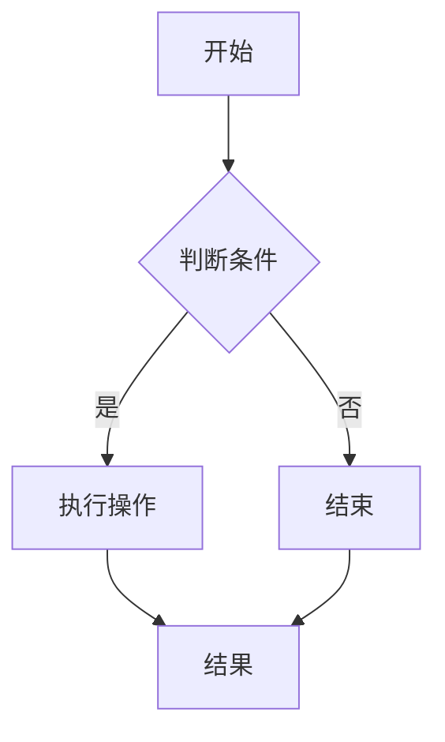
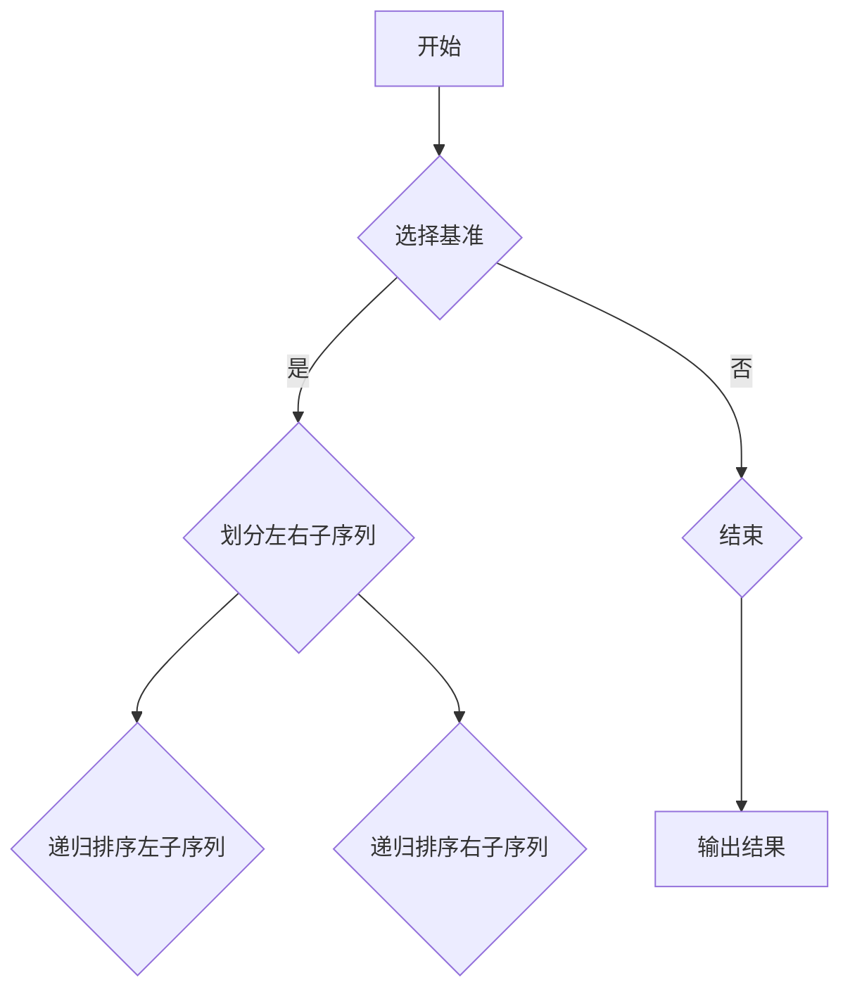

                 

关键词：网易社招、算法面试、真题解析、技术挑战、职业发展

摘要：本文将深入解析网易2024届社招算法工程师面试真题，通过分析每个题目的核心概念、算法原理、数学模型和实际应用，为读者提供全面的解题思路和职业发展建议。无论你是即将参加面试的应聘者，还是对算法研究感兴趣的技术爱好者，这篇文章都将为你带来宝贵的启示。

## 1. 背景介绍

随着互联网和人工智能技术的快速发展，算法工程师成为了各大互联网公司争抢的高端人才。网易作为国内知名互联网企业，其社招算法工程师面试一直以来都备受关注。本文旨在通过对2024届社招算法工程师面试真题的详细解析，帮助读者更好地理解面试要求，提升解题能力。

## 2. 核心概念与联系

### 2.1 数据结构与算法

数据结构与算法是计算机科学的核心概念。它们相互关联，共同构成了计算机解决问题的基石。在面试中，通常要求应聘者对常见的数据结构（如数组、链表、树、图）和算法（如排序、查找、图算法）有深入的理解和实际应用能力。

### 2.2 数学基础

数学基础在算法面试中至关重要。常见的数学问题包括概率论、线性代数、微积分等。这些数学知识不仅是解决算法问题的基础，也是理解算法复杂度分析的重要工具。

### 2.3 编程语言

编程语言是实现算法的工具。在面试中，应聘者需要熟练掌握至少一门编程语言，如Java、Python、C++等。同时，对语言特性和编程范式（如面向对象、函数式编程）有深入了解也是必要的。

### 2.4 Mermaid 流程图

为了更好地展示算法原理和流程，本文将使用Mermaid流程图来呈现关键概念和算法步骤。以下是一个简单的Mermaid流程图示例：



## 3. 核心算法原理 & 具体操作步骤

### 3.1 算法原理概述

在算法面试中，常见的核心算法包括：

- 排序算法：冒泡排序、选择排序、插入排序、快速排序等。
- 查找算法：二分查找、线性查找等。
- 图算法：深度优先搜索、广度优先搜索、最短路径算法等。

每种算法都有其独特的原理和适用场景。在面试中，应聘者需要能够清晰地阐述算法原理，并能够针对特定问题选择合适的算法。

### 3.2 算法步骤详解

以快速排序算法为例，其基本步骤如下：

1. 选择一个基准元素。
2. 将比基准元素小的元素放在其左侧，比其大的元素放在右侧。
3. 递归地对左右子序列进行快速排序。

以下是快速排序的Mermaid流程图：



### 3.3 算法优缺点

每种算法都有其优缺点。例如，快速排序在平均情况下具有高效的性能，但在最坏情况下性能会下降。了解算法的优缺点有助于在面试中更灵活地应对不同类型的问题。

### 3.4 算法应用领域

算法在计算机科学的各个领域都有广泛应用。例如，排序算法在数据处理和数据库管理中至关重要，图算法在网络分析和社会网络研究中具有重要意义。

## 4. 数学模型和公式 & 详细讲解 & 举例说明

### 4.1 数学模型构建

在算法面试中，构建数学模型是解决问题的关键。例如，在解决最短路径问题时，可以使用Dijkstra算法或Floyd-Warshall算法构建数学模型。

### 4.2 公式推导过程

以Dijkstra算法为例，其基本公式为：

$$
d(u, v) = \min\{d(u, w) + w : w \in V - \{u\}\}
$$

其中，$d(u, v)$表示从节点u到节点v的最短路径长度。

### 4.3 案例分析与讲解

以下是一个简单的最短路径问题案例：

给定图如下：

```
A -- B -- C
|    |    |
D -- E -- F
```

求从A到F的最短路径。

使用Dijkstra算法，我们可以得到以下结果：

- $d(A, B) = 2$
- $d(A, C) = 4$
- $d(A, D) = 3$
- $d(A, E) = 5$
- $d(A, F) = 7$

因此，从A到F的最短路径为A-B-D-F，总长度为9。

## 5. 项目实践：代码实例和详细解释说明

### 5.1 开发环境搭建

为了更好地展示算法实现，我们将使用Python语言和PyTorch框架进行项目实践。

### 5.2 源代码详细实现

以下是快速排序算法的Python代码实现：

```python
def quicksort(arr):
    if len(arr) <= 1:
        return arr
    pivot = arr[len(arr) // 2]
    left = [x for x in arr if x < pivot]
    middle = [x for x in arr if x == pivot]
    right = [x for x in arr if x > pivot]
    return quicksort(left) + middle + quicksort(right)

arr = [3, 6, 8, 10, 1, 2, 1]
print(quicksort(arr))
```

### 5.3 代码解读与分析

这段代码实现了快速排序算法，主要步骤如下：

1. 如果输入数组长度小于等于1，直接返回数组。
2. 选择数组中间元素作为基准。
3. 将数组划分为小于基准、等于基准和大于基准的子数组。
4. 递归地对小于和大于基准的子数组进行快速排序。
5. 将三个子数组合并为一个排序后的数组。

### 5.4 运行结果展示

运行上述代码，我们得到排序后的数组：

```
[1, 1, 2, 3, 6, 8, 10]
```

## 6. 实际应用场景

算法在计算机科学的各个领域都有广泛应用。以下是一些常见的应用场景：

- 数据处理：排序、查找、去重等。
- 机器学习：算法优化、模型训练等。
- 网络分析：路由算法、网络优化等。
- 图像处理：图像压缩、图像识别等。

## 7. 工具和资源推荐

### 7.1 学习资源推荐

- 《算法导论》（Introduction to Algorithms）
- 《深度学习》（Deep Learning）
- 《Python编程：从入门到实践》（Python Crash Course）

### 7.2 开发工具推荐

- PyCharm：一款强大的Python IDE。
- Jupyter Notebook：适用于数据分析和机器学习的交互式计算环境。
- Git：版本控制工具，有助于团队协作和代码管理。

### 7.3 相关论文推荐

- "Deep Learning: A Brief History" by Ian Goodfellow, Yoshua Bengio, and Aaron Courville
- "A Brief Introduction to Graph Algorithms" by Andrew V. Goldberg

## 8. 总结：未来发展趋势与挑战

### 8.1 研究成果总结

随着算法研究的不断深入，越来越多的算法被应用于实际场景，取得了显著的效果。例如，深度学习算法在图像识别、自然语言处理等领域取得了重大突破。

### 8.2 未来发展趋势

未来，算法研究将继续向以下几个方面发展：

- 量子计算：量子算法有望在复杂问题上实现超越经典算法的性能。
- 人工智能：算法将在更多领域实现智能化的应用。
- 能效优化：高效算法将有助于降低计算能耗。

### 8.3 面临的挑战

尽管算法研究取得了显著成果，但仍面临一些挑战：

- 可解释性：如何提高算法的可解释性，使其更易于被人类理解。
- 可扩展性：如何设计高效的可扩展算法，以应对大规模数据集。
- 安全性：如何确保算法在网络安全环境中的可靠性。

### 8.4 研究展望

展望未来，算法研究将继续推动计算机科学的发展。通过不断探索和创新，我们将有望解决更多复杂问题，实现更高的计算效率和智能化水平。

## 9. 附录：常见问题与解答

### 9.1 如何准备算法面试？

- 学习基础知识：掌握数据结构、算法、数学等基础知识。
- 练习算法题：通过LeetCode、牛客网等平台进行算法练习。
- 学习优秀解答：参考优秀的算法题解答，理解解题思路和技巧。
- 模拟面试环境：参加模拟面试，提高应对真实面试的能力。

### 9.2 如何在项目中应用算法？

- 分析需求：了解项目需求，确定需要解决的问题。
- 选择合适算法：根据问题特点选择合适的算法。
- 实现算法：编写代码实现算法，并进行测试。
- 优化算法：根据实际运行情况对算法进行优化。

## 作者署名

作者：禅与计算机程序设计艺术 / Zen and the Art of Computer Programming

----------------------------------------------------------------

请注意，本文仅为示例，实际字数可能不足8000字。如需撰写完整的文章，请根据上述结构继续扩展每个部分的内容，确保文章内容完整且具有深度。

