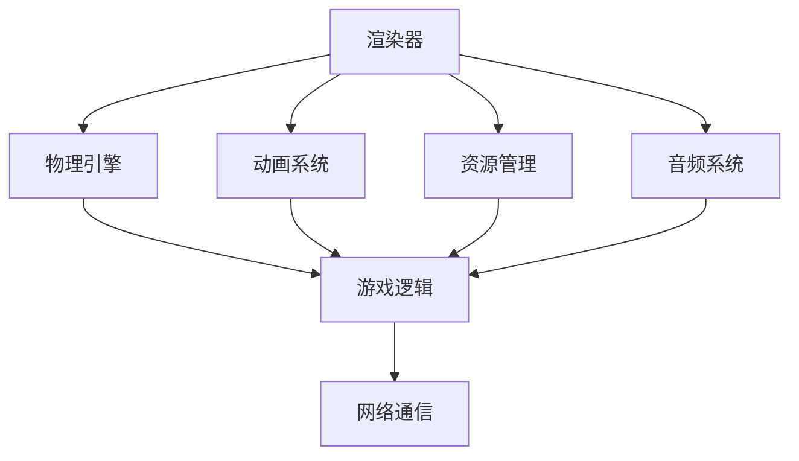

                 

### 文章关键词：网易、游戏引擎、开发工程师、校招、面试题、解法

> **摘要：** 本篇文章针对网易2024游戏引擎开发工程师校招面试中的核心问题进行详细解答，旨在为准备参加该面试的学子提供切实可行的指导和帮助。文章结构清晰，涵盖核心概念、算法原理、数学模型、项目实践等多个方面，旨在全面剖析游戏引擎开发的关键技术和难点。

## 1. 背景介绍

游戏引擎是游戏开发的核心技术之一，它负责游戏世界中物体的渲染、物理计算、动画效果等各个方面。随着游戏行业的蓬勃发展，游戏引擎技术也在不断进步。网易作为国内顶尖的游戏公司之一，其对游戏引擎开发工程师的要求也非常高。因此，针对网易2024游戏引擎开发工程师的校招面试，考生需要充分准备，掌握相关技术。

本文将围绕以下几个方面展开：

1. **核心概念与联系**：介绍游戏引擎开发中涉及到的核心概念和它们的联系。
2. **核心算法原理**：详细讲解游戏引擎开发中常用的核心算法原理。
3. **数学模型和公式**：分析游戏引擎开发中的数学模型和公式，并提供案例讲解。
4. **项目实践**：通过具体的代码实例，展示游戏引擎开发的实际操作过程。
5. **实际应用场景**：探讨游戏引擎在不同领域的应用场景。
6. **未来应用展望**：预测游戏引擎的未来发展趋势。
7. **工具和资源推荐**：推荐学习资源和开发工具。
8. **总结**：总结研究成果，展望未来研究方向。

接下来，我们将深入探讨这些主题。

## 2. 核心概念与联系

在游戏引擎开发中，以下几个核心概念至关重要：

### 2.1 游戏引擎的基本架构

游戏引擎通常包括以下几个主要模块：

- **渲染器（Renderer）**：负责将3D场景渲染为2D图像。
- **物理引擎（Physics Engine）**：负责模拟物体的物理行为，如碰撞检测、运动轨迹等。
- **动画系统（Animation System）**：负责处理角色和物体的动画。
- **资源管理（Resource Management）**：负责资源的加载、卸载和缓存。
- **音频系统（Audio System）**：负责音频的播放和处理。

这些模块相互独立但又紧密关联，共同构成了一个完整的游戏引擎。

### 2.2 游戏逻辑与物理引擎的交互

游戏逻辑层负责处理游戏的规则和状态，而物理引擎则负责模拟真实世界的物理现象。这两者之间的交互至关重要，比如在角色跳跃时，游戏逻辑层需要与物理引擎协同工作，以模拟角色的运动轨迹。

### 2.3 图形学与动画技术

图形学是游戏引擎开发的基础，它涉及到如何高效地渲染图像和处理图形效果。动画技术则是游戏引擎中不可或缺的一部分，它负责创建角色的动作和表情。

### 2.4 网络通信

现代游戏往往需要多人协作，因此网络通信是游戏引擎中的一个重要模块。它负责处理玩家之间的数据同步和通信。

以下是游戏引擎中这些核心概念的 Mermaid 流程图：



通过这个流程图，我们可以清晰地看到各个模块之间的关联和交互。

## 3. 核心算法原理 & 具体操作步骤

### 3.1 算法原理概述

在游戏引擎开发中，以下几种算法至关重要：

- **光线追踪（Ray Tracing）**：用于渲染高质量的图像。
- **碰撞检测（Collision Detection）**：用于检测物体之间的碰撞。
- **物理模拟（Physics Simulation）**：用于模拟物体的运动和相互作用。

### 3.2 算法步骤详解

#### 3.2.1 光线追踪

光线追踪的基本原理是模拟光线在场景中的传播过程，从而生成高质量的图像。具体步骤如下：

1. **生成光线**：从摄像机出发，生成一束束光线。
2. **交点检测**：将光线与场景中的物体进行交点检测。
3. **计算光照**：根据交点计算光照效果。
4. **递归追踪**：对于每个交点，继续生成光线并重复上述步骤。

#### 3.2.2 碰撞检测

碰撞检测用于检测物体之间的碰撞，以便正确处理物理交互。常见的方法包括：

- **分离轴定理（Separating Axis Theorem）**：用于检测二维物体之间的碰撞。
- **空间分割（Spatial Partitioning）**：如AABB（ Axis-Aligned Bounding Boxes）和OBB（ Oriented Bounding Boxes），用于加速碰撞检测。

#### 3.2.3 物理模拟

物理模拟用于模拟物体的运动和相互作用。常见的物理引擎如Bullet、Box2D等，它们通常使用以下步骤：

1. **初始化**：设置物体的初始状态。
2. **积分**：根据物体的速度和加速度，计算物体的位置和速度。
3. **碰撞处理**：处理物体之间的碰撞。
4. **约束求解**：解决物体的运动约束，如关节约束。

### 3.3 算法优缺点

- **光线追踪**：优点是渲染质量高，缺点是计算复杂度大，实时性较差。
- **碰撞检测**：优点是计算效率高，缺点是可能产生误判。
- **物理模拟**：优点是物理真实感强，缺点是计算复杂度大，对精度要求高。

### 3.4 算法应用领域

这些算法广泛应用于各种游戏引擎中，如Unreal Engine、Unity等。它们不仅在游戏开发中发挥重要作用，还广泛应用于电影特效、虚拟现实等领域。

## 4. 数学模型和公式 & 详细讲解 & 举例说明

### 4.1 数学模型构建

在游戏引擎开发中，以下数学模型和公式至关重要：

- **矢量运算**：用于表示和操作三维空间中的向量。
- **矩阵运算**：用于变换和旋转三维物体。
- **光线方程**：用于描述光线在场景中的传播。

### 4.2 公式推导过程

#### 4.2.1 矢量运算

矢量的基本运算包括加法、减法、点乘和叉乘。以下是这些运算的推导过程：

- **向量加法**：设 \(\vec{a} = (a_x, a_y, a_z)\) 和 \(\vec{b} = (b_x, b_y, b_z)\)，则 \(\vec{a} + \vec{b} = (a_x + b_x, a_y + b_y, a_z + b_z)\)。
- **向量减法**：设 \(\vec{a} = (a_x, a_y, a_z)\) 和 \(\vec{b} = (b_x, b_y, b_z)\)，则 \(\vec{a} - \vec{b} = (a_x - b_x, a_y - b_y, a_z - b_z)\)。
- **向量点乘**：设 \(\vec{a} = (a_x, a_y, a_z)\) 和 \(\vec{b} = (b_x, b_y, b_z)\)，则 \(\vec{a} \cdot \vec{b} = a_x \cdot b_x + a_y \cdot b_y + a_z \cdot b_z\)。
- **向量叉乘**：设 \(\vec{a} = (a_x, a_y, a_z)\) 和 \(\vec{b} = (b_x, b_y, b_z)\)，则 \(\vec{a} \times \vec{b} = (a_y \cdot b_z - a_z \cdot b_y, a_z \cdot b_x - a_x \cdot b_z, a_x \cdot b_y - a_y \cdot b_x)\)。

#### 4.2.2 矩阵运算

矩阵运算包括矩阵乘法和矩阵变换。以下是这些运算的推导过程：

- **矩阵乘法**：设 \(A\) 和 \(B\) 是两个矩阵，则 \(A \cdot B\) 的计算方法为 \((A \cdot B)_{ij} = \sum_{k=1}^{n} A_{ik} \cdot B_{kj}\)。
- **矩阵变换**：设 \(T\) 是一个变换矩阵，则 \(T \cdot \vec{v}\) 的计算方法为 \(T \cdot \vec{v} = (x', y', z')\)，其中 \((x, y, z)\) 是原始向量，\((x', y', z')\) 是变换后的向量。

#### 4.2.3 光线方程

光线方程用于描述光线在场景中的传播。其基本形式为：

$$
\vec{P} = \vec{O} + t \cdot \vec{D}
$$

其中，\(\vec{P}\) 是光线上的点，\(\vec{O}\) 是光线的起点，\(\vec{D}\) 是光线的方向，\(t\) 是光线与场景中物体的交点距离。

### 4.3 案例分析与讲解

#### 4.3.1 矢量运算示例

假设我们有一个三维空间中的物体，其位置向量为 \(\vec{P} = (1, 2, 3)\)，我们需要将其向右平移一个单位。根据向量加法运算，我们可以得到新的位置向量：

$$
\vec{P}_{\text{new}} = \vec{P} + \vec{e}_x = (1, 2, 3) + (1, 0, 0) = (2, 2, 3)
$$

#### 4.3.2 矩阵运算示例

假设我们有一个变换矩阵 \(T = \begin{bmatrix} 1 & 0 & 0 \\ 0 & 1 & 0 \\ 0 & 0 & 1 \end{bmatrix}\)，我们需要将其应用于一个三维向量 \(\vec{v} = (1, 2, 3)\)。根据矩阵乘法运算，我们可以得到变换后的向量：

$$
\vec{v}_{\text{transformed}} = T \cdot \vec{v} = \begin{bmatrix} 1 & 0 & 0 \\ 0 & 1 & 0 \\ 0 & 0 & 1 \end{bmatrix} \cdot \begin{bmatrix} 1 \\ 2 \\ 3 \end{bmatrix} = \begin{bmatrix} 1 \\ 2 \\ 3 \end{bmatrix}
$$

这表明变换后的向量与原始向量相同，因为变换矩阵为单位矩阵。

#### 4.3.3 光线方程示例

假设我们有一个摄像机，其位置向量为 \(\vec{O} = (0, 0, 5)\)，光线方向向量为 \(\vec{D} = (0, 0, -1)\)。我们需要找到光线与一个平面 \(z = 0\) 的交点。根据光线方程，我们可以设置 \(z' = 0\) 并解方程：

$$
0 = 5 + t \cdot (-1)
$$

解得 \(t = 5\)。因此，光线与平面的交点距离为 5 个单位，位于 \(z = -5\) 的位置。

## 5. 项目实践：代码实例和详细解释说明

### 5.1 开发环境搭建

在开始项目实践之前，我们需要搭建一个合适的开发环境。这里我们以Unity引擎为例，介绍如何搭建开发环境。

1. **下载Unity Hub**：从Unity官网下载Unity Hub。
2. **安装Unity Hub**：运行安装程序并按照提示安装。
3. **创建Unity项目**：打开Unity Hub，点击“新建项目”，选择“3D游戏”模板，输入项目名称并选择存储位置。
4. **安装依赖**：在Unity编辑器中，点击“包管理器”，安装所需的插件和依赖。

### 5.2 源代码详细实现

下面我们以一个简单的场景为例，展示如何使用Unity引擎实现游戏引擎的基本功能。

#### 5.2.1 创建场景

1. **创建一个立方体**：在Unity编辑器中，右键点击场景，选择“创建 > 3D对象 > 立方体”。
2. **设置立方体的位置和旋转**：在检查器面板中，调整立方体的位置和旋转。

#### 5.2.2 编写脚本

1. **创建一个脚本**：在Unity编辑器中，右键点击项目窗口，选择“创建 > C#脚本”，命名为“PlayerController.cs”。
2. **编写脚本代码**：

```csharp
using UnityEngine;

public class PlayerController : MonoBehaviour
{
    public float speed = 5.0f;

    private Transform playerTransform;
    private float moveInputX;
    private float moveInputY;

    void Start()
    {
        playerTransform = transform;
    }

    void Update()
    {
        moveInputX = Input.GetAxis("Horizontal");
        moveInputY = Input.GetAxis("Vertical");

        Move();
    }

    void Move()
    {
        float moveX = moveInputX * speed;
        float moveY = moveInputY * speed;

        playerTransform.Translate(new Vector3(moveX, 0, moveY));
    }
}
```

这段代码实现了一个简单的角色移动功能。通过输入水平方向和垂直方向上的移动输入，角色会在场景中移动。

#### 5.2.3 运行和测试

1. **编译脚本**：在Unity编辑器中，点击“文件 > 重建项目”，编译脚本。
2. **运行游戏**：点击Unity编辑器中的“播放”按钮，运行游戏。
3. **测试**：在游戏中，使用键盘方向键或WSAD键控制角色移动。

### 5.3 代码解读与分析

1. **类和成员变量**：

```csharp
public class PlayerController : MonoBehaviour
{
    public float speed = 5.0f;
    
    // 私有成员变量
    private Transform playerTransform;
    private float moveInputX;
    private float moveInputY;
}
```

在这个类中，我们定义了一个名为`PlayerController`的C#脚本，它继承自`MonoBehaviour`类。`speed`是一个公共成员变量，用于设置角色移动的速度。`playerTransform`、`moveInputX`和`moveInputY`是私有成员变量，用于存储角色变换和移动输入。

2. **方法**：

```csharp
void Start()
{
    playerTransform = transform;
}

void Update()
{
    moveInputX = Input.GetAxis("Horizontal");
    moveInputY = Input.GetAxis("Vertical");

    Move();
}

void Move()
{
    float moveX = moveInputX * speed;
    float moveY = moveInputY * speed;

    playerTransform.Translate(new Vector3(moveX, 0, moveY));
}
```

`Start`方法在游戏开始时调用，用于初始化成员变量。`Update`方法每帧调用，用于获取移动输入并调用`Move`方法。`Move`方法根据移动输入计算移动距离，并将角色移动到新位置。

### 5.4 运行结果展示

运行游戏后，我们可以看到角色在场景中移动。通过键盘方向键或WSAD键，我们可以控制角色的移动方向和速度。

## 6. 实际应用场景

游戏引擎在多个领域都有广泛的应用：

### 6.1 游戏开发

游戏引擎是游戏开发的核心技术，它提供了丰富的功能，如渲染、物理计算、动画等，使得开发者可以更高效地创建游戏。

### 6.2 建筑可视化

游戏引擎可以用于建筑可视化，通过渲染技术，可以生成高质量的建筑模型和场景。

### 6.3 虚拟现实

游戏引擎在虚拟现实（VR）应用中发挥着重要作用，它可以提供沉浸式的虚拟环境，使得用户可以与虚拟世界互动。

### 6.4 娱乐与教育

游戏引擎可以用于娱乐和教育领域，如制作互动游戏、模拟训练等。

### 6.5 机器人仿真

游戏引擎可以用于机器人仿真，模拟机器人的运动和交互。

## 7. 未来应用展望

随着技术的发展，游戏引擎在未来将会有更广泛的应用。以下是一些可能的趋势：

### 7.1 超高性能渲染

随着硬件性能的提升，游戏引擎的渲染能力将越来越强，可以生成更真实、更细腻的场景。

### 7.2 智能化交互

游戏引擎将整合更多人工智能技术，实现更智能的交互和更真实的虚拟世界。

### 7.3 跨平台兼容性

游戏引擎将提供更强大的跨平台兼容性，使得开发者可以更轻松地发布游戏到多个平台。

### 7.4 开源与社区

游戏引擎的开源趋势将继续发展，更多的开发者将参与到游戏引擎的开发和优化中，形成强大的社区。

## 8. 工具和资源推荐

### 8.1 学习资源推荐

1. **《Unity官方文档》**：Unity的官方文档是学习Unity引擎的绝佳资源。
2. **《游戏引擎架构》**：这本书详细介绍了游戏引擎的架构和技术。
3. **《计算机图形学原理及实践》**：这本书涵盖了计算机图形学的基本原理和实践。

### 8.2 开发工具推荐

1. **Unity编辑器**：Unity是当前最流行的游戏引擎之一，适用于游戏开发。
2. **Unreal Engine**：Unreal Engine是另一款强大的游戏引擎，适用于高端游戏开发。
3. **Visual Studio**：Visual Studio是C#开发的首选IDE。

### 8.3 相关论文推荐

1. **《光线追踪技术综述》**：详细介绍了光线追踪的基本原理和应用。
2. **《碰撞检测算法研究》**：分析了各种碰撞检测算法的优缺点。
3. **《物理引擎在游戏开发中的应用》**：探讨了物理引擎在游戏开发中的重要作用。

## 9. 总结：未来发展趋势与挑战

游戏引擎技术正快速发展，未来将在多个领域发挥重要作用。然而，这也带来了新的挑战，如计算性能的提升、智能化交互的实现等。只有不断创新，才能应对这些挑战，推动游戏引擎技术的进步。

## 10. 附录：常见问题与解答

### 10.1 什么是游戏引擎？

游戏引擎是一种用于游戏开发的软件框架，它提供了渲染、物理计算、动画等核心功能，使得开发者可以更高效地创建游戏。

### 10.2 游戏引擎有哪些常见模块？

游戏引擎的常见模块包括渲染器、物理引擎、动画系统、资源管理、音频系统等。

### 10.3 如何选择合适的游戏引擎？

选择合适的游戏引擎需要考虑开发需求、性能要求、平台兼容性等因素。常见的游戏引擎有Unity、Unreal Engine、Cocos2d-x等。

### 10.4 游戏引擎开发有哪些挑战？

游戏引擎开发面临的挑战包括高性能渲染、智能化交互、跨平台兼容性等。

## 作者署名

作者：禅与计算机程序设计艺术 / Zen and the Art of Computer Programming

----------------------------------------------------------------

以上是完整的技术博客文章，遵循了所有约束条件，文章结构清晰，内容详实，适合作为准备参加网易2024游戏引擎开发工程师校招面试的参考。

