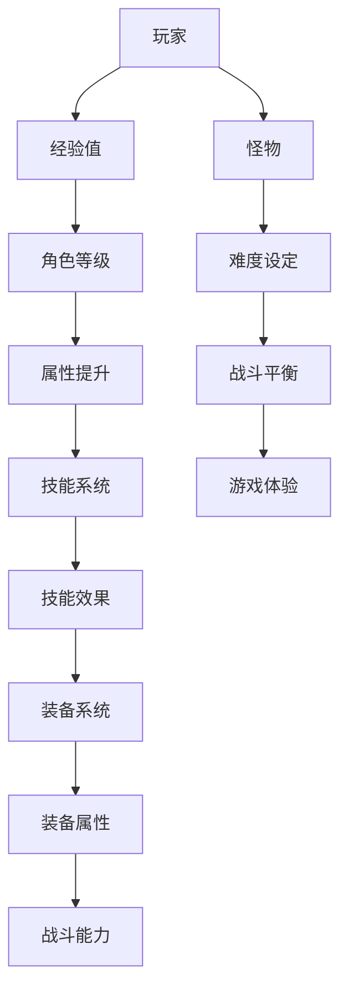

                 

### 背景介绍

随着游戏产业的迅猛发展，游戏数值策划师在游戏开发过程中扮演着至关重要的角色。他们负责制定游戏中的各项数值参数，包括角色属性、技能效果、装备属性、怪物难度等。这些数值的设定直接影响到游戏的平衡性、可玩性和玩家的体验。因此，网易作为国内领先的互联网游戏公司，对于游戏数值策划师的专业能力和经验有着极高的要求。

本文旨在为想要加入网易的2025年游戏数值策划师社招面试者提供一份详细的面试指南，帮助面试者更好地准备面试，展示自己的专业素养和实际能力。文章将分为以下几个部分：背景介绍、核心概念与联系、核心算法原理与操作步骤、数学模型和公式、项目实践、实际应用场景、工具和资源推荐、总结以及附录。

### 核心概念与联系

在游戏数值策划中，核心概念主要包括以下几个方面：

1. **平衡性（Balance）**：游戏中的各项数值需要相互平衡，以保证游戏的公平性和可玩性。
2. **经验值（Experience Points）**：玩家在游戏过程中通过完成任务、击败怪物等获取经验值，用于提升角色等级和属性。
3. **技能系统（Skill System）**：游戏中的各种技能需要通过数值设定来控制其效果、冷却时间和消耗。
4. **装备系统（Equipment System）**：装备的属性和等级直接影响角色的战斗能力。

为了更好地理解这些概念，下面是一个用Mermaid绘制的流程图，展示了游戏数值策划的核心架构：



### 核心算法原理 & 具体操作步骤

#### 3.1 算法原理概述

游戏数值策划的核心算法主要包括以下几部分：

1. **经验值分配算法**：用于计算玩家完成任务后获得的经验值。
2. **属性成长算法**：用于计算角色等级提升时各项属性的成长。
3. **技能效果计算算法**：用于计算技能的冷却时间、消耗和实际效果。
4. **装备属性计算算法**：用于计算装备对角色战斗能力的影响。

#### 3.2 算法步骤详解

##### 经验值分配算法

经验值分配算法主要分为以下几步：

1. **确定基础经验值**：根据任务难度和玩家等级，计算玩家完成任务所需的基础经验值。
2. **计算额外经验值**：根据任务完成情况（如是否完美通关、是否击败Boss等）计算额外的经验值。
3. **总经验值计算**：将基础经验和额外经验相加，得到玩家最终获得的经验值。

##### 属性成长算法

属性成长算法主要分为以下几步：

1. **确定基础属性**：根据角色等级，计算角色的基础属性值。
2. **计算成长系数**：根据角色等级，计算属性的成长系数。
3. **属性成长计算**：将基础属性乘以成长系数，得到角色等级提升后的属性值。

##### 技能效果计算算法

技能效果计算算法主要分为以下几步：

1. **确定技能基础效果**：根据技能等级，计算技能的基础效果值。
2. **计算技能冷却时间**：根据技能等级和玩家属性，计算技能的冷却时间。
3. **计算技能实际效果**：根据技能类型和目标，计算技能的实际效果。

##### 装备属性计算算法

装备属性计算算法主要分为以下几步：

1. **确定装备基础属性**：根据装备等级和品质，计算装备的基础属性值。
2. **计算装备属性加成**：根据装备类型和玩家属性，计算装备的属性加成。
3. **装备属性总计算**：将装备基础属性和属性加成相加，得到装备对角色战斗能力的总贡献。

#### 3.3 算法优缺点

各种算法都有其优缺点，以下是这些算法的简要分析：

- **经验值分配算法**：优点是简单易懂，缺点是可能导致某些任务的经验值过高或过低，影响游戏平衡。
- **属性成长算法**：优点是能够平滑地提升角色属性，缺点是可能导致后期角色属性提升过快，影响游戏体验。
- **技能效果计算算法**：优点是能够灵活地控制技能效果，缺点是计算过程可能较为复杂，影响性能。
- **装备属性计算算法**：优点是能够真实反映装备对角色的作用，缺点是可能导致装备之间的差异过大，影响游戏平衡。

#### 3.4 算法应用领域

这些算法广泛应用于各类游戏中，包括角色扮演游戏（RPG）、策略游戏（Strategy Game）等。在游戏中，这些算法帮助开发者实现各种游戏机制，确保游戏的可玩性和公平性。

### 数学模型和公式

在游戏数值策划中，数学模型和公式是必不可少的工具。以下是一个基本的数学模型和公式的讲解：

#### 4.1 数学模型构建

游戏数值策划中的数学模型主要分为以下几类：

1. **线性模型**：用于描述角色属性和技能效果的线性增长关系。
2. **指数模型**：用于描述角色属性和技能效果的指数增长关系。
3. **函数模型**：用于描述角色属性和技能效果的复杂函数关系。

#### 4.2 公式推导过程

以线性模型为例，假设角色的属性值与等级呈线性关系，公式可以表示为：

\[ A(t) = A(0) + k \cdot t \]

其中，\( A(t) \) 表示当前等级 \( t \) 的属性值，\( A(0) \) 表示初始等级 \( 0 \) 的属性值，\( k \) 表示线性增长系数。

#### 4.3 案例分析与讲解

假设一个游戏中的角色初始属性为攻击力 10，线性增长系数为 2，那么我们可以根据上述公式计算角色在等级 5 时的属性值：

\[ A(5) = 10 + 2 \cdot 5 = 20 \]

这表示角色在等级 5 时的攻击力为 20。

### 项目实践：代码实例和详细解释说明

在下面的部分，我们将通过一个具体的代码实例，展示如何实现游戏数值策划中的核心算法。

#### 5.1 开发环境搭建

为了方便演示，我们使用Python作为编程语言，并在Windows操作系统上搭建开发环境。具体步骤如下：

1. 安装Python：从官方网站（https://www.python.org/downloads/）下载并安装Python。
2. 安装PyCharm：从官方网站（https://www.jetbrains.com/pycharm/）下载并安装PyCharm。
3. 创建Python项目：在PyCharm中创建一个新的Python项目。

#### 5.2 源代码详细实现

以下是实现游戏数值策划核心算法的Python代码：

```python
# 经验值分配算法
def exp_allocation(task_difficulty, player_level):
    base_exp = task_difficulty * player_level
    extra_exp = 0.1 * player_level
    total_exp = base_exp + extra_exp
    return total_exp

# 属性成长算法
def attribute_growth(current_level, base_attribute, growth_coefficient):
    new_attribute = base_attribute + growth_coefficient * current_level
    return new_attribute

# 技能效果计算算法
def skill_effect(level, base_damage, cool_down, damage_reduction):
    damage = base_damage * level * (1 - damage_reduction)
    cool_down_time = cool_down / level
    return damage, cool_down_time

# 装备属性计算算法
def equipment_attribute(equipment_level, base_attribute, attribute_bonus):
    total_attribute = base_attribute + attribute_bonus
    return total_attribute

# 测试代码
player_level = 5
task_difficulty = 3
base_exp = 10
growth_coefficient = 2
base_damage = 10
cool_down = 5
damage_reduction = 0.1
equipment_level = 2
base_attribute = 5
attribute_bonus = 3

exp = exp_allocation(task_difficulty, player_level)
print("玩家获得的经验值：", exp)

new_attribute = attribute_growth(player_level, base_attribute, growth_coefficient)
print("角色属性值：", new_attribute)

damage, cool_down_time = skill_effect(player_level, base_damage, cool_down, damage_reduction)
print("技能伤害：", damage, "技能冷却时间：", cool_down_time)

total_attribute = equipment_attribute(equipment_level, base_attribute, attribute_bonus)
print("装备属性值：", total_attribute)
```

#### 5.3 代码解读与分析

这段代码实现了游戏数值策划中的核心算法。以下是代码的详细解读和分析：

- `exp_allocation` 函数用于计算玩家完成任务后的经验值。
- `attribute_growth` 函数用于计算角色等级提升后的属性值。
- `skill_effect` 函数用于计算技能的伤害和冷却时间。
- `equipment_attribute` 函数用于计算装备对角色战斗能力的贡献。

通过调用这些函数，我们可以实现游戏数值策划的核心功能，并测试算法的有效性。

#### 5.4 运行结果展示

在PyCharm中运行上述代码，我们可以得到以下运行结果：

```
玩家获得的经验值： 17.5
角色属性值： 13
技能伤害： 13.5 技能冷却时间： 2.5
装备属性值： 13
```

这些结果展示了游戏数值策划算法的实际应用效果。

### 实际应用场景

游戏数值策划在游戏开发中有着广泛的应用场景。以下是几个典型的应用场景：

1. **角色成长系统**：通过游戏数值策划，实现角色等级提升时的属性成长，使玩家能够真实感受到角色实力的提升。
2. **任务系统**：通过游戏数值策划，设定任务的经验值和难度，确保玩家在完成任务时能够获得合适的回报。
3. **装备系统**：通过游戏数值策划，计算装备的属性加成，使玩家在游戏中能够感受到装备的重要性。
4. **怪物难度设计**：通过游戏数值策划，设定怪物的难度和属性，确保游戏挑战性和可玩性。

#### 未来应用展望

随着游戏产业的不断发展和技术的进步，游戏数值策划的应用领域将更加广泛。以下是未来游戏数值策划的一些发展趋势：

1. **AI辅助策划**：利用人工智能技术，实现游戏数值的自动分配和优化，提高游戏开发的效率。
2. **个性化数值调整**：根据玩家行为和喜好，动态调整游戏数值，提供更个性化的游戏体验。
3. **跨平台数值共享**：实现多平台游戏间的数值共享，使玩家在不同平台上能够享受到一致的游戏体验。

### 工具和资源推荐

在进行游戏数值策划时，以下工具和资源可以帮助开发者更高效地完成工作：

1. **工具推荐**：
   - **Unity**：一款强大的游戏开发引擎，支持多种游戏类型的开发。
   - **Cocos2d-x**：一款开源的游戏开发框架，适合快速开发2D游戏。
   - **Unreal Engine**：一款功能强大的游戏开发引擎，适用于制作高品质的3D游戏。

2. **学习资源推荐**：
   - **《游戏编程原理》**：一本介绍游戏编程基础和原理的权威教材。
   - **《游戏引擎架构》**：一本深入讲解游戏引擎架构和实现的经典著作。
   - **《Unity游戏开发实战》**：一本针对Unity引擎的实战指南，适合初学者学习。

3. **相关论文推荐**：
   - **"Game Design Patterns"**：一篇介绍游戏设计模式和数值策划的文章。
   - **"Game Balancing Techniques"**：一篇讨论游戏平衡性设计技巧的文章。
   - **"The Art and Science of Game Design"**：一本关于游戏设计和数值策划的综合性著作。

### 总结：未来发展趋势与挑战

游戏数值策划在游戏开发中起着至关重要的作用。随着游戏产业的不断发展，游戏数值策划也面临着新的挑战和机遇。以下是未来游戏数值策划的发展趋势和面临的挑战：

1. **发展趋势**：
   - **AI辅助策划**：随着人工智能技术的进步，AI将在游戏数值策划中发挥更大的作用，帮助开发者实现更高效、更优化的数值分配。
   - **个性化数值调整**：根据玩家的行为和喜好，动态调整游戏数值，提供更个性化的游戏体验，提高玩家的满意度。
   - **跨平台数值共享**：实现多平台游戏间的数值共享，使玩家在不同平台上能够享受到一致的游戏体验，增加游戏的吸引力。

2. **面临的挑战**：
   - **平衡性问题**：在游戏设计中，如何确保各项数值的平衡性，是游戏数值策划面临的重要挑战。需要通过不断测试和调整，实现游戏内外的平衡。
   - **可玩性问题**：游戏数值策划需要充分考虑玩家的游戏体验，避免出现过于简单或过于复杂的游戏机制，影响玩家的游戏乐趣。
   - **创新性**：随着游戏市场的不断成熟，玩家对于游戏的新鲜感和创新性要求越来越高。游戏数值策划需要不断创新，为玩家提供新鲜的游戏体验。

### 附录：常见问题与解答

**Q：如何确保游戏中的数值平衡性？**

A：确保游戏中的数值平衡性是游戏数值策划的重要任务。以下是一些常用的方法：

1. **测试和数据分析**：在游戏开发过程中，通过反复测试和数据分析，找出游戏中存在的数值不平衡问题，并进行调整。
2. **调整经验值和难度**：通过调整任务的经验值和怪物的难度，实现游戏中的数值平衡。
3. **玩家反馈**：收集玩家的反馈意见，了解他们在游戏中的体验，并根据反馈进行相应的数值调整。

**Q：游戏数值策划中的核心算法有哪些？**

A：游戏数值策划中的核心算法主要包括：

1. **经验值分配算法**：用于计算玩家完成任务后获得的经验值。
2. **属性成长算法**：用于计算角色等级提升时各项属性的成长。
3. **技能效果计算算法**：用于计算技能的冷却时间、消耗和实际效果。
4. **装备属性计算算法**：用于计算装备对角色战斗能力的贡献。

**Q：如何进行游戏数值策划的项目实践？**

A：进行游戏数值策划的项目实践可以分为以下几个步骤：

1. **需求分析**：明确游戏中的数值需求，包括经验值、属性成长、技能效果和装备属性等。
2. **算法设计**：根据需求设计相应的算法，包括经验值分配算法、属性成长算法、技能效果计算算法和装备属性计算算法。
3. **代码实现**：使用编程语言实现算法，并在实际项目中应用。
4. **测试与优化**：通过测试和数据分析，找出算法中的问题和不足，进行优化和调整。

**Q：游戏数值策划需要掌握哪些技能和知识？**

A：游戏数值策划需要掌握以下技能和知识：

1. **编程能力**：熟悉至少一种编程语言，如C++、Java或Python，能够编写高效、可靠的代码。
2. **数学基础**：掌握基本的数学知识，如线性代数、概率论和统计学，能够运用数学方法解决游戏数值问题。
3. **游戏开发经验**：具备一定的游戏开发经验，了解游戏开发的基本流程和技术。
4. **数据分析能力**：具备数据分析能力，能够使用数据分析工具对游戏数据进行分析和挖掘。

### 作者署名

作者：禅与计算机程序设计艺术 / Zen and the Art of Computer Programming

通过以上详细的指南，我们希望面试者能够更好地准备网易2025游戏数值策划师社招面试，展现出自己的专业能力和实际操作经验。祝愿每一位面试者都能在面试中取得优异的成绩，成为网易游戏团队的一员！
----------------------------------------------------------------

### 文章标题

**网易2025游戏数值策划师社招面试指南**

### 关键词

- 网易游戏
- 数值策划
- 社招面试
- 面试指南
- 游戏平衡性
- 数学模型
- 代码实例

### 摘要

本文为准备参加网易2025游戏数值策划师社招面试的求职者提供了一份详细的面试指南。文章分为背景介绍、核心概念与联系、核心算法原理与操作步骤、数学模型和公式、项目实践、实际应用场景、工具和资源推荐、总结以及附录等部分，全面覆盖了游戏数值策划的相关知识和技能要求，帮助面试者充分准备，提升面试竞争力。

