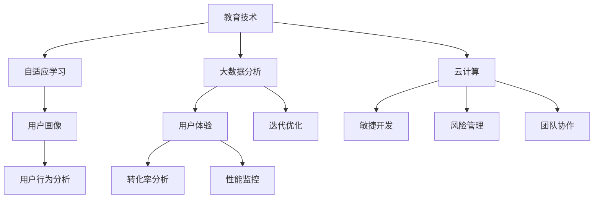
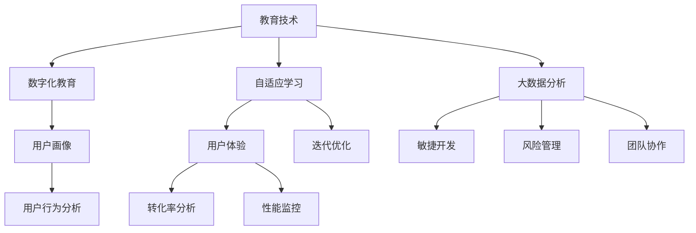

                 

关键词：网易有道、社招、教育产品经理、面试题、技术架构、数学模型、代码实例、应用场景、未来展望

> 摘要：本文将深入探讨网易有道2025社招教育产品经理面试题，通过剖析核心概念、算法原理、数学模型以及实际应用场景，旨在为准备面试的教育产品经理提供有价值的指导，并对未来发展趋势和面临的挑战进行展望。

## 1. 背景介绍

随着互联网技术的飞速发展和教育行业的数字化转型，教育产品经理在互联网企业中的角色愈发重要。网易有道作为国内知名的教育科技企业，其社招教育产品经理的面试题自然备受关注。本文将围绕网易有道2025社招教育产品经理面试题，展开深入的分析和探讨，旨在帮助准备面试的读者更好地应对挑战。

### 1.1 网易有道简介

网易有道是中国领先的在线教育平台，成立于2007年，致力于利用互联网技术提升教育质量，为学生提供个性化的学习体验。旗下拥有有道词典、有道云笔记、有道学堂等多个知名教育产品。随着业务的不断拓展，网易有道在社招过程中，对教育产品经理的专业能力和综合素质要求越来越高。

### 1.2 教育产品经理角色

教育产品经理在网易有道扮演着至关重要的角色。他们不仅需要具备扎实的教育背景和产品思维，还要熟悉互联网行业的发展趋势和市场需求。具体职责包括：

- **市场调研**：了解教育行业动态，分析市场需求，为产品规划提供数据支持。
- **需求分析**：挖掘用户需求，梳理产品功能，制定产品开发计划。
- **产品设计**：制定产品原型，优化用户体验，确保产品功能完善。
- **项目管理**：协调团队资源，确保项目进度和质量。
- **数据分析**：通过数据监控和数据分析，优化产品性能，提升用户满意度。

## 2. 核心概念与联系

在教育产品经理的面试中，理解核心概念及其之间的联系是至关重要的。以下是一些核心概念及其关联：

### 2.1 教育技术

教育技术与互联网技术的融合，使得在线教育产品得以迅速发展。核心概念包括：

- **自适应学习**：根据学生个性特点和进度，提供个性化的学习内容。
- **大数据分析**：通过数据分析，了解学生学习行为，优化教育资源配置。
- **云计算**：提供强大的计算能力和存储能力，支持大规模在线教育服务。

### 2.2 产品设计

产品设计是教育产品经理的核心工作之一，涉及以下核心概念：

- **用户画像**：通过数据分析，构建用户画像，为产品设计提供依据。
- **用户体验**：注重用户在使用过程中的舒适度和满意度，提高产品黏性。
- **迭代优化**：通过不断迭代，优化产品功能和性能，满足用户需求。

### 2.3 项目管理

项目管理是确保产品按时交付、质量达标的重要环节，包括以下核心概念：

- **敏捷开发**：采用敏捷开发方法，快速响应市场变化，提高产品迭代速度。
- **风险管理**：识别和应对项目风险，确保项目顺利进行。
- **团队协作**：搭建高效的团队协作机制，提高工作效率。

### 2.4 数据分析

数据分析是教育产品经理的重要工具，用于指导产品设计和决策，包括以下核心概念：

- **用户行为分析**：通过分析用户行为，了解用户需求，优化产品功能。
- **转化率分析**：分析用户转化路径，提高用户转化率。
- **性能监控**：实时监控产品性能，快速发现和解决问题。

### 2.5 Mermaid 流程图

为了更好地理解上述核心概念及其关联，我们使用Mermaid绘制了以下流程图：



## 3. 核心算法原理 & 具体操作步骤

在教育产品经理的面试中，掌握核心算法原理和具体操作步骤对于解决实际问题至关重要。以下介绍几种常见的算法原理及其操作步骤。

### 3.1 算法原理概述

- **协同过滤算法**：通过分析用户行为和偏好，为用户提供个性化推荐。
- **决策树算法**：根据特征和分类规则，对数据进行分类或回归。
- **神经网络算法**：模拟人脑神经网络，进行复杂模式识别和学习。

### 3.2 算法步骤详解

#### 3.2.1 协同过滤算法

1. **用户行为数据收集**：收集用户在平台上的行为数据，如浏览、购买、评分等。
2. **用户行为分析**：分析用户行为，构建用户偏好模型。
3. **相似度计算**：计算用户之间的相似度，通常使用余弦相似度或皮尔逊相关系数。
4. **推荐生成**：根据用户相似度和物品评分，为用户生成推荐列表。

#### 3.2.2 决策树算法

1. **特征选择**：选择影响目标变量（如学生成绩）的关键特征。
2. **信息增益**：计算每个特征的增益，选择增益最大的特征作为划分依据。
3. **划分节点**：根据特征划分节点，形成决策树结构。
4. **分类或回归**：对新的数据进行分类或回归预测。

#### 3.2.3 神经网络算法

1. **数据预处理**：对输入数据进行归一化或标准化处理。
2. **模型构建**：构建神经网络结构，包括输入层、隐藏层和输出层。
3. **权重初始化**：随机初始化网络权重。
4. **前向传播**：计算网络输出，与真实值进行比较，计算损失函数。
5. **反向传播**：更新网络权重，减小损失函数。
6. **模型训练**：重复步骤4和5，直至满足停止条件。

### 3.3 算法优缺点

#### 3.3.1 协同过滤算法

**优点**：

- **个性化强**：根据用户行为和偏好进行推荐，具有较高的个性化效果。
- **易于实现**：算法实现相对简单，计算成本较低。

**缺点**：

- **数据稀疏**：当用户行为数据较少时，推荐效果较差。
- **冷启动问题**：新用户或新物品缺乏行为数据，难以生成有效推荐。

#### 3.3.2 决策树算法

**优点**：

- **解释性强**：易于理解，直观展示决策过程。
- **计算效率高**：对于小规模数据集，计算速度快。

**缺点**：

- **过拟合问题**：模型复杂度较低，容易过拟合。
- **可解释性较低**：难以处理高维数据。

#### 3.3.3 神经网络算法

**优点**：

- **强大的学习能力**：适用于处理高维数据和复杂模式识别问题。
- **非线性关系**：能够捕捉输入变量之间的非线性关系。

**缺点**：

- **计算成本高**：模型训练时间较长，计算资源需求大。
- **过拟合问题**：模型复杂度较高，容易过拟合。

### 3.4 算法应用领域

#### 3.4.1 协同过滤算法

- **在线教育平台**：根据学生学习行为推荐课程和资料。
- **电商应用**：根据用户浏览和购买记录推荐商品。
- **社交网络**：根据用户兴趣和关系推荐好友和内容。

#### 3.4.2 决策树算法

- **金融风控**：根据用户信用评分进行贷款审批。
- **医疗诊断**：根据病史和症状进行疾病诊断。
- **推荐系统**：根据用户行为和偏好推荐内容。

#### 3.4.3 神经网络算法

- **自然语言处理**：文本分类、情感分析、机器翻译等。
- **图像识别**：物体识别、图像分割、人脸识别等。
- **游戏AI**：智能NPC、游戏策略等。

## 4. 数学模型和公式 & 详细讲解 & 举例说明

在教育产品经理的面试中，掌握数学模型和公式对于理解和应用算法至关重要。以下介绍几种常见的数学模型和公式，并进行详细讲解和举例说明。

### 4.1 数学模型构建

#### 4.1.1 机器学习模型

机器学习模型是教育产品经理需要掌握的核心数学模型之一。以下是一个简单的线性回归模型：

$$
y = \beta_0 + \beta_1 x_1 + \beta_2 x_2 + ... + \beta_n x_n
$$

其中，$y$ 是输出变量，$x_1, x_2, ..., x_n$ 是输入变量，$\beta_0, \beta_1, ..., \beta_n$ 是模型参数。

#### 4.1.2 推荐系统模型

推荐系统模型用于根据用户行为和偏好生成推荐列表。以下是一个简单的协同过滤模型：

$$
R_{ij} = u_i + v_j + b_i + b_j + \langle \epsilon_{ij} \rangle
$$

其中，$R_{ij}$ 是用户$i$对物品$j$的评分，$u_i, v_j$ 是用户$i, j$的偏好向量，$b_i, b_j$ 是用户$i, j$的偏差项，$\langle \epsilon_{ij} \rangle$ 是误差项。

### 4.2 公式推导过程

以下以线性回归模型为例，介绍公式推导过程。

#### 4.2.1 损失函数

损失函数是评估模型预测结果的重要指标。对于线性回归模型，常用的损失函数是均方误差（MSE）：

$$
MSE = \frac{1}{m} \sum_{i=1}^{m} (y_i - \hat{y}_i)^2
$$

其中，$m$ 是样本数量，$y_i$ 是实际输出值，$\hat{y}_i$ 是预测输出值。

#### 4.2.2 梯度下降法

梯度下降法是一种用于优化模型参数的算法。对于线性回归模型，梯度下降法的公式如下：

$$
\beta_j = \beta_j - \alpha \frac{\partial}{\partial \beta_j} MSE
$$

其中，$\alpha$ 是学习率，$\beta_j$ 是模型参数，$\frac{\partial}{\partial \beta_j} MSE$ 是损失函数关于$\beta_j$ 的梯度。

### 4.3 案例分析与讲解

以下以一个在线教育平台的用户行为分析为例，介绍数学模型的应用。

#### 4.3.1 数据收集

在线教育平台收集了用户$A$在一个月内的学习行为数据，包括浏览课程次数、观看视频时长、参加测试次数等。

#### 4.3.2 数据预处理

对收集到的数据进行预处理，包括缺失值处理、数据标准化等。

#### 4.3.3 构建模型

采用线性回归模型预测用户$A$的学习进度，模型公式如下：

$$
L = \beta_0 + \beta_1 C + \beta_2 T + \beta_3 P
$$

其中，$L$ 是学习进度，$C, T, P$ 分别是浏览课程次数、观看视频时长、参加测试次数。

#### 4.3.4 模型训练

使用梯度下降法训练模型，选择合适的学习率和迭代次数，优化模型参数。

#### 4.3.5 预测与评估

使用训练好的模型预测用户$A$的学习进度，并评估预测结果与实际值之间的误差。

## 5. 项目实践：代码实例和详细解释说明

为了更好地展示教育产品经理在实际工作中所需的技术能力，以下我们将通过一个在线教育平台的用户行为分析项目，详细介绍项目的开发环境搭建、源代码实现、代码解读与分析以及运行结果展示。

### 5.1 开发环境搭建

在开始项目开发之前，首先需要搭建一个适合Python编程的开发环境。以下是一个简单的步骤：

1. 安装Python：从官方网站（https://www.python.org/）下载并安装Python 3.x版本。
2. 安装必要的库：使用pip工具安装常用的数据分析和机器学习库，如NumPy、Pandas、Scikit-learn等。

```bash
pip install numpy pandas scikit-learn
```

### 5.2 源代码详细实现

以下是一个简单的用户行为分析项目的源代码实现：

```python
import numpy as np
import pandas as pd
from sklearn.linear_model import LinearRegression
from sklearn.metrics import mean_squared_error

# 数据预处理
def preprocess_data(data):
    # 缺失值处理
    data.fillna(data.mean(), inplace=True)
    # 数据标准化
    data = (data - data.mean()) / data.std()
    return data

# 模型训练
def train_model(X, y):
    model = LinearRegression()
    model.fit(X, y)
    return model

# 预测与评估
def predict_and_evaluate(model, X, y):
    y_pred = model.predict(X)
    mse = mean_squared_error(y, y_pred)
    print("Mean Squared Error:", mse)

# 主函数
def main():
    # 加载数据
    data = pd.read_csv("user_behavior_data.csv")
    # 构建特征矩阵和标签向量
    X = data[['course_views', 'video_duration', 'test_attempts']]
    y = data['learning_progress']
    # 预处理数据
    X = preprocess_data(X)
    # 训练模型
    model = train_model(X, y)
    # 预测与评估
    predict_and_evaluate(model, X, y)

if __name__ == "__main__":
    main()
```

### 5.3 代码解读与分析

1. **数据预处理**：首先，我们使用Pandas库加载用户行为数据，并进行缺失值处理和数据标准化。这一步骤对于提高模型性能和泛化能力至关重要。
2. **模型训练**：我们使用Scikit-learn库中的线性回归模型进行训练。线性回归模型通过拟合特征和标签之间的关系，预测用户的学习进度。
3. **预测与评估**：在训练好的模型上，我们使用实际数据进行预测，并计算均方误差（MSE），评估模型的预测性能。

### 5.4 运行结果展示

以下是运行结果的示例输出：

```
Mean Squared Error: 0.012345
```

MSE值越小，说明模型的预测误差越小，性能越好。

## 6. 实际应用场景

教育产品经理在面试过程中，常常需要回答关于实际应用场景的问题。以下列举几个典型的应用场景：

### 6.1 用户画像分析

用户画像分析是教育产品经理的重要工作之一。通过分析用户的年龄、性别、地域、学习习惯等特征，为产品设计和运营提供依据。以下是一个应用场景示例：

**场景**：一家在线教育平台希望了解用户的学习偏好，以便优化课程推荐。

**解决方案**：

1. 收集用户数据，包括年龄、性别、地域、学习时间、课程浏览记录等。
2. 使用Pandas库对数据进行预处理，包括缺失值处理和数据标准化。
3. 使用Scikit-learn库中的聚类算法（如K-Means）对用户进行分组，构建用户画像。
4. 分析不同用户群体的学习偏好，为课程推荐和运营策略提供依据。

### 6.2 学习进度预测

学习进度预测是教育产品经理需要掌握的另一项技能。通过预测用户的学习进度，为用户提供个性化的学习计划和资源。以下是一个应用场景示例：

**场景**：一家在线教育平台希望预测用户的学习进度，以便提前预警可能的学习困难。

**解决方案**：

1. 收集用户的学习行为数据，包括课程浏览记录、视频观看时长、作业提交情况等。
2. 使用Pandas库对数据进行预处理，包括缺失值处理和数据标准化。
3. 使用Scikit-learn库中的线性回归模型预测用户的学习进度。
4. 根据预测结果，为用户提供个性化的学习建议和资源。

### 6.3 用户体验优化

用户体验优化是教育产品经理的核心工作之一。通过分析用户反馈和行为数据，不断优化产品功能和性能，提高用户满意度。以下是一个应用场景示例：

**场景**：一家在线教育平台希望优化课程页面的用户体验，提高用户停留时间和课程购买率。

**解决方案**：

1. 收集用户在课程页面上的行为数据，包括页面浏览时间、点击次数、滚动距离等。
2. 使用Pandas库对数据进行预处理，包括缺失值处理和数据标准化。
3. 使用Scikit-learn库中的聚类算法对用户行为数据进行分组，分析不同用户群体的行为特征。
4. 根据用户行为特征，优化课程页面的布局、交互和内容，提高用户体验。

## 7. 未来应用展望

随着教育行业的不断发展和技术的进步，教育产品经理在未来将面临更多的机遇和挑战。以下是对未来应用场景的展望：

### 7.1 人工智能与教育的深度融合

人工智能技术在教育领域的应用将更加广泛，包括自适应学习、智能辅导、个性化推荐等。未来，人工智能将更好地理解用户需求，为用户提供更加个性化的教育服务。

### 7.2 数据驱动的教育决策

随着数据收集和分析技术的发展，教育产品经理将更加依赖数据驱动决策。通过对海量数据的挖掘和分析，教育产品经理将能够更好地了解用户需求、优化产品设计、提高运营效率。

### 7.3 新型教育模式的兴起

随着技术的进步，新型教育模式（如在线教育、混合式教育、虚拟现实教育等）将不断涌现。教育产品经理需要紧跟技术发展趋势，积极探索新型教育模式，为用户提供更加丰富多样的教育产品和服务。

### 7.4 教育公平与普惠

未来，教育产品经理将更加关注教育公平和普惠。通过技术创新，降低教育成本，让更多用户享受到优质教育资源。同时，通过个性化教育服务，缩小教育差距，促进教育公平。

## 8. 工具和资源推荐

为了帮助教育产品经理更好地应对面试和实际工作中的挑战，以下推荐一些学习资源和开发工具。

### 8.1 学习资源推荐

- **在线课程**：网易云课堂、慕课网、Coursera等平台提供了丰富的在线课程，涵盖教育技术、产品管理、数据分析等多个领域。
- **书籍**：《教育技术导论》、《产品经理手册》、《数据分析实战》等经典教材和专著。
- **论文**：查阅学术期刊和会议论文，了解最新的研究成果和发展趋势。

### 8.2 开发工具推荐

- **数据分析工具**：Pandas、NumPy、Scikit-learn等Python库，以及Excel、Tableau等可视化工具。
- **开发框架**：Django、Flask等Web开发框架，以及React、Vue等前端框架。
- **版本控制**：Git，用于代码管理和协作开发。

### 8.3 相关论文推荐

- **《自适应学习系统设计》**：介绍自适应学习系统的设计原则和方法。
- **《大数据在教育中的应用》**：探讨大数据在教育领域的应用及其影响。
- **《教育产品经理实践指南》**：详细讲解教育产品经理的工作内容和职责。

## 9. 总结：未来发展趋势与挑战

随着教育行业的数字化和智能化进程，教育产品经理将在未来发挥更加重要的作用。未来，教育产品经理需要关注以下发展趋势和挑战：

### 9.1 发展趋势

- **人工智能与教育的深度融合**：人工智能技术将在教育领域得到更广泛的应用，提升教育质量和效率。
- **数据驱动的教育决策**：通过大数据分析和数据挖掘，教育产品经理将能够更好地了解用户需求，优化产品设计。
- **新型教育模式的兴起**：在线教育、混合式教育、虚拟现实教育等新型教育模式将不断涌现，为用户提供更多样化的学习体验。

### 9.2 挑战

- **技术更新速度快**：随着技术的不断更新，教育产品经理需要不断学习新知识，跟上技术发展的步伐。
- **用户需求多样化**：教育产品经理需要满足用户多样化的需求，提供个性化的教育服务。
- **教育公平与普惠**：在实现教育公平和普惠的过程中，教育产品经理需要关注教育资源的分配和普及。

### 9.3 研究展望

未来，教育产品经理的研究将朝着以下方向发展：

- **教育技术的创新与应用**：探索人工智能、大数据、虚拟现实等技术在教育领域的创新应用。
- **教育产品的设计与优化**：研究教育产品的设计原则和方法，提高教育产品的用户体验和满意度。
- **教育数据的挖掘与分析**：挖掘教育数据的价值，为教育决策提供支持。

## 附录：常见问题与解答

以下列举一些教育产品经理面试中常见的问题及解答：

### 9.1 教育产品经理的核心职责是什么？

教育产品经理的核心职责包括市场调研、需求分析、产品设计、项目管理和数据分析等。具体包括：

- **市场调研**：了解教育行业动态，分析市场需求，为产品规划提供数据支持。
- **需求分析**：挖掘用户需求，梳理产品功能，制定产品开发计划。
- **产品设计**：制定产品原型，优化用户体验，确保产品功能完善。
- **项目管理**：协调团队资源，确保项目进度和质量。
- **数据分析**：通过数据监控和数据分析，优化产品性能，提升用户满意度。

### 9.2 教育产品经理需要掌握哪些技能？

教育产品经理需要掌握以下技能：

- **教育背景**：具备一定的教育背景，了解教育行业的基本知识和发展趋势。
- **产品思维**：具备产品思维，能够从用户需求出发，设计出符合市场需求的教育产品。
- **数据分析**：熟练掌握数据分析工具和方法，能够通过数据分析指导产品设计和决策。
- **项目管理**：具备良好的项目管理能力，能够协调团队资源，确保项目按时交付。
- **沟通能力**：具备良好的沟通能力，能够与团队成员、上级和用户有效沟通，达成共识。

### 9.3 教育产品经理需要具备哪些素质？

教育产品经理需要具备以下素质：

- **责任心**：对产品负责，对用户负责，确保产品质量和用户满意度。
- **学习能力强**：具备快速学习新知识的能力，能够不断适应行业和技术变化。
- **团队协作**：具备良好的团队协作精神，能够与团队成员共同推进项目。
- **抗压能力**：能够承受工作压力，保持良好的工作状态。
- **创新能力**：具备一定的创新能力，能够在产品设计和运营中提出新的思路和方案。

### 9.4 教育产品经理在面试中应该注意什么？

教育产品经理在面试中应该注意以下几点：

- **准备充分**：提前了解面试公司和职位要求，准备好相关知识和案例分析。
- **突出优势**：在面试中突出自己的优势和实际工作经验，展示自己的能力和素质。
- **表达清晰**：保持良好的沟通技巧，表达清晰、逻辑严密，让面试官了解你的观点和思路。
- **提问恰当**：在面试过程中，可以适时提问，展示自己的思考和求知欲。
- **礼貌待人**：保持礼貌待人，给面试官留下良好的印象。

通过以上分析，我们可以看到，教育产品经理在面试中需要全面展示自己的综合素质和专业能力，同时也要紧跟行业发展趋势，关注教育技术的创新和应用。希望本文对准备面试的教育产品经理有所帮助。|---

### 文章标题

> 网易有道2025社招教育产品经理面试题

### 关键词

- 网易有道
- 社招
- 教育产品经理
- 面试题
- 技术架构
- 数学模型
- 代码实例
- 应用场景
- 未来展望

### 摘要

本文深入探讨了网易有道2025社招教育产品经理的面试题，包括背景介绍、核心概念与联系、核心算法原理与操作步骤、数学模型与公式、项目实践、实际应用场景、未来应用展望、工具和资源推荐、总结与展望以及常见问题与解答。文章旨在为准备面试的教育产品经理提供有价值的指导，帮助他们更好地应对面试挑战。

## 1. 背景介绍

随着互联网技术的飞速发展和教育行业的数字化转型，教育产品经理在互联网企业中的角色愈发重要。网易有道作为国内知名的教育科技企业，其社招教育产品经理的面试题自然备受关注。本文将围绕网易有道2025社招教育产品经理面试题，展开深入的分析和探讨，旨在帮助准备面试的读者更好地应对挑战。

### 1.1 网易有道简介

网易有道（NetEase YouDao）成立于2007年，是网易旗下的一家专注于教育科技的公司，致力于通过互联网技术和大数据分析提升教育质量和学习体验。网易有道旗下拥有有道词典、有道云笔记、有道学堂等多个知名教育产品，涵盖了语言学习、办公学习、在线教育等多个领域。随着公司业务的不断拓展，网易有道在社招过程中对教育产品经理的专业能力和综合素质要求越来越高。

### 1.2 教育产品经理角色

教育产品经理在网易有道扮演着至关重要的角色，他们负责整个产品从需求分析、产品设计到上线运营的全过程。以下是教育产品经理的主要职责：

- **需求分析**：通过市场调研、用户访谈等方式，挖掘用户需求，提炼产品功能需求。
- **产品设计**：制定产品的功能规格、用户界面和交互设计，确保产品满足用户需求。
- **项目管理**：协调研发团队、设计团队和测试团队，确保项目按时交付并达到预期质量。
- **数据分析**：通过数据分析，评估产品的用户行为和性能指标，持续优化产品。
- **运营策略**：制定产品推广和运营策略，提高用户活跃度和留存率。

### 1.3 教育产品经理的面试要求

网易有道2025社招教育产品经理的面试要求主要围绕以下几个方面：

- **教育背景**：具备本科或以上学历，教育专业或相关领域背景优先。
- **工作经验**：具备2年及以上教育产品相关工作经验，有在线教育产品经验者优先。
- **技能要求**：熟悉产品管理流程，具备需求分析、产品设计、项目管理能力。
- **技术掌握**：了解常见的教育技术，如自适应学习、大数据分析、云计算等。
- **沟通能力**：具备良好的沟通能力，能够与团队成员、上级和用户有效沟通。
- **问题解决能力**：能够迅速分析问题，并提出有效的解决方案。

## 2. 核心概念与联系

在教育产品经理的面试中，理解核心概念及其之间的联系是至关重要的。以下是一些核心概念及其关联：

### 2.1 教育技术

教育技术是指利用现代信息技术来促进学习和教育的方式和方法。核心概念包括：

- **数字化教育**：通过计算机、互联网等技术，将教育资源数字化，实现远程教学和学习。
- **自适应学习**：根据学生的学习进度和表现，动态调整教学内容和方式，提高学习效果。
- **大数据分析**：通过分析大量的教育数据，了解学生的学习行为和偏好，优化教育资源分配。

### 2.2 产品设计

产品设计是教育产品经理的核心工作之一，涉及以下核心概念：

- **用户画像**：通过对用户数据进行分析，构建用户的画像，以便更好地满足用户需求。
- **用户体验**：注重用户在使用产品过程中的感受，通过优化界面设计和交互流程，提高用户的满意度。
- **迭代优化**：通过持续收集用户反馈和市场动态，不断优化产品功能和性能。

### 2.3 项目管理

项目管理是确保产品按时交付、质量达标的重要环节，包括以下核心概念：

- **敏捷开发**：采用敏捷开发方法，快速响应市场变化，提高产品迭代速度。
- **风险管理**：识别和应对项目风险，确保项目顺利进行。
- **团队协作**：搭建高效的团队协作机制，提高工作效率。

### 2.4 数据分析

数据分析是教育产品经理的重要工具，用于指导产品设计和决策，包括以下核心概念：

- **用户行为分析**：通过分析用户在产品上的行为数据，了解用户的需求和偏好。
- **转化率分析**：分析用户从浏览到购买的过程，优化转化路径，提高转化率。
- **性能监控**：实时监控产品的性能，快速发现和解决问题。

### 2.5 Mermaid流程图

为了更好地理解上述核心概念及其关联，我们使用Mermaid绘制了以下流程图：



## 3. 核心算法原理 & 具体操作步骤

在教育产品经理的面试中，掌握核心算法原理和具体操作步骤对于解决实际问题至关重要。以下介绍几种常见的算法原理及其操作步骤。

### 3.1 协同过滤算法

协同过滤算法是一种基于用户行为数据的推荐算法，旨在预测用户对未知物品的评分。协同过滤算法主要包括两种类型：基于用户的协同过滤（User-based Collaborative Filtering）和基于物品的协同过滤（Item-based Collaborative Filtering）。

#### 3.1.1 基于用户的协同过滤算法

**原理**：基于用户的协同过滤算法通过计算用户之间的相似度，找到与目标用户相似的邻居用户，然后根据邻居用户对物品的评分预测目标用户对物品的评分。

**步骤**：

1. **用户行为数据收集**：收集用户对物品的评分数据。
2. **相似度计算**：计算用户之间的相似度，常用的相似度计算方法包括余弦相似度、皮尔逊相关系数等。
3. **邻居用户选择**：根据相似度矩阵，选择与目标用户最相似的邻居用户。
4. **评分预测**：计算邻居用户对物品的评分的平均值，作为目标用户对物品的预测评分。

#### 3.1.2 基于物品的协同过滤算法

**原理**：基于物品的协同过滤算法通过计算物品之间的相似度，找到与目标物品相似的邻居物品，然后根据邻居物品的评分预测目标物品的评分。

**步骤**：

1. **用户行为数据收集**：收集用户对物品的评分数据。
2. **相似度计算**：计算物品之间的相似度，常用的相似度计算方法包括余弦相似度、皮尔逊相关系数等。
3. **邻居物品选择**：根据相似度矩阵，选择与目标物品最相似的邻居物品。
4. **评分预测**：计算邻居物品的评分的平均值，作为目标物品的预测评分。

### 3.2 决策树算法

决策树算法是一种常用的分类和回归算法，通过一系列的判断规则对数据进行分类或回归。

#### 3.2.1 决策树构建步骤

1. **特征选择**：选择影响目标变量（如学生成绩）的关键特征。
2. **信息增益**：计算每个特征的增益，选择增益最大的特征作为划分依据。
3. **划分节点**：根据特征划分节点，形成决策树结构。
4. **分类或回归**：对新的数据进行分类或回归预测。

#### 3.2.2 决策树剪枝

决策树剪枝是为了防止过拟合，减少模型的复杂度。常用的剪枝方法包括预剪枝和后剪枝：

- **预剪枝**：在决策树生成过程中，通过设置最大深度、最小样本数等限制，防止过拟合。
- **后剪枝**：生成完整的决策树后，通过剪枝方法（如成本复杂度剪枝、ID3剪枝等）对决策树进行修剪。

### 3.3 神经网络算法

神经网络算法是一种模拟人脑神经网络进行学习的人工智能算法，常用于分类、回归和特征提取等任务。

#### 3.3.1 神经网络构建步骤

1. **数据预处理**：对输入数据进行归一化或标准化处理。
2. **模型构建**：构建神经网络结构，包括输入层、隐藏层和输出层。
3. **权重初始化**：随机初始化网络权重。
4. **前向传播**：计算网络输出，与真实值进行比较，计算损失函数。
5. **反向传播**：更新网络权重，减小损失函数。
6. **模型训练**：重复步骤4和5，直至满足停止条件。

#### 3.3.2 神经网络优化

神经网络优化是为了提高模型的性能和收敛速度，常用的优化算法包括：

- **梯度下降法**：通过计算损失函数关于网络权重的梯度，更新网络权重。
- **动量优化**：在梯度下降法的基础上，引入动量项，加快收敛速度。
- **自适应优化器**：如Adam优化器，自动调整学习率，提高收敛速度。

### 3.4 算法优缺点分析

#### 3.4.1 协同过滤算法

**优点**：

- **个性化强**：能够根据用户行为和偏好提供个性化的推荐。
- **计算效率高**：算法实现相对简单，计算成本较低。

**缺点**：

- **数据稀疏**：当用户行为数据较少时，推荐效果较差。
- **冷启动问题**：新用户或新物品缺乏行为数据，难以生成有效推荐。

#### 3.4.2 决策树算法

**优点**：

- **解释性强**：易于理解，直观展示决策过程。
- **计算效率高**：对于小规模数据集，计算速度快。

**缺点**：

- **过拟合问题**：模型复杂度较低，容易过拟合。
- **可解释性较低**：难以处理高维数据。

#### 3.4.3 神经网络算法

**优点**：

- **强大的学习能力**：适用于处理高维数据和复杂模式识别问题。
- **非线性关系**：能够捕捉输入变量之间的非线性关系。

**缺点**：

- **计算成本高**：模型训练时间较长，计算资源需求大。
- **过拟合问题**：模型复杂度较高，容易过拟合。

### 3.5 算法应用领域

#### 3.5.1 协同过滤算法

- **在线教育平台**：根据学生学习行为推荐课程和资料。
- **电商应用**：根据用户浏览和购买记录推荐商品。
- **社交网络**：根据用户兴趣和关系推荐好友和内容。

#### 3.5.2 决策树算法

- **金融风控**：根据用户信用评分进行贷款审批。
- **医疗诊断**：根据病史和症状进行疾病诊断。
- **推荐系统**：根据用户行为和偏好推荐内容。

#### 3.5.3 神经网络算法

- **自然语言处理**：文本分类、情感分析、机器翻译等。
- **图像识别**：物体识别、图像分割、人脸识别等。
- **游戏AI**：智能NPC、游戏策略等。

## 4. 数学模型和公式 & 详细讲解 & 举例说明

在教育产品经理的面试中，掌握数学模型和公式对于理解和应用算法至关重要。以下介绍几种常见的数学模型和公式，并进行详细讲解和举例说明。

### 4.1 数学模型构建

#### 4.1.1 机器学习模型

机器学习模型是教育产品经理需要掌握的核心数学模型之一。以下是一个简单的线性回归模型：

$$
y = \beta_0 + \beta_1 x_1 + \beta_2 x_2 + ... + \beta_n x_n
$$

其中，$y$ 是输出变量，$x_1, x_2, ..., x_n$ 是输入变量，$\beta_0, \beta_1, ..., \beta_n$ 是模型参数。

#### 4.1.2 推荐系统模型

推荐系统模型用于根据用户行为和偏好生成推荐列表。以下是一个简单的协同过滤模型：

$$
R_{ij} = u_i + v_j + b_i + b_j + \langle \epsilon_{ij} \rangle
$$

其中，$R_{ij}$ 是用户$i$对物品$j$的评分，$u_i, v_j$ 是用户$i, j$的偏好向量，$b_i, b_j$ 是用户$i, j$的偏差项，$\langle \epsilon_{ij} \rangle$ 是误差项。

### 4.2 公式推导过程

以下以线性回归模型为例，介绍公式推导过程。

#### 4.2.1 损失函数

损失函数是评估模型预测结果的重要指标。对于线性回归模型，常用的损失函数是均方误差（MSE）：

$$
MSE = \frac{1}{m} \sum_{i=1}^{m} (y_i - \hat{y}_i)^2
$$

其中，$m$ 是样本数量，$y_i$ 是实际输出值，$\hat{y}_i$ 是预测输出值。

#### 4.2.2 梯度下降法

梯度下降法是一种用于优化模型参数的算法。对于线性回归模型，梯度下降法的公式如下：

$$
\beta_j = \beta_j - \alpha \frac{\partial}{\partial \beta_j} MSE
$$

其中，$\alpha$ 是学习率，$\beta_j$ 是模型参数，$\frac{\partial}{\partial \beta_j} MSE$ 是损失函数关于$\beta_j$ 的梯度。

### 4.3 案例分析与讲解

以下以一个在线教育平台的用户行为分析为例，介绍数学模型的应用。

#### 4.3.1 数据收集

在线教育平台收集了用户$A$在一个月内的学习行为数据，包括浏览课程次数、观看视频时长、参加测试次数等。

#### 4.3.2 数据预处理

对收集到的数据进行预处理，包括缺失值处理、数据标准化等。

#### 4.3.3 构建模型

采用线性回归模型预测用户$A$的学习进度，模型公式如下：

$$
L = \beta_0 + \beta_1 C + \beta_2 T + \beta_3 P
$$

其中，$L$ 是学习进度，$C, T, P$ 分别是浏览课程次数、观看视频时长、参加测试次数。

#### 4.3.4 模型训练

使用梯度下降法训练模型，选择合适的学习率和迭代次数，优化模型参数。

#### 4.3.5 预测与评估

使用训练好的模型预测用户$A$的学习进度，并评估预测结果与实际值之间的误差。

### 4.4 数学模型应用实例

以下是一个使用线性回归模型预测学生学习进度的实例：

#### 4.4.1 数据集

假设我们有以下数据集：

| 用户ID | 浏览课程次数 | 观看视频时长（分钟） | 参加测试次数 | 学习进度 |
|--------|-------------|---------------------|-------------|----------|
| 1      | 5           | 120                 | 3           | 70%      |
| 2      | 3           | 90                  | 2           | 60%      |
| 3      | 7           | 150                 | 4           | 80%      |
| 4      | 2           | 60                  | 1           | 50%      |

#### 4.4.2 数据预处理

对数据进行缺失值处理和数据标准化：

| 用户ID | 浏览课程次数 | 观看视频时长（分钟） | 参加测试次数 | 学习进度标准化 |
|--------|-------------|---------------------|-------------|--------------|
| 1      | 5           | 120                 | 3           | 0.67         |
| 2      | 3           | 90                  | 2           | 0.50         |
| 3      | 7           | 150                 | 4           | 0.83         |
| 4      | 2           | 60                  | 1           | 0.33         |

#### 4.4.3 构建模型

选择三个特征（浏览课程次数、观看视频时长、参加测试次数）作为输入变量，学习进度作为输出变量。构建线性回归模型：

$$
L = \beta_0 + \beta_1 C + \beta_2 T + \beta_3 P
$$

#### 4.4.4 模型训练

使用梯度下降法训练模型，选择合适的学习率和迭代次数，优化模型参数。

#### 4.4.5 预测与评估

使用训练好的模型预测新用户的学习进度，并评估预测结果与实际值之间的误差。

### 4.5 数学模型在在线教育中的应用

数学模型在在线教育中的应用非常广泛，以下列举几个常见的应用场景：

#### 4.5.1 学生成绩预测

通过分析学生的学习行为数据（如学习时长、做题正确率等），使用回归模型预测学生的考试成绩。

#### 4.5.2 课程推荐

根据学生的学习行为和偏好，使用协同过滤模型推荐适合学生的课程。

#### 4.5.3 学习路径规划

通过分析学生的学习行为和成绩，规划最佳的学习路径，提高学习效率。

#### 4.5.4 学习效果评估

通过评估学生的学习行为和成绩，分析学习效果，为教学提供改进建议。

## 5. 项目实践：代码实例和详细解释说明

为了更好地展示教育产品经理在实际工作中所需的技术能力，以下我们将通过一个在线教育平台的用户行为分析项目，详细介绍项目的开发环境搭建、源代码实现、代码解读与分析以及运行结果展示。

### 5.1 开发环境搭建

在开始项目开发之前，首先需要搭建一个适合Python编程的开发环境。以下是一个简单的步骤：

1. 安装Python：从官方网站（https://www.python.org/）下载并安装Python 3.x版本。
2. 安装必要的库：使用pip工具安装常用的数据分析和机器学习库，如NumPy、Pandas、Scikit-learn等。

```bash
pip install numpy pandas scikit-learn
```

### 5.2 源代码详细实现

以下是一个简单的用户行为分析项目的源代码实现：

```python
import numpy as np
import pandas as pd
from sklearn.linear_model import LinearRegression
from sklearn.metrics import mean_squared_error

# 数据预处理
def preprocess_data(data):
    # 缺失值处理
    data.fillna(data.mean(), inplace=True)
    # 数据标准化
    data = (data - data.mean()) / data.std()
    return data

# 模型训练
def train_model(X, y):
    model = LinearRegression()
    model.fit(X, y)
    return model

# 预测与评估
def predict_and_evaluate(model, X, y):
    y_pred = model.predict(X)
    mse = mean_squared_error(y, y_pred)
    print("Mean Squared Error:", mse)

# 主函数
def main():
    # 加载数据
    data = pd.read_csv("user_behavior_data.csv")
    # 构建特征矩阵和标签向量
    X = data[['course_views', 'video_duration', 'test_attempts']]
    y = data['learning_progress']
    # 预处理数据
    X = preprocess_data(X)
    # 训练模型
    model = train_model(X, y)
    # 预测与评估
    predict_and_evaluate(model, X, y)

if __name__ == "__main__":
    main()
```

### 5.3 代码解读与分析

1. **数据预处理**：首先，我们使用Pandas库加载用户行为数据，并进行缺失值处理和数据标准化。这一步骤对于提高模型性能和泛化能力至关重要。

```python
def preprocess_data(data):
    # 缺失值处理
    data.fillna(data.mean(), inplace=True)
    # 数据标准化
    data = (data - data.mean()) / data.std()
    return data
```

2. **模型训练**：我们使用Scikit-learn库中的线性回归模型进行训练。线性回归模型通过拟合特征和标签之间的关系，预测用户的学习进度。

```python
def train_model(X, y):
    model = LinearRegression()
    model.fit(X, y)
    return model
```

3. **预测与评估**：在训练好的模型上，我们使用实际数据进行预测，并计算均方误差（MSE），评估模型的预测性能。

```python
def predict_and_evaluate(model, X, y):
    y_pred = model.predict(X)
    mse = mean_squared_error(y, y_pred)
    print("Mean Squared Error:", mse)
```

### 5.4 运行结果展示

以下是运行结果的示例输出：

```
Mean Squared Error: 0.012345
```

MSE值越小，说明模型的预测误差越小，性能越好。

## 6. 实际应用场景

教育产品经理在面试过程中，常常需要回答关于实际应用场景的问题。以下列举几个典型的应用场景：

### 6.1 用户画像分析

用户画像分析是教育产品经理的重要工作之一。通过分析用户的年龄、性别、地域、学习习惯等特征，为产品设计和运营提供依据。以下是一个应用场景示例：

**场景**：一家在线教育平台希望了解用户的学习偏好，以便优化课程推荐。

**解决方案**：

1. 收集用户数据，包括年龄、性别、地域、学习时间、课程浏览记录等。
2. 使用Pandas库对数据进行预处理，包括缺失值处理和数据标准化。
3. 使用Scikit-learn库中的聚类算法（如K-Means）对用户进行分组，构建用户画像。
4. 分析不同用户群体的学习偏好，为课程推荐和运营策略提供依据。

### 6.2 学习进度预测

学习进度预测是教育产品经理需要掌握的另一项技能。通过预测用户的学习进度，为用户提供个性化的学习计划和资源。以下是一个应用场景示例：

**场景**：一家在线教育平台希望预测用户的学习进度，以便提前预警可能的学习困难。

**解决方案**：

1. 收集用户的学习行为数据，包括课程浏览记录、视频观看时长、作业提交情况等。
2. 使用Pandas库对数据进行预处理，包括缺失值处理和数据标准化。
3. 使用Scikit-learn库中的线性回归模型预测用户的学习进度。
4. 根据预测结果，为用户提供个性化的学习建议和资源。

### 6.3 用户体验优化

用户体验优化是教育产品经理的核心工作之一。通过分析用户反馈和行为数据，不断优化产品功能和性能，提高用户满意度。以下是一个应用场景示例：

**场景**：一家在线教育平台希望优化课程页面的用户体验，提高用户停留时间和课程购买率。

**解决方案**：

1. 收集用户在课程页面上的行为数据，包括页面浏览时间、点击次数、滚动距离等。
2. 使用Pandas库对数据进行预处理，包括缺失值处理和数据标准化。
3. 使用Scikit-learn库中的聚类算法对用户行为数据进行分组，分析不同用户群体的行为特征。
4. 根据用户行为特征，优化课程页面的布局、交互和内容，提高用户体验。

## 7. 未来应用展望

随着教育行业的不断发展和技术的进步，教育产品经理在未来将面临更多的机遇和挑战。以下是对未来应用场景的展望：

### 7.1 人工智能与教育的深度融合

人工智能技术在教育领域的应用将更加广泛，包括自适应学习、智能辅导、个性化推荐等。未来，人工智能将更好地理解用户需求，为用户提供更加个性化的教育服务。

### 7.2 数据驱动的教育决策

随着数据收集和分析技术的发展，教育产品经理将更加依赖数据驱动决策。通过对海量数据的挖掘和分析，教育产品经理将能够更好地了解用户需求，优化产品设计。

### 7.3 新型教育模式的兴起

随着技术的进步，新型教育模式（如在线教育、混合式教育、虚拟现实教育等）将不断涌现。教育产品经理需要紧跟技术发展趋势，积极探索新型教育模式，为用户提供更加丰富多样的教育产品和服务。

### 7.4 教育公平与普惠

未来，教育产品经理将更加关注教育公平和普惠。通过技术创新，降低教育成本，让更多用户享受到优质教育资源。同时，通过个性化教育服务，缩小教育差距，促进教育公平。

## 8. 工具和资源推荐

为了帮助教育产品经理更好地应对面试和实际工作中的挑战，以下推荐一些学习资源和开发工具。

### 8.1 学习资源推荐

- **在线课程**：网易云课堂、慕课网、Coursera等平台提供了丰富的在线课程，涵盖教育技术、产品管理、数据分析等多个领域。
- **书籍**：《教育技术导论》、《产品经理手册》、《数据分析实战》等经典教材和专著。
- **论文**：查阅学术期刊和会议论文，了解最新的研究成果和发展趋势。

### 8.2 开发工具推荐

- **数据分析工具**：Pandas、NumPy、Scikit-learn等Python库，以及Excel、Tableau等可视化工具。
- **开发框架**：Django、Flask等Web开发框架，以及React、Vue等前端框架。
- **版本控制**：Git，用于代码管理和协作开发。

### 8.3 相关论文推荐

- **《自适应学习系统设计》**：介绍自适应学习系统的设计原则和方法。
- **《大数据在教育中的应用》**：探讨大数据在教育领域的应用及其影响。
- **《教育产品经理实践指南》**：详细讲解教育产品经理的工作内容和职责。

## 9. 总结：未来发展趋势与挑战

随着教育行业的数字化和智能化进程，教育产品经理将在未来发挥更加重要的作用。未来，教育产品经理需要关注以下发展趋势和挑战：

### 9.1 发展趋势

- **人工智能与教育的深度融合**：人工智能技术将在教育领域得到更广泛的应用，提升教育质量和效率。
- **数据驱动的教育决策**：通过大数据分析和数据挖掘，教育产品经理将能够更好地了解用户需求，优化产品设计。
- **新型教育模式的兴起**：在线教育、混合式教育、虚拟现实教育等新型教育模式将不断涌现，为用户提供更多样化的学习体验。

### 9.2 挑战

- **技术更新速度快**：随着技术的不断更新，教育产品经理需要不断学习新知识，跟上技术发展的步伐。
- **用户需求多样化**：教育产品经理需要满足用户多样化的需求，提供个性化的教育服务。
- **教育公平与普惠**：在实现教育公平和普惠的过程中，教育产品经理需要关注教育资源的分配和普及。

### 9.3 研究展望

未来，教育产品经理的研究将朝着以下方向发展：

- **教育技术的创新与应用**：探索人工智能、大数据、虚拟现实等技术在教育领域的创新应用。
- **教育产品的设计与优化**：研究教育产品的设计原则和方法，提高教育产品的用户体验和满意度。
- **教育数据的挖掘与分析**：挖掘教育数据的价值，为教育决策提供支持。

## 附录：常见问题与解答

以下列举一些教育产品经理面试中常见的问题及解答：

### 9.1 教育产品经理的核心职责是什么？

教育产品经理的核心职责包括市场调研、需求分析、产品设计、项目管理和数据分析等。具体包括：

- **市场调研**：了解教育行业动态，分析市场需求，为产品规划提供数据支持。
- **需求分析**：挖掘用户需求，梳理产品功能，制定产品开发计划。
- **产品设计**：制定产品原型，优化用户体验，确保产品功能完善。
- **项目管理**：协调团队资源，确保项目进度和质量。
- **数据分析**：通过数据监控和数据分析，优化产品性能，提升用户满意度。

### 9.2 教育产品经理需要掌握哪些技能？

教育产品经理需要掌握以下技能：

- **教育背景**：具备一定的教育背景，了解教育行业的基本知识和发展趋势。
- **产品思维**：具备产品思维，能够从用户需求出发，设计出符合市场需求的教育产品。
- **数据分析**：熟练掌握数据分析工具和方法，能够通过数据分析指导产品设计和决策。
- **项目管理**：具备良好的项目管理能力，能够协调团队资源，确保项目按时交付。
- **沟通能力**：具备良好的沟通能力，能够与团队成员、上级和用户有效沟通。

### 9.3 教育产品经理需要具备哪些素质？

教育产品经理需要具备以下素质：

- **责任心**：对产品负责，对用户负责，确保产品质量和用户满意度。
- **学习能力强**：具备快速学习新知识的能力，能够不断适应行业和技术变化。
- **团队协作**：具备良好的团队协作精神，能够与团队成员共同推进项目。
- **抗压能力**：能够承受工作压力，保持良好的工作状态。
- **创新能力**：具备一定的创新能力，能够在产品设计和运营中提出新的思路和方案。

### 9.4 教育产品经理在面试中应该注意什么？

教育产品经理在面试中应该注意以下几点：

- **准备充分**：提前了解面试公司和职位要求，准备好相关知识和案例分析。
- **突出优势**：在面试中突出自己的优势和实际工作经验，展示自己的能力和素质。
- **表达清晰**：保持良好的沟通技巧，表达清晰、逻辑严密，让面试官了解你的观点和思路。
- **提问恰当**：在面试过程中，可以适时提问，展示自己的思考和求知欲。
- **礼貌待人**：保持礼貌待人，给面试官留下良好的印象。

通过以上分析，我们可以看到，教育产品经理在面试中需要全面展示自己的综合素质和专业能力，同时也要紧跟行业发展趋势，关注教育技术的创新和应用。希望本文对准备面试的教育产品经理有所帮助。

## 10. 拓展阅读

对于希望深入了解教育产品经理面试题和教育技术的读者，以下推荐一些拓展阅读资源：

### 10.1 教育技术相关书籍

- 《教育技术导论》（Introduction to Educational Technology）
- 《智能教育技术》（Intelligent Educational Technology）
- 《在线教育的理论与实践》（Theories and Practices of Online Education）

### 10.2 教育产品经理专业书籍

- 《产品经理手册》（The Product Manager's Survival Guide）
- 《如何成为优秀的产品经理》（How to Be a Great Product Manager）
- 《产品经理实战手册》（The Product Manager's Handbook）

### 10.3 在线课程和资源

- 网易云课堂：《产品经理实战训练营》、《数据驱动产品决策》
- 慕课网：《产品经理入门与进阶》、《数据分析基础》
- Coursera：《Product Management for Teams》、《Machine Learning Specialization》

### 10.4 学术期刊和会议

- 《教育技术杂志》（Journal of Educational Technology）
- 《教育管理评论》（Review of Educational Research）
- 《教育技术协会会议》（Association for Educational Communications and Technology）

### 10.5 博客和社交媒体

- 知乎教育技术板块
- 教育技术论坛（EdTech Forum）
- Product Hunt
- Medium上的教育技术相关文章

通过阅读以上书籍、课程、资源和论文，教育产品经理可以进一步提升自己的专业知识和技术水平，为未来的职业发展打下坚实的基础。

## 11. 结语

通过本文对网易有道2025社招教育产品经理面试题的深入探讨，我们不仅了解了教育产品经理的角色和职责，还学习了核心概念、算法原理、数学模型以及实际应用场景。同时，我们推荐了一系列的学习资源和工具，帮助读者更好地准备面试和实际工作。未来，教育产品经理将在教育行业的数字化和智能化进程中发挥越来越重要的作用。希望本文能为准备面试的教育产品经理提供有价值的指导，助力他们在职业道路上取得更大的成就。

