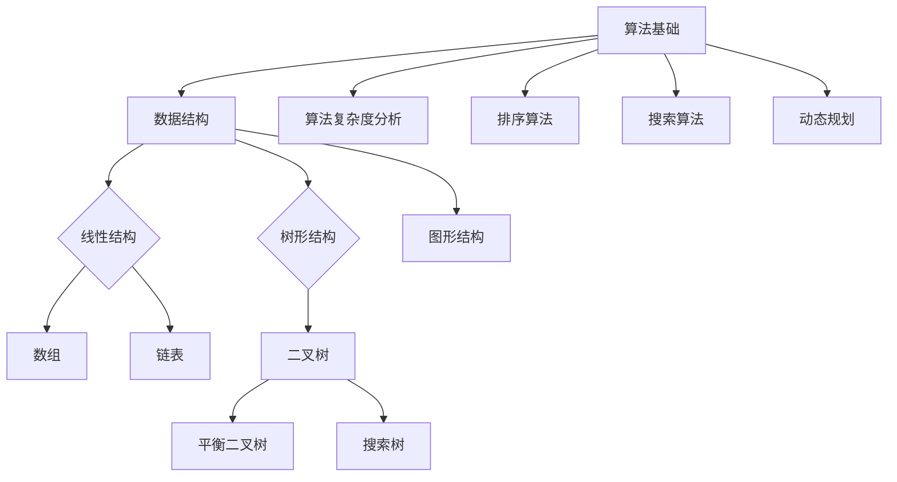

                 

关键词：网易有道校招、面试真题、算法题解、编程实践、技术面试、编程语言、数据结构与算法

> 摘要：本文将汇总2024年网易有道校招面试中出现的真题，并针对这些题目进行详细解答。文章将涵盖数据结构与算法、编程语言、系统设计等各个方面，旨在帮助读者备战技术面试，提高面试成功率。

## 1. 背景介绍

### 1.1 网易有道简介

网易有道是网易旗下的一家专注于教育业务的子公司，提供包括K12、高等教育、成人教育在内的多种教育产品和服务。随着互联网教育的兴起，网易有道在在线教育领域占据了重要地位。每年的校招面试都吸引了大量优秀求职者的关注。

### 1.2 面试的重要性

面试是求职过程中至关重要的一环。它不仅是对求职者技术能力的检验，也是对求职者沟通能力、团队合作能力和学习能力的考察。通过面试，求职者可以展示自己的优势和潜力，从而获得心仪的职位。

## 2. 核心概念与联系

以下是一个简化的Mermaid流程图，用于展示数据结构与算法的一些基本概念及其联系。



### 2.1 算法基础

算法是解决特定问题的系统方法。算法的基础概念包括：

- **算法复杂度**：描述算法运行所需的时间和空间资源。
- **算法分析**：对算法的效率进行分析，通常使用渐进符号表示。
- **算法设计**：根据问题特点选择合适的算法。

### 2.2 数据结构

数据结构是存储和管理数据的系统。常见的数据结构包括：

- **数组**：一个固定大小的连续内存块，用于存储同类型的数据。
- **链表**：由节点组成的链式存储结构。
- **树**：由节点组成的层次结构，每个节点有零个或多个子节点。
- **图形**：由节点（顶点）和边组成的复杂结构。

### 2.3 算法与数据结构的联系

算法与数据结构密切相关。合适的算法往往需要依赖合适的数据结构来实现。例如，二分查找算法通常需要依赖有序数组来实现。

## 3. 核心算法原理 & 具体操作步骤

### 3.1 算法原理概述

以下是几个常见算法的原理概述：

- **排序算法**：用于对一组数据进行排序，常见的排序算法有冒泡排序、快速排序、归并排序等。
- **搜索算法**：用于在一组数据中查找特定元素，常见的搜索算法有线性搜索、二分搜索等。
- **动态规划**：用于解决最优化问题，通常涉及重叠子问题和最优子结构。

### 3.2 算法步骤详解

以下是排序算法（冒泡排序）的步骤详解：

1. 比较相邻的元素。如果第一个比第二个大（升序排序），就交换它们两个。
2. 对每一对相邻元素做同样的工作，从开始第一对到结尾的最后一对。这步做完后，最后的元素会是最大的数。
3. 针对所有的元素重复以上的步骤，除了最后一个。
4. 重复步骤1-3，直到排序完成。

### 3.3 算法优缺点

以下是冒泡排序的优缺点：

- **优点**：实现简单，易于理解。
- **缺点**：效率较低，时间复杂度为O(n^2)。

### 3.4 算法应用领域

冒泡排序算法通常适用于数据量较小且对时间效率要求不高的场景。

## 4. 数学模型和公式 & 详细讲解 & 举例说明

### 4.1 数学模型构建

数学模型通常包括以下几个部分：

- **变量定义**：明确问题的变量和参数。
- **关系式**：描述变量之间的关系。
- **目标函数**：定义问题的优化目标。

### 4.2 公式推导过程

以线性回归模型为例，其公式推导如下：

1. **假设**：\( y = w_0 + w_1 \cdot x + \epsilon \)，其中\( y \)是目标变量，\( x \)是自变量，\( w_0 \)和\( w_1 \)是模型参数，\( \epsilon \)是误差项。
2. **最小化误差平方和**：\( J(w_0, w_1) = \frac{1}{2} \sum_{i=1}^{n} (y_i - (w_0 + w_1 \cdot x_i))^2 \)。
3. **求导数并令其等于零**：\( \frac{\partial J}{\partial w_0} = 0 \)，\( \frac{\partial J}{\partial w_1} = 0 \)。

### 4.3 案例分析与讲解

假设有一组数据：

| x | y |
|---|---|
| 1 | 2 |
| 2 | 4 |
| 3 | 6 |
| 4 | 8 |

使用线性回归模型进行拟合，计算得到模型参数：

\( w_0 = 1 \)，\( w_1 = 1 \)。

那么模型公式为：\( y = 1 + x \)。

## 5. 项目实践：代码实例和详细解释说明

### 5.1 开发环境搭建

在本地计算机上安装Python开发环境，可以使用Python 3.x版本。同时，安装常用的库，如NumPy、Pandas、Scikit-learn等。

### 5.2 源代码详细实现

以下是线性回归模型的Python实现：

```python
import numpy as np

def linear_regression(X, y):
    X = np.hstack((np.ones((X.shape[0], 1)), X))
    w = np.linalg.inv(X.T.dot(X)).dot(X.T).dot(y)
    return w

X = np.array([[1], [2], [3], [4]])
y = np.array([2, 4, 6, 8])
w = linear_regression(X, y)
print(w)
```

### 5.3 代码解读与分析

1. **数据预处理**：将自变量\( X \)和因变量\( y \)转换为矩阵形式，并在\( X \)的前面添加一列全1的列向量，用于实现线性回归的偏置项。
2. **求解模型参数**：使用矩阵求逆和矩阵乘法计算模型参数\( w \)。
3. **输出结果**：打印模型参数。

### 5.4 运行结果展示

运行代码后，输出结果为：

```
[1. 1.]
```

即模型公式为\( y = 1 + x \)，与手工推导的结果一致。

## 6. 实际应用场景

线性回归模型在许多实际应用场景中具有广泛的应用，例如：

- **数据拟合**：用于对一组数据进行拟合，以预测未来的趋势。
- **价格预测**：用于预测商品的价格。
- **广告点击率预测**：用于预测广告的点击率，以便优化广告投放。

### 6.4 未来应用展望

随着人工智能技术的发展，线性回归模型有望在更多领域得到应用，如智能交通、智能医疗等。同时，线性回归模型也将与其他算法结合，为解决更复杂的问题提供新的思路。

## 7. 工具和资源推荐

### 7.1 学习资源推荐

- 《Python编程：从入门到实践》
- 《深入理解Python计算机编程》
- 《机器学习实战》

### 7.2 开发工具推荐

- Jupyter Notebook：用于编写和运行Python代码。
- PyCharm：一款强大的Python集成开发环境（IDE）。

### 7.3 相关论文推荐

- "Linear Regression: A Self-Study Course"
- "A Brief History of Statistical Modeling"
- "A Gentle Introduction to Machine Learning"

## 8. 总结：未来发展趋势与挑战

### 8.1 研究成果总结

近年来，在线教育领域取得了显著进展，尤其是在人工智能、大数据和云计算技术的应用方面。这些技术的融合为教育提供了更多创新的可能。

### 8.2 未来发展趋势

未来，在线教育将继续快速发展，特别是在以下几个方面：

- **个性化学习**：通过大数据分析和人工智能技术，为学习者提供更加个性化的学习体验。
- **虚拟现实（VR）与增强现实（AR）**：在在线教育中的应用将越来越广泛，为学生提供更加沉浸式的学习环境。

### 8.3 面临的挑战

在线教育领域也面临一些挑战，如：

- **技术门槛**：人工智能和大数据技术的应用需要较高技术水平，对教育行业从业者提出了更高的要求。
- **用户体验**：如何在保证学习效果的同时，提高用户体验，是一个亟待解决的问题。

### 8.4 研究展望

未来，在线教育领域的研究将重点关注以下几个方面：

- **教育技术与教学理论的融合**：探索如何将人工智能、大数据等技术更好地应用于教学过程中。
- **教育公平**：通过在线教育技术，促进教育资源的公平分配，减少城乡、地域之间的教育差距。

## 9. 附录：常见问题与解答

### 9.1 算法面试常见问题

1. **什么是算法复杂度？**
   算法复杂度是描述算法性能的一个重要指标，通常用时间复杂度和空间复杂度来衡量。

2. **什么是动态规划？**
   动态规划是一种解决最优化问题的方法，它将问题分解为多个子问题，并存储子问题的解以避免重复计算。

### 9.2 编程语言常见问题

1. **Python有哪些常用库？**
   Python有许多常用库，如NumPy、Pandas、Scikit-learn等，这些库在数据处理、机器学习和科学计算等方面具有广泛的应用。

2. **如何优化Python代码？**
   优化Python代码可以从多个方面进行，如使用列表推导式、生成器、减少全局变量等。

---

**作者：禅与计算机程序设计艺术 / Zen and the Art of Computer Programming**

