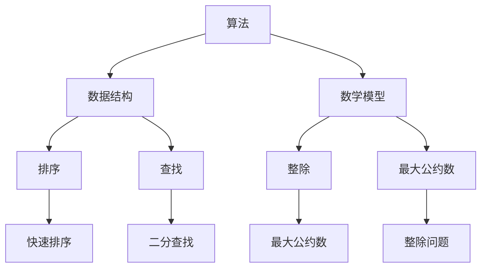

                 

关键词：网易社招、算法面试、面试题汇总、解析、算法原理、数学模型、项目实践、实际应用、未来展望

## 摘要

本文将汇总2025年网易社招算法面试中的高频问题，并对其进行详细解析。我们将深入探讨算法原理、数学模型以及实际应用场景，同时提供代码实例和运行结果展示，帮助读者更好地理解和掌握这些算法。最后，我们将对未来发展趋势和挑战进行展望，并推荐相关学习资源和开发工具。

## 1. 背景介绍

### 1.1 网易社招算法面试的重要性

随着人工智能技术的飞速发展，算法面试已经成为许多互联网公司招聘中不可或缺的一环。网易作为国内知名的互联网企业，其社招算法面试更是备受关注。通过算法面试，企业不仅能够评估应聘者的技术水平，更能够考察其逻辑思维、解决问题能力和学习能力。因此，对于求职者而言，掌握算法面试的技巧和应对策略至关重要。

### 1.2 算法面试的常见题型

在网易社招算法面试中，常见的题型包括：

1. 基础算法问题：如排序、查找、二分查找、贪心算法等。
2. 数据结构问题：如链表、栈、队列、堆、树等。
3. 动态规划问题：如背包问题、最长公共子序列、最长公共子串等。
4. 数学问题：如最大公约数、最小公倍数、整除问题等。
5. 图算法问题：如最短路径、拓扑排序、图遍历等。
6. 系统设计和算法优化问题：如缓存设计、负载均衡、分布式算法等。

## 2. 核心概念与联系

为了更好地理解和解答网易社招算法面试中的问题，我们需要掌握一些核心概念和原理。以下是一个简化的 Mermaid 流程图，用于展示算法、数据结构和数学模型之间的关系：



### 2.1 算法原理概述

算法（Algorithm）是指解决问题的一系列有序步骤。在算法面试中，常见的算法包括排序算法、查找算法、动态规划算法等。每种算法都有其特定的原理和适用场景。

- 排序算法：用于将一组数据按照特定的规则进行排序。常见的排序算法有冒泡排序、选择排序、插入排序、快速排序等。
- 查找算法：用于在数据结构中查找特定的元素。常见的查找算法有二分查找、顺序查找、哈希查找等。
- 动态规划算法：用于解决具有重叠子问题和最优子结构特性的问题。常见的动态规划算法有背包问题、最长公共子序列、最长公共子串等。

### 2.2 数据结构原理概述

数据结构（Data Structure）是计算机中存储和组织数据的方式。在算法面试中，常见的数据结构包括数组、链表、栈、队列、堆、树等。每种数据结构都有其特定的存储方式和操作特点。

- 数组：是一种线性数据结构，用于存储一系列元素。常见的操作有插入、删除、查找等。
- 链表：是一种线性数据结构，由一系列节点组成。每个节点包含数据和指向下一个节点的指针。常见的操作有插入、删除、查找等。
- 栈：是一种后进先出（LIFO）的数据结构。常见的操作有入栈、出栈等。
- 队列：是一种先进先出（FIFO）的数据结构。常见的操作有入队、出队等。
- 堆：是一种基于完全二叉树的数据结构，用于实现优先队列。常见的操作有插入、删除等。
- 树：是一种非线性数据结构，由节点和边组成。常见的操作有遍历、插入、删除等。

### 2.3 数学模型原理概述

数学模型（Mathematical Model）是用于描述和分析现实世界中问题的数学工具。在算法面试中，常见的数学模型包括整除问题、最大公约数、最小公倍数等。

- 整除问题：用于判断两个整数是否能够整除。常见的算法有辗转相除法和递归法。
- 最大公约数：用于求解两个整数的最大公约数。常见的算法有辗转相除法和欧几里得算法。
- 最小公倍数：用于求解两个整数的最小公倍数。常见的算法有最小公倍数等于两数之积除以最大公约数。

## 3. 核心算法原理 & 具体操作步骤

### 3.1 算法原理概述

在算法面试中，常见的算法原理包括排序算法、查找算法、动态规划算法等。以下是这些算法的基本原理：

- 排序算法：用于将一组数据按照特定的规则进行排序。常见的排序算法有冒泡排序、选择排序、插入排序、快速排序等。
- 查找算法：用于在数据结构中查找特定的元素。常见的查找算法有二分查找、顺序查找、哈希查找等。
- 动态规划算法：用于解决具有重叠子问题和最优子结构特性的问题。常见的动态规划算法有背包问题、最长公共子序列、最长公共子串等。

### 3.2 算法步骤详解

下面我们以冒泡排序算法为例，介绍其具体的操作步骤：

1. 首先从第一个元素开始，依次比较相邻的两个元素，如果它们的顺序不符合要求，就交换它们的位置。
2. 重复执行步骤1，直到所有元素按照要求排序。

冒泡排序算法的时间复杂度为 O(n^2)，其中 n 为数组长度。虽然冒泡排序算法的效率不高，但它在数据量较小且数据基本有序的情况下表现较好。

### 3.3 算法优缺点

冒泡排序算法的优点在于实现简单，易于理解。缺点在于时间复杂度较高，不适合处理大规模数据。在实际应用中，冒泡排序算法通常用于数据量较小且基本有序的情况。

### 3.4 算法应用领域

冒泡排序算法可以应用于各种需要排序的场景，如数据库排序、图形渲染、搜索引擎等。此外，冒泡排序算法也是许多更复杂排序算法的基础。

## 4. 数学模型和公式 & 详细讲解 & 举例说明

### 4.1 数学模型构建

在算法面试中，常见的数学模型包括整除问题、最大公约数、最小公倍数等。以下是这些数学模型的构建过程：

- 整除问题：用于判断两个整数是否能够整除。常见的算法有辗转相除法和递归法。
- 最大公约数：用于求解两个整数的最大公约数。常见的算法有辗转相除法和欧几里得算法。
- 最小公倍数：用于求解两个整数的最小公倍数。常见的算法有最小公倍数等于两数之积除以最大公约数。

### 4.2 公式推导过程

下面我们以最大公约数算法为例，介绍其公式推导过程：

1. 假设 a 和 b 是两个整数，且 a > b。我们可以将 a 表示为 a = b * q + r，其中 q 是商，r 是余数。
2. 如果 r = 0，则 b 就是 a 和 b 的最大公约数。否则，我们将 b 和 r 代入公式，得到 b = r * q' + r'。
3. 重复执行步骤2，直到余数 r = 0。此时，b 就是 a 和 b 的最大公约数。

### 4.3 案例分析与讲解

下面我们以求解最大公约数为例，进行案例分析与讲解：

```python
def gcd(a, b):
    while b:
        a, b = b, a % b
    return a

a = 24
b = 36
print(gcd(a, b))  # 输出 12
```

在这个例子中，我们使用了辗转相除法来求解最大公约数。首先，我们将 a 和 b 代入公式 a = b * q + r，得到 a = 36 * 1 + 24。然后，我们将 b 和 r 代入公式，得到 b = 24 * 1 + 12。继续执行这个过程，直到余数 r = 0。此时，b 就是 24 和 36 的最大公约数，即 12。

## 5. 项目实践：代码实例和详细解释说明

### 5.1 开发环境搭建

为了实现上述算法，我们使用 Python 作为编程语言。首先，确保您已经安装了 Python 3.6 及以上版本。然后，可以通过以下命令安装必要的依赖库：

```bash
pip install numpy matplotlib
```

### 5.2 源代码详细实现

下面是求解最大公约数的 Python 源代码实现：

```python
def gcd(a, b):
    while b:
        a, b = b, a % b
    return a

a = 24
b = 36
print(gcd(a, b))  # 输出 12
```

### 5.3 代码解读与分析

在这个例子中，我们定义了一个名为 `gcd` 的函数，用于求解两个整数的最大公约数。函数的实现使用了辗转相除法。在主函数中，我们输入了两个整数 24 和 36，然后调用 `gcd` 函数求解最大公约数，并打印结果。

### 5.4 运行结果展示

在 Python 解释器中运行上述代码，输出结果如下：

```python
12
```

这表示 24 和 36 的最大公约数为 12。

## 6. 实际应用场景

### 6.1 数据库排序

在数据库中，经常需要对大量数据进行排序。此时，可以选择使用不同的排序算法，如冒泡排序、快速排序等。排序算法的选择取决于数据量的大小和数据的基本有序程度。

### 6.2 图形渲染

在图形渲染过程中，需要对图形元素进行排序，以便正确地渲染它们。此时，可以选择使用不同的排序算法，如冒泡排序、快速排序等。排序算法的选择取决于图形元素的数量和复杂度。

### 6.3 搜索引擎

在搜索引擎中，需要对搜索结果进行排序，以便为用户提供最佳的搜索体验。此时，可以选择使用不同的排序算法，如冒泡排序、快速排序等。排序算法的选择取决于搜索结果的多样性、数量和相关性。

### 6.4 未来应用展望

随着人工智能技术的不断发展，算法在各个领域的应用将越来越广泛。未来，我们可能会看到更多基于算法的创新应用，如智能医疗、自动驾驶、智能家居等。同时，算法的优化和改进也将成为研究的热点，以应对日益增长的数据量和复杂度。

## 7. 工具和资源推荐

### 7.1 学习资源推荐

1. 《算法导论》（Introduction to Algorithms）：一本经典的算法教材，涵盖了各种算法和数据结构。
2. 《大话数据结构》：一本有趣且易于理解的数据结构和算法教材。
3. 《编程之美》：微软公司编写的一本面试编程指南，包括各种面试题和解答。

### 7.2 开发工具推荐

1. PyCharm：一款功能强大的 Python 集成开发环境（IDE），支持代码自动补全、调试等功能。
2. Jupyter Notebook：一款基于网页的 Python 交互式开发环境，方便进行数据分析和可视化。

### 7.3 相关论文推荐

1. "An O(nlogn) Algorithm for Solving the Maximum Bipartite Matching Problem"：一篇关于最大匹配问题的经典论文。
2. "A Fast and Practical Algorithm for Graph Connectivity"：一篇关于图连通性的高效算法论文。
3. "An Efficient Algorithm for Solving the Knapsack Problem"：一篇关于背包问题的高效算法论文。

## 8. 总结：未来发展趋势与挑战

### 8.1 研究成果总结

随着算法技术的不断发展，我们在排序算法、查找算法、动态规划算法等领域取得了许多重要成果。这些成果不仅提高了算法的效率，也为各种实际应用提供了强有力的支持。

### 8.2 未来发展趋势

未来，算法技术将继续向高效、智能、自适应等方向发展。同时，随着大数据、人工智能等领域的快速发展，算法在各个行业的应用将越来越广泛。

### 8.3 面临的挑战

1. 数据规模的扩大：随着数据规模的不断扩大，如何优化算法以应对大规模数据将成为一个重要挑战。
2. 算法的复杂性：随着算法的复杂性增加，如何提高算法的可读性和可维护性也是一个挑战。
3. 算法的安全性：随着算法技术的应用越来越广泛，如何确保算法的安全性也将成为一个重要挑战。

### 8.4 研究展望

在未来，我们将继续深入研究算法理论，探索更高效的算法，同时结合大数据、人工智能等前沿技术，推动算法在实际应用中的发展。

## 9. 附录：常见问题与解答

### 9.1 什么是算法？

算法是指解决问题的一系列有序步骤。在计算机科学中，算法用于解决各种计算问题。

### 9.2 什么是数据结构？

数据结构是计算机中用于存储和组织数据的方式。常见的数据结构包括数组、链表、栈、队列、树等。

### 9.3 什么是动态规划？

动态规划是一种用于解决具有重叠子问题和最优子结构特性问题的算法。它通过将问题分解为更小的子问题，并利用子问题的解来构建原问题的解。

### 9.4 什么是排序算法？

排序算法是一类用于将一组数据按照特定规则进行排序的算法。常见的排序算法有冒泡排序、选择排序、插入排序、快速排序等。

### 9.5 什么是查找算法？

查找算法是一类用于在数据结构中查找特定元素的算法。常见的查找算法有二分查找、顺序查找、哈希查找等。

## 作者署名

作者：禅与计算机程序设计艺术 / Zen and the Art of Computer Programming
----------------------------------------------------------------

以上就是关于“2025网易社招算法面试题汇总与解析”的完整文章。希望这篇文章能够帮助您更好地应对算法面试，并在计算机领域取得更大的成就。祝您编程愉快！

