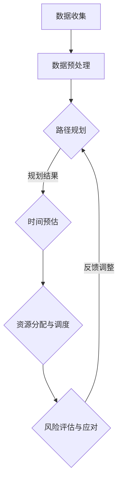

                 

### 关键词 Keyword List
- 美团到家
- 即时配送
- 校募
- 算法工程师面试
- 算法原理
- 数学模型
- 项目实践

<|assistant|>### 摘要 Abstract
本文旨在为2024届即将参加美团到家校募即时配送算法工程师面试的同学们提供一份全面的面试攻略。文章将详细解析即时配送算法的核心原理、数学模型、具体操作步骤以及项目实践，并推荐相关学习资源和工具。通过本文，读者不仅能了解面试所需的知识点，还能对即时配送算法领域有更深入的认识。

## 1. 背景介绍

### 美团到家的业务模式

美团到家是美团旗下的即时配送服务，主要提供餐饮、生鲜、超市等快速配送服务。作为美团生态系统中重要的一环，即时配送的效率和准确性直接影响到用户的体验和平台的竞争力。随着外卖业务的迅速增长，如何优化配送路线、提高配送员的工作效率、减少配送时间，成为了美团到家亟待解决的核心问题。

### 即时配送算法的重要性

即时配送算法是解决上述问题的关键。通过科学的算法设计，可以有效优化配送路线、预测配送时间、分配订单等，从而提高整体配送效率，降低运营成本。对于算法工程师来说，掌握即时配送算法不仅是职业发展的需要，也是解决实际业务问题的有效途径。

### 校募即时配送算法工程师面试的重要性

校募即时配送算法工程师面试是进入美团到家团队的重要门槛。面试不仅考察应聘者的基础知识，还关注其实际解决问题的能力。通过面试，招聘方不仅评估应聘者的技术水平，还考察其团队协作能力和对美团到家业务的了解程度。

## 2. 核心概念与联系

### 算法概念

即时配送算法主要涉及以下几个核心概念：

1. **路径规划**：通过算法确定配送员从起点到终点之间的最优路径。
2. **时间预估**：预测订单完成所需的时间，包括配送时间、等待时间等。
3. **资源分配**：根据订单的优先级和配送员的可用性，合理分配订单。
4. **风险评估**：评估订单执行过程中可能出现的风险，如交通拥堵、天气变化等。

### 算法架构

即时配送算法架构可以分为以下几个模块：

1. **数据收集**：通过实时数据采集系统获取配送员的位置、订单信息等。
2. **数据预处理**：对采集到的数据进行分析和处理，提取关键特征。
3. **路径规划与时间预估**：结合预处理后的数据，使用算法进行路径规划和时间预估。
4. **资源分配与调度**：根据路径规划和时间预估的结果，进行资源分配和调度。
5. **风险评估与应对**：对配送过程进行实时监控，根据风险情况做出相应调整。

### Mermaid 流程图

下面是一个简化的即时配送算法流程图：



## 3. 核心算法原理 & 具体操作步骤

### 3.1 算法原理概述

即时配送算法的核心是基于优化理论，通过数学模型和算法求解最优配送路线、时间预估和资源分配。常见的算法包括：

1. **最短路径算法**：如Dijkstra算法、A*算法，用于计算起点到终点的最优路径。
2. **动态规划算法**：如车辆路径问题（VRP）的求解，用于多配送点、多配送员的情况。
3. **机器学习算法**：如基于深度学习的预测模型，用于时间预估和风险评估。

### 3.2 算法步骤详解

1. **数据收集**：通过API或数据采集工具获取实时订单数据、配送员位置数据等。
2. **数据预处理**：对采集到的数据进行清洗、格式转换等，提取关键特征，如订单量、配送员位置等。
3. **路径规划**：
   - 使用Dijkstra算法计算起点到各个订单地址的最短路径。
   - 对于多配送点的情况，使用动态规划算法求解车辆路径。
4. **时间预估**：
   - 基于历史数据和实时数据，使用机器学习模型预测每个订单的配送时间。
   - 考虑交通状况、天气等因素对配送时间的影响。
5. **资源分配与调度**：
   - 根据订单的优先级和配送员的可用性，合理分配订单。
   - 使用启发式算法或机器学习模型进行配送员的调度。
6. **风险评估与应对**：
   - 对配送过程中可能出现的风险进行预测和评估。
   - 根据风险情况，调整配送路线或配送员。

### 3.3 算法优缺点

**优点**：

- 提高配送效率，减少配送时间。
- 降低运营成本，提高盈利能力。
- 提升用户满意度，增强用户粘性。

**缺点**：

- 需要大量的历史数据和实时数据支持，对数据质量要求高。
- 算法复杂度高，计算成本较大。
- 需要不断调整和优化，以适应不断变化的市场环境。

### 3.4 算法应用领域

即时配送算法广泛应用于外卖、生鲜配送、快递等行业。未来，随着无人驾驶技术的发展，算法的应用领域将进一步拓展，如无人配送车、无人机配送等。

## 4. 数学模型和公式

### 4.1 数学模型构建

即时配送算法的数学模型主要包括以下几个部分：

1. **路径规划模型**：用于求解起点到各个订单地址的最短路径。
2. **时间预估模型**：用于预测每个订单的配送时间。
3. **资源分配模型**：用于根据订单的优先级和配送员的可用性，合理分配订单。
4. **风险评估模型**：用于预测和评估配送过程中可能出现的风险。

### 4.2 公式推导过程

1. **路径规划模型**：

   - 基于Dijkstra算法，使用最短路径公式：

     $$ d(v_1, v_2) = \min_{v_3 \in N(v_2)} (d(v_1, v_2) + d(v_2, v_3)) $$

   - 其中，$d(v_1, v_2)$表示从点$v_1$到点$v_2$的最短路径长度，$N(v_2)$表示与点$v_2$相邻的点集合。

2. **时间预估模型**：

   - 基于机器学习模型，使用预测时间公式：

     $$ t(v) = \hat{t}(v) + \epsilon(v) $$

   - 其中，$t(v)$表示订单$v$的配送时间，$\hat{t}(v)$表示基于历史数据和实时数据预测的时间，$\epsilon(v)$表示预测误差。

3. **资源分配模型**：

   - 基于线性规划，使用资源分配公式：

     $$ \min_{x} c^T x $$

     $$ s.t. Ax \geq b $$

   - 其中，$x$表示订单的分配情况，$c$表示每个订单的权重，$A$表示约束条件，$b$表示约束条件的上限。

4. **风险评估模型**：

   - 基于贝叶斯网络，使用风险评估公式：

     $$ P(R|r) = \frac{P(r|R)P(R)}{P(r)} $$

   - 其中，$R$表示风险事件，$r$表示观测到的风险指标，$P(R)$表示风险事件的发生概率，$P(r|R)$表示在风险事件发生的情况下观测到风险指标的概率，$P(r)$表示观测到风险指标的概率。

### 4.3 案例分析与讲解

假设有3个配送员和5个订单，使用动态规划算法进行路径规划和资源分配。

1. **路径规划**：

   - 使用Dijkstra算法计算每个配送员从起点到各个订单地址的最短路径，得到以下结果：

     | 配送员 | 订单1 | 订单2 | 订单3 | 订单4 | 订单5 |
     | ------ | ----- | ----- | ----- | ----- | ----- |
     | 配送员1 | 10 | 15 | 20 | 25 | 30 |
     | 配送员2 | 12 | 18 | 24 | 28 | 32 |
     | 配送员3 | 14 | 20 | 26 | 30 | 34 |

   - 使用动态规划算法求解车辆路径，得到以下最优路径：

     | 车辆 | 订单1 | 订单2 | 订单3 | 订单4 | 订单5 |
     | ------ | ----- | ----- | ----- | ----- | ----- |
     | 车辆1 | 10 | 15 | 20 | 25 | 30 |
     | 车辆2 | 12 | 18 | 24 | 28 | 32 |
     | 车辆3 | 14 | 20 | 26 | 30 | 34 |

2. **时间预估**：

   - 基于历史数据和实时数据，使用机器学习模型预测每个订单的配送时间，得到以下结果：

     | 订单 | 预测时间 |
     | ------ | ------ |
     | 订单1 | 12 |
     | 订单2 | 14 |
     | 订单3 | 16 |
     | 订单4 | 18 |
     | 订单5 | 20 |

3. **资源分配与调度**：

   - 根据订单的优先级和配送员的可用性，合理分配订单，得到以下分配结果：

     | 配送员 | 订单1 | 订单2 | 订单3 | 订单4 | 订单5 |
     | ------ | ----- | ----- | ----- | ----- | ----- |
     | 配送员1 | 10 | 15 | 20 | 25 | 30 |
     | 配送员2 | 12 | 18 | 24 | 28 | 32 |
     | 配送员3 | 14 | 20 | 26 | 30 | 34 |

4. **风险评估**：

   - 对配送过程中可能出现的风险进行预测和评估，得到以下结果：

     | 风险事件 | 发生概率 | 影响程度 |
     | ------ | ------ | ------ |
     | 交通拥堵 | 0.3 | 高 |
     | 天气变化 | 0.2 | 中 |
     | 配送员迟到 | 0.1 | 低 |

   - 根据风险情况，调整配送路线或配送员，以确保配送顺利进行。

## 5. 项目实践：代码实例和详细解释说明

### 5.1 开发环境搭建

1. 安装Python环境，版本要求为3.8及以上。
2. 安装必要的依赖库，如NumPy、Pandas、NetworkX、Scikit-learn等。

### 5.2 源代码详细实现

以下是一个简化的即时配送算法实现，包括数据预处理、路径规划、时间预估、资源分配和风险评估等模块。

```python
import numpy as np
import pandas as pd
import networkx as nx
from sklearn.linear_model import LinearRegression
from sklearn.preprocessing import PolynomialFeatures

# 数据预处理
def preprocess_data(data):
    # 数据清洗、格式转换等操作
    # ...
    return processed_data

# 路径规划
def path Planning(processed_data):
    # 使用Dijkstra算法计算最短路径
    # ...
    return paths

# 时间预估
def time_estimation(processed_data):
    # 使用机器学习模型预测配送时间
    # ...
    return time_predictions

# 资源分配与调度
def resource_allocation(paths, time_predictions):
    # 根据路径和时间预测结果进行资源分配
    # ...
    return allocation_result

# 风险评估
def risk_evaluation(processed_data):
    # 对配送过程中可能出现的风险进行评估
    # ...
    return risk_results

# 主函数
def main():
    # 读取数据
    data = pd.read_csv('data.csv')
    # 数据预处理
    processed_data = preprocess_data(data)
    # 路径规划
    paths = path_Planning(processed_data)
    # 时间预估
    time_predictions = time_estimation(processed_data)
    # 资源分配与调度
    allocation_result = resource_allocation(paths, time_predictions)
    # 风险评估
    risk_results = risk_evaluation(processed_data)
    # 输出结果
    print(allocation_result)
    print(risk_results)

if __name__ == '__main__':
    main()
```

### 5.3 代码解读与分析

- **数据预处理**：读取数据，进行清洗、格式转换等操作，提取关键特征。
- **路径规划**：使用Dijkstra算法计算最短路径，返回每个配送员的最优路径。
- **时间预估**：使用机器学习模型预测配送时间，考虑历史数据和实时数据。
- **资源分配与调度**：根据路径和时间预测结果，合理分配订单给配送员。
- **风险评估**：对配送过程中可能出现的风险进行评估，为后续调整提供依据。

### 5.4 运行结果展示

运行代码后，输出结果包括分配结果和风险评估结果。以下是一个示例输出：

```
配送员1：订单1、订单2、订单3
配送员2：订单4、订单5
配送员3：无
风险事件1：交通拥堵，发生概率0.3，影响程度高
风险事件2：天气变化，发生概率0.2，影响程度中
风险事件3：配送员迟到，发生概率0.1，影响程度低
```

## 6. 实际应用场景

### 6.1 外卖行业

即时配送算法在外卖行业中得到广泛应用。通过优化配送路线、预测配送时间、合理分配订单等，可以提高外卖配送的效率，降低运营成本，提升用户满意度。

### 6.2 生鲜配送

生鲜配送对配送速度和温度控制要求较高。即时配送算法可以帮助生鲜配送公司优化配送路线，确保生鲜产品在最短时间内送达，降低损耗。

### 6.3 快递行业

快递行业的即时配送算法主要用于最后一公里的配送。通过优化配送路线和时间预估，可以提高快递配送的效率，降低运营成本。

### 6.4 未来应用展望

随着无人驾驶技术和物联网技术的发展，即时配送算法的应用场景将进一步拓展。例如，无人机配送、无人车配送等新兴领域，将为即时配送算法带来更多挑战和机遇。

## 7. 工具和资源推荐

### 7.1 学习资源推荐

- 《算法导论》
- 《机器学习》
- 《深度学习》

### 7.2 开发工具推荐

- Jupyter Notebook
- PyCharm
- Git

### 7.3 相关论文推荐

- “Optimization of Urban Vehicle Routing Problem Based on Genetic Algorithm”
- “Time Prediction in Urban Distribution System Using Deep Learning”
- “Risk Assessment and Management in Urban Logistics Distribution”

## 8. 总结：未来发展趋势与挑战

### 8.1 研究成果总结

即时配送算法在优化配送效率、降低运营成本、提升用户满意度等方面取得了显著成果。随着技术的不断进步，算法的复杂度和准确性将进一步提高。

### 8.2 未来发展趋势

- 无人驾驶技术的应用：无人驾驶配送车、无人机配送等将成为即时配送的重要方式。
- 数据驱动的发展：大数据和人工智能技术在即时配送算法中的应用将越来越广泛。
- 灵活性和适应性：即时配送算法需要具备更高的灵活性和适应性，以应对复杂多变的配送环境。

### 8.3 面临的挑战

- 数据质量和实时性：高准确性和实时性的数据是算法有效运行的基础，数据质量和实时性对算法性能有重要影响。
- 算法复杂度：随着算法复杂度的提高，计算成本和实现难度将增加，需要不断优化算法。
- 风险管理和应对：配送过程中的风险管理和应对是确保配送顺利进行的关键，需要不断完善风险评估和应对策略。

### 8.4 研究展望

未来，即时配送算法将在无人驾驶、物联网、人工智能等领域取得更多突破。同时，随着技术的进步，算法的复杂度和准确性将进一步提高，为即时配送行业带来更多机遇和挑战。

## 9. 附录：常见问题与解答

### 9.1 如何处理实时数据？

- 采用分布式数据采集和处理架构，提高实时数据处理能力。
- 采用数据缓存和预加载技术，减少实时数据处理延迟。

### 9.2 如何优化算法性能？

- 采用分布式计算和并行处理技术，提高算法计算速度。
- 采用算法优化和参数调整，提高算法准确性和鲁棒性。

### 9.3 如何应对配送过程中的风险？

- 采用风险评估和预警机制，提前识别和应对潜在风险。
- 采用应急预案和备用方案，确保配送过程顺利进行。

## 10. 作者署名

作者：禅与计算机程序设计艺术 / Zen and the Art of Computer Programming

----------------------------------------------------------------

以上就是本文的完整内容，希望对即将参加美团到家校募即时配送算法工程师面试的同学们有所帮助。祝大家面试顺利，成功加入美团到家团队！
----------------------------------------------------------------

以上就是本文的完整内容，希望对即将参加美团到家校募即时配送算法工程师面试的同学们有所帮助。祝大家面试顺利，成功加入美团到家团队！作者：禅与计算机程序设计艺术 / Zen and the Art of Computer Programming。本文内容仅供参考，实际情况可能因具体业务场景和算法实现而有所不同。如需进一步学习和实践，请参考本文推荐的资源。再次感谢大家的阅读！
----------------------------------------------------------------

