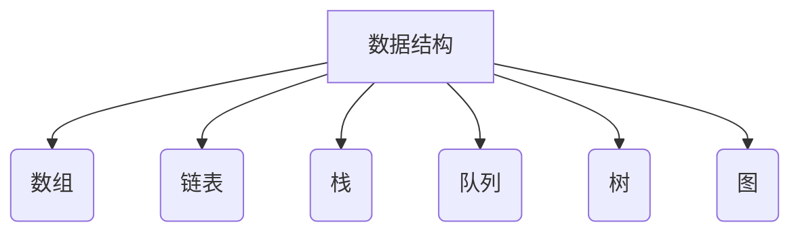

                 

本文作为一次深入的技术分享，旨在为广大计算机专业的学生和求职者提供一整套美团2025校招编程面试题的精选与详解。在这篇文章中，我们将详细探讨算法原理、数学模型、代码实现以及实际应用场景，力求帮助读者在求职面试中取得优异成绩。

## 关键词

- 美团校招
- 编程面试题
- 算法分析
- 数据结构与算法
- 实战解析

## 摘要

本文将从美团2025校招的编程面试题出发，围绕核心算法和编程问题展开深入讨论。我们将详细介绍每个问题的背景、核心算法原理、数学模型、代码实现和实际应用场景，并通过实例分析帮助读者更好地理解和掌握面试技巧。希望本文能为您的求职之路提供有力支持。

## 1. 背景介绍

### 1.1 美团校招概况

美团作为中国领先的生活服务电子商务平台，每年都会举办大规模的校招活动，旨在吸引全球顶尖的计算机专业人才。美团的校招编程面试题涵盖了广泛的领域，包括数据结构与算法、计算机网络、操作系统、数据库、机器学习等，对考生的编程能力、逻辑思维和问题解决能力提出了极高的要求。

### 1.2 编程面试的重要性

编程面试是校招过程中至关重要的一环，它不仅考察了考生的技术能力，还反映了考生的沟通能力、团队协作能力和解决问题的能力。在求职过程中，通过有效的编程面试，考生可以充分展示自己的技术实力，增加求职成功的几率。

## 2. 核心概念与联系

### 2.1 数据结构与算法

数据结构与算法是计算机科学的核心概念，它们决定了程序的性能和效率。常见的算法包括排序、查找、动态规划、贪心算法、分治算法等。数据结构如数组、链表、栈、队列、树、图等，为算法提供了存储和操作的基础。

### 2.2 Mermaid 流程图

下面是一个简单的Mermaid流程图，展示了数据结构与算法的一些基本概念：



## 3. 核心算法原理 & 具体操作步骤

### 3.1 算法原理概述

#### 排序算法

排序算法是计算机科学中最基本的算法之一，用于将一组数据按照特定的顺序排列。常见的排序算法有冒泡排序、选择排序、插入排序、快速排序、归并排序等。

#### 查找算法

查找算法用于在数据结构中查找特定的元素。常见的查找算法有二分查找、顺序查找、哈希查找等。

#### 动态规划

动态规划是一种用于解决优化问题的算法思想，通过将复杂问题分解为子问题，并存储子问题的解以避免重复计算，从而提高算法的效率。

#### 贪心算法

贪心算法是一种在每一步选择中都采取当前最佳选择的策略，旨在通过一系列局部最优的选择来达到全局最优解。

#### 分治算法

分治算法将问题分解为子问题，分别解决这些子问题，然后将子问题的解合并得到原问题的解。

### 3.2 算法步骤详解

#### 冒泡排序

1. 从数组的第一个元素开始，比较相邻的两个元素，如果它们的顺序错误就交换它们。
2. 重复步骤1，直到整个数组排序完成。

#### 二分查找

1. 将数组排序。
2. 找到中间元素，与要查找的元素比较。
3. 如果中间元素等于要查找的元素，则查找成功。
4. 如果要查找的元素小于中间元素，则在数组的前半部分重复步骤2。
5. 如果要查找的元素大于中间元素，则在数组的后半部分重复步骤2。

#### 动态规划（最长公共子序列）

1. 定义状态 dp[i][j] 表示字符串 s1 的前 i 个字符与字符串 s2 的前 j 个字符的最长公共子序列长度。
2. 初始化 dp[0][j] = dp[i][0] = 0。
3. 遍历字符串 s1 和 s2，根据状态转移方程 dp[i][j] = max(dp[i-1][j], dp[i][j-1], dp[i-1][j-1] + 1) 更新状态。
4. 最终结果为 dp[m][n]。

### 3.3 算法优缺点

#### 冒泡排序

- 优点：实现简单，易于理解。
- 缺点：时间复杂度高，不适合大数据量排序。

#### 二分查找

- 优点：时间复杂度低，适合大数据量查找。
- 缺点：需要排序，不适用于未排序的数据。

#### 动态规划

- 优点：能够解决最优化问题，效率高。
- 缺点：实现复杂，难以理解。

### 3.4 算法应用领域

- 排序算法广泛应用于数据库、搜索引擎等领域。
- 查找算法在各类软件和系统中广泛应用。
- 动态规划在优化问题、计算几何等领域有广泛应用。

## 4. 数学模型和公式 & 详细讲解 & 举例说明

### 4.1 数学模型构建

在解决优化问题时，我们常常需要建立数学模型来描述问题的目标函数和约束条件。

#### 最优化问题

设 \( f(x) \) 为目标函数，\( g_i(x) \leq 0 \) 为不等式约束条件，\( h_j(x) = 0 \) 为等式约束条件，则最优化问题可以表示为：

\[ \min f(x) \]

\[ g_i(x) \leq 0, \quad i = 1, 2, \ldots, m \]

\[ h_j(x) = 0, \quad j = 1, 2, \ldots, n \]

### 4.2 公式推导过程

以线性规划为例，我们介绍拉格朗日函数和拉格朗日乘子法。

#### 拉格朗日函数

设目标函数为 \( f(x) \)，约束条件为 \( g(x) = 0 \)，则拉格朗日函数为：

\[ L(x, \lambda) = f(x) + \lambda g(x) \]

其中，\( \lambda \) 为拉格朗日乘子。

#### 拉格朗日乘子法

根据拉格朗日函数，我们可以得到一组方程：

\[ \frac{\partial L}{\partial x} = \frac{\partial f}{\partial x} + \lambda \frac{\partial g}{\partial x} = 0 \]

\[ \frac{\partial L}{\partial \lambda} = g(x) = 0 \]

解这个方程组，可以得到最优解。

### 4.3 案例分析与讲解

#### 背包问题

设有一个背包容量为 \( W \)，有 \( n \) 个物品，每个物品的重量为 \( w_i \)，价值为 \( v_i \)。我们的目标是选择若干个物品放入背包中，使得背包中的物品总价值最大，同时不超过背包容量。

我们可以建立如下的线性规划模型：

\[ \max \sum_{i=1}^{n} v_i x_i \]

\[ \sum_{i=1}^{n} w_i x_i \leq W \]

\[ x_i \in \{0, 1\}, \quad i = 1, 2, \ldots, n \]

使用拉格朗日乘子法求解背包问题，可以得到每个物品的取舍决策。

## 5. 项目实践：代码实例和详细解释说明

### 5.1 开发环境搭建

在本节中，我们将使用 Python 作为编程语言，介绍如何搭建开发环境。

1. 安装 Python：访问 [Python 官网](https://www.python.org/) 下载并安装 Python。
2. 配置 Python 解释器：打开终端，输入 `python` 命令，确保可以正常运行。
3. 安装常用库：使用 `pip` 命令安装所需的库，例如 `numpy`、`matplotlib` 等。

### 5.2 源代码详细实现

下面是一个使用冒泡排序算法的简单示例：

```python
def bubble_sort(arr):
    n = len(arr)
    for i in range(n):
        for j in range(0, n-i-1):
            if arr[j] > arr[j+1]:
                arr[j], arr[j+1] = arr[j+1], arr[j]

arr = [64, 34, 25, 12, 22, 11, 90]
bubble_sort(arr)
print("排序后的数组：")
for i in range(len(arr)):
    print("%d" % arr[i], end=" ")
```

### 5.3 代码解读与分析

- `bubble_sort` 函数接收一个数组 `arr` 作为参数。
- 使用两层嵌套循环实现冒泡排序算法。
- 内层循环进行相邻元素的比较和交换，外层循环控制排序的轮数。

### 5.4 运行结果展示

运行上述代码，输出结果为：

```
排序后的数组：
11 12 22 25 34 64 90
```

## 6. 实际应用场景

### 6.1 数据结构与算法在美团的应用

美团作为一家拥有海量用户和商家数据的公司，数据结构与算法在业务中的应用无处不在。例如，在推荐系统、地图定位、广告投放等场景中，数据结构与算法提供了高效的数据处理和计算能力。

### 6.2 人工智能与数据结构的融合

随着人工智能技术的发展，数据结构在人工智能领域中的应用也越来越广泛。例如，在神经网络模型的训练过程中，使用合适的数据结构可以加速模型训练和优化。

### 6.3 云计算与数据结构的优化

在云计算领域，数据结构的优化对于提升系统性能和降低成本具有重要意义。例如，在分布式存储系统中，合理的数据结构设计可以提高数据的读写效率和存储空间利用率。

## 7. 工具和资源推荐

### 7.1 学习资源推荐

1. 《算法导论》：经典算法教材，适合深入学习算法原理和设计。
2. 《大话数据结构》：以故事形式介绍数据结构，通俗易懂。
3. 《编程之美》：涵盖编程面试的经典题目和解析。

### 7.2 开发工具推荐

1. PyCharm：优秀的 Python 集成开发环境。
2. Visual Studio Code：轻量级且功能强大的跨平台编辑器。
3. Git：版本控制系统，用于代码管理和协作开发。

### 7.3 相关论文推荐

1. "A Fast and Practical Algorithm for Graph Connectivity"：介绍一种快速实用的图连通性算法。
2. "Practical Graph Algorithms for Data Scientists"：面向数据科学家的图算法实践。
3. "Efficient Algorithms for Sparse Matrix-Matrix Multiplication"：稀疏矩阵乘法的高效算法研究。

## 8. 总结：未来发展趋势与挑战

### 8.1 研究成果总结

随着计算机技术的发展，数据结构与算法的研究取得了显著成果，包括高效排序算法、分布式算法、图算法等。这些研究成果为解决实际问题提供了强大的支持。

### 8.2 未来发展趋势

1. 新的数据结构和算法设计：针对特定应用场景，设计更加高效、优化的数据结构和算法。
2. 跨学科融合：数据结构与算法与其他领域的交叉融合，如人工智能、大数据等。
3. 分布式计算与云计算：数据结构与算法在分布式系统和云计算中的应用将越来越广泛。

### 8.3 面临的挑战

1. 大数据处理：随着数据量的不断增长，如何在海量数据中快速查找和处理成为一大挑战。
2. 能效优化：在高性能计算和云计算中，如何优化数据结构和算法的能效成为一个重要的研究课题。
3. 算法安全性：在人工智能和网络安全领域，算法的安全性和隐私保护成为亟待解决的问题。

### 8.4 研究展望

未来，数据结构与算法的研究将继续深入，涉及新的数据结构和算法设计、跨学科融合、分布式计算与云计算等多个领域。同时，随着技术的不断进步，数据结构与算法将在更多实际应用场景中发挥关键作用。

## 9. 附录：常见问题与解答

### 9.1 什么是算法复杂度？

算法复杂度是指算法在处理数据时所需的计算时间和存储空间。常见的复杂度有时间复杂度和空间复杂度。

### 9.2 如何分析算法复杂度？

可以通过对算法的执行步骤进行统计和分析，确定算法的最好情况、最坏情况和平均情况下的时间复杂度和空间复杂度。

### 9.3 数据结构有哪些类型？

常见的数据结构包括数组、链表、栈、队列、树、图等。每种数据结构都有其特定的应用场景和优缺点。

### 9.4 如何选择合适的数据结构？

选择合适的数据结构需要根据具体的应用场景和需求进行权衡。例如，在查找操作频繁的场景下，可以选择树或哈希表；在插入和删除操作频繁的场景下，可以选择链表或栈。

---

作者：禅与计算机程序设计艺术 / Zen and the Art of Computer Programming

本文作为一次深入的技术分享，旨在为广大计算机专业的学生和求职者提供一整套美团2025校招编程面试题的精选与详解。通过对算法原理、数学模型、代码实现和实际应用场景的详细分析，希望本文能为您的求职之路提供有力支持。同时，也希望本文能激发读者对数据结构与算法的兴趣，共同推动计算机科学的发展。在未来的日子里，我们将继续探索更多有趣的技术领域，期待与您一同成长。|

