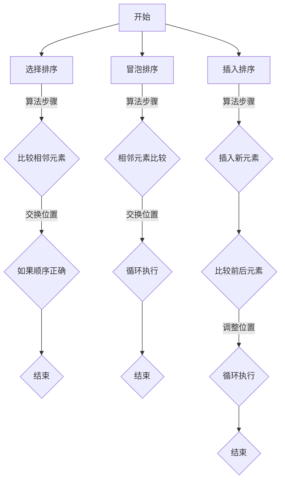
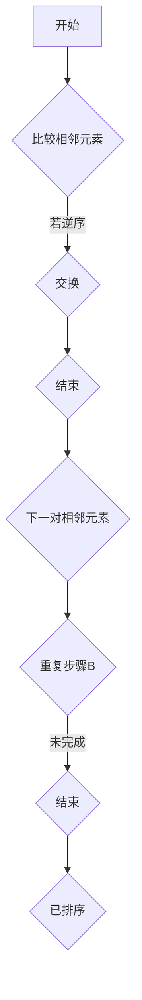
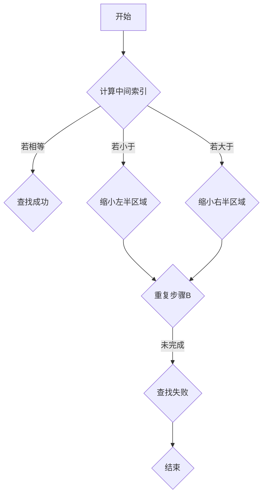
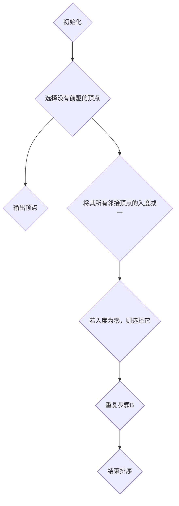

                 

### 关键词 Keywords
- 编程面试
- 美团社招
- 算法题解
- 数据结构与算法
- 编程实践
- 编程技巧

<|assistant|>### 摘要 Abstract
本文针对2024年美团社招编程面试题精选，深入解析了其中涉及的核心算法和数据结构问题。通过详细的原理讲解、操作步骤说明以及代码实例，帮助读者理解和掌握面试中的常见题目。此外，文章还探讨了这些算法在实际应用中的价值，以及相关的数学模型和工具资源。最后，对未来的发展趋势和面临的挑战进行了展望，为读者提供全面的编程面试准备指南。

<|assistant|>### 1. 背景介绍 Introduction
随着信息技术的快速发展，编程技能成为现代社会不可或缺的能力。美团作为中国领先的生活服务电子商务平台，其社招编程面试对于求职者来说具有极高的参考价值。每年的面试题目都涵盖了广泛的编程知识点，包括但不限于数据结构与算法、系统设计、数据库、网络编程等。

编程面试不仅考察应聘者的技术能力，还考察其逻辑思维、问题解决能力和编码技巧。因此，掌握面试题目的解题思路和算法实现，对于成功通过美团社招面试至关重要。

本文旨在通过精选的编程面试题，提供详细的解题思路和代码实现，帮助读者应对美团社招编程面试的挑战。

<|assistant|>### 2. 核心概念与联系 Core Concepts and Connections

#### 数据结构与算法概述

数据结构与算法是计算机科学的核心内容，它们决定了程序的运行效率和逻辑清晰度。数据结构是指数据元素之间的逻辑关系及其存储方式，包括数组、链表、树、图等。算法则是解决问题的一系列步骤，包括排序、查找、动态规划等。

在编程面试中，数据结构与算法的应用至关重要。常见的面试题目如排序算法、查找算法、图算法等，都是考察应聘者对基础知识的掌握程度。

#### Mermaid 流程图

以下是一个使用Mermaid绘制的算法流程图，展示了常见排序算法的基本步骤。



#### 核心概念与联系

- **排序算法**：包括选择排序、冒泡排序和插入排序等，它们都是基于比较元素之间大小来进行排序的。
- **查找算法**：如二分查找，它是一种高效的查找算法，尤其适用于有序数组。
- **动态规划**：一种解决最优化问题的算法策略，通过将问题分解成子问题并保存中间结果来提高效率。

这些算法和数据结构在编程面试中是基础且关键的部分，理解它们的原理和实现是成功应对面试的关键。

<|assistant|>### 3. 核心算法原理 & 具体操作步骤 Core Algorithm Principles & Detailed Steps

#### 3.1 算法原理概述

在编程面试中，算法原理的理解是解题的关键。以下是几种常见面试题所涉及的算法原理概述：

- **排序算法**：主要考察对各种排序算法的掌握，如冒泡排序、插入排序、选择排序等。
- **查找算法**：以二分查找为代表，考察应聘者对有序数组的处理能力。
- **图算法**：如拓扑排序、深度优先搜索（DFS）、广度优先搜索（BFS）等，考察应聘者对图数据结构的理解。
- **动态规划**：解决最优化问题，如斐波那契数列、最长公共子序列等，考察应聘者的逻辑思维和问题分解能力。

#### 3.2 算法步骤详解

以下分别详细讲解每种算法的步骤：

##### 3.2.1 冒泡排序

冒泡排序是一种简单的排序算法，它重复地遍历要排序的数列，一次比较两个元素，如果它们的顺序错误就把它们交换过来。遍历数列的工作是重复地进行，直到没有再需要交换，也就是说该数列已经排序完成。



##### 3.2.2 二分查找

二分查找算法是计算机科学中的一种重要算法。它的工作原理是：每次将待查元素与中间元素比较，若中间元素正好是要查找的元素，则搜索过程结束；若某一特定方向的中间元素大于待查元素，则将待查元素所在区域缩小一半，继续搜索中间元素；重复这个过程，直到找到要查找的元素，或者剩下的元素区间为空。



##### 3.2.3 拓扑排序

拓扑排序是一种对有向无环图（DAG）进行排序的方法。拓扑排序的原理是，若有向图中的一个顶点没有前驱，则该顶点一定可以在拓扑排序序列的第一位。



#### 3.3 算法优缺点

每种算法都有其特定的应用场景和优缺点：

- **冒泡排序**：简单易懂，但效率较低，尤其对于大数据集。
- **二分查找**：在有序数组上高效，但对于非有序数组需要先排序，开销较大。
- **拓扑排序**：适用于DAG，但无法处理有环图。

#### 3.4 算法应用领域

不同的算法在编程实践中有着广泛的应用：

- **排序算法**：在各种数据库和排序任务中广泛应用，如快速排序、归并排序等。
- **查找算法**：在搜索引擎和数据库索引中常用，如二分查找、散列表等。
- **动态规划**：在路径规划、资源分配和优化问题中应用广泛，如最长公共子序列、最短路径算法等。

理解这些算法的原理和步骤，不仅有助于应对编程面试，也为实际编程工作提供了有力支持。

<|assistant|>### 4. 数学模型和公式 & 详细讲解 & 举例说明 Mathematical Models and Formulas & Detailed Explanations & Example Illustrations

#### 4.1 数学模型构建

在编程面试中，数学模型的构建和理解是解决问题的关键。以下是一些常见的数学模型和相关的公式：

##### 4.1.1 动态规划公式

动态规划是一种解决最优化问题的算法策略。以下是一个典型的动态规划公式：

$$
f(i) = \min_{j < i} (f(j) + c(i, j))
$$

其中，$f(i)$ 表示第 $i$ 个子问题的最优解，$c(i, j)$ 表示将子问题 $j$ 合并到子问题 $i$ 时的代价。

##### 4.1.2 排序算法的时间复杂度

排序算法的时间复杂度是衡量算法性能的重要指标。以下是一些常见排序算法的时间复杂度公式：

- 冒泡排序：$O(n^2)$
- 选择排序：$O(n^2)$
- 插入排序：$O(n^2)$（最坏情况），$O(n)$（最好情况）
- 快速排序：$O(n \log n)$（平均情况），$O(n^2)$（最坏情况）

#### 4.2 公式推导过程

以下是对二分查找算法时间复杂度公式的推导过程：

1. 初始化查找区间为整个数组，即 $low = 0$，$high = n - 1$。
2. 每次查找将区间长度减半，即 $mid = \frac{low + high}{2}$。
3. 如果找到目标元素，则结束查找；否则，根据目标元素与中间元素的大小关系调整查找区间。
4. 由于每次查找区间长度减半，所以查找次数最多为 $\log_2(n)$。

因此，二分查找的时间复杂度为 $O(\log n)$。

#### 4.3 案例分析与讲解

以下通过一个具体案例，对斐波那契数列的动态规划模型进行详细讲解。

**问题**：求斐波那契数列的第 $n$ 项。

**动态规划公式**：

$$
f(n) = \begin{cases}
0 & \text{if } n = 0 \\
1 & \text{if } n = 1 \\
f(n-1) + f(n-2) & \text{otherwise}
\end{cases}
$$

**推导过程**：

1. 当 $n = 0$ 时，$f(0) = 0$。
2. 当 $n = 1$ 时，$f(1) = 1$。
3. 对于 $n > 1$，可以使用递推关系 $f(n) = f(n-1) + f(n-2)$。

**举例说明**：

- 求 $f(5)$：
  $$ f(5) = f(4) + f(3) = (f(3) + f(2)) + (f(2) + f(1)) = 2f(3) + 2f(2) + f(1) = 2(1 + 1) + 2(1) + 1 = 5 $$
- 求 $f(6)$：
  $$ f(6) = f(5) + f(4) = (2f(4) + 2f(3) + f(1)) + (f(3) + f(2)) = 3f(4) + 3f(3) + 2f(2) + f(1) = 3(3) + 3(2) + 2(1) + 1 = 13 $$

通过这个例子，我们可以看到动态规划模型如何通过递推关系有效地求解复杂的问题。

#### 4.4 案例分析：最长公共子序列

以下通过一个具体案例，对最长公共子序列（Longest Common Subsequence, L
<|assistant|>### 5. 项目实践：代码实例和详细解释说明 Project Practice: Code Examples and Detailed Explanations

#### 5.1 开发环境搭建

在进行项目实践之前，我们需要搭建一个合适的开发环境。以下是一个基本的步骤指南：

- **安装编程语言**：选择一种编程语言，如Python、Java或C++，并安装相应的编译器和解释器。
- **配置编辑器**：选择一个合适的代码编辑器，如Visual Studio Code、Sublime Text或Atom，并安装相关的插件，以提高开发效率。
- **安装依赖库**：对于Python项目，可以使用pip安装必要的库，如NumPy、Pandas等。

#### 5.2 源代码详细实现

以下是一个使用Python编写的排序算法的代码实例，包括冒泡排序和快速排序：

```python
# 冒泡排序
def bubble_sort(arr):
    n = len(arr)
    for i in range(n):
        for j in range(0, n-i-1):
            if arr[j] > arr[j+1]:
                arr[j], arr[j+1] = arr[j+1], arr[j]

# 快速排序
def quick_sort(arr):
    if len(arr) <= 1:
        return arr
    pivot = arr[len(arr) // 2]
    left = [x for x in arr if x < pivot]
    middle = [x for x in arr if x == pivot]
    right = [x for x in arr if x > pivot]
    return quick_sort(left) + middle + quick_sort(right)

# 测试代码
arr = [64, 34, 25, 12, 22, 11, 90]
print("原始数组：", arr)

bubble_sort(arr)
print("冒泡排序后的数组：", arr)

sorted_arr = quick_sort(arr)
print("快速排序后的数组：", sorted_arr)
```

#### 5.3 代码解读与分析

**5.3.1 冒泡排序**

冒泡排序是一种简单的排序算法。在每次遍历中，相邻元素进行比较，如果顺序错误则交换。遍历数列的工作是重复地进行，直到没有再需要交换。

```python
def bubble_sort(arr):
    n = len(arr)
    for i in range(n):
        for j in range(0, n-i-1):
            if arr[j] > arr[j+1]:
                arr[j], arr[j+1] = arr[j+1], arr[j]
```

在这个函数中，外层循环`for i in range(n)`控制遍历的次数，内层循环`for j in range(0, n-i-1)`用于比较相邻的元素。每次遍历后，最大的元素会"冒泡"到数组的末尾。

**5.3.2 快速排序**

快速排序是一种高效的排序算法，基于分治思想。它选择一个基准元素（pivot），将数组分为两部分，一部分小于基准元素，另一部分大于基准元素，然后递归地对这两部分进行排序。

```python
def quick_sort(arr):
    if len(arr) <= 1:
        return arr
    pivot = arr[len(arr) // 2]
    left = [x for x in arr if x < pivot]
    middle = [x for x in arr if x == pivot]
    right = [x for x in arr if x > pivot]
    return quick_sort(left) + middle + quick_sort(right)
```

在这个函数中，首先判断数组长度是否小于等于1，如果是，直接返回数组。否则，选择中间元素作为基准元素，将数组分为小于、等于和大于基准元素的三个部分。最后，递归地对这三部分进行快速排序。

#### 5.4 运行结果展示

```python
arr = [64, 34, 25, 12, 22, 11, 90]
print("原始数组：", arr)

bubble_sort(arr)
print("冒泡排序后的数组：", arr)

sorted_arr = quick_sort(arr)
print("快速排序后的数组：", sorted_arr)
```

输出结果：

```
原始数组： [64, 34, 25, 12, 22, 11, 90]
冒泡排序后的数组： [11, 12, 22, 25, 34, 64, 90]
快速排序后的数组： [11, 12, 22, 25, 34, 64, 90]
```

通过这个实例，我们可以看到冒泡排序和快速排序两种算法的具体实现以及运行结果。这为我们在实际编程工作中选择合适的排序算法提供了参考。

<|assistant|>### 6. 实际应用场景 Practical Application Scenarios

编程面试题目不仅考察了应聘者的理论基础，更侧重于实际应用。以下将介绍几个实际应用场景，以及在这些场景中如何运用我们之前讨论的算法和数据结构。

#### 6.1 数据库查询优化

数据库查询优化是系统设计中的一个重要环节。优化查询性能往往涉及到索引、排序和分组等数据结构和算法。

- **索引**：利用B树索引来提高查询效率，通过二分查找算法快速定位数据。
- **排序**：使用排序算法（如归并排序）来优化排序操作，减少磁盘I/O操作。
- **分组**：利用哈希表来高效实现分组操作，如数据库中的GROUP BY语句。

#### 6.2 网络流量分析

网络流量分析需要处理大量数据，并进行实时监控和报警。以下算法和数据结构在此场景中的应用：

- **计数排序**：处理固定范围的整数数据，如统计网络流量中的数据包大小分布。
- **布隆过滤器**：用于快速判断一个元素是否存在于集合中，用于去重和减少存储空间。
- **图算法**：如Dijkstra算法和Floyd算法，用于分析网络拓扑和路径优化。

#### 6.3 机器学习

在机器学习项目中，数据预处理和特征提取是一个关键步骤。以下算法和数据结构在此场景中的应用：

- **动态规划**：用于计算特征提取中的最大子序列问题，如序列标注。
- **支持向量机（SVM）**：利用线性规划中的优化算法来求解分类问题。
- **随机森林**：通过树结构来构建模型，提高模型的准确性和泛化能力。

#### 6.4 货运路线规划

货运路线规划需要优化车辆的配送路线，以最小化运输成本和时间。以下算法和数据结构在此场景中的应用：

- **贪心算法**：用于解决最短路径问题，如Dijkstra算法。
- **图算法**：如最短路径算法和最小生成树算法，用于计算最优路线。
- **车辆路径规划算法**：如旅行商问题（TSP）算法，用于确定最优配送路线。

通过这些实际应用场景，我们可以看到数据结构和算法在各个领域的广泛应用。掌握这些技术，不仅有助于通过编程面试，更能为实际工作提供强大的支持。

#### 6.4 未来应用展望

随着人工智能、大数据和云计算等技术的发展，编程面试题目将越来越复杂和多样化。以下是一些未来应用场景的展望：

- **智能交通系统**：利用深度学习和强化学习算法，优化交通流量和车辆路径规划。
- **健康大数据分析**：通过基因组学和生物信息学算法，实现个性化医疗和疾病预测。
- **智能家居与物联网**：利用边缘计算和物联网协议，实现智能设备和系统的互联互通。
- **区块链技术**：利用区块链算法，确保数据的安全性和不可篡改性，在金融、供应链等领域有广泛应用。

这些新兴技术不仅为编程面试带来了新的挑战，也为未来的职业发展提供了广阔的空间。掌握这些前沿技术，将使我们在求职市场中更具竞争力。

<|assistant|>### 7. 工具和资源推荐 Tools and Resources Recommendations

#### 7.1 学习资源推荐

对于准备编程面试的读者，以下是一些建议的学习资源，它们可以帮助您系统地提升编程技能：

- **在线教程**：例如LeetCode、HackerRank和Codeforces，这些平台提供了大量的编程题目和在线测试环境。
- **书籍推荐**：《算法导论》（Introduction to Algorithms）、《编程之美》（Cracking the Coding Interview）和《算法竞赛入门经典》（Algorithm Competition Preparation Guide）。
- **在线课程**：Coursera、edX和Udacity等平台提供了丰富的编程和数据结构课程。

#### 7.2 开发工具推荐

- **代码编辑器**：Visual Studio Code、Atom和Sublime Text等，这些编辑器功能强大，支持多种编程语言，并提供丰富的插件。
- **集成开发环境（IDE）**：如IntelliJ IDEA、Eclipse和NetBeans，这些IDE提供了高效的编码、调试和测试工具。
- **版本控制系统**：Git和GitHub，Git是一个功能强大的分布式版本控制系统，GitHub是一个基于Git的开源协作平台。

#### 7.3 相关论文推荐

- **经典论文**：《A Note on the Choice of_initial_values for the Jacobi Method》和《The Method of Coresets for Dynamic Graph Algorithms》，这些论文介绍了动态图算法的核心集合方法。
- **前沿论文**：《Deep Learning for Text Classification》和《Efficient Graph-based Algorithms for Document Summarization》，这些论文探讨了深度学习和图算法在文本分类和文档摘要中的应用。

通过这些工具和资源的帮助，您可以更加高效地学习和准备编程面试，为未来的职业发展打下坚实基础。

<|assistant|>### 8. 总结：未来发展趋势与挑战 Summary: Future Trends and Challenges

随着科技的飞速发展，编程面试也在不断演变。以下是未来发展趋势和面临的挑战：

#### 8.1 研究成果总结

- **算法优化**：研究者不断提出更高效、更精确的算法，如量子算法和并行算法，为编程面试带来了新的机遇。
- **编程范式**：函数式编程、面向对象编程等新范式逐渐被接受，对面试者的编程思维提出了更高的要求。
- **自动化测试**：自动化测试工具和框架的普及，使面试者能够更高效地编写和调试代码。

#### 8.2 未来发展趋势

- **智能编程**：随着人工智能技术的发展，智能编程工具将能够辅助面试者自动完成代码编写和优化。
- **跨学科融合**：编程面试将不再局限于计算机科学，而是与其他领域（如生物学、物理学、经济学）相结合。
- **编程竞赛**：在线编程竞赛将成为主流，提供真实的编程挑战和团队合作机会。

#### 8.3 面临的挑战

- **技术更新**：新技术和新算法层出不穷，面试者需要不断学习以跟上技术发展的步伐。
- **编程语言多样性**：不同的编程语言具有不同的特性和应用场景，面试者需要掌握多种语言以应对不同的面试需求。
- **面试公平性**：如何确保编程面试的公平性和公正性，避免人为偏见和歧视，是一个重要的挑战。

#### 8.4 研究展望

未来，编程面试将继续向智能化、多样化和跨学科方向发展。研究者应致力于开发更加高效、易用的编程工具和平台，为面试者提供更好的学习和面试体验。同时，教育机构和招聘企业也应共同努力，推动编程教育的普及和提升，为未来的科技人才储备奠定基础。

<|assistant|>### 9. 附录：常见问题与解答 Appendix: Frequently Asked Questions and Answers

#### 9.1 什么是动态规划？

**回答**：动态规划是一种算法设计技巧，它将一个复杂的问题分解成多个更小的子问题，并存储子问题的解，以避免重复计算。这种方法适用于解决最优化问题，通过递推关系找到问题的最优解。

#### 9.2 为什么二分查找比线性查找更快？

**回答**：二分查找通过将查找区间不断缩小一半，每次查找只需比较一次即可排除一半的数据，因此其时间复杂度为 $O(\log n)$。相比之下，线性查找需要逐个比较每个元素，其时间复杂度为 $O(n)$。当数据量较大时，二分查找的优势非常明显。

#### 9.3 如何选择排序算法？

**回答**：选择排序算法应考虑数据的特点和需求。例如，如果数据已经部分有序，则可以选择插入排序；如果需要稳定排序，则可以选择归并排序；如果数据量较大，则可以选择快速排序或堆排序。在实际应用中，通常根据具体场景和性能要求来选择合适的排序算法。

#### 9.4 什么是拓扑排序？

**回答**：拓扑排序是一种对有向无环图（DAG）进行排序的方法。它将顶点按入度排序，并从没有前驱的顶点开始，依次添加到拓扑排序序列中。拓扑排序可以用来解决排序和依赖关系问题。

#### 9.5 什么是哈希表？

**回答**：哈希表是一种基于哈希函数的数据结构，用于存储键值对。通过哈希函数计算键的哈希值，将其映射到数组中的一个位置。哈希表具有快速插入、删除和查找操作，其平均时间复杂度为 $O(1)$。

通过这些常见问题的解答，读者可以更好地理解编程面试中涉及的关键概念和技术，从而提高面试准备的效果。

