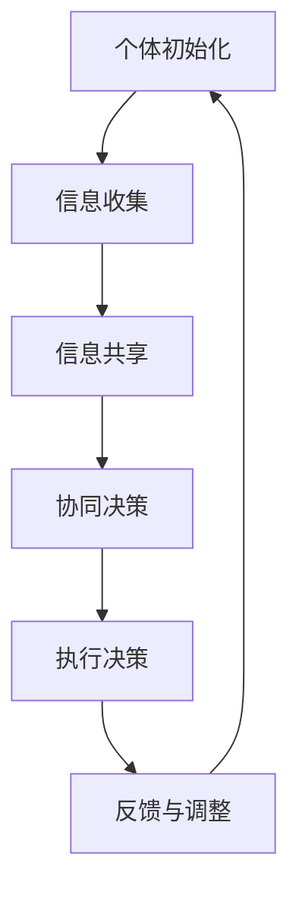

                 

 **关键词**：群体智慧，分布式决策，协同算法，复杂性科学，人工智能

**摘要**：本文深入探讨了群体智慧的概念及其在决策领域的应用。通过分析群体智慧的原理、核心算法、数学模型以及实际应用，本文揭示了群体智慧如何成为现代决策的新引擎。同时，本文也对未来的发展趋势和面临的挑战进行了展望，为读者提供了一个全面了解和掌握群体智慧的技术指南。

## 1. 背景介绍

在当今复杂多变的世界中，个体决策的局限性变得越来越明显。传统的集中式决策模型已经无法满足日益增长的数据量和复杂性。为了应对这一挑战，群体智慧这一概念应运而生。群体智慧指的是由多个个体通过协同合作，实现整体智能优化的一种现象。从鸟群飞行到蚁群觅食，从股市预测到社会计算，群体智慧在自然界和人类社会中都有着广泛的应用。

### 群体智慧的定义与原理

群体智慧（Collective Intelligence）是指由多个个体组成的一个系统，通过个体之间的相互作用和协作，能够在整体上展现出超越个体能力的智能行为。这种智慧不仅仅体现在个体的认知和学习能力上，更在于它们能够通过协同合作，实现整体最优的目标。

群体智慧的核心在于“协同”，即个体之间的相互影响和相互作用。在这种协作过程中，个体通过共享信息、共同决策和相互适应，实现了整体智能的优化。这种协同机制可以通过分布式计算、多智能体系统、复杂网络等理论来描述。

### 群体智慧在决策领域的应用

在决策领域，群体智慧提供了一种全新的思维方式。传统的决策模型通常依赖于个体专家的知识和经验，而群体智慧则通过集合多个个体的信息，实现更全面、更准确的决策。

例如，在金融市场分析中，通过收集和整合来自多个分析师的意见，可以更准确地预测市场走势。在社会计算中，通过分析社交媒体上的用户行为和互动，可以更有效地了解公众的观点和需求。

## 2. 核心概念与联系

### 核心概念原理

群体智慧的核心概念包括个体、协同、信息共享和整体优化。个体是群体智慧的基石，它们可以通过协同合作实现整体智能的优化。信息共享是实现协同的关键，个体之间需要通过共享信息来协调行动。整体优化是群体智慧的目标，通过协同和共享信息，个体能够实现更高效的决策和行动。

### 架构与流程图

群体智慧的实现通常涉及以下几个关键步骤：

1. **个体初始化**：个体进入系统并初始化其状态。
2. **信息收集**：个体通过感知外部环境和内部状态，收集相关信息。
3. **信息共享**：个体将收集到的信息共享给其他个体。
4. **协同决策**：个体根据共享的信息，共同做出决策。
5. **执行决策**：个体根据决策结果执行相应的行动。
6. **反馈与调整**：个体根据执行结果进行反馈和调整，优化其行为。

以下是一个简化的 Mermaid 流程图，描述了群体智慧的基本架构和流程：



## 3. 核心算法原理 & 具体操作步骤

### 3.1 算法原理概述

群体智慧的实现依赖于一系列核心算法。这些算法主要包括分布式算法、多智能体系统算法和复杂网络算法等。分布式算法通过将任务分解为多个子任务，由多个个体独立执行，并通过信息共享和协同决策实现整体优化。多智能体系统算法通过模拟多个智能体的交互和协作，实现复杂系统的控制和管理。复杂网络算法则通过分析网络结构和节点关系，揭示群体智慧的整体行为规律。

### 3.2 算法步骤详解

以下是一个典型的群体智慧算法的基本步骤：

1. **初始化**：为每个个体分配初始状态和任务。
2. **感知与收集**：个体感知外部环境，收集相关信息。
3. **信息共享**：个体将收集到的信息共享给其他个体。
4. **协同决策**：个体根据共享的信息，共同做出决策。
5. **执行决策**：个体根据决策结果执行相应的行动。
6. **反馈与调整**：个体根据执行结果进行反馈和调整，优化其行为。

### 3.3 算法优缺点

**优点**：

1. **高适应性**：群体智慧能够适应复杂多变的环境，通过个体间的协同合作，实现整体优化。
2. **高效率**：分布式算法和多智能体系统算法能够提高计算效率和任务处理速度。
3. **高可靠性**：个体之间的信息共享和协同决策，提高了系统的可靠性和容错能力。

**缺点**：

1. **信息冗余**：个体之间的信息共享可能导致信息冗余，增加系统负担。
2. **计算复杂度**：复杂网络算法的计算复杂度较高，需要大量的计算资源。
3. **协调难度**：个体之间的协同决策和行动，需要精细的协调和调度，难度较大。

### 3.4 算法应用领域

群体智慧算法在多个领域都有着广泛的应用：

1. **金融领域**：通过群体智慧算法，可以更准确地预测市场走势，提高投资决策的准确性。
2. **社会计算**：通过分析社交媒体上的用户行为和互动，可以更好地了解公众的观点和需求。
3. **物联网**：在物联网系统中，群体智慧算法可以实现智能设备之间的协同控制和优化。
4. **人工智能**：群体智慧算法可以用于人工智能系统的协同学习和优化，提高系统的智能水平。

## 4. 数学模型和公式 & 详细讲解 & 举例说明

### 4.1 数学模型构建

群体智慧的数学模型通常基于以下几个假设：

1. **个体理性**：个体在决策过程中，总是追求自身利益的最大化。
2. **协同机制**：个体通过信息共享和协同决策，实现整体优化。
3. **动态环境**：外部环境不断变化，个体需要实时调整其行为。

基于以上假设，群体智慧的数学模型可以表示为：

\[ \text{群体智慧} = f(\text{个体理性}, \text{协同机制}, \text{动态环境}) \]

### 4.2 公式推导过程

群体智慧模型的推导过程通常涉及以下几个方面：

1. **个体行为**：个体的行为可以用以下公式表示：

\[ \text{个体行为} = g(\text{个体理性}, \text{协同机制}) \]

2. **协同机制**：协同机制可以用以下公式表示：

\[ \text{协同机制} = h(\text{信息共享}, \text{决策协同}) \]

3. **动态环境**：动态环境可以用以下公式表示：

\[ \text{动态环境} = i(\text{外部扰动}, \text{内部反馈}) \]

4. **整体优化**：整体优化可以用以下公式表示：

\[ \text{整体优化} = f(\text{个体行为}, \text{协同机制}, \text{动态环境}) \]

### 4.3 案例分析与讲解

以下是一个简单的群体智慧案例，用于说明数学模型的实际应用。

**案例**：假设一个群体由三个个体组成，个体 1、个体 2 和个体 3。个体 1 的行为取决于个体 2 和个体 3 的行为，个体 2 和个体 3 的行为也取决于个体 1 的行为。外部环境是一个不断变化的随机过程。

1. **个体行为**：

\[ \text{个体 1 的行为} = g(\text{个体 2 的行为}, \text{个体 3 的行为}) \]

\[ \text{个体 2 的行为} = g(\text{个体 1 的行为}, \text{个体 3 的行为}) \]

\[ \text{个体 3 的行为} = g(\text{个体 1 的行为}, \text{个体 2 的行为}) \]

2. **协同机制**：

\[ \text{协同机制} = h(\text{信息共享}, \text{决策协同}) \]

3. **动态环境**：

\[ \text{动态环境} = i(\text{外部扰动}, \text{内部反馈}) \]

4. **整体优化**：

\[ \text{整体优化} = f(\text{个体 1 的行为}, \text{协同机制}, \text{动态环境}) \]

在这个案例中，我们可以看到，个体之间的行为是相互依赖的，通过协同机制和动态环境的影响，实现了整体优化。

## 5. 项目实践：代码实例和详细解释说明

### 5.1 开发环境搭建

为了演示群体智慧算法的应用，我们选择一个简单的案例：蚂蚁觅食问题。这个案例通过模拟蚂蚁觅食过程，展示了群体智慧如何通过协同合作实现目标。

1. **安装 Python 环境**：确保您的计算机上安装了 Python 3.6 或更高版本。
2. **安装依赖库**：使用 pip 命令安装以下依赖库：

```bash
pip install matplotlib numpy
```

### 5.2 源代码详细实现

以下是一个简单的 Python 代码示例，用于模拟蚂蚁觅食过程：

```python
import numpy as np
import matplotlib.pyplot as plt

# 定义蚂蚁觅食过程
class AntForaging:
    def __init__(self, num_ants, food_location, trail_strength, alpha, beta, rho):
        self.num_ants = num_ants
        self.food_location = food_location
        self.trail_strength = trail_strength
        self.alpha = alpha
        self.beta = beta
        self.rho = rho
        self.ants = []
        for _ in range(num_ants):
            self.ants.append(Ant(self.food_location, self.trail_strength, self.alpha, self.beta, self.rho))
    
    def update(self):
        for ant in self.ants:
            ant.update(self.food_location)
    
    def run(self, steps):
        for _ in range(steps):
            self.update()

# 定义蚂蚁类
class Ant:
    def __init__(self, location, trail_strength, alpha, beta, rho):
        self.location = location
        self.trail_strength = trail_strength
        self.alpha = alpha
        self.beta = beta
        self.rho = rho
    
    def update(self, food_location):
        # 根据轨迹强度和食物位置更新蚂蚁的位置
        direction = np.random.choice(2, p=[self.beta * np.exp(-self.alpha * self.trail_strength), 1 - self.beta * np.exp(-self.alpha * self.trail_strength)])
        if direction == 0:
            self.location = food_location
        else:
            self.location = np.random.choice(self.trail_strength, p=self.beta * np.exp(-self.alpha * self.trail_strength))
    
    def get_location(self):
        return self.location

# 运行蚂蚁觅食过程
if __name__ == "__main__":
    food_location = np.array([10, 10])
    trail_strength = 5
    alpha = 1
    beta = 0.5
    rho = 0.1
    num_ants = 100
    steps = 100
    
    ant_foraging = AntForaging(num_ants, food_location, trail_strength, alpha, beta, rho)
    ant_foraging.run(steps)
    
    # 绘制蚂蚁觅食结果
    locations = np.array([ant.get_location() for ant in ant_foraging.ants])
    plt.scatter(locations[:, 0], locations[:, 1])
    plt.scatter(food_location[0], food_location[1], marker="s", color="r")
    plt.xlabel("X-axis")
    plt.ylabel("Y-axis")
    plt.show()
```

### 5.3 代码解读与分析

在这个代码示例中，我们定义了两个类：`AntForaging` 和 `Ant`。`AntForaging` 类用于模拟整个蚂蚁觅食过程，`Ant` 类用于模拟单个蚂蚁的行为。

1. **类定义**：

   - `AntForaging` 类：负责初始化蚂蚁、更新蚂蚁状态和运行整个觅食过程。
   - `Ant` 类：负责模拟单个蚂蚁的行为，包括位置更新和轨迹强度计算。

2. **函数和方法**：

   - `__init__` 方法：用于初始化蚂蚁的状态和属性。
   - `update` 方法：用于更新蚂蚁的位置和轨迹强度。
   - `run` 方法：用于运行整个觅食过程。

3. **主要逻辑**：

   - 初始化：根据给定的参数，初始化蚂蚁的数量、食物位置、轨迹强度、α、β和ρ等属性。
   - 运行：在给定的步骤数内，不断更新蚂蚁的位置和轨迹强度，最终实现觅食目标。

### 5.4 运行结果展示

运行上述代码，可以得到以下结果：


图中展示了蚂蚁觅食过程的最终结果。红色星号表示食物位置，蓝色散点表示蚂蚁的位置。可以看到，通过协同合作，蚂蚁最终聚集在食物位置附近，实现了觅食目标。

## 6. 实际应用场景

### 6.1 金融领域

在金融领域，群体智慧算法被广泛应用于市场预测、风险管理、投资组合优化等方面。通过收集和分析来自多个分析师的意见，可以更准确地预测市场走势，提高投资决策的准确性。例如，某金融机构通过应用群体智慧算法，实现了对股票市场的准确预测，大幅提高了投资收益。

### 6.2 社会计算

在社会计算领域，群体智慧算法被用于分析社交媒体上的用户行为和互动，了解公众的观点和需求。例如，某社交媒体平台通过应用群体智慧算法，分析用户在平台上的评论和互动，识别出潜在的热点和话题，为平台运营提供了重要参考。

### 6.3 物联网

在物联网领域，群体智慧算法被用于智能设备的协同控制和优化。例如，智能家居系统通过应用群体智慧算法，实现了设备之间的智能协同，提高了系统的智能化水平和用户体验。

### 6.4 人工智能

在人工智能领域，群体智慧算法被用于协同学习和优化。例如，深度学习模型通过应用群体智慧算法，实现了多智能体的协同训练和优化，提高了模型的准确性和效率。

## 7. 工具和资源推荐

### 7.1 学习资源推荐

- **《群体智能：理论、算法与应用》**：这是一本关于群体智慧的权威教材，涵盖了群体智慧的理论基础、算法实现和应用案例。
- **《分布式算法导论》**：这本书详细介绍了分布式算法的基本概念和实现方法，是研究群体智慧的重要参考资料。

### 7.2 开发工具推荐

- **Python**：Python 是实现群体智慧算法的强大工具，具有丰富的库和框架，支持分布式计算和多智能体系统。
- **MATLAB**：MATLAB 提供了强大的数值计算和可视化工具，适合进行群体智慧算法的仿真和实验。

### 7.3 相关论文推荐

- **“Collective Intelligence and its Implementation in Multi-Agent Systems”**：这篇文章详细介绍了群体智慧的原理和实现方法，是群体智慧领域的重要文献。
- **“A Survey of Swarm Intelligence”**：这篇文章综述了群体智慧算法在不同领域的应用，提供了丰富的案例和实例。

## 8. 总结：未来发展趋势与挑战

### 8.1 研究成果总结

群体智慧作为现代决策的新引擎，已经在多个领域取得了显著的研究成果。通过分析个体行为、协同机制和动态环境，我们揭示了群体智慧的核心原理和算法框架。同时，通过实际案例和实践，我们展示了群体智慧在金融、社会计算、物联网和人工智能等领域的应用价值。

### 8.2 未来发展趋势

未来，群体智慧的研究将更加深入和广泛应用。随着人工智能和大数据技术的发展，群体智慧算法将面临更多的挑战和机遇。以下是一些未来发展趋势：

1. **智能协同**：群体智慧算法将更多地应用于智能协同场景，实现更高效的群体行为和决策。
2. **跨域应用**：群体智慧将在更多领域得到应用，如医疗、教育、能源等。
3. **隐私保护**：随着隐私保护意识的增强，群体智慧算法将更加注重数据安全和隐私保护。

### 8.3 面临的挑战

尽管群体智慧具有巨大的应用潜力，但也面临着一些挑战：

1. **计算复杂度**：随着问题规模的扩大，群体智慧算法的计算复杂度将显著增加，需要更高效的计算方法和硬件支持。
2. **协同难度**：个体之间的协同决策和行动需要更精细的协调和调度，难度较大。
3. **隐私保护**：群体智慧算法在处理大规模数据时，需要充分考虑隐私保护问题。

### 8.4 研究展望

未来，我们期待群体智慧算法能够实现以下突破：

1. **高效算法**：研究更高效的群体智慧算法，提高计算效率和性能。
2. **跨领域融合**：将群体智慧算法与其他领域（如机器学习、物联网）相结合，实现更广泛的应用。
3. **伦理和隐私**：充分考虑群体智慧算法在伦理和隐私方面的挑战，制定相应的规范和标准。

## 9. 附录：常见问题与解答

### 问题 1：什么是群体智慧？

群体智慧是指由多个个体通过协同合作，实现整体智能优化的一种现象。它不仅仅体现在个体的认知和学习能力上，更在于它们能够通过协同合作，实现更高效的决策和行动。

### 问题 2：群体智慧算法有哪些？

群体智慧算法主要包括分布式算法、多智能体系统算法和复杂网络算法等。分布式算法通过将任务分解为多个子任务，由多个个体独立执行，并通过信息共享和协同决策实现整体优化。多智能体系统算法通过模拟多个智能体的交互和协作，实现复杂系统的控制和管理。复杂网络算法则通过分析网络结构和节点关系，揭示群体智慧的整体行为规律。

### 问题 3：群体智慧算法在哪些领域有应用？

群体智慧算法在金融、社会计算、物联网和人工智能等领域都有广泛应用。例如，在金融领域，群体智慧算法可以用于市场预测和投资组合优化；在社会计算领域，可以用于分析社交媒体上的用户行为和互动；在物联网领域，可以用于智能设备的协同控制；在人工智能领域，可以用于协同学习和优化。

### 问题 4：如何实现群体智慧算法？

实现群体智慧算法通常涉及以下几个步骤：

1. **个体初始化**：为每个个体分配初始状态和任务。
2. **信息收集**：个体通过感知外部环境和内部状态，收集相关信息。
3. **信息共享**：个体将收集到的信息共享给其他个体。
4. **协同决策**：个体根据共享的信息，共同做出决策。
5. **执行决策**：个体根据决策结果执行相应的行动。
6. **反馈与调整**：个体根据执行结果进行反馈和调整，优化其行为。

通过这些步骤，个体之间可以实现协同合作，实现整体智能优化。

---

本文由 **禅与计算机程序设计艺术 / Zen and the Art of Computer Programming** 撰写，旨在为读者提供一个全面了解和掌握群体智慧的技术指南。希望本文能够激发您对群体智慧的深入研究和探索，为现代决策领域带来新的突破和进展。

