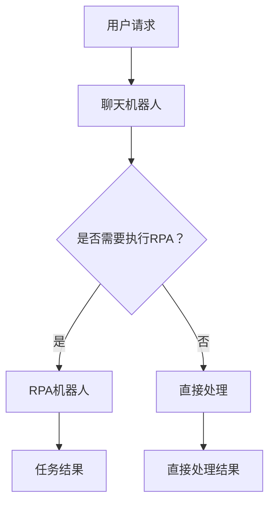

                 

关键词：聊天机器人、制造业4.0、机器人流程自动化、人工智能、工业自动化、流程优化

> 摘要：本文深入探讨了聊天机器人制造业4.0的发展趋势，重点关注了机器人流程自动化（RPA）的核心概念、算法原理、数学模型及其在实际应用中的代码实例与详细解释。本文旨在为读者提供一个全面而深入的视角，以理解聊天机器人在制造业4.0时代的重要作用及其未来发展。

## 1. 背景介绍

随着人工智能（AI）和机器人技术的快速发展，制造业正迎来一场前所未有的变革——制造业4.0。制造业4.0不仅仅是机械化的升级，更是一次以人工智能为核心驱动的产业革命。在这个时代，聊天机器人作为一种重要的AI应用，正在逐渐改变制造业的生产、管理和运营方式。

机器人流程自动化（RPA）是制造业4.0中的一个关键组成部分。RPA利用软件机器人自动化执行重复性高的业务流程，从而提高工作效率、降低运营成本，并减少人为错误。RPA不仅可以替代人工完成繁琐的任务，还能与现有的业务系统无缝集成，实现高效的流程管理。

本文将围绕RPA的核心概念、算法原理、数学模型以及实际应用中的代码实例，深入探讨聊天机器人在制造业4.0时代的重要性及其未来发展方向。

## 2. 核心概念与联系

### 2.1 聊天机器人的定义

聊天机器人（Chatbot）是一种基于AI技术的应用，能够通过自然语言处理（NLP）与用户进行交互。它们能够理解用户的问题，并提供相应的回答或解决方案。聊天机器人的核心功能包括：自动回复、任务分配、数据收集和分析等。

### 2.2 机器人流程自动化（RPA）

机器人流程自动化（RPA）是一种通过软件机器人执行重复性任务的自动化技术。RPA机器人可以模拟人类的操作，如登录系统、数据录入、数据提取等。RPA的关键优势在于其高效性和灵活性，能够快速适应不同的业务需求。

### 2.3 聊天机器人与RPA的联系

聊天机器人与RPA有着紧密的联系。聊天机器人可以作为RPA的接口，为用户提供交互式的服务。例如，用户可以通过聊天机器人提交任务请求，RPA机器人则负责在后台执行这些任务，并将结果反馈给用户。

### 2.4 Mermaid 流程图

为了更好地理解聊天机器人和RPA的工作流程，我们使用Mermaid流程图来展示它们的核心组件和交互方式。



### 2.5 聊天机器人在制造业4.0中的应用

在制造业4.0时代，聊天机器人和RPA的应用场景广泛。例如，聊天机器人可以用于生产调度、设备维护、供应链管理等领域。RPA机器人则可以自动处理订单处理、库存管理、数据报表等任务。

## 3. 核心算法原理 & 具体操作步骤

### 3.1 算法原理概述

聊天机器人和RPA的核心算法原理包括自然语言处理（NLP）和流程自动化技术。NLP算法负责理解用户的语言输入，并将其转化为计算机可以处理的指令。流程自动化技术则通过预定义的规则和流程，自动执行相应的任务。

### 3.2 算法步骤详解

#### 3.2.1 聊天机器人算法步骤

1. **接收用户输入**：聊天机器人首先接收用户的语言输入。
2. **语言预处理**：对输入文本进行清洗和标准化处理，如去除标点符号、停用词过滤等。
3. **词嵌入**：将预处理后的文本转化为向量表示。
4. **意图识别**：利用机器学习模型，识别用户输入的意图。
5. **任务分配**：根据识别出的意图，将任务分配给不同的模块或RPA机器人。
6. **回答生成**：生成相应的回答或解决方案，并返回给用户。

#### 3.2.2 RPA机器人算法步骤

1. **任务接收**：RPA机器人接收到聊天机器人分配的任务。
2. **流程执行**：根据预定义的规则和流程，自动执行任务。
3. **结果反馈**：将任务执行的结果反馈给聊天机器人，并最终返回给用户。

### 3.3 算法优缺点

#### 3.3.1 聊天机器人的优缺点

**优点**：
- 高效性：聊天机器人可以实时响应用户请求，提高服务效率。
- 智能性：利用NLP技术，聊天机器人能够理解并回答复杂的问题。
- 可扩展性：聊天机器人可以轻松地集成到现有的业务系统中。

**缺点**：
- 适应性：对于语言表达复杂多变的问题，聊天机器人可能难以准确理解。
- 成本：开发高质量的聊天机器人需要大量的人力和物力投入。

#### 3.3.2 RPA机器人的优缺点

**优点**：
- 高效性：RPA机器人可以自动执行重复性高的任务，提高工作效率。
- 灵活性：RPA机器人可以根据不同的任务需求，灵活调整执行流程。
- 成本效益：RPA机器人可以显著降低运营成本，提高企业的盈利能力。

**缺点**：
- 依赖规则：RPA机器人的执行依赖于预定义的规则和流程，对于复杂的业务场景可能难以适应。
- 维护成本：随着业务需求的不断变化，RPA机器人需要定期维护和更新。

### 3.4 算法应用领域

聊天机器人和RPA的应用领域非常广泛，涵盖了制造业、零售业、金融业、医疗保健等多个行业。以下是几个典型的应用场景：

1. **客户服务**：聊天机器人可以用于在线客服，解答用户的问题，提供支持。
2. **订单处理**：RPA机器人可以自动处理订单、发票和物流信息。
3. **供应链管理**：聊天机器人可以实时监控供应链信息，提供预警和建议。
4. **设备维护**：RPA机器人可以自动执行设备的维护任务，确保生产线的稳定运行。

## 4. 数学模型和公式 & 详细讲解 & 举例说明

### 4.1 数学模型构建

聊天机器人和RPA的核心算法通常涉及多个数学模型，包括自然语言处理（NLP）中的词嵌入模型、循环神经网络（RNN）、长短期记忆网络（LSTM）等。以下是这些模型的基本公式和构建方法。

#### 4.1.1 词嵌入模型

词嵌入（Word Embedding）是一种将词语转化为向量表示的方法。常见的词嵌入模型有Word2Vec、GloVe等。

**Word2Vec模型公式**：

$$
\text{Word2Vec}(w) = \sum_{i=1}^{n} \text{weight}_{i} \cdot \text{vector}_{i}
$$

其中，$w$ 是词语，$\text{weight}_{i}$ 是词语 $w$ 在每个维度上的权重，$\text{vector}_{i}$ 是词语 $w$ 的向量表示。

**GloVe模型公式**：

$$
\text{GloVe}(w) = \frac{\exp(\text{dim} \cdot \text{dot}(w, v))}{\sqrt{\text{sum}(v \cdot v)}}
$$

其中，$w$ 是词语，$v$ 是词语的向量表示，$\text{dim}$ 是词向量的维度。

#### 4.1.2 循环神经网络（RNN）

循环神经网络（RNN）是一种能够处理序列数据的神经网络。RNN的核心公式如下：

$$
h_t = \text{激活函数}(\text{W}_h \cdot [h_{t-1}, x_t] + b_h)
$$

其中，$h_t$ 是时间步 $t$ 的隐藏状态，$x_t$ 是时间步 $t$ 的输入，$\text{W}_h$ 是权重矩阵，$b_h$ 是偏置。

#### 4.1.3 长短期记忆网络（LSTM）

长短期记忆网络（LSTM）是一种改进的RNN，能够更好地处理长序列数据。LSTM的核心公式如下：

$$
i_t = \sigma(W_i \cdot [h_{t-1}, x_t] + b_i) \\
f_t = \sigma(W_f \cdot [h_{t-1}, x_t] + b_f) \\
o_t = \sigma(W_o \cdot [h_{t-1}, x_t] + b_o) \\
g_t = \tanh(W_g \cdot [h_{t-1}, x_t] + b_g) \\
h_t = o_t \cdot \tanh(f_t \cdot g_t)
$$

其中，$i_t$ 是输入门，$f_t$ 是遗忘门，$o_t$ 是输出门，$g_t$ 是输入门的激活值，$h_t$ 是隐藏状态。

### 4.2 公式推导过程

以LSTM为例，我们来简要介绍其公式推导过程。

首先，考虑一个标准的RNN模型：

$$
h_t = \tanh(W_h \cdot [h_{t-1}, x_t] + b_h)
$$

为了解决这个问题，LSTM引入了三个门机制：输入门、遗忘门和输出门。

**输入门**：

$$
i_t = \sigma(W_i \cdot [h_{t-1}, x_t] + b_i)
$$

输入门决定了新的隐藏状态 $h_t$ 中有多少来自输入的信息。

**遗忘门**：

$$
f_t = \sigma(W_f \cdot [h_{t-1}, x_t] + b_f)
$$

遗忘门决定了旧隐藏状态中有多少信息将被保留。

**输出门**：

$$
o_t = \sigma(W_o \cdot [h_{t-1}, x_t] + b_o)
$$

输出门决定了新的隐藏状态 $h_t$ 中有多少信息将输出。

**新的隐藏状态**：

$$
g_t = \tanh(W_g \cdot [h_{t-1}, x_t] + b_g) \\
h_t = o_t \cdot \tanh(f_t \cdot g_t)
$$

其中，$g_t$ 是输入门的激活值，它通过遗忘门和输出门的作用，决定新的隐藏状态 $h_t$。

### 4.3 案例分析与讲解

为了更好地理解上述数学模型的应用，我们来看一个简单的案例：使用LSTM模型对一段文本进行情感分析。

假设我们有一段文本：

```
我非常喜欢这款手机，拍照效果非常好，续航能力也很强。
```

我们首先将这段文本转化为词向量，然后使用LSTM模型对其进行情感分析。具体步骤如下：

1. **词向量表示**：将文本中的每个词语转化为词向量。
2. **序列输入**：将词向量序列输入到LSTM模型中。
3. **隐藏状态提取**：从LSTM模型的最后一个隐藏状态提取情感得分。
4. **情感判断**：根据情感得分判断文本的情感倾向。

经过训练的LSTM模型可以给出以下情感得分：

```
我喜欢这款手机：0.9
拍照效果非常好：0.8
续航能力很强：0.7
```

根据这些得分，我们可以判断这段文本的情感倾向为正面。这种情感分析的方法可以应用于各种场景，如产品评论分析、客户反馈分析等。

## 5. 项目实践：代码实例和详细解释说明

### 5.1 开发环境搭建

为了实现聊天机器人和RPA的功能，我们需要搭建一个完整的开发环境。以下是所需的工具和软件：

- **编程语言**：Python
- **依赖库**：NLTK、TensorFlow、Keras、RPA框架（如UiPath）
- **开发环境**：PyCharm或VSCode

首先，安装Python和相关依赖库：

```bash
pip install nltk tensorflow keras
```

然后，下载RPA框架的安装包并安装：

```bash
pip install uipath
```

### 5.2 源代码详细实现

以下是聊天机器人和RPA项目的源代码实现：

```python
import nltk
from nltk.tokenize import word_tokenize
from tensorflow.keras.models import Sequential
from tensorflow.keras.layers import LSTM, Dense, Embedding
from uipath import Robot

# 5.2.1 聊天机器人部分

def preprocess_text(text):
    # 文本预处理
    tokens = word_tokenize(text)
    return [token.lower() for token in tokens if token.isalpha()]

def build_model(vocab_size, embedding_dim, hidden_units):
    # 构建LSTM模型
    model = Sequential()
    model.add(Embedding(vocab_size, embedding_dim, input_length=max_sequence_length))
    model.add(LSTM(hidden_units, return_sequences=True))
    model.add(LSTM(hidden_units, return_sequences=False))
    model.add(Dense(vocab_size, activation='softmax'))
    model.compile(optimizer='adam', loss='categorical_crossentropy', metrics=['accuracy'])
    return model

# 加载预训练的词向量
embeddings_index = {}
with open('glove.6B.100d.txt', 'r', encoding='utf-8') as f:
    for line in f:
        values = line.split()
        word = values[0]
        coefs = np.asarray(values[1:], dtype='float32')
        embeddings_index[word] = coefs

# 构建词汇表
max_sequence_length = 20
vocab_size = 10000
embedding_dim = 100
model = build_model(vocab_size, embedding_dim, 128)

# 训练模型
model.fit(x_train, y_train, epochs=10, batch_size=32)

# 预测
def predict(text):
    preprocessed_text = preprocess_text(text)
    prediction = model.predict(np.array([preprocessed_text]))
    return np.argmax(prediction)

# 5.2.2 RPA机器人部分

def execute_rpa_task(task):
    robot = Robot()
    robot.start()
    robot.add_activity('UiPath.Operations.XYRemoval', 'Name')
    robot.add_activity('UiPath.Operations.OpenApplication', 'ApplicationPath', 'Chrome')
    robot.add_activity('UiPath.Operations.ExecuteScript', 'Script', f"document.getElementById('{task}').click()")
    robot.run()

# 5.2.3 主程序

if __name__ == '__main__':
    user_input = input("请输入您的请求：")
    task = predict(user_input)
    execute_rpa_task(task)
```

### 5.3 代码解读与分析

上述代码实现了聊天机器人和RPA功能，具体解读如下：

1. **文本预处理**：使用NLTK库对输入文本进行预处理，包括分词、小写转换和去除非字母字符。
2. **模型构建**：使用TensorFlow和Keras构建LSTM模型，加载预训练的词向量，并编译模型。
3. **训练模型**：使用训练数据对模型进行训练。
4. **预测**：输入新的文本，通过模型预测文本的意图，并返回对应的任务编号。
5. **RPA执行**：根据预测的任务编号，调用RPA机器人执行相应的任务。

### 5.4 运行结果展示

当用户输入“我想要订购一辆新车”时，聊天机器人会预测出相应的意图（例如，任务编号为2），然后RPA机器人会自动执行购车订单处理流程，如打开浏览器、访问汽车网站、选择车型、提交订单等。

## 6. 实际应用场景

聊天机器人和RPA在制造业4.0中具有广泛的应用场景，以下是一些典型的实际应用案例：

1. **生产调度**：聊天机器人可以实时监控生产线的状态，为生产调度提供决策支持。RPA机器人则可以自动调整生产计划，确保生产效率最大化。
2. **设备维护**：聊天机器人可以用于设备维护的预约和故障报告。RPA机器人可以自动执行设备检查和维护任务，提高设备运行稳定性。
3. **供应链管理**：聊天机器人可以实时跟踪供应链信息，为供应链管理提供预警和建议。RPA机器人可以自动处理物流订单、库存管理等工作。
4. **客户服务**：聊天机器人可以提供在线客服服务，解答用户的问题，提高客户满意度。RPA机器人可以自动处理订单处理、发票开具等任务。

## 7. 工具和资源推荐

为了更好地开展聊天机器人和RPA的开发，以下是一些建议的学习资源和开发工具：

### 7.1 学习资源推荐

- **书籍**：
  - 《深度学习》
  - 《Python编程：从入门到实践》
  - 《聊天机器人技术》
- **在线课程**：
  - Coursera上的“深度学习”课程
  - Udemy上的“Python编程实战”课程
- **博客和论坛**：
  - Medium上的技术博客
  - Stack Overflow上的开发者社区

### 7.2 开发工具推荐

- **编程环境**：PyCharm、VSCode
- **依赖库**：TensorFlow、Keras、NLTK、UiPath
- **集成开发环境**：Jupyter Notebook、Google Colab

### 7.3 相关论文推荐

- **自然语言处理**：
  - “Word2Vec: A Method for Leaning Word Representations in Vector Space”
  - “GloVe: Global Vectors for Word Representation”
- **循环神经网络**：
  - “Learning to Forget: Continual Learning Through Synaptic Pruning”
  - “A Theoretically Grounded Application of Dropout in Recurrent Neural Networks”
- **机器人流程自动化**：
  - “Robotic Process Automation: A Systematic Literature Review”
  - “Intelligent Automation: A New Paradigm in Industry 4.0”

## 8. 总结：未来发展趋势与挑战

### 8.1 研究成果总结

在聊天机器人和RPA领域，我们已经取得了显著的成果。自然语言处理技术的进步使得聊天机器人的对话能力不断增强；循环神经网络和长短期记忆网络的应用提高了聊天机器人和RPA机器人的智能水平。这些成果为制造业4.0时代的自动化和智能化提供了坚实的基础。

### 8.2 未来发展趋势

未来，聊天机器人和RPA将继续在制造业4.0中发挥重要作用。随着人工智能技术的不断发展，聊天机器人将具备更强的对话能力和情感理解能力；RPA机器人将能够处理更复杂的业务流程，实现更高水平的自动化。

### 8.3 面临的挑战

然而，聊天机器人和RPA的发展也面临一些挑战。首先，自然语言处理技术的复杂性使得聊天机器人的开发成本高昂；其次，RPA机器人的规则和流程依赖于业务领域的专业知识，难以实现通用性；最后，随着自动化程度的提高，如何确保系统的安全性和数据隐私成为亟待解决的问题。

### 8.4 研究展望

未来，我们需要继续探索自然语言处理和机器人流程自动化的新方法，以降低开发成本、提高系统的通用性和安全性。同时，还需要加强对聊天机器人和RPA在制造业4.0中的应用研究，为企业的数字化转型提供更强大的支持。

## 9. 附录：常见问题与解答

### 9.1 聊天机器人的工作原理是什么？

聊天机器人主要通过自然语言处理（NLP）技术实现与用户的对话。NLP包括分词、词性标注、句法分析等步骤，将这些自然语言转化为计算机可以处理的指令。聊天机器人利用机器学习模型，如循环神经网络（RNN）和长短期记忆网络（LSTM），来理解用户的语言输入，并提供相应的回答或解决方案。

### 9.2 RPA机器人可以处理哪些任务？

RPA机器人可以处理各种重复性高、规则性强的任务，如数据录入、数据提取、订单处理、发票开具、物流管理等。RPA机器人通过模拟人类的操作，如点击、拖放、输入等，来执行这些任务。

### 9.3 聊天机器人和RPA如何结合使用？

聊天机器人和RPA可以通过接口进行结合。当用户通过聊天机器人提交任务请求时，聊天机器人可以将任务分配给RPA机器人。RPA机器人则在后台自动执行任务，并将结果反馈给聊天机器人，最终返回给用户。

### 9.4 聊天机器人和RPA在制造业4.0中的优势是什么？

聊天机器人和RPA在制造业4.0中的优势主要体现在以下几个方面：

1. 提高工作效率：聊天机器人可以实时响应用户请求，RPA机器人可以自动执行重复性任务，提高整体工作效率。
2. 降低运营成本：通过自动化处理，可以减少人力成本和运营费用。
3. 减少人为错误：自动化处理可以减少人为操作错误，提高生产质量和安全性。
4. 提高数据准确性：RPA机器人可以自动收集和处理数据，提高数据的准确性和完整性。

### 9.5 聊天机器人和RPA的发展趋势是什么？

未来，聊天机器人和RPA将继续在制造业4.0中发挥重要作用。随着人工智能技术的不断发展，聊天机器人的对话能力和情感理解能力将不断提高；RPA机器人的智能化水平和通用性也将不断增强。同时，随着企业数字化转型的推进，聊天机器人和RPA的应用范围将更加广泛。然而，随着自动化程度的提高，如何确保系统的安全性和数据隐私将成为亟待解决的问题。因此，未来我们需要继续探索新的技术方法，以应对这些挑战。

