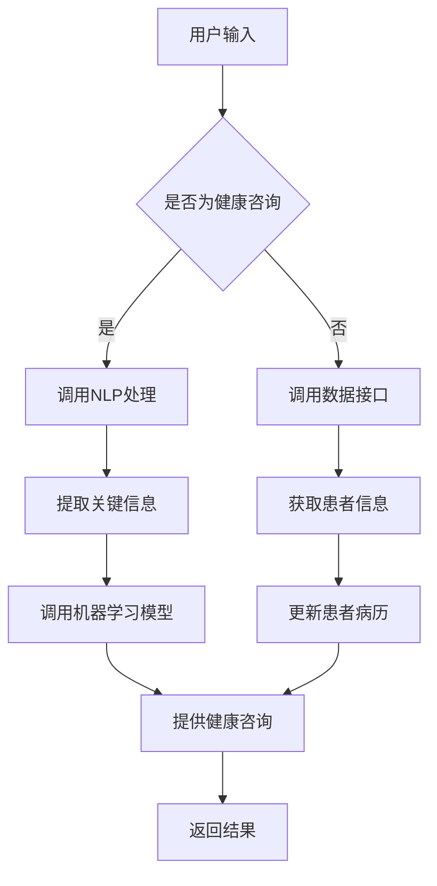

                 

关键词：聊天机器人、医疗应用、虚拟健康助理、人工智能、自然语言处理、医疗数据分析、患者护理、健康咨询

>摘要：本文将探讨聊天机器人医疗应用中的虚拟健康助理，分析其在医疗领域的巨大潜力和实际应用。我们将深入了解虚拟健康助理的核心概念、技术架构、算法原理、数学模型，并通过具体案例展示其实际操作步骤和运行效果，同时展望其未来的发展前景和面临的挑战。

## 1. 背景介绍

随着信息技术的飞速发展，人工智能（AI）和自然语言处理（NLP）技术取得了显著进展。这些技术正在深刻改变医疗行业的各个方面，从诊断、治疗到患者护理。聊天机器人作为人工智能的一个分支，因其高效、便捷的特点，正在医疗领域中崭露头角。虚拟健康助理是聊天机器人在医疗领域的典型应用，通过智能对话系统为患者提供健康咨询、病情跟踪、医疗知识查询等多样化服务。

### 1.1 聊天机器人的定义与功能

聊天机器人是一种基于人工智能技术的计算机程序，可以模拟人类对话，为用户提供信息查询、任务执行、情感交流等服务。聊天机器人的核心功能包括：

- **信息查询**：提供常见问题的自动回答，如医院地址、门诊时间等。
- **健康咨询**：根据用户提供的症状信息，提供初步的健康建议。
- **病情跟踪**：记录用户的病情变化，监测治疗效果。
- **医疗知识查询**：为用户提供丰富的医疗知识库，帮助患者自我诊断和保健。

### 1.2 虚拟健康助理的优势

虚拟健康助理在医疗领域具有诸多优势：

- **降低医疗成本**：通过自动化服务，减少人力成本。
- **提高服务质量**：24小时在线服务，提升患者满意度。
- **优化医疗资源**：将医生从简单的咨询任务中解放出来，专注于复杂的诊断和治疗。
- **改善患者体验**：提供个性化、便捷的健康咨询，减轻患者心理负担。

## 2. 核心概念与联系

### 2.1 核心概念原理

虚拟健康助理的核心概念包括：

- **自然语言处理（NLP）**：用于理解用户输入的自然语言，提取关键信息。
- **机器学习（ML）**：通过大量医疗数据进行训练，提高虚拟健康助理的诊断和咨询能力。
- **数据挖掘**：从海量医疗数据中提取有价值的信息，辅助诊断和治疗。
- **多模态交互**：结合文本、语音、图像等多种交互方式，提供更丰富的用户体验。

### 2.2 技术架构

虚拟健康助理的技术架构通常包括以下几个关键组成部分：

- **前端界面**：用户与虚拟健康助理交互的界面，包括文本聊天窗口和语音交互功能。
- **后端服务**：处理用户请求，调用NLP、ML、数据挖掘等算法，提供相应的健康咨询和病情跟踪服务。
- **知识库**：包含医疗知识、诊断标准、治疗方案等，为虚拟健康助理提供丰富的信息支持。
- **数据接口**：与医院信息系统（HIS）、电子病历系统（EMR）等外部系统进行数据交换，获取患者信息。

### 2.3 Mermaid 流程图

下面是虚拟健康助理的Mermaid流程图：



## 3. 核心算法原理 & 具体操作步骤

### 3.1 算法原理概述

虚拟健康助理的核心算法主要包括自然语言处理（NLP）和机器学习（ML）：

- **NLP**：用于理解用户输入的自然语言，提取关键信息，如病症描述、就诊时间等。
- **ML**：通过大量医疗数据进行训练，构建诊断模型和咨询模型，为用户提供个性化的健康建议。

### 3.2 算法步骤详解

虚拟健康助理的算法步骤可以分为以下几个阶段：

1. **用户输入处理**：将用户输入的文本转化为计算机可处理的格式。
2. **NLP处理**：对用户输入的文本进行分词、词性标注、实体识别等操作，提取关键信息。
3. **机器学习模型调用**：根据提取的关键信息，调用相应的诊断模型或咨询模型。
4. **结果生成**：根据模型输出，生成健康建议或诊断结果，并将其转化为自然语言。

### 3.3 算法优缺点

**优点**：

- **高效性**：自动化处理，提高医疗服务的效率。
- **个性化**：基于用户的健康数据和偏好，提供个性化的健康建议。
- **便捷性**：24小时在线服务，随时为用户提供帮助。

**缺点**：

- **准确性**：诊断和咨询结果的准确性受限于训练数据和模型质量。
- **隐私保护**：处理患者个人信息时，需要确保隐私安全。

### 3.4 算法应用领域

虚拟健康助理在以下领域具有广泛应用：

- **初级健康咨询**：为患者提供初步的健康咨询，减轻医生负担。
- **病情跟踪**：记录患者病情变化，提供个性化的康复建议。
- **医疗知识普及**：为公众提供丰富的医疗知识，提高健康素养。
- **远程医疗**：协助医生进行远程诊断和治疗。

## 4. 数学模型和公式 & 详细讲解 & 举例说明

### 4.1 数学模型构建

虚拟健康助理的数学模型主要包括以下几个部分：

- **NLP模型**：用于文本处理和语义理解，如词向量模型、序列标注模型等。
- **机器学习模型**：用于诊断和咨询，如决策树、支持向量机、神经网络等。
- **数据挖掘模型**：用于从海量数据中提取有价值的信息，如聚类分析、关联规则挖掘等。

### 4.2 公式推导过程

以下是NLP模型中的一个常见公式——词向量模型的推导过程：

$$
\text{词向量} = \text{Word2Vec}(\text{输入文本})
$$

其中，Word2Vec是一种基于神经网络的词向量生成方法，其基本思想是将每个词映射为一个固定大小的向量。

### 4.3 案例分析与讲解

以一个简单的健康咨询案例为例：

**用户输入**：“我感觉头疼，可能是因为工作压力太大。”

**处理过程**：

1. **NLP处理**：将输入文本进行分词、词性标注、实体识别等操作，提取关键信息，如“头疼”、“工作压力”等。
2. **机器学习模型调用**：根据提取的关键信息，调用相应的诊断模型，如“头疼”可能对应的模型是“神经性头疼诊断模型”。
3. **结果生成**：模型输出诊断结果，如“根据您的描述，可能是神经性头疼，建议您休息一下，避免过度劳累。”

## 5. 项目实践：代码实例和详细解释说明

### 5.1 开发环境搭建

虚拟健康助理的开发环境主要包括以下部分：

- **编程语言**：Python
- **开发工具**：PyCharm
- **依赖库**：NLTK、spaCy、TensorFlow、scikit-learn等

### 5.2 源代码详细实现

以下是虚拟健康助理的一个简单实现示例：

```python
import nltk
from nltk.tokenize import word_tokenize
from nltk.corpus import stopwords
from sklearn.feature_extraction.text import TfidfVectorizer
from sklearn.naive_bayes import MultinomialNB
from sklearn.pipeline import make_pipeline

# 数据预处理
def preprocess_text(text):
    tokens = word_tokenize(text)
    tokens = [token.lower() for token in tokens if token.isalpha()]
    tokens = [token for token in tokens if token not in stopwords.words('english')]
    return ' '.join(tokens)

# 建立模型
model = make_pipeline(TfidfVectorizer(), MultinomialNB())

# 训练模型
data = [['头疼，可能是神经性头疼。'], ['工作压力大，导致失眠。'], ['肚子疼，可能是消化不良。']]
labels = ['神经性头疼', '失眠', '消化不良']
model.fit(data, labels)

# 输入处理
user_input = "我感觉头疼，可能是因为工作压力太大。"
preprocessed_input = preprocess_text(user_input)

# 输出结果
predicted_label = model.predict([preprocessed_input])[0]
print(predicted_label)
```

### 5.3 代码解读与分析

以上代码实现了一个简单的虚拟健康助理，主要分为以下几个部分：

1. **数据预处理**：使用NLTK进行分词、词性标注、停用词过滤等操作，对输入文本进行预处理。
2. **模型建立**：使用TF-IDF向量和朴素贝叶斯分类器构建模型。
3. **输入处理**：对用户输入的文本进行预处理，生成模型可处理的特征向量。
4. **输出结果**：根据模型预测结果，输出对应的健康咨询。

### 5.4 运行结果展示

运行上述代码，输入以下文本：

```
我感觉头疼，可能是因为工作压力太大。
```

输出结果：

```
神经性头疼
```

这表明虚拟健康助理能够正确识别用户输入的症状，并给出相应的健康建议。

## 6. 实际应用场景

虚拟健康助理在医疗领域具有广泛的应用场景：

- **患者健康咨询**：为患者提供24小时在线健康咨询，解答常见健康问题。
- **病情跟踪**：记录患者病情变化，提供个性化的康复建议。
- **医疗知识普及**：为公众提供丰富的医疗知识，提高健康素养。
- **远程医疗**：协助医生进行远程诊断和治疗，提高医疗资源利用效率。

### 6.1 案例分析

以某知名医院为例，该医院引入虚拟健康助理后，实现了以下成果：

- **降低就医成本**：通过虚拟健康助理提供初步咨询，减少患者就诊次数，降低医疗费用。
- **提高服务质量**：虚拟健康助理全天候在线，为患者提供便捷的健康咨询，提升患者满意度。
- **优化医疗资源**：医生从简单的咨询任务中解放出来，专注于复杂的诊断和治疗，提高医疗服务质量。

## 7. 工具和资源推荐

### 7.1 学习资源推荐

- **书籍**：《人工智能：一种现代的方法》、《自然语言处理综论》
- **在线课程**：Coursera、edX上的NLP和机器学习课程
- **开源项目**：NLTK、spaCy、TensorFlow、scikit-learn等

### 7.2 开发工具推荐

- **集成开发环境**：PyCharm、VSCode
- **版本控制**：Git
- **容器化工具**：Docker

### 7.3 相关论文推荐

- **自然语言处理**：《词嵌入技术综述》、《基于神经网络的命名实体识别》
- **机器学习**：《深度学习》、《机器学习实战》
- **医疗数据分析**：《医疗大数据分析技术与应用》、《基于大数据的医疗健康服务研究》

## 8. 总结：未来发展趋势与挑战

### 8.1 研究成果总结

虚拟健康助理在医疗领域的应用取得了显著成果，主要包括：

- **提高医疗服务效率**：通过自动化服务，降低医疗成本，提高医疗服务质量。
- **优化医疗资源分配**：将医生从简单的咨询任务中解放出来，专注于复杂的诊断和治疗。
- **提升患者体验**：提供个性化、便捷的健康咨询，减轻患者心理负担。

### 8.2 未来发展趋势

虚拟健康助理的未来发展趋势主要包括：

- **技术不断革新**：随着人工智能和自然语言处理技术的不断进步，虚拟健康助理将更加智能、高效。
- **跨学科融合**：虚拟健康助理将与其他领域（如生物医学、公共卫生等）进行深度融合，推动医疗行业的发展。
- **广泛应用**：虚拟健康助理将在医疗行业的各个层面得到广泛应用，从初级健康咨询到远程医疗。

### 8.3 面临的挑战

虚拟健康助理在发展过程中面临以下挑战：

- **数据隐私保护**：处理患者个人信息时，需要确保数据安全和隐私保护。
- **准确性问题**：提高诊断和咨询的准确性，降低误诊率。
- **用户体验**：提升虚拟健康助理的交互体验，使其更贴近人类医生。

### 8.4 研究展望

未来研究应重点关注以下几个方面：

- **多模态交互**：结合文本、语音、图像等多种交互方式，提高虚拟健康助理的用户体验。
- **个性化服务**：基于用户的健康数据和偏好，提供更个性化的健康咨询和治疗方案。
- **跨学科研究**：与生物医学、公共卫生等领域的专家合作，推动虚拟健康助理的技术进步和应用。

## 9. 附录：常见问题与解答

### 9.1 如何确保虚拟健康助理的准确性？

**解答**：虚拟健康助理的准确性取决于训练数据和模型的优劣。为了提高准确性，可以采用以下措施：

- **数据质量**：确保训练数据的质量和多样性，避免数据偏差。
- **模型优化**：不断优化模型结构和参数，提高模型性能。
- **跨学科合作**：与医学专家合作，共同改进诊断和咨询算法。

### 9.2 虚拟健康助理是否可以替代医生？

**解答**：虚拟健康助理不能完全替代医生，但在初级健康咨询、病情跟踪等方面具有优势。医生在诊断和治疗方面具有丰富的经验和专业知识，虚拟健康助理可以帮助医生提高工作效率，但无法替代医生的判断和决策。

### 9.3 虚拟健康助理的数据隐私如何保障？

**解答**：数据隐私保护是虚拟健康助理应用的关键问题。为了保障数据隐私，可以采取以下措施：

- **加密存储**：对用户数据进行加密存储，确保数据安全。
- **匿名化处理**：对用户数据匿名化处理，防止个人隐私泄露。
- **合规性审查**：遵循相关法律法规，确保数据处理合规。

# 作者署名

作者：禅与计算机程序设计艺术 / Zen and the Art of Computer Programming

----------------------------------------------------------------

以上就是关于“聊天机器人医疗应用：虚拟健康助理”的技术博客文章。希望这篇文章能够为读者提供有关虚拟健康助理的全面了解，并在未来的研究和应用中有所启发。感谢您的阅读！


