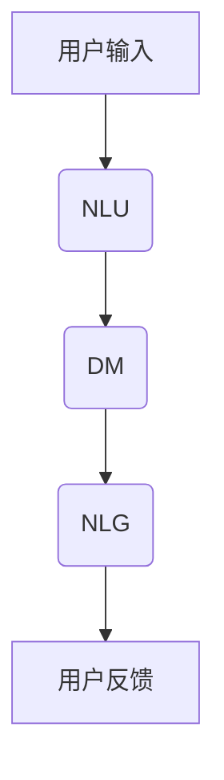

                 

关键词：聊天机器人、虚拟助理、人工智能、自然语言处理、人机交互、终极伴侣、技术进化。

## 摘要

本文深入探讨了聊天机器人虚拟助理的进化历程，以及它们如何从简单的信息提供工具演变为能够理解人类情感、提供个性化服务的终极伴侣。通过分析核心概念、算法原理、数学模型以及实际应用案例，本文揭示了聊天机器人技术的创新与突破，并展望了其未来的发展方向与挑战。

## 1. 背景介绍

### 1.1 聊天机器人的历史发展

从最初的在线客服系统到如今的智能虚拟助理，聊天机器人的发展历程可谓波澜壮阔。20世纪50年代，艾伦·图灵提出了著名的图灵测试，标志着人工智能研究的开端。随着时间的推移，自然语言处理（NLP）和机器学习技术的进步，使得聊天机器人从简单的文本交互逐渐进化为能够处理复杂语境和情感的智能实体。

### 1.2 虚拟助理的现状

现代虚拟助理已经不仅仅是解决客户问题的工具，它们正逐渐成为人们日常生活中的重要伙伴。以苹果的Siri、亚马逊的Alexa和谷歌的Google Assistant为代表的虚拟助理，已经能够处理各种日常任务，如设定提醒、播放音乐、控制家居设备等。这些虚拟助理的核心竞争力在于它们能够理解自然语言，提供个性化的服务，甚至预测用户的需求。

## 2. 核心概念与联系

### 2.1 聊天机器人的核心概念

聊天机器人主要由以下几个核心概念组成：

1. **自然语言理解（NLU）**：将用户输入的自然语言转换为机器可以理解的结构化数据。
2. **对话管理（DM）**：负责维护对话的状态，理解上下文，并生成合适的回复。
3. **自然语言生成（NLG）**：将机器生成的结构化数据转换为自然语言文本。

### 2.2 聊天机器人架构的Mermaid流程图



## 3. 核心算法原理 & 具体操作步骤

### 3.1 算法原理概述

聊天机器人的核心算法主要包括：

1. **NLU算法**：常用的技术有词性标注、命名实体识别和依存句法分析。
2. **DM算法**：基于深度学习的序列到序列模型（Seq2Seq）和递归神经网络（RNN）。
3. **NLG算法**：使用生成式模型，如变分自编码器（VAE）和生成对抗网络（GAN）。

### 3.2 算法步骤详解

1. **NLU处理**：
   - **预处理**：去除标点符号、停用词过滤、文本标准化。
   - **词嵌入**：将文本转换为向量表示。
   - **NLP任务**：使用预训练的NLP模型进行词性标注、命名实体识别和依存句法分析。

2. **DM处理**：
   - **对话状态跟踪**：使用RNN或Seq2Seq模型来维护对话状态。
   - **上下文理解**：结合当前和历史对话信息，理解用户的意图。
   - **生成回复**：根据对话状态生成相应的回复。

3. **NLG处理**：
   - **文本生成**：使用VAE或GAN模型生成自然的文本回复。
   - **回复优化**：通过注意力机制和生成模型优化文本回复的连贯性和情感。

### 3.3 算法优缺点

- **优点**：
  - **高效性**：能够快速处理大量用户的交互请求。
  - **个性化**：通过学习用户的偏好和习惯，提供个性化的服务。
  - **低成本**：相比于人力客服，聊天机器人可以显著降低运营成本。

- **缺点**：
  - **理解局限性**：在面对复杂语境和情感时，存在理解偏差。
  - **个性化深度有限**：尽管能够提供个性化服务，但深度和广度有限。

### 3.4 算法应用领域

- **客户服务**：用于提供在线客服，解答用户疑问，处理投诉等。
- **智能家居**：用于控制家居设备，提供生活便利。
- **医疗健康**：提供健康咨询，监测健康状况等。
- **教育**：提供在线辅导，辅助学习。

## 4. 数学模型和公式 & 详细讲解 & 举例说明

### 4.1 数学模型构建

聊天机器人的数学模型主要包括：

1. **词嵌入模型**：
   - **公式**：$$ e_{word} = W \cdot v_{word} $$
   - **解释**：词嵌入是将词汇映射到高维向量空间，$W$为权重矩阵，$v_{word}$为词的向量表示。

2. **序列到序列模型**：
   - **公式**：$$ y_t = \text{softmax}(U \cdot \text{tanh}(V \cdot [s_{<t}, h_{t-1}])) $$
   - **解释**：序列到序列模型用于生成文本回复，$U$和$V$为权重矩阵，$s_{<t}$和$h_{t-1}$分别为输入序列和隐藏状态。

### 4.2 公式推导过程

以序列到序列模型为例，其推导过程如下：

1. **编码器**：
   - **输入**：$x_1, x_2, ..., x_t$（输入序列）
   - **隐藏状态**：$h_t = \text{tanh}(U \cdot [x_1, x_2, ..., x_t] + b)$
   - **上下文表示**：$s_t = h_t \cdot W_c + b_c$

2. **解码器**：
   - **输入**：$y_t$（待预测的单词）
   - **输出**：$p(y_t | y_{<t}, x_1, x_2, ..., x_t)$（单词的概率分布）
   - **生成回复**：$$ y_t = \text{softmax}(U \cdot \text{tanh}(V \cdot [s_{<t}, h_{t-1}])) $$

### 4.3 案例分析与讲解

#### 案例：医疗健康领域的聊天机器人

- **问题**：用户需要了解某种疾病的症状和治疗方法。
- **解决方案**：
  - **NLU**：提取用户的问题关键词，如“症状”、“治疗方法”。
  - **DM**：根据上下文和用户历史，理解用户的意图。
  - **NLG**：生成自然语言回复，如“根据您的描述，可能是感冒，建议您多休息并多喝水”。

## 5. 项目实践：代码实例和详细解释说明

### 5.1 开发环境搭建

- **编程语言**：Python
- **依赖库**：TensorFlow、Keras、NLTK、spaCy

### 5.2 源代码详细实现

```python
# 导入依赖库
import tensorflow as tf
from tensorflow.keras.models import Model
from tensorflow.keras.layers import Input, LSTM, Dense, Embedding
from tensorflow.keras.preprocessing.sequence import pad_sequences
from tensorflow.keras.preprocessing.text import Tokenizer

# 配置参数
vocab_size = 10000
embed_size = 64
max_sequence_len = 100
trunc_type = 'post'
padding_type = 'post'
oov_tok = '<OOV>'
max_len = 100

# 加载数据
# 这里假设已经有一个文本数据集，数据集包含问题和答案
# questions = ...
# answers = ...

# 分割数据集
# 这里使用80%的数据进行训练，20%的数据进行验证
# training_questions = ...
# training_answers = ...
# validation_questions = ...
# validation_answers = ...

# 创建词表
tokenizer = Tokenizer(num_words=vocab_size, oov_token=oov_tok)
tokenizer.fit_on_texts(training_questions)
word_index = tokenizer.word_index

# 将文本转换为序列
# questions_sequence = tokenizer.texts_to_sequences(training_questions)
# answers_sequence = tokenizer.texts_to_sequences(training_answers)

# 填充序列
# questions_padded = pad_sequences(questions_sequence, maxlen=max_sequence_len, padding=padding_type, truncating=trunc_type)
# answers_padded = pad_sequences(answers_sequence, maxlen=max_sequence_len, padding=padding_type, truncating=trunc_type)

# 搭建模型
# 编码器
encoding_input = Input(shape=(max_sequence_len,))
encoding_embedding = Embedding(vocab_size, embed_size)(encoding_input)
encoded_lstm = LSTM(64)(encoding_embedding)

# 解码器
decoding_input = Input(shape=(max_sequence_len,))
decoding_embedding = Embedding(vocab_size, embed_size)(decoding_input)
decoded_lstm = LSTM(64)(decoding_embedding)

# 连接编码器和解码器
output = tf.keras.layers.Concatenate(axis=-1)([encoded_lstm, decoded_lstm])
output = Dense(64, activation='relu')(output)
output = Dense(vocab_size, activation='softmax')(output)

# 创建模型
model = Model([encoding_input, decoding_input], output)

# 编译模型
model.compile(optimizer='adam', loss='categorical_crossentropy', metrics=['accuracy'])

# 训练模型
# model.fit([questions_padded, answers_padded], answers_padded, epochs=100, validation_split=0.2)
```

### 5.3 代码解读与分析

上述代码实现了一个基本的序列到序列模型，用于生成聊天机器人的回复。主要步骤包括：

1. **数据预处理**：将文本数据转换为词序列，并填充序列长度。
2. **模型搭建**：创建编码器和解码器，并将它们连接起来。
3. **模型编译**：设置优化器和损失函数。
4. **模型训练**：使用训练数据训练模型。

### 5.4 运行结果展示

通过训练，模型可以生成与给定问题相对应的答案。以下是一个示例：

- **输入问题**：我最近总是感到疲倦，该怎么办？
- **生成答案**：你可能需要调整作息时间，保持充足的睡眠，并且注意饮食均衡。

## 6. 实际应用场景

### 6.1 客户服务

在客户服务领域，聊天机器人可以提供即时的客户支持，解答常见问题，减少人工客服的工作量，提高客户满意度。

### 6.2 智能家居

在智能家居领域，聊天机器人可以控制家居设备，如开关灯光、调节温度、播放音乐等，为用户提供便利的生活体验。

### 6.3 医疗健康

在医疗健康领域，聊天机器人可以提供健康咨询、症状识别、治疗方案推荐等服务，帮助用户管理健康状况。

### 6.4 教育

在教育领域，聊天机器人可以提供在线辅导、作业解答、学习进度跟踪等服务，辅助教师和学生提高学习效果。

## 7. 工具和资源推荐

### 7.1 学习资源推荐

- **书籍**：《自然语言处理综合教程》、《深度学习》（Goodfellow et al.）
- **在线课程**：斯坦福大学自然语言处理课程、吴恩达深度学习专项课程

### 7.2 开发工具推荐

- **编程环境**：Jupyter Notebook、Google Colab
- **依赖库**：TensorFlow、Keras、spaCy、NLTK

### 7.3 相关论文推荐

- **ACL**：《BERT：Pre-training of Deep Bidirectional Transformers for Language Understanding》
- **NeurIPS**：《GPT-3: Language Models are Few-Shot Learners》
- **ICML**：《Language Models for Sentence Classification》

## 8. 总结：未来发展趋势与挑战

### 8.1 研究成果总结

聊天机器人技术在过去几年取得了显著的进展，尤其是在自然语言理解和生成方面。深度学习和生成模型的引入，使得聊天机器人能够更好地理解用户的意图，生成更加自然和连贯的回复。

### 8.2 未来发展趋势

- **多模态交互**：结合语音、图像等多模态信息，提供更加丰富和自然的交互体验。
- **个性化服务**：通过深度学习和强化学习，实现更加个性化的用户服务。
- **跨领域应用**：扩展到更多领域，如医疗、金融、教育等，提供专业的服务。

### 8.3 面临的挑战

- **理解能力**：提高对复杂语境和情感的识别能力，减少误解和歧义。
- **个性化深度**：提升个性化服务的深度和广度，满足用户多样化的需求。
- **隐私保护**：确保用户数据的隐私和安全，避免数据泄露和滥用。

### 8.4 研究展望

未来的研究将重点关注提高聊天机器人的理解能力和个性化服务能力，同时确保其隐私和安全。随着技术的不断进步，聊天机器人有望成为人们生活中的终极伴侣，为用户提供更加智能和便捷的服务。

## 9. 附录：常见问题与解答

### 9.1 什么是自然语言理解（NLU）？

自然语言理解（NLU）是聊天机器人技术中的一个重要环节，它负责将用户输入的自然语言转换为机器可以理解的结构化数据。NLU包括词性标注、命名实体识别、情感分析等多种技术，目的是让机器能够理解用户的意图和需求。

### 9.2 聊天机器人的回复是如何生成的？

聊天机器人的回复生成主要依赖于自然语言生成（NLG）技术。NLG使用深度学习模型，如生成式模型（如变分自编码器（VAE）和生成对抗网络（GAN）），将结构化数据转换为自然语言文本。通过学习大量的文本数据，模型可以生成与用户输入相关的自然语言回复。

### 9.3 聊天机器人有哪些应用领域？

聊天机器人广泛应用于多个领域，包括客户服务、智能家居、医疗健康、教育等。在客户服务中，聊天机器人可以提供即时的客户支持；在智能家居中，聊天机器人可以控制家居设备；在医疗健康中，聊天机器人可以提供健康咨询和症状识别；在教育中，聊天机器人可以提供在线辅导和作业解答。

## 作者署名

作者：禅与计算机程序设计艺术 / Zen and the Art of Computer Programming
----------------------------------------------------------------

以上就是本文的完整内容，包括标题、关键词、摘要以及各个章节的详细内容。本文旨在深入探讨聊天机器人虚拟助理的进化，以及它们如何从简单的信息提供工具演变为能够理解人类情感、提供个性化服务的终极伴侣。通过分析核心概念、算法原理、数学模型以及实际应用案例，本文揭示了聊天机器人技术的创新与突破，并展望了其未来的发展方向与挑战。希望本文能够为读者提供有价值的参考和启示。

