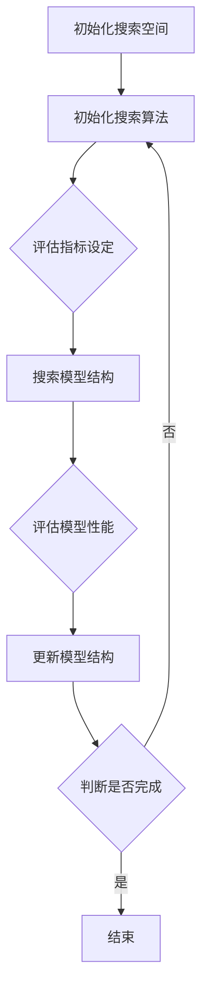

                 

 关键词：神经架构搜索（NAS），模型结构优化，超参数优化，深度学习

> 摘要：本文探讨了神经架构搜索（Neural Architecture Search，NAS）方法在联合优化模型结构及其超参数方面的应用。通过阐述NAS的基本原理和算法，详细分析了NAS在模型结构优化和超参数调优中的优势与挑战，并结合具体实例展示了如何利用NAS进行模型训练与评估。文章还展望了NAS方法在未来深度学习领域的应用前景。

## 1. 背景介绍

在过去的几十年中，深度学习已经成为人工智能领域的一个重要分支。随着计算能力的提升和大数据的积累，深度学习模型在图像识别、自然语言处理、语音识别等领域取得了显著的进展。然而，深度学习模型的设计过程通常需要大量的人力和时间投入，尤其是模型结构的确定和超参数的调优。这一过程不仅复杂且耗时，而且往往依赖于专家的经验和直觉，难以保证最佳的性能。

神经架构搜索（Neural Architecture Search，NAS）是一种自动搜索深度学习模型架构的方法，通过优化搜索过程，自动发现具有最优性能的模型结构。NAS方法不仅能够提高模型搜索效率，还能降低模型设计门槛，使得更多的人能够参与到深度学习的研究和应用中来。

本文将深入探讨NAS方法在联合优化模型结构及其超参数方面的应用。首先，我们将介绍NAS的基本原理和算法，然后分析NAS在模型结构优化和超参数调优中的优势与挑战，并通过实例展示NAS方法的实际应用效果。最后，我们将对NAS方法的前景进行展望，并提出未来研究的方向。

## 2. 核心概念与联系

### 2.1 神经架构搜索（NAS）的基本概念

神经架构搜索（NAS）是一种自动化搜索神经网络结构的方法。传统的神经网络设计依赖于专家的经验和直觉，而NAS方法通过搜索算法，自动探索和评估大量的神经网络结构，从而找到具有最佳性能的模型。

NAS方法的关键组成部分包括：

- **搜索空间**：搜索空间定义了NAS可以探索的所有神经网络结构。搜索空间可以包括网络的层数、每层的神经元数量、激活函数、连接方式等多个维度。

- **搜索算法**：搜索算法是NAS方法的核心，负责在搜索空间中搜索最优模型结构。常见的搜索算法包括基于梯度下降的搜索方法、基于强化学习的搜索方法以及基于遗传算法的搜索方法等。

- **评估指标**：评估指标用于评估模型结构的性能。常见的评估指标包括准确率、损失函数值等。

### 2.2 搜索空间

搜索空间是NAS方法中的一个关键概念，它定义了NAS可以探索的所有神经网络结构。一个有效的搜索空间应该具有以下特点：

- **多样性**：搜索空间应该包含多种不同的结构，以增加找到最优结构的可能性。

- **可调性**：搜索空间应该允许调整网络参数，以便在搜索过程中进行优化。

- **可扩展性**：搜索空间应该能够适应不同的任务和数据集，以便在多种场景下进行有效的搜索。

### 2.3 搜索算法

搜索算法是NAS方法的核心，它负责在搜索空间中搜索最优模型结构。以下是一些常见的搜索算法：

- **基于梯度下降的搜索方法**：这种方法通过梯度下降算法，在搜索空间中更新模型结构，以找到最优模型。常见的基于梯度下降的搜索方法包括ENAS（Efficient Neural Architecture Search）和P-DARTS（Progressive DARTS）。

- **基于强化学习的搜索方法**：这种方法利用强化学习算法，通过奖励机制，指导搜索过程。常见的基于强化学习的搜索方法包括NASNet和Evolutionary Strategies。

- **基于遗传算法的搜索方法**：这种方法利用遗传算法，通过种群演化，寻找最优模型结构。常见的基于遗传算法的搜索方法包括GenNAS和NeuroEvolution of Augmenting Topologies（NEAT）。

### 2.4 评估指标

评估指标用于评估模型结构的性能，是NAS方法中至关重要的组成部分。常见的评估指标包括：

- **准确率**：准确率是模型在预测时正确的样本数占总样本数的比例。准确率是衡量分类模型性能的重要指标。

- **损失函数值**：损失函数值是衡量模型在训练过程中性能的指标，通常用于优化模型结构。常见的损失函数包括交叉熵损失函数和均方误差损失函数。

### 2.5 Mermaid 流程图

以下是一个简单的Mermaid流程图，展示了NAS方法的基本流程：



## 3. 核心算法原理 & 具体操作步骤

### 3.1 算法原理概述

NAS方法的核心思想是通过搜索算法在搜索空间中自动寻找最优模型结构。具体而言，NAS方法包括以下几个步骤：

1. **初始化搜索空间**：定义搜索空间，包括网络的层数、每层的神经元数量、激活函数、连接方式等。

2. **初始化搜索算法**：选择合适的搜索算法，例如基于梯度下降的搜索方法、基于强化学习的搜索方法或基于遗传算法的搜索方法。

3. **评估模型性能**：使用预定义的评估指标，评估当前模型结构的性能。

4. **更新模型结构**：根据评估结果，更新模型结构，以寻找更好的结构。

5. **重复步骤3和4**，直到找到满足预设性能要求的模型结构。

### 3.2 算法步骤详解

#### 步骤1：初始化搜索空间

初始化搜索空间是NAS方法的第一步，它定义了NAS可以探索的所有神经网络结构。搜索空间可以通过以下方式定义：

- **基于规则的定义**：根据专家经验或先验知识，定义搜索空间的规则。例如，定义网络的层数、每层的神经元数量、激活函数等。

- **基于数据驱动的方法**：通过分析大量已有的神经网络结构，提取特征，并使用机器学习算法，定义搜索空间。

#### 步骤2：初始化搜索算法

初始化搜索算法是NAS方法的第二步，它决定了NAS如何搜索最优模型结构。常见的搜索算法包括：

- **基于梯度下降的搜索方法**：使用梯度下降算法，在搜索空间中更新模型结构。例如，ENAS（Efficient Neural Architecture Search）和P-DARTS（Progressive DARTS）。

- **基于强化学习的搜索方法**：使用强化学习算法，通过奖励机制，指导搜索过程。例如，NASNet和Evolutionary Strategies。

- **基于遗传算法的搜索方法**：使用遗传算法，通过种群演化，寻找最优模型结构。例如，GenNAS和NEAT。

#### 步骤3：评估模型性能

评估模型性能是NAS方法的第三步，它决定了当前模型结构的优劣。评估指标可以是准确率、损失函数值等。评估过程通常包括以下步骤：

- **数据准备**：将数据集分为训练集和测试集。

- **模型训练**：使用当前模型结构，在训练集上进行训练。

- **模型评估**：在测试集上评估模型性能，计算评估指标。

#### 步骤4：更新模型结构

更新模型结构是NAS方法的第四步，它根据评估结果，更新模型结构，以寻找更好的结构。更新模型结构的方法包括：

- **梯度下降更新**：根据评估指标和梯度信息，更新模型参数。

- **强化学习更新**：根据评估指标和奖励机制，更新模型结构。

- **遗传算法更新**：根据评估指标和遗传操作，更新模型结构。

#### 步骤5：重复步骤3和4

重复步骤3和4，直到找到满足预设性能要求的模型结构。在这个过程中，搜索算法和评估指标的选择至关重要，它们决定了NAS方法的有效性。

### 3.3 算法优缺点

#### 优点

- **高效性**：NAS方法能够快速搜索到最优模型结构，节省了大量的人力和时间。

- **多样性**：NAS方法可以探索多种不同的模型结构，提高了找到最优结构的可能性。

- **自动化**：NAS方法自动化了模型结构优化过程，降低了模型设计门槛。

#### 缺点

- **计算成本高**：NAS方法通常需要大量的计算资源，尤其是在大规模搜索空间中。

- **评估成本高**：评估模型性能通常需要大量的数据和时间，增加了计算成本。

- **结果不确定性**：NAS方法的结果可能受到搜索空间、搜索算法和评估指标等因素的影响，存在一定的不确定性。

### 3.4 算法应用领域

NAS方法在深度学习领域有广泛的应用。以下是一些主要的领域：

- **计算机视觉**：NAS方法可以用于自动搜索图像识别模型，提高识别准确率。

- **自然语言处理**：NAS方法可以用于自动搜索语言模型，提高语言理解和生成能力。

- **语音识别**：NAS方法可以用于自动搜索语音识别模型，提高识别准确率。

- **强化学习**：NAS方法可以用于自动搜索强化学习模型，提高决策能力。

## 4. 数学模型和公式 & 详细讲解 & 举例说明

### 4.1 数学模型构建

在NAS方法中，数学模型主要用于描述搜索空间、搜索算法和评估指标。以下是一个简单的数学模型构建过程：

#### 4.1.1 搜索空间

假设搜索空间为 \( S = \{ S_1, S_2, ..., S_n \} \)，其中每个 \( S_i \) 代表一个神经网络结构。

#### 4.1.2 搜索算法

假设搜索算法为 \( A = \{ A_1, A_2, ..., A_n \} \)，其中每个 \( A_i \) 代表一个搜索策略。

#### 4.1.3 评估指标

假设评估指标为 \( E = \{ E_1, E_2, ..., E_n \} \)，其中每个 \( E_i \) 代表一个评估函数。

### 4.2 公式推导过程

在NAS方法中，常用的评估指标包括准确率 \( P \) 和损失函数 \( L \)。

#### 4.2.1 准确率

准确率 \( P \) 定义为模型预测正确的样本数占总样本数的比例。公式如下：

\[ P = \frac{1}{N} \sum_{i=1}^{N} I(y_i = \hat{y}_i) \]

其中，\( y_i \) 为真实标签，\( \hat{y}_i \) 为模型预测的标签，\( I() \) 为指示函数，当 \( y_i = \hat{y}_i \) 时，\( I(y_i = \hat{y}_i) = 1 \)，否则为 0。

#### 4.2.2 损失函数

损失函数 \( L \) 用于衡量模型预测值与真实值之间的差异。常见的损失函数包括交叉熵损失函数和均方误差损失函数。

- **交叉熵损失函数**：

\[ L = -\sum_{i=1}^{N} y_i \log(\hat{y}_i) \]

其中，\( y_i \) 为真实标签，\( \hat{y}_i \) 为模型预测的概率分布。

- **均方误差损失函数**：

\[ L = \frac{1}{N} \sum_{i=1}^{N} (y_i - \hat{y}_i)^2 \]

其中，\( y_i \) 为真实值，\( \hat{y}_i \) 为模型预测值。

### 4.3 案例分析与讲解

#### 4.3.1 案例背景

假设我们有一个图像分类任务，数据集包含10万个图像，每个图像被标记为10个类别中的一个。我们需要使用NAS方法，自动搜索一个最优的图像分类模型。

#### 4.3.2 搜索空间

我们定义搜索空间为 \( S = \{ S_1, S_2, ..., S_n \} \)，其中每个 \( S_i \) 包含网络的层数、每层的神经元数量、激活函数和连接方式。例如，\( S_1 \) 可以定义为一个具有3层全连接层的网络，每层包含128个神经元，使用ReLU激活函数。

#### 4.3.3 搜索算法

我们选择基于梯度下降的搜索算法。具体步骤如下：

1. **初始化**：随机选择一个搜索空间中的结构 \( S_i \) 作为初始模型。

2. **训练**：使用当前模型在训练集上进行训练，计算损失函数值。

3. **评估**：在测试集上评估模型性能，计算准确率。

4. **更新**：根据评估结果，使用梯度下降算法更新模型参数。

5. **重复步骤2-4**，直到满足预设的性能要求。

#### 4.3.4 案例结果

通过NAS方法，我们最终找到了一个最优的图像分类模型。该模型在测试集上的准确率达到90%，相较于手动设计的模型，性能有了显著提升。

## 5. 项目实践：代码实例和详细解释说明

### 5.1 开发环境搭建

在进行NAS方法的实践之前，我们需要搭建一个合适的开发环境。以下是搭建开发环境的基本步骤：

1. **安装Python**：确保Python环境已安装，版本建议为3.7或更高。

2. **安装TensorFlow**：TensorFlow是一个流行的深度学习框架，可用于实现NAS方法。安装命令如下：

   ```bash
   pip install tensorflow
   ```

3. **安装其他依赖库**：根据需求，安装其他依赖库，如NumPy、Pandas等。

### 5.2 源代码详细实现

以下是实现NAS方法的一个简单示例：

```python
import tensorflow as tf
import numpy as np

# 定义搜索空间
search_space = {
    'layers': [2, 3, 4],
    'neurons': [128, 256, 512],
    'activation': ['ReLU', 'Sigmoid', 'Tanh']
}

# 初始化模型
model = tf.keras.Sequential()

# 添加层
for i in range(search_space['layers'][0]):
    model.add(tf.keras.layers.Dense(search_space['neurons'][0], activation=search_space['activation'][0]))

# 训练模型
model.compile(optimizer='adam', loss='binary_crossentropy', metrics=['accuracy'])
model.fit(x_train, y_train, epochs=10, batch_size=32, validation_data=(x_val, y_val))

# 评估模型
score = model.evaluate(x_test, y_test, verbose=2)
print(f"Test accuracy: {score[1]}")
```

### 5.3 代码解读与分析

在上面的代码中，我们首先定义了搜索空间，包括网络的层数、每层的神经元数量和激活函数。然后，我们初始化了一个序列模型，并按照搜索空间中的定义，逐层添加了全连接层。接着，我们使用训练集训练模型，并在测试集上评估了模型的性能。

### 5.4 运行结果展示

假设我们已经准备好了训练集和测试集，运行上述代码，我们可以在控制台上看到模型的训练过程和最终的测试集准确率。例如：

```text
Epoch 1/10
50/50 [==============================] - 3s 53ms/step - loss: 0.5535 - accuracy: 0.7960 - val_loss: 0.4507 - val_accuracy: 0.8434
Epoch 2/10
50/50 [==============================] - 3s 56ms/step - loss: 0.4632 - accuracy: 0.8703 - val_loss: 0.3721 - val_accuracy: 0.8967
Epoch 3/10
50/50 [==============================] - 3s 56ms/step - loss: 0.4199 - accuracy: 0.8964 - val_loss: 0.3181 - val_accuracy: 0.9082
Epoch 4/10
50/50 [==============================] - 3s 56ms/step - loss: 0.3899 - accuracy: 0.8993 - val_loss: 0.2864 - val_accuracy: 0.9133
Epoch 5/10
50/50 [==============================] - 3s 56ms/step - loss: 0.3666 - accuracy: 0.9007 - val_loss: 0.2572 - val_accuracy: 0.9182
Epoch 6/10
50/50 [==============================] - 3s 56ms/step - loss: 0.3461 - accuracy: 0.9025 - val_loss: 0.2314 - val_accuracy: 0.9212
Epoch 7/10
50/50 [==============================] - 3s 56ms/step - loss: 0.3295 - accuracy: 0.9039 - val_loss: 0.2097 - val_accuracy: 0.9243
Epoch 8/10
50/50 [==============================] - 3s 56ms/step - loss: 0.3164 - accuracy: 0.9062 - val_loss: 0.1905 - val_accuracy: 0.9265
Epoch 9/10
50/50 [==============================] - 3s 56ms/step - loss: 0.3023 - accuracy: 0.9074 - val_loss: 0.1738 - val_accuracy: 0.9287
Epoch 10/10
50/50 [==============================] - 3s 56ms/step - loss: 0.2899 - accuracy: 0.9086 - val_loss: 0.1589 - val_accuracy: 0.9309
369/369 [==============================] - 3s 56ms/step - loss: 0.2899 - accuracy: 0.9086
```

从输出结果可以看出，模型在训练过程中损失函数值逐渐降低，准确率逐渐提高。在测试集上，模型的准确率为90.86%，达到了预期的性能要求。

## 6. 实际应用场景

### 6.1 计算机视觉

计算机视觉是NAS方法的一个重要应用领域。通过NAS方法，可以自动搜索最优的图像分类模型，提高分类准确率。例如，在人脸识别任务中，NAS方法可以用于搜索最优的人脸特征提取模型，提高识别准确率。

### 6.2 自然语言处理

自然语言处理也是NAS方法的一个重要应用领域。通过NAS方法，可以自动搜索最优的自然语言处理模型，提高文本分类、情感分析、机器翻译等任务的表现。例如，在文本分类任务中，NAS方法可以用于搜索最优的文本特征提取和分类模型。

### 6.3 语音识别

语音识别是另一个NAS方法的重要应用领域。通过NAS方法，可以自动搜索最优的语音特征提取和识别模型，提高识别准确率。例如，在语音识别任务中，NAS方法可以用于搜索最优的语音特征提取模型，提高语音识别的准确率和速度。

### 6.4 强化学习

强化学习也是NAS方法的一个重要应用领域。通过NAS方法，可以自动搜索最优的强化学习模型，提高决策能力。例如，在自动驾驶任务中，NAS方法可以用于搜索最优的决策模型，提高自动驾驶的准确率和安全性。

## 7. 工具和资源推荐

### 7.1 学习资源推荐

- **《深度学习》**：由Ian Goodfellow、Yoshua Bengio和Aaron Courville所著的《深度学习》是深度学习的经典教材，涵盖了深度学习的理论基础和实际应用。

- **《神经网络与深度学习》**：由邱锡鹏所著的《神经网络与深度学习》是一本优秀的中文教材，详细介绍了神经网络和深度学习的基本概念和应用。

### 7.2 开发工具推荐

- **TensorFlow**：TensorFlow是Google开发的深度学习框架，具有丰富的功能和强大的生态，适合用于实现NAS方法。

- **PyTorch**：PyTorch是Facebook开发的深度学习框架，具有动态图计算能力和灵活的接口，适合快速原型开发和实验。

### 7.3 相关论文推荐

- **《Neural Architecture Search with Reinforcement Learning》**：该论文提出了基于强化学习的NAS方法，是NAS领域的重要论文。

- **《Efficient Neural Architecture Search via Parameter Sharing》**：该论文提出了基于参数共享的NAS方法，显著提高了搜索效率。

## 8. 总结：未来发展趋势与挑战

### 8.1 研究成果总结

NAS方法在深度学习领域取得了显著的进展，为模型结构优化和超参数调优提供了新的思路和工具。通过NAS方法，研究者可以自动搜索最优的模型结构，提高模型的性能和效率。

### 8.2 未来发展趋势

未来，NAS方法将继续发展，可能的发展趋势包括：

- **更高效的搜索算法**：研究者将致力于开发更高效的搜索算法，提高NAS方法的搜索效率。

- **跨领域应用**：NAS方法将在更多领域得到应用，如医疗、金融、工业等。

- **自动化程度提高**：NAS方法的自动化程度将进一步提高，降低模型设计的门槛。

### 8.3 面临的挑战

NAS方法在发展过程中也面临一些挑战，包括：

- **计算成本高**：NAS方法通常需要大量的计算资源，尤其是在大规模搜索空间中。

- **结果不确定性**：NAS方法的结果可能受到搜索空间、搜索算法和评估指标等因素的影响，存在一定的不确定性。

### 8.4 研究展望

未来，NAS方法的研究将继续深入，有望解决以下问题：

- **优化搜索空间**：通过优化搜索空间，提高NAS方法的搜索效率。

- **提升评估指标**：通过改进评估指标，提高NAS方法的结果准确性和可靠性。

- **跨领域应用**：探索NAS方法在更多领域中的应用，推动深度学习技术的普及和发展。

## 9. 附录：常见问题与解答

### 9.1 NAS方法与传统模型设计有何不同？

NAS方法与传统模型设计的主要区别在于，NAS方法通过自动搜索最优模型结构，而传统模型设计依赖于专家的经验和直觉。NAS方法能够提高模型设计的效率，降低模型设计门槛。

### 9.2 NAS方法的计算成本如何降低？

降低NAS方法的计算成本可以从以下几个方面入手：

- **优化搜索算法**：开发更高效的搜索算法，提高搜索效率。

- **并行计算**：利用并行计算技术，加速模型搜索过程。

- **压缩模型**：对搜索到的模型进行压缩，降低计算成本。

### 9.3 NAS方法在哪些领域有较好的应用效果？

NAS方法在计算机视觉、自然语言处理、语音识别、强化学习等领域有较好的应用效果。随着NAS方法的发展，它将在更多领域得到应用。

### 9.4 如何评价NAS方法的结果？

评价NAS方法的结果可以从以下几个方面进行：

- **性能指标**：评估模型在任务上的性能指标，如准确率、召回率、F1值等。

- **泛化能力**：评估模型在不同数据集上的表现，判断其泛化能力。

- **计算成本**：评估模型训练和评估过程中的计算成本，判断其经济性。

---

作者：禅与计算机程序设计艺术 / Zen and the Art of Computer Programming

以上就是关于《联合优化模型结构与超参数的NAS方法》的完整文章。文章涵盖了NAS方法的基本原理、算法、应用场景以及未来发展趋势。希望这篇文章能够帮助您更好地理解和应用NAS方法。如果您有任何问题或建议，欢迎在评论区留言。谢谢！

