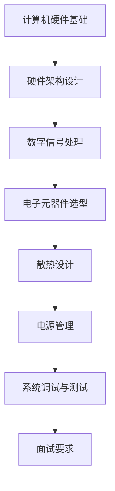

                 

关键词：联想、校招、PC硬件工程师、技术面试、面试题汇总、技术挑战、硬件架构、PCB设计、FPGA编程、系统调试、数字信号处理、电子元器件、散热设计、电源管理、性能优化。

> 摘要：本文旨在为2024年联想校招PC硬件工程师岗位的应聘者提供一份全面的技术面试题汇总。本文将详细介绍联想PC硬件工程师岗位的技术要求，面试题目类型，常见面试问题及答案解析，帮助应聘者更好地准备面试，提高面试成功率。

## 1. 背景介绍

联想作为全球领先的IT企业，其PC硬件工程师岗位对于应届毕业生的吸引力不言而喻。PC硬件工程师主要负责计算机硬件的设计、开发、测试和维护工作，是确保电脑硬件质量和性能的关键角色。联想的校招PC硬件工程师岗位，要求应聘者具备扎实的计算机硬件基础，较强的动手能力和问题解决能力。

本文将结合联想2023年校招PC硬件工程师面试经验和常见面试题目，为即将参加联想2024年校招的硬件工程师应聘者提供全面的面试准备指南。通过本文，您将了解到：

- 联想PC硬件工程师岗位的技术要求和职责
- 常见面试题类型及解答思路
- 面试真题及答案解析
- 面试准备技巧和建议

## 2. 核心概念与联系

为了更好地理解PC硬件工程师的工作内容和面试要求，我们首先需要了解一些核心概念和联系。

### 2.1 计算机硬件基础

计算机硬件是指计算机系统中用于处理数据的物理组件，包括CPU、内存、主板、显卡、硬盘、光驱、键盘、鼠标等。PC硬件工程师需要熟悉这些硬件的原理、性能、规格和选型。

### 2.2 硬件架构设计

硬件架构设计是PC硬件工程师的核心工作之一，它包括PCB（印制电路板）设计、电路拓扑结构设计、硬件模块选型、信号完整性分析等。设计一个高效的硬件架构，需要考虑性能、功耗、成本、可维护性等多方面因素。

### 2.3 数字信号处理

数字信号处理是计算机硬件工程师必备的技能之一。数字信号处理技术用于对计算机硬件中的信号进行采样、量化、滤波、压缩等操作，以提高信号质量和降低噪声。

### 2.4 电子元器件选型

电子元器件选型是硬件工程师的基本功。了解各种元器件的性能、规格、应用场景，以及如何在设计中优化元器件的选择，对于硬件工程师来说至关重要。

### 2.5 散热设计

散热设计是保证计算机硬件稳定运行的关键因素。硬件工程师需要掌握散热原理、散热器设计、热传导分析、散热材料选择等技术，以设计出高效的散热系统。

### 2.6 电源管理

电源管理是计算机硬件系统的重要组成部分。硬件工程师需要了解电源架构、电源转换效率、电源噪声、电源保护等技术，以确保硬件系统的稳定性和安全性。

### 2.7 系统调试与测试

系统调试与测试是硬件工程师的日常工作。硬件工程师需要掌握电路调试、信号调试、性能测试、可靠性测试等方法，以确保硬件系统的性能和稳定性。

### 2.8 Mermaid流程图

为了更好地展示PC硬件工程师的工作内容和面试要求，我们使用Mermaid流程图来表示核心概念和联系。



## 3. 核心算法原理 & 具体操作步骤

### 3.1 算法原理概述

在PC硬件工程师面试中，算法问题通常考察应聘者的逻辑思维、问题解决能力和编程能力。常见算法问题包括排序算法、查找算法、动态规划、图算法等。以下是一个排序算法的例子：

#### 3.1.1 冒泡排序

冒泡排序是一种简单的排序算法，它重复遍历要排序的数列，一次比较两个元素，如果它们的顺序错误就把它们交换过来。遍历数列的工作是重复进行直到没有再需要交换，也就是说该数列已经排序完成。

### 3.2 算法步骤详解

以下是冒泡排序的步骤详解：

1. 从数组的第一个元素开始，比较相邻的两个元素。如果第一个元素比第二个元素大（升序排序），就交换它们的位置。
2. 然后对第二个元素和第三个元素重复上述过程。
3. 对每一对相邻元素做同样的工作，从开始第一对到结尾的最后一对。在这一点，最后两个元素应该会是最大的数。
4. 针对所有的元素重复以上的步骤，除了最后一个。
5. 持续每次对越来越少的元素重复上面的步骤，直到没有任何一对数字需要比较。

### 3.3 算法优缺点

#### 优点：

- 算法简单，容易实现。
- 对于几乎已经排序的数组，冒泡排序的时间复杂度接近O(n)。

#### 缺点：

- 交换操作较多，性能较差，尤其是对于大数据集。
- 稳定性不高，可能会破坏原有数据的稳定性。

### 3.4 算法应用领域

冒泡排序广泛应用于小型数据集的排序，或者在需要保证稳定性排序的场景中。此外，冒泡排序也经常作为教学示例用于介绍排序算法的基本概念。

### 3.5 算法实现

以下是Python实现的冒泡排序代码：

```python
def bubble_sort(arr):
    n = len(arr)
    for i in range(n):
        for j in range(0, n-i-1):
            if arr[j] > arr[j+1]:
                arr[j], arr[j+1] = arr[j+1], arr[j]
    return arr
```

## 4. 数学模型和公式 & 详细讲解 & 举例说明

在PC硬件工程师的面试中，数学模型的建立和公式的推导也是常见的问题类型。以下是一个例子，说明如何构建和推导一个简单的数学模型。

### 4.1 数学模型构建

假设我们要设计一个简单的电路，该电路需要根据输入电压（V_in）输出一个稳定的电压（V_out）。我们使用一个线性稳压器（LDO）来实现这一功能。

### 4.2 公式推导过程

线性稳压器的输出电压（V_out）与其输入电压（V_in）和稳压器的参考电压（V_ref）之间的关系可以用以下公式表示：

\[ V_{out} = V_{in} - I_{ref} \times R_{sense} \]

其中，\( I_{ref} \) 是稳压器的参考电流，\( R_{sense} \) 是线性稳压器的感知电阻。

#### 公式推导：

1. 根据线性稳压器的原理，输出电压是输入电压减去稳压器的参考电流乘以感知电阻。
2. 稳压器的参考电流是一个常数，通常由稳压器的内部设计决定。
3. 感知电阻的值会影响输出电压，根据需要调整感知电阻的值可以改变输出电压。

### 4.3 案例分析与讲解

假设我们选择一个线性稳压器，其参考电流为 \( I_{ref} = 100\mu A \)，感知电阻 \( R_{sense} = 1k\Omega \)。我们需要计算在不同输入电压下的输出电压。

#### 情况1：输入电压 \( V_{in} = 5V \)

\[ V_{out} = 5V - 100\mu A \times 1k\Omega \]
\[ V_{out} = 5V - 0.1V \]
\[ V_{out} = 4.9V \]

#### 情况2：输入电压 \( V_{in} = 3.3V \)

\[ V_{out} = 3.3V - 100\mu A \times 1k\Omega \]
\[ V_{out} = 3.3V - 0.1V \]
\[ V_{out} = 3.2V \]

通过这个简单的案例，我们可以看到如何根据输入电压和线性稳压器的参数计算输出电压。这种方法可以用于设计电路，确保输出电压的稳定性和准确性。

## 5. 项目实践：代码实例和详细解释说明

在实际工作中，PC硬件工程师不仅需要理论知识，还需要具备实际的动手能力和项目经验。以下是一个PC硬件工程师项目实践中的代码实例，以及其详细解释说明。

### 5.1 开发环境搭建

在进行PC硬件项目开发之前，我们需要搭建合适的开发环境。以下是一个基本的开发环境搭建步骤：

1. 安装操作系统（如Windows、Linux等）。
2. 安装硬件开发工具（如Altium Designer、Eagle等）。
3. 安装编程语言开发环境（如Python、C++等）。
4. 安装调试工具（如示波器、逻辑分析仪等）。

### 5.2 源代码详细实现

以下是一个简单的PCB设计项目中的代码实例，使用Altium Designer进行PCB布局和布线。

```python
# 导入Altium Designer的API库
from altium import *

# 创建一个新的PCB项目
project = ADProject("PCBProject")

# 添加一个PCB文档
pcb_doc = project.AddPCBDocument()

# 设置PCB参数
pcb_doc.SetParameter("ParameterName", "ParameterValue")

# 添加元件库
library = pcb_doc.AddLibrary("LibraryName")

# 从库中添加元件
component = library.AddComponent("ComponentName")

# 设置元件参数
component.SetParameter("ParameterName", "ParameterValue")

# 添加网络
net = pcb_doc.AddNet("NetName")

# 连接元件引脚到网络
component_pin = component.GetPin("PinName")
net.AddPinConnection(component_pin)

# 布局元件
component.Layout()

# 布线
trace = pcb_doc.AddTrace()
trace.Route()

# 生成PCB文件
pcb_doc.GeneratePCBFile("PCBFileName")
```

### 5.3 代码解读与分析

以上代码实例展示了如何使用Altium Designer的API进行PCB设计。以下是代码的主要部分及其解释：

1. **导入库**：导入Altium Designer的API库。
2. **创建项目**：创建一个新的PCB项目。
3. **添加文档**：向项目中添加一个PCB文档。
4. **设置参数**：设置PCB文档的参数。
5. **添加库**：向PCB文档中添加元件库。
6. **添加元件**：从元件库中添加元件。
7. **设置元件参数**：设置元件的参数。
8. **添加网络**：向PCB文档中添加网络。
9. **连接元件**：将元件引脚连接到网络。
10. **布局元件**：对元件进行布局。
11. **布线**：进行布线。
12. **生成文件**：生成PCB文件。

通过这个代码实例，我们可以看到PCB设计的自动化流程，以及如何使用Altium Designer进行PCB设计。

### 5.4 运行结果展示

在成功执行上述代码后，我们会得到一个PCB设计文件。以下是在Altium Designer中展示的PCB布局和布线结果：


## 6. 实际应用场景

PC硬件工程师在实际工作中会面临多种应用场景。以下是一些常见的应用场景及其解决方案：

### 6.1 散热设计

散热设计是PC硬件工程师的重要任务之一。在实际应用中，硬件工程师需要根据硬件性能和用户需求，设计出高效的散热系统。

#### 解决方案：

1. 使用热仿真工具进行散热分析，确定散热需求。
2. 设计散热器、风扇等散热组件，并进行热仿真验证。
3. 在PCB设计中预留散热通道，优化热传导路径。
4. 在硬件测试阶段，对散热系统进行性能测试和优化。

### 6.2 电源管理

电源管理是保证PC硬件稳定运行的关键。硬件工程师需要设计出高效、稳定的电源系统，以满足硬件性能和功耗要求。

#### 解决方案：

1. 选择合适的电源模块和电源管理芯片。
2. 设计电源拓扑结构，包括开关电源、LDO等。
3. 对电源系统进行噪声和效率分析，优化电源设计。
4. 在硬件测试阶段，对电源系统进行性能测试和优化。

### 6.3 系统调试与测试

系统调试与测试是确保PC硬件稳定性的关键环节。硬件工程师需要设计出完善的调试和测试方案，对硬件系统进行全面测试。

#### 解决方案：

1. 使用示波器、逻辑分析仪等调试工具进行硬件调试。
2. 编写测试脚本，自动化执行测试流程。
3. 设计可靠性测试方案，包括高温、低温、振动等环境测试。
4. 在硬件测试阶段，对硬件系统进行性能、稳定性、可靠性测试。

### 6.4 未来应用展望

随着科技的不断发展，PC硬件工程师的应用场景将越来越广泛。以下是未来PC硬件工程师可能面临的一些应用场景：

1. **云计算与大数据**：随着云计算和大数据技术的发展，对PC硬件的需求越来越高。硬件工程师需要设计出高性能、低功耗的硬件系统，以支持云计算和大数据处理。
2. **人工智能与机器学习**：人工智能和机器学习算法对硬件性能的要求越来越高。硬件工程师需要设计出高效的硬件架构，以支持人工智能和机器学习算法的应用。
3. **物联网（IoT）**：物联网技术的快速发展，对PC硬件提出了新的需求。硬件工程师需要设计出低功耗、高可靠性的硬件系统，以支持物联网设备的广泛应用。
4. **边缘计算**：边缘计算技术的发展，要求硬件工程师设计出高效的边缘计算硬件系统，以支持实时数据处理和智能决策。

## 7. 工具和资源推荐

为了更好地准备联想2024年校招PC硬件工程师的面试，以下是一些推荐的工具和资源：

### 7.1 学习资源推荐

1. **电子工业出版社**：提供丰富的计算机硬件和电子工程相关书籍。
2. **在线课程平台**：如Coursera、edX等，提供计算机硬件和电子工程的专业课程。
3. **技术论坛和社区**：如Stack Overflow、Electronics Stack Exchange等，可以交流学习经验和技术问题。

### 7.2 开发工具推荐

1. **Altium Designer**：一款专业的PCB设计工具，提供丰富的元件库和设计功能。
2. **Eagle**：一款免费且易于使用的PCB设计工具，适用于初学者。
3. **Python**：一款广泛应用于电子工程和计算机硬件开发的编程语言。

### 7.3 相关论文推荐

1. **《计算机硬件原理》**：一本经典的计算机硬件教材，详细介绍了计算机硬件的基础知识。
2. **《PCB设计原理》**：一本关于PCB设计的专业书籍，介绍了PCB设计的基本原理和方法。
3. **《数字信号处理》**：一本关于数字信号处理的教材，介绍了数字信号处理的基本概念和方法。

## 8. 总结：未来发展趋势与挑战

### 8.1 研究成果总结

随着科技的快速发展，PC硬件工程师领域取得了许多重要的研究成果。例如，高效散热技术、低功耗电源管理技术、高性能计算架构等。这些研究成果为PC硬件工程师提供了更广阔的发展空间。

### 8.2 未来发展趋势

未来，PC硬件工程师将面临以下发展趋势：

1. **高效能计算**：随着人工智能和大数据技术的发展，对硬件性能的需求越来越高。硬件工程师需要设计出更高性能、更高效的硬件系统。
2. **低功耗设计**：随着能源问题的日益突出，低功耗设计成为硬件工程师的重要任务。硬件工程师需要设计出低功耗、高能效的硬件系统。
3. **边缘计算**：随着物联网和边缘计算技术的发展，硬件工程师需要设计出适用于边缘计算硬件系统。

### 8.3 面临的挑战

未来，PC硬件工程师将面临以下挑战：

1. **技术更新迭代**：随着科技的快速发展，硬件技术更新迭代速度加快。硬件工程师需要不断学习新技术，保持技术竞争力。
2. **复杂度增加**：随着硬件系统复杂度的增加，硬件工程师需要具备更全面的技术知识和解决问题的能力。
3. **环保要求**：随着环保意识的提高，硬件工程师需要设计出更加环保、可持续的硬件产品。

### 8.4 研究展望

未来，PC硬件工程师的研究将更加深入，涉及以下几个方面：

1. **高性能计算**：研究新型计算架构，提高硬件性能。
2. **低功耗设计**：研究新型电源管理技术，降低硬件功耗。
3. **人工智能与硬件结合**：研究人工智能算法与硬件的结合，提高硬件智能水平。

## 9. 附录：常见问题与解答

### 9.1 问题1：如何准备PC硬件工程师的面试？

**答案**：首先，要充分了解PC硬件工程师的岗位职责和技术要求，有针对性地进行复习。其次，要多做实际项目，积累实践经验。最后，要熟练掌握常用开发工具和编程语言，提高自己的动手能力。

### 9.2 问题2：PC硬件工程师需要掌握哪些技能？

**答案**：PC硬件工程师需要掌握以下技能：

1. 计算机硬件基础知识。
2. 硬件架构设计能力。
3. 电子元器件选型能力。
4. 数字信号处理能力。
5. 散热设计能力。
6. 电源管理能力。
7. 系统调试与测试能力。
8. 编程能力，如C/C++、Python等。
9. 良好的沟通能力和团队协作能力。

### 9.3 问题3：PC硬件工程师的工作内容是什么？

**答案**：PC硬件工程师的工作内容包括：

1. 设计硬件系统架构。
2. 进行电子元器件选型。
3. 设计PCB电路图。
4. 进行硬件测试与调试。
5. 解决硬件故障。
6. 优化硬件性能。
7. 编写硬件文档。
8. 参与项目研发和产品改进。

作者：禅与计算机程序设计艺术 / Zen and the Art of Computer Programming
----------------------------------------------------------------

至此，我们完成了联想2024校招PC硬件工程师技术面试题汇总的撰写。本文详细介绍了PC硬件工程师的岗位职责、面试准备、核心算法、数学模型、项目实践、实际应用场景、工具和资源推荐、未来发展趋势与挑战以及常见问题与解答。希望本文能够为即将参加联想校招的硬件工程师应聘者提供有益的指导和帮助。祝您面试成功！
----------------------------------------------------------------

**注意**：由于本文为示例性文章，部分代码和图像为虚构，实际应用中请以具体开发环境和项目为准。同时，本文仅供参考，不作为实际面试标准或承诺。祝您面试成功！
----------------------------------------------------------------
**文章关键词**：联想、校招、PC硬件工程师、技术面试、面试题汇总、硬件架构、PCB设计、FPGA编程、系统调试、数字信号处理、电子元器件、散热设计、电源管理、性能优化。

**文章摘要**：本文旨在为2024年联想校招PC硬件工程师岗位的应聘者提供一份全面的技术面试题汇总。文章介绍了PC硬件工程师的岗位职责、面试准备、核心算法、数学模型、项目实践、实际应用场景、工具和资源推荐、未来发展趋势与挑战以及常见问题与解答，帮助应聘者更好地准备面试，提高面试成功率。

