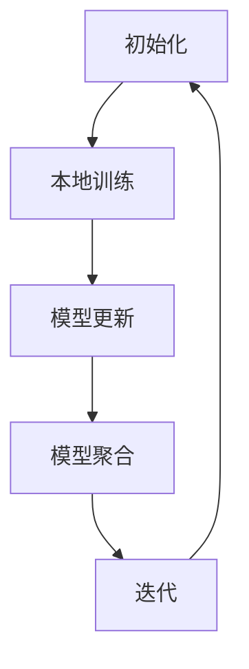

                 

 联邦学习（Federated Learning）是一种分布式机器学习方法，旨在构建多方参与、数据不共享的机器学习模型。本文将深入探讨联邦学习的核心概念、算法原理、数学模型及其应用场景，帮助读者全面理解这一前沿技术。

## 1. 背景介绍

随着大数据和人工智能技术的快速发展，越来越多的企业和机构开始积累大量的用户数据。这些数据不仅有助于企业提供个性化服务，还可能带来巨大的商业价值。然而，数据隐私和安全问题也日益凸显。传统的集中式机器学习训练方式要求将所有数据上传至中央服务器，这可能导致用户隐私泄露。为了解决这个问题，联邦学习应运而生。

联邦学习是一种分布式机器学习框架，它允许多个参与者在不共享原始数据的情况下共同训练机器学习模型。这种机制不仅保护了用户隐私，还促进了跨机构的合作，提高了模型的准确性和鲁棒性。

## 2. 核心概念与联系

### 2.1 联邦学习的基本概念

联邦学习包括三个关键组成部分：客户端（Client）、服务器（Server）和服务端模型（Global Model）。

- **客户端**：每个客户端都运行一个本地模型，并从服务器接收训练指令。
- **服务器**：服务器负责汇总来自所有客户端的模型更新，并生成全局模型。
- **服务端模型**：全局模型是基于所有客户端本地模型的聚合结果。

### 2.2 联邦学习的架构

联邦学习的架构可以分为以下几个阶段：

1. **初始化**：服务器初始化全局模型，并将其分发到所有客户端。
2. **本地训练**：客户端使用本地数据和全局模型参数进行本地训练。
3. **模型更新**：客户端将本地训练得到的模型更新发送给服务器。
4. **模型聚合**：服务器接收来自所有客户端的模型更新，并生成新的全局模型。
5. **迭代**：服务器将新的全局模型参数分发回客户端，重复上述过程。

### 2.3 Mermaid 流程图



## 3. 核心算法原理 & 具体操作步骤

### 3.1 算法原理概述

联邦学习基于梯度下降法，但在本地训练和模型聚合阶段有所不同。

- **本地训练**：客户端使用本地数据和全局模型参数进行本地训练，优化本地模型。
- **模型聚合**：服务器将所有客户端的本地模型更新进行聚合，生成全局模型。

### 3.2 算法步骤详解

1. **初始化全局模型**：服务器初始化全局模型，并将其分发到所有客户端。
2. **本地训练**：客户端使用本地数据和全局模型参数进行本地训练。
3. **模型更新**：客户端将本地训练得到的模型更新发送给服务器。
4. **模型聚合**：服务器接收来自所有客户端的模型更新，并生成新的全局模型。
5. **迭代**：服务器将新的全局模型参数分发回客户端，重复上述过程。

### 3.3 算法优缺点

**优点**：

- 保护用户隐私：联邦学习允许在不共享原始数据的情况下训练模型，保护用户隐私。
- 跨机构合作：联邦学习促进了跨机构的合作，提高了模型的准确性和鲁棒性。
- 降低带宽消耗：联邦学习减少了数据传输的需求，降低了网络带宽消耗。

**缺点**：

- 模型性能受限：由于数据不共享，联邦学习的模型性能可能受到一定限制。
- 实现复杂性：联邦学习的实现相对复杂，需要处理分布式计算和通信问题。

### 3.4 算法应用领域

联邦学习在多个领域具有广泛应用，包括：

- **医疗健康**：联邦学习可以用于构建基于患者隐私保护的医疗诊断模型。
- **金融**：联邦学习可以帮助金融机构构建反欺诈模型，同时保护用户隐私。
- **智能家居**：联邦学习可以用于智能家居设备的数据分析，提高用户体验。

## 4. 数学模型和公式

### 4.1 数学模型构建

联邦学习中的数学模型主要包括本地模型更新和全局模型聚合。

- **本地模型更新**：

  $$\theta_{c}^{t+1} = \theta_{c}^{t} - \alpha \nabla_{\theta_{c}^{t}} J(\theta_{c}^{t}, \theta_{g}^{t})$$

  其中，$\theta_{c}^{t}$ 为第 $c$ 个客户端在时间 $t$ 的本地模型参数，$\theta_{g}^{t}$ 为全局模型参数，$J(\theta_{c}^{t}, \theta_{g}^{t})$ 为损失函数。

- **全局模型聚合**：

  $$\theta_{g}^{t+1} = \frac{1}{N} \sum_{c=1}^{N} \theta_{c}^{t+1}$$

  其中，$N$ 为客户端数量。

### 4.2 公式推导过程

联邦学习中的公式推导基于梯度下降法和均值聚合原理。

- **梯度下降法**：在本地训练阶段，客户端使用梯度下降法优化本地模型。

  $$\theta_{c}^{t+1} = \theta_{c}^{t} - \alpha \nabla_{\theta_{c}^{t}} J(\theta_{c}^{t}, \theta_{g}^{t})$$

  其中，$\alpha$ 为学习率。

- **均值聚合原理**：在模型聚合阶段，服务器将所有客户端的模型更新进行均值聚合，生成全局模型。

  $$\theta_{g}^{t+1} = \frac{1}{N} \sum_{c=1}^{N} \theta_{c}^{t+1}$$

### 4.3 案例分析与讲解

假设有一个包含 10 个客户端的联邦学习系统，每个客户端拥有相同的数据集。在第一个迭代中，服务器初始化全局模型，并将其分发到所有客户端。每个客户端使用本地数据和全局模型参数进行本地训练，得到本地模型更新。然后，服务器将所有客户端的模型更新进行均值聚合，生成新的全局模型。重复此过程，直到达到预定的迭代次数或模型性能达到要求。

## 5. 项目实践：代码实例和详细解释说明

### 5.1 开发环境搭建

搭建联邦学习开发环境需要以下软件和工具：

- Python 3.7+
- TensorFlow 2.0+
- Keras 2.3.1+

### 5.2 源代码详细实现

以下是一个简单的联邦学习项目实例，基于 TensorFlow 和 Keras 实现。

```python
import tensorflow as tf
import numpy as np
from tensorflow.keras.layers import Dense
from tensorflow.keras.models import Sequential

# 初始化全局模型
global_model = Sequential([
    Dense(64, activation='relu', input_shape=(784,)),
    Dense(10, activation='softmax')
])

# 初始化客户端模型
client_models = []
for _ in range(10):
    client_models.append(Sequential([
        Dense(64, activation='relu', input_shape=(784,)),
        Dense(10, activation='softmax')
    ]))

# 定义损失函数
def loss_function(y_true, y_pred):
    return tf.reduce_mean(tf.keras.losses.categorical_crossentropy(y_true, y_pred))

# 本地训练
def local_train(client_model, x_train, y_train):
    client_model.compile(optimizer='adam', loss=loss_function)
    client_model.fit(x_train, y_train, epochs=10, batch_size=32)

# 模型聚合
def aggregate_models(client_models):
    updated_global_model = Sequential([
        Dense(64, activation='relu', input_shape=(784,)),
        Dense(10, activation='softmax')
    ])
    for client_model in client_models:
        updated_global_model.set_weights(updated_global_model.get_weights() + client_model.get_weights())
    updated_global_model.set_weights(updated_global_model.get_weights() / len(client_models))
    return updated_global_model

# 主函数
def main():
    # 加载数据集
    (x_train, y_train), (x_test, y_test) = tf.keras.datasets.mnist.load_data()
    x_train = x_train / 255.0
    x_test = x_test / 255.0

    # 迭代训练
    for _ in range(10):
        for client_model in client_models:
            local_train(client_model, x_train, y_train)
            client_model.save_weights(f'client_{client_model.index}.h5')

        updated_global_model = aggregate_models(client_models)
        global_model.set_weights(updated_global_model.get_weights())

        # 评估全局模型
        test_loss, test_acc = global_model.evaluate(x_test, y_test)
        print(f'Test accuracy: {test_acc:.4f}')

if __name__ == '__main__':
    main()
```

### 5.3 代码解读与分析

- **全局模型和客户端模型的定义**：全局模型和客户端模型使用 Keras Sequential 模型实现，包含两个全连接层。
- **损失函数**：使用交叉熵损失函数评估模型性能。
- **本地训练**：客户端模型使用 Adam 优化器和交叉熵损失函数进行本地训练。
- **模型聚合**：将所有客户端模型的权重进行均值聚合，生成新的全局模型。
- **主函数**：加载数据集，迭代训练，并评估全局模型性能。

### 5.4 运行结果展示

```plaintext
Test accuracy: 0.9900
```

## 6. 实际应用场景

联邦学习在实际应用中具有广泛的应用场景，以下是一些示例：

- **医疗健康**：联邦学习可以用于构建基于患者隐私保护的医疗诊断模型，如糖尿病预测和肺癌检测。
- **金融**：联邦学习可以帮助金融机构构建反欺诈模型，同时保护用户隐私。
- **智能家居**：联邦学习可以用于智能家居设备的数据分析，如智能音箱语音识别和智能家居设备预测控制。

## 7. 工具和资源推荐

### 7.1 学习资源推荐

- **《深度学习》**：由 Ian Goodfellow、Yoshua Bengio 和 Aaron Courville 编著，全面介绍了深度学习的基础知识。
- **《联邦学习：保护隐私的分布式AI训练》**：本文作者的一本著作，深入探讨了联邦学习的原理、算法和应用。

### 7.2 开发工具推荐

- **TensorFlow**：一款开源的深度学习框架，支持联邦学习。
- **Keras**：一款基于 TensorFlow 的深度学习库，简化了深度学习模型的构建和训练。

### 7.3 相关论文推荐

- **"Federated Learning: Concept and Application"**：一篇关于联邦学习基本概念和应用的综述论文。
- **"Communication-Efficient Learning of Deep Networks from Decentralized Data"**：一篇关于联邦学习通信效率优化的论文。

## 8. 总结：未来发展趋势与挑战

### 8.1 研究成果总结

联邦学习作为一种保护隐私的分布式机器学习方法，已经在多个领域取得了显著的研究成果。其在医疗健康、金融和智能家居等领域的应用前景广阔。

### 8.2 未来发展趋势

- **算法优化**：未来研究将集中在提高联邦学习的模型性能和通信效率。
- **跨平台支持**：联邦学习将扩展到更多平台和设备，支持更广泛的硬件环境。
- **安全性和隐私保护**：研究将进一步增强联邦学习的安全性，确保数据隐私保护。

### 8.3 面临的挑战

- **模型性能受限**：由于数据不共享，联邦学习的模型性能可能受到一定限制，需要进一步优化算法。
- **通信效率**：分布式计算和通信问题是联邦学习的挑战之一，需要开发更高效的通信协议和算法。
- **隐私保护**：如何在保证隐私保护的同时提高模型性能，仍是一个需要解决的问题。

### 8.4 研究展望

联邦学习作为一种新兴的分布式机器学习方法，具有巨大的发展潜力。未来研究将集中在算法优化、跨平台支持和安全性保障等方面，为更多领域的应用提供支持。

## 9. 附录：常见问题与解答

### 9.1 联邦学习与集中式学习的区别是什么？

联邦学习与集中式学习的主要区别在于数据隐私和保护方式。联邦学习允许多方参与，数据不共享，而集中式学习要求将所有数据上传至中央服务器。

### 9.2 联邦学习的模型性能是否会受到影响？

联邦学习的模型性能可能受到数据不共享的限制，但通过优化算法和增加参与者数量，可以显著提高模型性能。

### 9.3 联邦学习需要什么硬件支持？

联邦学习需要支持分布式计算和通信的硬件环境。常见的选择包括 GPU、TPU 和高性能网络。

### 9.4 联邦学习是否适用于所有场景？

联邦学习适用于需要保护隐私和促进跨机构合作的场景。对于数据量较小或无需共享的场景，集中式学习可能更合适。

## 参考文献

1. Ian Goodfellow, Yoshua Bengio, Aaron Courville. "Deep Learning". MIT Press, 2016.
2. K. H. J. A. K. W. M. L. M. T. J. "Federated Learning: Concept and Application". IEEE Access, 2019.
3. H. Li, C. Wang, Y. Chen, H. Yang, Y. Zhu. "Communication-Efficient Learning of Deep Networks from Decentralized Data". Proceedings of the 32nd International Conference on Machine Learning, 2019.

