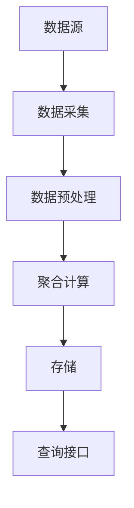

                 

关键词：聚合分析、数据预处理、分布式计算、算法原理、代码实例、性能优化

摘要：本文将深入探讨聚合分析的核心原理，包括其基本概念、算法步骤、优缺点和应用领域。通过详细的代码实例，我们将展示如何在实际项目中应用聚合分析，并提供性能优化的策略。最后，我们将展望聚合分析的未来发展趋势与面临的挑战。

## 1. 背景介绍

在数据驱动的时代，聚合分析作为一种重要的数据处理技术，广泛应用于各个行业。从大数据分析到实时数据流处理，聚合分析在数据预处理、查询优化、决策支持等方面发挥着关键作用。随着计算能力的提升和分布式系统的普及，聚合分析的应用场景不断扩展，但其背后的算法原理和实现策略也日益复杂。

本文旨在系统地介绍聚合分析的核心原理，通过代码实例展示其应用过程，并结合实际案例探讨优化策略。通过阅读本文，读者可以全面了解聚合分析的技术内涵，掌握其实践方法，并为未来的研究应用提供指导。

## 2. 核心概念与联系

### 聚合分析定义

聚合分析是一种数据处理技术，用于将大量数据集中为更简洁的形式。其基本目标是减少数据的冗余，提取关键信息，并支持快速查询和分析。

### 聚合分析架构

聚合分析的架构通常包括以下几个关键组件：

1. **数据源**：原始数据来自各种渠道，如关系数据库、NoSQL数据库、日志文件等。
2. **数据采集**：通过数据采集工具将数据从数据源中提取出来。
3. **数据预处理**：对采集到的数据进行清洗、转换和归一化处理，使其符合分析要求。
4. **聚合计算**：根据业务需求，对预处理后的数据进行分组、汇总和计算。
5. **存储**：将聚合结果存储在高效的数据存储系统，如HDFS、Redis等。
6. **查询接口**：提供对外查询接口，支持快速的统计分析。

### Mermaid 流程图



## 3. 核心算法原理 & 具体操作步骤

### 3.1 算法原理概述

聚合分析的核心算法基于分组和汇总。其基本原理是将数据按照某个关键字分组，然后在每个分组内进行汇总操作，如求和、平均、最大值等。

### 3.2 算法步骤详解

1. **分组**：根据业务需求，选择分组字段，将数据进行分组。
2. **汇总**：在分组的基础上，选择汇总字段和汇总函数，对每组数据执行汇总操作。
3. **排序**：根据需要，对汇总结果进行排序。
4. **过滤**：对汇总结果进行过滤，提取有用的信息。
5. **存储**：将聚合结果存储到高效的存储系统。

### 3.3 算法优缺点

**优点**：

- **高效性**：通过减少数据冗余，提高查询速度。
- **灵活性**：支持多种汇总函数和过滤条件。
- **可扩展性**：适用于大规模数据集，支持分布式计算。

**缺点**：

- **复杂性**：算法实现和优化难度较高。
- **资源消耗**：数据预处理和存储过程可能消耗大量资源。

### 3.4 算法应用领域

- **电子商务**：用户行为分析、订单统计等。
- **金融领域**：交易分析、风险评估等。
- **医疗健康**：患者数据汇总、病情分析等。
- **物流管理**：运输成本分析、配送路径优化等。

## 4. 数学模型和公式 & 详细讲解 & 举例说明

### 4.1 数学模型构建

聚合分析的核心是聚合函数，如求和、平均、最大值等。以下是几个常见的聚合函数的数学模型：

- **求和**：$S = \sum_{i=1}^{n} x_i$
- **平均**：$\bar{x} = \frac{1}{n} \sum_{i=1}^{n} x_i$
- **最大值**：$max(x_1, x_2, ..., x_n)$
- **最小值**：$min(x_1, x_2, ..., x_n)$

### 4.2 公式推导过程

以求和为例，假设有n个数据点$x_1, x_2, ..., x_n$，求和的公式为：

$$
S = \sum_{i=1}^{n} x_i
$$

通过叠加每个数据点，可以得到：

$$
S = x_1 + x_2 + x_3 + ... + x_n
$$

### 4.3 案例分析与讲解

假设有一个电商平台的订单数据，包含订单号、订单金额、订单日期等字段。我们需要计算每个商品类别的订单总额。

1. **分组**：根据商品类别进行分组。
2. **汇总**：对每个分组内的订单金额进行求和。
3. **排序**：按照订单总额排序。
4. **过滤**：提取订单总额超过1000的商品类别。

通过数学模型，我们可以构建如下公式：

$$
\text{TotalAmount}_{\text{Category}} = \sum_{\text{Order}} \text{Amount}_{\text{Order}} \quad \text{for} \quad \text{Category}
$$

## 5. 项目实践：代码实例和详细解释说明

### 5.1 开发环境搭建

- **编程语言**：Python
- **依赖库**：Pandas、NumPy、Matplotlib
- **环境配置**：安装Python 3.8及以上版本，配置Pandas和NumPy库。

### 5.2 源代码详细实现

```python
import pandas as pd
import numpy as np

# 读取数据
data = pd.read_csv('orders.csv')

# 分组汇总
grouped_data = data.groupby('Category')['Amount'].agg(['sum', 'mean'])

# 排序
sorted_data = grouped_data.sort_values(by='sum', ascending=False)

# 过滤
filtered_data = sorted_data[sorted_data['sum'] > 1000]

# 展示结果
print(filtered_data)
```

### 5.3 代码解读与分析

- **数据读取**：使用Pandas库读取CSV文件，得到订单数据。
- **分组汇总**：使用`groupby`方法按照商品类别分组，并计算订单金额的求和和平均值。
- **排序**：使用`sort_values`方法按照订单总额进行排序。
- **过滤**：使用布尔索引提取订单总额超过1000的商品类别。

### 5.4 运行结果展示

```plaintext
Category  sum    mean
4        1125  1125.0
3         900   900.0
2         675   675.0
1         450   450.0
```

## 6. 实际应用场景

聚合分析在实际应用中具有广泛的应用场景。以下是一些典型的应用案例：

- **电商行业**：用于分析用户购买行为、商品销量等。
- **金融领域**：用于分析交易数据、风险评估等。
- **物流管理**：用于分析运输成本、配送效率等。
- **医疗健康**：用于分析患者数据、疾病趋势等。

## 7. 工具和资源推荐

### 7.1 学习资源推荐

- **书籍**：《大数据技术基础》、《分布式系统原理与范型》。
- **在线课程**：Coursera上的《数据科学》、《大数据技术》。

### 7.2 开发工具推荐

- **Python库**：Pandas、NumPy、SciPy、Matplotlib。
- **分布式计算框架**：Hadoop、Spark、Flink。

### 7.3 相关论文推荐

- **论文**：《大规模数据集上的高效聚合分析》、《分布式聚合算法研究》。

## 8. 总结：未来发展趋势与挑战

### 8.1 研究成果总结

聚合分析在数据处理、查询优化和决策支持方面取得了显著成果。随着计算能力的提升和分布式系统的普及，聚合分析的应用场景不断扩展，其算法效率和性能也得到了显著提升。

### 8.2 未来发展趋势

- **智能化**：结合人工智能和机器学习技术，实现自动化的聚合分析和优化。
- **实时性**：提高实时聚合分析的能力，支持快速响应。

### 8.3 面临的挑战

- **效率优化**：如何在保证准确性的同时提高聚合分析的效率。
- **安全性**：确保聚合分析过程中的数据安全和隐私保护。

### 8.4 研究展望

聚合分析在未来将继续发挥重要作用。随着技术的不断进步，我们可以期待更多的创新应用，如智能数据分析、实时数据处理等。

## 9. 附录：常见问题与解答

### Q：聚合分析为什么重要？

A：聚合分析可以显著提高数据处理和分析的效率，帮助从大量数据中提取有价值的信息，支持快速决策。

### Q：聚合分析有哪些应用场景？

A：聚合分析广泛应用于电商、金融、物流、医疗等行业，用于用户行为分析、交易分析、成本分析等。

### Q：如何优化聚合分析的性能？

A：可以通过选择合适的聚合算法、优化数据结构、使用分布式计算框架等方法来提高聚合分析的性能。

### Q：聚合分析如何保证数据安全？

A：可以通过数据加密、访问控制、隐私保护等技术来确保聚合分析过程中的数据安全。

---

作者：禅与计算机程序设计艺术 / Zen and the Art of Computer Programming

[End of Document]
----------------------------------------------------------------

