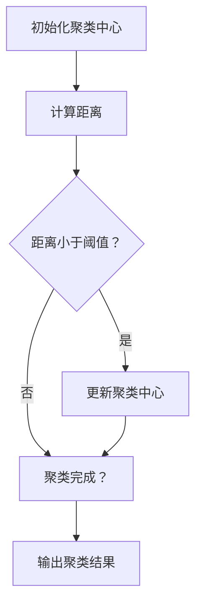

                 

### 关键词 Keywords
聚类、机器学习、数据分析、算法原理、代码实例、应用场景。

### 摘要 Abstract
本文将深入探讨聚类算法的基本原理、数学模型、具体实现步骤，并通过实际代码实例详细解释其应用过程。我们将覆盖从数据预处理到结果分析的全过程，旨在帮助读者全面理解聚类算法在现实世界中的应用。

## 1. 背景介绍

聚类是一种无监督学习的方法，其目标是按照数据的相似性将数据分组。这种分组通常基于某种相似性度量，如欧氏距离或余弦相似度。聚类在数据分析、数据挖掘和机器学习领域中有着广泛的应用，包括市场细分、图像分割、文本分类等。

### 1.1 聚类算法的应用

聚类算法广泛应用于多个领域：

- **市场细分**：根据消费者的购买行为和偏好，将市场划分为不同的群体，以实现个性化的营销策略。
- **图像分割**：将图像中的像素根据颜色、亮度等特征进行分组，以提取出图像中的物体。
- **文本分类**：将文本数据按照其主题或内容进行分类，以便于信息检索和推荐系统。

### 1.2 聚类算法的分类

聚类算法可以分为以下几类：

- **基于距离的算法**：如K-means、层次聚类等，通过计算数据点之间的距离来划分聚类。
- **基于密度的算法**：如DBSCAN，通过分析数据点的密度分布来识别聚类。
- **基于模型的算法**：如高斯混合模型，通过建立概率模型来识别聚类。
- **基于网格的算法**：如STING，将空间划分为有限的单元，并在这些单元上建立聚类模型。

## 2. 核心概念与联系

### 2.1 聚类与分类

聚类和分类是机器学习中的两种基本方法。分类是一种有监督学习的方法，其目标是根据已有的标签将新的数据分类到不同的类别中。而聚类是一种无监督学习的方法，其目标是将相似的数据点分组，不依赖于预定义的标签。

### 2.2 聚类算法与维度

聚类算法在处理高维数据时可能会遇到“维度灾难”问题。这意味着在高维空间中，数据点之间的距离度量变得不准确，从而影响聚类的效果。为了解决这一问题，研究人员提出了多种降维技术，如主成分分析（PCA）和t-SNE。

### 2.3 聚类与密度

密度聚类算法，如DBSCAN，通过分析数据点的密度分布来识别聚类。这些算法可以有效地识别出具有复杂形状的聚类。

### 2.4 Mermaid 流程图

下面是聚类算法的Mermaid流程图，展示了从初始化到最终聚类结果的生成过程。



## 3. 核心算法原理 & 具体操作步骤

### 3.1 算法原理概述

K-means算法是一种基于距离的聚类方法。它的基本思想是将数据集划分为K个簇，每个簇由一个中心点表示。算法的目标是最小化数据点到其所属聚类中心的距离平方和。

### 3.2 算法步骤详解

#### 3.2.1 初始化

- 随机选择K个数据点作为初始聚类中心。

#### 3.2.2 分配数据点

- 对每个数据点，计算它与各个聚类中心的距离，并将其分配到最近的聚类中心。

#### 3.2.3 更新聚类中心

- 计算每个聚类中心的新位置，即该聚类中所有数据点的均值。

#### 3.2.4 重复步骤2和3

- 重复执行步骤2和3，直到聚类中心不再发生显著变化。

### 3.3 算法优缺点

#### 优点：

- 算法简单，易于实现。
- 可以有效地处理大规模数据集。

#### 缺点：

- 对初始聚类中心的依赖较大，可能导致局部最优解。
- 不适用于发现形状不规则的聚类。

### 3.4 算法应用领域

K-means算法在以下领域有广泛的应用：

- 数据可视化
- 市场细分
- 文本分类
- 健康数据分析

## 4. 数学模型和公式 & 详细讲解 & 举例说明

### 4.1 数学模型构建

K-means算法的数学模型可以表示为：

$$
J = \sum_{i=1}^n \sum_{j=1}^K d(i, c_j)^2
$$

其中，$d(i, c_j)$表示数据点$i$与聚类中心$c_j$之间的距离，$J$是目标函数，用于衡量聚类结果的优劣。

### 4.2 公式推导过程

#### 4.2.1 初始化

选择K个数据点作为初始聚类中心。

$$
c_j^{(0)} = x_i, \quad i \in \{1, 2, ..., K\}
$$

#### 4.2.2 分配数据点

对每个数据点$i$，计算它与各个聚类中心的距离：

$$
d(i, c_j) = \| x_i - c_j \|_2
$$

将其分配到最近的聚类中心：

$$
\hat{j}(i) = \arg\min_{j} d(i, c_j)
$$

#### 4.2.3 更新聚类中心

计算每个聚类中心的新位置：

$$
c_j^{(t+1)} = \frac{1}{N_j} \sum_{i=1}^n \mathbb{1}_{\{\hat{j}(i) = j\}} x_i
$$

其中，$N_j$是聚类中心$j$的数据点数量，$\mathbb{1}_{\{\hat{j}(i) = j\}}$是指示函数。

#### 4.2.4 重复迭代

重复执行步骤2和3，直到聚类中心不再发生显著变化。

### 4.3 案例分析与讲解

假设我们有一个包含100个数据点的数据集，我们需要将其划分为5个聚类。以下是一个简化的K-means算法实现：

```python
import numpy as np

def k_means(X, K, max_iter=100, tolerance=1e-4):
    # 初始化聚类中心
    centroids = X[np.random.choice(X.shape[0], K, replace=False)]
    
    for _ in range(max_iter):
        # 分配数据点
        distances = np.linalg.norm(X[:, np.newaxis] - centroids, axis=2)
        labels = np.argmin(distances, axis=1)
        
        # 更新聚类中心
        new_centroids = np.zeros((K, X.shape[1]))
        for k in range(K):
            new_centroids[k] = np.mean(X[labels == k], axis=0)
        
        # 检查收敛
        if np.linalg.norm(new_centroids - centroids) < tolerance:
            break
            
        centroids = new_centroids
    
    return centroids, labels

# 生成示例数据
X = np.random.rand(100, 2)

# 执行K-means算法
centroids, labels = k_means(X, K=5)

# 绘制聚类结果
import matplotlib.pyplot as plt

plt.scatter(X[:, 0], X[:, 1], c=labels, cmap='viridis')
plt.scatter(centroids[:, 0], centroids[:, 1], s=300, c='red', marker='s')
plt.xlabel('Feature 1')
plt.ylabel('Feature 2')
plt.title('K-means Clustering')
plt.show()
```

## 5. 项目实践：代码实例和详细解释说明

### 5.1 开发环境搭建

- 安装Python 3.8及以上版本
- 安装NumPy和Matplotlib库

```shell
pip install numpy matplotlib
```

### 5.2 源代码详细实现

下面是一个简单的K-means聚类实现的完整代码。

```python
import numpy as np
import matplotlib.pyplot as plt

def k_means(X, K, max_iter=100, tolerance=1e-4):
    # 初始化聚类中心
    centroids = X[np.random.choice(X.shape[0], K, replace=False)]
    
    for _ in range(max_iter):
        # 分配数据点
        distances = np.linalg.norm(X[:, np.newaxis] - centroids, axis=2)
        labels = np.argmin(distances, axis=1)
        
        # 更新聚类中心
        new_centroids = np.zeros((K, X.shape[1]))
        for k in range(K):
            new_centroids[k] = np.mean(X[labels == k], axis=0)
        
        # 检查收敛
        if np.linalg.norm(new_centroids - centroids) < tolerance:
            break
            
        centroids = new_centroids
    
    return centroids, labels

# 生成示例数据
X = np.random.rand(100, 2)

# 执行K-means算法
centroids, labels = k_means(X, K=5)

# 绘制聚类结果
plt.scatter(X[:, 0], X[:, 1], c=labels, cmap='viridis')
plt.scatter(centroids[:, 0], centroids[:, 1], s=300, c='red', marker='s')
plt.xlabel('Feature 1')
plt.ylabel('Feature 2')
plt.title('K-means Clustering')
plt.show()
```

### 5.3 代码解读与分析

- **初始化聚类中心**：随机选择K个数据点作为初始聚类中心。
- **分配数据点**：计算每个数据点与聚类中心的距离，并将其分配到最近的聚类中心。
- **更新聚类中心**：计算每个聚类中心的新位置，即该聚类中所有数据点的均值。
- **检查收敛**：如果聚类中心的变化小于指定的容忍度，则算法停止。

### 5.4 运行结果展示

运行上述代码后，我们将在图表中看到K-means算法的聚类结果。每个聚类中心用一个红色“+”标记表示，而数据点则根据它们所属的聚类用不同的颜色标记。

## 6. 实际应用场景

聚类算法在多个实际应用场景中有着广泛的应用：

- **市场细分**：根据消费者的购买行为和偏好，将市场划分为不同的群体，以实现个性化的营销策略。
- **图像分割**：将图像中的像素根据颜色、亮度等特征进行分组，以提取出图像中的物体。
- **文本分类**：将文本数据按照其主题或内容进行分类，以便于信息检索和推荐系统。
- **社交网络分析**：识别社交网络中的社区，以了解用户之间的互动和联系。

### 6.1 市场细分

在一个电子商务平台上，可以使用K-means算法对消费者进行细分，根据他们的购买历史和偏好将他们分为不同的群体。这样，商家可以针对不同的群体设计个性化的营销策略，提高转化率。

### 6.2 图像分割

在图像处理领域，聚类算法被用于图像分割。通过将图像中的像素按照颜色或亮度特征进行分组，可以提取出图像中的不同物体。这种技术在人脸识别、物体检测和图像增强等领域有重要应用。

### 6.3 文本分类

在自然语言处理领域，聚类算法被用于文本分类。通过将文本按照其主题或内容进行分类，可以方便地进行信息检索和推荐系统。例如，在新闻分类中，可以使用聚类算法将新闻文章按照主题分类，以提供更准确的信息推送。

## 7. 工具和资源推荐

### 7.1 学习资源推荐

- 《机器学习实战》
- 《统计学习方法》
- 《Python机器学习》

### 7.2 开发工具推荐

- Jupyter Notebook
- PyCharm
- Google Colab

### 7.3 相关论文推荐

- MacQueen, J. B. (1967). Some methods for classification and analysis of multivariate observations. In Proceedings of 5th Berkeley Symposium on Mathematical Statistics and Probability (Vol. 1, pp. 281-297).
- Hartigan, J. A., & Wong, M. A. (1979). A K-means clustering algorithm. Applied statistics, 28(1), 100-108.
- Ester, M., Kriegel, H. P., Sander, J., & Xu, X. (1996). A density-based algorithm for discovering clusters in large spatial databases with noise. In Proceedings of the 2nd ACM SIGKDD international conference on Knowledge discovery and data mining (pp. 226-231).

## 8. 总结：未来发展趋势与挑战

### 8.1 研究成果总结

聚类算法在过去几十年中取得了显著的研究成果，包括算法的优化、新的聚类方法的提出和实际应用场景的扩展。这些成果推动了聚类算法在机器学习、数据挖掘和人工智能领域的发展。

### 8.2 未来发展趋势

- **算法优化**：进一步优化现有的聚类算法，提高聚类效果和效率。
- **可扩展性**：开发适用于大规模数据集的聚类算法。
- **跨领域应用**：探索聚类算法在更多领域中的应用，如生物信息学、医疗健康等。

### 8.3 面临的挑战

- **维度灾难**：在高维空间中，数据点之间的距离度量变得不准确，影响聚类效果。
- **初始聚类中心的选取**：初始聚类中心的选取对聚类结果有很大影响，需要研究更有效的初始化方法。

### 8.4 研究展望

随着大数据时代的到来，聚类算法将在越来越多的领域得到应用。未来的研究将集中在算法优化、可扩展性和跨领域应用上，以满足日益增长的数据处理需求。

## 9. 附录：常见问题与解答

### 9.1 什么是K-means算法？

K-means算法是一种基于距离的聚类算法，其目标是按照数据的相似性将数据划分为K个簇。算法的基本步骤包括初始化聚类中心、分配数据点、更新聚类中心，并重复迭代直到聚类中心不再发生显著变化。

### 9.2 K-means算法有哪些优缺点？

优点：算法简单、易于实现、可以有效地处理大规模数据集。缺点：对初始聚类中心的依赖较大，可能导致局部最优解；不适用于发现形状不规则的聚类。

### 9.3 K-means算法在哪些领域有应用？

K-means算法在市场细分、图像分割、文本分类、社交网络分析等多个领域有应用。例如，在电子商务中，可以用于消费者细分；在图像处理中，可以用于图像分割。

### 9.4 如何选择K值？

选择合适的K值是K-means算法的关键步骤。常见的方法包括肘部法则、硅片法则等。肘部法则通过计算每个K值下的目标函数值，选择目标函数值下降最明显的K值。硅片法则通过观察数据点在二维空间中的分布，选择能够较好地覆盖所有数据点的K值。

---

### 作者署名

作者：禅与计算机程序设计艺术 / Zen and the Art of Computer Programming
--------------------------------------------------------------------

