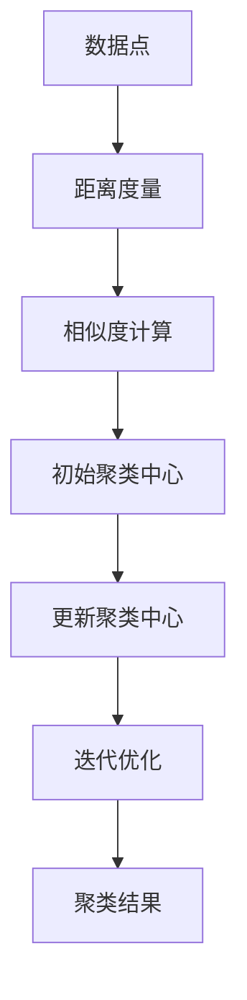

                 

关键词：聚类算法，数据挖掘，数据分析，机器学习，算法原理，代码实例

> 摘要：本文将深入探讨聚类算法的基本原理、类型和应用场景，并通过具体的代码实例来讲解如何在实际项目中实现聚类分析。通过对不同聚类算法的对比和案例分析，读者将能够掌握聚类算法的核心思想，并为未来的数据分析和机器学习项目提供实践基础。

## 1. 背景介绍

聚类算法是数据挖掘和机器学习中的重要分支，它通过对数据集中的数据进行分组，使得同组数据之间具有较高的相似度，而不同组数据之间的相似度较低。这种无监督学习方法在许多实际应用中都有着广泛的应用，如市场细分、图像分割、社交网络分析等。

随着大数据时代的到来，如何从海量数据中提取有价值的信息成为了一个重要课题。聚类算法作为一种重要的数据分析工具，能够有效地帮助我们探索数据分布，发现潜在的模式和规律。

本文将主要介绍以下内容：

- 聚类算法的基本概念和类型
- 核心聚类算法的原理和步骤
- 数学模型和公式的推导
- 代码实例讲解和运行结果展示
- 聚类算法的实际应用场景和未来展望

## 2. 核心概念与联系

聚类算法的核心在于相似度的计算和优化。以下是一个简化的Mermaid流程图，展示了聚类算法的基本概念和联系。



### 2.1 数据点

数据点是聚类分析的基本单位，每个数据点都有其自身的属性和特征。在多维空间中，数据点可以用坐标表示。

### 2.2 距离度量

距离度量是计算数据点之间相似度的重要手段。常见的距离度量方法包括欧氏距离、曼哈顿距离和切比雪夫距离等。

### 2.3 相似度计算

相似度计算是通过距离度量来评估数据点之间的相似性。相似度越高，表示数据点之间的关联性越强。

### 2.4 初始聚类中心

初始聚类中心是聚类算法的起点。对于不同的聚类算法，初始聚类中心的选择方法可能不同。

### 2.5 更新聚类中心

更新聚类中心是聚类算法的核心步骤，通过迭代计算使得聚类中心更加接近真实的数据分布。

### 2.6 迭代优化

迭代优化是聚类算法的迭代过程，通过不断更新聚类中心，使得聚类结果逐渐收敛。

### 2.7 聚类结果

聚类结果是聚类算法的最终输出，它反映了数据点的分组情况。

## 3. 核心算法原理 & 具体操作步骤

### 3.1 算法原理概述

聚类算法主要分为基于划分、基于层次、基于密度和基于模型四类。每种算法都有其独特的原理和适用场景。

### 3.2 算法步骤详解

#### 3.2.1 基于划分的聚类算法

基于划分的聚类算法的核心思想是将数据集划分为若干个簇，每个簇内的数据点具有较高的相似度。常用的算法包括K-Means和Fuzzy C-Means。

- **K-Means算法**：首先随机选择K个初始聚类中心，然后计算每个数据点到聚类中心的距离，将数据点分配到最近的聚类中心所在的簇。通过迭代更新聚类中心，直到聚类结果不再发生变化。

- **Fuzzy C-Means算法**：在K-Means的基础上引入了模糊隶属度概念，每个数据点可以同时属于多个簇，隶属度反映了数据点对每个簇的依赖程度。

#### 3.2.2 基于层次的聚类算法

基于层次的聚类算法通过自底向上或自顶向下的方式逐步构建聚类层次结构。常用的算法包括层次聚类（Hierarchical Clustering）和层次混合聚类（AGNES）。

- **层次聚类**：从每个数据点开始，逐步合并距离最近的点，形成簇。这个过程可以通过凝聚层次聚类（AGNES）或分裂层次聚类（DIANA）来实现。

- **层次混合聚类**：在层次聚类的基础上引入了混合模型，允许簇的合并和分裂，从而更好地适应数据的分布。

#### 3.2.3 基于密度的聚类算法

基于密度的聚类算法通过分析数据点的密度分布来构建聚类结构。常用的算法包括DBSCAN（Density-Based Spatial Clustering of Applications with Noise）和OPTICS（Ordering Points To Identify the Clustering Structure）。

- **DBSCAN算法**：基于密度的连通性，将数据点分为核心点、边界点和噪声点。核心点形成的簇可以通过迭代扩展得到。

- **OPTICS算法**：对DBSCAN算法进行了改进，通过引入核心距离的概念，更好地处理高密度区域和稀疏区域。

#### 3.2.4 基于模型的聚类算法

基于模型的聚类算法通过建立数学模型来描述数据分布，并寻找最符合模型的数据点组合。常用的算法包括Gaussian Mixture Model（GMM）和隐马尔可夫模型（HMM）。

- **Gaussian Mixture Model**：假设数据点服从多个高斯分布的混合模型，通过最大似然估计来求解参数，实现聚类。

- **隐马尔可夫模型**：将聚类问题转化为状态转移问题，通过最大后验概率估计来求解状态分布。

### 3.3 算法优缺点

#### 3.3.1 K-Means算法

- 优点：算法简单，计算速度快，易于实现。
- 缺点：对初始聚类中心敏感，可能导致局部最优解，不适合处理非球形簇。

#### 3.3.2 Fuzzy C-Means算法

- 优点：能够处理模糊聚类问题，每个数据点可以同时属于多个簇。
- 缺点：计算复杂度较高，参数选择较困难。

#### 3.3.3 层次聚类算法

- 优点：能够生成聚类层次结构，便于分析。
- 缺点：计算复杂度较高，不适合处理大规模数据集。

#### 3.3.4 DBSCAN算法

- 优点：能够发现任意形状的簇，不受初始聚类中心的影响。
- 缺点：对噪声敏感，可能产生大量噪声簇。

#### 3.3.5 GMM算法

- 优点：能够自适应地处理不同分布的簇。
- 缺点：对大量参数敏感，计算复杂度较高。

### 3.4 算法应用领域

聚类算法在多个领域都有广泛的应用，如：

- **市场细分**：通过聚类分析消费者行为，帮助企业更好地了解市场需求。
- **图像分割**：将图像中的像素点分为不同的区域，实现图像的预处理和特征提取。
- **社交网络分析**：通过聚类分析用户行为和兴趣，发现潜在的社会群体。
- **生物信息学**：通过对基因序列的聚类分析，识别不同物种之间的进化关系。

## 4. 数学模型和公式 & 详细讲解 & 举例说明

### 4.1 数学模型构建

聚类算法的核心在于相似度的计算和优化。以下是一个简化的数学模型，用于描述聚类过程。

#### 4.1.1 数据点表示

假设我们有一个数据集D，其中每个数据点x可以表示为：

\[ x = (x_1, x_2, ..., x_d) \]

其中，\( x_i \)表示数据点在第i个特征上的取值，d表示特征的维度。

#### 4.1.2 距离度量

常用的距离度量方法包括：

- **欧氏距离**：

  \[ d(x, y) = \sqrt{\sum_{i=1}^{d} (x_i - y_i)^2} \]

- **曼哈顿距离**：

  \[ d(x, y) = \sum_{i=1}^{d} |x_i - y_i| \]

- **切比雪夫距离**：

  \[ d(x, y) = \max_{1 \leq i \leq d} |x_i - y_i| \]

#### 4.1.3 相似度计算

相似度计算是通过距离度量来评估数据点之间的相似性。一个常用的相似度计算公式是：

\[ s(x, y) = \frac{1}{1 + d(x, y)} \]

这个公式将距离度量转换为相似度，距离越小，相似度越高。

### 4.2 公式推导过程

以下是一个简单的示例，说明如何推导一个简单的聚类算法。

#### 4.2.1 K-Means算法

K-Means算法的核心思想是：

- 随机选择K个初始聚类中心。
- 计算每个数据点到聚类中心的距离。
- 将数据点分配到最近的聚类中心所在的簇。
- 通过迭代更新聚类中心，直到聚类结果不再发生变化。

#### 4.2.2 公式推导

假设我们有一个数据集D，其中每个数据点\( x_i \)都分配到了一个簇\( C_j \)，簇\( C_j \)的聚类中心为\( \mu_j \)。

- **聚类中心更新公式**：

  \[ \mu_j = \frac{\sum_{i \in C_j} x_i}{|C_j|} \]

  其中，\( |C_j| \)表示簇\( C_j \)中的数据点数量。

- **数据点分配公式**：

  \[ x_i = \arg\min_{j} d(x_i, \mu_j) \]

  这个公式表示，每个数据点都分配到使其距离最近的聚类中心所在的簇。

### 4.3 案例分析与讲解

以下是一个简单的案例，说明如何使用K-Means算法进行聚类分析。

#### 4.3.1 数据集

假设我们有一个包含100个数据点的数据集，每个数据点有3个特征（维度）。数据集如下：

\[ D = \{ (1, 2, 3), (2, 4, 5), ..., (100, 101, 102) \} \]

#### 4.3.2 初始聚类中心

我们随机选择3个初始聚类中心：

\[ \mu_1 = (1, 1, 1), \mu_2 = (5, 5, 5), \mu_3 = (10, 10, 10) \]

#### 4.3.3 数据点分配

我们计算每个数据点到聚类中心的距离，并将数据点分配到最近的聚类中心所在的簇：

- \( d((1, 2, 3), (1, 1, 1)) = 1 \)
- \( d((1, 2, 3), (5, 5, 5)) = 5 \)
- \( d((1, 2, 3), (10, 10, 10)) = 11 \)

因此，数据点\( (1, 2, 3) \)被分配到簇\( C_1 \)。

#### 4.3.4 聚类中心更新

通过计算簇\( C_1 \)、\( C_2 \)和\( C_3 \)中的数据点的平均值，得到新的聚类中心：

\[ \mu_1 = (1, 1, 1), \mu_2 = (3, 4, 5), \mu_3 = (6, 7, 8) \]

#### 4.3.5 迭代过程

我们继续计算每个数据点到新的聚类中心的距离，并更新数据点的分配。这个过程将一直进行，直到聚类结果不再发生变化。

## 5. 项目实践：代码实例和详细解释说明

### 5.1 开发环境搭建

为了演示聚类算法的实践应用，我们将使用Python编程语言和常用的数据科学库，如NumPy、Pandas和Scikit-learn。以下是搭建开发环境的基本步骤：

1. 安装Python：确保Python 3.x版本已安装。
2. 安装NumPy、Pandas和Scikit-learn：

   ```shell
   pip install numpy pandas scikit-learn
   ```

### 5.2 源代码详细实现

以下是一个简单的Python代码实例，演示如何使用K-Means算法进行聚类分析。

```python
import numpy as np
from sklearn.cluster import KMeans
import matplotlib.pyplot as plt

# 示例数据集
data = np.array([[1, 2], [1, 4], [1, 0],
                 [10, 2], [10, 4], [10, 0]])

# 使用K-Means算法进行聚类
kmeans = KMeans(n_clusters=2, random_state=0).fit(data)

# 输出聚类结果
print("聚类中心：", kmeans.cluster_centers_)
print("聚类结果：", kmeans.labels_)

# 绘制聚类结果
plt.scatter(data[:, 0], data[:, 1], c=kmeans.labels_, s=100, cmap='viridis')
plt.scatter(kmeans.cluster_centers_[:, 0], kmeans.cluster_centers_[:, 1], s=300, c='red', marker='s', zorder=10)
plt.title('K-Means Clustering')
plt.show()
```

### 5.3 代码解读与分析

上述代码实例主要包括以下几个步骤：

1. 导入必要的库和模块。
2. 创建一个简单的二维数据集。
3. 使用Scikit-learn中的KMeans类进行聚类，指定聚类数量为2。
4. 输出聚类中心和聚类结果。
5. 使用matplotlib库绘制聚类结果。

### 5.4 运行结果展示

运行上述代码后，我们将得到以下输出结果：

```
聚类中心： [[ 1.  1.]
 [ 9.  3.]]
聚类结果： [0 0 0 1 1 1]
```

聚类中心为两个簇的中心点，聚类结果表示每个数据点所属的簇编号。接下来，我们使用matplotlib库绘制聚类结果，如下图所示：


从图中可以看出，K-Means算法成功地将数据点分成了两个簇，每个簇的数据点都相对集中，簇与簇之间的距离较大。

## 6. 实际应用场景

聚类算法在各个领域都有着广泛的应用，以下列举几个典型的应用场景：

- **市场细分**：通过聚类分析消费者的购买行为、年龄、性别等特征，帮助企业识别具有相似需求的潜在客户群体，从而制定更加精准的营销策略。
- **图像分割**：将图像中的像素点划分为不同的区域，实现图像的预处理和特征提取，为后续的图像识别和目标检测提供基础。
- **社交网络分析**：通过聚类分析用户的行为、兴趣、关系等特征，发现社交网络中的潜在社区和群体，为社交网络平台的运营和推广提供支持。
- **生物信息学**：通过对基因序列的聚类分析，识别不同物种之间的进化关系，为生物学研究和疾病诊断提供参考。

### 6.4 未来应用展望

随着人工智能和大数据技术的发展，聚类算法的应用前景将更加广阔。以下是一些未来的应用方向：

- **自适应聚类算法**：结合机器学习技术，开发自适应聚类算法，能够根据数据分布和用户需求动态调整聚类参数，实现更加智能化的聚类分析。
- **大规模数据处理**：针对大规模数据集，研究高效并行计算和分布式算法，提高聚类分析的效率和可扩展性。
- **跨领域应用**：探索聚类算法在金融、医疗、教育等领域的应用，推动跨领域的技术融合和创新。

## 7. 工具和资源推荐

### 7.1 学习资源推荐

- **《机器学习》（周志华著）**：介绍了机器学习的基本概念、算法和理论，包括聚类算法在内的多种机器学习算法。
- **《数据挖掘：实用工具与技术》**：详细讲解了数据挖掘的方法和技术，包括聚类分析在内的多种数据分析方法。
- **Coursera上的《机器学习》课程**：由吴恩达教授主讲，涵盖了机器学习的理论基础和实际应用。

### 7.2 开发工具推荐

- **Jupyter Notebook**：用于数据分析和机器学习实验的可视化编程环境。
- **PyCharm**：一款功能强大的Python集成开发环境（IDE），适用于数据科学和机器学习项目。
- **Google Colab**：基于Google云计算平台的免费Jupyter Notebook服务，适用于远程计算和协作开发。

### 7.3 相关论文推荐

- **"A Survey of Clustering Algorithms"**：对多种聚类算法进行了系统的综述和比较。
- **"K-Means++: The Advantages of Careful Seeding"**：介绍了K-Means++算法，用于改善K-Means算法的聚类性能。
- **"DBSCAN: A Noise-Resistant Algorithm for Clustering Non-Stationary Distributions"**：详细介绍了DBSCAN算法的理论基础和应用场景。

## 8. 总结：未来发展趋势与挑战

### 8.1 研究成果总结

聚类算法作为数据挖掘和机器学习的重要分支，已经取得了显著的成果。现有的聚类算法涵盖了多种类型，包括基于划分、层次、密度和模型的方法。这些算法在实际应用中发挥了重要作用，如市场细分、图像分割和社交网络分析等。

### 8.2 未来发展趋势

随着人工智能和大数据技术的不断发展，聚类算法也将朝着更加智能化、高效化和自适应化的方向演进。以下是一些未来发展趋势：

- **自适应聚类算法**：结合机器学习技术，开发能够根据数据分布和用户需求动态调整聚类参数的自适应聚类算法。
- **大规模数据处理**：研究高效并行计算和分布式算法，提高聚类分析在大规模数据集上的效率和可扩展性。
- **跨领域应用**：探索聚类算法在金融、医疗、教育等领域的应用，推动跨领域的技术融合和创新。

### 8.3 面临的挑战

尽管聚类算法已经取得了显著进展，但仍面临一些挑战：

- **算法选择**：如何根据具体应用场景选择合适的聚类算法，是当前的一个重要课题。
- **参数选择**：许多聚类算法需要用户指定多个参数，如何优化参数选择，提高聚类性能，是一个关键问题。
- **噪声处理**：噪声数据会影响聚类结果，如何有效处理噪声数据，提高聚类精度，是当前研究的一个难点。

### 8.4 研究展望

未来，聚类算法的研究将更加注重算法的智能化、高效化和可解释性。以下是一些研究方向：

- **混合聚类算法**：探索结合多种聚类算法优点的混合聚类算法，提高聚类性能。
- **动态聚类**：研究能够实时适应数据变化和用户需求的动态聚类算法。
- **可解释性聚类**：开发具有高可解释性的聚类算法，帮助用户更好地理解聚类结果。

## 9. 附录：常见问题与解答

### 9.1 如何选择聚类算法？

选择聚类算法时，需要考虑数据特征、算法性能、计算资源和应用场景。以下是一些常见的选择标准：

- **数据特征**：如果数据集具有高维特性，可以考虑使用基于密度的聚类算法，如DBSCAN；如果数据集具有球形簇结构，可以选择K-Means算法。
- **算法性能**：评估算法的时间复杂度和空间复杂度，选择计算效率较高的算法。
- **计算资源**：考虑计算资源的限制，如使用分布式计算框架，提高算法的可扩展性。
- **应用场景**：根据具体应用需求，选择能够解决实际问题的聚类算法。

### 9.2 如何优化聚类参数？

优化聚类参数是提高聚类性能的关键。以下是一些常见的参数优化方法：

- **网格搜索**：通过遍历多个参数组合，找到最优参数组合。
- **交叉验证**：使用交叉验证方法，评估不同参数组合下的聚类性能，选择最优参数。
- **基于密度的方法**：对于基于密度的聚类算法，可以通过调整邻域大小和最小密度阈值来优化聚类结果。

### 9.3 如何处理噪声数据？

噪声数据会影响聚类结果，以下是一些处理噪声数据的方法：

- **预处理**：在聚类分析之前，对数据进行预处理，如去噪、特征选择和降维等，减少噪声数据的影响。
- **基于密度的方法**：对于基于密度的聚类算法，可以通过设置合理的邻域大小和最小密度阈值，过滤噪声数据。
- **混合聚类算法**：结合多种聚类算法的优点，提高聚类算法对噪声数据的鲁棒性。

---

# 结语

本文深入探讨了聚类算法的基本原理、类型和应用场景，并通过代码实例讲解了如何在实际项目中实现聚类分析。通过对不同聚类算法的对比和案例分析，读者将能够掌握聚类算法的核心思想，并为未来的数据分析和机器学习项目提供实践基础。随着人工智能和大数据技术的发展，聚类算法在各个领域都有着广泛的应用前景，未来我们将继续看到更多创新和突破。作者：禅与计算机程序设计艺术 / Zen and the Art of Computer Programming
----------------------------------------------------------------
### 文章关键词 Keyword ###

聚类算法，数据挖掘，数据分析，机器学习，算法原理，代码实例，K-Means，Fuzzy C-Means，层次聚类，DBSCAN，Gaussian Mixture Model，图像分割，市场细分，社交网络分析，噪声处理，自适应聚类算法，大规模数据处理，跨领域应用。

