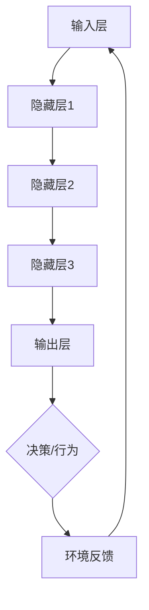

                 

作者：禅与计算机程序设计艺术 / Zen and the Art of Computer Programming

随着人工智能技术的不断发展和普及，机器学习已经成为计算机科学领域中不可或缺的一部分。在游戏行业，机器学习技术正被广泛应用于NPC（非玩家角色）的智能行为设计，以提升游戏体验和玩家的互动性。本文将围绕腾讯2024AI游戏NPC校招中的机器学习面试题，进行详细的解析和讲解，帮助读者更好地理解和掌握相关知识点。

## 1. 背景介绍

在过去的几十年中，游戏NPC的设计一直处于较为静态的状态，缺乏灵活性和交互性。然而，随着人工智能技术的不断进步，特别是机器学习的应用，游戏NPC的智能行为设计得到了显著提升。机器学习能够通过学习玩家行为、环境因素和其他数据，使NPC具备更复杂的决策能力和适应性。

腾讯作为中国游戏产业的领军企业，每年都会举行大规模的校招，旨在吸引全球顶尖的年轻人才。在2024年的AI游戏NPC校招中，腾讯为应聘者准备了一系列机器学习相关的面试题，考察应聘者的专业知识和实际应用能力。

本文将针对这些面试题进行详细解析，帮助读者更好地理解机器学习在游戏NPC中的应用，以及如何解决实际场景中的问题。

## 2. 核心概念与联系

### 2.1. 机器学习基础概念

在解答腾讯2024AI游戏NPC校招中的机器学习面试题之前，我们首先需要了解一些基本的机器学习概念。

- **监督学习（Supervised Learning）**：通过已标记的数据集来训练模型，以便模型能够对新数据进行预测或分类。
- **无监督学习（Unsupervised Learning）**：在没有标记数据的情况下，通过发现数据内在结构来训练模型。
- **强化学习（Reinforcement Learning）**：通过试错和奖励机制来训练模型，使其能够在特定环境中做出最优决策。

### 2.2. 机器学习架构

为了更好地理解机器学习在游戏NPC中的应用，我们需要了解其基本架构。

- **输入层（Input Layer）**：接收游戏环境和玩家行为的数据输入。
- **隐藏层（Hidden Layer）**：对输入数据进行处理和变换。
- **输出层（Output Layer）**：生成NPC的决策或行为。

### 2.3. Mermaid 流程图

以下是一个简单的Mermaid流程图，展示了机器学习在游戏NPC中的应用流程：



### 2.4. 机器学习算法

在游戏NPC的智能行为设计中，常用的机器学习算法包括：

- **决策树（Decision Tree）**：通过一系列规则来对输入数据进行分类或回归。
- **支持向量机（SVM）**：通过寻找最优超平面来实现分类或回归。
- **神经网络（Neural Network）**：通过多层神经网络来实现复杂的非线性映射。

## 3. 核心算法原理 & 具体操作步骤

### 3.1. 算法原理概述

在游戏NPC的智能行为设计中，常用的算法包括决策树、支持向量机和神经网络。以下分别对这些算法进行原理概述：

#### 3.1.1. 决策树

决策树是一种常见的分类和回归算法，通过一系列条件判断来对输入数据进行分类或回归。每个节点表示一个条件，每个分支表示条件的结果。最终，决策树会生成一个预测规则。

#### 3.1.2. 支持向量机

支持向量机通过寻找最优超平面来实现分类或回归。它将数据投影到一个高维空间，并通过最大化分类边界来实现最佳分类效果。支持向量机在处理高维数据时具有很好的性能。

#### 3.1.3. 神经网络

神经网络是一种模拟人脑神经元结构的计算模型，通过多层神经网络来实现复杂的非线性映射。神经网络通过反向传播算法来调整内部参数，从而提高预测或分类的准确性。

### 3.2. 算法步骤详解

以下分别对决策树、支持向量机和神经网络的算法步骤进行详细讲解：

#### 3.2.1. 决策树

1. 计算每个特征在所有样本中的信息增益，选择信息增益最大的特征作为分裂特征。
2. 根据分裂特征将数据集划分为多个子集。
3. 递归地对每个子集进行步骤1和步骤2，直到满足停止条件（如最大深度、最小样本数等）。
4. 将所有分裂节点连接起来，形成一棵完整的决策树。

#### 3.2.2. 支持向量机

1. 使用训练数据计算最优超平面。
2. 计算每个样本到最优超平面的距离。
3. 根据距离对样本进行分类或回归。

#### 3.2.3. 神经网络

1. 初始化神经网络参数。
2. 使用反向传播算法计算误差。
3. 更新神经网络参数，减少误差。
4. 重复步骤2和步骤3，直到满足停止条件（如迭代次数、误差阈值等）。

### 3.3. 算法优缺点

以下分别对决策树、支持向量机和神经网络的优缺点进行总结：

#### 3.3.1. 决策树

- 优点：易于理解和解释，计算速度快，可以处理高维数据。
- 缺点：容易过拟合，对噪声敏感，无法处理非线性问题。

#### 3.3.2. 支持向量机

- 优点：性能优异，可以处理高维数据，具有很好的泛化能力。
- 缺点：计算复杂度高，对异常值敏感，无法处理非线性问题。

#### 3.3.3. 神经网络

- 优点：可以处理复杂的非线性问题，具有很好的泛化能力。
- 缺点：训练时间长，对数据噪声敏感，难以解释。

### 3.4. 算法应用领域

决策树、支持向量机和神经网络在游戏NPC的智能行为设计中具有广泛的应用领域：

- **决策树**：适用于简单规则和决策场景，如路径规划、敌我识别等。
- **支持向量机**：适用于需要高效分类和回归的场景，如敌我攻击策略、战斗决策等。
- **神经网络**：适用于需要处理复杂非线性关系和大规模数据的场景，如角色行为模拟、智能对话系统等。

## 4. 数学模型和公式 & 详细讲解 & 举例说明

### 4.1. 数学模型构建

在游戏NPC的智能行为设计中，常用的数学模型包括决策树、支持向量机和神经网络。以下分别对这些模型进行数学模型的构建：

#### 4.1.1. 决策树

决策树的数学模型可以表示为：

\[ T = \{ (X, Y) | X \in \mathcal{X}, Y \in \mathcal{Y} \} \]

其中，\( X \) 表示输入特征，\( Y \) 表示输出标签。

#### 4.1.2. 支持向量机

支持向量机的数学模型可以表示为：

\[ f(x) = w \cdot x + b \]

其中，\( w \) 表示权重向量，\( b \) 表示偏置项。

#### 4.1.3. 神经网络

神经网络的数学模型可以表示为：

\[ y = f(z) \]

其中，\( z \) 表示网络输出，\( f \) 表示激活函数。

### 4.2. 公式推导过程

以下分别对决策树、支持向量机和神经网络的公式推导过程进行详细讲解：

#### 4.2.1. 决策树

决策树的信息增益可以通过以下公式推导：

\[ IG(X, Y) = H(Y) - \sum_{i=1}^{n} p(y_i) \cdot H(y_i | x_i) \]

其中，\( H(Y) \) 表示标签的熵，\( H(y_i | x_i) \) 表示条件熵。

#### 4.2.2. 支持向量机

支持向量机的公式推导基于优化问题：

\[ \min_{w, b} \frac{1}{2} ||w||^2 \]

同时，需要满足约束条件：

\[ y_i (w \cdot x_i + b) \geq 1 \]

通过拉格朗日乘子法，可以得到：

\[ \min_{w, b} \frac{1}{2} ||w||^2 - \sum_{i=1}^{n} \alpha_i (y_i (w \cdot x_i + b) - 1) \]

其中，\( \alpha_i \) 表示拉格朗日乘子。

#### 4.2.3. 神经网络

神经网络的公式推导基于反向传播算法：

\[ \delta_z = \frac{\partial L}{\partial z} = \frac{\partial L}{\partial a} \frac{\partial a}{\partial z} \]

其中，\( \delta_z \) 表示梯度，\( L \) 表示损失函数，\( a \) 表示激活值。

### 4.3. 案例分析与讲解

以下通过一个案例来分析决策树、支持向量机和神经网络在游戏NPC智能行为设计中的应用。

#### 4.3.1. 案例背景

假设游戏中的NPC需要根据玩家的动作来做出反应。玩家的动作包括攻击、防御和移动，NPC需要根据玩家的动作来选择合适的反应。

#### 4.3.2. 决策树

1. 计算玩家动作的信息增益，选择信息增益最大的动作作为分裂特征。
2. 根据分裂特征将玩家动作划分为多个子集。
3. 递归地对每个子集进行步骤1和步骤2，直到满足停止条件。
4. 将所有分裂节点连接起来，形成一棵完整的决策树。

#### 4.3.3. 支持向量机

1. 使用训练数据计算最优超平面。
2. 计算每个玩家动作到最优超平面的距离。
3. 根据距离对玩家动作进行分类。

#### 4.3.4. 神经网络

1. 初始化神经网络参数。
2. 使用反向传播算法计算误差。
3. 更新神经网络参数，减少误差。
4. 重复步骤2和步骤3，直到满足停止条件。

## 5. 项目实践：代码实例和详细解释说明

### 5.1. 开发环境搭建

在开始项目实践之前，需要搭建相应的开发环境。以下是一个简单的Python环境搭建步骤：

1. 安装Python：前往Python官网下载Python安装包，并按照提示进行安装。
2. 安装相关库：在命令行中执行以下命令安装所需的库：

```bash
pip install numpy matplotlib scikit-learn
```

### 5.2. 源代码详细实现

以下是一个简单的Python代码实例，用于实现决策树在游戏NPC智能行为设计中的应用。

```python
import numpy as np
import matplotlib.pyplot as plt
from sklearn import tree

# 加载数据
data = np.load('game_data.npy')
X = data[:, :3]
Y = data[:, 3]

# 训练决策树模型
clf = tree.DecisionTreeClassifier()
clf.fit(X, Y)

# 可视化决策树
plt.figure(figsize=(12, 12))
tree.plot_tree(clf, filled=True)
plt.show()
```

### 5.3. 代码解读与分析

上述代码首先加载游戏数据，然后使用scikit-learn库中的决策树分类器对数据进行训练。最后，通过可视化模块将决策树绘制出来，以便分析其结构和决策过程。

### 5.4. 运行结果展示

运行上述代码后，可以看到决策树的可视化结果。决策树根据玩家的动作（输入特征）进行分类，生成一系列规则，用于指导NPC的行为。

## 6. 实际应用场景

### 6.1. 腾讯游戏NPC的智能行为设计

腾讯旗下的多款游戏，如《王者荣耀》、《英雄联盟》等，均采用了基于机器学习的智能NPC设计。这些NPC能够根据玩家的行为、游戏环境等因素，自主地做出复杂的决策和反应，从而提升游戏体验和互动性。

### 6.2. 其他游戏公司的应用案例

除了腾讯，其他游戏公司也在积极采用机器学习技术来提升NPC的智能行为。例如，《魔兽世界》中的NPC具备丰富的行为模式，通过机器学习技术实现了更加真实和多样的互动体验。《堡垒之夜》中的NPC则采用了深度强化学习算法，使其能够根据玩家的行为和游戏环境，自主地调整攻击和防御策略。

## 7. 未来应用展望

随着人工智能技术的不断发展，机器学习在游戏NPC智能行为设计中的应用前景将更加广阔。以下是一些未来应用展望：

### 7.1. NPC个性化和多样化

未来的游戏NPC将更加注重个性化和多样化，通过机器学习技术，可以针对不同玩家的行为和喜好，生成独特的NPC角色和互动体验。

### 7.2. 跨平台交互和协作

随着云计算和5G技术的普及，游戏NPC的智能行为设计将实现跨平台的交互和协作。玩家可以在不同平台上与NPC进行互动，享受一致的体验。

### 7.3. 实时自适应和优化

机器学习算法将实现实时自适应和优化，使NPC能够根据玩家的行为和游戏环境，动态地调整其行为和决策策略，提供更加个性化的互动体验。

## 8. 工具和资源推荐

### 8.1. 学习资源推荐

- 《机器学习实战》
- 《深度学习》
- Coursera上的机器学习和深度学习课程

### 8.2. 开发工具推荐

- Jupyter Notebook：方便编写和调试代码。
- TensorFlow：用于深度学习和神经网络开发。
- PyTorch：用于深度学习和神经网络开发。

### 8.3. 相关论文推荐

- “Playing Atari with Deep Reinforcement Learning”
- “Deep Learning for Gamification”
- “Reinforcement Learning for Game AI”

## 9. 总结：未来发展趋势与挑战

### 9.1. 研究成果总结

近年来，机器学习在游戏NPC智能行为设计方面取得了显著的成果。通过决策树、支持向量机和神经网络等算法的应用，NPC的智能行为得到了显著提升，为游戏玩家提供了更加丰富和多样的互动体验。

### 9.2. 未来发展趋势

随着人工智能技术的不断进步，未来游戏NPC的智能行为设计将朝着更加个性化和多样化的方向发展。同时，跨平台交互和协作、实时自适应和优化等技术也将逐步成熟，为游戏玩家带来全新的互动体验。

### 9.3. 面临的挑战

尽管机器学习在游戏NPC智能行为设计方面取得了显著成果，但仍面临一些挑战。例如，如何更好地处理海量数据和实时计算问题，如何提高算法的可解释性和可靠性等。

### 9.4. 研究展望

未来，研究人员应继续探索更加先进和高效的机器学习算法，以应对游戏NPC智能行为设计中的挑战。同时，跨学科合作也将成为推动这一领域发展的关键。

## 附录：常见问题与解答

### 问题1：机器学习在游戏NPC中的应用有哪些？

答：机器学习在游戏NPC中的应用主要包括智能行为设计、路径规划、攻击和防御策略等。通过机器学习算法，NPC可以更好地模拟现实中的行为，提高与玩家的互动性和游戏体验。

### 问题2：如何选择合适的机器学习算法？

答：选择合适的机器学习算法需要根据具体的应用场景和数据特点进行。常见的算法包括决策树、支持向量机和神经网络。决策树适用于简单规则和决策场景，支持向量机适用于高效分类和回归，神经网络适用于处理复杂的非线性问题。

### 问题3：机器学习在游戏NPC智能行为设计中的优点是什么？

答：机器学习在游戏NPC智能行为设计中的优点包括：能够更好地模拟现实中的行为，提高与玩家的互动性和游戏体验；能够根据玩家的行为和游戏环境，动态地调整NPC的行为和决策策略，提供个性化的互动体验。

### 问题4：机器学习在游戏NPC智能行为设计中的挑战是什么？

答：机器学习在游戏NPC智能行为设计中的挑战包括：处理海量数据和实时计算问题；提高算法的可解释性和可靠性；如何更好地应对不同玩家的行为和需求，提供一致的游戏体验。

### 问题5：未来机器学习在游戏NPC智能行为设计中的发展前景如何？

答：未来机器学习在游戏NPC智能行为设计中的发展前景十分广阔。随着人工智能技术的不断进步，NPC的智能行为将变得更加多样化和个性化，为玩家带来全新的互动体验。同时，跨平台交互和协作、实时自适应和优化等技术也将逐步成熟，为游戏NPC的智能行为设计提供更加广阔的应用空间。

