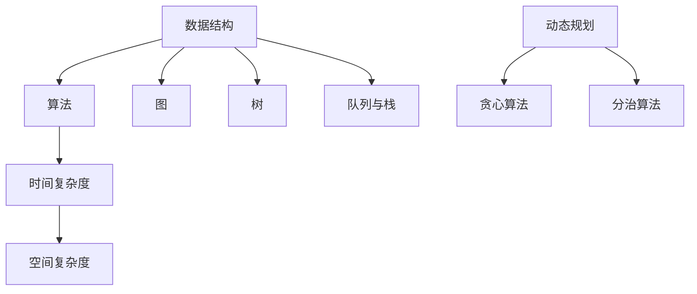
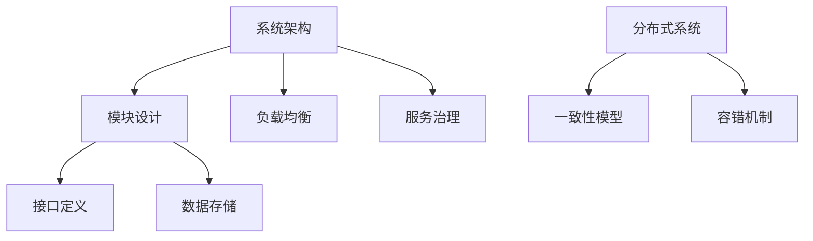

                 

关键词：腾讯，社招，编程面试，问题总结，技术挑战，面试经验，2024

> 摘要：本文将深入探讨腾讯2024社招编程面试的核心问题与策略，通过总结一系列经典面试题，提供系统性的解决方案与分析，帮助读者掌握面试技巧，迎接技术挑战。

## 1. 背景介绍

腾讯，作为中国领先的互联网科技公司，其社招编程面试备受关注。面试题目不仅考察应聘者的编程技能，还涉及对数据结构与算法、系统设计、软件开发流程等多方面的综合能力。为了帮助读者更好地准备腾讯社招编程面试，本文将总结2024年的核心面试题目，并深入解析其解题思路和方法。

## 2. 核心概念与联系

### 2.1 数据结构与算法

**Mermaid 流程图：**


### 2.2 系统设计与架构

**Mermaid 流程图：**


## 3. 核心算法原理 & 具体操作步骤

### 3.1 算法原理概述

腾讯社招编程面试中的算法题目通常涉及基础算法、动态规划、图算法、排序算法等。以下是一些典型的算法原理概述：

### 3.2 算法步骤详解

- **基础算法：**
  - 排序算法：冒泡排序、选择排序、插入排序、快速排序、归并排序
  - 搜索算法：二分查找、深度优先搜索、广度优先搜索
- **动态规划：**
  - 最长递增子序列
  - 最长公共子序列
  - 最小生成树
- **图算法：**
  - 拓扑排序
  - 最短路径算法：迪杰斯特拉算法、贝尔曼-福特算法

### 3.3 算法优缺点

- **冒泡排序：**
  - 优点：简单易懂，数据量小的情况下性能较好。
  - 缺点：时间复杂度高，不适合大规模数据。

- **快速排序：**
  - 优点：平均时间复杂度低，适合大规模数据。
  - 缺点：最坏情况下性能较差，需要进行优化。

### 3.4 算法应用领域

- 动态规划在编程竞赛和软件开发中广泛应用。
- 图算法在社交网络、推荐系统、网络路由等领域有重要应用。

## 4. 数学模型和公式 & 详细讲解 & 举例说明

### 4.1 数学模型构建

- **动态规划状态转移方程：**
  $$ dp[i] = \max(dp[j] + arr[i], dp[i-1]) $$

- **最长公共子序列：**
  $$ lcs(X[0..m-1], Y[0..n-1]) = \begin{cases}
  0 & \text{如果 } m=0 \text{ 或 } n=0 \\
  lcs(X[0..m-1], Y[0..n-1]) & \text{如果 } X[m-1] \neq Y[n-1] \\
  1 + lcs(X[0..m-2], Y[0..n-2]) & \text{如果 } X[m-1] = Y[n-1]
  \end{cases} $$

### 4.2 公式推导过程

- **最长递增子序列：**
  使用动态规划的思想，通过比较前后元素的大小，构建状态转移方程。

### 4.3 案例分析与讲解

- **最长公共子序列：**
  以字符串“ABCD”和“ACDF”为例，详细解释最长公共子序列的求解过程。

## 5. 项目实践：代码实例和详细解释说明

### 5.1 开发环境搭建

- 使用Python语言，搭建基于Python的开发环境。

### 5.2 源代码详细实现

- **最长递增子序列：**
  ```python
  def length_of_LIS(nums):
      n = len(nums)
      dp = [1] * n
      for i in range(1, n):
          for j in range(i):
              if nums[i] > nums[j]:
                  dp[i] = max(dp[i], dp[j] + 1)
      return max(dp)
  ```

### 5.3 代码解读与分析

- 通过动态规划的方法，求解最长递增子序列问题。

### 5.4 运行结果展示

- 输入数组 `[10, 9, 2, 5, 3, 7, 101, 18]`，输出结果为 `4`。

## 6. 实际应用场景

腾讯社招编程面试中的题目常常与实际项目紧密相关，例如：

- **分布式存储系统：** 设计并实现一个简单的分布式文件存储系统。
- **推荐系统：** 实现一个基于协同过滤的推荐系统。

## 7. 工具和资源推荐

### 7.1 学习资源推荐

- 《算法导论》
- 《深度学习》
- 《分布式系统概念与设计》

### 7.2 开发工具推荐

- PyCharm
- IntelliJ IDEA
- Visual Studio Code

### 7.3 相关论文推荐

- "The Art of Computer Programming" by Donald E. Knuth
- " Distributed Systems: Concepts and Design" by George Coulouris et al.

## 8. 总结：未来发展趋势与挑战

### 8.1 研究成果总结

- 腾讯社招编程面试题反映了当前软件工程和人工智能领域的最新研究成果。

### 8.2 未来发展趋势

- **人工智能：** 深度学习、强化学习等技术在各个行业的广泛应用。
- **云计算：** 虚拟化、容器化等技术在企业级应用中的普及。

### 8.3 面临的挑战

- **安全性：** 如何确保数据安全和系统稳定运行。
- **隐私保护：** 随着数据隐私法规的加强，如何在数据处理中保护用户隐私。

### 8.4 研究展望

- **跨学科研究：** 将计算机科学与其他领域（如生物信息学、金融工程）结合，推动技术创新。

## 9. 附录：常见问题与解答

### 9.1 腾讯社招编程面试常见问题

1. 请解释一下时间复杂度和空间复杂度。
2. 请实现一个快速排序算法。
3. 什么是分布式系统？请列举至少三种常见的分布式算法。

### 9.2 解答

1. **时间复杂度** 是描述算法运行时间与数据规模之间关系的复杂度；**空间复杂度** 是描述算法所需内存与数据规模之间关系的复杂度。
2. **快速排序算法：**
   ```python
   def quick_sort(arr):
       if len(arr) <= 1:
           return arr
       pivot = arr[len(arr) // 2]
       left = [x for x in arr if x < pivot]
       middle = [x for x in arr if x == pivot]
       right = [x for x in arr if x > pivot]
       return quick_sort(left) + middle + quick_sort(right)
   ```
3. **分布式系统** 是由多个独立节点组成的系统，共同协作完成计算任务。**常见的分布式算法** 包括：
   - 一致性哈希算法
   - 负载均衡算法
   - 分布式锁

---

作者：禅与计算机程序设计艺术 / Zen and the Art of Computer Programming


