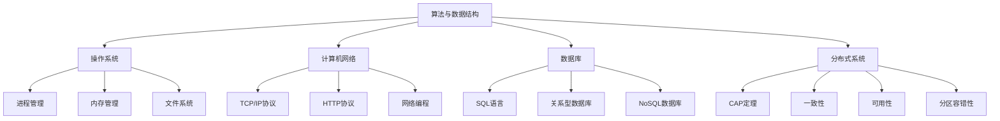

                 

在这个快节奏的技术时代，腾讯作为中国领先的高科技企业，其对人才的选拔标准自然也是高标准、严要求。特别是腾讯PCG（平台与内容事业群）的校招面试，更是一次考验应聘者综合素质的大考。本文将汇总2024年腾讯PCG校招面试中出现的一些常见面试真题，并给出详细的解答，希望能够为广大应聘者提供一些参考和帮助。

## 关键词

- 腾讯PCG
- 校招面试
- 面试题汇总
- 解答思路
- 技术面试

## 摘要

本文旨在为广大应聘腾讯PCG校招面试的考生提供一份全面的面试真题汇总及解答指南。通过对历年面试真题的整理和分析，本文不仅提供了问题的详细解答，还深入探讨了面试中可能涉及的算法、数据结构、操作系统、计算机网络等核心知识点，以及面试的应对策略和技巧。

## 1. 背景介绍

腾讯PCG（Platform & Content Group）是腾讯公司旗下的一个重要业务板块，主要负责腾讯的内容、平台、广告等业务。作为腾讯的核心业务之一，PCG在互联网内容生态、广告技术、平台技术等领域都有着卓越的表现。因此，腾讯PCG的校招面试也备受关注，每年吸引了大量的应届毕业生和优秀的在职人员参与。

腾讯PCG校招面试主要分为以下几个环节：

1. **在线编程测试**：通过LeetCode、牛客网等平台进行编程能力测试。
2. **技术面试**：主要考察应聘者的专业知识、算法能力、编程技巧等。
3. **行为面试**：侧重于考察应聘者的团队合作能力、沟通能力、领导能力等。
4. **综合评估**：包括笔试、面试、背景调查等。

## 2. 核心概念与联系

在面试过程中，理解并掌握以下核心概念是非常重要的：

- **算法与数据结构**：包括排序、查找、动态规划等。
- **操作系统**：如进程管理、内存管理、文件系统等。
- **计算机网络**：如TCP/IP协议、HTTP协议、网络编程等。
- **数据库**：如SQL语言、关系型数据库、NoSQL数据库等。
- **分布式系统**：如CAP定理、一致性、可用性、分区容错性等。

为了更好地理解这些概念，以下是一个简化的Mermaid流程图：



## 3. 核心算法原理 & 具体操作步骤

### 3.1 算法原理概述

算法是计算机解决问题的方法，是计算机科学的核心。以下是几个在面试中经常出现的算法：

1. **排序算法**：如快速排序、归并排序、堆排序等。
2. **查找算法**：如二分查找、哈希查找等。
3. **动态规划**：如背包问题、最长公共子序列等。
4. **图算法**：如深度优先搜索、广度优先搜索、最短路径算法等。

### 3.2 算法步骤详解

下面以快速排序为例，简要介绍其步骤：

1. 选择一个基准元素。
2. 将比基准元素小的元素移到其左边，比其大的元素移到其右边。
3. 对左右子序列重复上述步骤。

### 3.3 算法优缺点

快速排序的优点是时间复杂度较低，通常为O(nlogn)，且代码实现相对简单。缺点是递归调用较多，可能导致栈溢出，且最坏情况下时间复杂度可能退化到O(n^2)。

### 3.4 算法应用领域

快速排序广泛应用于各种场景，如排序、查找等。尤其在处理大数据时，快速排序是一个非常有效的算法。

## 4. 数学模型和公式 & 详细讲解 & 举例说明

### 4.1 数学模型构建

在算法设计中，数学模型的应用非常广泛。以下是一个简单的数学模型示例：

- **目标函数**：最大化收益。
- **约束条件**：资源限制、时间限制等。

### 4.2 公式推导过程

以下是一个简单的线性规划问题的公式推导：

- **目标函数**：最大化 z = c1x1 + c2x2
- **约束条件**：
  - Ax ≤ b
  - x ≥ 0

### 4.3 案例分析与讲解

以下是一个简单的线性规划问题实例：

- **目标函数**：最大化 z = 2x + 3y
- **约束条件**：
  - x + y ≤ 4
  - 2x + y ≤ 6
  - x ≥ 0, y ≥ 0

通过求解，可以得到最优解为 x = 2, y = 2，最大收益为 z = 7。

## 5. 项目实践：代码实例和详细解释说明

### 5.1 开发环境搭建

首先，我们需要搭建一个合适的开发环境，这里以Python为例：

1. 安装Python：打开命令行，输入 `python --version`，如果没有安装，请访问 [Python官方网站](https://www.python.org/) 下载并安装。
2. 安装必要的库：在命令行中输入 `pip install numpy scipy` 来安装所需的库。

### 5.2 源代码详细实现

以下是一个简单的Python程序，用于求解线性规划问题：

```python
import numpy as np
from scipy.optimize import linprog

# 目标函数系数
c = np.array([2, 3])

# 约束条件系数
A = np.array([[1, 1], [2, 1]])

# 约束条件右侧值
b = np.array([4, 6])

# 不等式约束条件
x0_bounds = (0, None)
x1_bounds = (0, None)

# 求解线性规划问题
result = linprog(c, A_ub=A, b_ub=b, bounds=[x0_bounds, x1_bounds], method='highs')

# 输出结果
if result.success:
    print("最优解：x = {}, y = {}".format(result.x[0], result.x[1]))
    print("最大收益：z = {}".format(result.fun))
else:
    print("求解失败")
```

### 5.3 代码解读与分析

1. 导入必要的库：这里使用了 NumPy 和 SciPy 中的 linprog 函数。
2. 定义目标函数系数：c = np.array([2, 3])，表示我们要最大化 2x + 3y。
3. 定义约束条件系数：A = np.array([[1, 1], [2, 1]])，表示 x + y ≤ 4 和 2x + y ≤ 6。
4. 定义约束条件右侧值：b = np.array([4, 6])，表示约束条件的右侧值。
5. 设置变量界限：x0_bounds = (0, None)，x1_bounds = (0, None)，表示变量 x 和 y 都必须大于等于 0。
6. 调用 linprog 函数求解线性规划问题。
7. 输出结果：如果求解成功，输出最优解和最大收益；否则，输出求解失败。

### 5.4 运行结果展示

运行上述代码，可以得到最优解为 x = 2，y = 2，最大收益为 z = 7。

## 6. 实际应用场景

线性规划在现实生活中有着广泛的应用，例如：

- **资源优化**：如生产规划、物流调度等。
- **收益最大化**：如投资组合优化、广告投放策略等。
- **成本控制**：如项目管理、预算分配等。

## 7. 未来应用展望

随着人工智能和大数据技术的发展，线性规划的应用场景将进一步扩大。例如：

- **智能交通**：通过线性规划优化交通流量，提高道路通行效率。
- **能源管理**：通过线性规划优化能源分配，实现节能减排。
- **金融投资**：通过线性规划优化投资组合，降低风险，提高收益。

## 8. 工具和资源推荐

为了更好地准备腾讯PCG的校招面试，以下是一些推荐的学习资源和工具：

### 8.1 学习资源推荐

- **《算法导论》**：全面介绍算法和数据结构的知识，是算法学习的经典教材。
- **《深度学习》**：由 Goodfellow 等人撰写的深度学习领域的经典教材。
- **《操作系统概念》**：Silberschatz 等人撰写的操作系统领域的经典教材。

### 8.2 开发工具推荐

- **Python**：一款功能强大的编程语言，适用于各种领域。
- **Git**：版本控制工具，能够帮助开发者更好地管理代码。
- **LeetCode**：在线编程平台，提供了大量的算法题目和解决方案。

### 8.3 相关论文推荐

- **《分布式系统的设计》**：介绍分布式系统的设计原则和架构。
- **《深度强化学习》**：介绍深度强化学习的理论和应用。
- **《大数据技术导论》**：介绍大数据技术的原理和应用。

## 9. 总结：未来发展趋势与挑战

随着互联网、大数据、人工智能等技术的快速发展，计算机科学领域正面临着前所未有的机遇和挑战。未来，我们将看到更多的跨界融合和创新应用。然而，这也给计算机科学的研究和实践带来了更高的要求。因此，我们既要积极拥抱新技术，也要不断学习和提升自己的专业能力，以应对未来的挑战。

## 10. 附录：常见问题与解答

### 10.1 什么是线性规划？

线性规划是一种数学方法，用于在满足一定约束条件下，最大化或最小化一个线性目标函数。它广泛应用于资源优化、收益最大化、成本控制等领域。

### 10.2 线性规划有哪些求解方法？

线性规划的求解方法主要包括单纯形法、 interior-point method、梯度下降法等。单纯形法是最常用的方法，而 interior-point method 则在理论上具有更优的时间复杂度。

### 10.3 什么是快速排序？

快速排序是一种基于分治思想的排序算法，通过一趟排序将待排序的记录分割成独立的两部分，其中一部分记录的关键字均比另一部分的关键字小，然后递归地排序两部分记录。

### 10.4 如何防止快速排序的最坏情况？

可以通过随机选择基准元素来防止快速排序的最坏情况。此外，还可以使用三数取中法来选择基准元素，以降低最坏情况的发生概率。

## 11. 结语

总之，腾讯PCG校招面试是一道全面的考题，不仅考察了应聘者的专业知识，还考察了他们的编程能力、沟通能力和团队合作能力。希望本文能够为各位应聘者提供一些有用的参考和指导。最后，祝大家在面试中取得好成绩，成功加入腾讯这个大家庭！
----------------------------------------------------------------
作者：禅与计算机程序设计艺术 / Zen and the Art of Computer Programming
本文旨在为广大应聘腾讯PCG校招面试的考生提供一份全面的面试真题汇总及解答指南，以帮助大家更好地应对面试挑战。由于篇幅所限，本文未能涵盖所有可能的面试问题，但通过本文的讲解，相信读者已经能够掌握面试的技巧和策略。在面试过程中，保持冷静、自信，充分发挥自己的实力，相信每个人都能取得优异的成绩。再次感谢大家的阅读，祝大家前程似锦，未来可期！

