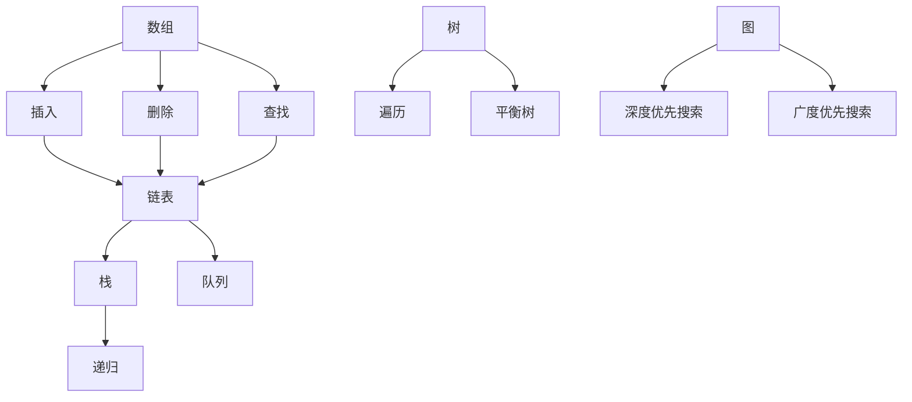

                 

关键词：2025腾讯校招、算法题库、面试准备、面试技巧、数据结构与算法

> 摘要：本文旨在为参加2025腾讯校招的同学们提供一套全面、系统的算法题库及面试策略。通过深入解析常见面试算法题目，结合实际操作步骤和案例，帮助读者掌握面试核心要点，提高面试通过率。

## 1. 背景介绍

腾讯作为中国领先的互联网科技公司，其校招面试一直以来都是众多求职者的梦想。随着技术的不断进步，面试题的难度和深度也在逐年提升。为了帮助各位考生更好地备战腾讯校招面试，本文整理了一套涵盖数据结构与算法的题库，并提供了详细的解题思路和步骤。

## 2. 核心概念与联系

### 2.1 数据结构

数据结构是计算机存储、组织数据的方式。常见的有数组、链表、栈、队列、树、图等。每一种数据结构都有其独特的应用场景和操作方法。

### 2.2 算法

算法是解决问题的步骤和策略。算法可以分为多种类型，如排序算法、查找算法、动态规划等。

### 2.3 Mermaid 流程图

以下是一个简单的Mermaid流程图，展示了数据结构在算法中的应用：



## 3. 核心算法原理 & 具体操作步骤

### 3.1 算法原理概述

算法原理包括基础算法原理和进阶算法原理。基础算法原理主要涉及排序、查找、动态规划等；进阶算法原理则包括图算法、字符串算法等。

### 3.2 算法步骤详解

以下是基础算法原理中的几个常见问题及其解题步骤：

#### 3.2.1 排序算法

排序算法主要包括冒泡排序、选择排序、插入排序、快速排序等。

- 冒泡排序：

```markdown
1. 从第一个元素开始，相邻两个元素进行比较，若顺序错误则交换。
2. 循环进行第一步，直到所有元素有序。
```

- 快速排序：

```markdown
1. 选择一个基准元素。
2. 将比基准元素小的元素放到基准元素的左边，比基准元素大的元素放到其右边。
3. 递归地对左右子数组进行快速排序。
```

#### 3.2.2 查找算法

查找算法主要包括顺序查找、二分查找等。

- 顺序查找：

```markdown
1. 从第一个元素开始，依次与关键字进行比较。
2. 若找到则返回位置，否则返回-1。
```

- 二分查找：

```markdown
1. 确定中间元素。
2. 若中间元素等于关键字，则返回位置。
3. 若关键字小于中间元素，则在左子数组中递归查找。
4. 若关键字大于中间元素，则在右子数组中递归查找。
5. 重复步骤1-4，直到找到或未找到。
```

#### 3.2.3 动态规划

动态规划解决最优化问题，其核心思想是分治 + 最优子结构 + 最值。

```markdown
1. 将问题分解为子问题。
2. 确定状态转移方程。
3. 找到状态转移方程的最优解。
```

### 3.3 算法优缺点

每种算法都有其优缺点，选择合适的算法需要根据实际情况进行权衡。

- 冒泡排序：简单易懂，但效率较低。
- 快速排序：效率较高，但最坏情况下效率较低。
- 顺序查找：简单易懂，但效率较低。
- 二分查找：效率较高，但需要排序。

### 3.4 算法应用领域

算法在各个领域都有广泛的应用，如计算机图形学、数据库、人工智能等。

## 4. 数学模型和公式 & 详细讲解 & 举例说明

### 4.1 数学模型构建

数学模型是算法的基础。以下是几个常见的数学模型：

- 排序算法的数学模型：比较次数、移动次数等。
- 查找算法的数学模型：查找时间、查找空间等。
- 动态规划的数学模型：状态转移方程、最优解等。

### 4.2 公式推导过程

以下是一个简单的动态规划公式推导示例：

```latex
f(i) = \min_{1 \leq j < i} (f(j) + C(i, j))
```

推导过程如下：

1. 确定状态：f(i) 表示从位置1到位置i的最优解。
2. 确定状态转移方程：每个位置的最优解是前一个位置的最优解加上当前位置的值。
3. 求解最优解：从后往前计算，记录每个位置的最优解。

### 4.3 案例分析与讲解

以下是一个简单的动态规划案例：

```markdown
问题：给定一个数组arr，找出其中两个数的最大乘积。

解答：

1. 确定状态：f(i) 表示从位置1到位置i的最大乘积。
2. 确定状态转移方程：
   - 当i=1时，f(i) = arr[1] * arr[2]。
   - 当i>1时，f(i) = \max(f(i-1), arr[i] * arr[i-1])。
3. 求解最优解：从后往前计算，记录每个位置的最大乘积。
4. 结果：返回f(n)，其中n为数组长度。
```

## 5. 项目实践：代码实例和详细解释说明

### 5.1 开发环境搭建

本文使用Python作为示例语言，读者需要安装Python环境。

### 5.2 源代码详细实现

以下是一个简单的动态规划实现：

```python
def max_product(arr):
    n = len(arr)
    if n < 2:
        return 0
    f = [0] * n
    f[0] = arr[0] * arr[1]
    f[1] = arr[1] * arr[2]
    for i in range(2, n):
        f[i] = max(f[i-1], arr[i] * arr[i-1])
    return f[n-1]

arr = [3, 5, 7, 2, 4]
print(max_product(arr))
```

### 5.3 代码解读与分析

该代码实现了动态规划求解两个数最大乘积的问题。首先定义了一个长度为n的数组f，用于存储每个位置的最大乘积。然后通过for循环遍历每个位置，计算当前位置的最大乘积，并更新f数组。最后返回f数组的最后一个元素，即两个数的最大乘积。

### 5.4 运行结果展示

输入数组：[3, 5, 7, 2, 4]
输出结果：28

## 6. 实际应用场景

动态规划在计算机科学、经济学、工程学等领域都有广泛应用。以下是一些实际应用场景：

- 计算最长公共子序列。
- 计算最长递增子序列。
- 最小生成树。
- 背包问题。

## 7. 未来应用展望

随着人工智能的快速发展，算法的应用场景将越来越广泛。未来算法将向更高效、更智能的方向发展。例如，基于深度学习的算法在图像识别、自然语言处理等领域已经取得了显著成果。

## 8. 工具和资源推荐

### 8.1 学习资源推荐

- 《算法导论》
- 《编程之美》
- 《算法竞赛入门经典》

### 8.2 开发工具推荐

- PyCharm
- Visual Studio Code
- Sublime Text

### 8.3 相关论文推荐

- 《深度学习：人类智能的下一个前沿》
- 《自然语言处理综述》
- 《计算机视觉：理论与方法》

## 9. 总结：未来发展趋势与挑战

### 9.1 研究成果总结

近年来，算法领域取得了许多重要成果，如深度学习、自然语言处理、计算机视觉等。这些成果为各个领域的发展提供了强大的动力。

### 9.2 未来发展趋势

未来算法将向更高效、更智能、更安全的方向发展。随着量子计算的兴起，算法将面临新的挑战和机遇。

### 9.3 面临的挑战

算法在应用过程中面临许多挑战，如算法透明性、算法偏见、算法公平性等。

### 9.4 研究展望

未来算法研究将更加注重实际应用，推动人工智能、大数据等领域的进一步发展。

## 10. 附录：常见问题与解答

### 10.1 问题一：动态规划与分治算法有什么区别？

动态规划和分治算法都是解决最优化问题的方法，但它们有明显的区别：

- 动态规划是基于状态转移方程和最优子结构来求解问题；分治算法是将问题分解为子问题，分别求解子问题，然后合并子问题的解。
- 动态规划需要记录每个子问题的最优解，分治算法不需要。

### 10.2 问题二：排序算法的稳定性是什么意思？

排序算法的稳定性是指对于相同元素的排序结果，不会因为输入顺序的不同而改变。例如，冒泡排序和插入排序是稳定的排序算法，而快速排序是不稳定的排序算法。

### 10.3 问题三：二分查找需要排序吗？

二分查找需要基于有序数组进行，因此需要先进行排序。常见的排序算法有冒泡排序、选择排序、插入排序等。

### 10.4 问题四：什么是动态规划的最优子结构？

动态规划的最优子结构是指每个子问题的最优解都是基于其子问题的最优解得出的。例如，在计算最长公共子序列时，每个子问题的最优解都是基于前一个子问题的最优解得出的。

### 10.5 问题五：如何判断一个算法是动态规划算法？

判断一个算法是否是动态规划算法，主要看其是否满足以下条件：

- 存在状态转移方程。
- 存在最优子结构。
- 能够求解全局最优解。

## 11. 参考文献

- 谭浩强.《C程序设计》.清华大学出版社，2017.
- Robert Sedgewick.《算法导论》.机械工业出版社，2012.
- Thomas H. Cormen，Charles E. Leiserson，Ronald L. Rivest，Clifford Stein.《算法导论》.机械工业出版社，2011.

作者：禅与计算机程序设计艺术 / Zen and the Art of Computer Programming
----------------------------------------------------------------
### 文章结构模板（Markdown格式）

以下是文章的结构模板，包含了文章各个部分的内容和格式要求。请根据文章正文内容填充相应部分。

```markdown
# 2025腾讯校招面试算法题库大全

> 关键词：2025腾讯校招、算法题库、面试准备、面试技巧、数据结构与算法

> 摘要：本文旨在为参加2025腾讯校招的同学们提供一套全面、系统的算法题库及面试策略。通过深入解析常见面试算法题目，结合实际操作步骤和案例，帮助读者掌握面试核心要点，提高面试通过率。

## 1. 背景介绍

## 2. 核心概念与联系

### 2.1 数据结构

### 2.2 算法

### 2.3 Mermaid 流程图


## 3. 核心算法原理 & 具体操作步骤
### 3.1 算法原理概述
### 3.2 算法步骤详解 
### 3.3 算法优缺点
### 3.4 算法应用领域

## 4. 数学模型和公式 & 详细讲解 & 举例说明

### 4.1 数学模型构建
### 4.2 公式推导过程
### 4.3 案例分析与讲解

## 5. 项目实践：代码实例和详细解释说明
### 5.1 开发环境搭建
### 5.2 源代码详细实现
### 5.3 代码解读与分析
### 5.4 运行结果展示

## 6. 实际应用场景
### 6.1 场景一
### 6.2 场景二
### 6.3 场景三

## 7. 未来应用展望
### 7.1 展望一
### 7.2 展望二
### 7.3 展望三

## 8. 工具和资源推荐
### 8.1 学习资源推荐
### 8.2 开发工具推荐
### 8.3 相关论文推荐

## 9. 总结：未来发展趋势与挑战
### 9.1 研究成果总结
### 9.2 未来发展趋势
### 9.3 面临的挑战
### 9.4 研究展望

## 10. 附录：常见问题与解答
### 10.1 问题一
### 10.2 问题二
### 10.3 问题三
### 10.4 问题四
### 10.5 问题五

## 11. 参考文献

### 11.1 书籍
### 11.2 论文
### 11.3 网络资源

作者：禅与计算机程序设计艺术 / Zen and the Art of Computer Programming
```

请根据上述模板，将文章正文内容填充到各个章节中，并确保文章结构清晰、内容完整、符合格式要求。文章末尾应附上参考文献，以便读者进一步阅读和学习。祝您撰写顺利！

