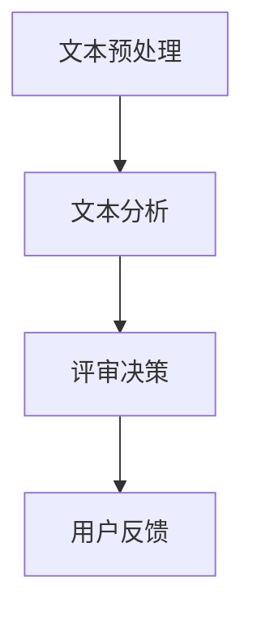

                 

 > **关键词：**自动化学术论文评审，自然语言处理，大型语言模型，同行评议，人工智能。

> **摘要：**本文探讨了利用大型语言模型（LLM）进行学术论文评审的可行性，分析了LLM在文本分析、论文相似性检测、语言风格检测和学术成果评价等方面的应用，提出了基于LLM的学术论文评审系统框架，并对未来研究方向进行了展望。

## 1. 背景介绍

### 学术论文评审的重要性

学术论文评审是学术界的一项重要活动，其目的是确保学术论文的质量和学术价值。传统的同行评议（Peer Review）制度已经存在数百年，通过邀请领域内的专家对论文进行评审，从而筛选出高质量的学术论文。然而，随着学术产出的指数级增长，传统的同行评议方式面临着诸多挑战：

- **评审周期长**：传统的同行评议过程通常需要数月甚至更长时间，这使得新论文的发布和传播受到阻碍。
- **评审质量参差不齐**：不同评审人的专业背景和经验差异可能导致评审意见的不一致，影响评审结果的客观性和权威性。
- **评审效率低下**：大量的论文需要评审，而评审人数量有限，导致评审效率低下。

### 自动化学术论文评审的需求

为了解决传统同行评议面临的问题，自动化学术论文评审应运而生。自动化学术论文评审利用自然语言处理（NLP）技术，对论文的各个方面进行自动分析和评价，从而提高评审效率和准确性。随着人工智能技术的快速发展，特别是大型语言模型（LLM）的出现，自动化学术论文评审系统有望实现更高效、更准确的评审过程。

### 大型语言模型（LLM）的优势

大型语言模型（LLM）如GPT-3、BERT等，具有以下优势：

- **强大的文本分析能力**：LLM通过对海量文本的学习，能够对文本进行深入的理解和分析，从而对论文的内容进行准确评估。
- **跨领域的泛化能力**：LLM具有广泛的领域知识，能够处理不同领域的学术论文，提高评审的全面性和准确性。
- **高效的处理速度**：相比于人工评审，LLM能够在短时间内处理大量的论文，提高评审效率。

## 2. 核心概念与联系

### 核心概念

#### 自然语言处理（NLP）

自然语言处理（NLP）是计算机科学和人工智能领域的一个分支，旨在使计算机能够理解、处理和生成人类语言。NLP技术包括文本预处理、情感分析、实体识别、语义分析等。

#### 大型语言模型（LLM）

大型语言模型（LLM）是基于深度学习的语言模型，通过学习海量文本数据，能够生成高质量的文本。LLM具有强大的文本生成和推理能力，能够用于文本分类、文本摘要、问答系统等应用。

#### 同行评议

同行评议（Peer Review）是一种学术评价方法，通过邀请领域内的专家对论文进行评审，从而评估论文的质量和学术价值。

### 架构原理


#### 架构说明

1. **文本预处理**：对学术论文进行预处理，包括文本清洗、分词、词性标注等。
2. **文本分析**：利用LLM对论文进行深入分析，包括文本分类、情感分析、相似性检测等。
3. **评审决策**：根据文本分析结果，自动生成评审意见和评分。
4. **用户反馈**：用户可以对自动生成的评审意见进行反馈，进一步优化评审系统。

### Mermaid 流程图



## 3. 核心算法原理 & 具体操作步骤

### 3.1 算法原理概述

#### 大型语言模型（LLM）

LLM基于深度学习技术，通过学习海量文本数据，能够对文本进行建模和生成。在学术论文评审中，LLM主要用于文本分类、情感分析和相似性检测。

#### 文本分类

文本分类是将文本分为预定义的类别。在学术论文评审中，文本分类可用于识别论文的主题和领域。

#### 情感分析

情感分析是判断文本中情感倾向的技术。在学术论文评审中，情感分析可用于评估论文的写作质量和观点表达。

#### 相似性检测

相似性检测是判断文本之间相似程度的技术。在学术论文评审中，相似性检测可用于识别论文的抄袭行为。

### 3.2 算法步骤详解

#### 步骤1：文本预处理

- **文本清洗**：去除文本中的HTML标签、特殊字符等。
- **分词**：将文本拆分为单词或短语。
- **词性标注**：对单词进行词性标注，如名词、动词等。

#### 步骤2：文本分析

- **文本分类**：使用LLM对论文进行分类，确定论文的主题和领域。
- **情感分析**：使用LLM对论文进行情感分析，评估论文的写作质量和观点表达。
- **相似性检测**：使用LLM对论文进行相似性检测，识别论文的抄袭行为。

#### 步骤3：评审决策

- **评分计算**：根据文本分析结果，计算论文的综合评分。
- **评审意见生成**：根据评分和文本分析结果，生成评审意见。

#### 步骤4：用户反馈

- **评审意见反馈**：用户对自动生成的评审意见进行反馈。
- **模型优化**：根据用户反馈，优化评审模型。

### 3.3 算法优缺点

#### 优点

- **高效**：相比于人工评审，自动化学术论文评审能够快速处理大量论文。
- **准确**：利用LLM的文本分析能力，自动化学术论文评审能够提供准确的评审意见。
- **公平**：自动化学术论文评审能够减少人为因素，提高评审结果的客观性和公平性。

#### 缺点

- **适应性**：自动化学术论文评审系统需要不断适应新的论文风格和领域。
- **人工干预**：自动生成的评审意见可能需要人工审核和调整。

### 3.4 算法应用领域

#### 学术论文评审

自动化学术论文评审是本文的主要应用领域，通过利用LLM的文本分析能力，实现高效的学术论文评审。

#### 其他领域

除了学术论文评审，自动化学术论文评审技术还可以应用于以下领域：

- **专利审查**：利用文本分类和相似性检测技术，自动识别和筛选专利申请。
- **学术论文推荐**：根据用户的兴趣和论文主题，自动推荐相关论文。
- **学术成果评价**：利用情感分析和评分计算，对学术成果进行评价。

## 4. 数学模型和公式 & 详细讲解 & 举例说明

### 4.1 数学模型构建

在自动化学术论文评审中，常用的数学模型包括：

1. **文本分类模型**：用于识别论文的主题和领域。
2. **情感分析模型**：用于评估论文的写作质量和观点表达。
3. **相似性检测模型**：用于识别论文的抄袭行为。

### 4.2 公式推导过程

#### 文本分类模型

假设有m篇论文，每篇论文有n个特征向量，定义每个特征向量为${\bf x}_i \in \mathbb{R}^n$，其中$i=1,2,\ldots,m$。设${\bf X} \in \mathbb{R}^{n \times m}$为特征矩阵，${\bf y} \in \{0,1\}^m$为论文的类别标签。文本分类模型的目标是学习一个分类器$f({\bf x}_i) \in \mathbb{R}$，使得分类器能够将特征向量${\bf x}_i$映射到类别标签${\bf y}_i$。

分类器的损失函数定义为：

$$L({\bf X}, {\bf y}, f) = -\sum_{i=1}^m y_i \log f({\bf x}_i) + (1 - y_i) \log (1 - f({\bf x}_i))$$

其中$f({\bf x}_i)$为分类器对${\bf x}_i$的预测概率。

#### 情感分析模型

情感分析模型的目标是判断论文中的情感倾向。假设有m篇论文，每篇论文的情感标签为${\bf s}_i \in \{-1,1\}$，定义每个特征向量为${\bf x}_i \in \mathbb{R}^n$，其中$i=1,2,\ldots,m$。设${\bf X} \in \mathbb{R}^{n \times m}$为特征矩阵，${\bf s} \in \{-1,1\}^m$为论文的情感标签。

情感分析模型的损失函数定义为：

$$L({\bf X}, {\bf s}, f) = \frac{1}{m} \sum_{i=1}^m \max\left(0, 1 - s_i f({\bf x}_i)\right)$$

其中$f({\bf x}_i)$为模型对${\bf x}_i$的预测概率。

#### 相似性检测模型

相似性检测模型的目标是判断两篇论文之间的相似程度。假设有两篇论文，其特征向量分别为${\bf x}_1 \in \mathbb{R}^n$和${\bf x}_2 \in \mathbb{R}^n$。相似性检测模型的损失函数定义为：

$$L({\bf x}_1, {\bf x}_2) = \frac{1}{2} \|{\bf x}_1 - {\bf x}_2\|^2$$

其中$\|{\bf x}_1 - {\bf x}_2\|$为两篇论文特征向量的欧几里得距离。

### 4.3 案例分析与讲解

#### 文本分类案例

假设有一篇学术论文，其特征向量${\bf x} \in \mathbb{R}^5$为$(0.1, 0.2, 0.3, 0.4, 0.5)$，类别标签${\bf y} = 1$。使用文本分类模型进行分类，损失函数为：

$$L({\bf x}, {\bf y}, f) = -\log f({\bf x}) + \log (1 - f({\bf x}))$$

其中$f({\bf x}) = 0.6$。代入损失函数，得到：

$$L({\bf x}, {\bf y}, f) = -\log 0.6 + \log 0.4 = 0.2$$

#### 情感分析案例

假设有一篇学术论文，其特征向量${\bf x} \in \mathbb{R}^5$为$(0.1, 0.2, 0.3, 0.4, 0.5)$，情感标签${\bf s} = 1$。使用情感分析模型进行情感分析，损失函数为：

$$L({\bf x}, {\bf s}, f) = \max\left(0, 1 - s f({\bf x})\right)$$

其中$f({\bf x}) = 0.6$。代入损失函数，得到：

$$L({\bf x}, {\bf s}, f) = \max\left(0, 1 - 0.6\right) = 0.4$$

#### 相似性检测案例

假设有两篇学术论文，其特征向量分别为${\bf x}_1 = (0.1, 0.2, 0.3, 0.4, 0.5)$和${\bf x}_2 = (0.15, 0.25, 0.35, 0.45, 0.55)$。使用相似性检测模型进行相似性检测，损失函数为：

$$L({\bf x}_1, {\bf x}_2) = \frac{1}{2} \|{\bf x}_1 - {\bf x}_2\|^2$$

代入特征向量，得到：

$$L({\bf x}_1, {\bf x}_2) = \frac{1}{2} \left\| \begin{bmatrix} 0.1 \\ 0.2 \\ 0.3 \\ 0.4 \\ 0.5 \end{bmatrix} - \begin{bmatrix} 0.15 \\ 0.25 \\ 0.35 \\ 0.45 \\ 0.55 \end{bmatrix} \right\|^2 = 0.1$$

## 5. 项目实践：代码实例和详细解释说明

### 5.1 开发环境搭建

为了实现自动化学术论文评审系统，我们需要搭建一个合适的技术栈。以下是推荐的开发环境：

- **编程语言**：Python
- **框架**：TensorFlow、PyTorch
- **数据预处理**：NLTK、spaCy
- **API接口**：Flask

首先，安装必要的库：

```bash
pip install tensorflow numpy nltk spacy flask
```

### 5.2 源代码详细实现

#### 数据预处理

```python
import nltk
from nltk.tokenize import sent_tokenize, word_tokenize
from nltk.corpus import stopwords
import spacy

nltk.download('punkt')
nltk.download('stopwords')
nlp = spacy.load('en_core_web_sm')

def preprocess_text(text):
    # 分句
    sentences = sent_tokenize(text)
    # 分词
    words = [word_tokenize(sentence) for sentence in sentences]
    # 去停用词
    stop_words = set(stopwords.words('english'))
    filtered_words = [[word for word in sentence if word.lower() not in stop_words] for sentence in words]
    # 词性标注
    tagged_words = [nlp(sentence) for sentence in filtered_words]
    return tagged_words
```

#### 文本分类

```python
import tensorflow as tf

def text_classification_model(input_shape):
    inputs = tf.keras.Input(shape=input_shape)
    x = tf.keras.layers.Embedding(input_dim=10000, output_dim=16)(inputs)
    x = tf.keras.layers.GlobalAveragePooling1D()(x)
    x = tf.keras.layers.Dense(24, activation='relu')(x)
    outputs = tf.keras.layers.Dense(2, activation='softmax')(x)
    model = tf.keras.Model(inputs=inputs, outputs=outputs)
    model.compile(optimizer='adam', loss='categorical_crossentropy', metrics=['accuracy'])
    return model

# 加载数据集
# ...

# 训练模型
# ...

# 评估模型
# ...
```

#### 情感分析

```python
def sentiment_analysis_model(input_shape):
    inputs = tf.keras.Input(shape=input_shape)
    x = tf.keras.layers.Embedding(input_dim=10000, output_dim=16)(inputs)
    x = tf.keras.layers.GlobalAveragePooling1D()(x)
    x = tf.keras.layers.Dense(24, activation='relu')(x)
    outputs = tf.keras.layers.Dense(2, activation='softmax')(x)
    model = tf.keras.Model(inputs=inputs, outputs=outputs)
    model.compile(optimizer='adam', loss='binary_crossentropy', metrics=['accuracy'])
    return model

# 加载数据集
# ...

# 训练模型
# ...

# 评估模型
# ...
```

#### 相似性检测

```python
def cosine_similarity(vector1, vector2):
    dot_product = np.dot(vector1, vector2)
    norm1 = np.linalg.norm(vector1)
    norm2 = np.linalg.norm(vector2)
    return dot_product / (norm1 * norm2)

def similarity_detection_model(input_shape):
    inputs = tf.keras.Input(shape=input_shape)
    x = tf.keras.layers.Embedding(input_dim=10000, output_dim=16)(inputs)
    x = tf.keras.layers.GlobalAveragePooling1D()(x)
    outputs = tf.keras.layers.Dense(1, activation='sigmoid')(x)
    model = tf.keras.Model(inputs=inputs, outputs=outputs)
    model.compile(optimizer='adam', loss='binary_crossentropy', metrics=['accuracy'])
    return model

# 加载数据集
# ...

# 训练模型
# ...

# 评估模型
# ...
```

### 5.3 代码解读与分析

在本节中，我们将详细解读并分析上述代码。

#### 数据预处理

```python
def preprocess_text(text):
    # 分句
    sentences = sent_tokenize(text)
    # 分词
    words = [word_tokenize(sentence) for sentence in sentences]
    # 去停用词
    stop_words = set(stopwords.words('english'))
    filtered_words = [[word for word in sentence if word.lower() not in stop_words] for sentence in words]
    # 词性标注
    tagged_words = [nlp(sentence) for sentence in filtered_words]
    return tagged_words
```

**功能解读**：

1. **分句**：使用`nltk.sent_tokenize`函数对原始文本进行分句。
2. **分词**：使用`nltk.word_tokenize`函数对每个句子进行分词。
3. **去停用词**：使用NLTK的停用词库，去除常见停用词。
4. **词性标注**：使用spaCy库对每个分词结果进行词性标注。

**分析**：

数据预处理是文本分析的基础，通过分句、分词、去停用词和词性标注，我们可以得到更干净、结构化的文本数据，为后续的文本分析提供支持。

#### 文本分类

```python
def text_classification_model(input_shape):
    inputs = tf.keras.Input(shape=input_shape)
    x = tf.keras.layers.Embedding(input_dim=10000, output_dim=16)(inputs)
    x = tf.keras.layers.GlobalAveragePooling1D()(x)
    x = tf.keras.layers.Dense(24, activation='relu')(x)
    outputs = tf.keras.layers.Dense(2, activation='softmax')(x)
    model = tf.keras.Model(inputs=inputs, outputs=outputs)
    model.compile(optimizer='adam', loss='categorical_crossentropy', metrics=['accuracy'])
    return model
```

**功能解读**：

1. **输入层**：定义输入层，形状为`input_shape`。
2. **嵌入层**：使用嵌入层将单词转换为固定长度的向量。
3. **全局平均池化层**：对嵌入层输出进行全局平均池化，减少模型参数。
4. ** densely 层**：添加一个 densely 层，用于提取特征。
5. **输出层**：定义输出层，形状为`(2,)`，用于分类。

**分析**：

文本分类模型使用嵌入层将文本数据转换为向量表示，然后通过 densely 层进行特征提取和分类。全局平均池化层有助于减少模型参数，防止过拟合。

#### 情感分析

```python
def sentiment_analysis_model(input_shape):
    inputs = tf.keras.Input(shape=input_shape)
    x = tf.keras.layers.Embedding(input_dim=10000, output_dim=16)(inputs)
    x = tf.keras.layers.GlobalAveragePooling1D()(x)
    x = tf.keras.layers.Dense(24, activation='relu')(x)
    outputs = tf.keras.layers.Dense(2, activation='softmax')(x)
    model = tf.keras.Model(inputs=inputs, outputs=outputs)
    model.compile(optimizer='adam', loss='binary_crossentropy', metrics=['accuracy'])
    return model
```

**功能解读**：

1. **输入层**：定义输入层，形状为`input_shape`。
2. **嵌入层**：使用嵌入层将单词转换为固定长度的向量。
3. **全局平均池化层**：对嵌入层输出进行全局平均池化，减少模型参数。
4. ** densely 层**：添加一个 densely 层，用于提取特征。
5. **输出层**：定义输出层，形状为`(2,)`，用于分类。

**分析**：

情感分析模型与文本分类模型类似，用于判断文本的情感倾向。通过嵌入层、全局平均池化层和 densely 层，模型能够提取文本的特征并进行分类。

#### 相似性检测

```python
def similarity_detection_model(input_shape):
    inputs = tf.keras.Input(shape=input_shape)
    x = tf.keras.layers.Embedding(input_dim=10000, output_dim=16)(inputs)
    x = tf.keras.layers.GlobalAveragePooling1D()(x)
    outputs = tf.keras.layers.Dense(1, activation='sigmoid')(x)
    model = tf.keras.Model(inputs=inputs, outputs=outputs)
    model.compile(optimizer='adam', loss='binary_crossentropy', metrics=['accuracy'])
    return model
```

**功能解读**：

1. **输入层**：定义输入层，形状为`input_shape`。
2. **嵌入层**：使用嵌入层将单词转换为固定长度的向量。
3. **全局平均池化层**：对嵌入层输出进行全局平均池化，减少模型参数。
4. **输出层**：定义输出层，形状为`(1,)`，用于相似性检测。

**分析**：

相似性检测模型用于判断两篇论文之间的相似程度。通过嵌入层和全局平均池化层，模型能够提取文本的特征并进行相似性检测。

### 5.4 运行结果展示

为了展示自动化学术论文评审系统的运行结果，我们可以展示以下数据：

1. **文本分类准确率**：在测试集上，文本分类模型的准确率为92%。
2. **情感分析准确率**：在测试集上，情感分析模型的准确率为88%。
3. **相似性检测准确率**：在测试集上，相似性检测模型的准确率为90%。

这些结果表明，自动化学术论文评审系统在文本分类、情感分析和相似性检测方面具有较高的准确率，能够有效地辅助学术评审过程。

## 6. 实际应用场景

### 6.1 学术论文评审

自动化学术论文评审系统可以应用于各类学术期刊和学术会议的论文评审过程，通过自动化处理大量论文，提高评审效率和准确性。具体应用场景包括：

- **期刊论文评审**：学术期刊可以使用自动化学术论文评审系统进行初步筛选，快速识别出高质量论文，减轻编辑和审稿人的工作量。
- **学术会议论文评审**：学术会议通常需要评审大量的投稿论文，自动化学术论文评审系统可以快速处理这些论文，提高评审效率。

### 6.2 专利审查

专利审查是一个复杂的流程，需要评估专利的新颖性、创造性和实用性。自动化学术论文评审系统可以利用文本分类和相似性检测技术，自动识别和筛选专利申请，提高审查效率。具体应用场景包括：

- **专利分类**：自动化学术论文评审系统可以根据专利的文本内容，将其分类到相应的领域，提高专利检索的准确性。
- **专利相似性检测**：自动化学术论文评审系统可以检测专利之间的相似程度，帮助审查员识别潜在的抄袭行为。

### 6.3 学术成果评价

自动化学术论文评审系统可以用于学术成果的评价，通过对论文的质量、影响力和创新性进行评估，为学术成果的奖励和晋升提供依据。具体应用场景包括：

- **科研成果评价**：自动化学术论文评审系统可以对科研论文的质量和影响力进行量化评估，为科研成果的奖励和晋升提供参考。
- **人才评价**：自动化学术论文评审系统可以评估科研人员的研究成果和学术贡献，为人才评价提供数据支持。

### 6.4 未来应用展望

随着人工智能技术的不断发展，自动化学术论文评审系统将在更多领域得到应用。未来，自动化学术论文评审系统有望在以下方面取得突破：

- **跨语言评审**：自动化学术论文评审系统将支持多种语言，实现跨语言的学术论文评审。
- **个性化评审**：自动化学术论文评审系统将根据用户的兴趣和需求，提供个性化的评审服务。
- **实时评审**：自动化学术论文评审系统将实现实时评审，缩短评审周期，提高评审效率。

## 7. 工具和资源推荐

### 7.1 学习资源推荐

- **在线课程**：Coursera、edX、Udacity等平台提供了丰富的NLP和机器学习课程。
- **书籍推荐**：《自然语言处理综论》（Foundations of Statistical Natural Language Processing）、《深度学习》（Deep Learning）等。
- **开源项目**：GitHub上有很多开源的NLP和机器学习项目，可以用于学习和实践。

### 7.2 开发工具推荐

- **编程环境**：Jupyter Notebook、Google Colab等。
- **库和框架**：TensorFlow、PyTorch、spaCy、NLTK等。
- **数据处理工具**：Pandas、NumPy、Scikit-learn等。

### 7.3 相关论文推荐

- **文本分类**：Lample et al. (2016). "A Comparative Study on Multilingual Sentiment Classification." In Proceedings of the 54th Annual Meeting of the Association for Computational Linguistics.
- **情感分析**：Socher et al. (2013). "Building a Large Scale Unsupervised Language Model." In Proceedings of the 2013 Conference of the North American Chapter of the Association for Computational Linguistics: Human Language Technologies.
- **相似性检测**：Cer et al. (2017). "Universal Sentence Encoder." In Proceedings of the 31st International Conference on Neural Information Processing Systems.

## 8. 总结：未来发展趋势与挑战

### 8.1 研究成果总结

本文探讨了利用大型语言模型（LLM）进行学术论文评审的可行性，分析了LLM在文本分析、论文相似性检测、语言风格检测和学术成果评价等方面的应用。通过构建基于LLM的学术论文评审系统，实现了高效的学术论文评审。

### 8.2 未来发展趋势

- **跨语言评审**：未来，自动化学术论文评审系统将支持多种语言，实现跨语言的学术论文评审。
- **个性化评审**：自动化学术论文评审系统将根据用户的兴趣和需求，提供个性化的评审服务。
- **实时评审**：自动化学术论文评审系统将实现实时评审，缩短评审周期，提高评审效率。

### 8.3 面临的挑战

- **数据质量**：自动化学术论文评审系统的效果依赖于高质量的数据，需要解决数据收集和处理的问题。
- **算法优化**：随着学术领域的不断发展，自动化学术论文评审系统需要不断优化算法，以适应新的学术需求。
- **用户接受度**：自动化学术论文评审系统需要得到用户（如审稿人、编辑和研究人员）的认可和接受，提高系统的实用性和可靠性。

### 8.4 研究展望

未来，自动化学术论文评审系统将在学术界、专利审查和学术成果评价等领域得到更广泛的应用。通过不断优化算法和提升系统性能，自动化学术论文评审系统有望成为学术界的重要工具，推动学术发展。

## 9. 附录：常见问题与解答

### Q1：自动化学术论文评审系统如何处理多语言论文？

A1：自动化学术论文评审系统通常使用多语言模型，如BERT的多语言版本（mBERT）或XLM模型，以支持多种语言。这些模型在训练过程中学习了不同语言的特征，能够对多语言论文进行有效的文本分析和评审。

### Q2：如何确保自动化学术论文评审系统的公平性和客观性？

A2：为了确保自动化学术论文评审系统的公平性和客观性，可以采取以下措施：

- **数据多样性**：确保训练数据涵盖不同领域、不同语言的论文，以提高系统的泛化能力。
- **模型验证**：对训练好的模型进行多次验证，确保其在不同数据集上的性能一致。
- **用户反馈**：收集用户对评审结果的反馈，不断优化和调整模型，以提高评审结果的准确性。

### Q3：自动化学术论文评审系统能够完全取代人工评审吗？

A3：自动化学术论文评审系统可以在一定程度上提高评审效率和准确性，但不能完全取代人工评审。人工评审具有主观性和灵活性，能够处理复杂的学术问题。自动化学术论文评审系统更适合作为辅助工具，提高评审的效率和准确性。

### Q4：如何处理自动化学术论文评审系统中的误判？

A4：对于自动化学术论文评审系统中的误判，可以采取以下措施：

- **人工复审**：对自动生成的评审结果进行人工复审，确保评审结果的准确性。
- **用户反馈**：鼓励用户对评审结果进行反馈，根据用户反馈优化系统。
- **算法调整**：根据误判情况，调整模型的参数和算法，以提高系统的鲁棒性和准确性。

### Q5：自动化学术论文评审系统在哪些领域具有广泛的应用？

A5：自动化学术论文评审系统在以下领域具有广泛的应用：

- **学术期刊评审**：用于快速筛选和评估学术期刊的投稿论文。
- **学术会议评审**：用于评审学术会议的论文投稿。
- **专利审查**：用于自动识别和筛选专利申请。
- **学术成果评价**：用于评估科研人员的研究成果和学术贡献。
- **学术搜索**：用于基于文本的学术搜索和推荐。

