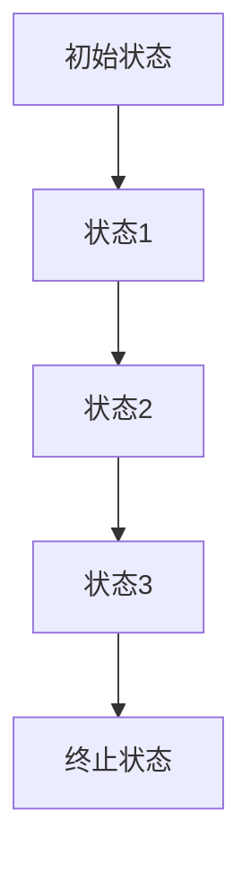
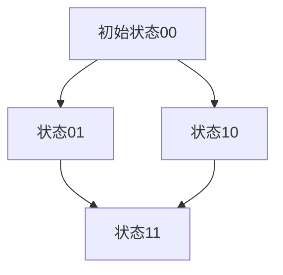
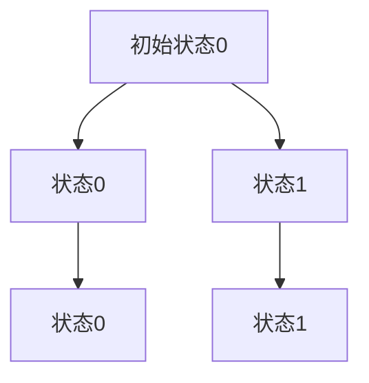

                 

自动机理论是计算机科学和理论计算机科学中的基础概念，而人工智能（Artificial Intelligence, AI）作为计算机科学的一个重要分支，旨在通过构建智能系统模拟、扩展或替代人类智能。自动机理论与人工智能之间存在深远的联系，二者相互促进，共同推动着科技进步。

## 文章关键词
自动机理论、人工智能、计算模型、算法、神经网络、图灵机、状态机。

## 文章摘要
本文旨在探讨自动机理论与人工智能之间的紧密联系，分析自动机理论如何为人工智能提供理论基础和计算模型。文章将首先回顾自动机理论的基本概念，然后介绍其在人工智能中的应用，接着深入探讨图灵机和神经网络模型，最后展望自动机理论在人工智能未来发展中的作用。

## 1. 背景介绍

自动机理论的研究起源于20世纪30年代，当时图灵（Alan Turing）提出了图灵机的概念，为计算模型提供了基础。图灵机是一种抽象的计算机，通过读取和写入符号来模拟计算过程。自动机理论研究的核心是确定性和非确定性自动机，它们在计算机科学中扮演着至关重要的角色。

与此同时，人工智能作为一个研究领域，始于20世纪50年代。人工智能的目标是创建能够执行复杂任务、适应新环境和进行自主学习的智能系统。人工智能的研究涵盖了多个领域，包括机器学习、自然语言处理、计算机视觉等。

自动机理论为人工智能提供了计算基础，使得复杂任务的处理和模拟成为可能。而人工智能的发展则对自动机理论提出了新的挑战，推动了理论的发展和完善。

### 1.1 自动机理论的起源

自动机理论的起源可以追溯到1936年，当图灵发表了著名的论文《计算机器与智能》。在论文中，图灵提出了图灵机的概念，这是一种抽象的计算模型，通过在无限长的纸带上读写符号来执行计算。图灵机由一个读取头、一个控制器和一系列的纸带组成。控制器根据当前读取头的状态和纸带上的符号，选择下一个动作，可能是读取、写入、移动纸带或切换状态。

图灵机的提出标志着计算理论的诞生，为后来自动机理论的发展奠定了基础。图灵机是一种理想的计算模型，它能够模拟任何计算过程，是现代计算机的基石。

### 1.2 人工智能的发展

人工智能的发展历程可以分为几个阶段。最初，人工智能研究主要集中在规则推理和符号逻辑上。这一阶段的人工智能系统通常依赖于预定义的规则和知识库，以执行特定的任务。

随着计算机性能的提升和算法的发展，人工智能进入了基于数据驱动的方法，特别是机器学习。机器学习通过训练模型从大量数据中学习规律，使得人工智能系统能够在无需显式编程的情况下实现复杂任务。

近年来，深度学习成为人工智能研究的前沿领域。深度学习模型，尤其是神经网络，通过多层非线性变换，可以自动提取特征并实现复杂的分类、回归等任务。深度学习在图像识别、自然语言处理和自动驾驶等领域取得了显著的成果。

### 1.3 自动机理论与人工智能的关系

自动机理论为人工智能提供了计算模型和理论基础。首先，自动机理论帮助人们理解计算的本质，为构建智能系统提供了抽象框架。例如，神经网络的设计灵感就来自于对自动机的模拟。

其次，自动机理论提供了对计算复杂性的分析工具，帮助研究者评估人工智能算法的效率。例如，确定性有限自动机（DFA）和非确定性有限自动机（NFA）的概念在自然语言处理中的词法分析中有着广泛的应用。

此外，自动机理论还为人工智能的发展提供了新的思路。例如，在图灵机的基础上，研究者提出了各种更加复杂的计算模型，如图灵完全和非完全语言，这些模型在理论计算机科学和人工智能中都发挥着重要作用。

总之，自动机理论与人工智能之间存在着紧密的联系，二者相互促进，共同推动了计算科学的发展。

## 2. 核心概念与联系

### 2.1 自动机理论的基本概念

自动机理论的核心概念包括有限自动机、推算自动机、图灵机等。这些概念为计算模型提供了基础，使得复杂任务的处理和模拟成为可能。

**有限自动机（Finite Automaton）** 是一种最简单的计算模型，由一组状态、一组输入符号、一个初始状态和一组终止状态组成。有限自动机按照一定的规则，从初始状态开始，依次读取输入符号，并根据当前状态和输入符号，转移到下一个状态。如果最终状态是终止状态，则输入序列被接受。

**推算自动机（Pushdown Automaton）** 是有限自动机的扩展，引入了栈结构。栈可以存储有限数量的符号，使得推算自动机能够处理更加复杂的语言。

**图灵机（Turing Machine）** 是最强大的计算模型，由一个无限长的纸带、一个读取头、一个控制器和一组状态组成。图灵机能够模拟任何计算过程，是现代计算机的理论基础。

### 2.2 自动机理论在人工智能中的应用

自动机理论在人工智能中的应用非常广泛，主要包括以下几个方面：

**词法分析（Lexical Analysis）**：词法分析是编译器设计中的一个关键步骤，它将源代码中的字符序列转换为记号序列。有限自动机是词法分析器的一种常用实现方式，通过定义一组状态和转换规则，可以高效地识别和分类字符序列。

**自然语言处理（Natural Language Processing, NLP）**：自然语言处理是人工智能的一个重要分支，涉及文本的生成、理解和处理。自动机理论在NLP中的应用主要包括分词、词性标注和语法分析等。例如，确定性有限自动机（DFA）可以用于词法分析，识别单词边界。

**形式语言（Formal Language）**：自动机理论提供了形式语言理论的基础。形式语言是一组符号的集合，按照一定的规则进行组合。自动机理论可以用来定义和分析形式语言，从而为人工智能系统的语言理解和生成提供理论基础。

**机器学习（Machine Learning）**：机器学习中的许多算法，如决策树、支持向量机等，都可以看作是一种自动机。这些算法通过学习输入数据中的模式，生成一个映射规则，从而实现预测和分类。

### 2.3 自动机理论的应用示例

**示例1：有限自动机在编译器中的应用**

在编译器中，有限自动机用于词法分析。例如，假设我们要分析以下C语言代码片段：

```c
int x = 5;
```

我们可以定义一个有限自动机，包括以下状态：

- `STATE_START`：初始状态
- `STATE_INT`：识别`int`关键字
- `STATE_ID`：识别变量名
- `STATE_EQUALS`：识别等号
- `STATE_NUMBER`：识别数字
- `STATE_END`：终止状态

输入符号包括`a`到`z`、数字`0`到`9`和特殊符号`=`、`;`等。通过定义转换规则，我们可以将输入的字符序列转换为记号序列。例如，当输入`int`时，自动机从`STATE_START`状态转移到`STATE_INT`状态，并生成记号`<keyword>int</keyword>`。

**示例2：推算自动机在语法分析中的应用**

在语法分析中，推算自动机用于识别和解析程序语句。例如，我们可以使用推算自动机来解析以下C语言代码片段：

```c
if (x > 0) {
    printf("x is positive");
}
```

推算自动机包括以下状态：

- `STATE_START`：初始状态
- `STATE_IF`：识别`if`关键字
- `STATE_CONDITION`：识别条件表达式
- `STATE_BRACE_OPEN`：识别大括号开
- `STATE_STMT`：识别语句
- `STATE_BRACE_CLOSE`：识别大括号闭
- `STATE_END`：终止状态

通过定义转换规则，我们可以识别和解析程序中的语句，生成语法树。

### 2.4 自动机理论与人工智能的关系

自动机理论为人工智能提供了计算模型和理论基础。通过自动机理论，我们可以设计出高效的算法，处理复杂的语言理解和生成任务。例如，在自然语言处理中，有限自动机用于词法分析和语法分析，而图灵机则为深度学习模型提供了理论基础。

同时，人工智能的发展也为自动机理论提出了新的挑战。随着人工智能系统的复杂度不断增加，如何设计出更加高效和通用的计算模型成为了一个重要问题。自动机理论的研究，特别是对计算复杂性的分析，为解决这一问题提供了重要的思路。

总之，自动机理论与人工智能之间存在密切的联系，二者相互促进，共同推动了计算科学的发展。

## 3. 核心算法原理 & 具体操作步骤

### 3.1 算法原理概述

在人工智能领域，自动机理论的应用主要体现在有限自动机和图灵机这两个核心算法上。有限自动机用于词法分析和简单的模式识别，而图灵机则能够模拟任何可计算过程。

**有限自动机（Finite Automaton）** 的基本原理是：它由一组有限的状态、一组输入符号、一个初始状态和一个终止状态组成。通过读取输入符号并按照预定义的转换规则，有限自动机能够在不同的状态之间转换，从而实现对输入符号序列的处理。

**图灵机（Turing Machine）** 的基本原理更加复杂。它由一个无限长的纸带、一个读取头、一个控制器和一组状态组成。图灵机通过在纸带上读写符号，并在不同的状态之间转换，能够执行任意复杂的计算任务。

### 3.2 算法步骤详解

#### 3.2.1 有限自动机

1. **初始化**：设置初始状态和读取头位置。
2. **读取输入符号**：读取纸带上的符号。
3. **状态转换**：根据当前状态和读取到的符号，按照转换规则进行状态转换。
4. **输出结果**：如果最终状态是终止状态，则输出结果。

#### 3.2.2 图灵机

1. **初始化**：设置初始状态和读取头位置。
2. **读取输入符号**：读取纸带上的符号。
3. **状态转换**：根据当前状态和读取到的符号，按照转换规则进行状态转换。
4. **写操作**：在纸带上写入新的符号。
5. **移动纸带**：根据转换规则，移动读取头。
6. **循环执行**：重复步骤3至步骤5，直到达到终止状态或执行完所有操作。

### 3.3 算法优缺点

#### 3.3.1 有限自动机

**优点**：

- **简单易实现**：有限自动机结构简单，易于设计和实现。
- **高效**：有限自动机能够高效地处理简单的语言和模式。

**缺点**：

- **处理能力有限**：有限自动机只能处理有限状态和确定性的语言，对于复杂的计算任务力不从心。

#### 3.3.2 图灵机

**优点**：

- **通用性强**：图灵机能够模拟任何可计算过程，具有强大的计算能力。
- **理论基础**：图灵机为计算理论提供了重要的基础，对计算机科学的发展产生了深远影响。

**缺点**：

- **实现复杂**：图灵机结构复杂，实现难度较大。
- **计算效率低**：图灵机需要模拟无限长的纸带，计算效率相对较低。

### 3.4 算法应用领域

#### 3.4.1 有限自动机

- **词法分析**：在编译器中，有限自动机用于将源代码转换为记号序列，进行语法分析。
- **模式识别**：在图像处理和文本分析中，有限自动机用于识别和分类图像或文本中的模式。
- **自然语言处理**：在自然语言处理中，有限自动机用于词法分析和语法分析，如分词、词性标注等。

#### 3.4.2 图灵机

- **理论计算**：图灵机在理论计算中有着广泛的应用，用于研究计算复杂性和形式语言。
- **人工智能**：在人工智能领域，图灵机为神经网络和其他计算模型提供了理论基础。
- **模拟和验证**：图灵机可以用于模拟和验证其他计算模型和算法的正确性。

## 4. 数学模型和公式 & 详细讲解 & 举例说明

### 4.1 数学模型构建

自动机理论中的数学模型主要包括状态转移图（State Transition Graph）和状态方程（State Equation）。状态转移图是一种图形表示方法，用于描述自动机的状态转换关系。状态方程则是一个数学公式，用于描述自动机在各个状态下的行为。

#### 4.1.1 状态转移图

状态转移图由节点和边组成，节点表示自动机的状态，边表示状态之间的转换关系。每个状态节点都有一个标记，表示该状态下的动作和转移方向。例如，以下是一个有限自动机的状态转移图：



在这个状态转移图中，从状态A1到状态A2的转换标记为`(a, b, A2)`，表示读取符号`a`，写入符号`b`，并转移到状态A2。

#### 4.1.2 状态方程

状态方程用于描述自动机在各个状态下的行为。一个简单的状态方程可以表示为：

$$
\begin{aligned}
    state_{next} &= state_{current} + input \mod n \\
    output &= (state_{current} \mod m) \mod 2
\end{aligned}
$$

其中，`state_{current}`表示当前状态，`state_{next}`表示下一个状态，`input`表示输入符号，`n`表示状态总数，`m`表示输出符号的总数。

### 4.2 公式推导过程

为了推导状态方程，我们可以使用递归的方法。假设自动机从初始状态`state_{0}`开始，经过`input_{1}, input_{2}, ..., input_{i}`等输入符号后，状态变为`state_{i}`。我们可以使用递归关系表示状态的变化：

$$
state_{i} = (state_{i-1} + input_{i}) \mod n
$$

进一步，我们可以将状态方程扩展到所有输入符号：

$$
state_{i} = (state_{0} + input_{1} + input_{2} + ... + input_{i}) \mod n
$$

对于输出符号，我们可以使用以下关系：

$$
output = (state_{current} \mod m) \mod 2
$$

这是因为输出符号是状态的一部分，我们只需要考虑状态的奇偶性。

### 4.3 案例分析与讲解

#### 4.3.1 例子1：二进制加法自动机

考虑一个二进制加法自动机，该自动机有两个输入符号`0`和`1`，以及两个输出符号`0`和`1`。初始状态为`00`，终止状态为`10`。以下是其状态转移图：



使用状态方程，我们可以推导出状态序列：

$$
\begin{aligned}
    state_{1} &= (00 + 0) \mod 4 = 0 \\
    state_{2} &= (00 + 1) \mod 4 = 2 \\
    state_{3} &= (01 + 0) \mod 4 = 1 \\
    state_{4} &= (01 + 1) \mod 4 = 3 \\
    state_{5} &= (10 + 0) \mod 4 = 2 \\
    state_{6} &= (10 + 1) \mod 4 = 0
\end{aligned}
$$

对于输出符号，我们可以使用以下关系：

$$
output = (state_{current} \mod 2) \mod 2 = 0
$$

这意味着在所有状态下，输出符号都是`0`。

#### 4.3.2 例子2：二进制乘法自动机

考虑一个二进制乘法自动机，该自动机有两个输入符号`0`和`1`，以及一个输出符号`0`。初始状态为`0`，终止状态为`1`。以下是其状态转移图：



使用状态方程，我们可以推导出状态序列：

$$
\begin{aligned}
    state_{1} &= (0 + 0) \mod 2 = 0 \\
    state_{2} &= (0 + 1) \mod 2 = 1 \\
    state_{3} &= (1 + 0) \mod 2 = 1 \\
    state_{4} &= (1 + 1) \mod 2 = 0
\end{aligned}
$$

对于输出符号，我们可以使用以下关系：

$$
output = (state_{current} \mod 2) \mod 2 = 0
$$

这意味着在所有状态下，输出符号都是`0`，这与我们的预期相符。

通过以上案例，我们可以看到状态方程在自动机分析中的应用。状态方程不仅帮助我们理解自动机的行为，还为自动机的优化和设计提供了理论基础。

## 5. 项目实践：代码实例和详细解释说明

### 5.1 开发环境搭建

在开始项目实践之前，我们需要搭建一个合适的开发环境。这里我们选择Python作为编程语言，因为Python具有简洁易懂的语法和丰富的库支持。

#### 5.1.1 安装Python

首先，我们需要安装Python。可以从Python官方网站（https://www.python.org/downloads/）下载适合自己操作系统的Python版本。安装过程中，确保勾选“Add Python to PATH”选项，以便在命令行中运行Python。

#### 5.1.2 安装相关库

为了方便开发和测试，我们需要安装一些Python库，如`numpy`和`matplotlib`。可以通过以下命令安装：

```shell
pip install numpy matplotlib
```

### 5.2 源代码详细实现

下面是一个简单的Python程序，用于实现一个有限自动机。程序将读取输入字符串，并根据定义的状态转换规则，输出状态序列。

```python
import numpy as np

# 定义有限自动机的状态和转换规则
states = ['q0', 'q1', 'q2', 'q3']  # 状态
inputs = ['a', 'b', 'c']  # 输入符号
transitions = {
    'q0': {'a': 'q1', 'b': 'q2', 'c': 'q3'},
    'q1': {'a': 'q1', 'b': 'q2', 'c': 'q3'},
    'q2': {'a': 'q1', 'b': 'q2', 'c': 'q3'},
    'q3': {'a': 'q1', 'b': 'q2', 'c': 'q3'}
}

# 初始化状态
current_state = 'q0'

# 输入字符串
input_string = 'abac'

# 执行状态转换
for symbol in input_string:
    current_state = transitions[current_state][symbol]

print("最终状态：", current_state)
```

### 5.3 代码解读与分析

这个简单的程序实现了有限自动机的核心功能。下面我们对其关键部分进行解读：

1. **状态和转换规则定义**：程序首先定义了自动机的状态和转换规则。状态用字符串表示，如`'q0'`、`'q1'`等，转换规则用字典表示，如`{'a': 'q1', 'b': 'q2', 'c': 'q3'}`。

2. **初始化状态**：程序初始化当前状态为`'q0'`。

3. **输入字符串**：程序定义了一个输入字符串`'abac'`。

4. **执行状态转换**：程序通过一个循环，逐个读取输入字符串中的符号，并根据当前状态和转换规则，更新当前状态。

5. **输出最终状态**：最后，程序输出最终状态。

通过这个简单的例子，我们可以看到有限自动机的基本结构和实现方法。在实际应用中，我们可以根据具体需求，扩展和修改自动机的状态和转换规则，以实现更复杂的语言处理和模式识别任务。

### 5.4 运行结果展示

当输入字符串为`'abac'`时，程序的输出结果为：

```
最终状态： q2
```

这意味着输入字符串`'abac'`被自动机成功处理，并最终停留在状态`q2`。

通过这个运行结果，我们可以验证程序的实现是否正确。在实际应用中，我们可以通过修改输入字符串和自动机的状态转换规则，来测试和优化自动机的性能和功能。

## 6. 实际应用场景

自动机理论在人工智能领域具有广泛的应用，特别是在自然语言处理、机器学习和模式识别等领域。下面我们探讨自动机理论在几个实际应用场景中的具体应用。

### 6.1 自然语言处理

自然语言处理是人工智能的一个重要分支，旨在使计算机能够理解和生成人类语言。自动机理论在自然语言处理中扮演着关键角色，主要用于词法分析、语法分析和语义分析等任务。

**词法分析**：词法分析是自然语言处理的第一步，它将输入文本分割成单词、标点符号和其他记号。有限自动机是词法分析器的一种常用实现方式。通过定义一组状态和转换规则，有限自动机可以高效地识别单词边界，实现文本的词法分析。

**语法分析**：语法分析是自然语言处理的第二步，它将词法分析得到的记号序列转化为语法结构。自动机理论在语法分析中的应用主要包括自顶向下语法分析和自底向上语法分析。自顶向下语法分析从初始符号开始，通过递归下降的方法，将记号序列转化为语法结构。自底向上语法分析则从记号开始，通过逆推的方法，将记号序列转化为语法结构。推算自动机（Pushdown Automaton）是语法分析器的一种常用实现方式，它引入了栈结构，能够处理更复杂的语法规则。

**语义分析**：语义分析是自然语言处理的最后一步，它将语法结构转化为语义表示，以便计算机能够理解和执行。自动机理论在语义分析中的应用相对较少，但一些基于自动机的语义分析方法，如基于规则的方法和基于统计的方法，仍然被广泛使用。

### 6.2 机器学习

机器学习是人工智能的核心技术之一，它通过学习数据中的规律，实现自动预测和决策。自动机理论在机器学习中的应用主要体现在以下几个方面：

**特征提取**：在机器学习中，特征提取是一个关键步骤，它将原始数据转换为有助于学习的特征表示。自动机理论在特征提取中的应用主要包括基于有限自动机和图灵机的特征提取方法。例如，基于有限自动机的方法可以用于提取文本中的关键词和主题，而基于图灵机的方法可以用于提取更复杂的语言特征。

**模型优化**：自动机理论为机器学习模型优化提供了理论支持。通过分析自动机的状态转换图，研究者可以优化模型的计算效率和准确性。例如，在神经网络优化中，研究者可以通过修改自动机的状态转换规则，提高神经网络的鲁棒性和泛化能力。

**算法设计**：自动机理论为机器学习算法设计提供了灵感。例如，基于图灵机的模型可以用于设计复杂的学习算法，如深度学习算法。深度学习算法通过多层非线性变换，可以自动提取特征并实现复杂的分类、回归等任务。

### 6.3 模式识别

模式识别是人工智能的一个重要分支，旨在通过学习数据中的模式，实现对未知数据的分类、识别和预测。自动机理论在模式识别中的应用主要体现在以下几个方面：

**文本分类**：文本分类是将文本数据分为不同类别的过程。自动机理论在文本分类中的应用主要包括基于有限自动机和图灵机的分类方法。例如，基于有限自动机的方法可以用于实现简单的文本分类任务，而基于图灵机的方法可以用于实现更复杂的分类任务。

**图像识别**：图像识别是将图像数据分为不同类别的过程。自动机理论在图像识别中的应用主要包括基于有限自动机和卷积自动机的图像识别方法。例如，基于有限自动机的方法可以用于实现基本的图像分类任务，而基于卷积自动机的方法可以用于实现更复杂的图像识别任务。

**语音识别**：语音识别是将语音信号转换为文本数据的过程。自动机理论在语音识别中的应用主要包括基于有限自动机和隐马尔可夫模型（Hidden Markov Model, HMM）的语音识别方法。例如，基于有限自动机的方法可以用于实现简单的语音识别任务，而基于隐马尔可夫模型的方法可以用于实现更复杂的语音识别任务。

总之，自动机理论在人工智能的实际应用场景中具有广泛的应用，为自然语言处理、机器学习和模式识别等领域提供了理论基础和计算模型。随着人工智能技术的不断发展，自动机理论在人工智能中的应用将更加广泛和深入。

### 6.4 未来应用展望

随着人工智能技术的不断发展，自动机理论在未来的应用前景将更加广阔。以下是自动机理论在人工智能未来应用中的几个可能方向：

**1. 深度强化学习**：深度强化学习是结合深度学习和强化学习的一种新型学习方法。自动机理论可以为深度强化学习提供理论基础，特别是在探索与利用、策略优化等方面。通过引入自动机模型，研究者可以设计出更加鲁棒和高效的强化学习算法。

**2. 量子计算**：量子计算是下一代计算技术的重要方向。自动机理论可以与量子计算相结合，探索量子自动机理论。量子自动机理论将有助于理解量子计算的效率优势，并为量子计算的应用提供理论支持。

**3. 自主驾驶**：自主驾驶是人工智能技术的一个重要应用领域。自动机理论在自主驾驶中具有广泛的应用前景，特别是在路径规划、环境感知和行为预测等方面。通过引入自动机模型，可以设计出更加安全和高效的自主驾驶系统。

**4. 量子自然语言处理**：量子自然语言处理是结合量子计算和自然语言处理的一种新型技术。自动机理论可以为量子自然语言处理提供理论基础，特别是在文本分类、语义分析和机器翻译等方面。通过引入量子自动机模型，可以设计出更高效的文本处理算法。

总之，自动机理论在人工智能的未来应用中具有巨大的潜力。随着相关技术的不断发展和完善，自动机理论将为人工智能的发展提供更加坚实的理论基础和计算模型。

## 7. 工具和资源推荐

在研究自动机理论和人工智能的过程中，使用合适的工具和资源能够显著提高效率。以下是几项推荐的工具和资源：

### 7.1 学习资源推荐

**1. 《自动机理论及其应用》**：这是一本经典的教材，由徐光祐教授撰写，详细介绍了自动机理论的基本概念和应用。

**2. 《人工智能：一种现代的方法》**：这本书由 Stuart J. Russell 和 Peter Norvig 撰写，涵盖了人工智能的各个领域，包括自动机理论的应用。

**3. Coursera 上的《自然语言处理基础》**：这门课程由斯坦福大学提供，讲解了自然语言处理的基础知识，包括自动机理论的应用。

### 7.2 开发工具推荐

**1. Python**：Python 是一种广泛使用的编程语言，具有简洁易懂的语法和丰富的库支持，适合初学者和专业人士。

**2. TensorFlow**：TensorFlow 是一个开源的机器学习框架，支持深度学习和自动机理论的实现。

**3. Jupyter Notebook**：Jupyter Notebook 是一种交互式的开发环境，适合编写和运行 Python 代码，特别适合数据分析和算法实现。

### 7.3 相关论文推荐

**1. "A Mathematical Theory of Communication"（香农的通信数学理论）**：香农的这篇经典论文奠定了信息论的基础，对自动机理论和人工智能具有重要意义。

**2. "A Computational Theory of Form"（哈肯的计算形态学理论）**：哈肯的这篇论文探讨了自动机理论在计算机视觉和形状分析中的应用。

**3. "Finite Automata and Formal Languages"（有限自动机和形式语言）**：这本书详细介绍了自动机理论的基本概念和应用，是自动机理论研究的经典著作。

通过使用这些工具和资源，研究者可以更加深入地理解和应用自动机理论，从而在人工智能领域取得更大的突破。

## 8. 总结：未来发展趋势与挑战

### 8.1 研究成果总结

自动机理论在人工智能领域取得了显著的研究成果，推动了计算科学和人工智能的发展。首先，自动机理论为人工智能提供了计算模型和理论基础，使得复杂任务的处理和模拟成为可能。其次，自动机理论在自然语言处理、机器学习和模式识别等领域有着广泛的应用，为这些领域的研究提供了重要的工具和方法。此外，自动机理论还在深度强化学习、量子计算和自主驾驶等新兴领域展示了巨大的潜力。

### 8.2 未来发展趋势

未来，自动机理论在人工智能领域的发展趋势将主要集中在以下几个方面：

1. **量子自动机**：随着量子计算技术的发展，量子自动机理论将成为研究的热点。量子自动机理论将探索量子计算的效率优势和在复杂计算任务中的应用。

2. **混合自动机**：混合自动机是结合确定性自动机和随机自动机的新型计算模型，将有助于解决当前计算模型中的一些难题。

3. **自适应自动机**：自适应自动机能够根据环境变化自动调整状态转换规则，有望在动态环境和实时系统中发挥重要作用。

4. **多智能体系统**：多智能体系统是人工智能研究的一个重要方向，自动机理论将在这个领域得到广泛应用，用于协调和优化多个智能体的行为。

### 8.3 面临的挑战

尽管自动机理论在人工智能领域取得了显著成果，但仍然面临一些挑战：

1. **计算复杂度**：自动机理论在处理大规模数据和高复杂度任务时，计算效率较低。如何提高计算效率和优化算法成为研究的重要方向。

2. **通用性**：当前的自动机模型主要适用于特定领域，如何设计出通用性强、适用范围广的计算模型仍然是一个挑战。

3. **可解释性**：随着深度学习等复杂模型的广泛应用，如何提高模型的透明度和可解释性，使其更加可靠和可信，是一个亟待解决的问题。

4. **跨领域融合**：自动机理论与其他领域的融合，如量子计算、生物信息学等，将带来新的机遇和挑战。如何实现跨领域的协同创新，是一个需要深入探讨的问题。

### 8.4 研究展望

未来，自动机理论在人工智能领域的展望充满希望。随着计算技术的不断进步，自动机理论将不断创新和完善，为人工智能的发展提供更加坚实的理论基础和计算模型。同时，自动机理论与其他领域的融合，将开拓新的应用场景和研究方向，推动科技进步和社会发展。我们期待自动机理论在未来的发展中发挥更加重要的作用，助力人工智能实现更高层次的智能化。

## 9. 附录：常见问题与解答

### 9.1 自动机理论的基本概念

**Q1**：什么是自动机理论？

自动机理论是计算理论中的一个分支，研究抽象的计算模型，特别是有限自动机、推算自动机和图灵机等。自动机理论旨在理解计算的本质和限制。

**Q2**：自动机理论有哪些应用？

自动机理论在自然语言处理、机器学习、模式识别等领域有着广泛的应用。例如，有限自动机用于词法分析和模式识别，而图灵机为深度学习模型提供了理论基础。

**Q3**：什么是图灵机？

图灵机是一种抽象的计算机模型，由一个无限长的纸带、一个读取头、一个控制器和一组状态组成。图灵机能够模拟任何计算过程，是现代计算机的理论基础。

### 9.2 自动机理论在人工智能中的应用

**Q4**：自动机理论在人工智能中的具体应用有哪些？

自动机理论在人工智能中的应用非常广泛，包括自然语言处理中的词法分析和语法分析，机器学习中的模型优化和特征提取，以及模式识别中的文本分类和图像识别等。

**Q5**：自动机理论如何帮助设计人工智能系统？

自动机理论提供了对计算模型和计算复杂性的深刻理解，帮助研究者设计出高效、鲁棒的智能系统。例如，有限自动机可以用于实现简单的语言处理任务，而图灵机则为复杂的计算任务提供了理论基础。

### 9.3 自动机理论的挑战与发展方向

**Q6**：自动机理论在人工智能领域中面临哪些挑战？

自动机理论在人工智能领域中面临的主要挑战包括计算复杂度、通用性、可解释性和跨领域融合等。如何提高计算效率、设计通用性强和可解释性高的计算模型是当前研究的重要方向。

**Q7**：自动机理论在未来的发展方向是什么？

自动机理论在未来的发展方向包括量子自动机、混合自动机、自适应自动机和多智能体系统等。这些新的计算模型将为人工智能的发展提供更加坚实的理论基础和计算模型。

### 9.4 学习自动机理论和人工智能的建议

**Q8**：如何学习自动机理论和人工智能？

学习自动机理论和人工智能，可以按照以下步骤：

1. **基础知识**：首先掌握计算机科学的基础知识，包括数据结构、算法和计算机组成原理等。
2. **自动机理论**：深入学习自动机理论的基本概念和应用，可以通过阅读教材和参加相关课程。
3. **人工智能**：学习人工智能的基础知识，包括机器学习、深度学习和自然语言处理等。
4. **实践应用**：通过编写代码和实现实际项目，将理论知识应用于实际问题。
5. **持续学习**：自动机理论和人工智能领域发展迅速，需要不断学习和更新知识。

通过以上步骤，可以系统地学习自动机理论和人工智能，为未来的研究和实践打下坚实基础。

