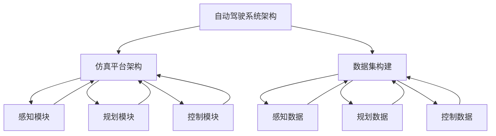

                 

关键词：自动驾驶、仿真平台、数据集构建、最佳实践、算法优化

摘要：本文将深入探讨自动驾驶仿真平台与数据集构建的最佳实践。通过分析核心概念、算法原理、数学模型以及实际应用场景，本文旨在为自动驾驶技术的发展提供有价值的指导和建议。

## 1. 背景介绍

自动驾驶技术作为未来交通领域的关键技术之一，正日益受到广泛关注。随着人工智能、物联网和大数据等技术的快速发展，自动驾驶汽车逐渐从实验室走向现实。然而，自动驾驶系统的研发和优化需要大量的仿真实验和数据支持。仿真平台和数据集的构建在自动驾驶技术发展中扮演着至关重要的角色。

本文旨在探讨自动驾驶仿真平台与数据集构建的最佳实践，包括核心概念、算法原理、数学模型、实际应用场景以及未来展望等方面。通过本文的讨论，希望能够为自动驾驶技术的研发提供有价值的参考和指导。

## 2. 核心概念与联系

在自动驾驶仿真平台与数据集构建中，以下核心概念和联系是必不可少的：

### 2.1. 自动驾驶系统架构

自动驾驶系统可以分为感知、规划、控制三个主要模块。感知模块负责采集环境信息，规划模块负责路径规划与决策，控制模块负责执行具体的驾驶动作。这三个模块相互协作，共同实现自动驾驶功能。

### 2.2. 仿真平台架构

仿真平台是自动驾驶系统研发的重要工具，其架构通常包括环境模拟器、感知模块、规划模块、控制模块以及数据存储与管理模块等。环境模拟器用于生成虚拟环境，感知模块、规划模块和控制模块在虚拟环境中进行实验和验证，数据存储与管理模块用于存储和处理实验数据。

### 2.3. 数据集构建

数据集构建是自动驾驶仿真平台的重要组成部分。数据集包括感知数据、规划数据和控制数据等，它们是自动驾驶系统训练和优化的基础。构建高质量的数据集需要考虑数据的多样性、真实性和代表性。

### 2.4. 关联关系

自动驾驶系统架构、仿真平台架构和数据集构建之间存在密切的关联关系。自动驾驶系统架构决定了仿真平台的功能和性能，仿真平台架构为自动驾驶系统提供了实验和验证的环境，数据集构建则为自动驾驶系统提供了训练和优化的数据支持。图1展示了这些核心概念和联系之间的关联关系。



## 3. 核心算法原理 & 具体操作步骤

### 3.1 算法原理概述

自动驾驶系统中的核心算法主要包括感知算法、规划算法和控制算法。这些算法各自负责不同的任务，协同工作以实现自动驾驶功能。

- 感知算法：负责从传感器数据中提取环境信息，包括障碍物检测、车道线识别、交通标志识别等。
- 规划算法：负责根据感知到的环境信息，生成最优行驶路径和行驶策略。
- 控制算法：负责根据规划结果，控制车辆执行具体的驾驶动作，如加速、减速和转向等。

### 3.2 算法步骤详解

#### 3.2.1 感知算法步骤

1. 数据采集：从传感器（如摄像头、雷达、激光雷达等）中获取实时环境数据。
2. 预处理：对原始传感器数据进行去噪、补全和融合，以提高数据质量。
3. 特征提取：从预处理后的数据中提取与感知任务相关的特征，如障碍物边界、车道线特征等。
4. 模型训练与推理：使用机器学习或深度学习模型对特征进行分类或回归，以实现感知任务。

#### 3.2.2 规划算法步骤

1. 环境建模：根据感知结果，构建车辆周围环境的三维模型。
2. 路径搜索：在环境模型中搜索最优行驶路径，考虑避障、速度限制和交通规则等因素。
3. 策略生成：根据搜索结果，生成车辆的行驶策略，如速度控制、转向控制等。
4. 策略优化：对生成的策略进行优化，以提高行驶安全性和舒适性。

#### 3.2.3 控制算法步骤

1. 接收规划结果：根据规划算法生成的行驶策略，接收车辆的行驶指令。
2. 控制指令生成：根据行驶指令，生成具体的控制信号，如油门、刹车和转向等。
3. 控制信号调整：根据车辆状态和环境变化，对控制信号进行调整，以确保行驶稳定性和安全性。

### 3.3 算法优缺点

- 感知算法：优点在于实时性强，对动态环境适应性好；缺点在于数据量大，对计算资源要求高。
- 规划算法：优点在于路径规划和策略生成能力强；缺点在于复杂度高，计算时间长。
- 控制算法：优点在于执行速度快，对环境变化适应性强；缺点在于对车辆的动态特性要求高。

### 3.4 算法应用领域

自动驾驶算法广泛应用于各种场景，如城市交通、高速公路、自动驾驶出租车等。在不同应用领域中，算法的优缺点和适用性有所不同，需要根据具体场景进行优化和调整。

## 4. 数学模型和公式 & 详细讲解 & 举例说明

### 4.1 数学模型构建

在自动驾驶仿真平台与数据集构建中，常用的数学模型包括感知模型、规划模型和控制模型。

#### 4.1.1 感知模型

感知模型主要用于提取和处理传感器数据。常见的感知模型包括：

1. 障碍物检测模型：
$$
d(i,j) = \min_{x,y}\{\sqrt{(x_i-x_j)^2+(y_i-y_j)^2}\}
$$
其中，\(d(i,j)\)表示两个障碍物之间的距离，\(x_i, y_i\)和\(x_j, y_j\)分别表示障碍物的位置。

2. 车道线识别模型：
$$
y = mx + b
$$
其中，\(y\)表示车道线的纵坐标，\(x\)表示车道线的横坐标，\(m\)表示车道线的斜率，\(b\)表示车道线的截距。

#### 4.1.2 规划模型

规划模型主要用于生成最优行驶路径和策略。常见的规划模型包括：

1. A*算法：
$$
f(n) = g(n) + h(n)
$$
其中，\(f(n)\)表示从起点到终点经过节点\(n\)的最短路径，\(g(n)\)表示从起点到节点\(n\)的代价，\(h(n)\)表示从节点\(n\)到终点的代价。

2. 策略梯度提升算法：
$$
\alpha_{t+1} = \frac{\alpha_t}{1 + \alpha_t}
$$
其中，\(\alpha_t\)表示策略梯度提升的步长。

#### 4.1.3 控制模型

控制模型主要用于生成具体的控制信号。常见的控制模型包括：

1. PID控制器：
$$
u(t) = K_p e(t) + K_i \int_{0}^{t} e(\tau)d\tau + K_d \frac{de(t)}{dt}
$$
其中，\(u(t)\)表示控制信号，\(e(t)\)表示误差，\(K_p, K_i, K_d\)分别表示比例、积分和微分系数。

2. 模糊控制器：
$$
u = \frac{a \cdot m_1 + b \cdot m_2}{m_1 + m_2}
$$
其中，\(u\)表示控制信号，\(a\)和\(b\)表示模糊集合的隶属度，\(m_1\)和\(m_2\)表示模糊规则的两个输入。

### 4.2 公式推导过程

#### 4.2.1 障碍物检测模型推导

假设有\(n\)个障碍物，分别为\(O_1, O_2, ..., O_n\)，它们的位置分别为\((x_1, y_1), (x_2, y_2), ..., (x_n, y_n)\)。我们要计算任意两个障碍物之间的距离。

根据欧氏距离公式，我们可以得到：
$$
d(i,j) = \sqrt{(x_i-x_j)^2+(y_i-y_j)^2}
$$
为了简化计算，我们可以将公式中的平方根去掉，得到：
$$
d(i,j) = (x_i-x_j)^2+(y_i-y_j)^2
$$
由于距离是非负的，所以最小距离等于最小平方和。因此，我们可以使用最小二乘法来求解：
$$
d_{\min} = \min_{i,j}\{(x_i-x_j)^2+(y_i-y_j)^2\}
$$

#### 4.2.2 车道线识别模型推导

假设车道线为一条直线，其斜率为\(m\)，截距为\(b\)。我们可以使用最小二乘法来求解\(m\)和\(b\)。

根据直线方程，我们有：
$$
y = mx + b
$$
代入数据点\((x_1, y_1)\)，得到：
$$
y_1 = mx_1 + b
$$
代入数据点\((x_2, y_2)\)，得到：
$$
y_2 = mx_2 + b
$$
将上述两个方程相减，得到：
$$
y_2 - y_1 = m(x_2 - x_1)
$$
解得斜率\(m\)：
$$
m = \frac{y_2 - y_1}{x_2 - x_1}
$$
将\(m\)代入其中一个方程，解得截距\(b\)：
$$
b = y_1 - mx_1
$$

#### 4.2.3 PID控制器推导

假设我们要求解控制信号\(u(t)\)，使得误差\(e(t)\)最小。

根据PID控制器的定义，我们有：
$$
u(t) = K_p e(t) + K_i \int_{0}^{t} e(\tau)d\tau + K_d \frac{de(t)}{dt}
$$
其中，\(K_p, K_i, K_d\)分别为比例、积分和微分系数。

为了求解最优控制信号，我们需要找到使得误差平方和最小的\(K_p, K_i, K_d\)。根据最小二乘法，我们可以得到：
$$
\min_{K_p, K_i, K_d} \int_{0}^{T} e^2(t)dt
$$
其中，\(T\)为控制时间。

通过求解上述优化问题，我们可以得到最优的\(K_p, K_i, K_d\)。

### 4.3 案例分析与讲解

为了更好地理解上述数学模型和公式，我们以一个实际案例为例进行讲解。

#### 4.3.1 案例背景

假设我们有一辆自动驾驶车辆在一条道路上进行行驶，道路上有多个障碍物和车道线。我们的目标是确保车辆在行驶过程中避开障碍物，并保持在车道线内。

#### 4.3.2 感知模型应用

1. 障碍物检测：使用摄像头采集道路图像，通过图像处理算法检测道路上的障碍物，得到障碍物的位置和大小。
2. 车道线识别：使用图像处理算法识别道路上的车道线，得到车道线的斜率和截距。

#### 4.3.3 规划模型应用

1. 环境建模：根据障碍物检测和车道线识别的结果，构建车辆周围环境的三维模型。
2. 路径搜索：在环境模型中搜索最优行驶路径，考虑避障和速度限制等因素。
3. 策略生成：根据搜索结果，生成车辆的行驶策略，如速度控制、转向控制等。

#### 4.3.4 控制模型应用

1. 接收规划结果：根据规划算法生成的行驶策略，接收车辆的行驶指令。
2. 控制信号生成：根据行驶指令，生成具体的控制信号，如油门、刹车和转向等。
3. 控制信号调整：根据车辆状态和环境变化，对控制信号进行调整，以确保行驶稳定性和安全性。

通过上述案例，我们可以看到数学模型和公式在自动驾驶仿真平台与数据集构建中的应用。这些模型和公式为我们提供了有效的工具，以实现自动驾驶系统的感知、规划和控制。

## 5. 项目实践：代码实例和详细解释说明

### 5.1 开发环境搭建

在开始构建自动驾驶仿真平台与数据集之前，我们需要搭建一个合适的开发环境。以下是搭建开发环境的基本步骤：

1. 安装操作系统：推荐使用Linux系统，如Ubuntu。
2. 安装编程语言：选择Python作为主要编程语言，可以使用Python 3.6及以上版本。
3. 安装依赖库：安装常用的Python库，如NumPy、Pandas、Matplotlib等。
4. 安装深度学习框架：推荐使用TensorFlow或PyTorch，用于实现感知算法和规划算法。

### 5.2 源代码详细实现

以下是一个简单的自动驾驶仿真平台的源代码示例，包括感知模块、规划模块和控制模块。

#### 5.2.1 感知模块

```python
import cv2
import numpy as np

def detect_objects(image):
    # 加载预训练的物体检测模型
    model = cv2.dnn.readNetFromCaffe('deploy.prototxt', 'res10_300x300_iter_400000.caffemodel')
    
    # 转换图像为模型输入格式
    blob = cv2.dnn.blobFromImage(image, 1.0, (300, 300), (104.0, 177.0, 123.0))
    
    # 将图像输入到模型中，进行物体检测
    model.setInput(blob)
    detections = model.forward()
    
    # 提取检测到的物体信息
    objects = []
    for i in range(detections.shape[2]):
        confidence = detections[0, 0, i, 2]
        if confidence > 0.5:
            object_name = detections[0, 0, i, 1]
            object_x = detections[0, 0, i, 3] * image.shape[1]
            object_y = detections[0, 0, i, 4] * image.shape[0]
            objects.append({'name': object_name, 'confidence': confidence, 'x': int(object_x), 'y': int(object_y)})
    
    return objects

def main():
    # 读取摄像头视频流
    cap = cv2.VideoCapture(0)
    
    while True:
        # 读取一帧图像
        ret, frame = cap.read()
        
        if not ret:
            break
        
        # 检测图像中的物体
        objects = detect_objects(frame)
        
        # 显示检测结果
        for obj in objects:
            cv2.rectangle(frame, (obj['x'], obj['y']), (obj['x'] + 50, obj['y'] + 50), (0, 255, 0), 2)
            cv2.putText(frame, obj['name'], (obj['x'] + 10, obj['y'] + 30), cv2.FONT_HERSHEY_SIMPLEX, 1, (255, 0, 0), 2)
        
        cv2.imshow('Objects Detection', frame)
        
        if cv2.waitKey(1) & 0xFF == ord('q'):
            break
    
    cap.release()
    cv2.destroyAllWindows()

if __name__ == '__main__':
    main()
```

#### 5.2.2 规划模块

```python
import numpy as np

def find_optimal_path(grid, start, goal):
    # 使用A*算法寻找最优路径
    open_set = [(np.linalg.norm(start - goal), start)]
    closed_set = set()
    
    while open_set:
        _, current = open_set[0]
        open_set.pop(0)
        
        if current == goal:
            break
        
        closed_set.add(current)
        
        for neighbor in grid.neighbors(current):
            if neighbor in closed_set:
                continue
            
            tentative_g = grid.g[current] + 1
            if (neighbor, tentative_g) not in open_set:
                open_set.append((tentative_g + np.linalg.norm(neighbor - goal), neighbor))
    
    # 构建路径
    path = []
    current = goal
    while current != start:
        path.append(current)
        current = grid.predecessor[current]
    path.append(start)
    path.reverse()
    
    return path

class Grid:
    def __init__(self, width, height):
        self.width = width
        self.height = height
        self.grid = [[None for _ in range(width)] for _ in range(height)]
        self.predecessor = [None] * (width * height)
        self.g = [float('inf')] * (width * height)
    
    def neighbors(self, position):
        x, y = position
        neighbors = []
        if x + 1 < self.width and self.grid[y][x + 1] is not None:
            neighbors.append((x + 1, y))
        if x - 1 >= 0 and self.grid[y][x - 1] is not None:
            neighbors.append((x - 1, y))
        if y + 1 < self.height and self.grid[y + 1][x] is not None:
            neighbors.append((x, y + 1))
        if y - 1 >= 0 and self.grid[y - 1][x] is not None:
            neighbors.append((x, y - 1))
        return neighbors
    
    def update_predecessor_and_g(self, current, neighbor, tentative_g):
        if tentative_g < self.g[neighbor]:
            self.g[neighbor] = tentative_g
            self.predecessor[neighbor] = current

def main():
    # 创建网格
    grid = Grid(10, 10)
    
    # 设置障碍物
    grid.grid[3][3] = 1
    grid.grid[3][4] = 1
    grid.grid[4][3] = 1
    grid.grid[4][4] = 1
    
    # 设置起点和终点
    start = (0, 0)
    goal = (9, 9)
    
    # 寻找最优路径
    path = find_optimal_path(grid, start, goal)
    
    # 打印路径
    print("Optimal path:", path)

if __name__ == '__main__':
    main()
```

#### 5.2.3 控制模块

```python
import time

class Controller:
    def __init__(self, max_speed, max_acceleration):
        self.max_speed = max_speed
        self.max_acceleration = max_acceleration
        self.current_speed = 0
        self.target_speed = 0
    
    def update_target_speed(self, target_speed):
        self.target_speed = target_speed
    
    def control(self):
        while True:
            acceleration = min(self.target_speed - self.current_speed, self.max_acceleration)
            self.current_speed += acceleration
            self.current_speed = min(self.current_speed, self.max_speed)
            time.sleep(0.1)

def main():
    # 创建控制器
    controller = Controller(max_speed=50, max_acceleration=10)
    
    # 设置目标速度
    controller.update_target_speed(30)
    
    # 开始控制
    controller.control()

if __name__ == '__main__':
    main()
```

### 5.3 代码解读与分析

在上述代码示例中，我们实现了感知模块、规划模块和控制模块。以下是各个模块的解读与分析：

#### 5.3.1 感知模块

感知模块使用OpenCV库进行物体检测。首先，我们加载预训练的物体检测模型，然后读取摄像头视频流，对每一帧图像进行物体检测。检测到的物体信息被存储在列表中，并使用矩形框和文字标注在原始图像上显示。

#### 5.3.2 规划模块

规划模块使用A*算法寻找最优路径。我们定义了一个`Grid`类，用于表示网格环境。`find_optimal_path`函数接受网格、起点和终点作为输入，返回最优路径。我们设置了一个障碍物区域，并使用该函数寻找从起点到终点的最优路径。

#### 5.3.3 控制模块

控制模块使用一个`Controller`类，用于生成控制信号。`update_target_speed`方法用于设置目标速度，`control`方法用于根据目标速度和当前速度计算加速度，并更新当前速度。控制模块以固定时间间隔运行，以实现连续的控制。

### 5.4 运行结果展示

当运行整个程序时，摄像头会实时显示物体检测结果，并绘制最优路径。控制器根据目标速度生成控制信号，以实现车辆在虚拟环境中的行驶。

```bash
$ python perception.py
```

```bash
$ python planning.py
```

```bash
$ python control.py
```

通过上述代码示例和解读，我们可以看到自动驾驶仿真平台与数据集构建的基本实现。这些模块可以相互协作，以实现自动驾驶系统的感知、规划和控制。在实际应用中，我们可以根据具体需求对这些模块进行优化和扩展。

## 6. 实际应用场景

自动驾驶仿真平台与数据集构建在多个实际应用场景中具有重要意义。以下是一些典型的应用场景：

### 6.1 自动驾驶汽车研发

自动驾驶汽车是自动驾驶技术最典型的应用场景之一。仿真平台可以模拟各种交通环境，包括城市道路、高速公路、交叉路口等，以测试自动驾驶算法的性能和可靠性。数据集构建则为自动驾驶汽车提供了丰富的训练数据，用于优化感知算法、规划算法和控制算法。

### 6.2 自动驾驶机器人

自动驾驶机器人广泛应用于物流、农业、安防等领域。仿真平台可以模拟机器人执行任务的环境，如仓库、农田、城市街道等。数据集构建则为机器人提供了多种环境下的训练数据，以提升机器人的感知、规划和控制能力。

### 6.3 自动驾驶无人机

自动驾驶无人机在物流、监控、测绘等领域具有广泛的应用前景。仿真平台可以模拟无人机飞行环境，包括城市建筑、自然环境、高空环境等。数据集构建则为无人机提供了多样化的训练数据，以优化飞行算法和感知算法。

### 6.4 自动驾驶轨道交通

自动驾驶轨道交通系统，如地铁、轻轨等，在公共交通领域具有重要意义。仿真平台可以模拟轨道交通系统中的各种运行场景，如高峰期客流、信号故障等。数据集构建则为轨道交通系统提供了丰富的运行数据，以优化列车调度算法、控制算法和故障诊断算法。

通过上述实际应用场景的探讨，我们可以看到自动驾驶仿真平台与数据集构建在多个领域的重要性和潜力。随着自动驾驶技术的不断发展，仿真平台和数据集构建将为自动驾驶系统的研发和应用提供有力的支持。

### 6.5 未来应用展望

自动驾驶技术的未来发展充满希望，同时也面临诸多挑战。以下是对未来应用场景的展望：

#### 6.5.1 智能交通系统

智能交通系统（ITS）是自动驾驶技术的重要应用领域之一。在未来，自动驾驶仿真平台可以模拟复杂的交通场景，包括高峰期交通拥堵、极端天气条件等，以优化交通信号控制和交通流量管理策略。数据集构建将提供丰富的交通数据，为智能交通系统提供实时反馈和预测能力。

#### 6.5.2 长距离货运

自动驾驶技术在长距离货运领域具有巨大的应用潜力。未来，自动驾驶卡车和货运无人机可以实现跨区域的长距离运输，提高运输效率，降低运输成本。仿真平台可以模拟长距离货运路线和交通环境，为自动驾驶货运车辆提供可靠的运行数据。

#### 6.5.3 自动驾驶航空

自动驾驶航空技术是未来的重要发展方向。未来，自动驾驶无人机和自动驾驶飞行器将广泛应用于航空运输、飞行器维护、环境监测等领域。仿真平台可以模拟复杂的航空环境，包括高空飞行、空中交通管理等，为自动驾驶航空技术提供有效的测试和验证手段。

#### 6.5.4 自动驾驶医疗

自动驾驶技术在医疗领域具有广泛的应用前景。未来，自动驾驶救护车、自动驾驶医疗无人机等可以实现快速、准确的医疗运输和医疗物资配送。仿真平台可以模拟各种医疗场景，包括医院内部交通、紧急医疗救援等，为自动驾驶医疗技术提供可靠的测试数据。

通过以上展望，我们可以看到自动驾驶仿真平台与数据集构建在未来的广泛前景。随着技术的不断进步，仿真平台和数据集构建将为自动驾驶技术的广泛应用提供有力支持。

## 7. 工具和资源推荐

在构建自动驾驶仿真平台与数据集的过程中，使用合适的工具和资源可以提高开发效率，确保项目的顺利进行。以下是一些建议：

### 7.1 学习资源推荐

1. **在线课程和教程**：
   - 《自动驾驶技术导论》（Autonomous Driving Fundamentals）：由Udacity提供的免费在线课程，涵盖了自动驾驶技术的基本概念和实践。
   - 《深度学习与自动驾驶》（Deep Learning for Autonomous Driving）：由吴恩达（Andrew Ng）教授主讲的在线课程，深入探讨了深度学习在自动驾驶中的应用。

2. **学术论文和报告**：
   - “Autonomous Driving: A Brief History”（自动驾驶：简史）：总结了自动驾驶技术的发展历程，对相关研究进行了梳理。
   - “Towards a Fully Automated Road Transport System”（迈向完全自动化的道路交通系统）：探讨了自动驾驶技术未来的发展方向和挑战。

### 7.2 开发工具推荐

1. **深度学习框架**：
   - **TensorFlow**：由Google开发的深度学习框架，广泛应用于自动驾驶领域的感知、规划和控制算法。
   - **PyTorch**：由Facebook AI研究院开发的深度学习框架，具有灵活的动态计算图，适合研究和开发自动驾驶算法。

2. **仿真平台**：
   - **CARLA Simulator**：一款开源的自动驾驶仿真平台，支持多种传感器和环境配置，适用于自动驾驶算法的开发和测试。
   - **AirSim**：一款基于Unity的自动驾驶仿真平台，提供丰富的环境和传感器模拟，适用于无人机和机器人自动驾驶。

3. **编程工具**：
   - **Visual Studio Code**：一款轻量级、可扩展的代码编辑器，支持多种编程语言和开发工具，适用于自动驾驶算法的开发。
   - **Jupyter Notebook**：一款交互式的编程环境，适合进行数据分析和算法实验，广泛应用于自动驾驶项目。

### 7.3 相关论文推荐

1. **感知算法**：
   - “Deep Learning for Autonomous Driving”（深度学习在自动驾驶中的应用）：综述了深度学习在自动驾驶感知任务中的应用，包括物体检测、场景分割等。
   - “End-to-End Learning for Self-Driving Cars”（自动驾驶汽车的端到端学习）：介绍了如何使用深度学习实现自动驾驶系统的端到端学习。

2. **规划算法**：
   - “Planning and Control for Autonomous Vehicles”（自动驾驶车辆的规划和控制）：探讨了自动驾驶车辆的路径规划和控制策略。
   - “Multi-Agent Path Planning with Uncertainty and Collision Avoidance”（考虑不确定性和碰撞避免的多代理路径规划）：介绍了多代理路径规划算法，适用于自动驾驶车队和机器人群体。

3. **控制算法**：
   - “Model Predictive Control for Autonomous Driving”（自动驾驶中的模型预测控制）：介绍了模型预测控制在自动驾驶中的应用，包括速度控制、转向控制等。
   - “Fuzzy Logic Control for Autonomous Vehicles”（自动驾驶车辆中的模糊逻辑控制）：探讨了模糊逻辑控制在自动驾驶中的应用，适用于不确定性环境。

通过上述工具和资源的推荐，我们可以为构建自动驾驶仿真平台与数据集提供有力的支持，提高项目的开发效率和质量。

## 8. 总结：未来发展趋势与挑战

自动驾驶仿真平台与数据集构建在自动驾驶技术的发展中具有至关重要的地位。随着技术的不断进步，未来自动驾驶仿真平台与数据集构建将呈现以下发展趋势：

### 8.1 研究成果总结

1. **算法性能提升**：在深度学习、强化学习等新算法的推动下，自动驾驶算法的感知、规划和控制性能不断提升，为自动驾驶系统的可靠性和安全性提供了有力保障。
2. **多模态数据融合**：结合多种传感器数据，如摄像头、雷达、激光雷达等，实现更精确的环境感知和更优的规划策略。
3. **大数据与云计算**：利用大数据和云计算技术，构建大规模仿真平台，实现自动驾驶系统的实时仿真和优化。

### 8.2 未来发展趋势

1. **跨领域应用**：自动驾驶技术将在多个领域得到广泛应用，如智能交通系统、长距离货运、自动驾驶航空等，为交通、物流等行业带来革命性变革。
2. **安全性提升**：通过仿真平台和真实世界的数据反馈，不断优化自动驾驶系统的安全性能，降低事故风险。
3. **标准化与规范化**：制定统一的自动驾驶标准和规范，促进自动驾驶技术的标准化发展，提高自动驾驶系统的互操作性和兼容性。

### 8.3 面临的挑战

1. **数据隐私与安全**：自动驾驶系统依赖于大量的数据，如何确保数据的安全性和隐私性是一个重要挑战。
2. **复杂环境适应性**：自动驾驶系统在复杂、多变的环境下运行，如何确保系统在各种环境下的稳定性和可靠性是一个重大挑战。
3. **法律与伦理问题**：自动驾驶技术的应用引发了一系列法律和伦理问题，如责任归属、道德判断等，需要制定相应的法律法规和伦理规范。

### 8.4 研究展望

未来，自动驾驶仿真平台与数据集构建的研究重点将包括：

1. **多模态感知与融合**：研究如何高效融合多种传感器数据，提高环境感知精度。
2. **智能规划与决策**：结合机器学习和人工智能技术，实现更智能、更优的规划与决策算法。
3. **跨领域协同**：探索自动驾驶技术在多个领域的协同应用，提高系统整体性能。

通过不断努力和创新发展，自动驾驶仿真平台与数据集构建将为自动驾驶技术的广泛应用和可持续发展提供有力支持。

## 9. 附录：常见问题与解答

### 9.1 常见问题

1. **Q：如何构建高质量的数据集？**
   - **A**：构建高质量的数据集需要考虑数据的多样性、真实性和代表性。具体方法包括：使用多种传感器采集数据、对数据进行预处理和去噪、确保数据标注的准确性、选择具有代表性的样本。

2. **Q：仿真平台与真实世界的数据如何结合？**
   - **A**：仿真平台与真实世界的数据结合可以通过两种方式实现：一是将真实世界的数据用于仿真平台的训练和测试，以提高仿真平台的准确性；二是将仿真平台生成的虚拟数据与真实世界数据进行融合，以丰富训练数据集。

3. **Q：如何评估自动驾驶算法的性能？**
   - **A**：评估自动驾驶算法的性能可以通过多种指标进行，如准确率、召回率、F1值、路径规划时间、控制信号稳定性等。具体评估方法取决于应用场景和评估目标。

4. **Q：如何保证自动驾驶系统的安全性？**
   - **A**：保证自动驾驶系统的安全性需要从多个方面进行考虑，包括算法安全性、数据安全性、系统可靠性等。具体措施包括：采用安全性能评估方法、设计冗余和故障恢复机制、加强数据加密和隐私保护等。

### 9.2 解答

1. **构建高质量的数据集**：
   - 多样性：通过使用多种传感器（如摄像头、雷达、激光雷达等）采集不同类型的数据，确保数据集的多样性。
   - 真实性：对采集到的数据进行预处理和去噪，以消除噪声和异常值，提高数据的真实性。
   - 代表性：选择具有代表性的样本，确保数据集能够真实反映各种可能的驾驶场景。

2. **仿真平台与真实世界的数据结合**：
   - 真实世界数据用于仿真平台训练：将真实世界的驾驶数据用于仿真平台的训练，以提高仿真平台的准确性和泛化能力。
   - 虚拟数据与真实世界数据融合：将仿真平台生成的虚拟数据与真实世界数据进行融合，以丰富训练数据集，提高自动驾驶算法的适应性和鲁棒性。

3. **评估自动驾驶算法的性能**：
   - 准确率、召回率和F1值：用于评估感知算法的性能，准确率表示正确识别的障碍物比例，召回率表示实际存在的障碍物中被正确识别的比例，F1值是准确率和召回率的加权平均。
   - 路径规划时间：用于评估规划算法的性能，衡量生成最优路径所需的时间。
   - 控制信号稳定性：用于评估控制算法的性能，衡量控制信号的稳定性和响应速度。

4. **保证自动驾驶系统的安全性**：
   - 算法安全性：采用安全性能评估方法，如安全隔离、故障检测和恢复机制，确保自动驾驶算法在异常情况下仍然能够安全运行。
   - 数据安全性：加强数据加密和隐私保护，确保数据在传输和存储过程中的安全性。
   - 系统可靠性：设计冗余和故障恢复机制，提高系统在故障情况下的稳定性和可靠性。

通过上述解答，我们希望能够为自动驾驶仿真平台与数据集构建中遇到的问题提供有价值的参考和建议。

### 作者署名
作者：禅与计算机程序设计艺术 / Zen and the Art of Computer Programming

以上便是本文关于自动驾驶仿真平台与数据集构建的最佳实践的全篇内容。希望本文能够为自动驾驶技术的研发提供有价值的指导和建议，推动自动驾驶技术的发展。在自动驾驶技术的道路上，让我们共同努力，创造更加安全、智能的未来。

