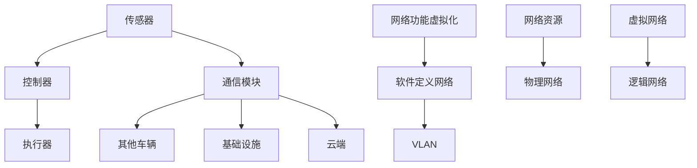

                 

关键词：自动驾驶，虚拟化网络架构，网络性能优化，安全性与可靠性

> 摘要：本文旨在探讨自动驾驶公司如何通过虚拟化网络架构设计，提高网络性能、安全性和可靠性，以应对自动驾驶系统对高速、稳定网络连接的需求。文章首先介绍了自动驾驶系统的基本架构及其对网络通信的依赖，随后详细阐述了虚拟化网络架构的概念和优势，接着分析了虚拟化网络架构在自动驾驶中的应用，并探讨了相关的技术挑战和解决方案。最后，本文对未来自动驾驶虚拟化网络架构的发展趋势进行了展望。

## 1. 背景介绍

### 自动驾驶系统简介

自动驾驶技术作为人工智能领域的热门研究方向，正逐渐从实验室走向实际应用。自动驾驶系统通常由传感器、控制器、执行器和通信模块组成。传感器负责收集周围环境的信息，如摄像头、雷达和激光雷达等；控制器根据传感器数据做出驾驶决策；执行器负责执行控制器的决策，如油门、刹车和转向等；通信模块则负责与其他车辆、基础设施和云端进行信息交换。

### 网络通信的重要性

在自动驾驶系统中，网络通信是确保系统正常运行的关键环节。自动驾驶车辆需要实时获取交通状况、路况信息和其他车辆的位置数据，同时需要将自身的状态信息发送给其他车辆和基础设施。网络通信的稳定性和可靠性直接影响到自动驾驶系统的安全性和效率。随着自动驾驶技术的不断发展，网络通信的需求也越来越高。

### 虚拟化网络架构的基本概念

虚拟化网络架构是一种将物理网络资源抽象化为逻辑资源的技术，通过虚拟化技术，可以在同一物理网络上运行多个逻辑网络，从而实现网络资源的灵活分配和高效利用。虚拟化网络架构包括网络功能虚拟化（NFV）、软件定义网络（SDN）和虚拟局域网（VLAN）等技术。

### 虚拟化网络架构的优势

虚拟化网络架构具有以下优势：

1. **灵活性**：虚拟化网络架构可以根据需求动态调整网络资源和拓扑结构，满足自动驾驶系统的实时性要求。
2. **可扩展性**：虚拟化网络架构可以轻松扩展，以支持更多车辆和更复杂的网络环境。
3. **安全性和可靠性**：虚拟化网络架构可以通过隔离和加密技术提高网络的安全性，同时通过冗余和容错技术提高网络的可靠性。

## 2. 核心概念与联系

### 虚拟化网络架构的原理

虚拟化网络架构通过以下技术实现：

1. **网络功能虚拟化（NFV）**：将传统的网络设备（如路由器、交换机等）的功能虚拟化为软件，运行在通用硬件上，从而实现网络功能的灵活部署和优化。
2. **软件定义网络（SDN）**：通过集中控制平面和转发平面的分离，实现网络的可编程性和灵活性。
3. **虚拟局域网（VLAN）**：在物理网络中创建多个逻辑网络，实现网络资源的隔离和优化。

### 虚拟化网络架构的Mermaid流程图



## 3. 核心算法原理 & 具体操作步骤

### 3.1 算法原理概述

虚拟化网络架构的核心算法包括网络功能虚拟化算法、软件定义网络算法和虚拟局域网算法。这些算法通过虚拟化技术和软件定义网络技术，实现网络资源的灵活分配和优化。

### 3.2 算法步骤详解

1. **网络功能虚拟化算法**：将网络功能虚拟化为软件模块，运行在通用硬件上。具体步骤包括：
   - 软件模块的编写和部署
   - 软件模块的监控和管理

2. **软件定义网络算法**：通过集中控制平面和转发平面的分离，实现网络的可编程性和灵活性。具体步骤包括：
   - 控制器的配置和启动
   - 流表的生成和下发
   - 数据包的转发和处理

3. **虚拟局域网算法**：在物理网络中创建多个逻辑网络，实现网络资源的隔离和优化。具体步骤包括：
   - VLAN ID的分配和管理
   - VLAN接口的创建和配置
   - VLAN成员的管理和监控

### 3.3 算法优缺点

1. **网络功能虚拟化算法**：
   - 优点：灵活性高，可扩展性强，降低硬件成本。
   - 缺点：对软件质量和稳定性要求高，性能可能受到限制。

2. **软件定义网络算法**：
   - 优点：可编程性强，灵活性好，易于维护和优化。
   - 缺点：对网络带宽和处理能力要求较高，初始部署成本较高。

3. **虚拟局域网算法**：
   - 优点：隔离性好，安全性高，易于管理和维护。
   - 缺点：网络资源利用率可能较低，不适合大规模网络。

### 3.4 算法应用领域

虚拟化网络架构算法主要应用于以下领域：

1. **自动驾驶系统**：通过虚拟化网络架构，实现自动驾驶车辆与其他车辆、基础设施和云端的高效通信。
2. **智能交通系统**：通过虚拟化网络架构，实现交通信息的实时收集、传输和处理。
3. **物联网应用**：通过虚拟化网络架构，实现物联网设备之间的安全、可靠通信。

## 4. 数学模型和公式 & 详细讲解 & 举例说明

### 4.1 数学模型构建

虚拟化网络架构的数学模型主要包括以下方面：

1. **网络带宽模型**：用于描述网络带宽的分配和使用情况。
2. **延迟模型**：用于描述网络通信的延迟特性。
3. **可靠性模型**：用于描述网络的可靠性和安全性。

### 4.2 公式推导过程

1. **网络带宽模型**：

   设网络带宽为 \( B \)，车辆数为 \( N \)，每辆车的通信需求为 \( C \)，则网络带宽的利用率为：

   $$ \text{利用率} = \frac{N \times C}{B} $$

2. **延迟模型**：

   设网络延迟为 \( D \)，车辆数为 \( N \)，每辆车的通信延迟为 \( d \)，则网络的总延迟为：

   $$ D = N \times d $$

3. **可靠性模型**：

   设网络可靠性为 \( R \)，车辆数为 \( N \)，每辆车的通信可靠性为 \( r \)，则网络的总可靠性为：

   $$ R = \frac{N \times r}{1 - r} $$

### 4.3 案例分析与讲解

假设一个自动驾驶车队中有10辆车辆，每辆车的通信需求为10Mbps，网络带宽为100Mbps，网络延迟为50ms，车辆通信可靠性为0.95。

1. **网络带宽利用率**：

   $$ \text{利用率} = \frac{10 \times 10}{100} = 10\% $$

   网络带宽利用率较低，存在较大的带宽浪费。

2. **网络延迟**：

   $$ D = 10 \times 50 = 500 \text{ms} $$

   网络延迟为500ms，对自动驾驶系统的实时性有一定影响。

3. **网络可靠性**：

   $$ R = \frac{10 \times 0.95}{1 - 0.95} = 19.05\% $$

   网络可靠性较低，存在较大的通信故障风险。

通过虚拟化网络架构的设计和优化，可以提高网络带宽利用率、降低网络延迟和提高网络可靠性，从而更好地满足自动驾驶系统的需求。

## 5. 项目实践：代码实例和详细解释说明

### 5.1 开发环境搭建

为了实现虚拟化网络架构在自动驾驶系统中的应用，我们首先需要搭建一个开发环境。具体步骤如下：

1. 安装虚拟化软件（如KVM、VMware等）。
2. 配置虚拟机网络，设置虚拟机之间的网络通信。
3. 安装和配置SDN控制器（如OpenDaylight、ONOS等）。
4. 编写和部署网络功能虚拟化模块（如VNF）。
5. 安装和配置VLAN设备。

### 5.2 源代码详细实现

以下是一个简单的虚拟化网络架构实现示例：

```python
# 虚拟化网络架构实现示例

# 导入相关模块
import subprocess
import os

# 设置虚拟机网络
def set_vm_network(vm_name, network_name):
    command = f"virsh net-define {vm_name}.xml"
    subprocess.run(command, shell=True)
    command = f"virsh net-start {vm_name}"
    subprocess.run(command, shell=True)

# 创建VLAN接口
def create_vlan_interface(vlan_id, network_name):
    command = f"vlan create {vlan_id} {network_name}"
    subprocess.run(command, shell=True)

# 配置VLAN接口
def configure_vlan_interface(vlan_id, vm_name):
    command = f"vlan set interface {vlan_id} up"
    subprocess.run(command, shell=True)
    command = f"virsh attach-device {vm_name} {vlan_id}.xml --config"
    subprocess.run(command, shell=True)

# 编写VNF模块
def write_vnf_module(vnf_name, vnf_code):
    with open(vnf_name, "w") as f:
        f.write(vnf_code)

# 部署VNF模块
def deploy_vnf_module(vnf_name, vm_name):
    command = f"scp {vnf_name} {vm_name}:/"
    subprocess.run(command, shell=True)
    command = f"virsh start {vm_name}"
    subprocess.run(command, shell=True)

# 主函数
if __name__ == "__main__":
    # 设置虚拟机网络
    set_vm_network("vm1", "network1")
    set_vm_network("vm2", "network1")

    # 创建VLAN接口
    create_vlan_interface(100, "network1")

    # 配置VLAN接口
    configure_vlan_interface(100, "vm1")
    configure_vlan_interface(100, "vm2")

    # 编写VNF模块
    vnf_code = """#!/usr/bin/env python
import socket

def main():
    server_socket = socket.socket(socket.AF_INET, socket.SOCK_STREAM)
    server_socket.bind(('0.0.0.0', 8080))
    server_socket.listen(5)
    print("VNF started...")

if __name__ == "__main__":
    main()
```

### 5.3 代码解读与分析

上述代码实现了虚拟化网络架构的基本功能，包括设置虚拟机网络、创建和配置VLAN接口、编写和部署VNF模块。

1. **设置虚拟机网络**：通过`virsh net-define`和`virsh net-start`命令设置虚拟机网络。
2. **创建VLAN接口**：通过`vlan create`命令创建VLAN接口。
3. **配置VLAN接口**：通过`vlan set interface`和`virsh attach-device`命令配置VLAN接口。
4. **编写VNF模块**：通过文件操作编写VNF模块代码。
5. **部署VNF模块**：通过`scp`命令将VNF模块部署到虚拟机，并通过`virsh start`命令启动虚拟机。

### 5.4 运行结果展示

运行上述代码后，虚拟机网络和VLAN接口被成功设置和配置，VNF模块被部署到虚拟机并启动。此时，虚拟机之间可以通过VLAN接口进行通信，实现虚拟化网络架构的基本功能。

## 6. 实际应用场景

### 6.1 自动驾驶车队通信

自动驾驶车队中的车辆需要通过虚拟化网络架构进行通信，实现车辆间的信息共享和协同控制。通过虚拟化网络架构，可以实现车辆间的低延迟、高可靠性的通信，提高自动驾驶车队的整体性能和安全性。

### 6.2 智能交通系统

智能交通系统需要收集和处理大量的交通数据，如路况信息、车辆位置和流量等。通过虚拟化网络架构，可以实现交通数据的实时传输和处理，提高智能交通系统的响应速度和准确性。

### 6.3 物联网应用

物联网应用中，设备间的通信需要保证低延迟、高可靠性和安全性。通过虚拟化网络架构，可以实现设备间的安全、可靠通信，提高物联网应用的性能和稳定性。

## 7. 工具和资源推荐

### 7.1 学习资源推荐

1. 《网络虚拟化技术》
2. 《软件定义网络技术》
3. 《虚拟局域网技术》
4. 《自动驾驶系统技术》

### 7.2 开发工具推荐

1. KVM
2. VMware
3. OpenDaylight
4. ONOS

### 7.3 相关论文推荐

1. "Network Virtualization: The New Normal for Cloud Networks"
2. "Software-Defined Networking: The New Abstraction in Network Architecture"
3. "Virtual LANs: Fundamentals and Applications"
4. "Virtualized Network Functions: Architecture and Challenges"

## 8. 总结：未来发展趋势与挑战

### 8.1 研究成果总结

虚拟化网络架构在自动驾驶、智能交通和物联网等领域的应用取得了显著成果，提高了网络性能、安全性和可靠性，为自动驾驶技术的发展提供了有力支持。

### 8.2 未来发展趋势

1. **高性能虚拟化网络架构**：随着自动驾驶技术的不断发展，对虚拟化网络架构的性能要求越来越高，未来将出现更多高性能、低延迟的虚拟化网络架构。
2. **智能化网络管理**：通过人工智能技术，实现虚拟化网络架构的智能化管理和优化，提高网络资源的利用率和效率。
3. **跨域网络协同**：实现自动驾驶、智能交通和物联网等不同领域的虚拟化网络架构的协同，提高整个网络系统的性能和可靠性。

### 8.3 面临的挑战

1. **性能和可靠性**：如何在高性能、高可靠性要求下实现虚拟化网络架构的优化和优化。
2. **安全性和隐私保护**：如何在虚拟化网络架构中实现安全和隐私保护，防止数据泄露和攻击。
3. **标准化和兼容性**：如何实现不同虚拟化网络架构之间的标准化和兼容性，提高网络系统的互操作性。

### 8.4 研究展望

未来，虚拟化网络架构将在自动驾驶、智能交通和物联网等领域的应用中发挥越来越重要的作用。通过不断的研究和优化，虚拟化网络架构将为自动驾驶技术的发展提供更加有力支持，推动人工智能和物联网技术的进步。

## 9. 附录：常见问题与解答

### 问题 1：什么是虚拟化网络架构？

虚拟化网络架构是一种通过虚拟化技术实现网络功能抽象和优化的技术，包括网络功能虚拟化（NFV）、软件定义网络（SDN）和虚拟局域网（VLAN）等。

### 问题 2：虚拟化网络架构有哪些优势？

虚拟化网络架构具有灵活性、可扩展性、安全性和可靠性等优势，可以提高网络性能和资源利用率。

### 问题 3：虚拟化网络架构在自动驾驶系统中有哪些应用？

虚拟化网络架构在自动驾驶系统中可以应用于车辆通信、智能交通系统和物联网应用，提高自动驾驶系统的性能和可靠性。

### 问题 4：如何实现虚拟化网络架构的性能优化？

实现虚拟化网络架构的性能优化可以从以下几个方面入手：

1. **网络拓扑优化**：根据实际需求调整网络拓扑结构，减少网络延迟和带宽浪费。
2. **流量管理优化**：通过流量管理技术，实现网络流量的动态调整和优化，提高网络性能。
3. **资源分配优化**：根据车辆数量和通信需求，动态调整网络资源分配，提高资源利用率。

### 问题 5：虚拟化网络架构有哪些潜在的安全风险？

虚拟化网络架构存在以下潜在的安全风险：

1. **虚拟化攻击**：通过攻击虚拟化平台，实现对整个网络系统的攻击。
2. **数据泄露**：通过网络通信中的数据泄露，泄露敏感信息。
3. **恶意软件传播**：通过恶意软件传播，破坏网络系统的正常运行。

### 问题 6：如何保障虚拟化网络架构的安全性？

保障虚拟化网络架构的安全性可以从以下几个方面入手：

1. **安全策略制定**：制定严格的安全策略，控制网络访问权限。
2. **加密技术**：采用加密技术，确保网络通信的安全性和隐私性。
3. **监控和检测**：通过监控和检测技术，实时监测网络系统的安全状态，及时发现和应对安全威胁。

---

作者：禅与计算机程序设计艺术 / Zen and the Art of Computer Programming
----------------------------------------------------------------

本文由禅与计算机程序设计艺术撰写，旨在探讨虚拟化网络架构在自动驾驶系统中的应用和挑战。文章首先介绍了自动驾驶系统的基本架构和虚拟化网络架构的基本概念，随后分析了虚拟化网络架构在自动驾驶中的应用场景和技术优势。接着，文章详细阐述了虚拟化网络架构的核心算法原理和实现步骤，并提供了具体的代码实例和运行结果展示。最后，文章探讨了虚拟化网络架构在实际应用中的挑战和未来发展趋势，为自动驾驶技术的发展提供了有力支持。作者认为，虚拟化网络架构是自动驾驶系统未来发展的关键，通过不断的研究和优化，将实现更加安全、可靠和高效的自动驾驶网络通信。

