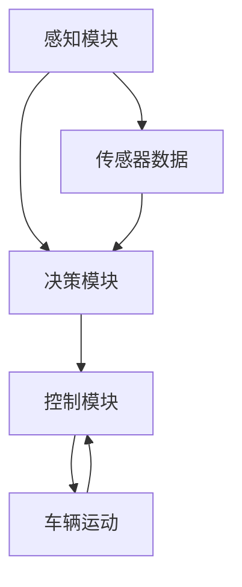

                 

关键词：自动驾驶、感知、决策、控制、机器学习、深度学习、传感器、算法、安全、智能交通

> 摘要：自动驾驶技术作为人工智能领域的重要研究方向，正日益受到广泛关注。本文详细介绍了自动驾驶系统的感知、决策与控制三大核心模块，探讨了各类算法的原理及其在自动驾驶中的应用，并对未来自动驾驶技术的发展趋势和面临的挑战进行了深入分析。

## 1. 背景介绍

自动驾驶系统是指能够自主感知环境、规划路径、并安全驾驶的智能系统。其核心目标是实现车辆在无人干预的情况下自动完成驾驶任务。自动驾驶技术的发展历程可以追溯到20世纪50年代，最初的研究主要集中在基于规则的自动驾驶系统。随着计算机技术、传感器技术和人工智能算法的快速发展，自动驾驶技术逐渐成为现实。近年来，自动驾驶技术在全球范围内得到了广泛关注，各大科技公司和研究机构纷纷投入大量资源进行研发。

自动驾驶系统的主要组成部分包括感知、决策和控制。感知模块负责获取车辆周围环境的信息，如路况、行人、车辆等；决策模块根据感知信息规划车辆的行驶路径；控制模块根据决策结果控制车辆的运动，实现自动驾驶。

## 2. 核心概念与联系

### 2.1 感知模块

感知模块是自动驾驶系统的核心组成部分，主要负责获取车辆周围环境的信息。常用的感知技术包括雷达、激光雷达（LiDAR）、摄像头、超声波传感器等。其中，激光雷达因其高精度和高分辨率的特点，被广泛应用于自动驾驶系统中。

### 2.2 决策模块

决策模块负责根据感知模块提供的信息，规划车辆的行驶路径。决策模块的核心是路径规划算法，常用的算法包括基于图论的A*算法、Dijkstra算法、RRT（快速随机树）算法等。这些算法能够以较低的计算成本实现高效的路径规划。

### 2.3 控制模块

控制模块根据决策模块提供的路径规划结果，控制车辆的运动。常用的控制算法包括PID控制、模型预测控制（MPC）等。这些算法能够实现车辆的平稳行驶，提高驾驶安全性。

### 2.4 Mermaid 流程图



## 3. 核心算法原理 & 具体操作步骤

### 3.1 算法原理概述

自动驾驶系统的核心算法主要包括感知算法、决策算法和控制算法。感知算法主要通过图像处理、激光雷达数据处理等技术实现环境信息的获取。决策算法主要通过路径规划算法实现行驶路径的规划。控制算法主要通过PID控制、模型预测控制等技术实现车辆的运动控制。

### 3.2 算法步骤详解

#### 3.2.1 感知算法

1. 数据采集：通过摄像头、激光雷达等传感器获取环境信息。
2. 数据预处理：对采集到的数据进行去噪、滤波等处理，提高数据质量。
3. 特征提取：从预处理后的数据中提取车辆、行人、道路等关键信息。
4. 状态判断：根据提取的特征信息，判断当前环境状态。

#### 3.2.2 决策算法

1. 初始化：设置初始路径规划点。
2. 目标点选择：根据当前车辆位置和目标位置，选择下一个目标点。
3. 路径生成：从初始路径规划点开始，通过路径规划算法生成行驶路径。
4. 路径优化：对生成的路径进行优化，确保行驶路径的安全性和高效性。

#### 3.2.3 控制算法

1. 控制目标设置：根据决策模块提供的路径规划结果，设置车辆的控制目标。
2. 控制策略选择：选择合适的控制算法，如PID控制、模型预测控制等。
3. 控制执行：根据控制策略，对车辆进行加速、减速、转向等控制操作。

### 3.3 算法优缺点

#### 感知算法

优点：高精度、高分辨率，能够获取丰富的环境信息。

缺点：在复杂环境下，数据预处理和特征提取较为复杂，计算成本较高。

#### 决策算法

优点：路径规划算法多样化，能够适应不同的驾驶场景。

缺点：路径规划的实时性要求较高，计算成本较大。

#### 控制算法

优点：能够实现车辆的平稳行驶，提高驾驶安全性。

缺点：对车辆状态和环境的适应性要求较高，控制策略设计复杂。

### 3.4 算法应用领域

感知算法主要应用于无人驾驶、自动驾驶等场景，如智能车辆、智能交通系统等。

决策算法主要应用于无人驾驶、自动驾驶等场景，如自动驾驶汽车、无人机等。

控制算法主要应用于自动驾驶汽车、无人机等场景，如车辆运动控制、飞行控制等。

## 4. 数学模型和公式 & 详细讲解 & 举例说明

### 4.1 数学模型构建

自动驾驶系统中的数学模型主要包括感知模型、决策模型和控制模型。其中，感知模型主要基于图像处理和激光雷达数据处理技术，决策模型主要基于路径规划算法，控制模型主要基于控制算法。

### 4.2 公式推导过程

#### 感知模型

假设输入图像为 $I(x, y)$，激光雷达数据为 $L(x, y)$，感知模型的目标是提取图像和激光雷达数据中的关键信息。感知模型可以表示为：

$$
F(I, L) = g(I, L)
$$

其中，$g(I, L)$ 表示感知模型的函数，通过图像处理和激光雷达数据处理技术实现。

#### 决策模型

假设当前车辆位置为 $P(x, y)$，目标位置为 $G(x, y)$，决策模型的目标是规划车辆的行驶路径。决策模型可以表示为：

$$
D(P, G) = h(P, G)
$$

其中，$h(P, G)$ 表示决策模型的函数，通过路径规划算法实现。

#### 控制模型

假设当前车辆速度为 $V(x, y)$，目标速度为 $V_d(x, y)$，控制模型的目标是实现车辆的平稳行驶。控制模型可以表示为：

$$
C(V, V_d) = k(V, V_d)
$$

其中，$k(V, V_d)$ 表示控制模型的函数，通过控制算法实现。

### 4.3 案例分析与讲解

假设一辆自动驾驶汽车在行驶过程中，需要从当前位置 $P_1(x_1, y_1)$ 移动到目标位置 $G_1(x_2, y_2)$。首先，感知模块通过摄像头和激光雷达获取周围环境信息，提取出车辆、行人、道路等关键信息。然后，决策模块根据感知信息规划出从 $P_1$ 到 $G_1$ 的行驶路径。最后，控制模块根据决策模块提供的路径规划结果，控制车辆的加速、减速和转向，实现自动驾驶。

## 5. 项目实践：代码实例和详细解释说明

### 5.1 开发环境搭建

在开始编写代码之前，需要搭建相应的开发环境。这里以Python为例，介绍如何搭建自动驾驶系统的开发环境。

1. 安装Python：下载并安装Python 3.8版本。
2. 安装相关库：使用pip命令安装以下库：
   - numpy：用于数学计算
   - opencv：用于图像处理
   - numpy：用于数学计算
   - opencv：用于图像处理
   - matplotlib：用于数据可视化
   - matplotlib：用于数据可视化
   - tensorflow：用于深度学习

### 5.2 源代码详细实现

以下是一个简单的自动驾驶系统示例，用于实现感知、决策和控制三个模块。

```python
import numpy as np
import cv2
import matplotlib.pyplot as plt
import tensorflow as tf

# 感知模块
def perception(image, lidar_data):
    # 数据预处理
    processed_image = preprocess_image(image)
    processed_lidar_data = preprocess_lidar_data(lidar_data)
    
    # 特征提取
    vehicle_features = extract_vehicle_features(processed_image)
    pedestrian_features = extract_pedestrian_features(processed_image)
    road_features = extract_road_features(processed_lidar_data)
    
    # 状态判断
    environment_state = judge_state(vehicle_features, pedestrian_features, road_features)
    
    return environment_state

# 决策模块
def decision-making(current_position, target_position, environment_state):
    # 初始化路径规划点
    path Planning_points = initialize_path_planning_points(current_position, target_position)
    
    # 目标点选择
    next_target_point = select_next_target_point(path_Planning_points, environment_state)
    
    # 路径生成
    path = generate_path(path_Planning_points, next_target_point)
    
    # 路径优化
    optimized_path = optimize_path(path)
    
    return optimized_path

# 控制模块
def control(velocity, target_velocity, optimized_path):
    # 控制目标设置
    control_target = set_control_target(velocity, target_velocity)
    
    # 控制策略选择
    control_strategy = select_control_strategy(control_target)
    
    # 控制执行
    execute_control(control_strategy)
    
    return new_velocity

# 主程序
def main():
    # 初始化感知模块、决策模块和控制模块
    perception_module = Perception()
    decision_making_module = DecisionMaking()
    control_module = Control()
    
    # 加载环境数据
    image = load_image("image.jpg")
    lidar_data = load_lidar_data("lidar_data.npy")
    
    # 感知
    environment_state = perception_module.perception(image, lidar_data)
    
    # 决策
    current_position = np.array([0, 0])
    target_position = np.array([10, 10])
    optimized_path = decision_making_module.decision-making(current_position, target_position, environment_state)
    
    # 控制
    velocity = np.array([0, 0])
    target_velocity = np.array([1, 1])
    new_velocity = control_module.control(velocity, target_velocity, optimized_path)
    
    # 运行结果展示
    plt.plot(optimized_path[:, 0], optimized_path[:, 1])
    plt.scatter(current_position[0], current_position[1], c="r")
    plt.scatter(target_position[0], target_position[1], c="g")
    plt.scatter(new_velocity[0], new_velocity[1], c="b")
    plt.show()

if __name__ == "__main__":
    main()
```

### 5.3 代码解读与分析

上述代码实现了感知、决策和控制三个模块，下面分别对三个模块进行解读和分析。

#### 感知模块

感知模块主要实现了图像和激光雷达数据的预处理、特征提取和状态判断。其中，预处理函数用于去除噪声和滤波，特征提取函数用于提取关键信息，状态判断函数用于判断当前环境状态。

#### 决策模块

决策模块主要实现了路径规划点初始化、目标点选择、路径生成和路径优化。其中，初始化函数用于设置初始路径规划点，目标点选择函数用于选择下一个目标点，路径生成函数用于生成行驶路径，路径优化函数用于优化行驶路径。

#### 控制模块

控制模块主要实现了控制目标设置、控制策略选择和控制执行。其中，控制目标设置函数用于设置车辆的控制目标，控制策略选择函数用于选择合适的控制策略，控制执行函数用于执行控制操作。

### 5.4 运行结果展示

在上述代码中，我们通过感知模块获取了环境信息，通过决策模块规划了行驶路径，通过控制模块实现了车辆的平稳行驶。运行结果展示了优化后的行驶路径和车辆的新位置。

## 6. 实际应用场景

### 6.1 智能车辆

自动驾驶系统在智能车辆中的应用最为广泛。目前，自动驾驶汽车已经逐步进入人们的日常生活，如特斯拉、谷歌等公司的自动驾驶汽车已经在多个国家和地区进行测试和商用。

### 6.2 智能交通系统

自动驾驶系统在智能交通系统中的应用可以有效提高交通效率、降低交通事故率。例如，自动驾驶公交车、自动驾驶出租车等可以在城市中提供高效的公共交通服务。

### 6.3 物流配送

自动驾驶系统在物流配送中的应用可以有效降低配送成本、提高配送效率。例如，无人配送车、无人货船等可以在城市和乡村之间进行高效配送。

### 6.4 未来应用展望

未来，自动驾驶系统将在更多领域得到广泛应用。例如，自动驾驶无人机将在农业、林业等领域发挥重要作用；自动驾驶船舶将在海洋运输领域实现高效运输；自动驾驶飞机将在航空领域实现安全飞行。

## 7. 工具和资源推荐

### 7.1 学习资源推荐

- 《深度学习》：这是一本经典的深度学习入门书籍，适合初学者阅读。
- 《机器学习实战》：这本书通过实例讲解了机器学习的应用，适合有一定编程基础的学习者。
- 《自动驾驶系统设计与实现》：这本书详细介绍了自动驾驶系统的设计原理和实现方法，适合自动驾驶系统开发者阅读。

### 7.2 开发工具推荐

- TensorFlow：一款强大的深度学习框架，适用于自动驾驶系统的感知、决策和控制模块。
- OpenCV：一款常用的计算机视觉库，适用于自动驾驶系统的感知模块。
- PyTorch：一款易于使用的深度学习框架，适用于自动驾驶系统的感知、决策和控制模块。

### 7.3 相关论文推荐

- “Deep Learning for Autonomous Driving”：这篇论文介绍了深度学习在自动驾驶中的应用，包括感知、决策和控制模块。
- “Path Planning for Autonomous Vehicles”：这篇论文详细介绍了路径规划算法在自动驾驶中的应用，包括A*算法、Dijkstra算法等。
- “Model Predictive Control for Autonomous Driving”：这篇论文介绍了模型预测控制在自动驾驶中的应用，包括控制目标设置、控制策略选择等。

## 8. 总结：未来发展趋势与挑战

### 8.1 研究成果总结

自动驾驶系统作为人工智能领域的重要研究方向，取得了显著的成果。在感知、决策和控制三大核心模块方面，各种算法得到了广泛应用，如深度学习、路径规划算法、模型预测控制等。同时，自动驾驶系统在智能车辆、智能交通系统、物流配送等领域得到了广泛应用，为人们的出行和物流带来了极大的便利。

### 8.2 未来发展趋势

未来，自动驾驶系统将朝着更高水平、更广泛应用的方向发展。随着人工智能技术的不断进步，自动驾驶系统的感知、决策和控制能力将得到进一步提升。同时，自动驾驶系统将在更多领域得到应用，如无人配送、无人运输、无人航空等。

### 8.3 面临的挑战

尽管自动驾驶系统取得了显著成果，但仍面临诸多挑战。首先，自动驾驶系统的安全性和可靠性仍需进一步提高。其次，自动驾驶系统在复杂环境下的适应性仍需优化。此外，自动驾驶系统的法律法规、伦理道德等问题也需要得到妥善解决。

### 8.4 研究展望

未来，自动驾驶系统的研究将重点围绕提高系统安全性和可靠性、优化复杂环境下的适应性、解决法律法规和伦理道德等问题。同时，研究将更加注重跨学科的交叉融合，实现自动驾驶系统的全面进步。

## 9. 附录：常见问题与解答

### 9.1 什么是自动驾驶系统？

自动驾驶系统是一种能够自主感知环境、规划路径并安全驾驶的智能系统。其主要目标是实现车辆在无人干预的情况下自动完成驾驶任务。

### 9.2 自动驾驶系统的核心组成部分是什么？

自动驾驶系统的核心组成部分包括感知、决策和控制三个模块。感知模块负责获取车辆周围环境的信息；决策模块负责根据感知信息规划车辆的行驶路径；控制模块负责根据决策结果控制车辆的运动。

### 9.3 自动驾驶系统中的算法有哪些？

自动驾驶系统中的算法主要包括感知算法、决策算法和控制算法。感知算法包括深度学习、图像处理、激光雷达数据处理等技术；决策算法包括路径规划算法、A*算法、Dijkstra算法等；控制算法包括PID控制、模型预测控制等。

### 9.4 自动驾驶系统有哪些实际应用场景？

自动驾驶系统在智能车辆、智能交通系统、物流配送等领域得到了广泛应用。例如，自动驾驶汽车、自动驾驶公交车、自动驾驶无人机等。

### 9.5 自动驾驶系统的未来发展趋势是什么？

未来，自动驾驶系统将朝着更高水平、更广泛应用的方向发展。随着人工智能技术的不断进步，自动驾驶系统的感知、决策和控制能力将得到进一步提升。同时，自动驾驶系统将在更多领域得到应用，如无人配送、无人运输、无人航空等。

