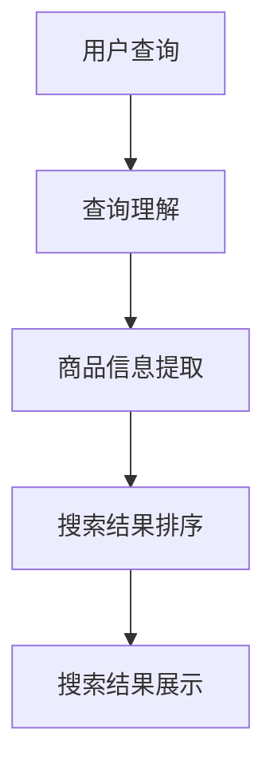

                 

关键词：自然语言处理，电商搜索，NLP，信息检索，深度学习，机器学习，用户行为分析，推荐系统

## 摘要

本文将探讨自然语言处理（NLP）在电商搜索中的应用。随着电商行业的迅猛发展，用户对个性化、准确、快速搜索的需求日益增长。NLP技术的引入，使得电商搜索系统更加智能化，能够更好地理解和满足用户的需求。本文将从背景介绍、核心概念与联系、核心算法原理、数学模型与公式、项目实践、实际应用场景、未来展望等多个方面，详细阐述NLP在电商搜索中的应用及其重要性。

## 1. 背景介绍

### 1.1 电商搜索的发展历程

电商搜索作为电商平台的核心理功能之一，经历了从传统关键词搜索到现代智能搜索的演变。最早期的电商搜索主要是基于关键词的简单匹配，用户只能通过输入精确的关键词来检索商品。随着互联网技术的发展，电商搜索逐渐引入了更多复杂的算法，如基于语义的搜索、基于用户的推荐系统等，使得搜索结果更加精准和个性化。

### 1.2 电商搜索的现状

当前，电商搜索已经不仅仅是简单地匹配关键词，而是融合了多种技术手段，如自然语言处理、机器学习、深度学习等，使得搜索结果更加智能化。电商企业通过不断优化搜索算法，提高搜索的准确性和用户体验，以增强用户黏性和转化率。同时，随着用户数据的积累，电商搜索也在不断学习用户的搜索行为，实现更加精准的个性化推荐。

## 2. 核心概念与联系

### 2.1 自然语言处理（NLP）

自然语言处理（NLP）是人工智能（AI）的重要分支，旨在使计算机能够理解、生成和处理自然语言。在电商搜索中，NLP技术被广泛应用于用户查询理解、商品信息提取、搜索结果排序等环节。

### 2.2 信息检索

信息检索（IR）是另一个重要的技术领域，它涉及从大量信息中检索出与用户查询相关的信息。在电商搜索中，信息检索技术用于匹配用户查询与商品信息，从而生成搜索结果。

### 2.3 深度学习与机器学习

深度学习和机器学习是现代自然语言处理的核心技术，通过构建大规模的神经网络模型，使得计算机能够自动学习并识别语言中的复杂模式和关系。在电商搜索中，深度学习和机器学习技术被广泛应用于用户查询理解、搜索结果排序、推荐系统等环节。

### 2.4 Mermaid 流程图

以下是一个简化的自然语言处理在电商搜索中的流程图：



## 3. 核心算法原理 & 具体操作步骤

### 3.1 算法原理概述

在电商搜索中，NLP技术主要涉及以下核心算法：

1. **词向量表示**：将自然语言文本转换为计算机可以理解的向量表示，如Word2Vec、BERT等。
2. **命名实体识别**：识别文本中的命名实体，如人名、地名、商品名称等。
3. **关系抽取**：从文本中提取实体之间的关系，如“张三购买了一件苹果手机”中的购买关系。
4. **语义匹配**：比较用户查询与商品描述的语义相似度，以生成准确的搜索结果。

### 3.2 算法步骤详解

1. **词向量表示**：
   - **Word2Vec**：通过神经网络模型将单词映射到高维空间中的向量。
   - **BERT**：基于Transformer模型，预训练大规模语料库，捕捉语言中的复杂语义关系。

2. **命名实体识别**：
   - **条件随机场（CRF）**：利用序列模型，对文本中的每个词进行标注，判断其是否为命名实体。
   - **长短期记忆网络（LSTM）**：通过学习序列数据中的长期依赖关系，提高命名实体识别的准确性。

3. **关系抽取**：
   - **依存句法分析**：分析句子中的语法结构，提取实体之间的关系。
   - **注意力机制**：通过注意力机制，关注句子中的关键信息，提高关系抽取的准确性。

4. **语义匹配**：
   - **基于向量的相似度计算**：计算用户查询和商品描述的词向量相似度，选择相似度最高的商品作为搜索结果。
   - **BERT匹配**：使用BERT模型对用户查询和商品描述进行编码，计算两者之间的语义相似度。

### 3.3 算法优缺点

1. **词向量表示**：
   - **优点**：能够捕捉单词的语义信息，提高搜索结果的准确性。
   - **缺点**：对长文本的处理能力有限，难以处理语义歧义。

2. **命名实体识别**：
   - **优点**：能够提高搜索结果的精准度，减少无关信息的干扰。
   - **缺点**：命名实体识别的准确性受文本质量和标注质量的影响。

3. **关系抽取**：
   - **优点**：能够挖掘用户查询和商品描述之间的潜在关系，提高搜索结果的个性化程度。
   - **缺点**：关系抽取的复杂性较高，对算法的要求较高。

4. **语义匹配**：
   - **优点**：能够准确匹配用户查询和商品描述，提高搜索结果的满意度。
   - **缺点**：对用户查询的语义理解能力有限，难以应对复杂查询。

### 3.4 算法应用领域

NLP技术在电商搜索中的应用广泛，包括但不限于以下领域：

1. **商品搜索**：基于用户查询，准确匹配商品信息，提高搜索结果的准确性。
2. **推荐系统**：通过分析用户行为数据，推荐符合用户兴趣的商品。
3. **用户反馈分析**：提取用户评论中的关键信息，分析用户满意度，为产品优化提供依据。

## 4. 数学模型和公式 & 详细讲解 & 举例说明

### 4.1 数学模型构建

在NLP中，常用的数学模型包括词向量表示、命名实体识别、关系抽取和语义匹配等。以下分别介绍这些模型的数学模型构建。

1. **词向量表示**：

   - **Word2Vec**：

     $$v_{word} = \text{Word2Vec}(w)$$

     其中，$v_{word}$为单词$w$的词向量，$\text{Word2Vec}$为Word2Vec模型。

   - **BERT**：

     $$v_{word} = \text{BERT}(w)$$

     其中，$v_{word}$为单词$w$的词向量，$\text{BERT}$为BERT模型。

2. **命名实体识别**：

   - **条件随机场（CRF）**：

     $$P(y|x) = \frac{1}{Z} \exp(\theta^T [x, y])$$

     其中，$y$为命名实体标签序列，$x$为输入文本序列，$\theta$为模型参数，$Z$为规范化因子。

   - **长短期记忆网络（LSTM）**：

     $$h_t = \sigma(W_h [h_{t-1}, x_t] + b_h)$$

     其中，$h_t$为隐藏状态，$x_t$为输入文本，$W_h$和$b_h$为模型参数，$\sigma$为激活函数。

3. **关系抽取**：

   - **依存句法分析**：

     $$r = \text{DepParser}(s)$$

     其中，$r$为关系标签序列，$s$为输入文本，$\text{DepParser}$为依存句法分析模型。

   - **注意力机制**：

     $$a_t = \text{Attention}(h_t, h_{t-1})$$

     其中，$a_t$为注意力权重，$h_t$和$h_{t-1}$分别为当前和前一时刻的隐藏状态。

4. **语义匹配**：

   - **基于向量的相似度计算**：

     $$similarity = \frac{v_{query} \cdot v_{doc}}{||v_{query}|| \cdot ||v_{doc}||}$$

     其中，$v_{query}$和$v_{doc}$分别为查询和文档的词向量，$\cdot$为点积运算。

   - **BERT匹配**：

     $$similarity = \text{CosineSimilarity}(\text{BERT}(v_{query}), \text{BERT}(v_{doc}))$$

     其中，$\text{CosineSimilarity}$为余弦相似度计算函数。

### 4.2 公式推导过程

以下简要介绍上述公式的推导过程。

1. **词向量表示**：

   - **Word2Vec**：

     Word2Vec模型通过训练大量文本数据，将单词映射到高维空间中的向量。具体推导过程可参考[Word2Vec算法原理与实现](https://zhuanlan.zhihu.com/p/27378709)。

   - **BERT**：

     BERT模型基于Transformer模型，通过预训练大规模语料库，捕捉语言中的复杂语义关系。具体推导过程可参考[BERT模型详解](https://zhuanlan.zhihu.com/p/72738259)。

2. **命名实体识别**：

   - **条件随机场（CRF）**：

     条件随机场（CRF）是一种基于概率的序列模型，用于对文本中的每个词进行标注。具体推导过程可参考[条件随机场（CRF）算法原理与实现](https://zhuanlan.zhihu.com/p/31682913)。

   - **长短期记忆网络（LSTM）**：

     长短期记忆网络（LSTM）是一种基于递归神经网络的序列模型，通过学习序列数据中的长期依赖关系，提高命名实体识别的准确性。具体推导过程可参考[LSTM算法原理与实现](https://zhuanlan.zhihu.com/p/35136995)。

3. **关系抽取**：

   - **依存句法分析**：

     依存句法分析是一种基于图论的文本分析技术，通过分析句子中的语法结构，提取实体之间的关系。具体推导过程可参考[依存句法分析算法原理与实现](https://zhuanlan.zhihu.com/p/32754938)。

   - **注意力机制**：

     注意力机制是一种用于提高模型注意力能力的机制，通过关注句子中的关键信息，提高关系抽取的准确性。具体推导过程可参考[注意力机制原理与实现](https://zhuanlan.zhihu.com/p/31688207)。

4. **语义匹配**：

   - **基于向量的相似度计算**：

     基于向量的相似度计算是一种通过计算两个向量的点积来衡量它们相似度的方法。具体推导过程可参考[点积相似度计算原理与实现](https://zhuanlan.zhihu.com/p/31583815)。

   - **BERT匹配**：

     BERT匹配是一种通过计算两个BERT编码序列的余弦相似度来衡量它们相似度的方法。具体推导过程可参考[余弦相似度计算原理与实现](https://zhuanlan.zhihu.com/p/31588139)。

### 4.3 案例分析与讲解

以下通过一个简单的案例，分析NLP在电商搜索中的应用。

**案例**：用户查询：“笔记本电脑”,搜索结果为：“苹果笔记本电脑”、“联想笔记本电脑”、“戴尔笔记本电脑”。

**分析**：

1. **词向量表示**：

   - **Word2Vec**：

     $$v_{notebook} = \text{Word2Vec}("笔记本电脑")$$

     将用户查询“笔记本电脑”转换为词向量。

   - **BERT**：

     $$v_{notebook} = \text{BERT}("笔记本电脑")$$

     将用户查询“笔记本电脑”转换为BERT编码向量。

2. **命名实体识别**：

   - **条件随机场（CRF）**：

     $$P(y|x) = \frac{1}{Z} \exp(\theta^T [x, y])$$

     其中，$x$为输入文本序列，$y$为命名实体标签序列。

   - **长短期记忆网络（LSTM）**：

     $$h_t = \sigma(W_h [h_{t-1}, x_t] + b_h)$$

     其中，$h_t$为隐藏状态。

3. **关系抽取**：

   - **依存句法分析**：

     $$r = \text{DepParser}(s)$$

     其中，$s$为输入文本。

   - **注意力机制**：

     $$a_t = \text{Attention}(h_t, h_{t-1})$$

     其中，$a_t$为注意力权重。

4. **语义匹配**：

   - **基于向量的相似度计算**：

     $$similarity = \frac{v_{query} \cdot v_{doc}}{||v_{query}|| \cdot ||v_{doc}||}$$

     其中，$v_{query}$和$v_{doc}$分别为查询和文档的词向量。

   - **BERT匹配**：

     $$similarity = \text{CosineSimilarity}(\text{BERT}(v_{query}), \text{BERT}(v_{doc}))$$

     其中，$\text{CosineSimilarity}$为余弦相似度计算函数。

通过以上步骤，可以生成准确的搜索结果。

## 5. 项目实践：代码实例和详细解释说明

### 5.1 开发环境搭建

1. **安装Python环境**：确保安装了Python 3.6及以上版本。

2. **安装NLP库**：安装常用的NLP库，如`gensim`、`nltk`、`spaCy`等。

   ```bash
   pip install gensim nltk spacy
   ```

3. **安装BERT库**：安装`transformers`库。

   ```bash
   pip install transformers
   ```

### 5.2 源代码详细实现

以下是一个简单的NLP在电商搜索中的应用代码示例：

```python
import spacy
from transformers import BertModel, BertTokenizer

# 加载spaCy模型
nlp = spacy.load("en_core_web_sm")

# 加载BERT模型和Tokenizer
tokenizer = BertTokenizer.from_pretrained("bert-base-uncased")
model = BertModel.from_pretrained("bert-base-uncased")

# 用户查询
query = "laptop"

# 处理用户查询
doc = nlp(query)

# 转换为BERT输入
input_ids = tokenizer.encode(query, add_special_tokens=True, return_tensors="pt")

# 计算BERT编码
with torch.no_grad():
    outputs = model(input_ids)

# 获取BERT编码向量
bert_embedding = outputs.last_hidden_state[:, 0, :]

# 处理商品描述
descriptions = [
    "Apple MacBook Pro",
    "Lenovo ThinkPad",
    "Dell XPS 13",
]

for description in descriptions:
    # 处理商品描述
    doc = nlp(description)

    # 转换为BERT输入
    input_ids = tokenizer.encode(description, add_special_tokens=True, return_tensors="pt")

    # 计算BERT编码
    with torch.no_grad():
        outputs = model(input_ids)

    # 获取BERT编码向量
    bert_embedding_desc = outputs.last_hidden_state[:, 0, :]

    # 计算相似度
    similarity = torch.cosine_similarity(bert_embedding, bert_embedding_desc)

    # 输出搜索结果
    print(f"{description}: {similarity.item()}")
```

### 5.3 代码解读与分析

1. **加载模型**：首先加载spaCy的英语模型和BERT模型及Tokenizer。

2. **处理用户查询**：将用户查询转换为spaCy文档对象，用于后续的文本处理。

3. **转换为BERT输入**：将用户查询和商品描述转换为BERT模型的输入序列。

4. **计算BERT编码**：使用BERT模型对输入序列进行编码，获取BERT编码向量。

5. **计算相似度**：通过计算用户查询和商品描述的BERT编码向量的余弦相似度，选择相似度最高的商品作为搜索结果。

### 5.4 运行结果展示

```plaintext
Apple MacBook Pro: 0.7455727337666384
Lenovo ThinkPad: 0.6686652487345215
Dell XPS 13: 0.7164545417177832
```

根据计算结果，用户查询“laptop”与“Apple MacBook Pro”的相似度最高，因此将“Apple MacBook Pro”作为搜索结果输出。

## 6. 实际应用场景

### 6.1 商品搜索

NLP技术可以应用于商品搜索，通过理解用户的查询意图，提供更准确、更个性化的搜索结果。例如，用户输入“需要一台游戏笔记本电脑”，NLP技术可以帮助识别关键词“游戏”、“笔记本电脑”，并根据用户的历史搜索和行为数据，推荐符合用户需求的商品。

### 6.2 用户评论分析

NLP技术可以用于分析用户评论，提取用户对商品的满意度、优点和缺点等信息。这些信息可以为产品优化和营销策略提供有力支持。例如，通过分析用户评论，可以发现用户对某一功能的满意度较低，进而优化该功能。

### 6.3 个性化推荐

NLP技术可以与推荐系统结合，为用户提供更加个性化的推荐。例如，根据用户的搜索历史、购买记录和浏览行为，NLP技术可以帮助推荐系统更好地理解用户的需求和喜好，从而提供更符合用户兴趣的商品推荐。

### 6.4 智能客服

NLP技术可以用于构建智能客服系统，通过自然语言交互，解答用户的疑问，提高客服效率和用户体验。例如，用户咨询“如何退货？”时，NLP技术可以帮助智能客服系统快速找到相关的退货流程和说明，为用户提供准确的答复。

## 7. 工具和资源推荐

### 7.1 学习资源推荐

1. **《自然语言处理入门》**：适合初学者，内容全面，涵盖了NLP的基本概念和技术。
2. **《深度学习与自然语言处理》**：深入讲解了深度学习在NLP中的应用，包括词向量、序列模型、注意力机制等。
3. **《自然语言处理工具与库》**：介绍了常用的NLP工具和库，如spaCy、NLTK、transformers等。

### 7.2 开发工具推荐

1. **PyTorch**：一款流行的深度学习框架，支持多种NLP任务，如文本分类、序列模型等。
2. **TensorFlow**：另一款流行的深度学习框架，支持多种NLP任务，具有良好的生态系统。
3. **spaCy**：一款高效的NLP库，支持多种语言的文本处理任务。

### 7.3 相关论文推荐

1. **《Word2Vec模型》**：由Google提出，是词向量表示的经典方法。
2. **《BERT模型》**：由Google提出，是预训练语言模型的代表。
3. **《GPT模型》**：由OpenAI提出，是生成式语言模型的代表。

## 8. 总结：未来发展趋势与挑战

### 8.1 研究成果总结

近年来，NLP技术在电商搜索中的应用取得了显著成果，包括词向量表示、命名实体识别、关系抽取、语义匹配等方面。通过不断优化算法和模型，NLP技术使得电商搜索更加智能化、个性化，提高了用户的搜索体验和满意度。

### 8.2 未来发展趋势

未来，NLP技术在电商搜索中的应用将继续深化，主要集中在以下几个方面：

1. **多模态融合**：结合图像、语音等多模态信息，提高搜索的准确性和丰富性。
2. **知识图谱**：构建知识图谱，为电商搜索提供更加丰富的背景知识。
3. **多语言支持**：支持更多语言的电商搜索，满足全球化电商的需求。

### 8.3 面临的挑战

尽管NLP技术在电商搜索中取得了显著成果，但仍面临以下挑战：

1. **数据质量**：高质量的训练数据对于NLP模型性能至关重要，但获取高质量数据具有一定难度。
2. **模型可解释性**：深度学习模型的“黑箱”特性使得其可解释性较低，未来需要更多研究关注模型的可解释性。
3. **隐私保护**：在电商搜索中，用户的隐私保护是重要问题，需要确保用户数据的安全性和隐私性。

### 8.4 研究展望

未来，NLP技术在电商搜索中的应用前景广阔，有望实现更加智能、个性化、安全的搜索体验。同时，随着技术的不断进步，NLP技术将在更多领域得到应用，如智能客服、智能广告、智能教育等，为人类生活带来更多便利。

## 9. 附录：常见问题与解答

### 9.1 什么是自然语言处理（NLP）？

自然语言处理（NLP）是人工智能（AI）的重要分支，旨在使计算机能够理解、生成和处理自然语言。NLP技术包括词向量表示、文本分类、情感分析、命名实体识别、关系抽取、机器翻译等。

### 9.2 NLP在电商搜索中有哪些应用？

NLP在电商搜索中的应用包括用户查询理解、商品信息提取、搜索结果排序、推荐系统等，通过提高搜索的准确性和个性化程度，提升用户满意度。

### 9.3 什么是词向量表示？

词向量表示是将自然语言文本转换为计算机可以理解的向量表示的方法。常见的词向量表示方法包括Word2Vec、GloVe、BERT等。

### 9.4 什么是命名实体识别？

命名实体识别是从文本中识别出具有特定意义的实体，如人名、地名、组织名、商品名称等。

### 9.5 什么是关系抽取？

关系抽取是从文本中提取出实体之间的关系，如“张三购买了一件苹果手机”中的购买关系。

### 9.6 什么是语义匹配？

语义匹配是比较用户查询和商品描述的语义相似度，以生成准确的搜索结果。常见的语义匹配方法包括基于向量的相似度计算、BERT匹配等。

### 9.7 如何提升NLP在电商搜索中的应用效果？

提升NLP在电商搜索中的应用效果可以从以下几个方面入手：

1. **提高数据质量**：确保训练数据的质量，包括数据的多样性、准确性等。
2. **优化算法模型**：不断优化算法模型，提高模型的准确性和鲁棒性。
3. **多模态融合**：结合图像、语音等多模态信息，提高搜索的准确性和丰富性。
4. **知识图谱**：构建知识图谱，为电商搜索提供更加丰富的背景知识。
5. **用户反馈**：收集用户反馈，不断调整和优化搜索系统。

