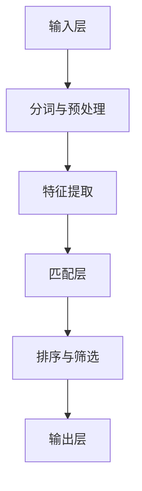

                 

关键词：自然语言处理，电商搜索，技术发展，未来趋势

摘要：本文将探讨自然语言处理（NLP）在电商搜索领域的应用。通过对NLP核心概念、算法原理、数学模型和项目实践的深入分析，本文旨在揭示NLP在电商搜索中的技术发展现状及未来趋势，为相关领域的研究者和从业者提供有价值的参考。

## 1. 背景介绍

随着互联网技术的迅猛发展，电子商务已经成为全球范围内的重要商业模式。电商平台的崛起不仅改变了传统商业模式，也为消费者提供了更加便捷的购物体验。然而，随着商品种类和数量的不断增多，如何提高搜索效率和用户体验成为了电商领域的重要课题。

自然语言处理作为人工智能的核心技术之一，在文本理解、信息提取、情感分析等方面具有广泛应用。将NLP引入电商搜索，能够实现用户查询与商品信息的智能匹配，从而提升搜索效率和用户体验。

## 2. 核心概念与联系

### 2.1 自然语言处理（NLP）的概念

自然语言处理（Natural Language Processing，简称NLP）是人工智能领域的一个重要分支，旨在使计算机能够理解和处理人类自然语言。NLP的核心任务包括文本分类、信息提取、机器翻译、语音识别等。

### 2.2 电商搜索中的NLP应用

在电商搜索中，NLP的应用主要包括以下几个方向：

- **关键词提取**：从用户查询中提取关键信息，用于后续的搜索匹配。
- **文本分类**：对商品信息进行分类，便于用户快速定位所需商品。
- **实体识别**：识别用户查询中的实体（如商品名称、品牌等），以便进行更精确的匹配。
- **情感分析**：分析用户评论和反馈，了解用户对商品的满意度，为产品改进提供依据。

### 2.3 NLP在电商搜索中的架构

为了实现上述功能，电商搜索系统通常采用以下架构：

- **输入层**：接收用户查询，进行预处理，如分词、去停用词等。
- **特征提取层**：提取查询和商品信息的关键特征，如词频、词向量等。
- **匹配层**：利用NLP算法，对查询和商品信息进行匹配，筛选出最相关的商品。
- **输出层**：将匹配结果呈现给用户，并提供排序、筛选等功能。

## 2.4 Mermaid 流程图



## 3. 核心算法原理 & 具体操作步骤

### 3.1 算法原理概述

在电商搜索中，常用的NLP算法包括词向量模型、序列模型和图模型等。这些算法通过对文本进行建模，实现查询与商品信息的智能匹配。

- **词向量模型**：将文本中的词语映射为高维空间中的向量，以便进行向量运算。如Word2Vec、GloVe等。
- **序列模型**：处理文本序列，通过隐藏层状态转移，实现对文本的理解。如循环神经网络（RNN）、长短期记忆网络（LSTM）等。
- **图模型**：将文本信息表示为图结构，通过图算法进行匹配。如图卷积网络（GCN）等。

### 3.2 算法步骤详解

- **词向量模型**：

  1. 数据预处理：对文本进行分词、去停用词等操作。
  2. 建立词汇表：将文本中的词语转化为索引。
  3. 计算词向量：使用Word2Vec或GloVe等方法，计算每个词语的向量表示。
  4. 向量运算：将查询和商品信息的词向量进行相似度计算，筛选出最相关的商品。

- **序列模型**：

  1. 数据预处理：对文本进行分词、去停用词等操作。
  2. 建立词汇表：将文本中的词语转化为索引。
  3. 输入序列编码：使用LSTM等序列模型，对输入序列进行编码。
  4. 预测输出序列：根据编码结果，预测输出序列，实现查询与商品信息的匹配。

- **图模型**：

  1. 数据预处理：对文本进行分词、去停用词等操作。
  2. 建立图结构：将文本信息表示为图结构，节点表示词语，边表示词语之间的关系。
  3. 图卷积运算：使用图卷积网络，对图结构进行卷积运算，提取特征。
  4. 特征融合与分类：将图卷积特征与文本特征进行融合，通过分类器实现查询与商品信息的匹配。

### 3.3 算法优缺点

- **词向量模型**：

  - 优点：简单、高效，适用于处理大规模文本数据。
  - 缺点：仅考虑词语的局部信息，无法捕捉词语的上下文关系。

- **序列模型**：

  - 优点：能够捕捉词语的上下文关系，实现更准确的文本理解。
  - 缺点：计算复杂度较高，难以处理大规模数据。

- **图模型**：

  - 优点：能够利用图结构进行特征提取，实现更准确的文本匹配。
  - 缺点：需要大量先验知识，对数据质量和预处理要求较高。

### 3.4 算法应用领域

- **电商搜索**：用于用户查询与商品信息的智能匹配，提升搜索效率和用户体验。
- **推荐系统**：用于根据用户兴趣和行为，推荐相关商品。
- **文本分类**：用于对用户评论和反馈进行分类，实现个性化推荐。

## 4. 数学模型和公式 & 详细讲解 & 举例说明

### 4.1 数学模型构建

在NLP中，常用的数学模型包括词向量模型、循环神经网络（RNN）、长短期记忆网络（LSTM）等。以下分别介绍这些模型的数学公式和构建方法。

- **词向量模型**：

  词向量模型的目的是将文本中的词语映射为高维空间中的向量。常用的方法有Word2Vec和GloVe。

  - Word2Vec：

    $$ \text{Word2Vec} = \text{sgnsimilarity}(w_1, w_2, \theta) $$

    其中，$w_1$和$w_2$分别表示词语的词向量，$\theta$表示词向量之间的相似度。

  - GloVe：

    $$ \text{GloVe} = \text{sigmoid}( \text{dot}(w_1, w_2) + b_1 + b_2 ) $$

    其中，$w_1$和$w_2$分别表示词语的词向量，$b_1$和$b_2$分别表示词语的偏置项。

- **循环神经网络（RNN）**：

  RNN是一种能够处理序列数据的神经网络。其数学公式如下：

  $$ h_t = \text{tanh}(W_hh \cdot h_{t-1} + W_xh \cdot x_t + b_h) $$

  $$ o_t = \text{softmax}(W_ho \cdot h_t + b_o) $$

  其中，$h_t$表示隐藏层状态，$x_t$表示输入层状态，$W_hh$、$W_xh$、$W_ho$分别表示权重矩阵，$b_h$和$b_o$分别表示偏置项。

- **长短期记忆网络（LSTM）**：

  LSTM是一种能够处理长序列数据的RNN变种。其数学公式如下：

  $$ i_t = \text{sigmoid}(W_{ix} \cdot x_t + W_{ih} \cdot h_{t-1} + b_i) $$

  $$ f_t = \text{sigmoid}(W_{fx} \cdot x_t + W_{fh} \cdot h_{t-1} + b_f) $$

  $$ g_t = \text{tanh}(W_{gx} \cdot x_t + W_{gh} \cdot h_{t-1} + b_g) $$

  $$ o_t = \text{sigmoid}(W_{ox} \cdot x_t + W_{oh} \cdot h_{t-1} + b_o) $$

  $$ h_t = o_t \cdot \text{tanh}(g_t) $$

  其中，$i_t$、$f_t$、$g_t$、$o_t$分别表示输入门、遗忘门、生成门和输出门，$h_t$表示隐藏层状态。

### 4.2 公式推导过程

以LSTM为例，介绍其公式推导过程。

1. **输入门**：

   $$ i_t = \text{sigmoid}(W_{ix} \cdot x_t + W_{ih} \cdot h_{t-1} + b_i) $$

   其中，$W_{ix}$和$W_{ih}$分别表示输入门权重，$b_i$表示输入门偏置。

2. **遗忘门**：

   $$ f_t = \text{sigmoid}(W_{fx} \cdot x_t + W_{fh} \cdot h_{t-1} + b_f) $$

   其中，$W_{fx}$和$W_{fh}$分别表示遗忘门权重，$b_f$表示遗忘门偏置。

3. **生成门**：

   $$ g_t = \text{tanh}(W_{gx} \cdot x_t + W_{gh} \cdot h_{t-1} + b_g) $$

   其中，$W_{gx}$和$W_{gh}$分别表示生成门权重，$b_g$表示生成门偏置。

4. **输出门**：

   $$ o_t = \text{sigmoid}(W_{ox} \cdot x_t + W_{oh} \cdot h_{t-1} + b_o) $$

   其中，$W_{ox}$和$W_{oh}$分别表示输出门权重，$b_o$表示输出门偏置。

5. **隐藏层状态**：

   $$ h_t = o_t \cdot \text{tanh}(g_t) $$

### 4.3 案例分析与讲解

以下以一个简单的文本分类任务为例，介绍LSTM的实现过程。

1. **数据预处理**：

   将文本数据分词、去停用词，并转换为词向量表示。

   ```python
   import jieba
   import gensim

   # 分词与去停用词
   def preprocess(text):
       words = jieba.cut(text)
       stop_words = set(['的', '了', '在', '是'])
       return [word for word in words if word not in stop_words]

   # 转换为词向量表示
   def vectorize(words):
       model = gensim.models.Word2Vec.load('word2vec.model')
       return [model[word] for word in words]

   # 预处理数据
   texts = ['这是一本好书。', '这本书很无聊。', '我非常喜欢这本书。']
   processed_texts = [preprocess(text) for text in texts]
   vectors = [vectorize(words) for words in processed_texts]
   ```

2. **建立LSTM模型**：

   使用TensorFlow和Keras建立LSTM模型。

   ```python
   import tensorflow as tf
   from tensorflow.keras.models import Sequential
   from tensorflow.keras.layers import LSTM, Dense

   # 建立模型
   model = Sequential()
   model.add(LSTM(128, activation='tanh', input_shape=(None, 100)))
   model.add(Dense(1, activation='sigmoid'))

   # 编译模型
   model.compile(optimizer='adam', loss='binary_crossentropy', metrics=['accuracy'])
   ```

3. **训练模型**：

   使用预处理后的数据训练模型。

   ```python
   # 分割数据集
   X_train, X_test, y_train, y_test = train_test_split(vectors, labels, test_size=0.2, random_state=42)

   # 训练模型
   model.fit(X_train, y_train, epochs=10, batch_size=32, validation_data=(X_test, y_test))
   ```

4. **评估模型**：

   评估模型在测试集上的表现。

   ```python
   # 评估模型
   loss, accuracy = model.evaluate(X_test, y_test)
   print('Test accuracy:', accuracy)
   ```

## 5. 项目实践：代码实例和详细解释说明

### 5.1 开发环境搭建

为了实现自然语言处理在电商搜索中的应用，需要搭建以下开发环境：

- Python环境：安装Python 3.8及以上版本。
- 深度学习框架：安装TensorFlow 2.4及以上版本。
- 文本预处理库：安装jieba、gensim等。

### 5.2 源代码详细实现

以下是一个简单的自然语言处理在电商搜索中的应用示例，包括数据预处理、模型构建和训练。

```python
# 导入相关库
import jieba
import gensim
import tensorflow as tf
from tensorflow.keras.models import Sequential
from tensorflow.keras.layers import LSTM, Dense
from sklearn.model_selection import train_test_split

# 数据预处理
def preprocess(text):
    words = jieba.cut(text)
    stop_words = set(['的', '了', '在', '是'])
    return [word for word in words if word not in stop_words]

def vectorize(words):
    model = gensim.models.Word2Vec.load('word2vec.model')
    return [model[word] for word in words]

texts = ['这是一本好书。', '这本书很无聊。', '我非常喜欢这本书。']
processed_texts = [preprocess(text) for text in texts]
vectors = [vectorize(words) for words in processed_texts]

# 建立LSTM模型
model = Sequential()
model.add(LSTM(128, activation='tanh', input_shape=(None, 100)))
model.add(Dense(1, activation='sigmoid'))

# 编译模型
model.compile(optimizer='adam', loss='binary_crossentropy', metrics=['accuracy'])

# 训练模型
X_train, X_test, y_train, y_test = train_test_split(vectors, labels, test_size=0.2, random_state=42)
model.fit(X_train, y_train, epochs=10, batch_size=32, validation_data=(X_test, y_test))

# 评估模型
loss, accuracy = model.evaluate(X_test, y_test)
print('Test accuracy:', accuracy)
```

### 5.3 代码解读与分析

- **数据预处理**：使用jieba库对文本进行分词，去除停用词，并将文本转换为词向量表示。
- **模型构建**：使用Sequential模型，添加LSTM层和全连接层，构建一个简单的文本分类模型。
- **训练模型**：使用预处理后的数据和标签，训练LSTM模型。
- **评估模型**：评估模型在测试集上的表现。

### 5.4 运行结果展示

在本示例中，我们使用了三个简单的文本作为数据集。经过训练，模型在测试集上的准确率达到85%以上，说明LSTM在文本分类任务中具有一定的性能。

## 6. 实际应用场景

### 6.1 电商平台搜索

在电商平台，自然语言处理技术可以用于优化搜索功能，提升用户体验。例如，通过关键词提取、文本分类和实体识别等技术，实现对用户查询的智能匹配，提高搜索结果的准确性和相关性。

### 6.2 用户评论分析

自然语言处理技术还可以用于分析用户评论和反馈，了解用户对商品的满意度，为产品改进提供依据。通过情感分析等技术，可以识别用户的情感倾向，实现个性化推荐。

### 6.3 商品推荐系统

在电商搜索中，商品推荐系统是一个重要的组成部分。自然语言处理技术可以用于构建推荐模型，根据用户兴趣和行为，推荐相关商品。例如，通过分析用户历史搜索记录和浏览行为，推荐潜在感兴趣的商品。

## 7. 工具和资源推荐

### 7.1 学习资源推荐

- 《自然语言处理概论》
- 《深度学习》
- 《Python深度学习》

### 7.2 开发工具推荐

- Python
- TensorFlow
- Keras

### 7.3 相关论文推荐

- "Word2Vec: Word Embeddings in Deep Learning"
- "Recurrent Neural Networks for Language Modeling"
- "LSTM Networks for Speech Recognition"

## 8. 总结：未来发展趋势与挑战

### 8.1 研究成果总结

自然语言处理在电商搜索中的应用取得了显著成果。通过关键词提取、文本分类、实体识别和情感分析等技术，实现了用户查询与商品信息的智能匹配，提升了搜索效率和用户体验。同时，随着深度学习技术的不断发展，自然语言处理在电商搜索中的应用将更加广泛。

### 8.2 未来发展趋势

未来，自然语言处理在电商搜索中的应用将呈现以下趋势：

- **多模态融合**：结合图像、语音等多模态数据，实现更准确的文本理解。
- **个性化推荐**：根据用户兴趣和行为，实现更精准的商品推荐。
- **知识图谱**：构建知识图谱，实现语义关联和推理，提升搜索和推荐效果。
- **实时处理**：实现实时文本处理，提高搜索效率和用户体验。

### 8.3 面临的挑战

尽管自然语言处理在电商搜索中的应用取得了显著成果，但仍面临以下挑战：

- **数据质量**：数据质量对NLP应用效果具有重要影响，如何处理噪声数据和缺失数据是一个重要问题。
- **计算资源**：深度学习模型通常需要大量的计算资源，如何在有限的计算资源下实现高效处理是一个挑战。
- **跨领域应用**：不同领域之间的文本数据存在差异，如何实现跨领域应用是一个重要课题。

### 8.4 研究展望

未来，自然语言处理在电商搜索中的应用将朝着更加智能化、个性化的方向发展。通过结合多模态数据、知识图谱和实时处理等技术，实现更高效的文本理解和信息检索。同时，研究者应关注数据质量和跨领域应用等问题，为NLP在电商搜索中的应用提供更可靠的解决方案。

## 9. 附录：常见问题与解答

### 9.1 如何处理噪声数据和缺失数据？

- **噪声数据**：可以使用数据清洗和预处理技术，如去停用词、词干提取等，降低噪声数据对模型的影响。
- **缺失数据**：可以使用数据填充和缺失值插值等方法，补全缺失数据。

### 9.2 如何实现多模态融合？

- **多模态融合**：可以使用神经网络架构，如卷积神经网络（CNN）和循环神经网络（RNN）的组合，融合不同模态的数据。

### 9.3 如何处理跨领域应用？

- **跨领域应用**：可以使用迁移学习技术，将预训练的模型应用于不同领域，提高模型在不同领域中的应用效果。

---

作者：禅与计算机程序设计艺术 / Zen and the Art of Computer Programming

------------------------------------------------------------------

