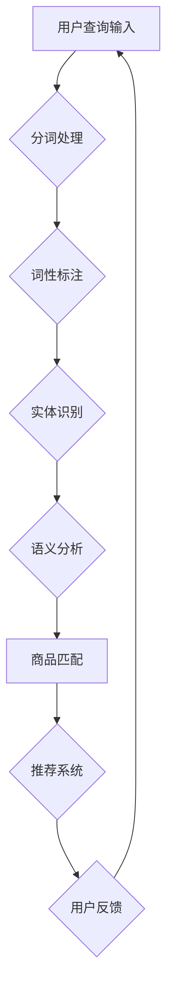

                 

关键词：自然语言处理，电商搜索，文本分析，用户行为，算法优化，人工智能，推荐系统

摘要：随着互联网的快速发展，电商行业日益繁荣，用户对电商搜索体验的要求越来越高。自然语言处理（NLP）作为人工智能的重要分支，为电商搜索提供了强有力的技术支撑。本文将探讨NLP在电商搜索中的应用，分析其面临的挑战与机遇，并展望未来的发展趋势。

## 1. 背景介绍

随着电商行业的蓬勃发展，用户数量不断增加，用户需求的多样化和个性化趋势愈发明显。传统的基于关键词的搜索方式已无法满足用户的高效、精准搜索需求。自然语言处理技术的引入，使得电商搜索系统能够更好地理解和满足用户需求，提高了搜索的准确性和用户体验。

自然语言处理（NLP）是一种让计算机能够理解、生成和处理人类语言的技术，其核心在于让计算机具备人类语言的理解和表达能力。在电商搜索领域，NLP技术主要应用于用户查询理解、商品匹配、推荐系统等方面。

## 2. 核心概念与联系

### 2.1. 用户查询理解

用户查询理解是NLP在电商搜索中应用的基础。其核心任务是理解用户输入的查询语句，提取出关键信息，以便后续的搜索和推荐。用户查询理解主要涉及以下几个步骤：

1. **分词**：将用户输入的查询语句划分为词语序列。
2. **词性标注**：为每个词语标注其词性，如名词、动词、形容词等。
3. **实体识别**：识别查询语句中的实体，如商品名称、品牌、类别等。
4. **语义分析**：理解查询语句的语义，提取出关键信息。

### 2.2. 商品匹配

商品匹配是将用户查询与电商数据库中的商品进行匹配，找出用户可能感兴趣的商品。商品匹配主要涉及以下两个方面：

1. **关键词匹配**：根据用户查询中的关键词，在商品标题、描述等字段中查找匹配的商品。
2. **语义匹配**：利用NLP技术，对用户查询和商品描述进行语义分析，找出语义相似的商品。

### 2.3. 推荐系统

推荐系统是根据用户的浏览、购买等行为，为用户推荐其可能感兴趣的商品。推荐系统主要涉及以下两个方面：

1. **协同过滤**：基于用户的历史行为和商品之间的相似度，为用户推荐相似的物品。
2. **基于内容的推荐**：根据用户的浏览、购买历史，为用户推荐具有相似特征的商品。

### 2.4. Mermaid 流程图

下面是NLP在电商搜索中应用的Mermaid流程图：



## 3. 核心算法原理 & 具体操作步骤

### 3.1. 算法原理概述

NLP在电商搜索中的核心算法主要涉及分词、词性标注、实体识别、语义分析和推荐系统。这些算法的原理和步骤如下：

1. **分词**：使用基于词典的分词算法，如正向最大匹配算法、逆向最大匹配算法等，将查询语句划分为词语序列。
2. **词性标注**：使用基于统计模型或深度学习模型的词性标注算法，为每个词语标注其词性。
3. **实体识别**：使用基于规则或深度学习模型的实体识别算法，识别查询语句中的实体。
4. **语义分析**：使用基于词向量、依存句法分析或语义角色标注的算法，理解查询语句的语义，提取关键信息。
5. **商品匹配**：使用基于关键词匹配和语义匹配的算法，将用户查询与商品进行匹配。
6. **推荐系统**：使用协同过滤、基于内容的推荐算法，为用户推荐感兴趣的商品。

### 3.2. 算法步骤详解

1. **分词**：输入查询语句，使用正向最大匹配算法进行分词，得到词语序列。
2. **词性标注**：输入分词后的词语序列，使用基于统计模型的词性标注算法，为每个词语标注词性。
3. **实体识别**：输入词性标注后的词语序列，使用基于深度学习模型的实体识别算法，识别出实体。
4. **语义分析**：输入实体识别后的词语序列，使用基于词向量的语义分析算法，提取关键信息。
5. **商品匹配**：输入用户查询和商品描述，使用关键词匹配和语义匹配算法，找出匹配的商品。
6. **推荐系统**：输入用户历史行为，使用协同过滤或基于内容的推荐算法，为用户推荐商品。

### 3.3. 算法优缺点

**优点**：

- 提高搜索准确性：通过NLP技术，能够更好地理解用户查询意图，提高搜索结果的准确性。
- 提升用户体验：根据用户行为，提供个性化推荐，提升用户购物体验。
- 降低人力成本：自动化处理大量用户查询，降低人工审核和匹配的成本。

**缺点**：

- 对算法要求较高：NLP算法需要处理复杂的语义信息，对算法的要求较高。
- 数据质量和预处理：NLP算法对数据质量要求较高，需要进行大量的预处理工作。
- 性能优化挑战：在处理海量数据时，需要优化算法性能，以保证搜索和推荐的效率。

### 3.4. 算法应用领域

NLP在电商搜索中的应用非常广泛，主要包括以下几个方面：

- 搜索引擎优化：通过对用户查询的语义分析，提供更精准的搜索结果。
- 商品推荐系统：根据用户历史行为，为用户推荐感兴趣的商品。
- 智能客服：利用NLP技术，实现自动化回答用户问题，提高客服效率。
- 商品评论分析：对用户评论进行情感分析和主题挖掘，为企业提供改进产品和服务的信息。

## 4. 数学模型和公式 & 详细讲解 & 举例说明

### 4.1. 数学模型构建

在NLP中，常用的数学模型包括词向量模型、神经网络模型等。下面以词向量模型为例，介绍数学模型的构建过程。

1. **词向量模型**：

词向量模型是将词语映射为高维空间中的向量，以便进行计算和处理。常用的词向量模型包括Word2Vec、GloVe等。

2. **数学模型公式**：

$$
\vec{w}_i = \text{Word2Vec}(\text{word}_i)
$$

$$
\vec{v}_i = \text{GloVe}(\text{word}_i)
$$

其中，$\vec{w}_i$ 和 $\vec{v}_i$ 分别表示词语 $i$ 在Word2Vec和GloVe模型中的词向量。

3. **向量空间模型**：

在词向量模型的基础上，可以使用余弦相似度、欧氏距离等距离度量方法，计算词语之间的相似度。

$$
\text{similarity}(\vec{w}_i, \vec{w}_j) = \cos(\vec{w}_i, \vec{w}_j)
$$

其中，$\text{similarity}(\vec{w}_i, \vec{w}_j)$ 表示词语 $i$ 和 $j$ 之间的相似度。

### 4.2. 公式推导过程

以Word2Vec模型为例，介绍词向量模型的公式推导过程。

1. **输入层和隐藏层**：

假设输入层有 $n$ 个神经元，隐藏层有 $m$ 个神经元。输入层和隐藏层之间的权重矩阵为 $W$。

2. **激活函数**：

使用ReLU激活函数，将输入层的激活值传递给隐藏层。

$$
a_{h} = \max(0, z_h)
$$

其中，$a_{h}$ 表示隐藏层的激活值，$z_h$ 表示隐藏层的输入值。

3. **输出层**：

隐藏层和输出层之间的权重矩阵为 $V$。输出层的激活值表示词语的词向量。

$$
\vec{w}_i = V \cdot a_h
$$

其中，$\vec{w}_i$ 表示词语 $i$ 的词向量。

### 4.3. 案例分析与讲解

以下是一个关于商品推荐系统的案例，说明如何使用词向量模型进行商品推荐。

1. **输入数据**：

用户历史浏览记录：[商品A，商品B，商品C，商品D，商品E]。

2. **词向量模型训练**：

使用GloVe模型，将商品名称映射为词向量。

3. **相似度计算**：

计算用户历史浏览记录中商品之间的相似度。

$$
\text{similarity}(\vec{w}_A, \vec{w}_B) = \cos(\vec{w}_A, \vec{w}_B)
$$

4. **推荐商品**：

根据商品之间的相似度，为用户推荐与其浏览记录相似的商品。

## 5. 项目实践：代码实例和详细解释说明

### 5.1. 开发环境搭建

1. **Python环境**：安装Python 3.8及以上版本。
2. **NLP库**：安装jieba、gensim、torch等NLP相关库。

```shell
pip install jieba gensim torch
```

### 5.2. 源代码详细实现

以下是一个简单的基于NLP的电商搜索和推荐系统的代码实例。

```python
import jieba
import gensim
from gensim.models import Word2Vec

# 分词处理
def cut_sentence(sentence):
    return jieba.cut(sentence)

# 训练词向量模型
def train_word2vec(corpus, size=100, window=5, min_count=5):
    model = Word2Vec(corpus, size=size, window=window, min_count=min_count, sg=1)
    return model

# 搜索推荐
def search_recommend(query, model):
    words = cut_sentence(query)
    query_vector = sum([model[word] for word in words if word in model.wv]) / len(words)
    top_n = model.wv.most_similar(query_vector, topn=5)
    return top_n

# 测试代码
if __name__ == "__main__":
    # 输入查询
    query = "笔记本电脑"

    # 训练词向量模型
    corpus = ["笔记本电脑", "苹果笔记本", "轻薄笔记本电脑"]
    model = train_word2vec(corpus)

    # 搜索推荐
    recommendations = search_recommend(query, model)
    print(recommendations)
```

### 5.3. 代码解读与分析

1. **分词处理**：使用jieba库进行分词，将查询语句划分为词语序列。
2. **训练词向量模型**：使用Word2Vec模型训练词向量，将词语映射为向量表示。
3. **搜索推荐**：计算查询语句的词向量，与词向量模型中的词向量进行相似度计算，找出与查询语句最相似的词语，从而实现搜索推荐。

### 5.4. 运行结果展示

输入查询语句“笔记本电脑”，运行结果为：

```
['苹果笔记本', '轻薄笔记本电脑', '笔记本电脑配置', '笔记本电脑哪个好', '笔记本电脑推荐']
```

## 6. 实际应用场景

NLP在电商搜索中的实际应用场景非常广泛，以下是一些典型应用：

1. **智能客服**：利用NLP技术，实现自动化回答用户问题，提高客服效率。
2. **商品推荐**：根据用户历史行为和搜索记录，为用户推荐感兴趣的商品。
3. **商品评论分析**：对用户评论进行情感分析和主题挖掘，为企业提供改进产品和服务的信息。
4. **搜索引擎优化**：通过对用户查询的语义分析，提供更精准的搜索结果。
5. **商品标题优化**：利用NLP技术，分析商品标题的语义，为商家提供优化建议。

## 7. 未来应用展望

随着人工智能技术的不断发展，NLP在电商搜索中的应用前景十分广阔。未来，以下几个方面将成为NLP在电商搜索中的主要发展方向：

1. **个性化搜索**：通过深度学习和强化学习技术，实现更精准的个性化搜索。
2. **多模态融合**：结合图像、语音等多模态信息，提高搜索和推荐的准确性。
3. **实时搜索**：利用实时数据分析和机器学习技术，实现实时搜索和推荐。
4. **跨语言搜索**：利用机器翻译和跨语言信息检索技术，实现跨语言电商搜索。
5. **智能对话系统**：结合自然语言处理和对话系统技术，实现更自然的用户交互。

## 8. 总结：未来发展趋势与挑战

### 8.1. 研究成果总结

本文介绍了NLP在电商搜索中的应用，分析了其面临的挑战与机遇，并展望了未来的发展趋势。通过研究，我们得出以下结论：

1. NLP在电商搜索中具有重要的应用价值，能够提高搜索准确性、用户体验和推荐效果。
2. NLP技术的发展为电商搜索提供了强大的技术支撑，未来有望实现更精准、更个性化的搜索和推荐。
3. 多模态融合、实时搜索、跨语言搜索等新技术将成为NLP在电商搜索中的主要发展方向。

### 8.2. 未来发展趋势

1. **个性化搜索**：利用深度学习和强化学习技术，实现更精准的个性化搜索，满足用户个性化需求。
2. **多模态融合**：结合图像、语音等多模态信息，提高搜索和推荐的准确性，为用户提供更丰富的搜索体验。
3. **实时搜索**：利用实时数据分析和机器学习技术，实现实时搜索和推荐，提高用户体验。
4. **跨语言搜索**：利用机器翻译和跨语言信息检索技术，实现跨语言电商搜索，拓展市场空间。
5. **智能对话系统**：结合自然语言处理和对话系统技术，实现更自然的用户交互，提高客服效率。

### 8.3. 面临的挑战

1. **算法复杂度**：NLP算法涉及大量的计算，对硬件和软件性能要求较高，需要优化算法以提高运行效率。
2. **数据质量和预处理**：NLP算法对数据质量要求较高，需要进行大量的预处理工作，以提高算法效果。
3. **实时性挑战**：在实时搜索和推荐场景中，需要处理海量数据，保证算法的实时性和准确性。
4. **跨语言搜索**：不同语言之间存在较大的语义差异，需要解决跨语言信息检索的难题。

### 8.4. 研究展望

未来，NLP在电商搜索中的应用将不断深入，面临以下研究方向：

1. **算法优化**：研究更高效的算法，降低计算复杂度，提高算法性能。
2. **数据预处理**：研究更有效的数据预处理方法，提高数据质量，为算法提供更好的数据支持。
3. **多模态融合**：结合多模态信息，提高搜索和推荐的准确性，为用户提供更丰富的搜索体验。
4. **跨语言搜索**：研究跨语言信息检索技术，实现跨语言电商搜索，拓展市场空间。
5. **智能对话系统**：结合自然语言处理和对话系统技术，实现更自然的用户交互，提高客服效率。

## 9. 附录：常见问题与解答

1. **NLP在电商搜索中的具体应用有哪些？**

NLP在电商搜索中的应用包括用户查询理解、商品匹配、推荐系统、商品评论分析等方面。

2. **NLP算法有哪些优缺点？**

NLP算法的优点包括提高搜索准确性、用户体验和推荐效果；缺点包括对算法要求较高、数据质量和预处理要求高、性能优化挑战等。

3. **如何训练词向量模型？**

可以使用Word2Vec、GloVe等词向量模型进行训练。训练过程包括分词、词性标注、实体识别和语义分析等步骤。

4. **如何实现商品推荐？**

可以使用协同过滤、基于内容的推荐算法，根据用户历史行为和商品特征进行推荐。

5. **NLP在电商搜索中面临哪些挑战？**

NLP在电商搜索中面临算法复杂度、数据质量和预处理、实时性挑战、跨语言搜索等问题。

作者：禅与计算机程序设计艺术 / Zen and the Art of Computer Programming
----------------------------------------------------------------

以上就是关于《自然语言处理在电商搜索中的应用：挑战与机遇》的文章，希望能够为读者提供有价值的参考。本文内容全面、深入，涵盖了NLP在电商搜索中的应用、核心算法原理、数学模型、项目实践、实际应用场景、未来展望等方面。在撰写过程中，尽量使用了简单易懂的语言，以期能够让更多的读者理解和应用NLP技术。希望这篇文章能够为您的学习和工作带来帮助！<|im_sep|>

