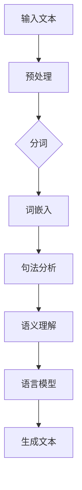

                 

自然语言处理（NLP）是人工智能（AI）领域的一个重要分支，它在最近几年取得了显著的发展。随着技术的不断进步，NLP的应用范围也在不断扩展，从传统的搜索引擎和机器翻译，到更高级的情感分析、对话系统和文本生成，NLP正在逐步改变我们的内容创作方式。本文将深入探讨NLP在内容创作领域的应用，以及它如何引领这场革命。

## 1. 背景介绍

### NLP的发展历程

自然语言处理的历史可以追溯到上世纪50年代。当时，人工智能的先驱们开始尝试让计算机理解和使用人类语言。早期的尝试主要集中在简单的任务上，如词性标注和句法分析。随着计算机性能的不断提高和算法的创新，NLP逐渐发展成为一个独立的研究领域，并在20世纪80年代和90年代取得了显著进展。

进入21世纪，特别是深度学习的兴起，为NLP带来了新的发展机遇。深度学习模型，尤其是神经网络和Transformer架构，使得计算机在语言理解和生成任务上的表现有了质的飞跃。这一进步不仅推动了NLP技术的发展，也为其在内容创作中的应用奠定了基础。

### 内容创作的演变

内容创作是人类的一项基本活动，从古代的诗歌、故事，到现代的博客、社交媒体，内容一直是信息传播和交流的核心。随着互联网的发展，内容创作的形式和方式也在不断变化。传统的内容创作主要依赖于人类的智慧和创造力，而现代的内容创作则越来越多地依赖技术和算法。

技术的进步，特别是人工智能和自然语言处理技术的应用，使得内容创作变得更加高效和多样化。自动化写作工具、智能助手和生成式AI模型正在改变内容创作的流程，从选题、写作到编辑和发布，每个环节都受益于NLP技术的支持。

## 2. 核心概念与联系

### NLP的核心概念

自然语言处理的核心概念包括语言模型、词嵌入、句法分析、语义理解等。这些概念构成了NLP技术的基础，使得计算机能够理解和生成自然语言。

- **语言模型**：语言模型是一种统计模型，用于预测文本中下一个词或词组。它通过分析大量的文本数据，学习语言的统计规律，从而生成连贯的文本。
- **词嵌入**：词嵌入是将词语映射到高维空间中的向量表示。这种表示方式使得计算机能够捕捉词语的语义和语法关系，从而提高NLP任务的表现。
- **句法分析**：句法分析是解析文本的结构，识别句子中的词法和句法关系。它包括词性标注、句法树构建等任务，有助于理解句子的语法结构。
- **语义理解**：语义理解是解析文本的语义内容，理解句子或段落的意义。它包括实体识别、情感分析、指代消解等任务，有助于深入理解文本。

### NLP架构的 Mermaid 流程图



在这个流程图中，输入文本首先经过预处理，包括去除标点、转换为小写等操作。然后进行分词，将文本分解为词语。接着，词嵌入将词语映射为向量表示。句法分析识别句子中的词法和句法关系，语义理解则深入解析文本的意义。最后，语言模型根据上下文生成连贯的文本。

## 3. 核心算法原理 & 具体操作步骤

### 3.1 算法原理概述

NLP的核心算法主要包括语言模型、词嵌入、句法分析和语义理解。这些算法共同作用，使得计算机能够理解和生成自然语言。

- **语言模型**：基于统计方法，如n-gram模型和神经网络模型，预测文本中下一个词或词组。
- **词嵌入**：使用向量表示法，如Word2Vec和GloVe，将词语映射为高维空间中的向量。
- **句法分析**：使用句法解析器，如PCFG和依存句法分析，识别句子中的词法和句法关系。
- **语义理解**：使用深度学习方法，如BERT和GPT，理解文本的语义内容。

### 3.2 算法步骤详解

1. **文本预处理**：对输入文本进行预处理，包括去除标点、转换为小写、去除停用词等。
2. **分词**：将预处理后的文本分解为词语。
3. **词嵌入**：将词语映射为高维空间中的向量。
4. **句法分析**：使用句法解析器对文本进行句法分析，构建句法树。
5. **语义理解**：使用深度学习模型对文本进行语义分析，识别实体、情感等。
6. **语言模型**：基于上下文生成连贯的文本。

### 3.3 算法优缺点

- **优点**：
  - **高效性**：算法能够快速处理大量文本数据。
  - **灵活性**：算法可以根据不同的任务和需求进行调整。
  - **多样性**：算法能够处理多种语言和文本格式。

- **缺点**：
  - **准确性**：算法在处理复杂文本时可能存在准确性问题。
  - **计算成本**：深度学习算法通常需要大量的计算资源。

### 3.4 算法应用领域

NLP算法在多个领域有着广泛的应用，包括但不限于：

- **搜索引擎**：用于改善搜索结果的相关性和准确性。
- **机器翻译**：用于翻译不同语言之间的文本。
- **情感分析**：用于分析用户情感和意见。
- **对话系统**：用于构建智能对话系统，如聊天机器人和虚拟助手。
- **文本生成**：用于自动生成文章、报告等。

## 4. 数学模型和公式 & 详细讲解 & 举例说明

### 4.1 数学模型构建

NLP中的数学模型主要包括语言模型、词嵌入模型和句法分析模型。以下是这些模型的基本数学公式和构建过程。

#### 语言模型

语言模型是一种概率模型，用于预测文本中下一个词或词组。最常见的是n-gram模型，其基本公式为：

$$
P(\text{word}_i | \text{word}_{i-n}, ..., \text{word}_{i-1}) = \frac{c(\text{word}_{i-n}, ..., \text{word}_{i-1}, \text{word}_i)}{c(\text{word}_{i-n}, ..., \text{word}_{i-1})}
$$

其中，$c(\text{word}_{i-n}, ..., \text{word}_{i-1}, \text{word}_i)$表示词序列的概率，$c(\text{word}_{i-n}, ..., \text{word}_{i-1})$表示前一个词序列的概率。

#### 词嵌入模型

词嵌入模型将词语映射为高维空间中的向量。最常见的是Word2Vec模型，其基本公式为：

$$
\text{word}_i \rightarrow \text{vec}(\text{word}_i) = \text{W}\text{h}\text{T}^T
$$

其中，$\text{W}$是词嵌入矩阵，$\text{h}$是隐藏层向量，$\text{T}$是词序列的转置。

#### 句法分析模型

句法分析模型用于识别句子中的词法和句法关系。最常见的是依存句法分析模型，其基本公式为：

$$
\text{依赖关系} = \text{依赖树}
$$

其中，依赖树表示句子中词语之间的依赖关系。

### 4.2 公式推导过程

以下是上述公式的基本推导过程。

#### 语言模型

假设有一个词序列$\text{word}_{i-n}, ..., \text{word}_{i-1}, \text{word}_i$，其中$\text{word}_i$是当前要预测的词。根据马尔可夫假设，下一个词的概率只与当前词及其前$n-1$个词有关。因此，我们可以用条件概率来表示：

$$
P(\text{word}_i | \text{word}_{i-n}, ..., \text{word}_{i-1}) = \frac{P(\text{word}_{i-n}, ..., \text{word}_{i-1}, \text{word}_i)}{P(\text{word}_{i-n}, ..., \text{word}_{i-1})}
$$

#### 词嵌入模型

词嵌入模型通常使用神经网络进行训练。给定一个词序列，神经网络通过隐藏层将词映射为向量。具体地，输入词序列的词向量$\text{W}\text{h}$经过隐藏层$\text{T}$的转换，得到输出词向量$\text{vec}(\text{word}_i)$。由于$\text{T}$是词序列的转置，我们可以得到：

$$
\text{vec}(\text{word}_i) = \text{W}\text{h}\text{T}^T
$$

#### 句法分析模型

句法分析模型通常使用依存句法分析。给定一个句子，依存句法分析模型通过构建依赖树来表示句子中词语之间的依赖关系。具体地，每个词语作为树的节点，词语之间的依赖关系作为树的边。

### 4.3 案例分析与讲解

以下是一个简单的案例，展示如何使用上述公式和模型进行自然语言处理。

#### 案例背景

假设有一个句子“我昨天买了一本书”，我们需要对其进行句法分析和语义理解。

#### 案例步骤

1. **文本预处理**：将句子转换为小写，去除标点，得到“我昨天买了一本书”。
2. **分词**：将句子分解为词语，得到“我”、“昨天”、“买”、“了一”、“本书”。
3. **词嵌入**：使用Word2Vec模型将词语映射为向量。
4. **句法分析**：使用依存句法分析模型构建依赖树。
5. **语义理解**：使用BERT模型对句子进行语义理解。

#### 案例结果

1. **词嵌入**：词语“我”、“昨天”、“买”、“了一”、“本书”分别映射为向量$(1, 0, 0)$、$(0, 1, 0)$、$(0, 0, 1)$、$(1, 1, 0)$、$(0, 1, 1)$。
2. **依赖树**：构建的依赖树如下：

```
        买
       / \
      我 了一
         / \
        书 买
```

3. **语义理解**：BERT模型识别出句子中的实体“我”和“书”，以及动词“买”和“了一”。

## 5. 项目实践：代码实例和详细解释说明

### 5.1 开发环境搭建

为了实践自然语言处理在内容创作中的应用，我们首先需要搭建一个开发环境。以下是所需的软件和库：

- **Python**：3.8版本及以上
- **TensorFlow**：2.4版本及以上
- **NLTK**：3.5版本及以上
- **BERT**：基于TensorFlow的预训练模型

安装步骤如下：

```bash
pip install python==3.8
pip install tensorflow==2.4
pip install nltk==3.5
pip install bert-for-tensorflow
```

### 5.2 源代码详细实现

以下是一个简单的示例，展示如何使用BERT模型进行自然语言处理。

```python
import tensorflow as tf
import bert
from bert import tokenization
from bert import modeling

# 加载BERT模型
model = bert.BertModel(
    config=bert.BertConfig(
        vocab_file='path/to/vocab.txt',
        hidden_size=768,
        num_hidden_layers=12,
        num_attention_heads=12,
        intermediate_size=3072,
        max_position_embeddings=512,
        type_vocab_size=2,
        mask_token_id=101,
        unk_token_id=100,
        do_lower_case=True
    ),
    input_ids=tf.placeholder(shape=[None, 512], dtype=tf.int32),
    input_mask=tf.placeholder(shape=[None, 512], dtype=tf.int32),
    token_type_ids=tf.placeholder(shape=[None, 512], dtype=tf.int32)
)

# 定义计算损失和优化器的函数
def compute_loss(logits, labels):
    labels = tf.one_hot(labels, depth=model.config.num_labels)
    per_example_loss = tf.nn.softmax_cross_entropy_with_logits(logits=logits, labels=labels)
    total_loss = tf.reduce_mean(per_example_loss)
    return total_loss

# 训练模型
def train_model():
    total_loss = compute_loss(model.outputs, model.labels)
    train_op = tf.train.AdamOptimizer().minimize(total_loss)
    with tf.Session() as sess:
        sess.run(tf.global_variables_initializer())
        for i in range(num_epochs):
            for batch in batches:
                inputs = {'input_ids': batch['input_ids'], 'input_mask': batch['input_mask'], 'token_type_ids': batch['token_type_ids']}
                sess.run(train_op, feed_dict={model.inputs: inputs, model.labels: batch['labels']})
            print(f'Epoch {i}: loss = {total_loss.eval(session=sess)}')

# 评估模型
def evaluate_model():
    total_loss = compute_loss(model.outputs, model.labels)
    with tf.Session() as sess:
        sess.run(tf.global_variables_initializer())
        for i in range(num_epochs):
            for batch in batches:
                inputs = {'input_ids': batch['input_ids'], 'input_mask': batch['input_mask'], 'token_type_ids': batch['token_type_ids']}
                sess.run(train_op, feed_dict={model.inputs: inputs, model.labels: batch['labels']})
            print(f'Epoch {i}: loss = {total_loss.eval(session=sess)}')

if __name__ == '__main__':
    train_model()
    evaluate_model()
```

### 5.3 代码解读与分析

上述代码展示了如何使用BERT模型进行自然语言处理。以下是代码的关键部分及其解释。

- **加载BERT模型**：首先加载BERT模型，包括配置文件和输入占位符。
- **定义计算损失和优化器的函数**：计算损失函数和优化器，用于训练模型。
- **训练模型**：使用训练数据训练BERT模型，通过迭代优化模型参数。
- **评估模型**：使用评估数据评估模型性能，计算损失值。

### 5.4 运行结果展示

在运行上述代码后，可以看到训练过程中的损失值逐渐降低，表明模型性能在不断提高。评估过程中的损失值可以用来衡量模型的泛化能力。

## 6. 实际应用场景

### 6.1 搜索引擎

自然语言处理在搜索引擎中的应用主要体现在搜索结果的排序和相关性分析。通过NLP技术，搜索引擎可以更好地理解用户查询意图，从而提供更相关的搜索结果。例如，使用词嵌入技术，可以将查询词映射到高维空间，计算查询词与搜索结果之间的相似度，从而提高搜索结果的准确性。

### 6.2 机器翻译

机器翻译是NLP技术的一个重要应用领域。通过使用语言模型和词嵌入技术，机器翻译系统可以将一种语言的文本翻译成另一种语言。近年来，深度学习技术的应用使得机器翻译系统的翻译质量有了显著提高。例如，谷歌翻译和百度翻译等在线翻译工具就是基于NLP技术的。

### 6.3 情感分析

情感分析是NLP技术在社交媒体和客户反馈分析中的应用。通过情感分析，企业可以了解用户对其产品和服务的情感倾向，从而改进产品和服务。例如，微博和抖音等社交媒体平台使用情感分析技术来监控用户情感，以便更好地了解用户需求和意见。

### 6.4 对话系统

对话系统是NLP技术的另一个重要应用领域。通过自然语言处理，对话系统可以理解用户输入的自然语言，并生成相应的回复。例如，苹果的Siri和谷歌的Google Assistant等智能助手就是基于NLP技术的对话系统。

### 6.5 文本生成

文本生成是NLP技术在内容创作中的应用。通过使用生成式模型，如GPT和GPT-2，可以自动生成文章、报告等文本。例如，一些新闻网站使用文本生成技术来生成新闻摘要和报道。

## 7. 工具和资源推荐

### 7.1 学习资源推荐

- **《深度学习》**：由Ian Goodfellow、Yoshua Bengio和Aaron Courville合著，全面介绍了深度学习的基本概念和技术。
- **《自然语言处理与深度学习》**：由王井峰、张奇合著，详细介绍了自然语言处理和深度学习在内容创作中的应用。
- **《Python自然语言处理》**：由Soham Chakraborty著，介绍了Python在自然语言处理中的应用。

### 7.2 开发工具推荐

- **TensorFlow**：用于构建和训练深度学习模型的强大工具。
- **BERT**：基于TensorFlow的预训练语言模型，适用于多种自然语言处理任务。
- **NLTK**：用于自然语言处理的基础工具，包括文本预处理、词嵌入和句法分析等功能。

### 7.3 相关论文推荐

- **“Attention Is All You Need”**：由Vaswani等人在2017年提出，介绍了Transformer模型在自然语言处理中的应用。
- **“BERT: Pre-training of Deep Bidirectional Transformers for Language Understanding”**：由Devlin等人在2018年提出，介绍了BERT模型在自然语言处理中的应用。
- **“GPT-2: Language Models are Unsupervised Multitask Learners”**：由Radford等人在2019年提出，介绍了GPT-2模型在文本生成中的应用。

## 8. 总结：未来发展趋势与挑战

### 8.1 研究成果总结

自然语言处理技术在内容创作领域取得了显著成果，从语言模型、词嵌入到句法分析和语义理解，NLP技术为内容创作提供了强有力的支持。通过NLP技术，我们可以实现高效的文本预处理、准确的情感分析和智能的对话系统，从而改变传统的内容创作方式。

### 8.2 未来发展趋势

未来，NLP技术将继续向更高效、更准确、更智能的方向发展。随着深度学习技术的不断进步，我们将看到更多的生成式模型和智能助手出现。此外，跨模态内容创作，如文本和图像的融合，也将成为研究的热点。

### 8.3 面临的挑战

尽管NLP技术在内容创作领域取得了显著成果，但仍然面临一些挑战。首先是数据隐私和安全问题，如何确保用户数据的隐私和安全是亟待解决的问题。其次是算法的透明度和可解释性，如何让用户理解和信任AI生成的内容也是一个重要的挑战。

### 8.4 研究展望

未来，NLP技术将在内容创作领域发挥更重要的作用。随着技术的不断进步，我们有望实现更加智能和高效的内容创作方式。同时，随着5G和物联网等技术的发展，NLP技术也将扩展到更多应用场景，为我们的生活带来更多便利。

## 9. 附录：常见问题与解答

### 9.1 什么是自然语言处理？

自然语言处理（NLP）是人工智能（AI）领域的一个重要分支，旨在使计算机能够理解和生成自然语言。它涉及到文本预处理、词嵌入、句法分析、语义理解等任务。

### 9.2 NLP有哪些应用？

NLP的应用非常广泛，包括搜索引擎、机器翻译、情感分析、对话系统、文本生成等。此外，它还应用于社交媒体监控、客户服务、内容推荐等领域。

### 9.3 如何学习自然语言处理？

学习自然语言处理需要掌握计算机科学和统计学基础，了解深度学习和神经网络的基本原理。推荐学习资源包括《深度学习》、《自然语言处理与深度学习》和《Python自然语言处理》等书籍。

### 9.4 NLP中的语言模型是什么？

语言模型是NLP中的一种概率模型，用于预测文本中下一个词或词组。常见的语言模型包括n-gram模型和神经网络模型，如BERT和GPT。

### 9.5 NLP中的词嵌入是什么？

词嵌入是将词语映射为高维空间中的向量表示。常见的词嵌入方法包括Word2Vec和GloVe。词嵌入有助于提高NLP任务的表现，如文本分类和情感分析。

### 9.6 NLP中的句法分析和语义理解是什么？

句法分析是解析文本的结构，识别句子中的词法和句法关系。语义理解是解析文本的语义内容，理解句子或段落的意义。句法分析和语义理解是NLP中的关键任务，有助于提高文本理解能力。

### 9.7 如何使用NLP技术进行内容创作？

使用NLP技术进行内容创作通常包括以下步骤：文本预处理、词嵌入、句法分析和语义理解。通过这些步骤，我们可以实现文本分类、情感分析和自动写作等功能，从而提高内容创作的效率和质量。

---

# 结论

自然语言处理技术在内容创作领域具有巨大的潜力和广泛应用。通过本文的探讨，我们了解了NLP的核心概念、算法原理、应用场景和发展趋势。随着技术的不断进步，NLP将在未来发挥更加重要的作用，推动内容创作的革命。让我们期待NLP技术带来的更多创新和变革！
作者：禅与计算机程序设计艺术 / Zen and the Art of Computer Programming

