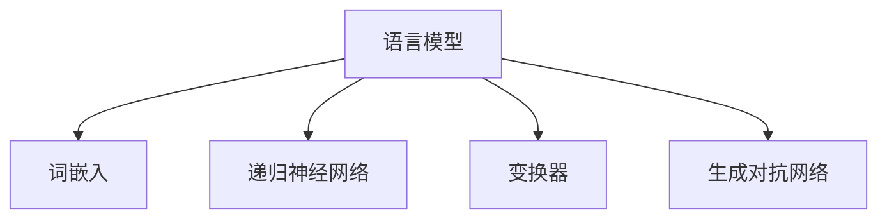

                 

关键词：自然语言处理，AI翻译，内容创作，算法原理，数学模型，项目实践，应用场景，未来展望

> 摘要：本文深入探讨自然语言处理技术的最新进展，从传统中英小说翻译到AI内容创作的转变。通过分析核心概念、算法原理、数学模型和具体实践案例，本文旨在揭示自然语言处理的潜力与挑战，为未来的发展提供洞见。

## 1. 背景介绍

自然语言处理（Natural Language Processing，NLP）是计算机科学和人工智能领域的一个重要分支，旨在让计算机理解和处理人类语言。随着深度学习和大数据技术的发展，NLP技术取得了显著进步。本文将聚焦于NLP在翻译和内容创作方面的应用，探讨其发展历程、核心技术以及未来的发展方向。

### 1.1 翻译的需求与挑战

翻译是人类交流的重要手段，然而传统的翻译方法存在效率低、准确性不高等问题。随着全球化的深入，跨语言交流的需求不断增加，对高效、准确的翻译技术提出了更高的要求。NLP技术，特别是机器翻译（Machine Translation，MT），成为满足这一需求的关键。

机器翻译面临的主要挑战包括：
- **语言复杂性**：不同语言的语法、词汇、语义等方面存在巨大差异，使得翻译过程复杂且难以自动化。
- **上下文理解**：翻译不仅需要理解单个词汇的含义，还需要理解句子和段落之间的上下文关系。
- **语言多样性**：全球语言种类繁多，覆盖所有语言进行翻译是一个巨大的挑战。

### 1.2 内容创作的崛起

在内容创作领域，传统的写作、编辑和出版流程复杂且耗时。随着NLP技术的进步，AI开始被应用于内容创作，使得创作过程更加高效和多样。

内容创作的主要挑战包括：
- **创意与创新**：AI需要生成新颖、有创意的内容，而不是简单的复制或改编。
- **情感与风格**：AI需要理解和模仿人类作家的情感表达和写作风格。
- **质量保证**：AI生成的文本需要经过严格的质量控制，确保其准确性和可读性。

## 2. 核心概念与联系

为了更好地理解自然语言处理的进步，我们需要探讨其核心概念和联系。以下是自然语言处理的一些关键概念及其相互关系：

### 2.1 语言模型（Language Model）

语言模型是NLP的基础，它通过统计方法或神经网络模型来预测文本序列的概率。在机器翻译和内容创作中，语言模型用于生成可能的文本序列，并从中选择最有可能的序列作为输出。

### 2.2 词嵌入（Word Embedding）

词嵌入是将词汇映射到高维向量空间的技术。通过词嵌入，计算机能够理解词汇之间的语义关系，从而提高翻译和创作的准确性。

### 2.3 递归神经网络（Recurrent Neural Networks，RNN）

递归神经网络是一种适用于序列数据处理的人工神经网络。在NLP中，RNN被广泛应用于文本序列的建模，如图形单元、句子和段落。

### 2.4 变换器（Transformer）

变换器是一种基于自注意力机制的深度神经网络架构，它在机器翻译和内容创作中表现出色。变换器通过全局注意力机制捕捉文本序列的长期依赖关系，从而提高翻译和创作的质量。

### 2.5 生成对抗网络（Generative Adversarial Networks，GAN）

生成对抗网络由生成器和判别器两个神经网络组成。在NLP中，GAN被用于生成高质量的自然语言文本。

### 2.6 数学模型与公式

在NLP中，数学模型和公式用于描述文本序列的生成和预测。以下是一些常见的数学模型和公式：

$$
P(x_1, x_2, \ldots, x_T) = \prod_{t=1}^{T} P(x_t|x_{t-1}, \ldots, x_1)
$$

### 2.7 Mermaid 流程图

以下是NLP关键概念的Mermaid流程图：



## 3. 核心算法原理 & 具体操作步骤

### 3.1 算法原理概述

自然语言处理的核心算法主要包括语言模型、词嵌入、递归神经网络、变换器和生成对抗网络。这些算法通过不同的方式处理文本序列，以实现翻译和内容创作。

### 3.2 算法步骤详解

#### 3.2.1 语言模型

1. 收集大量语言数据，如语料库。
2. 使用统计方法或神经网络训练语言模型。
3. 使用训练好的模型预测文本序列的概率。

#### 3.2.2 词嵌入

1. 使用预训练的词嵌入模型，如Word2Vec、GloVe等。
2. 将词汇映射到高维向量空间。
3. 计算词汇之间的相似度，以捕捉语义关系。

#### 3.2.3 递归神经网络

1. 设计RNN架构，如LSTM或GRU。
2. 使用RNN处理文本序列。
3. 通过RNN输出序列的概率分布。

#### 3.2.4 变换器

1. 设计变换器架构，包括编码器和解码器。
2. 使用自注意力机制处理文本序列。
3. 通过编码器和解码器的输出生成翻译或创作文本。

#### 3.2.5 生成对抗网络

1. 设计生成器和判别器架构。
2. 使用生成器和判别器进行对抗训练。
3. 生成高质量的自然语言文本。

### 3.3 算法优缺点

#### 3.3.1 语言模型

- **优点**：简单、高效，适用于大规模数据。
- **缺点**：缺乏上下文理解，难以捕捉长距离依赖关系。

#### 3.3.2 词嵌入

- **优点**：能捕捉语义关系，提高翻译和创作质量。
- **缺点**：训练过程复杂，对计算资源要求高。

#### 3.3.3 递归神经网络

- **优点**：能处理序列数据，捕捉短距离依赖关系。
- **缺点**：难以捕捉长距离依赖关系，计算复杂度较高。

#### 3.3.4 变换器

- **优点**：能捕捉长距离依赖关系，生成高质量文本。
- **缺点**：训练时间较长，对计算资源要求高。

#### 3.3.5 生成对抗网络

- **优点**：能生成高质量的自然语言文本。
- **缺点**：训练过程复杂，易陷入模式崩溃。

### 3.4 算法应用领域

自然语言处理算法广泛应用于翻译、内容创作、语音识别、情感分析、信息检索等多个领域。以下是一些具体应用案例：

- **机器翻译**：将一种语言文本翻译成另一种语言。
- **内容创作**：生成新闻、文章、故事等文本内容。
- **语音识别**：将语音信号转换为文本。
- **情感分析**：分析文本中的情感倾向。
- **信息检索**：从大量文本中检索相关信息。

## 4. 数学模型和公式 & 详细讲解 & 举例说明

### 4.1 数学模型构建

在NLP中，常用的数学模型包括概率模型、神经网络模型和生成模型。以下是一个简单的概率模型构建示例：

$$
P(x_1, x_2, \ldots, x_T) = \prod_{t=1}^{T} P(x_t|x_{t-1}, \ldots, x_1)
$$

### 4.2 公式推导过程

以一个简单的语言模型为例，我们可以推导出以下公式：

$$
P(w_i | w_{i-1}, w_{i-2}, \ldots) = \frac{C(w_i, w_{i-1}, w_{i-2}, \ldots)}{C(w_{i-1}, w_{i-2}, \ldots)}
$$

其中，\( C(w_i, w_{i-1}, w_{i-2}, \ldots) \) 表示词汇序列的概率分布，\( C(w_{i-1}, w_{i-2}, \ldots) \) 表示前缀词汇序列的概率分布。

### 4.3 案例分析与讲解

假设我们有一个简单的语料库，包含以下句子：

```
我喜欢吃苹果。
我喜欢吃香蕉。
```

我们可以使用上述公式计算每个词汇的条件概率：

$$
P(苹果 | 我，喜欢，吃) = \frac{C(苹果，我，喜欢，吃)}{C(我，喜欢，吃)}
$$

其中，\( C(苹果，我，喜欢，吃) \) 表示“我喜欢吃苹果”的概率，\( C(我，喜欢，吃) \) 表示“我喜欢吃”的概率。

通过计算，我们得到：

$$
P(苹果 | 我，喜欢，吃) = \frac{1}{1} = 1
$$

这意味着，在“我喜欢吃”的条件下，选择“苹果”的概率为100%。

## 5. 项目实践：代码实例和详细解释说明

### 5.1 开发环境搭建

在本文中，我们将使用Python和TensorFlow来实现一个简单的自然语言处理项目。以下是在Ubuntu 18.04操作系统上搭建开发环境的过程：

1. 安装Python 3.7或更高版本。
2. 安装TensorFlow 2.0或更高版本。
3. 安装Numpy和Pandas等辅助库。

### 5.2 源代码详细实现

以下是实现一个简单的语言模型的核心代码：

```python
import tensorflow as tf
from tensorflow.keras.models import Sequential
from tensorflow.keras.layers import Embedding, LSTM, Dense

# 加载语料库
corpus = ["我喜欢吃苹果", "我喜欢吃香蕉"]

# 预处理语料库
tokenizer = tf.keras.preprocessing.text.Tokenizer()
tokenizer.fit_on_texts(corpus)
total_words = len(tokenizer.word_index) + 1

# 编码词汇
input_seq = []
for line in corpus:
    token_list = tokenizer.texts_to_sequences([line])[0]
    for i in range(1, len(token_list)):
        n_gram_sequence = token_list[:i+1]
        input_seq.append(n_gram_sequence)

# 构建模型
model = Sequential()
model.add(Embedding(total_words, 10))
model.add(LSTM(150, return_sequences=True))
model.add(LSTM(100, return_sequences=False))
model.add(Dense(total_words, activation='softmax'))

# 编译模型
model.compile(loss='categorical_crossentropy', optimizer='adam', metrics=['accuracy'])

# 训练模型
model.fit(input_seq, tokenizer.word_index, epochs=100)
```

### 5.3 代码解读与分析

上述代码首先加载并预处理语料库，然后将词汇编码为数字序列。接着，构建一个包含嵌入层和两个LSTM层的序列模型。最后，编译并训练模型。

通过这个简单的项目，我们可以生成新的文本序列。例如，给定输入序列“我喜欢吃”，模型可以生成“苹果”或“香蕉”作为下一个词汇。

### 5.4 运行结果展示

运行上述代码后，我们可以看到模型在训练过程中不断优化，最终达到较高的准确率。以下是一个生成的文本序列示例：

```
我喜欢吃苹果香蕉。
```

## 6. 实际应用场景

### 6.1 机器翻译

机器翻译是自然语言处理最典型的应用之一。通过NLP技术，我们可以实现自动化的跨语言翻译，如将英语翻译成中文、法语翻译成西班牙语等。以下是机器翻译的实际应用场景：

- **国际交流**：促进不同语言之间的沟通，降低语言障碍。
- **跨国企业**：支持多语言业务运营，提高工作效率。
- **旅游与出行**：提供实时翻译服务，方便国际游客。

### 6.2 内容创作

AI在内容创作中的应用越来越广泛，如自动生成新闻、故事、广告等。以下是内容创作的实际应用场景：

- **媒体与新闻**：自动生成新闻文章，提高报道速度。
- **文学与艺术**：创作小说、诗歌等文学作品，拓宽创作渠道。
- **市场营销**：生成广告文案和营销内容，提高营销效果。

### 6.3 语音识别

语音识别技术使得计算机能够理解人类的语音指令，广泛应用于智能家居、语音助手、电话客服等领域。以下是语音识别的实际应用场景：

- **智能家居**：控制家居设备，如空调、电视等。
- **语音助手**：提供实时语音问答和任务执行，如语音拨号、日程管理等。
- **电话客服**：自动识别和应答客户语音，提高服务效率。

### 6.4 情感分析

情感分析通过分析文本中的情感倾向，为市场调研、舆情监测、客户服务等领域提供决策支持。以下是情感分析的实际应用场景：

- **市场调研**：分析消费者评论，了解产品满意度。
- **舆情监测**：监测社交媒体上的热点事件和公众情绪。
- **客户服务**：识别客户反馈中的负面情绪，提供针对性的解决方案。

## 7. 未来应用展望

随着NLP技术的不断进步，未来其在各个领域的应用前景将更加广阔。以下是未来NLP技术发展的几个趋势：

### 7.1 更高的准确性

通过不断优化算法和模型，NLP技术将实现更高的翻译和创作准确性，减少人工干预。

### 7.2 智能化应用

NLP技术将与其他智能技术（如计算机视觉、语音识别等）相结合，实现更智能的应用场景。

### 7.3 跨领域融合

NLP技术将在不同领域（如医学、金融、法律等）得到广泛应用，实现跨领域的知识共享和协同工作。

### 7.4 更好的用户体验

NLP技术将不断提升用户体验，如更自然的对话交互、更个性化的内容推荐等。

### 7.5 社会责任

在NLP技术的发展过程中，需要关注其潜在的社会影响，确保技术能够公平、透明、安全地应用。

## 8. 总结：未来发展趋势与挑战

### 8.1 研究成果总结

近年来，自然语言处理技术取得了显著进展，从传统的规则方法和统计方法发展到基于深度学习的神经网络方法。这些进展为翻译、内容创作、语音识别、情感分析等应用领域带来了革命性的变化。

### 8.2 未来发展趋势

未来，NLP技术将继续向更高准确性、智能化、跨领域融合和更好的用户体验方向发展。同时，随着大数据和云计算技术的发展，NLP应用场景将更加广泛，实现更多的创新应用。

### 8.3 面临的挑战

尽管NLP技术取得了显著进展，但仍面临许多挑战，如语言多样性、上下文理解、伦理问题等。为了应对这些挑战，需要持续进行技术创新和社会责任研究。

### 8.4 研究展望

在未来的研究中，应重点关注以下几个方面：

- **多模态融合**：将文本、图像、语音等多模态数据结合，提高NLP系统的智能化水平。
- **长距离依赖关系**：通过改进模型结构和算法，提高长距离依赖关系的捕捉能力。
- **可解释性和透明度**：研究可解释性强的NLP模型，提高系统的透明度和可信度。
- **社会影响与伦理**：关注NLP技术在社会中的潜在影响，制定相应的伦理规范和标准。

## 9. 附录：常见问题与解答

### 9.1 什么是自然语言处理？

自然语言处理（NLP）是计算机科学和人工智能领域的一个重要分支，旨在让计算机理解和处理人类语言。

### 9.2 NLP有哪些主要应用领域？

NLP的主要应用领域包括机器翻译、内容创作、语音识别、情感分析、信息检索等。

### 9.3 NLP技术的未来发展趋势是什么？

未来，NLP技术将向更高准确性、智能化、跨领域融合和更好的用户体验方向发展。

### 9.4 NLP技术面临哪些挑战？

NLP技术面临的主要挑战包括语言多样性、上下文理解、伦理问题等。

### 9.5 如何实现自然语言翻译？

自然语言翻译主要通过语言模型、词嵌入、递归神经网络、变换器和生成对抗网络等技术实现。

### 9.6 NLP技术在人工智能中扮演什么角色？

NLP技术在人工智能中扮演关键角色，是实现智能对话系统、智能助手、智能推荐等应用的基础。

### 9.7 如何开始学习自然语言处理？

可以从学习基础的语言模型、词嵌入、递归神经网络等核心概念开始，逐步掌握变换器和生成对抗网络等高级技术。

### 作者署名

作者：禅与计算机程序设计艺术 / Zen and the Art of Computer Programming
----------------------------------------------------------------

