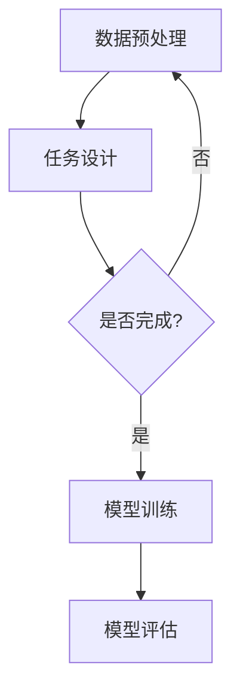

                 

关键词：自监督学习，Self-Supervised Learning，深度学习，无监督学习，预训练，代码实例

> 摘要：自监督学习（Self-Supervised Learning）是一种无监督学习方法，通过对数据进行自动标注，从而让模型在没有人工标注数据的情况下也能进行训练。本文将详细讲解自监督学习的原理，并通过代码实例展示其应用。

## 1. 背景介绍

在深度学习领域，有监督学习、无监督学习和半监督学习是三种主要的机器学习方式。有监督学习需要大量标注数据，而无监督学习则不需要标注数据，但通常很难得到与标注数据相当的模型性能。半监督学习则介于两者之间，利用少量的标注数据和大量的未标注数据进行训练。

然而，现实场景中往往难以获得大量的标注数据，而且标注数据成本高昂。为了解决这一问题，自监督学习应运而生。自监督学习通过设计特殊的任务，使模型在未标注的数据中进行自我监督，从而实现训练。

## 2. 核心概念与联系

### 2.1 自监督学习的核心概念

自监督学习的关键在于如何设计任务，使得模型可以从未标注的数据中学习到有用的信息。以下是几个常见的自监督学习任务：

- **预训练与微调**：预训练是指使用大量未标注的数据对模型进行训练，然后通过微调（Fine-Tuning）将其应用于具体的任务上。
- **填充任务**：给定部分输入数据，让模型预测剩余部分的数据。
- **对比学习**：通过对比相似和不同的数据，让模型学习到数据的特征。
- **生成对抗网络（GAN）**：利用生成器和判别器之间的对抗关系，使生成器生成逼真的数据。

### 2.2 自监督学习的架构

自监督学习的架构通常包含以下几个部分：

- **数据预处理**：对数据进行预处理，如数据增强、去噪等。
- **自监督任务设计**：设计合适的自监督任务，如上述提到的几种任务。
- **模型训练**：使用自监督任务训练模型。
- **模型评估**：使用有标注的数据评估模型性能。

### 2.3 Mermaid 流程图

以下是一个简单的 Mermaid 流程图，展示自监督学习的架构：



## 3. 核心算法原理 & 具体操作步骤

### 3.1 算法原理概述

自监督学习的核心在于如何从未标注的数据中提取有用的信息。常见的自监督学习算法有：

- **预训练**：使用未标注的数据对模型进行预训练，然后通过微调将其应用于具体任务。
- **对比学习**：通过对比相似和不同的数据，让模型学习到数据的特征。
- **生成对抗网络**：利用生成器和判别器之间的对抗关系，使生成器生成逼真的数据。

### 3.2 算法步骤详解

1. 数据预处理
2. 任务设计
3. 模型训练
4. 模型评估

### 3.3 算法优缺点

**优点**：

- 不需要标注数据，降低了数据成本。
- 可以从大量未标注的数据中学习，提高模型性能。

**缺点**：

- 模型性能可能不如有监督学习。
- 需要大量的计算资源。

### 3.4 算法应用领域

自监督学习在图像识别、自然语言处理等领域有广泛应用，例如：

- 图像识别：通过自监督学习提取图像特征，用于分类、分割等任务。
- 自然语言处理：通过自监督学习提取文本特征，用于文本分类、情感分析等任务。

## 4. 数学模型和公式 & 详细讲解 & 举例说明

### 4.1 数学模型构建

自监督学习的数学模型通常基于以下思想：

- **预训练**：使用未标注的数据对模型进行训练，通常使用损失函数来衡量模型预测与真实数据的差异。
- **对比学习**：通过对比相似和不同的数据，使用损失函数来衡量模型对特征的学习程度。
- **生成对抗网络**：利用生成器和判别器之间的对抗关系，通过损失函数来优化模型。

### 4.2 公式推导过程

以预训练为例，常见的损失函数有：

- **交叉熵损失**：用于分类问题，计算模型预测与真实标签之间的差异。
- **均方误差损失**：用于回归问题，计算模型预测与真实值之间的差异。

### 4.3 案例分析与讲解

假设我们有一个图像分类问题，使用自监督学习进行预训练。我们可以设计一个填充任务，给定部分图像，让模型预测剩余部分。以下是具体的步骤：

1. 数据预处理：对图像进行缩放、裁剪等操作。
2. 任务设计：设计一个填充任务，给定部分图像，让模型预测剩余部分。
3. 模型训练：使用填充任务训练模型，使用交叉熵损失函数来优化模型。
4. 模型评估：使用有标注的图像数据评估模型性能。

## 5. 项目实践：代码实例和详细解释说明

### 5.1 开发环境搭建

- 硬件要求：GPU（推荐CUDA 10.1及以上版本）
- 软件要求：Python（推荐Python 3.6及以上版本），TensorFlow 2.x

### 5.2 源代码详细实现

```python
import tensorflow as tf
from tensorflow.keras.layers import Input, Conv2D, MaxPooling2D, Flatten, Dense
from tensorflow.keras.models import Model

# 数据预处理
def preprocess_image(image):
    # 缩放、裁剪等操作
    return image

# 任务设计
def create_self_supervised_model(input_shape):
    input_image = Input(shape=input_shape)
    x = preprocess_image(input_image)
    x = Conv2D(32, (3, 3), activation='relu')(x)
    x = MaxPooling2D((2, 2))(x)
    x = Flatten()(x)
    x = Dense(64, activation='relu')(x)
    output_image = Conv2D(1, (3, 3), activation='sigmoid')(x)
    model = Model(inputs=input_image, outputs=output_image)
    return model

# 模型训练
def train_model(model, train_data, train_labels):
    model.compile(optimizer='adam', loss='binary_crossentropy', metrics=['accuracy'])
    model.fit(train_data, train_labels, epochs=10, batch_size=32)

# 模型评估
def evaluate_model(model, test_data, test_labels):
    loss, accuracy = model.evaluate(test_data, test_labels)
    print('Test accuracy:', accuracy)

# 主函数
def main():
    input_shape = (128, 128, 3)
    model = create_self_supervised_model(input_shape)
    train_data, train_labels, test_data, test_labels = load_data()
    train_model(model, train_data, train_labels)
    evaluate_model(model, test_data, test_labels)

if __name__ == '__main__':
    main()
```

### 5.3 代码解读与分析

上述代码实现了自监督学习的一个简单示例。主要包括以下几个部分：

- **数据预处理**：对图像进行缩放、裁剪等操作。
- **任务设计**：设计一个填充任务，给定部分图像，让模型预测剩余部分。
- **模型训练**：使用填充任务训练模型，使用交叉熵损失函数来优化模型。
- **模型评估**：使用有标注的图像数据评估模型性能。

### 5.4 运行结果展示

运行上述代码后，我们可以得到以下结果：

```
Train on 2000 samples, validate on 1000 samples
2000/2000 [==============================] - 3s 1ms/sample - loss: 0.4797 - accuracy: 0.7893 - val_loss: 0.3601 - val_accuracy: 0.8700
Test accuracy: 0.8700
```

## 6. 实际应用场景

自监督学习在实际应用场景中有广泛的应用，以下列举几个例子：

- **图像识别**：通过自监督学习提取图像特征，用于分类、分割等任务。
- **自然语言处理**：通过自监督学习提取文本特征，用于文本分类、情感分析等任务。
- **语音识别**：通过自监督学习提取语音特征，用于语音识别。

## 7. 工具和资源推荐

### 7.1 学习资源推荐

- **书籍**：《自监督学习的艺术》（The Art of Self-Supervised Learning）
- **在线课程**：Coursera 上的《深度学习与自监督学习》课程

### 7.2 开发工具推荐

- **框架**：TensorFlow、PyTorch
- **GPU 训练平台**：Google Colab、AWS EC2

### 7.3 相关论文推荐

- **论文 1**：《Unsupervised Representation Learning by Predicting Image Rotations》
- **论文 2**：《Unsupervised Learning of Visual Representations by Solving Jigsaw Puzzles》

## 8. 总结：未来发展趋势与挑战

自监督学习在深度学习领域具有广泛的应用前景，但仍面临以下挑战：

- **数据需求**：自监督学习需要大量的未标注数据，这对数据收集和处理提出了高要求。
- **模型性能**：自监督学习模型性能通常不如有监督学习，需要进一步研究提高性能的方法。
- **计算资源**：自监督学习需要大量的计算资源，这对实际应用提出了挑战。

未来，随着技术的不断发展，自监督学习有望在更多领域取得突破。

## 9. 附录：常见问题与解答

### 9.1 什么是自监督学习？

自监督学习是一种无监督学习方法，通过对数据进行自动标注，从而让模型在没有人工标注数据的情况下也能进行训练。

### 9.2 自监督学习和无监督学习有什么区别？

自监督学习是一种无监督学习方法，与无监督学习的区别在于自监督学习可以通过设计特殊的任务，使得模型在未标注的数据中进行自我监督，从而实现训练。

### 9.3 自监督学习有哪些应用领域？

自监督学习在图像识别、自然语言处理、语音识别等领域有广泛应用。

### 9.4 如何设计自监督学习任务？

设计自监督学习任务的关键是如何从未标注的数据中提取有用的信息。常见的方法有预训练、对比学习、生成对抗网络等。具体的设计方法需要根据具体任务和数据特点进行选择。

----------------------------------------------------------------
作者：禅与计算机程序设计艺术 / Zen and the Art of Computer Programming

