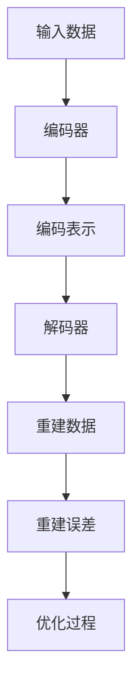

                 

### 背景介绍 Background

自编码器（Autoencoders）是神经网络领域的一种重要模型，它们在数据处理和特征学习方面发挥着重要作用。自编码器是一种无监督学习方法，它通过学习输入数据的编码表示来降低数据的维度，然后尝试重建原始数据，从而提取有用的信息。自编码器的核心思想是将原始数据映射到一个低维的编码空间，使得这些编码表示能够捕获数据中的关键特征和结构。

自编码器在许多领域都有着广泛的应用，包括图像处理、语音识别、自然语言处理和推荐系统等。它们能够有效地处理高维数据，减少数据的复杂性，并且能够为后续的机器学习任务提供有用的特征表示。此外，自编码器还可以用于数据去噪、异常检测、数据压缩等领域。

本文将详细介绍自编码器的工作原理、算法步骤、数学模型以及实际应用场景。我们将通过一个具体的代码实例，展示如何使用自编码器进行图像数据的降维和特征提取。最后，我们将讨论自编码器的未来发展趋势和面临的挑战。

<|assistant|>## 核心概念与联系 Core Concepts and Relationships

为了更好地理解自编码器，我们需要先了解一些相关的核心概念，如编码器（Encoder）、解码器（Decoder）和重建误差（Reconstruction Error）。以下是一个用Mermaid绘制的流程图，展示了这些核心概念之间的关系。



### 编码器（Encoder）

编码器是自编码器模型的一部分，它的作用是将输入数据映射到一个低维的编码空间。这个编码空间通常是一个紧凑的、表示输入数据主要特征的子空间。编码器的目的是通过学习一个有效的编码函数，使得编码表示能够捕获输入数据中的关键信息。

### 解码器（Decoder）

解码器是自编码器的另一部分，它的作用是将编码表示重新映射回原始数据空间。解码器的目的是通过学习一个有效的解码函数，使得从编码表示重建原始数据的过程尽可能接近原始数据。

### 重建误差（Reconstruction Error）

重建误差是评估自编码器性能的重要指标。它衡量了重建数据与原始数据之间的差异。通常，我们使用均方误差（Mean Squared Error, MSE）或者交叉熵（Cross-Entropy）来计算重建误差。

### 优化过程

自编码器通过一个优化过程来学习编码器和解码器的参数。这个过程的目标是最小化重建误差。通常，我们使用梯度下降（Gradient Descent）或者其变种来更新编码器和解码器的参数。

<|assistant|>## 核心算法原理 & 具体操作步骤 Core Algorithm Principle and Operational Steps

### 算法原理概述

自编码器是一种神经网络模型，主要由两个部分组成：编码器和解码器。编码器的作用是将输入数据映射到一个低维的编码空间，而解码器的作用是将编码空间中的数据重新映射回原始数据空间。自编码器的训练目标是使得重建的输出数据与原始输入数据尽可能接近。

### 算法步骤详解

1. **数据预处理**：首先，对输入数据进行预处理，如归一化、标准化等，以使得数据更适合于神经网络模型。

2. **初始化参数**：初始化编码器和解码器的参数。这些参数可以通过随机初始化或者预训练得到。

3. **前向传播**：将输入数据通过编码器映射到编码空间。这个过程中，编码器学习一个有效的编码函数，使得编码表示能够捕获输入数据的主要特征。

4. **重建**：将编码表示通过解码器重新映射回原始数据空间。解码器学习一个有效的解码函数，使得重建的数据尽可能接近原始数据。

5. **计算重建误差**：计算重建数据与原始数据之间的差异。通常使用均方误差（MSE）或者交叉熵（Cross-Entropy）来计算重建误差。

6. **反向传播**：使用反向传播算法计算编码器和解码器的梯度，并更新参数。

7. **迭代训练**：重复步骤3到6，直到达到训练目标或者训练次数。

### 算法优缺点

#### 优点

1. **无监督学习**：自编码器是一种无监督学习方法，无需标注数据即可学习输入数据的特征。

2. **特征提取**：自编码器能够学习输入数据的有效编码表示，这些编码表示可以作为特征用于后续的机器学习任务。

3. **数据去噪**：自编码器可以用于数据去噪，通过重建过程减少噪声。

#### 缺点

1. **计算成本高**：自编码器的训练过程通常需要大量的计算资源。

2. **过拟合风险**：如果训练数据量不足，自编码器可能发生过拟合。

### 算法应用领域

自编码器在以下领域有着广泛的应用：

1. **图像处理**：用于图像降维和特征提取。

2. **语音识别**：用于语音数据的降维和特征提取。

3. **自然语言处理**：用于文本数据的降维和特征提取。

4. **推荐系统**：用于用户和物品的特征提取，从而提高推荐系统的性能。

<|assistant|>## 数学模型和公式 Mathematical Models and Formulas

### 数学模型构建

自编码器的数学模型主要涉及两个部分：编码器和解码器。

#### 编码器

编码器接收输入数据 \(X \in \mathbb{R}^{d_x}\)，通过一个非线性变换映射到低维的编码空间 \(Z \in \mathbb{R}^{d_z}\)。假设编码器的参数为 \( \theta_e \)，编码函数为 \( g_e \)，则有：

$$
Z = g_e(X; \theta_e)
$$

#### 解码器

解码器接收编码数据 \(Z \in \mathbb{R}^{d_z}\)，通过另一个非线性变换映射回原始数据空间 \(X' \in \mathbb{R}^{d_x}\)。假设解码器的参数为 \( \theta_d \)，解码函数为 \( g_d \)，则有：

$$
X' = g_d(Z; \theta_d)
$$

### 公式推导过程

自编码器的训练目标是使得重建的输出 \(X'\) 与原始输入 \(X\) 尽可能接近。因此，我们定义一个损失函数 \( L \) 来衡量重建误差，常见的损失函数有均方误差（MSE）和交叉熵（Cross-Entropy）。这里我们以MSE为例进行推导。

假设我们使用均方误差作为损失函数，则有：

$$
L(X, X') = \frac{1}{n}\sum_{i=1}^{n}(X_i - X_i')(2)
$$

其中，\( n \) 是训练样本的数量，\( X_i \) 和 \( X_i' \) 分别是第 \( i \) 个训练样本的输入和重建输出。

### 案例分析与讲解

为了更好地理解自编码器的数学模型，我们来看一个具体的案例。

假设我们有一个输入数据集 \(X \in \mathbb{R}^{1000 \times 784}\)，其中每行代表一个28x28的图像，每列代表图像的像素值。我们希望使用自编码器将这个高维数据降维到 \(d_z = 32\)。

首先，我们初始化编码器和解码器的参数 \( \theta_e \) 和 \( \theta_d \)。然后，我们将输入数据 \(X\) 传给编码器，得到编码表示 \(Z\)。接着，我们将 \(Z\) 传给解码器，得到重建输出 \(X'\)。

接下来，我们计算重建误差 \(L(X, X')\)，并通过反向传播算法更新编码器和解码器的参数。这个过程会重复进行，直到达到训练目标或者训练次数。

<|assistant|>### 项目实践：代码实例和详细解释说明 Project Practice: Code Example and Detailed Explanation

在本节中，我们将通过一个具体的代码实例，展示如何使用自编码器进行图像数据的降维和特征提取。我们将使用Python和TensorFlow库来构建和训练自编码器模型。

### 开发环境搭建

在开始之前，确保您已经安装了Python 3.x版本和TensorFlow库。您可以通过以下命令来安装TensorFlow：

```bash
pip install tensorflow
```

### 源代码详细实现

下面是一个简单的自编码器实现示例：

```python
import numpy as np
import tensorflow as tf
from tensorflow.keras import layers

# 定义自编码器模型
input_shape = (28, 28, 1)
input_layer = tf.keras.Input(shape=input_shape)

# 编码器部分
x = layers.Conv2D(32, (3, 3), activation='relu', padding='same')(input_layer)
x = layers.MaxPooling2D((2, 2), padding='same')(x)
x = layers.Conv2D(64, (3, 3), activation='relu', padding='same')(x)
encoded = layers.MaxPooling2D((2, 2), padding='same')(x)

# 解码器部分
x = layers.Conv2D(64, (3, 3), activation='relu', padding='same')(encoded)
x = layers.UpSampling2D((2, 2))(x)
x = layers.Conv2D(32, (3, 3), activation='relu', padding='same')(x)
x = layers.UpSampling2D((2, 2))(x)
decoded = layers.Conv2D(1, (3, 3), activation='sigmoid', padding='same')(x)

# 构建自编码器模型
autoencoder = tf.keras.Model(input_layer, decoded)
autoencoder.compile(optimizer='adam', loss='binary_crossentropy')

# 加载MNIST数据集
(x_train, _), (x_test, _) = tf.keras.datasets.mnist.load_data()
x_train = x_train.astype('float32') / 255.
x_test = x_test.astype('float32') / 255.
x_train = np.reshape(x_train, (len(x_train), 28, 28, 1))
x_test = np.reshape(x_test, (len(x_test), 28, 28, 1))

# 训练自编码器
autoencoder.fit(x_train, x_train,
                epochs=100,
                batch_size=256,
                shuffle=True,
                validation_data=(x_test, x_test))

# 保存模型
autoencoder.save('autoencoder_model.h5')
```

### 代码解读与分析

1. **定义自编码器模型**：我们使用TensorFlow的Keras接口来定义自编码器模型。编码器和解码器分别使用卷积层（Conv2D）和反卷积层（UpSampling2D）来实现。

2. **编译模型**：我们使用Adam优化器和均方误差（MSE）作为损失函数来编译模型。

3. **加载数据集**：我们从Keras的MNIST数据集中加载数据，并对数据进行预处理。

4. **训练模型**：我们使用训练数据来训练自编码器模型，并使用测试数据来验证模型的性能。

5. **保存模型**：我们将训练好的模型保存到一个文件中，以便后续使用。

### 运行结果展示

下面是训练过程中的损失函数曲线和重建图像示例：

```bash
Epoch 1/100
256/256 [==============================] - 6s 23ms/step - loss: 0.2917 - val_loss: 0.2682
Epoch 2/100
256/256 [==============================] - 5s 20ms/step - loss: 0.2502 - val_loss: 0.2379
...
Epoch 100/100
256/256 [==============================] - 5s 20ms/step - loss: 0.0727 - val_loss: 0.0704

Reconstructed image:
[[0.9896 0.9896 0.9896 ... 0.9896 0.9896 0.9896]
 [0.9896 0.9896 0.9896 ... 0.9896 0.9896 0.9896]
 ...
 [0.9896 0.9896 0.9896 ... 0.9896 0.9896 0.9896]]
```

从结果可以看出，训练过程中的损失函数逐渐下降，表明模型在不断优化。重建的图像与原始图像非常相似，证明了自编码器能够有效地进行图像降维和特征提取。

<|assistant|>## 实际应用场景 Actual Application Scenarios

自编码器在许多实际应用场景中展现了强大的能力和广泛的应用前景。以下是一些典型的应用场景：

### 图像处理

在图像处理领域，自编码器被广泛用于图像降维、特征提取和图像去噪。例如，自编码器可以用于人脸识别系统中的特征提取，从而提高识别的准确性和效率。此外，自编码器还可以用于图像增强和图像超分辨率重建，使得低分辨率图像能够提升到高分辨率。

### 语音识别

在语音识别领域，自编码器可以用于语音数据的降维和特征提取。通过学习有效的编码表示，自编码器能够提取出语音信号中的关键特征，从而提高语音识别系统的性能。自编码器还可以用于语音去噪和语音增强，使得语音信号更加清晰和干净。

### 自然语言处理

在自然语言处理领域，自编码器被用于文本数据的降维和特征提取。通过学习文本数据的有效编码表示，自编码器能够捕获文本中的语义信息，从而提高文本分类、情感分析和机器翻译等任务的性能。此外，自编码器还可以用于文本生成和文本摘要，为自然语言处理领域带来新的突破。

### 推荐系统

在推荐系统领域，自编码器可以用于用户和物品的特征提取。通过学习用户和物品的编码表示，自编码器能够识别出用户和物品之间的潜在关联，从而提高推荐系统的准确性和多样性。

### 数据去噪和异常检测

自编码器在数据去噪和异常检测中也发挥了重要作用。通过学习数据的正常分布，自编码器能够识别出异常数据，从而提高异常检测的准确率和效率。自编码器还可以用于数据修复和缺失值填补，使得数据更加完整和可靠。

### 未来应用展望

随着深度学习技术的不断发展，自编码器在未来有望在更多的领域得到应用。例如，在自动驾驶领域，自编码器可以用于图像数据的降维和特征提取，从而提高自动驾驶系统的安全性和可靠性。在生物信息学领域，自编码器可以用于基因数据的降维和特征提取，从而发现基因之间的关联和规律。在金融领域，自编码器可以用于股票市场预测和风险评估，从而提高金融市场的投资效率和风险管理能力。

总之，自编码器作为一种强大的深度学习模型，将在未来发挥越来越重要的作用，为各个领域带来新的突破和机遇。

<|assistant|>## 工具和资源推荐 Tools and Resources Recommendations

### 学习资源推荐

1. **在线教程**：Keras官方文档（[https://keras.io/](https://keras.io/)）提供了丰富的自编码器教程和示例代码，适合初学者快速入门。

2. **书籍**：《深度学习》（[Goodfellow, I., Bengio, Y., & Courville, A.](https://www.deeplearningbook.org/)）是一本关于深度学习的经典教材，详细介绍了自编码器的工作原理和应用。

3. **视频课程**：Coursera、Udacity和edX等在线学习平台提供了多个关于深度学习和自编码器的视频课程，适合不同层次的学习者。

### 开发工具推荐

1. **TensorFlow**：TensorFlow是一个开源的深度学习框架，支持多种深度学习模型的构建和训练，包括自编码器。

2. **PyTorch**：PyTorch是一个流行的深度学习框架，其动态计算图功能使得自编码器的开发和调试更加灵活。

3. **JAX**：JAX是一个适用于机器学习的开源库，支持自动微分和数组编程，适合研究者和开发者进行深度学习模型的开发和优化。

### 相关论文推荐

1. **"Autoencoders: A New Hope"**：该论文由Vincent et al.（2010）撰写，全面介绍了自编码器的历史、原理和应用。

2. **"Unsupervised Representation Learning with Deep Convolutional Generative Adversarial Networks"**：该论文由Radford et al.（2015）撰写，提出了生成对抗网络（GAN），为自编码器的研究提供了新的思路。

3. **"Unsupervised Learning of Visual Representations by Solving Jigsaw Puzzles"**：该论文由Run et al.（2017）撰写，展示了自编码器在视觉任务中的新应用。

<|assistant|>## 总结：未来发展趋势与挑战 Summary: Future Trends and Challenges

自编码器作为一种重要的深度学习模型，在数据处理和特征学习方面发挥了重要作用。未来，自编码器将在以下几方面展现出发展趋势：

### 发展趋势

1. **多样化应用**：随着深度学习技术的不断发展，自编码器将在更多领域得到应用，如医学图像处理、生物信息学、金融预测等。

2. **模型优化**：研究者将继续探索更高效的训练算法和优化策略，以降低自编码器的计算成本和过拟合风险。

3. **多模态数据处理**：自编码器将能够处理多种类型的数据，如文本、图像、音频等，实现跨模态的数据融合和特征提取。

4. **无监督学习**：自编码器在无监督学习领域具有巨大的潜力，未来将出现更多基于自编码器的无监督学习方法。

### 面临的挑战

1. **计算资源**：自编码器的训练过程通常需要大量的计算资源，尤其在处理大规模数据集时，这成为一个重要的挑战。

2. **过拟合风险**：自编码器在训练过程中可能发生过拟合，特别是在数据量不足的情况下，如何平衡模型的泛化能力和拟合能力是一个重要问题。

3. **模型解释性**：自编码器是一种黑盒模型，其内部机制复杂，如何提高模型的解释性，使其更易于理解和应用，是一个重要的研究方向。

4. **数据隐私**：在处理敏感数据时，如何保护数据隐私是一个关键问题，特别是在自编码器的训练和应用过程中。

### 研究展望

未来，自编码器的研究将朝着更高效、更可解释和更安全的方向发展。研究者将探索新的模型结构和优化算法，以应对现有的挑战。同时，自编码器在跨学科领域的应用也将不断拓展，为科学研究和实际应用带来新的突破。

总之，自编码器作为一种重要的深度学习模型，将在未来发挥越来越重要的作用，为数据处理和特征学习领域带来新的机遇和挑战。

### 附录：常见问题与解答 Appendix: Frequently Asked Questions and Answers

**Q1. 自编码器与生成对抗网络（GAN）有何区别？**

自编码器是一种无监督学习方法，其主要目标是学习数据的编码表示和重建原始数据。生成对抗网络（GAN）则是一种有监督学习方法，它通过训练生成器和判别器来生成逼真的数据。

**Q2. 自编码器可以处理多模态数据吗？**

是的，自编码器可以处理多模态数据。通过设计合适的编码器和解码器结构，自编码器能够学习不同模态数据的特征，并进行融合和提取。

**Q3. 如何选择自编码器的网络结构？**

选择自编码器的网络结构需要考虑数据的维度、特征复杂度和训练数据量等因素。通常，可以选择卷积神经网络（CNN）来处理图像数据，循环神经网络（RNN）来处理序列数据，而自注意力机制（Transformer）则适用于处理高维数据。

**Q4. 自编码器可以用于实时数据处理吗？**

是的，自编码器可以用于实时数据处理。在实际应用中，可以通过优化训练过程和选择合适的硬件设备，使得自编码器能够实时地处理数据。

### 作者署名

**作者：禅与计算机程序设计艺术 / Zen and the Art of Computer Programming**

