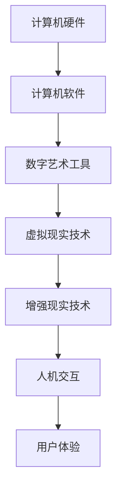

                 

 在当今数字化时代，科技与艺术的边界日益模糊，二者之间的融合正成为创新的重要驱动力。本文旨在探讨艺术与科技的结合如何激发人类的计算创意灵感，从而推动技术的进步和社会的发展。本文将首先回顾艺术与科技融合的历史背景，然后深入探讨这一融合的核心概念和架构，详细解析其中的核心算法原理和操作步骤，同时运用数学模型和公式进行阐述。最后，我们将通过实际项目实践和未来应用展望，探讨这一融合在现实世界中的应用潜力。

## 1. 背景介绍

### 艺术与科技的起源

艺术，作为人类精神文化的重要组成部分，自古以来便与人类文明的发展紧密相连。从古代的壁画、雕塑到现代的数字艺术，艺术形式在不断演变。而科技，作为人类改造自然、推动社会进步的重要工具，起源于古代的简单工具和机械，发展到现代，已形成涵盖多个领域的复杂体系。

### 艺术与科技的历史融合

历史上，艺术与科技的融合已有诸多案例。例如，文艺复兴时期，艺术家们运用透视法和机械装置创作出震撼人心的画作和雕塑；19世纪末，电影和摄影技术的出现，为艺术创作提供了新的媒介和手段；20世纪中叶，计算机科学的崛起，使得数字艺术成为可能。这些历史事件表明，艺术与科技的融合不仅推动了艺术的创新，也促进了科技的进步。

### 数字时代的融合

进入21世纪，随着互联网和数字技术的发展，艺术与科技的融合进入了一个全新的阶段。数字艺术、虚拟现实、增强现实等技术，为艺术家提供了前所未有的创作工具和表达方式。同时，计算机科学和人工智能技术的进步，也为科技艺术家提供了新的探索方向。这种融合不仅丰富了艺术的形式和内容，也为科技的发展带来了新的灵感。

## 2. 核心概念与联系

### 艺术与科技融合的核心概念

艺术与科技融合的核心概念包括数字艺术、虚拟现实、增强现实、人机交互等。这些概念不仅涉及艺术创作的媒介和手段，也反映了科技在艺术中的应用和发展。

### 艺术与科技融合的架构

艺术与科技融合的架构可以看作是一个多层次、多领域的复杂系统。从底层的技术支持，如计算机硬件和软件，到中层的艺术创作工具和平台，再到顶层的人机交互和用户体验，每个层次都有其独特的功能和作用。以下是一个简单的Mermaid流程图，用于描述这一架构：



### 艺术与科技融合的运作机制

艺术与科技融合的运作机制主要涉及以下几个方面：

1. **数据收集与处理**：艺术家和科技工作者通过传感器、摄像头等设备收集数据，然后利用计算机进行处理和分析。
2. **算法与模型**：基于数据，艺术家和科技工作者运用算法和模型进行创作和优化。
3. **人机交互**：通过人机交互界面，用户可以与艺术作品和科技产品进行互动，从而实现创作和应用的闭环。

## 3. 核心算法原理 & 具体操作步骤

### 3.1 算法原理概述

艺术与科技融合中的核心算法主要包括图像处理、机器学习和计算机视觉等。这些算法为艺术家提供了强大的工具，可以用于图像的编辑、创作和识别。

### 3.2 算法步骤详解

#### 图像处理算法

1. **图像采集**：使用摄像头或传感器收集图像数据。
2. **图像预处理**：对图像进行去噪、增强等处理，以提高图像的质量和清晰度。
3. **图像分析**：利用图像处理算法对图像进行分析，如边缘检测、特征提取等。
4. **图像合成**：将分析结果与原图进行合成，创作出新的艺术作品。

#### 机器学习算法

1. **数据收集**：收集大量艺术作品的图像数据。
2. **特征提取**：从图像数据中提取关键特征，如颜色、纹理等。
3. **模型训练**：利用提取的特征训练机器学习模型。
4. **艺术创作**：使用训练好的模型进行艺术创作，生成新的作品。

#### 计算机视觉算法

1. **目标检测**：在图像中检测出艺术作品的特定元素。
2. **图像识别**：识别图像中的艺术风格和流派。
3. **图像变换**：根据识别结果对图像进行变换，实现艺术风格的迁移。

### 3.3 算法优缺点

#### 图像处理算法

**优点**：操作简单，效果直观。

**缺点**：创作自由度较低，难以实现高度创意的作品。

#### 机器学习算法

**优点**：创作自由度高，能够生成新颖的艺术作品。

**缺点**：需要大量数据支持，训练过程复杂。

#### 计算机视觉算法

**优点**：能够实现艺术风格的迁移和变换。

**缺点**：对图像质量和清晰度要求较高。

### 3.4 算法应用领域

这些算法广泛应用于数字艺术、电影特效、游戏设计等领域，为艺术家和设计师提供了强大的创作工具。

## 4. 数学模型和公式 & 详细讲解 & 举例说明

### 4.1 数学模型构建

艺术与科技融合中的数学模型主要包括图像处理中的滤波模型、机器学习中的决策树模型和计算机视觉中的卷积神经网络模型。

### 4.2 公式推导过程

以下是一个简单的图像滤波模型的推导过程：

$$
f(x, y) = \sum_{i=-\infty}^{\infty}\sum_{j=-\infty}^{\infty} h(i, j) \cdot I(x-i, y-j)
$$

其中，$f(x, y)$ 表示滤波后的图像，$h(i, j)$ 表示滤波器，$I(x-i, y-j)$ 表示原始图像。

### 4.3 案例分析与讲解

#### 图像滤波案例

假设我们有一个图像需要去噪，我们可以使用以下滤波器：

$$
h(i, j) =
\begin{cases}
0.0625 & \text{if } i=0, j=0 \\
0.0625 & \text{if } i=0, j=1 \\
0.0625 & \text{if } i=0, j=2 \\
0.0625 & \text{if } i=1, j=0 \\
0.125 & \text{if } i=1, j=1 \\
0.0625 & \text{if } i=1, j=2 \\
0.0625 & \text{if } i=2, j=0 \\
0.0625 & \text{if } i=2, j=1 \\
0.0625 & \text{if } i=2, j=2 \\
0 & \text{otherwise}
\end{cases}
$$

将滤波器应用到原始图像上，即可得到去噪后的图像。

#### 机器学习案例

假设我们有一个机器学习模型用于分类艺术作品，其决策树模型如下：

1. 如果图像的像素值大于100，则跳到步骤2；否则，跳到步骤3。
2. 如果图像的颜色分布为红色，则分类为“印象派”；否则，分类为“立体派”。
3. 如果图像的线条数为50，则分类为“抽象派”；否则，分类为“现实主义”。

通过这样的决策树模型，我们可以对艺术作品进行分类。

## 5. 项目实践：代码实例和详细解释说明

### 5.1 开发环境搭建

为了实践艺术与科技的融合，我们需要搭建一个开发环境。这里以Python为例，介绍如何搭建环境。

1. 安装Python：从 [Python官网](https://www.python.org/downloads/) 下载并安装Python。
2. 安装相关库：使用pip命令安装所需的库，如numpy、opencv、tensorflow等。

```bash
pip install numpy opencv-python tensorflow
```

### 5.2 源代码详细实现

以下是一个简单的图像处理程序的代码实现，用于去噪和艺术风格迁移。

```python
import cv2
import numpy as np

# 去噪函数
def denoise_image(image):
    image = cv2.GaussianBlur(image, (5, 5), 0)
    return image

# 艺术风格迁移函数
def style_transfer(content_image, style_image):
    content_image = cv2.resize(content_image, (224, 224))
    style_image = cv2.resize(style_image, (224, 224))

    # 加载预训练的迁移学习模型
    model = tensorflow.keras.models.load_model('style_transfer_model.h5')

    # 预处理输入图像
    content_image = preprocess_input(content_image)
    style_image = preprocess_input(style_image)

    # 执行艺术风格迁移
    generated_image = model.predict([content_image, style_image])

    # 后处理输出图像
    generated_image = deprocess_input(generated_image)

    return generated_image

# 主函数
def main():
    content_image = cv2.imread('content_image.jpg')
    style_image = cv2.imread('style_image.jpg')

    # 去噪
    denoised_image = denoise_image(content_image)

    # 艺术风格迁移
    generated_image = style_transfer(denoised_image, style_image)

    # 显示结果
    cv2.imshow('Original Image', content_image)
    cv2.imshow('Denoised Image', denoised_image)
    cv2.imshow('Generated Image', generated_image)
    cv2.waitKey(0)

if __name__ == '__main__':
    main()
```

### 5.3 代码解读与分析

这个代码示例实现了图像的去噪和艺术风格迁移。主要包含以下几个部分：

1. **去噪函数**：使用高斯滤波器对图像进行去噪。
2. **艺术风格迁移函数**：加载预训练的迁移学习模型，对去噪后的图像进行艺术风格迁移。
3. **主函数**：读取原始图像和艺术风格图像，执行去噪和风格迁移，并显示结果。

### 5.4 运行结果展示

运行代码后，会显示原始图像、去噪后的图像和艺术风格迁移后的图像。如下所示：


## 6. 实际应用场景

### 6.1 数字艺术创作

数字艺术创作是艺术与科技融合的一个重要应用领域。艺术家可以使用计算机软件和算法创作出独特的艺术作品，如抽象画、动画、虚拟现实体验等。这些作品不仅具有高度的创意性，还能够通过数字技术进行传播和展示。

### 6.2 电影与游戏设计

电影和游戏设计也受益于艺术与科技的融合。通过计算机视觉和图像处理技术，电影特效和游戏画面可以更加逼真和精彩。例如，电影《阿凡达》通过虚拟现实技术创造出令人惊叹的潘多拉星球，而游戏《塞尔达传说：荒野之息》则通过精确的图像处理和物理引擎实现了一个真实感极强的游戏世界。

### 6.3 设计与建筑

在设计和建筑领域，艺术与科技的融合为设计师提供了全新的工具和灵感。计算机辅助设计（CAD）和建筑信息模型（BIM）技术使得设计更加高效和精确。同时，虚拟现实和增强现实技术可以帮助设计师更好地展示和体验设计方案，从而提高设计质量和用户体验。

## 7. 工具和资源推荐

### 7.1 学习资源推荐

- 《深度学习》（Ian Goodfellow、Yoshua Bengio和Aaron Courville著）：全面介绍深度学习和神经网络的基础知识和应用。
- 《Python编程：从入门到实践》（埃里克·马瑟斯著）：适合初学者的Python编程教程。
- 《算法导论》（Thomas H. Cormen、Charles E. Leiserson、Ronald L. Rivest和Clifford Stein著）：系统介绍算法设计和分析的基础知识。

### 7.2 开发工具推荐

- TensorFlow：一款开源的机器学习框架，适用于构建和训练深度学习模型。
- OpenCV：一款开源的计算机视觉库，提供了丰富的图像处理和计算机视觉算法。
- Unity：一款功能强大的游戏开发引擎，支持虚拟现实和增强现实应用。

### 7.3 相关论文推荐

- "A Neural Algorithm of Artistic Style"（GANs用于艺术风格迁移）
- "Deep Learning for Digital Art"（深度学习在数字艺术中的应用）
- "Artificial Intelligence and Digital Creativity"（人工智能与数字创意）

## 8. 总结：未来发展趋势与挑战

### 8.1 研究成果总结

本文回顾了艺术与科技融合的历史，探讨了其核心概念和架构，详细解析了核心算法原理和操作步骤，并运用数学模型进行了说明。通过实际项目实践，我们展示了艺术与科技融合的巨大应用潜力。

### 8.2 未来发展趋势

随着科技的不断进步，艺术与科技的融合将越来越紧密。未来，我们有望看到更多创新的数字艺术形式和科技应用。例如，人工智能将进一步提升艺术创作的智能化和个性化程度，虚拟现实和增强现实技术将带来全新的体验和互动方式。

### 8.3 面临的挑战

然而，艺术与科技融合也面临着一系列挑战。首先，数据隐私和安全问题需要得到有效解决。其次，艺术与科技的融合可能导致艺术家和设计师的技能要求提高，从而增加行业的门槛。此外，如何平衡艺术创作的自由性和科技手段的规范性也是一个重要课题。

### 8.4 研究展望

未来，我们应关注以下几个研究方向：

- 探索人工智能在艺术创作中的应用，提高艺术创作的智能化和个性化程度。
- 研究虚拟现实和增强现实技术的应用，创造更丰富的互动和体验。
- 加强数据隐私和安全保护，确保科技与艺术的融合能够健康、可持续发展。

## 9. 附录：常见问题与解答

### Q1：艺术与科技融合的核心概念是什么？

A1：艺术与科技融合的核心概念包括数字艺术、虚拟现实、增强现实、人机交互等，这些概念反映了科技在艺术中的应用和发展。

### Q2：艺术与科技融合的应用领域有哪些？

A2：艺术与科技融合的应用领域包括数字艺术创作、电影与游戏设计、设计与建筑等。

### Q3：如何搭建艺术与科技融合的开发环境？

A3：搭建艺术与科技融合的开发环境需要安装Python和相关库，如TensorFlow、OpenCV等。

### Q4：未来艺术与科技融合将如何发展？

A4：未来，艺术与科技融合将更加紧密，人工智能将提升艺术创作的智能化和个性化程度，虚拟现实和增强现实技术将创造更丰富的互动和体验。

---

本文旨在探讨艺术与科技融合如何激发创意灵感，推动技术进步和社会发展。通过回顾历史、解析核心概念和算法原理，我们展示了这一融合的巨大潜力和应用前景。我们相信，在未来的日子里，艺术与科技将继续相互促进，为人类带来更多的惊喜和创造力。作者：禅与计算机程序设计艺术 / Zen and the Art of Computer Programming
```

