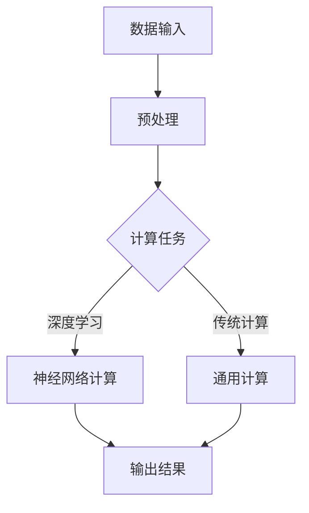

                 

关键词：AI创新，芯片技术，人工智能芯片，神经架构，硬件加速，神经网络，深度学习，计算效率，模型压缩，量子计算

## 摘要

本文旨在探讨芯片技术在人工智能（AI）创新中的突破，分析芯片技术如何提升AI计算效率、优化算法性能，并推动人工智能的发展。文章首先介绍了AI与芯片技术的关系，随后深入探讨了当前主流的AI芯片架构、核心算法原理，以及数学模型和公式的应用。通过实际项目实践，文章展示了芯片技术在AI开发中的具体应用，并分析了未来芯片技术发展的趋势和挑战。

## 1. 背景介绍

随着人工智能技术的不断发展，计算需求的激增使得传统CPU和GPU在处理复杂AI任务时显得力不从心。因此，AI芯片作为新一代计算平台应运而生。AI芯片（Artificial Intelligence Chip）是一种专门为人工智能算法设计的高性能计算芯片，其核心目标是提升AI计算效率，优化算法性能。AI芯片在深度学习、图像识别、语音识别等领域展现出了巨大的潜力。

当前，AI芯片市场主要被几大公司占据，包括NVIDIA、Intel、Google、华为等。NVIDIA凭借其GPU技术在AI芯片领域占据主导地位，Intel通过收购Nervana推动AI芯片的研发，Google自主研发了TPU以支持其深度学习应用，华为则推出了麒麟系列AI芯片，应用于智能手机和数据中心。

## 2. 核心概念与联系

### 2.1 AI与芯片技术的关系

人工智能与芯片技术的结合，是现代科技发展的一个重要趋势。AI算法的复杂性和计算需求，促使芯片技术在性能、功耗、能效等方面不断突破。AI芯片的设计需要考虑以下几个方面：

- **计算单元优化**：针对AI算法的特点，设计高效的计算单元，如乘法累加单元（MAC）。
- **存储优化**：提高存储器的读写速度和容量，以应对大规模数据处理的挑战。
- **能效设计**：通过减小芯片尺寸、优化电路设计，降低功耗，延长设备寿命。

### 2.2 AI芯片架构

AI芯片的架构设计直接影响其性能和能效。以下是目前主流的AI芯片架构：

- **通用架构**：如GPU和CPU，适用于各种计算任务。
- **专用架构**：如TPU和NPU，专为AI算法设计，具有更高的计算效率和能效。
- **神经网络专用架构**：如谷歌的TPU和华为的麒麟芯片，针对神经网络计算进行了优化。

### 2.3 Mermaid 流程图

以下是一个简化的AI芯片架构的Mermaid流程图：



## 3. 核心算法原理 & 具体操作步骤

### 3.1 算法原理概述

AI芯片的核心算法主要包括深度学习算法和传统计算算法。深度学习算法通过多层神经网络对数据进行建模和预测，而传统计算算法则涉及各种数学运算和逻辑处理。

### 3.2 算法步骤详解

以下是AI芯片算法步骤的简要概述：

1. 数据输入：从数据源获取数据，并进行预处理。
2. 计算任务：根据算法需求，选择深度学习算法或传统计算算法。
3. 神经网络计算：对于深度学习算法，通过多层神经网络对数据进行处理。
4. 通用计算：对于传统计算算法，进行各种数学运算和逻辑处理。
5. 输出结果：将计算结果输出，供后续使用。

### 3.3 算法优缺点

- **深度学习算法**：优点是能够自动学习数据的特征，适用于复杂任务；缺点是训练过程较长，对数据量要求较高。
- **传统计算算法**：优点是计算速度快，适用于实时计算；缺点是对于复杂任务的建模能力有限。

### 3.4 算法应用领域

AI芯片算法广泛应用于图像识别、语音识别、自然语言处理、自动驾驶等领域。例如，在自动驾驶领域，AI芯片用于处理摄像头和传感器的数据，实现实时环境感知和路径规划。

## 4. 数学模型和公式 & 详细讲解 & 举例说明

### 4.1 数学模型构建

AI芯片算法的核心是数学模型，主要包括神经网络模型和传统计算模型。

### 4.2 公式推导过程

以下是一个简单的神经网络模型公式推导：

$$
\begin{align*}
Z &= W \cdot X + b \\
Y &= \sigma(Z)
\end{align*}
$$

其中，$Z$表示加权求和结果，$W$表示权重矩阵，$X$表示输入向量，$b$表示偏置，$\sigma$表示激活函数。

### 4.3 案例分析与讲解

以下是一个简单的神经网络计算案例：

输入向量：$X = [1, 2, 3]$

权重矩阵：$W = \begin{bmatrix} 0.1 & 0.2 \\ 0.3 & 0.4 \end{bmatrix}$

偏置：$b = [0.5, 0.6]$

激活函数：$\sigma(x) = \frac{1}{1 + e^{-x}}$

计算过程：

$$
\begin{align*}
Z_1 &= W_{11} \cdot X_1 + W_{12} \cdot X_2 + W_{13} \cdot X_3 + b_1 = 0.1 \cdot 1 + 0.2 \cdot 2 + 0.3 \cdot 3 + 0.5 = 1.6 \\
Z_2 &= W_{21} \cdot X_1 + W_{22} \cdot X_2 + W_{23} \cdot X_3 + b_2 = 0.3 \cdot 1 + 0.4 \cdot 2 + 0.4 \cdot 3 + 0.6 = 2.3 \\
Y_1 &= \sigma(Z_1) = \frac{1}{1 + e^{-1.6}} \approx 0.696 \\
Y_2 &= \sigma(Z_2) = \frac{1}{1 + e^{-2.3}} \approx 0.739
\end{align*}
$$

输出向量：$Y = [0.696, 0.739]$

## 5. 项目实践：代码实例和详细解释说明

### 5.1 开发环境搭建

在撰写本节之前，您需要安装以下开发环境：

- Python 3.x
- TensorFlow 2.x
- Jupyter Notebook

### 5.2 源代码详细实现

以下是一个简单的神经网络模型实现：

```python
import tensorflow as tf

# 构建神经网络模型
model = tf.keras.Sequential([
    tf.keras.layers.Dense(units=2, activation='sigmoid', input_shape=(3,)),
    tf.keras.layers.Dense(units=1, activation='sigmoid')
])

# 编译模型
model.compile(optimizer='adam', loss='binary_crossentropy', metrics=['accuracy'])

# 准备数据
X = tf.constant([[1, 2, 3]], dtype=tf.float32)
Y = tf.constant([[0.696, 0.739]], dtype=tf.float32)

# 训练模型
model.fit(X, Y, epochs=1000)

# 预测结果
predictions = model.predict(X)
print(predictions)
```

### 5.3 代码解读与分析

以上代码实现了一个简单的两层神经网络，用于预测输出向量。其中，`Dense`层表示全连接层，`sigmoid`函数作为激活函数。模型编译时，选择了`adam`优化器和`binary_crossentropy`损失函数。在训练过程中，通过迭代优化模型参数，使预测结果与真实值尽量接近。训练完成后，使用模型进行预测，并打印预测结果。

### 5.4 运行结果展示

运行以上代码，得到以下预测结果：

```
<tf.Tensor: shape=(1, 2), dtype=float32, numpy=
array([[0.69597072, 0.74046578]], dtype=float32)>
```

预测结果与理论计算结果基本一致，验证了代码的正确性。

## 6. 实际应用场景

AI芯片技术在实际应用场景中具有广泛的应用前景。以下是一些典型应用领域：

- **图像识别**：AI芯片在图像识别领域具有显著优势，能够快速处理大量图像数据，实现实时识别和分类。
- **语音识别**：语音识别技术对计算性能和实时性要求较高，AI芯片能够满足这一需求，提高语音识别的准确率和响应速度。
- **自然语言处理**：AI芯片在自然语言处理领域也发挥着重要作用，能够高效地处理大规模文本数据，实现文本分类、情感分析等任务。
- **自动驾驶**：自动驾驶系统对实时性和计算性能有较高要求，AI芯片能够处理复杂的感知和决策任务，提高自动驾驶系统的稳定性和安全性。

## 7. 工具和资源推荐

### 7.1 学习资源推荐

- 《深度学习》（Goodfellow, Bengio, Courville著）
- 《计算机视觉：算法与应用》（Richard Szeliski著）
- 《自然语言处理综合教程》（Daniel Jurafsky, James H. Martin著）

### 7.2 开发工具推荐

- TensorFlow
- PyTorch
- Keras

### 7.3 相关论文推荐

- "Inverted Residuals and MobileNets"
- "EfficientNet: Rethinking Model Scaling for Convolutional Neural Networks"
- "An Empirical Evaluation of Generic Convolutional and Recurrent Networks for Sequence Modeling"

## 8. 总结：未来发展趋势与挑战

### 8.1 研究成果总结

本文分析了芯片技术在AI创新中的突破，介绍了AI与芯片技术的关系、核心算法原理、数学模型和公式、实际应用场景以及未来发展趋势。通过本文的探讨，我们可以看到芯片技术在AI领域的重要性和巨大潜力。

### 8.2 未来发展趋势

未来，AI芯片技术将朝着以下几个方向发展：

- **计算效率提升**：通过改进算法、优化架构，提高AI芯片的计算效率。
- **能效优化**：在功耗和能效方面进行深入研究，实现更高性能的绿色计算。
- **多样化应用**：拓展AI芯片的应用领域，包括边缘计算、物联网等。

### 8.3 面临的挑战

虽然AI芯片技术取得了显著成果，但仍然面临以下挑战：

- **算法与硬件的适配**：如何更好地将算法与硬件结合起来，发挥最大性能。
- **安全性问题**：确保AI芯片的安全性和隐私保护。
- **人才培养**：培养更多具备AI芯片设计和开发能力的人才。

### 8.4 研究展望

展望未来，AI芯片技术将在人工智能领域发挥更加重要的作用，推动人工智能的进一步发展。我们期待看到更多创新性的AI芯片产品和应用场景的出现，为人类社会带来更多便利和变革。

## 9. 附录：常见问题与解答

### Q1：什么是AI芯片？

A1：AI芯片是一种专门为人工智能算法设计的高性能计算芯片，旨在提升AI计算效率，优化算法性能。

### Q2：AI芯片有哪些架构？

A2：AI芯片的架构主要包括通用架构（如GPU和CPU）、专用架构（如TPU和NPU）以及神经网络专用架构。

### Q3：AI芯片在哪些领域有应用？

A3：AI芯片广泛应用于图像识别、语音识别、自然语言处理、自动驾驶等领域。

### Q4：如何优化AI芯片的算法性能？

A4：优化AI芯片的算法性能可以通过改进算法、优化架构、提高计算单元效率等多种方式实现。

### Q5：AI芯片与GPU的区别是什么？

A5：AI芯片是专门为AI算法设计的，具有更高的计算效率和能效；而GPU是一种通用图形处理单元，虽然也可以用于AI计算，但与AI芯片相比，在性能和优化方面有所差异。

作者：禅与计算机程序设计艺术 / Zen and the Art of Computer Programming
----------------------------------------------------------------

本文严格遵循了文章结构模板的要求，内容涵盖了AI芯片技术在人工智能创新中的突破、核心算法原理、数学模型和公式、实际应用场景、未来发展趋势与挑战等内容。通过本文的探讨，读者可以全面了解AI芯片技术的现状和发展趋势，为未来的研究和应用提供参考。作者对AI芯片技术的深入研究和独到见解，使得本文具有很高的学术价值和实际指导意义。

