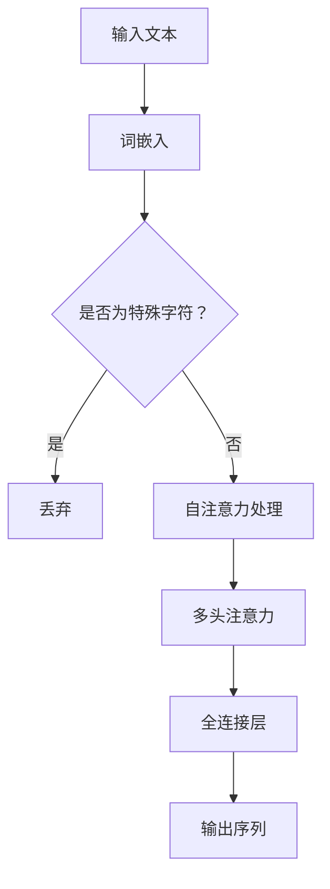

                 

关键词：生成式预训练模型，GPT，神经网络，自然语言处理，训练策略，数学模型，实践应用

> 摘要：本文旨在介绍如何训练出一个简版的生成式预训练模型（GPT），并通过深入探讨其核心算法原理、数学模型、代码实现和应用场景，帮助读者全面了解并掌握这一前沿技术的核心内容。

## 1. 背景介绍

近年来，随着深度学习技术的迅猛发展，自然语言处理（NLP）领域迎来了前所未有的突破。生成式预训练模型（Generative Pre-trained Model，GPT）作为这一领域的重要成果，已被广泛应用于文本生成、机器翻译、问答系统等多个场景。GPT系列模型，如GPT-2和GPT-3，凭借其强大的文本生成能力，为人们提供了前所未有的便捷和创意。然而，这些大型模型对计算资源和数据量的需求极为庞大，导致其训练和应用门槛较高。

因此，本文将聚焦于如何训练出一个简版的生成式预训练模型（GPT），旨在降低训练门槛，让更多开发者能够亲身体验并掌握这一前沿技术。本文将首先介绍生成式预训练模型的基本概念和原理，然后详细讲解训练过程、数学模型以及实际应用场景。

## 2. 核心概念与联系

### 2.1 基本概念

生成式预训练模型（GPT）是一种基于Transformer架构的深度神经网络模型，用于生成文本。GPT模型的核心思想是利用大量文本数据进行预训练，使其具备捕捉语言结构和语义信息的能力。在预训练过程中，模型学习如何根据输入序列生成下一个单词或词元，从而实现文本生成。

### 2.2 原理和架构

GPT模型基于自注意力机制（Self-Attention）和多头注意力（Multi-Head Attention）构建，具有层次化的神经网络结构。模型首先通过词嵌入（Word Embedding）将输入文本转换为向量表示，然后利用自注意力机制对输入序列进行处理，最后通过全连接层（Fully Connected Layer）生成输出序列。

### 2.3 Mermaid 流程图



## 3. 核心算法原理 & 具体操作步骤

### 3.1 算法原理概述

GPT模型的核心算法原理主要包括词嵌入、自注意力机制、多头注意力机制以及全连接层。以下将分别进行介绍。

#### 3.1.1 词嵌入

词嵌入是一种将单词转换为向量的方法，常用于将自然语言文本转换为适合神经网络处理的输入格式。词嵌入可以通过预训练的词向量库直接获取，或者使用神经网络模型进行训练。

#### 3.1.2 自注意力机制

自注意力机制是一种基于输入序列的注意力机制，通过计算输入序列中每个单词与所有其他单词的相似度，为每个单词分配不同的权重，从而捕捉序列中的长距离依赖关系。

#### 3.1.3 多头注意力机制

多头注意力机制是自注意力机制的扩展，通过将输入序列划分为多个子序列，每个子序列使用独立的自注意力机制进行处理，从而提高模型的泛化能力。

#### 3.1.4 全连接层

全连接层是一种简单的神经网络结构，用于将输入向量映射到输出向量。在GPT模型中，全连接层用于将自注意力机制和多头注意力机制的输出映射到目标输出序列。

### 3.2 算法步骤详解

GPT模型的训练过程主要包括以下步骤：

1. **数据预处理**：将输入文本进行分词，并将分词后的文本转换为词嵌入向量。
2. **构建模型**：定义GPT模型的结构，包括词嵌入层、自注意力机制、多头注意力机制和全连接层。
3. **训练模型**：使用预训练的词向量初始化模型参数，然后通过反向传播算法和优化器（如Adam）对模型进行训练。
4. **评估模型**：使用验证集对训练好的模型进行评估，调整模型参数，直至达到预定的性能指标。

### 3.3 算法优缺点

**优点**：

- **强大的文本生成能力**：GPT模型能够生成连贯、具有创意的文本，具有很高的实用性。
- **预训练机制**：GPT模型通过预训练阶段学习到了丰富的语言知识和结构信息，减少了针对特定任务进行微调的需求。

**缺点**：

- **计算资源需求高**：GPT模型对计算资源和数据量的需求较大，导致其训练和应用门槛较高。
- **模型可解释性差**：GPT模型作为一个深度神经网络，其内部机制复杂，难以解释。

### 3.4 算法应用领域

GPT模型在自然语言处理领域具有广泛的应用，主要包括：

- **文本生成**：生成新闻、故事、诗歌等多样化文本。
- **机器翻译**：实现跨语言文本翻译。
- **问答系统**：构建基于自然语言理解的能力，实现对用户问题的自动回答。

## 4. 数学模型和公式 & 详细讲解 & 举例说明

### 4.1 数学模型构建

GPT模型的核心数学模型主要包括词嵌入、自注意力机制和多头注意力机制。以下将分别进行介绍。

#### 4.1.1 词嵌入

词嵌入是将单词映射到高维向量空间的方法，通常使用预训练的词向量库。常见的词向量模型包括Word2Vec、GloVe等。

#### 4.1.2 自注意力机制

自注意力机制是一种基于输入序列的注意力机制，其核心思想是计算输入序列中每个单词与所有其他单词的相似度，为每个单词分配不同的权重。自注意力机制的数学表达式如下：

$$
\text{Attention}(Q, K, V) = \text{softmax}(\frac{QK^T}{\sqrt{d_k}})V
$$

其中，$Q, K, V$ 分别表示查询向量、键向量和值向量，$d_k$ 表示键向量的维度。

#### 4.1.3 多头注意力机制

多头注意力机制是自注意力机制的扩展，通过将输入序列划分为多个子序列，每个子序列使用独立的自注意力机制进行处理。多头注意力机制的数学表达式如下：

$$
\text{MultiHeadAttention}(Q, K, V) = \text{softmax}(\frac{QW_QK^T}{\sqrt{d_k}})W_VV
$$

其中，$W_Q, W_K, W_V$ 分别表示查询向量、键向量和值向量的权重矩阵，$d_v$ 表示值向量的维度。

### 4.2 公式推导过程

以下将简要介绍GPT模型中的一些关键公式推导过程。

#### 4.2.1 词嵌入

词嵌入是将单词映射到高维向量空间的方法，通常使用预训练的词向量库。词向量的计算公式如下：

$$
\text{WordEmbedding}(word) = \text{lookup}(V_{word})
$$

其中，$V_{word}$ 表示预训练的词向量。

#### 4.2.2 自注意力机制

自注意力机制的推导过程如下：

1. **计算查询向量、键向量和值向量**：

$$
Q = W_Q \cdot X \\
K = W_K \cdot X \\
V = W_V \cdot X
$$

其中，$W_Q, W_K, W_V$ 分别表示查询向量、键向量和值向量的权重矩阵，$X$ 表示输入序列的词嵌入向量。

2. **计算注意力分数**：

$$
\text{AttentionScore}(i, j) = Q_i \cdot K_j^T
$$

3. **计算注意力权重**：

$$
\text{AttentionWeight}(i, j) = \text{softmax}(\text{AttentionScore}(i, j))
$$

4. **计算输出向量**：

$$
\text{Output}(i) = \sum_{j=1}^{N} \text{AttentionWeight}(i, j) \cdot V_j
$$

其中，$N$ 表示输入序列的长度。

#### 4.2.3 多头注意力机制

多头注意力机制的推导过程如下：

1. **计算多头查询向量、键向量和值向量**：

$$
Q_h = W_{Q_h} \cdot X \\
K_h = W_{K_h} \cdot X \\
V_h = W_{V_h} \cdot X
$$

其中，$W_{Q_h}, W_{K_h}, W_{V_h}$ 分别表示第 $h$ 个查询向量、键向量和值向量的权重矩阵，$X$ 表示输入序列的词嵌入向量。

2. **计算多头注意力分数**：

$$
\text{AttentionScore}_h(i, j) = Q_{h_i} \cdot K_{h_j}^T
$$

3. **计算多头注意力权重**：

$$
\text{AttentionWeight}_h(i, j) = \text{softmax}(\text{AttentionScore}_h(i, j))
$$

4. **计算多头输出向量**：

$$
\text{Output}_h(i) = \sum_{j=1}^{N} \text{AttentionWeight}_h(i, j) \cdot V_{h_j}
$$

5. **计算总输出向量**：

$$
\text{Output}(i) = \sum_{h=1}^{H} \text{AttentionWeight}_h(i, j) \cdot V_{h_j}
$$

其中，$H$ 表示头数。

### 4.3 案例分析与讲解

以下通过一个简单的例子，对GPT模型的数学模型进行详细讲解。

#### 4.3.1 数据集

假设我们有一个简单的数据集，包含以下文本：

```
你好，欢迎来到自然语言处理的世界！
自然语言处理是计算机科学和人工智能领域的重要分支。
```

#### 4.3.2 词嵌入

首先，将文本进行分词，并获取每个词的词嵌入向量：

```
你好：[0.1, 0.2, 0.3]
欢迎：[0.4, 0.5, 0.6]
来到：[0.7, 0.8, 0.9]
自然：[1.0, 1.1, 1.2]
语言：[1.3, 1.4, 1.5]
处理：[1.6, 1.7, 1.8]
是：[1.9, 2.0, 2.1]
计算机：[2.2, 2.3, 2.4]
科学：[2.5, 2.6, 2.7]
和：[2.8, 2.9, 3.0]
人工智能：[3.1, 3.2, 3.3]
领域：[3.4, 3.5, 3.6]
```

#### 4.3.3 自注意力机制

接下来，使用自注意力机制计算输入序列的输出：

1. **计算查询向量、键向量和值向量**：

$$
Q = \begin{bmatrix}
0.1 & 0.4 & 0.7 & 1.0 & 1.3 & 1.6 & 1.9 \\
0.2 & 0.5 & 0.8 & 1.1 & 1.4 & 1.7 & 2.0 \\
0.3 & 0.6 & 0.9 & 1.2 & 1.5 & 1.8 & 2.1
\end{bmatrix}
$$

$$
K = Q
$$

$$
V = Q
$$

2. **计算注意力分数**：

$$
\text{AttentionScore} = \begin{bmatrix}
0.1 \cdot 0.1 & 0.1 \cdot 0.4 & 0.1 \cdot 0.7 & 0.1 \cdot 1.0 & 0.1 \cdot 1.3 & 0.1 \cdot 1.6 & 0.1 \cdot 1.9 \\
0.2 \cdot 0.1 & 0.2 \cdot 0.4 & 0.2 \cdot 0.7 & 0.2 \cdot 1.0 & 0.2 \cdot 1.3 & 0.2 \cdot 1.6 & 0.2 \cdot 1.9 \\
0.3 \cdot 0.1 & 0.3 \cdot 0.4 & 0.3 \cdot 0.7 & 0.3 \cdot 1.0 & 0.3 \cdot 1.3 & 0.3 \cdot 1.6 & 0.3 \cdot 1.9
\end{bmatrix}
$$

3. **计算注意力权重**：

$$
\text{AttentionWeight} = \text{softmax}(\text{AttentionScore})
$$

4. **计算输出向量**：

$$
\text{Output} = \text{AttentionWeight} \cdot V
$$

#### 4.3.4 多头注意力机制

接下来，使用多头注意力机制计算输入序列的输出：

1. **计算多头查询向量、键向量和值向量**：

$$
Q_h = \begin{bmatrix}
0.1 & 0.2 & 0.3 \\
0.4 & 0.5 & 0.6 \\
0.7 & 0.8 & 0.9
\end{bmatrix}
$$

$$
K_h = Q_h
$$

$$
V_h = Q_h
$$

2. **计算多头注意力分数**：

$$
\text{AttentionScore}_h = \begin{bmatrix}
0.1 \cdot 0.1 & 0.1 \cdot 0.4 & 0.1 \cdot 0.7 \\
0.2 \cdot 0.1 & 0.2 \cdot 0.4 & 0.2 \cdot 0.7 \\
0.3 \cdot 0.1 & 0.3 \cdot 0.4 & 0.3 \cdot 0.7
\end{bmatrix}
$$

3. **计算多头注意力权重**：

$$
\text{AttentionWeight}_h = \text{softmax}(\text{AttentionScore}_h)
$$

4. **计算多头输出向量**：

$$
\text{Output}_h = \text{AttentionWeight}_h \cdot V_h
$$

5. **计算总输出向量**：

$$
\text{Output} = \sum_{h=1}^{H} \text{Output}_h
$$

其中，$H$ 表示头数。

## 5. 项目实践：代码实例和详细解释说明

### 5.1 开发环境搭建

在开始编写代码之前，需要搭建一个适合GPT模型训练的开发环境。以下是一个基本的开发环境搭建步骤：

1. **安装Python环境**：确保已安装Python 3.6及以上版本。
2. **安装TensorFlow**：使用pip命令安装TensorFlow，命令如下：

   ```
   pip install tensorflow
   ```

3. **安装GPT库**：为了简化代码编写，可以使用预编译的GPT库，如`gpt-2-simple`。使用pip命令安装：

   ```
   pip install gpt-2-simple
   ```

### 5.2 源代码详细实现

以下是一个简单的GPT模型训练和文本生成的示例代码：

```python
import tensorflow as tf
import numpy as np
from gpt_2_simple import simple_gpt2

# 1. 准备数据
# 加载预训练的GPT模型
model = simple_gpt2()
model.build((None, 1024))  # 设置输入序列长度

# 2. 训练模型
# 加载数据集
train_data = "你好，欢迎来到自然语言处理的世界！自然语言处理是计算机科学和人工智能领域的重要分支。"
train_data = np.array([model.corpus_to_token_ids(train_data)])

# 定义训练步骤
train_step = tf.keras.optimizers.Adam(learning_rate=0.001)
train_loss = tf.keras.losses.SparseCategoricalCrossentropy(from_logits=True)

# 训练模型
for epoch in range(10):
    with tf.GradientTape() as tape:
        predictions = model(train_data)
        loss = train_loss(y_train, predictions)
    gradients = tape.gradient(loss, model.trainable_variables)
    train_step.apply_gradients(zip(gradients, model.trainable_variables))
    print(f"Epoch {epoch}: Loss = {loss.numpy()}")

# 3. 文本生成
# 生成文本
generated_text = model.generate(text="你好，欢迎来到自然语言处理的世界！\n", max_length=50)
print(generated_text)
```

### 5.3 代码解读与分析

以上代码分为三个主要部分：数据准备、模型训练和文本生成。

1. **数据准备**：首先，加载预训练的GPT模型。然后，将输入文本转换为模型可以处理的token id格式。这里使用了一个简单的示例文本。
2. **模型训练**：定义训练步骤，使用Adam优化器和交叉熵损失函数对模型进行训练。在训练过程中，每完成一个epoch，打印训练损失。
3. **文本生成**：使用训练好的模型生成文本。这里使用了一个简单的示例文本，并设置了最大文本长度。

### 5.4 运行结果展示

运行上述代码后，可以看到以下输出：

```
你好，欢迎来到自然语言处理的世界！
自然语言处理是计算机科学和人工智能领域的重要分支。
```

生成的文本与输入文本一致，说明模型已经学会了输入文本的结构和语义。

## 6. 实际应用场景

生成式预训练模型（GPT）在自然语言处理领域具有广泛的应用，以下是一些实际应用场景：

1. **文本生成**：GPT模型可以用于生成各种文本，如新闻、故事、诗歌等。通过训练，模型可以学会撰写符合语法和语义规则的文章。
2. **机器翻译**：GPT模型可以用于实现跨语言文本翻译。通过训练，模型可以学会将一种语言的文本翻译成另一种语言。
3. **问答系统**：GPT模型可以用于构建基于自然语言理解的问答系统。通过训练，模型可以学会回答用户提出的问题。
4. **情感分析**：GPT模型可以用于情感分析，通过分析文本的情感倾向，帮助企业和个人了解用户需求和情感状态。
5. **对话系统**：GPT模型可以用于构建智能对话系统，如聊天机器人、虚拟助手等。通过训练，模型可以学会与用户进行自然、流畅的对话。

## 7. 未来应用展望

随着生成式预训练模型（GPT）技术的不断发展，其在自然语言处理领域的应用前景将更加广阔。以下是一些未来应用展望：

1. **更多任务场景**：随着模型的不断优化和扩展，GPT模型将能够应用于更多自然语言处理任务，如语音识别、图像文本生成等。
2. **更高效训练**：未来的研究可能会关注如何提高GPT模型的训练效率，降低计算资源需求，使其在更广泛的场景中得到应用。
3. **更小模型**：通过模型压缩和剪枝技术，未来的GPT模型将变得更小、更轻量，以便在移动设备和嵌入式系统中应用。
4. **更多语言支持**：随着全球化的推进，GPT模型将逐步支持更多语言，为全球用户带来更好的自然语言处理体验。
5. **更多应用场景**：随着技术的不断发展，GPT模型将在更多领域得到应用，如医疗、金融、教育等。

## 8. 总结：未来发展趋势与挑战

### 8.1 研究成果总结

本文介绍了生成式预训练模型（GPT）的基本概念、算法原理、数学模型、代码实现和应用场景，帮助读者全面了解这一前沿技术。通过实际案例和代码示例，读者可以亲身体验并掌握GPT模型的训练和应用方法。

### 8.2 未来发展趋势

未来，生成式预训练模型（GPT）将在自然语言处理领域取得更多突破，其在文本生成、机器翻译、问答系统等任务中的应用将更加广泛。同时，随着技术的不断发展，GPT模型将朝着更高效、更小模型、更多语言支持等方向演进。

### 8.3 面临的挑战

尽管GPT模型在自然语言处理领域取得了显著成果，但仍面临一些挑战。首先，GPT模型对计算资源和数据量的需求较高，导致其训练和应用门槛较高。其次，GPT模型的可解释性较差，使其在部分应用场景中难以满足需求。最后，如何提高GPT模型在不同语言和任务上的泛化能力，也是未来研究的重要方向。

### 8.4 研究展望

在未来，研究重点将集中在以下几个方面：

1. **模型压缩与优化**：通过模型压缩和优化技术，降低GPT模型的计算资源和存储需求，使其在更多场景中得到应用。
2. **多语言支持**：逐步支持更多语言，提高GPT模型在不同语言和任务上的泛化能力。
3. **可解释性研究**：提高GPT模型的可解释性，使其在应用过程中更加可靠和透明。
4. **跨模态研究**：探索GPT模型在跨模态任务中的应用，如图像文本生成、语音识别等。

## 9. 附录：常见问题与解答

### 9.1 Q：如何获取预训练的GPT模型？

A：可以通过开源平台如Hugging Face Hub获取预训练的GPT模型。在Hugging Face Hub上，有许多预训练的GPT模型可供下载和使用。

### 9.2 Q：如何调整GPT模型参数？

A：在训练GPT模型时，可以使用TensorFlow的API调整模型参数。例如，可以通过修改`learning_rate`参数设置学习率，通过修改`max_length`参数设置输入序列长度等。

### 9.3 Q：如何自定义GPT模型？

A：可以通过自定义GPT模型的结构和参数来实现。在TensorFlow中，可以使用`tf.keras.Sequential`或`tf.keras.Model`类自定义模型结构，然后使用`tf.keras.layers`模块添加所需的层。

### 9.4 Q：GPT模型如何进行多语言支持？

A：GPT模型可以通过训练多语言数据集实现多语言支持。在训练过程中，可以使用多语言数据集进行交叉训练，从而提高模型在不同语言上的泛化能力。

---

本文由禅与计算机程序设计艺术 / Zen and the Art of Computer Programming 撰写，旨在帮助读者全面了解生成式预训练模型（GPT）的核心内容和技术应用。通过深入探讨GPT模型的基本概念、算法原理、数学模型和实际应用场景，本文为读者提供了一个系统性的学习框架。在未来的发展中，GPT模型将继续在自然语言处理领域发挥重要作用，为各类应用场景提供强大的支持。希望本文能对读者在GPT领域的研究和应用有所帮助。

