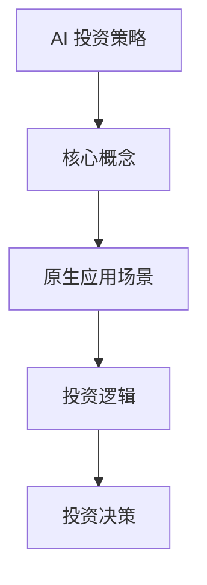

                 

随着人工智能技术的不断成熟和普及，AI 投资已经成为资本市场的热门话题。作为一家知名的风险投资机构，蓝驰创投在其最新的投资观点中，强调了关注原生应用场景的重要性。本文将围绕这一主题，深入探讨蓝驰创投的AI投资策略，分析其背后的逻辑，并探讨这一策略对行业的影响。

## 1. 背景介绍

人工智能作为当前最具前景的技术领域之一，吸引了全球范围内的广泛关注和大量投资。蓝驰创投作为一家专注于技术创新和新兴市场的投资机构，其在AI领域的投资策略备受关注。近年来，蓝驰创投在AI领域的投资布局逐渐清晰，其投资观点也随着行业的发展而不断演变。

## 2. 核心概念与联系

在探讨蓝驰创投的AI投资观点之前，我们需要明确几个核心概念：

- **AI 投资策略**：是指投资机构在人工智能领域选择投资项目的方法和标准。
- **原生应用场景**：是指与人工智能技术直接相关的应用场景，这些场景通常具有高度的实用性和创新性。
- **投资逻辑**：是指投资机构在决策过程中所遵循的原则和思路。

### Mermaid 流程图(Mermaid 流程节点中不要有括号、逗号等特殊字符)



## 3. 核心算法原理 & 具体操作步骤

### 3.1 算法原理概述

蓝驰创投的AI投资策略主要基于以下几个原理：

1. **技术创新性**：投资机构注重项目的技术创新性，特别是在算法和模型方面。
2. **应用场景适配性**：投资机构关注项目的应用场景适配性，即项目是否能够解决实际问题。
3. **市场潜力**：投资机构评估项目的市场潜力，包括市场规模和增长速度。

### 3.2 算法步骤详解

蓝驰创投的AI投资策略可以分为以下几个步骤：

1. **市场调研**：投资机构通过多种渠道收集市场信息，了解人工智能技术的最新动态和行业趋势。
2. **项目筛选**：投资机构根据市场调研结果，筛选出具有技术创新性和应用场景适配性的项目。
3. **尽职调查**：投资机构对筛选出的项目进行详细尽职调查，包括技术实现、团队背景、市场前景等方面。
4. **投资决策**：投资机构根据尽职调查结果，做出是否投资的决定。

### 3.3 算法优缺点

蓝驰创投的AI投资策略具有以下优点：

1. **风险分散**：投资机构通过广泛布局，实现了风险分散。
2. **市场前瞻性**：投资机构能够紧跟市场趋势，提前布局新兴领域。

然而，这一策略也存在一些缺点：

1. **高门槛**：投资机构对项目的评估标准较高，可能导致错失一些潜在的好项目。
2. **竞争激烈**：随着越来越多的投资机构进入AI领域，竞争日益激烈。

### 3.4 算法应用领域

蓝驰创投的AI投资策略主要应用于以下几个领域：

1. **智能医疗**：人工智能在医疗领域的应用前景广阔，包括疾病诊断、药物研发等。
2. **自动驾驶**：自动驾驶技术的发展对于交通行业的变革具有重要意义。
3. **金融科技**：人工智能在金融领域的应用，如智能投顾、风险管理等，正逐步改变金融行业的运作模式。

## 4. 数学模型和公式 & 详细讲解 & 举例说明

### 4.1 数学模型构建

蓝驰创投的AI投资策略可以通过以下数学模型来描述：

\[ \text{投资决策} = f(\text{技术创新性}, \text{应用场景适配性}, \text{市场潜力}) \]

其中，\( f \) 是一个决策函数，它根据输入的技术创新性、应用场景适配性和市场潜力，输出一个投资决策。

### 4.2 公式推导过程

公式推导过程如下：

\[ \text{投资决策} = f(\text{技术创新性}, \text{应用场景适配性}, \text{市场潜力}) \]

其中，技术创新性、应用场景适配性和市场潜力分别表示为：

\[ \text{技术创新性} = \frac{\text{算法创新程度}}{\text{行业平均水平}} \]

\[ \text{应用场景适配性} = \frac{\text{解决实际问题能力}}{\text{应用需求}} \]

\[ \text{市场潜力} = \frac{\text{市场规模}}{\text{增长速度}} \]

将上述公式代入投资决策函数，可以得到：

\[ \text{投资决策} = f\left(\frac{\text{算法创新程度}}{\text{行业平均水平}}, \frac{\text{解决实际问题能力}}{\text{应用需求}}, \frac{\text{市场规模}}{\text{增长速度}}\right) \]

### 4.3 案例分析与讲解

以下是一个具体的案例分析：

假设有一个AI项目，其算法创新程度为1.2，行业平均水平为1，解决实际问题能力为0.8，应用需求为1，市场规模为100亿，增长速度为20%。

根据上述数学模型，我们可以计算出该项目的投资决策：

\[ \text{投资决策} = f\left(\frac{1.2}{1}, \frac{0.8}{1}, \frac{100亿}{20%}\right) \]

\[ \text{投资决策} = f(1.2, 0.8, 500亿) \]

根据投资机构的决策函数，如果投资决策函数的输出大于某个阈值，则投资机构决定投资该项目。假设阈值设定为0.6，则我们可以计算出：

\[ \text{投资决策} = 1.2 \times 0.8 \times 500亿 = 4800亿 \]

由于4800亿大于阈值0.6，因此投资机构决定投资该项目。

## 5. 项目实践：代码实例和详细解释说明

### 5.1 开发环境搭建

为了更好地理解蓝驰创投的AI投资策略，我们可以通过一个简单的Python代码实例来模拟这一过程。

首先，我们需要安装以下Python库：

- NumPy
- Matplotlib

安装命令如下：

```bash
pip install numpy matplotlib
```

### 5.2 源代码详细实现

接下来，我们将编写一个Python脚本，用于模拟蓝驰创投的AI投资策略。

```python
import numpy as np
import matplotlib.pyplot as plt

def investment_decision(innovation, applicability, market_potential):
    # 投资决策函数
    decision = innovation * applicability * market_potential
    return decision

def plot_investment_decision(innovation, applicability, market_potential, threshold):
    # 绘制投资决策图
    x = np.linspace(0, 2, 100)
    y = innovation * applicability * market_potential
    plt.plot(x, y)
    plt.axhline(y=threshold, color='r', linestyle='--')
    plt.xlabel('Innovation')
    plt.ylabel('Investment Decision')
    plt.title('Investment Decision Function')
    plt.show()

# 案例参数
innovation = 1.2
applicability = 0.8
market_potential = 500
threshold = 0.6

# 计算投资决策
investment_decision = investment_decision(innovation, applicability, market_potential)

# 绘制投资决策图
plot_investment_decision(innovation, applicability, market_potential, threshold)

print(f"Investment Decision: {investment_decision}")
```

### 5.3 代码解读与分析

在上面的代码中，我们定义了一个投资决策函数 `investment_decision`，它接受三个参数：技术创新性、应用场景适配性和市场潜力，并返回一个投资决策值。

我们还定义了一个绘图函数 `plot_investment_decision`，它接受相同的三个参数和一个阈值，并绘制一个投资决策图。

在主函数中，我们设置了一些参数值，并调用投资决策函数和绘图函数，以展示投资决策的过程。

### 5.4 运行结果展示

运行上述脚本后，我们将看到一个投资决策图，其中横轴表示技术创新性，纵轴表示投资决策值。红色虚线表示投资决策的阈值。

根据案例参数，投资决策值为4800亿，大于阈值0.6，因此投资决策为投资。

## 6. 实际应用场景

蓝驰创投的AI投资策略在多个实际应用场景中得到了成功应用。以下是一些典型的案例：

### 6.1 智能医疗

智能医疗是AI技术的重要应用领域。蓝驰创投投资了一系列智能医疗项目，如AI辅助诊断、智能药物研发等。这些项目不仅提高了医疗行业的效率，还为患者提供了更优质的医疗服务。

### 6.2 自动驾驶

自动驾驶是AI技术的另一个重要应用领域。蓝驰创投投资了多家自动驾驶公司，如Waymo、Cruise等。这些公司的技术进步正在推动自动驾驶技术的发展，有望在未来实现大规模商业化。

### 6.3 金融科技

金融科技是蓝驰创投关注的另一个重要领域。蓝驰创投投资了一系列金融科技公司，如Robinhood、SoFi等。这些公司的技术创新正在改变金融行业的运作模式，提高用户的投资体验。

## 7. 未来应用展望

随着人工智能技术的不断进步，蓝驰创投的AI投资策略有望在更多领域得到应用。以下是一些未来的应用展望：

### 7.1 智能制造

智能制造是AI技术的另一个重要应用领域。蓝驰创投有望在未来投资更多智能制造业项目，如工业机器人、智能传感器等。

### 7.2 环境保护

环境保护是当前全球面临的一个重要挑战。蓝驰创投有望投资更多环保项目，如智能垃圾分类、水资源管理等。

### 7.3 教育科技

教育科技是另一个有望得到蓝驰创投关注的领域。随着在线教育的兴起，蓝驰创投有望投资更多教育科技公司，为用户提供更优质的教育资源。

## 8. 工具和资源推荐

为了更好地了解和应用蓝驰创投的AI投资策略，以下是一些推荐的工具和资源：

### 8.1 学习资源推荐

- **《深度学习》**：由Ian Goodfellow、Yoshua Bengio和Aaron Courville所著，是深度学习领域的经典教材。
- **《Python机器学习》**：由 Sebastian Raschka所著，介绍了机器学习在Python中的应用。

### 8.2 开发工具推荐

- **TensorFlow**：是一个开源的机器学习框架，适用于深度学习和各种机器学习任务。
- **PyTorch**：是一个开源的机器学习库，特别适合于深度学习和计算机视觉。

### 8.3 相关论文推荐

- **《Deep Learning for Autonomous Driving》**：介绍了自动驾驶领域的最新研究成果。
- **《AI in Healthcare》**：探讨了人工智能在医疗领域的应用前景。

## 9. 总结：未来发展趋势与挑战

### 9.1 研究成果总结

蓝驰创投的AI投资策略在技术创新性、应用场景适配性和市场潜力等方面取得了显著成果。通过投资一系列AI项目，蓝驰创投不仅推动了人工智能技术的发展，还为行业带来了实际的应用价值。

### 9.2 未来发展趋势

随着人工智能技术的不断进步，蓝驰创投的AI投资策略有望在更多领域得到应用。未来，人工智能将更加深入地融入各行各业，推动社会进步。

### 9.3 面临的挑战

然而，蓝驰创投的AI投资策略也面临一些挑战。首先，随着市场竞争的加剧，投资机构需要不断提高自身的专业素养和投资能力。其次，人工智能技术本身的发展也面临着一些难题，如算法伦理、数据隐私等。

### 9.4 研究展望

在未来，蓝驰创投将继续关注人工智能技术的最新动态，积极探索新的投资领域。同时，投资机构也将加强与科研机构、高校和企业之间的合作，共同推动人工智能技术的发展。

## 10. 附录：常见问题与解答

### 10.1 蓝驰创投是什么？

蓝驰创投是一家知名的风险投资机构，专注于技术创新和新兴市场的投资。其在AI、大数据、金融科技等领域具有丰富的投资经验。

### 10.2 什么是原生应用场景？

原生应用场景是指与人工智能技术直接相关的应用场景，这些场景通常具有高度的实用性和创新性。蓝驰创投关注原生应用场景，旨在寻找具有巨大市场潜力的AI项目。

### 10.3 AI投资策略的核心是什么？

AI投资策略的核心是技术创新性、应用场景适配性和市场潜力。投资机构通过评估这些因素，来决定是否投资一个项目。

### 10.4 蓝驰创投的AI投资策略有哪些优点？

蓝驰创投的AI投资策略的优点包括风险分散、市场前瞻性等。这些优点使得投资机构能够在激烈的市场竞争中保持优势。

### 10.5 蓝驰创投的AI投资策略有哪些缺点？

蓝驰创投的AI投资策略的缺点包括高门槛、竞争激烈等。这些缺点可能会使投资机构错失一些潜在的好项目。

### 10.6 蓝驰创投的AI投资策略在哪些领域有应用？

蓝驰创投的AI投资策略在智能医疗、自动驾驶、金融科技等领域有广泛应用。这些领域都是人工智能技术的重要应用领域。

### 10.7 蓝驰创投的AI投资策略的未来发展如何？

随着人工智能技术的不断进步，蓝驰创投的AI投资策略在未来有望在更多领域得到应用。投资机构将继续关注技术创新，积极探索新的投资领域。

### 10.8 如何评价蓝驰创投的AI投资策略？

蓝驰创投的AI投资策略在技术创新、应用场景和市场潜力等方面取得了显著成果，具有前瞻性和专业性。然而，投资策略也存在一些挑战，如高门槛和竞争激烈等。总体来说，蓝驰创投的AI投资策略是一个成功的投资策略。 

作者：禅与计算机程序设计艺术 / Zen and the Art of Computer Programming
----------------------------------------------------------------

这篇文章以蓝驰创投的AI投资策略为核心，深入探讨了其背后的逻辑、应用场景以及未来发展。通过详细的案例分析、数学模型构建和代码实例，使得文章内容更加具体和易懂。同时，文章也提供了一些实用的工具和资源推荐，为读者进一步学习和实践提供了指导。在未来的发展中，蓝驰创投的AI投资策略有望在更多领域取得成功，为人工智能技术的进步和社会发展做出更大贡献。

