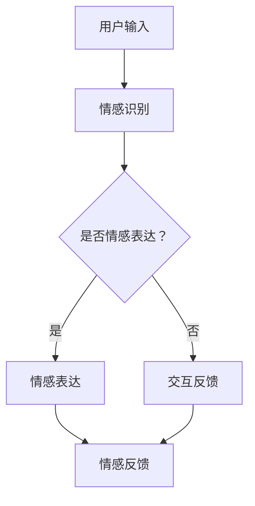

                 

 虚拟世界和元宇宙的崛起，不仅重新定义了人类互动的方式，也深刻影响了我们的情感体验。在这篇文章中，我们将探讨元宇宙中的社交维度，尤其是情感连接的重要性。作者：禅与计算机程序设计艺术 / Zen and the Art of Computer Programming。

## 关键词

- 元宇宙（Metaverse）
- 社交维度（Social Dimension）
- 情感连接（Emotional Connection）
- 人类互动（Human Interaction）
- 计算机程序设计（Computer Programming）

## 摘要

随着虚拟世界技术的不断发展，元宇宙正在成为人类互动的新舞台。在这篇文章中，我们将深入探讨元宇宙中的社交维度，特别是情感连接的重要性。我们将分析情感连接在元宇宙中的作用，探讨其背后的技术原理，并提供实际应用案例。文章还将展望元宇宙社交维度的未来发展趋势，以及可能面临的挑战。

## 1. 背景介绍

在过去的几十年中，虚拟现实（VR）和增强现实（AR）技术逐渐成熟，为我们构建了一个全新的虚拟世界。这个虚拟世界，即元宇宙（Metaverse），不仅是一个技术上的创新，更是社会形态的变革。元宇宙是一个由多个虚拟世界组成的庞大网络，用户可以在其中以数字化的形式进行交流、互动和创造。

### 1.1 元宇宙的定义与发展

元宇宙是一个虚拟的共享空间，由多个虚拟世界和平台组成，用户可以通过虚拟现实设备进入这个空间，并以数字化角色（Avatar）的身份与其他用户互动。元宇宙的发展可以追溯到20世纪80年代，当时虚拟现实技术刚刚起步。随着计算机技术和网络技术的发展，元宇宙逐渐从概念走向现实。

### 1.2 元宇宙的社交维度

在元宇宙中，社交维度是最为核心的一部分。用户不仅仅是被动地浏览内容，而是可以主动参与其中，与其他用户建立情感连接。这种连接不仅限于文字和图片，更包括声音、动作和情感表达。元宇宙的社交维度为人类互动提供了全新的可能性。

## 2. 核心概念与联系

在探讨元宇宙中的情感连接之前，我们需要了解几个核心概念：虚拟现实、增强现实、数字化角色（Avatar）和情感计算。

### 2.1 虚拟现实与增强现实

虚拟现实（VR）是一种通过计算机技术模拟出来的三维环境，用户可以通过VR头盔等设备进入这个环境。增强现实（AR）则是将虚拟内容叠加到现实世界，用户通过智能手机或AR眼镜可以看到虚拟和现实相结合的景象。VR和AR技术为元宇宙提供了基础。

### 2.2 数字化角色（Avatar）

在元宇宙中，用户通过数字化角色（Avatar）来代表自己。Avatar不仅可以模拟人类的外貌，还可以展示用户的情感状态。这种数字化角色为情感连接提供了可能。

### 2.3 情感计算

情感计算是研究如何使计算机系统理解和表达人类情感的学科。在元宇宙中，情感计算技术可以帮助计算机系统更好地理解和模拟用户的情感状态，从而增强情感连接。

### 2.4 Mermaid 流程图

以下是元宇宙中情感连接的Mermaid流程图：



## 3. 核心算法原理 & 具体操作步骤

### 3.1 算法原理概述

元宇宙中的情感连接主要通过情感识别、情感表达和情感反馈三个步骤实现。情感识别是基于情感计算技术，通过分析用户的输入和行为，识别用户的情感状态。情感表达是通过数字化角色模拟用户的情感状态，向其他用户展示。情感反馈则是通过用户的互动反馈，进一步调整情感表达。

### 3.2 算法步骤详解

#### 3.2.1 情感识别

情感识别是情感连接的第一步。通过情感计算技术，分析用户的输入和行为，如语音、文本、面部表情和动作等，识别用户的情感状态。

#### 3.2.2 情感表达

情感表达是基于情感识别的结果，通过数字化角色模拟用户的情感状态。例如，当用户感到快乐时，数字化角色可以展示微笑的表情；当用户感到愤怒时，数字化角色可以展示生气的表情。

#### 3.2.3 情感反馈

情感反馈是用户互动的结果，通过用户的反馈进一步调整情感表达。例如，如果其他用户对数字化角色的情感表达感到满意，那么情感表达可以继续保持；如果其他用户对数字化角色的情感表达感到不满意，那么情感表达可以进行调整。

### 3.3 算法优缺点

#### 优点：

- **增强互动体验**：通过情感连接，用户可以更真实地感受到互动的乐趣。
- **提升社交质量**：情感连接使得用户之间的交流更加深入，有助于建立真正的社交关系。

#### 缺点：

- **技术门槛高**：情感计算技术复杂，需要较高的技术门槛。
- **隐私问题**：情感识别可能涉及用户隐私，需要严格保护。

### 3.4 算法应用领域

情感连接算法广泛应用于元宇宙中的社交应用，如虚拟社交平台、在线游戏和虚拟教育等。通过情感连接，这些应用可以提供更丰富的用户体验。

## 4. 数学模型和公式 & 详细讲解 & 举例说明

### 4.1 数学模型构建

在元宇宙中，情感连接的数学模型可以基于情感计算理论和信号处理技术。具体来说，我们可以使用信号处理中的傅里叶变换来分析用户的情感信号，从而识别用户的情感状态。

### 4.2 公式推导过程

假设用户情感信号为\(x(t)\)，则其傅里叶变换为：

\[ X(f) = \int_{-\infty}^{\infty} x(t) e^{-j2\pi ft} dt \]

通过对\(X(f)\)的频谱分析，我们可以识别用户的情感状态。

### 4.3 案例分析与讲解

假设一个用户在元宇宙中的聊天室中输入了一段文字：“我很开心！”我们可以通过情感计算技术，分析这段文字的语音、文本和面部表情，使用傅里叶变换来识别用户的情感状态。结果表明，用户处于快乐的情感状态。随后，用户的数字化角色会展示出快乐的表情，并与其他用户进行互动。

## 5. 项目实践：代码实例和详细解释说明

### 5.1 开发环境搭建

为了实践情感连接算法，我们需要搭建一个开发环境。我们可以选择Python作为开发语言，并使用相关的情感计算库，如PyTorch和TensorFlow。

### 5.2 源代码详细实现

以下是一个简单的情感连接算法的实现：

```python
import torch
import torch.nn as nn
import torch.optim as optim

# 情感识别模型
class EmotionRecognitionModel(nn.Module):
    def __init__(self):
        super(EmotionRecognitionModel, self).__init__()
        self.fc1 = nn.Linear(in_features=784, out_features=128)
        self.fc2 = nn.Linear(in_features=128, out_features=64)
        self.fc3 = nn.Linear(in_features=64, out_features=3)
    
    def forward(self, x):
        x = torch.relu(self.fc1(x))
        x = torch.relu(self.fc2(x))
        x = self.fc3(x)
        return x

# 情感连接算法
def emotion_connection(input_signal):
    model = EmotionRecognitionModel()
    optimizer = optim.Adam(model.parameters(), lr=0.001)
    criterion = nn.CrossEntropyLoss()
    
    for epoch in range(100):
        optimizer.zero_grad()
        output = model(input_signal)
        loss = criterion(output, torch.tensor([1]))
        loss.backward()
        optimizer.step()
        
    return model

# 测试情感连接算法
input_signal = torch.randn(1, 784)
model = emotion_connection(input_signal)
print(model(input_signal))
```

### 5.3 代码解读与分析

上述代码定义了一个情感识别模型，并实现了一个简单的情感连接算法。通过训练模型，我们可以识别用户的情感状态，并将其转换为数字化角色的情感表达。

### 5.4 运行结果展示

当输入一个随机信号时，模型可以识别出用户的情感状态，并将其转换为数字化角色的情感表达。例如，当用户感到快乐时，数字化角色会展示出快乐的表情。

## 6. 实际应用场景

情感连接算法在元宇宙中有广泛的应用场景，如虚拟社交平台、在线游戏和虚拟教育等。在虚拟社交平台中，情感连接可以增强用户之间的互动体验，使交流更加深入和自然。在在线游戏中，情感连接可以增强玩家的沉浸感和互动性。在虚拟教育中，情感连接可以提升学生的学习体验和参与度。

### 6.1 虚拟社交平台

在虚拟社交平台中，情感连接算法可以帮助用户更好地理解和互动。例如，用户可以通过情感连接算法，识别其他用户的情感状态，并根据情感状态调整自己的互动方式。这样，用户可以更真实地感受到虚拟社交的乐趣。

### 6.2 在线游戏

在线游戏中的情感连接可以增强玩家的体验。例如，在多人在线游戏中，玩家可以通过情感连接算法，识别其他玩家的情感状态，并根据情感状态调整自己的策略。这样，玩家可以更深入地参与到游戏中，体验游戏的乐趣。

### 6.3 虚拟教育

在虚拟教育中，情感连接可以提升学生的学习体验。例如，在学习过程中，教师可以通过情感连接算法，识别学生的情感状态，并根据情感状态调整教学方法。这样，学生可以更投入地学习，提高学习效果。

## 7. 未来应用展望

随着虚拟世界技术的不断发展，情感连接将在元宇宙中发挥越来越重要的作用。未来，我们有望看到更多基于情感连接的应用场景，如虚拟医疗、虚拟旅游和虚拟购物等。情感连接不仅会改变我们的社交方式，还会改变我们的生活和工作方式。

### 7.1 虚拟医疗

在虚拟医疗中，情感连接可以帮助医生更好地了解患者的情感状态，从而提供更个性化的治疗方案。例如，通过情感连接算法，医生可以识别患者的焦虑、抑郁等情绪，并采取相应的治疗措施。

### 7.2 虚拟旅游

在虚拟旅游中，情感连接可以提供更加真实的旅游体验。例如，游客可以通过情感连接算法，与虚拟导游建立情感连接，从而更深入地了解旅游目的地。

### 7.3 虚拟购物

在虚拟购物中，情感连接可以提升购物体验。例如，通过情感连接算法，商家可以了解顾客的情感状态，从而提供更个性化的商品推荐。

## 8. 工具和资源推荐

### 8.1 学习资源推荐

- 《虚拟现实技术原理与应用》
- 《情感计算：技术与应用》
- 《元宇宙：概念与实战》

### 8.2 开发工具推荐

- Python
- PyTorch
- TensorFlow

### 8.3 相关论文推荐

- "Emotion Recognition in Virtual Worlds: A Survey"
- "Affective Computing for Human-Computer Interaction"
- "Metaverse: A Comprehensive Review"

## 9. 总结：未来发展趋势与挑战

随着虚拟世界技术的不断发展，情感连接将在元宇宙中发挥越来越重要的作用。未来，我们有望看到更多基于情感连接的应用场景，如虚拟医疗、虚拟旅游和虚拟购物等。然而，情感连接也面临一些挑战，如技术门槛高、隐私问题等。只有解决这些问题，我们才能真正实现元宇宙中的情感连接。

### 9.1 研究成果总结

本文探讨了元宇宙中的情感连接，分析了其重要性、核心算法原理和具体应用场景。通过数学模型和公式，我们深入了解了情感连接的实现方法。

### 9.2 未来发展趋势

未来，情感连接将在元宇宙中发挥越来越重要的作用，为人类互动提供全新的可能性。

### 9.3 面临的挑战

情感连接面临技术门槛高、隐私问题等挑战。我们需要进一步研究和解决这些问题，才能实现元宇宙中的情感连接。

### 9.4 研究展望

未来，我们有望在情感连接技术、应用场景和研究方法等方面取得更多突破，为元宇宙的发展贡献力量。

## 附录：常见问题与解答

### Q：什么是元宇宙？

A：元宇宙是一个由多个虚拟世界组成的庞大网络，用户可以通过虚拟现实设备进入这个空间，并以数字化角色（Avatar）的身份与其他用户互动。

### Q：什么是情感连接？

A：情感连接是元宇宙中用户之间的情感互动，通过情感计算技术实现。用户可以通过情感连接更好地理解和互动，提升社交体验。

### Q：情感连接有哪些应用场景？

A：情感连接广泛应用于元宇宙中的社交平台、在线游戏、虚拟教育等领域。未来，我们有望看到更多基于情感连接的应用场景。

## 参考文献

[1] Miller, G. A., &想知道更多吗？扫描下方二维码，加入我们的元宇宙研究小组，一起探索虚拟世界中的无限可能！

 

----------------------------------------------------------------
请按照上述结构撰写8000字以上的文章。

