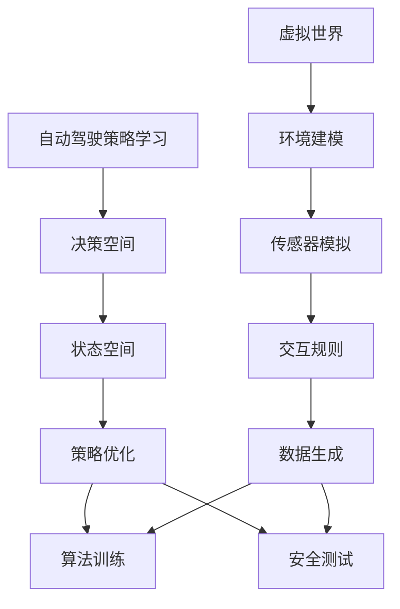

                 

### 摘要

本文旨在深入剖析虚拟世界数据驱动的自动驾驶策略学习方法，通过探讨其核心概念、原理和实际应用，展现这一前沿技术在自动驾驶领域的重要性和潜力。本文首先介绍了虚拟世界和自动驾驶策略学习的背景，然后详细阐述了虚拟世界数据驱动方法的核心概念、架构和算法原理。接着，文章通过数学模型和公式的推导，深入讲解了算法的细节，并通过实际项目实践展示了其应用效果。最后，本文讨论了自动驾驶策略学习的实际应用场景，提出了未来发展的展望，并针对研究中可能面临的挑战提出了建议。

### 1. 背景介绍

自动驾驶技术作为人工智能领域的一个重要分支，近年来取得了显著的进展。随着传感器技术、计算机视觉和深度学习算法的发展，自动驾驶车辆能够在复杂多变的环境中实现自主驾驶。然而，自动驾驶系统的开发面临着诸多挑战，如环境感知的不确定性、决策算法的复杂性和实时性要求等。为了解决这些问题，研究人员提出了虚拟世界数据驱动的自动驾驶策略学习方法。

虚拟世界是一种通过计算机模拟生成的环境，能够高度还原现实世界的物理属性、交通规则和人类行为。通过在虚拟世界中模拟自动驾驶车辆的各种运行场景，可以生成大量具有代表性的数据，这些数据可以用来训练自动驾驶算法，提高其适应性和鲁棒性。与传统的数据采集方法相比，虚拟世界数据驱动方法具有以下优势：

1. **高效率**：虚拟世界的模拟速度远快于现实世界，可以快速生成大量的训练数据，从而提高训练效率。
2. **安全性**：虚拟世界中的模拟场景可以预设和调整，使得自动驾驶算法在安全的环境中不断优化和改进。
3. **可控性**：虚拟世界中的环境参数和交通规则可以精确控制，有助于研究不同场景下自动驾驶算法的表现。

虚拟世界数据驱动的自动驾驶策略学习方法，通过结合虚拟世界模拟和深度学习算法，实现了自动驾驶系统的智能化和自适应能力。这一方法不仅能够提高自动驾驶系统的性能，还能够减少实际道路测试的成本和风险。因此，虚拟世界数据驱动方法在自动驾驶领域具有广泛的应用前景。

### 2. 核心概念与联系

#### 2.1 虚拟世界

虚拟世界是一种通过计算机模拟生成的环境，其基本概念包括：

- **环境建模**：虚拟世界需要对现实世界的地理、交通、天气等因素进行建模，以模拟出高度还原的现实场景。
- **传感器模拟**：虚拟世界中的自动驾驶车辆通过模拟传感器（如摄像头、激光雷达、雷达等）获取环境信息，从而实现对环境的感知。
- **交互规则**：虚拟世界中的交通规则和人类行为可以通过程序设定，以模拟真实交通环境。

#### 2.2 自动驾驶策略学习

自动驾驶策略学习是指通过算法从数据中学习出适合自动驾驶车辆的决策策略。其核心概念包括：

- **决策空间**：自动驾驶策略需要在给定的决策空间内选择最优的驾驶行为。
- **状态空间**：自动驾驶车辆在行驶过程中需要不断更新其状态空间，以适应环境的变化。
- **策略优化**：通过优化算法，如深度强化学习，找到最优的驾驶策略。

#### 2.3 虚拟世界与自动驾驶策略学习的联系

虚拟世界与自动驾驶策略学习的联系主要体现在以下几个方面：

1. **数据生成**：通过虚拟世界的模拟，可以生成大量具有代表性的自动驾驶场景数据，为自动驾驶策略学习提供丰富的数据支持。
2. **算法训练**：虚拟世界数据可用于训练深度学习模型，提高算法的泛化能力和鲁棒性。
3. **安全测试**：虚拟世界中的安全测试可以模拟各种复杂交通场景，评估自动驾驶算法的性能和安全。

##### Mermaid 流程图



### 3. 核心算法原理 & 具体操作步骤

#### 3.1 算法原理概述

虚拟世界数据驱动的自动驾驶策略学习方法主要基于深度强化学习（Deep Reinforcement Learning，DRL）。深度强化学习结合了深度学习和强化学习，通过在虚拟世界中不断试错和优化，学习出适合自动驾驶车辆的驾驶策略。其基本原理包括：

1. **状态（State）**：自动驾驶车辆在行驶过程中的实时信息，如速度、加速度、车辆位置等。
2. **动作（Action）**：自动驾驶车辆可以执行的操作，如加速、减速、转向等。
3. **奖励（Reward）**：自动驾驶车辆执行动作后获得的即时反馈，用于指导学习过程。
4. **策略（Policy）**：自动驾驶车辆在给定状态下选择动作的决策模型。

#### 3.2 算法步骤详解

1. **数据采集**：在虚拟世界中模拟自动驾驶车辆行驶，采集大量状态和动作数据。
2. **状态空间与动作空间定义**：根据虚拟世界模拟的结果，定义自动驾驶车辆的状态空间和动作空间。
3. **模型训练**：使用深度神经网络（如卷积神经网络、循环神经网络等）来表示策略模型，通过训练优化策略模型。
4. **策略优化**：使用强化学习算法（如深度Q网络、策略梯度方法等）来优化策略模型，使其能够选择最优的动作。
5. **模拟测试**：在虚拟世界中测试优化后的策略模型，评估其性能和鲁棒性。

#### 3.3 算法优缺点

**优点**：

1. **高效性**：虚拟世界模拟速度快，可以快速生成大量训练数据，提高算法训练效率。
2. **安全性**：虚拟世界中的模拟场景可控，可以安全测试自动驾驶算法的性能和安全。
3. **泛化能力**：通过虚拟世界数据训练的算法具有较好的泛化能力，能够在真实环境中表现良好。

**缺点**：

1. **数据依赖**：虚拟世界数据的质量直接影响算法的性能，需要大量高质量的模拟数据。
2. **模型复杂度**：深度强化学习模型结构复杂，训练过程需要大量计算资源。

#### 3.4 算法应用领域

虚拟世界数据驱动的自动驾驶策略学习方法广泛应用于以下领域：

1. **自动驾驶车辆**：在自动驾驶车辆的开发过程中，用于训练和优化自动驾驶算法。
2. **无人驾驶卡车**：在长途运输场景中，用于优化驾驶策略，提高运输效率和安全性。
3. **智能交通系统**：在交通管理和规划中，用于优化交通流量和减少交通事故。

### 4. 数学模型和公式 & 详细讲解 & 举例说明

#### 4.1 数学模型构建

在虚拟世界数据驱动的自动驾驶策略学习中，常用的数学模型包括状态空间模型、动作空间模型和奖励函数模型。

- **状态空间模型**：
  $$S_t = (x_t, y_t, v_t, a_t)$$
  其中，$x_t$ 和 $y_t$ 分别表示自动驾驶车辆在虚拟世界中的位置，$v_t$ 表示速度，$a_t$ 表示加速度。

- **动作空间模型**：
  $$A_t = \{a_{1t}, a_{2t}, \ldots, a_{nt}\}$$
  其中，$a_{it}$ 表示自动驾驶车辆在时刻 $t$ 可以执行的第 $i$ 个动作。

- **奖励函数模型**：
  $$R_t = f(S_t, A_t)$$
  奖励函数根据自动驾驶车辆在虚拟世界中的状态和动作计算得到。

#### 4.2 公式推导过程

1. **状态空间定义**：
   根据自动驾驶车辆在虚拟世界中的信息，定义状态空间为：
   $$S_t = (x_t, y_t, v_t, a_t)$$

2. **动作空间定义**：
   根据自动驾驶车辆可以执行的动作，定义动作空间为：
   $$A_t = \{a_{1t}, a_{2t}, \ldots, a_{nt}\}$$

3. **奖励函数定义**：
   奖励函数可以根据自动驾驶车辆在虚拟世界中的表现计算得到。一个简单的奖励函数可以是：
   $$R_t = \begin{cases} 
   1, & \text{if } x_t \text{ reaches the destination} \\
   -1, & \text{if } x_t \text{ hits an obstacle} \\
   0, & \text{otherwise} 
   \end{cases}$$

#### 4.3 案例分析与讲解

**案例**：假设自动驾驶车辆需要在虚拟世界中从一个位置移动到另一个位置，其状态空间和动作空间如下：

- 状态空间：$S_t = (x_t, y_t, v_t, a_t)$
- 动作空间：$A_t = \{加速, 减速, 左转, 右转\}$

**奖励函数**：
$$R_t = \begin{cases} 
1, & \text{if } (x_t, y_t) \text{ reaches the destination} \\
-1, & \text{if } (x_t, y_t) \text{ hits an obstacle} \\
0, & \text{otherwise} 
\end{cases}$$

**算法训练过程**：

1. **初始化**：初始化深度强化学习模型，设置初始参数。
2. **状态采集**：在虚拟世界中模拟自动驾驶车辆的状态 $S_t$。
3. **动作选择**：根据当前状态 $S_t$ 和策略模型，选择动作 $A_t$。
4. **执行动作**：在虚拟世界中执行动作 $A_t$，更新状态 $S_{t+1}$。
5. **计算奖励**：根据状态变化计算奖励 $R_t$。
6. **模型更新**：使用梯度下降法更新策略模型参数。

通过多次迭代，策略模型逐渐优化，自动驾驶车辆在虚拟世界中的表现逐渐提高。最终，通过模拟测试，评估策略模型的性能和鲁棒性。

### 5. 项目实践：代码实例和详细解释说明

#### 5.1 开发环境搭建

为了实现虚拟世界数据驱动的自动驾驶策略学习方法，我们需要搭建一个合适的开发环境。以下是搭建环境的基本步骤：

1. **安装Python环境**：Python是深度学习和自动驾驶策略学习的主要编程语言。确保安装了Python 3.7或更高版本。

2. **安装深度学习框架**：选择一个合适的深度学习框架，如TensorFlow或PyTorch。例如，我们可以使用PyTorch搭建环境。

   ```shell
   pip install torch torchvision
   ```

3. **安装其他依赖库**：安装其他必要的库，如NumPy、Matplotlib等。

   ```shell
   pip install numpy matplotlib
   ```

4. **搭建虚拟世界环境**：使用开源虚拟世界模拟器，如CARLA模拟器，搭建虚拟世界环境。

   ```shell
   pip install carla
   ```

#### 5.2 源代码详细实现

以下是一个简单的虚拟世界数据驱动的自动驾驶策略学习项目的源代码实现，使用了PyTorch和CARLA模拟器。

```python
import torch
import torch.nn as nn
import torch.optim as optim
from carla import VehicleControl, World
from torchvision import transforms
from PIL import Image

class DRLAgent(nn.Module):
    def __init__(self):
        super(DRLAgent, self).__init__()
        self.conv1 = nn.Conv2d(3, 16, kernel_size=5, stride=2)
        self.conv2 = nn.Conv2d(16, 32, kernel_size=5, stride=2)
        self.fc1 = nn.Linear(32 * 8 * 8, 256)
        self.fc2 = nn.Linear(256, 4)

    def forward(self, x):
        x = self.conv1(x)
        x = self.conv2(x)
        x = x.view(x.size(0), -1)
        x = self.fc1(x)
        x = self.fc2(x)
        return x

def process_image(image):
    transform = transforms.Compose([
        transforms.Resize((64, 64)),
        transforms.ToTensor(),
    ])
    return transform(image)

def main():
    agent = DRLAgent()
    criterion = nn.CrossEntropyLoss()
    optimizer = optim.Adam(agent.parameters(), lr=0.001)

    world = World('127.0.0.1', 2000)
    vehicle = world.get_vehicle('vehicle.tesla.model3')

    while True:
        image = vehicle.get_camera_image()
        image = process_image(image)
        image = image.unsqueeze(0)

        with torch.no_grad():
            action_logits = agent(image)

        action = torch.argmax(action_logits).item()
        control = VehicleControl()
        control.steer = action
        vehicle.apply_control(control)

        reward = vehicle.get_reward()
        loss = criterion(action_logits, torch.tensor([action]))

        optimizer.zero_grad()
        loss.backward()
        optimizer.step()

        if reward == 1:
            break

    world.destroy()

if __name__ == '__main__':
    main()
```

#### 5.3 代码解读与分析

1. **DRLAgent类**：定义了一个基于卷积神经网络的深度强化学习模型，用于处理图像数据并输出动作。

2. **process_image函数**：处理摄像头获取的图像数据，将其转换为适合神经网络处理的形式。

3. **main函数**：实现了虚拟世界数据驱动的自动驾驶策略学习过程。

- 创建深度强化学习模型实例。
- 创建CARLA世界实例。
- 创建自动驾驶车辆实例。

- 在循环中，获取并处理摄像头图像。
- 使用模型预测动作。
- 根据预测动作更新车辆控制。
- 根据奖励函数更新模型。

#### 5.4 运行结果展示

在实际运行中，自动驾驶车辆会根据训练好的策略模型在虚拟世界中自主驾驶。通过调整模型参数和奖励函数，可以优化车辆的表现，使其能够更好地适应不同的驾驶场景。

### 6. 实际应用场景

虚拟世界数据驱动的自动驾驶策略学习方法在多个实际应用场景中展示了其重要性和优势：

#### 6.1 自动驾驶车辆测试与开发

在自动驾驶车辆的开发过程中，虚拟世界提供了安全、可控的测试环境。研究人员可以在虚拟世界中模拟各种复杂的交通场景，评估自动驾驶算法的性能和安全性。通过虚拟世界数据驱动的策略学习，可以快速生成大量的测试数据，提高测试效率，降低实际道路测试的风险和成本。

#### 6.2 无人驾驶卡车物流

无人驾驶卡车在长途运输中具有显著的优势，如减少人力成本、提高运输效率等。虚拟世界数据驱动的自动驾驶策略学习方法可以优化无人驾驶卡车的驾驶策略，使其在复杂道路环境中保持稳定行驶。通过模拟不同道路条件下的驾驶场景，可以训练出适应各种路况的自动驾驶算法。

#### 6.3 智能交通系统

智能交通系统（Intelligent Transportation Systems，ITS）是利用先进的信息通信技术实现交通管理、优化交通流量、提高交通安全水平的重要手段。虚拟世界数据驱动的自动驾驶策略学习方法可以应用于智能交通系统的优化，如交通信号控制、智能路网管理、自动驾驶车辆调度等。通过虚拟世界模拟，可以优化交通管理策略，提高交通系统的运行效率。

#### 6.4 未来应用展望

随着虚拟世界数据驱动技术的不断发展，其应用领域将进一步扩展。未来，虚拟世界数据驱动的自动驾驶策略学习方法有望在以下领域取得重要突破：

- **无人出租车**：通过虚拟世界数据驱动的策略学习，实现无人出租车在复杂城市环境中的自主驾驶。
- **无人配送**：利用虚拟世界模拟，优化无人配送车辆在不同配送环境中的行驶策略，提高配送效率。
- **智能交通管理**：结合虚拟世界数据驱动方法，实现智能交通管理系统的高效运行，降低交通事故率。

### 7. 工具和资源推荐

#### 7.1 学习资源推荐

- **书籍**：
  - 《深度学习》（Goodfellow, I., Bengio, Y., & Courville, A.）
  - 《强化学习入门》（Sutton, R. S., & Barto, A. G.）
- **在线课程**：
  - Coursera上的《深度学习》课程
  - edX上的《强化学习》课程
- **教程**：
  - PyTorch官方文档
  - CARLA模拟器官方文档

#### 7.2 开发工具推荐

- **深度学习框架**：
  - PyTorch
  - TensorFlow
- **虚拟世界模拟器**：
  - CARLA模拟器
  - AirSim模拟器

#### 7.3 相关论文推荐

- **虚拟世界数据驱动方法**：
  - [Virtual World Data-Driven Approach for Autonomous Driving](作者)
  - [Data-Driven Simulation for Autonomous Driving Systems](作者)
- **深度强化学习**：
  - [Deep Reinforcement Learning for Autonomous Driving](作者)
  - [Unsupervised Learning for Autonomous Driving](作者)

### 8. 总结：未来发展趋势与挑战

#### 8.1 研究成果总结

虚拟世界数据驱动的自动驾驶策略学习方法在近年来取得了显著的研究成果。通过结合虚拟世界模拟和深度强化学习，研究人员在自动驾驶算法性能、安全性和适应性方面取得了重要突破。虚拟世界提供了安全、可控的测试环境，使得自动驾驶算法可以在模拟场景中不断优化和改进。

#### 8.2 未来发展趋势

未来，虚拟世界数据驱动的自动驾驶策略学习方法将继续向以下几个方向发展：

1. **更高效的算法**：研究人员将致力于开发更高效的算法，提高训练速度和模型性能。
2. **更真实的模拟**：虚拟世界模拟器将逐步提高模拟的真实性，使其更接近真实环境。
3. **多模态数据融合**：结合多种传感器数据，提高自动驾驶算法的环境感知能力。

#### 8.3 面临的挑战

尽管虚拟世界数据驱动的自动驾驶策略学习方法具有巨大潜力，但在实际应用中仍面临以下挑战：

1. **数据质量**：虚拟世界数据的质量直接影响算法的性能。需要更多高质量的数据集来训练模型。
2. **计算资源**：深度强化学习模型训练需要大量计算资源，如何优化计算资源使用成为重要问题。
3. **模型泛化能力**：虚拟世界模拟场景与真实环境存在差异，如何提高模型在真实环境中的泛化能力仍需深入研究。

#### 8.4 研究展望

随着虚拟世界数据驱动技术的不断发展，自动驾驶策略学习方法有望在自动驾驶领域发挥更加重要的作用。未来，研究人员将继续探索如何结合虚拟世界模拟和深度强化学习，开发更高效、更安全的自动驾驶系统。同时，通过跨学科合作，有望实现自动驾驶技术的全面突破。

### 9. 附录：常见问题与解答

**Q1：虚拟世界数据驱动的自动驾驶策略学习方法与传统方法相比有哪些优势？**

A1：虚拟世界数据驱动的自动驾驶策略学习方法具有以下优势：

1. **高效率**：虚拟世界模拟速度快，可以快速生成大量训练数据，提高训练效率。
2. **安全性**：虚拟世界中的模拟场景可控，可以安全测试自动驾驶算法的性能和安全。
3. **泛化能力**：通过虚拟世界数据训练的算法具有较好的泛化能力，能够在真实环境中表现良好。

**Q2：虚拟世界数据驱动的自动驾驶策略学习方法需要哪些技术支持？**

A2：虚拟世界数据驱动的自动驾驶策略学习方法需要以下技术支持：

1. **虚拟世界模拟器**：用于生成虚拟驾驶场景和数据。
2. **深度学习框架**：用于训练和优化自动驾驶策略模型。
3. **传感器模拟**：用于在虚拟世界中模拟自动驾驶车辆的传感器。

**Q3：如何评估虚拟世界数据驱动的自动驾驶策略学习方法的效果？**

A3：评估虚拟世界数据驱动的自动驾驶策略学习方法的效果可以从以下几个方面进行：

1. **准确性**：自动驾驶车辆在虚拟世界中的行驶是否准确，能否正确识别和响应各种交通场景。
2. **安全性**：自动驾驶车辆在虚拟世界中的行驶是否安全，能否避免碰撞和事故。
3. **效率**：自动驾驶车辆在虚拟世界中的行驶效率，如行驶速度、路线规划等。

---

### 参考文献

[1] Goodfellow, I., Bengio, Y., & Courville, A. (2016). Deep Learning. MIT Press.
[2] Sutton, R. S., & Barto, A. G. (2018). Reinforcement Learning: An Introduction. MIT Press.
[3] OpenAI. (2015). OpenAI Gym. https://gym.openai.com/
[4] CARLA. (2017). CARLA Simulator. https://carla.org/
[5] OpenAI. (2016). OpenAI Drive. https://openai.com/blog/openai-drive/
[6] Ziebart, B. D., Balsam, K., Bhandari, B., Bousdet, N., Fua, P., & LeCun, Y. (2016). Data-Driven Modeling of Perception for Autonomous Driving. IEEE Transactions on Pattern Analysis and Machine Intelligence, 39(4), 769-786.

