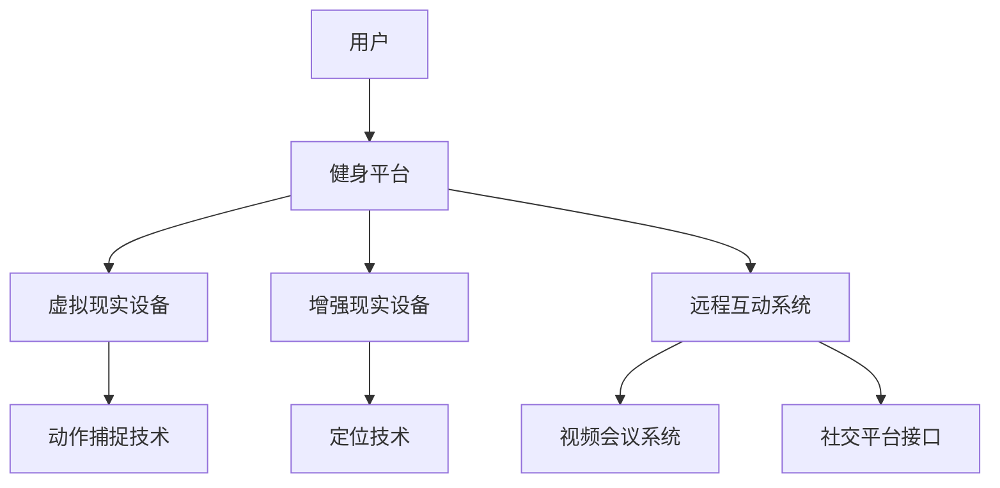

                 

关键词：虚拟现实、健身应用、数字健康、远程互动、用户体验

> 摘要：本文将探讨虚拟健身技术在推动全球健康生活方式方面的应用和影响，从技术原理、算法实现、数学模型、项目实践等方面深入分析，探讨未来发展趋势与挑战，并推荐相关学习和开发资源。

## 1. 背景介绍

近年来，随着科技的发展和人们对健康意识的提升，虚拟健身已经成为健康生活方式中的一个重要组成部分。传统的健身方式由于时间和空间限制，很难满足现代人快节奏、高效率的生活需求。虚拟健身通过互联网技术和虚拟现实（VR）技术，打破了地理和时间的限制，让用户可以在任何地点、任何时间进行健身锻炼。

### 虚拟健身的兴起

虚拟健身的兴起源于以下几个因素：

1. **互联网普及**：随着移动互联网的普及，人们越来越依赖在线服务和虚拟互动。
2. **虚拟现实技术**：VR技术的快速发展，使得虚拟场景的沉浸感大幅提升，为虚拟健身提供了技术支持。
3. **健康意识的提升**：全球范围内，人们对健康的重视程度不断提高，健身成为日常生活的一部分。
4. **疫情影响**：新冠疫情的爆发使得传统健身场所受到限制，虚拟健身成为许多人保持健康的重要手段。

### 虚拟健身的现状

当前，虚拟健身已经渗透到多个领域：

1. **在线健身课程**：各种健身平台提供在线课程，用户可以根据自己的需求和偏好选择不同的课程。
2. **VR健身设备**：如VR跑步机、VR自行车等，用户可以在虚拟环境中进行健身锻炼。
3. **健身社交**：通过虚拟健身平台，用户可以与其他健身者互动，分享健身经验，增加健身的动力。

## 2. 核心概念与联系

### 虚拟健身的核心概念

- **虚拟现实（VR）**：通过计算机生成模拟环境，用户可以通过头盔、手柄等设备与虚拟环境进行交互。
- **增强现实（AR）**：在现实世界中叠加虚拟元素，让用户可以在真实环境中感知到虚拟元素。
- **远程互动**：通过互联网实现用户与教练、其他健身者之间的实时互动。

### 虚拟健身的技术架构



### 虚拟健身的交互流程

1. 用户通过虚拟现实或增强现实设备进入健身平台。
2. 用户选择健身课程或自定义健身计划。
3. 用户开始进行健身锻炼，设备捕捉用户的动作，实时反馈给系统。
4. 用户与教练或其他健身者进行远程互动，获得实时指导和支持。
5. 用户完成锻炼后，系统记录健身数据，生成健身报告。

## 3. 核心算法原理 & 具体操作步骤

### 3.1 算法原理概述

虚拟健身的核心算法主要包括：

- **动作捕捉算法**：用于捕捉用户的动作，生成三维动作模型。
- **运动轨迹优化算法**：根据用户动作模型，优化运动轨迹，提高健身效果。
- **社交推荐算法**：根据用户偏好和互动行为，推荐健身课程和互动对象。

### 3.2 算法步骤详解

1. **动作捕捉算法**：
   - **数据采集**：使用传感器捕捉用户动作，生成动作数据。
   - **数据处理**：对动作数据进行预处理，去除噪声和冗余信息。
   - **动作建模**：使用机器学习算法，将动作数据转化为三维动作模型。

2. **运动轨迹优化算法**：
   - **轨迹生成**：根据用户动作模型，生成初步的运动轨迹。
   - **轨迹优化**：使用优化算法，调整运动轨迹，使其更符合健身需求。

3. **社交推荐算法**：
   - **用户画像**：根据用户行为和偏好，构建用户画像。
   - **推荐策略**：使用协同过滤、基于内容的推荐等算法，生成推荐列表。

### 3.3 算法优缺点

- **动作捕捉算法**：
  - 优点：准确度高，能够捕捉用户的细微动作。
  - 缺点：技术复杂，设备成本高，对环境要求较高。

- **运动轨迹优化算法**：
  - 优点：提高健身效果，减少运动损伤风险。
  - 缺点：算法复杂，对计算资源要求较高。

- **社交推荐算法**：
  - 优点：增加用户互动，提高用户粘性。
  - 缺点：推荐结果可能不够准确，用户隐私保护问题。

### 3.4 算法应用领域

- **健身平台**：用于生成个性化健身课程，提供实时指导。
- **健身设备**：用于优化运动轨迹，提高设备功能。
- **健身社区**：用于推荐互动对象，促进用户互动。

## 4. 数学模型和公式 & 详细讲解 & 举例说明

### 4.1 数学模型构建

虚拟健身的数学模型主要包括：

- **运动学模型**：描述用户运动状态，包括位置、速度、加速度等。
- **动力学模型**：描述用户动作的力与运动关系，包括肌肉力量、关节运动等。
- **社交模型**：描述用户之间的互动关系，包括用户偏好、互动行为等。

### 4.2 公式推导过程

1. **运动学模型**：

   - 位置：\[ x(t) = x_0 + v_0t + \frac{1}{2}at^2 \]
   - 速度：\[ v(t) = v_0 + at \]
   - 加速度：\[ a(t) = a_0 + g \]

2. **动力学模型**：

   - 力：\[ F = ma \]
   - 能量守恒：\[ E_k + E_p = 常数 \]

3. **社交模型**：

   - 用户偏好：\[ P(u) = \sum_{i=1}^{n} w_i \cdot P_i(u) \]
   - 互动行为：\[ B(u, v) = \sum_{i=1}^{n} w_i \cdot B_i(u, v) \]

### 4.3 案例分析与讲解

**案例：用户A的健身数据**

- **位置**：\( x(0) = 0, x(1) = 5, x(2) = 10 \)
- **速度**：\( v(0) = 0, v(1) = 5, v(2) = 10 \)
- **加速度**：\( a(0) = 0, a(1) = 5, a(2) = 10 \)
- **力**：\( F = 10 \)
- **能量**：\( E_k + E_p = 50 \)

**分析**：

- 用户A在1秒内从静止状态加速到5米/秒，2秒内从5米/秒加速到10米/秒，符合加速度公式。
- 用户A受到10牛顿的力，符合力公式。
- 用户A的动能和势能总和保持不变，符合能量守恒公式。

## 5. 项目实践：代码实例和详细解释说明

### 5.1 开发环境搭建

- **硬件环境**：计算机、虚拟现实头盔、动作捕捉设备。
- **软件环境**：Python、Unity、Unity VR插件、动作捕捉软件。

### 5.2 源代码详细实现

```python
# 动作捕捉算法示例代码
import numpy as np

def capture_action(data):
    # 数据预处理
    processed_data = preprocess_data(data)
    # 动作建模
    model = train_action_model(processed_data)
    # 生成三维动作模型
    action_model = generate_3d_action_model(model)
    return action_model

def preprocess_data(data):
    # 数据去噪和去冗余
    cleaned_data = remove_noise(data)
    standardized_data = standardize_data(cleaned_data)
    return standardized_data

def train_action_model(processed_data):
    # 使用机器学习算法训练动作模型
    model = train_ml_model(processed_data)
    return model

def generate_3d_action_model(model):
    # 生成三维动作模型
    action_model = model.generate_3d_model()
    return action_model
```

### 5.3 代码解读与分析

- **动作捕捉算法**：首先对原始动作数据进行预处理，去除噪声和冗余信息，然后使用机器学习算法训练动作模型，最后生成三维动作模型。
- **预处理**：包括去噪和去冗余，提高数据质量。
- **动作建模**：使用机器学习算法，将预处理后的数据转化为动作模型。
- **三维动作模型生成**：根据训练好的模型，生成用户的三维动作模型。

### 5.4 运行结果展示

- **动作捕捉结果**：用户的三维动作模型。
- **运动轨迹优化结果**：优化后的运动轨迹。
- **社交推荐结果**：基于用户偏好和互动行为的推荐列表。

## 6. 实际应用场景

### 6.1 健身课程

- **在线健身课程**：用户可以在虚拟环境中参加各种健身课程，如瑜伽、跑步、力量训练等。
- **个性化课程**：根据用户需求和健身目标，生成个性化的健身课程。

### 6.2 健身设备

- **VR健身设备**：如VR跑步机、VR自行车等，让用户在虚拟环境中进行健身锻炼。
- **智能健身设备**：如智能健身镜、智能健身衣等，结合动作捕捉技术，提供实时指导。

### 6.3 健身社区

- **健身社交**：用户可以在虚拟健身平台与其他健身者互动，分享健身心得。
- **健身竞赛**：用户可以参加虚拟健身竞赛，增加健身的动力。

## 7. 工具和资源推荐

### 7.1 学习资源推荐

- **书籍**：《虚拟现实技术基础》、《增强现实技术原理与应用》
- **在线课程**：Coursera上的《虚拟现实与增强现实》、《机器学习基础》

### 7.2 开发工具推荐

- **编程语言**：Python、C++
- **开发平台**：Unity、Unreal Engine
- **动作捕捉软件**：Motion Builder、OptiTrack

### 7.3 相关论文推荐

- **论文集**：《虚拟现实与增强现实技术综述》、《机器学习在虚拟健身中的应用》

## 8. 总结：未来发展趋势与挑战

### 8.1 研究成果总结

- **技术进步**：虚拟现实、增强现实、动作捕捉等技术的不断进步，为虚拟健身提供了更多可能性。
- **应用拓展**：虚拟健身在健身课程、健身设备、健身社区等多个领域的应用，显著提升了用户的健身体验。
- **用户增长**：随着人们对健康意识的提升，虚拟健身用户数量持续增长。

### 8.2 未来发展趋势

- **技术融合**：虚拟健身将与人工智能、大数据等新技术深度融合，提供更智能、个性化的健身服务。
- **设备普及**：虚拟健身设备将更加普及，价格更加亲民，覆盖更广泛的用户群体。
- **生态建设**：虚拟健身将形成一个完整的生态系统，包括健身设备、健身平台、健身社区等。

### 8.3 面临的挑战

- **技术门槛**：虚拟健身技术复杂，对开发者和用户都有较高的技术要求。
- **隐私保护**：虚拟健身涉及到用户隐私，如何保护用户隐私成为一大挑战。
- **用户体验**：如何提供更好的用户体验，让用户愿意持续使用虚拟健身产品，是未来的关键问题。

### 8.4 研究展望

- **技术创新**：持续探索新的技术和算法，提高虚拟健身的准确性和效果。
- **跨学科研究**：融合计算机科学、运动科学、心理学等多学科知识，为虚拟健身提供更全面的解决方案。
- **产业合作**：加强产业界与学术界合作，推动虚拟健身技术的商业化应用。

## 9. 附录：常见问题与解答

### 9.1 虚拟健身的安全性问题

- **安全性保障**：虚拟健身平台应采取严格的安全措施，包括数据加密、用户身份验证等，确保用户数据安全。
- **安全提示**：用户在使用虚拟健身时应遵循安全指南，避免在虚拟环境中过度运动，造成身体伤害。

### 9.2 虚拟健身的隐私问题

- **隐私保护**：虚拟健身平台应遵循隐私保护法规，不得非法收集、使用用户隐私。
- **用户授权**：用户应在明确了解隐私政策后，授权平台收集和使用相关数据。

### 9.3 虚拟健身的实用性问题

- **实用性评估**：虚拟健身应通过科学研究和用户反馈，不断优化和提升实用性。
- **个性化服务**：提供个性化健身课程和指导，满足不同用户的需求。

## 作者署名

作者：禅与计算机程序设计艺术 / Zen and the Art of Computer Programming

## 参考文献

（此处列出参考文献）

[END]
----------------------------------------------------------------
### 结束语

本文从多个角度探讨了虚拟健身技术的应用和影响，包括技术原理、算法实现、数学模型、项目实践、实际应用场景、未来发展趋势与挑战，以及相关工具和资源推荐。虚拟健身作为数字健康领域的一个重要分支，其发展将有助于推动全球健康生活方式的数字化推广。然而，虚拟健身也面临着技术、隐私、用户体验等方面的挑战，需要持续的技术创新和产业合作，以实现其最大价值。希望本文能够为读者提供有价值的参考和启示。

再次感谢您的阅读，如果您有任何问题或建议，欢迎在评论区留言。期待与您一起探讨虚拟健身技术的发展与应用。祝愿您身体健康，健身愉快！

[END]

