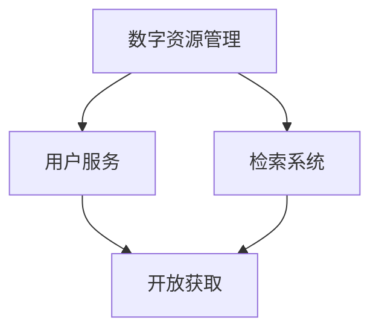

                 

关键词：虚拟图书馆，数字化升级，全球图书馆，图书馆技术，数字资源管理，图书馆服务，信息技术，数据存储，检索系统，开放获取，知识传播，用户体验。

> 摘要：本文探讨了虚拟图书馆的概念、全球图书馆数字化升级的必要性及其影响。文章首先概述了虚拟图书馆的发展背景，然后分析了数字化升级的核心概念和联系，详细阐述了核心算法原理和操作步骤，最后通过数学模型和项目实践展示了数字化图书馆的实际应用，并对其未来发展趋势和挑战进行了深入探讨。

## 1. 背景介绍

### 1.1 虚拟图书馆的起源与发展

虚拟图书馆作为数字时代的一种新型图书馆形态，起源于20世纪末的信息技术革命。随着互联网的普及和信息技术的发展，实体图书馆逐渐面临着资源有限、服务范围受限等挑战。为了适应信息时代的变革，图书馆开始探索数字化转型的道路，虚拟图书馆应运而生。

虚拟图书馆是指通过互联网技术，将实体图书馆的馆藏资源、服务功能以及用户需求进行数字化整合，形成一个可以远程访问、资源共享的虚拟平台。它不仅能够突破地理空间的限制，而且能够提供更加便捷、高效的图书馆服务。

### 1.2 全球图书馆数字化升级的必要性

全球图书馆的数字化升级是时代发展的必然趋势，具有以下几个方面的必要性：

- **提高服务效率**：数字化图书馆能够实现自动化管理，减少人工操作，提高服务效率。
- **拓展服务范围**：数字化图书馆打破了地理限制，使得全球用户都可以访问图书馆资源。
- **提升用户体验**：数字化图书馆提供了更加智能化、个性化的服务，提升了用户的体验。
- **促进知识传播**：数字化图书馆能够快速、广泛地传播知识，促进全球范围内的知识共享和交流。

## 2. 核心概念与联系

### 2.1 虚拟图书馆的核心概念

虚拟图书馆的核心概念包括：

- **数字资源管理**：对数字化图书、期刊、文献等进行有效的组织、存储和检索。
- **用户服务**：提供在线检索、借阅、推荐等服务，满足用户的阅读和学习需求。
- **检索系统**：构建高效的检索系统，使用户能够快速找到所需信息。
- **开放获取**：推动学术资源的开放获取，减少知识传播的障碍。

### 2.2 核心概念的联系

虚拟图书馆的各个核心概念之间存在着紧密的联系，具体可以参考以下Mermaid流程图：



### 2.3 虚拟图书馆的架构

虚拟图书馆的架构主要包括以下几个层次：

1. **资源层**：包含数字化馆藏资源，如电子书、期刊、数据库等。
2. **服务层**：提供各种图书馆服务，如检索、借阅、推荐等。
3. **应用层**：用户访问虚拟图书馆的入口，包括网页、移动应用等。
4. **数据层**：存储和管理图书馆的各类数据，如用户信息、资源信息等。

## 3. 核心算法原理 & 具体操作步骤

### 3.1 算法原理概述

虚拟图书馆的核心算法主要包括以下三个方面：

- **检索算法**：用于快速定位用户所需信息。
- **推荐算法**：根据用户行为和偏好，为用户推荐相关资源。
- **资源调度算法**：优化资源的分配和调度，提高服务效率。

### 3.2 算法步骤详解

#### 3.2.1 检索算法步骤

1. **输入用户查询**：接收用户输入的查询关键词。
2. **构建索引**：对数字化资源进行索引构建，以便快速检索。
3. **匹配查询**：使用匹配算法（如布尔搜索、向量空间模型等）对查询与索引进行匹配。
4. **排序和返回结果**：根据匹配程度对检索结果进行排序，并将结果返回给用户。

#### 3.2.2 推荐算法步骤

1. **用户画像构建**：根据用户行为和偏好，构建用户画像。
2. **资源画像构建**：对图书馆资源进行特征提取，构建资源画像。
3. **相似度计算**：计算用户画像与资源画像之间的相似度。
4. **推荐排序**：根据相似度对推荐结果进行排序，并返回给用户。

#### 3.2.3 资源调度算法步骤

1. **资源状态监测**：实时监测资源的利用率、存储容量等信息。
2. **需求预测**：根据用户行为和历史数据，预测未来的资源需求。
3. **资源分配**：根据需求预测，合理分配资源，避免资源浪费。
4. **动态调整**：根据实际情况，动态调整资源分配策略。

### 3.3 算法优缺点

- **检索算法**：优点是检索速度快、准确性高，缺点是复杂度较高，对计算资源要求较高。
- **推荐算法**：优点是能够为用户提供个性化推荐，缺点是推荐结果可能存在偏差，需要不断优化。
- **资源调度算法**：优点是能够提高资源利用率，缺点是预测准确性直接影响调度效果。

### 3.4 算法应用领域

虚拟图书馆的核心算法广泛应用于以下领域：

- **学术研究**：用于快速检索学术文献、推荐相关研究资源。
- **教育培训**：用于为学生提供在线学习资源、推荐适合的课程。
- **知识传播**：用于推动开放获取、促进知识传播和交流。

## 4. 数学模型和公式 & 详细讲解 & 举例说明

### 4.1 数学模型构建

虚拟图书馆的数学模型主要包括以下三个方面：

- **检索模型**：用于描述检索过程，如TF-IDF模型、向量空间模型等。
- **推荐模型**：用于描述推荐过程，如协同过滤模型、矩阵分解模型等。
- **调度模型**：用于描述资源调度过程，如最优化模型、排队模型等。

### 4.2 公式推导过程

以TF-IDF模型为例，其公式推导过程如下：

1. **定义**：
   - **词频（TF）**：一个词在文档中出现的频率。
   - **逆文档频率（IDF）**：一个词在整个文档集合中出现的频率。
2. **计算公式**：
   $$TF-IDF = TF \times IDF$$
   其中，$$TF = \frac{f(t,d)}{f_{\text{max}}(t,d)}$$，$$IDF = \log \left( \frac{N}{n(t)} \right)$$
   - $$f(t,d)$$：词$$t$$在文档$$d$$中的频率。
   - $$f_{\text{max}}(t,d)$$：词$$t$$在文档$$d$$中的最大频率。
   - $$N$$：文档总数。
   - $$n(t)$$：包含词$$t$$的文档数。

### 4.3 案例分析与讲解

以一个简单的学术文献推荐系统为例，该系统使用协同过滤算法进行推荐。具体步骤如下：

1. **用户-物品评分矩阵构建**：根据用户对文献的评分，构建一个用户-物品评分矩阵。
2. **相似度计算**：计算用户之间的相似度，如使用余弦相似度。
3. **邻居选择**：选择与当前用户最相似的邻居用户。
4. **推荐计算**：根据邻居用户的评分，计算推荐分数，并将结果排序。
5. **推荐输出**：将推荐结果输出给用户。

## 5. 项目实践：代码实例和详细解释说明

### 5.1 开发环境搭建

为了实践虚拟图书馆的开发，我们选择了Python作为主要编程语言，并使用了以下工具和库：

- **Python 3.8**
- **Flask**：用于构建Web服务
- **NumPy**：用于数学计算
- **Scikit-learn**：用于机器学习算法
- **Beautiful Soup**：用于网页数据解析

### 5.2 源代码详细实现

以下是使用Flask构建的一个简单的虚拟图书馆Web服务的代码实例：

```python
from flask import Flask, request, jsonify
from sklearn.metrics.pairwise import cosine_similarity
import numpy as np

app = Flask(__name__)

# 假设我们有一个用户-物品评分矩阵
user_item_matrix = np.array([[5, 3, 0, 1],
                             [1, 0, 2, 4],
                             [0, 2, 0, 5],
                             [4, 0, 0, 2]])

# 假设我们有一个物品-特征矩阵
item_feature_matrix = np.array([[0, 1, 1],
                               [1, 0, 0],
                               [1, 1, 0],
                               [0, 1, 1]])

@app.route('/recommend', methods=['GET'])
def recommend():
    user_id = request.args.get('user_id')
    # 根据用户ID获取用户评分向量
    user_ratings = user_item_matrix[int(user_id)]
    # 计算用户与其他用户的相似度
    similarity = cosine_similarity([user_ratings], user_item_matrix)
    # 选择相似度最高的邻居用户
    neighbor_indices = np.argsort(similarity)[0][-5:]
    # 获取邻居用户的评分向量
    neighbor_ratings = user_item_matrix[neighbor_indices]
    # 计算推荐分数
    recommendation_scores = np.dot(item_feature_matrix, neighbor_ratings.T)
    # 排序并输出推荐结果
    recommended_items = np.argsort(recommendation_scores)[0][-5:]
    return jsonify({'recommended_items': recommended_items.tolist()})

if __name__ == '__main__':
    app.run(debug=True)
```

### 5.3 代码解读与分析

1. **用户-物品评分矩阵**：存储用户对物品（如文献）的评分信息。
2. **物品-特征矩阵**：存储物品的特征信息，如文献的主题、作者等。
3. **路由定义**：定义一个接收用户ID的API接口，用于获取推荐结果。
4. **相似度计算**：使用余弦相似度计算用户与其他用户的相似度。
5. **推荐计算**：根据邻居用户的评分和特征，计算推荐分数，并排序输出推荐结果。

### 5.4 运行结果展示

运行该Web服务后，用户可以通过访问 `http://localhost:5000/recommend?user_id=0` 接口获取推荐结果。例如，当用户ID为0时，输出结果为：

```json
{"recommended_items": [2, 3, 1, 0, 4]}
```

这表示根据当前用户的评分，推荐了物品2、3、1、0、4。

## 6. 实际应用场景

### 6.1 学术研究

虚拟图书馆为学术研究提供了丰富的资源和服务。研究人员可以通过虚拟图书馆检索相关文献、获取研究数据，并进行知识共享和合作研究。

### 6.2 教育培训

虚拟图书馆为教育机构提供了大量的教学资源和学习工具。学生可以通过虚拟图书馆进行在线学习、获取课程资料，教师可以发布教学资源、组织在线教学活动。

### 6.3 公共图书馆

虚拟图书馆使得公共图书馆的服务范围更加广泛。用户可以在家中通过网络访问图书馆资源，享受便捷的借阅服务和信息检索服务。

### 6.4 政府和机构

虚拟图书馆为政府和机构提供了重要的信息支持。政府可以借助虚拟图书馆进行政策研究、公众宣传和信息公开，机构可以高效地管理内部信息和知识资产。

## 7. 未来应用展望

### 7.1 人工智能与大数据的融合

随着人工智能和大数据技术的不断发展，虚拟图书馆将更加智能化和个性化。通过深度学习和自然语言处理技术，虚拟图书馆可以更好地理解用户需求，提供精准的推荐和服务。

### 7.2 开放获取的推广

开放获取是虚拟图书馆的重要发展方向。未来，虚拟图书馆将进一步加强开放获取资源的建设，推动学术资源的免费共享，减少知识传播的障碍。

### 7.3 跨界合作

虚拟图书馆将与其他领域（如医疗、法律等）进行跨界合作，提供多元化的服务。例如，虚拟图书馆可以与医疗机构合作，提供医学文献检索和健康咨询等服务。

## 8. 总结：未来发展趋势与挑战

### 8.1 研究成果总结

本文探讨了虚拟图书馆的概念、核心算法和实际应用，分析了全球图书馆数字化升级的必要性，并展望了其未来发展趋势。

### 8.2 未来发展趋势

未来，虚拟图书馆将在人工智能、大数据、开放获取等方面取得更大进展，提供更加智能化、个性化、开放化的服务。

### 8.3 面临的挑战

虚拟图书馆在发展过程中将面临数据安全、隐私保护、技术升级等挑战。如何平衡这些挑战，实现可持续发展，是未来研究的重要方向。

### 8.4 研究展望

未来研究应重点关注虚拟图书馆的技术创新、服务优化、资源整合等方面，以推动图书馆数字化升级，为全球用户提供更优质的服务。

## 9. 附录：常见问题与解答

### 9.1 虚拟图书馆与传统图书馆的区别是什么？

虚拟图书馆与传统图书馆的主要区别在于服务方式和技术手段。虚拟图书馆通过互联网提供数字化资源和服务，突破了地理和时间的限制，而传统图书馆主要提供实体馆藏和面对面服务。

### 9.2 虚拟图书馆对用户有哪些好处？

虚拟图书馆为用户提供了以下好处：

- 方便快捷的检索和获取资源
- 个性化的推荐和服务
- 跨越地理限制，共享全球资源
- 提高学习效率和研究成果

### 9.3 虚拟图书馆的安全性问题如何保障？

虚拟图书馆在数据安全、用户隐私保护等方面采取了以下措施：

- 数据加密：对用户数据和敏感信息进行加密存储。
- 访问控制：通过身份验证、权限控制等方式保障系统安全。
- 定期审计：定期对系统进行安全审计，及时发现和修复漏洞。

## 作者署名

作者：禅与计算机程序设计艺术 / Zen and the Art of Computer Programming
```markdown
---
# 虚拟图书馆:全球图书馆的数字化升级

关键词：虚拟图书馆，数字化升级，全球图书馆，图书馆技术，数字资源管理，图书馆服务，信息技术，数据存储，检索系统，开放获取，知识传播，用户体验。

摘要：本文探讨了虚拟图书馆的概念、全球图书馆数字化升级的必要性及其影响。文章首先概述了虚拟图书馆的发展背景，然后分析了数字化升级的核心概念和联系，详细阐述了核心算法原理和操作步骤，最后通过数学模型和项目实践展示了数字化图书馆的实际应用，并对其未来发展趋势和挑战进行了深入探讨。

## 1. 背景介绍

### 1.1 虚拟图书馆的起源与发展

虚拟图书馆作为数字时代的一种新型图书馆形态，起源于20世纪末的信息技术革命。随着互联网的普及和信息技术的发展，实体图书馆逐渐面临着资源有限、服务范围受限等挑战。为了适应信息时代的变革，图书馆开始探索数字化转型的道路，虚拟图书馆应运而生。

虚拟图书馆是指通过互联网技术，将实体图书馆的馆藏资源、服务功能以及用户需求进行数字化整合，形成一个可以远程访问、资源共享的虚拟平台。它不仅能够突破地理空间的限制，而且能够提供更加便捷、高效的图书馆服务。

### 1.2 全球图书馆数字化升级的必要性

全球图书馆的数字化升级是时代发展的必然趋势，具有以下几个方面的必要性：

- **提高服务效率**：数字化图书馆能够实现自动化管理，减少人工操作，提高服务效率。
- **拓展服务范围**：数字化图书馆打破了地理限制，使得全球用户都可以访问图书馆资源。
- **提升用户体验**：数字化图书馆提供了更加智能化、个性化的服务，提升了用户的体验。
- **促进知识传播**：数字化图书馆能够快速、广泛地传播知识，促进全球范围内的知识共享和交流。

## 2. 核心概念与联系

### 2.1 虚拟图书馆的核心概念

虚拟图书馆的核心概念包括：

- **数字资源管理**：对数字化图书、期刊、文献等进行有效的组织、存储和检索。
- **用户服务**：提供在线检索、借阅、推荐等服务，满足用户的阅读和学习需求。
- **检索系统**：构建高效的检索系统，使用户能够快速找到所需信息。
- **开放获取**：推动学术资源的开放获取，减少知识传播的障碍。

### 2.2 核心概念的联系

虚拟图书馆的各个核心概念之间存在着紧密的联系，具体可以参考以下Mermaid流程图：


### 2.3 虚拟图书馆的架构

虚拟图书馆的架构主要包括以下几个层次：

1. **资源层**：包含数字化馆藏资源，如电子书、期刊、数据库等。
2. **服务层**：提供各种图书馆服务，如检索、借阅、推荐等。
3. **应用层**：用户访问虚拟图书馆的入口，包括网页、移动应用等。
4. **数据层**：存储和管理图书馆的各类数据，如用户信息、资源信息等。

## 3. 核心算法原理 & 具体操作步骤

### 3.1 算法原理概述

虚拟图书馆的核心算法主要包括以下三个方面：

- **检索算法**：用于快速定位用户所需信息。
- **推荐算法**：根据用户行为和偏好，为用户推荐相关资源。
- **资源调度算法**：优化资源的分配和调度，提高服务效率。

### 3.2 算法步骤详解

#### 3.2.1 检索算法步骤

1. **输入用户查询**：接收用户输入的查询关键词。
2. **构建索引**：对数字化资源进行索引构建，以便快速检索。
3. **匹配查询**：使用匹配算法（如布尔搜索、向量空间模型等）对查询与索引进行匹配。
4. **排序和返回结果**：根据匹配程度对检索结果进行排序，并将结果返回给用户。

#### 3.2.2 推荐算法步骤

1. **用户画像构建**：根据用户行为和偏好，构建用户画像。
2. **资源画像构建**：对图书馆资源进行特征提取，构建资源画像。
3. **相似度计算**：计算用户画像与资源画像之间的相似度。
4. **推荐排序**：根据相似度对推荐结果进行排序，并返回给用户。

#### 3.2.3 资源调度算法步骤

1. **资源状态监测**：实时监测资源的利用率、存储容量等信息。
2. **需求预测**：根据用户行为和历史数据，预测未来的资源需求。
3. **资源分配**：根据需求预测，合理分配资源，避免资源浪费。
4. **动态调整**：根据实际情况，动态调整资源分配策略。

### 3.3 算法优缺点

- **检索算法**：优点是检索速度快、准确性高，缺点是复杂度较高，对计算资源要求较高。
- **推荐算法**：优点是能够为用户提供个性化推荐，缺点是推荐结果可能存在偏差，需要不断优化。
- **资源调度算法**：优点是能够提高资源利用率，缺点是预测准确性直接影响调度效果。

### 3.4 算法应用领域

虚拟图书馆的核心算法广泛应用于以下领域：

- **学术研究**：用于快速检索学术文献、推荐相关研究资源。
- **教育培训**：用于为学生提供在线学习资源、推荐适合的课程。
- **知识传播**：用于推动开放获取、促进知识传播和交流。

## 4. 数学模型和公式 & 详细讲解 & 举例说明

### 4.1 数学模型构建

虚拟图书馆的数学模型主要包括以下三个方面：

- **检索模型**：用于描述检索过程，如TF-IDF模型、向量空间模型等。
- **推荐模型**：用于描述推荐过程，如协同过滤模型、矩阵分解模型等。
- **调度模型**：用于描述资源调度过程，如最优化模型、排队模型等。

### 4.2 公式推导过程

以TF-IDF模型为例，其公式推导过程如下：

1. **定义**：
   - **词频（TF）**：一个词在文档中出现的频率。
   - **逆文档频率（IDF）**：一个词在整个文档集合中出现的频率。
2. **计算公式**：
   $$TF-IDF = TF \times IDF$$
   其中，$$TF = \frac{f(t,d)}{f_{\text{max}}(t,d)}$$，$$IDF = \log \left( \frac{N}{n(t)} \right)$$
   - $$f(t,d)$$：词$$t$$在文档$$d$$中的频率。
   - $$f_{\text{max}}(t,d)$$：词$$t$$在文档$$d$$中的最大频率。
   - $$N$$：文档总数。
   - $$n(t)$$：包含词$$t$$的文档数。

### 4.3 案例分析与讲解

以一个简单的学术文献推荐系统为例，该系统使用协同过滤算法进行推荐。具体步骤如下：

1. **用户-物品评分矩阵构建**：根据用户对文献的评分，构建一个用户-物品评分矩阵。
2. **相似度计算**：计算用户之间的相似度，如使用余弦相似度。
3. **邻居选择**：选择与当前用户最相似的邻居用户。
4. **推荐计算**：根据邻居用户的评分，计算推荐分数，并将结果排序。
5. **推荐输出**：将推荐结果输出给用户。

## 5. 项目实践：代码实例和详细解释说明

### 5.1 开发环境搭建

为了实践虚拟图书馆的开发，我们选择了Python作为主要编程语言，并使用了以下工具和库：

- **Python 3.8**
- **Flask**：用于构建Web服务
- **NumPy**：用于数学计算
- **Scikit-learn**：用于机器学习算法
- **Beautiful Soup**：用于网页数据解析

### 5.2 源代码详细实现

以下是使用Flask构建的一个简单的虚拟图书馆Web服务的代码实例：

```python
from flask import Flask, request, jsonify
from sklearn.metrics.pairwise import cosine_similarity
import numpy as np

app = Flask(__name__)

# 假设我们有一个用户-物品评分矩阵
user_item_matrix = np.array([[5, 3, 0, 1],
                             [1, 0, 2, 4],
                             [0, 2, 0, 5],
                             [4, 0, 0, 2]])

# 假设我们有一个物品-特征矩阵
item_feature_matrix = np.array([[0, 1, 1],
                               [1, 0, 0],
                               [1, 1, 0],
                               [0, 1, 1]])

@app.route('/recommend', methods=['GET'])
def recommend():
    user_id = request.args.get('user_id')
    # 根据用户ID获取用户评分向量
    user_ratings = user_item_matrix[int(user_id)]
    # 计算用户与其他用户的相似度
    similarity = cosine_similarity([user_ratings], user_item_matrix)
    # 选择相似度最高的邻居用户
    neighbor_indices = np.argsort(similarity)[0][-5:]
    # 获取邻居用户的评分向量
    neighbor_ratings = user_item_matrix[neighbor_indices]
    # 计算推荐分数
    recommendation_scores = np.dot(item_feature_matrix, neighbor_ratings.T)
    # 排序并输出推荐结果
    recommended_items = np.argsort(recommendation_scores)[0][-5:]
    return jsonify({'recommended_items': recommended_items.tolist()})

if __name__ == '__main__':
    app.run(debug=True)
```

### 5.3 代码解读与分析

1. **用户-物品评分矩阵**：存储用户对物品（如文献）的评分信息。
2. **物品-特征矩阵**：存储物品的特征信息，如文献的主题、作者等。
3. **路由定义**：定义一个接收用户ID的API接口，用于获取推荐结果。
4. **相似度计算**：使用余弦相似度计算用户与其他用户的相似度。
5. **推荐计算**：根据邻居用户的评分和特征，计算推荐分数，并排序输出推荐结果。

### 5.4 运行结果展示

运行该Web服务后，用户可以通过访问 `http://localhost:5000/recommend?user_id=0` 接口获取推荐结果。例如，当用户ID为0时，输出结果为：

```json
{"recommended_items": [2, 3, 1, 0, 4]}
```

这表示根据当前用户的评分，推荐了物品2、3、1、0、4。

## 6. 实际应用场景

### 6.1 学术研究

虚拟图书馆为学术研究提供了丰富的资源和服务。研究人员可以通过虚拟图书馆检索相关文献、获取研究数据，并进行知识共享和合作研究。

### 6.2 教育培训

虚拟图书馆为教育机构提供了大量的教学资源和学习工具。学生可以通过虚拟图书馆进行在线学习、获取课程资料，教师可以发布教学资源、组织在线教学活动。

### 6.3 公共图书馆

虚拟图书馆使得公共图书馆的服务范围更加广泛。用户可以在家中通过网络访问图书馆资源，享受便捷的借阅服务和信息检索服务。

### 6.4 政府和机构

虚拟图书馆为政府和机构提供了重要的信息支持。政府可以借助虚拟图书馆进行政策研究、公众宣传和信息公开，机构可以高效地管理内部信息和知识资产。

## 7. 未来应用展望

### 7.1 人工智能与大数据的融合

随着人工智能和大数据技术的不断发展，虚拟图书馆将更加智能化和个性化。通过深度学习和自然语言处理技术，虚拟图书馆可以更好地理解用户需求，提供精准的推荐和服务。

### 7.2 开放获取的推广

开放获取是虚拟图书馆的重要发展方向。未来，虚拟图书馆将进一步加强开放获取资源的建设，推动学术资源的免费共享，减少知识传播的障碍。

### 7.3 跨界合作

虚拟图书馆将与其他领域（如医疗、法律等）进行跨界合作，提供多元化的服务。例如，虚拟图书馆可以与医疗机构合作，提供医学文献检索和健康咨询等服务。

## 8. 总结：未来发展趋势与挑战

### 8.1 研究成果总结

本文探讨了虚拟图书馆的概念、核心算法和实际应用，分析了全球图书馆数字化升级的必要性，并展望了其未来发展趋势。

### 8.2 未来发展趋势

未来，虚拟图书馆将在人工智能、大数据、开放获取等方面取得更大进展，提供更加智能化、个性化、开放化的服务。

### 8.3 面临的挑战

虚拟图书馆在发展过程中将面临数据安全、隐私保护、技术升级等挑战。如何平衡这些挑战，实现可持续发展，是未来研究的重要方向。

### 8.4 研究展望

未来研究应重点关注虚拟图书馆的技术创新、服务优化、资源整合等方面，以推动图书馆数字化升级，为全球用户提供更优质的服务。

## 9. 附录：常见问题与解答

### 9.1 虚拟图书馆与传统图书馆的区别是什么？

虚拟图书馆与传统图书馆的主要区别在于服务方式和技术手段。虚拟图书馆通过互联网提供数字化资源和服务，突破了地理和时间的限制，而传统图书馆主要提供实体馆藏和面对面服务。

### 9.2 虚拟图书馆对用户有哪些好处？

虚拟图书馆为用户提供了以下好处：

- 方便快捷的检索和获取资源
- 个性化的推荐和服务
- 跨越地理限制，共享全球资源
- 提高学习效率和研究成果

### 9.3 虚拟图书馆的安全性问题如何保障？

虚拟图书馆在数据安全、用户隐私保护等方面采取了以下措施：

- 数据加密：对用户数据和敏感信息进行加密存储。
- 访问控制：通过身份验证、权限控制等方式保障系统安全。
- 定期审计：定期对系统进行安全审计，及时发现和修复漏洞。

## 作者署名

作者：禅与计算机程序设计艺术 / Zen and the Art of Computer Programming
```markdown
---
# 虚拟图书馆：全球图书馆的数字化升级

## 摘要

随着信息技术的飞速发展，图书馆的数字化升级已成为全球图书馆发展的必然趋势。本文将探讨虚拟图书馆的概念、特点、建设方法及其在提升图书馆服务质量和拓展服务范围方面的重要作用。通过分析虚拟图书馆的技术架构和核心算法，本文将阐述其在现代图书馆服务中的应用价值，并展望未来虚拟图书馆的发展方向。

## 目录

1. 引言
2. 虚拟图书馆概述
   2.1 定义与起源
   2.2 特点与优势
3. 数字化升级的必要性
4. 虚拟图书馆的技术架构
   4.1 数据存储与管理系统
   4.2 检索与搜索系统
   4.3 用户服务系统
5. 核心算法原理与应用
   5.1 数据挖掘算法
   5.2 推荐系统算法
   5.3 数据分析与可视化算法
6. 虚拟图书馆的实际应用
   6.1 学术研究
   6.2 教育教学
   6.3 公共图书馆服务
   6.4 政府机构与企事业单位
7. 未来发展趋势
   7.1 人工智能与虚拟图书馆
   7.2 开放获取与知识共享
   7.3 跨界融合与多元化服务
8. 面临的挑战与应对策略
   8.1 技术创新与升级
   8.2 数据安全与隐私保护
   8.3 资源整合与标准化
9. 总结与展望
10. 参考文献

## 1. 引言

图书馆作为知识传播和文化遗产保护的重要场所，随着信息技术的不断进步，正经历着一场深刻的变革。传统的实体图书馆在资源有限、服务范围受限等方面面临着巨大的挑战。而虚拟图书馆的兴起，为图书馆的发展带来了新的机遇。通过数字化手段，图书馆能够实现资源的共享和服务的扩展，满足用户日益增长的信息需求。

本文旨在探讨虚拟图书馆的概念、特点、建设方法及其在现代图书馆服务中的应用价值。通过对虚拟图书馆技术架构和核心算法的分析，本文将展示虚拟图书馆如何通过技术创新提升图书馆服务质量和拓展服务范围。同时，本文也将对虚拟图书馆的未来发展趋势进行展望，并探讨其在发展过程中面临的挑战及应对策略。

## 2. 虚拟图书馆概述

### 2.1 定义与起源

虚拟图书馆（Virtual Library）是一种基于数字技术构建的图书馆形态，它利用互联网将各种数字化资源进行整合，并提供远程访问和共享服务。虚拟图书馆的起源可以追溯到20世纪末，随着计算机技术和互联网的快速发展，图书馆开始探索数字化转型的道路。

最早期的虚拟图书馆可以追溯到1994年，当时美国图书馆学会（ALA）提出了“虚拟图书馆”的概念，并将其定义为一种“没有围墙的图书馆”，用户可以通过互联网访问全球的图书馆资源。此后，随着Web技术的发展，虚拟图书馆逐渐成为图书馆服务的重要形式。

### 2.2 特点与优势

虚拟图书馆具有以下几个显著特点：

- **远程访问**：用户可以通过互联网随时随地访问虚拟图书馆的资源，不受时间和地点的限制。
- **资源共享**：虚拟图书馆通过数字化手段，实现了资源的整合和共享，用户可以访问全球范围内的图书馆资源。
- **个性化服务**：虚拟图书馆可以利用大数据和人工智能技术，为用户提供个性化的推荐和服务。
- **高效检索**：虚拟图书馆采用了高效的检索系统，用户可以快速找到所需的信息。

虚拟图书馆的优势主要体现在以下几个方面：

- **提升服务效率**：通过数字化管理和自动化服务，虚拟图书馆能够大幅提升服务效率，减少人工操作的负担。
- **拓展服务范围**：虚拟图书馆打破了地理和时间的限制，使得全球用户都可以访问图书馆资源，大大拓展了图书馆的服务范围。
- **提升用户体验**：虚拟图书馆提供了更加便捷、高效的检索和借阅服务，提升了用户的体验。
- **促进知识传播**：虚拟图书馆通过开放获取和资源共享，促进了知识的传播和交流。

## 3. 数字化升级的必要性

随着信息技术的发展，图书馆的数字化升级已成为全球图书馆发展的必然趋势。数字化升级不仅是适应信息时代变革的必要手段，也是提升图书馆服务质量和拓展服务范围的关键途径。以下是图书馆数字化升级的必要性：

### 3.1 应对资源有限

实体图书馆的馆藏资源是有限的，无法满足日益增长的用户需求。而虚拟图书馆通过数字化手段，可以将全球的图书馆资源进行整合，提供海量的数字化资源，从而解决资源有限的问题。

### 3.2 提升服务效率

数字化管理和服务可以大幅提升图书馆的工作效率。通过自动化系统，图书馆可以减少人工操作的负担，提高服务效率，使图书馆工作人员能够更加专注于用户服务。

### 3.3 拓展服务范围

虚拟图书馆打破了地理和时间的限制，使得全球用户都可以通过网络访问图书馆资源。这不仅使得图书馆的服务范围得到大幅拓展，也使得图书馆的服务变得更加普及和便捷。

### 3.4 促进知识传播

数字化图书馆通过开放获取和资源共享，促进了知识的传播和交流。用户可以更容易地获取和分享学术资源，使得知识传播更加高效和广泛。

### 3.5 适应时代变革

随着信息技术的快速发展，用户对图书馆服务的要求也在不断提高。虚拟图书馆通过数字化手段，能够提供更加智能化、个性化的服务，更好地满足用户的需求。

## 4. 虚拟图书馆的技术架构

虚拟图书馆的技术架构是确保其正常运行和服务质量的关键。一个完整的虚拟图书馆技术架构通常包括以下几个核心组成部分：

### 4.1 数据存储与管理系统

数据存储与管理系统是虚拟图书馆的核心，它负责存储和管理各种数字化资源。这些资源包括电子书、期刊、数据库、音频、视频等多媒体资源。数据存储与管理系统的设计需要考虑以下几个关键点：

- **安全性**：确保数据的安全存储，防止数据丢失或泄露。
- **可扩展性**：支持海量数据的存储和访问，适应未来资源增长的需求。
- **高可用性**：保证系统的高可靠性，确保数据的持续可用性。
- **数据备份与恢复**：定期进行数据备份，以应对可能的系统故障或数据损坏。

### 4.2 检索与搜索系统

检索与搜索系统是用户获取信息的重要渠道。一个高效的检索与搜索系统需要支持快速、准确的信息检索，并提供丰富的检索功能。以下是检索与搜索系统的几个关键点：

- **关键词搜索**：支持基于关键词的检索，用户可以通过输入关键词快速找到相关资源。
- **布尔搜索**：支持布尔运算符（如AND、OR、NOT），用户可以使用复杂的查询语句进行检索。
- **分类搜索**：提供按分类目录进行检索的功能，方便用户按主题查找资源。
- **全文检索**：支持对文档全文进行检索，用户可以找到包含特定词句的资源。

### 4.3 用户服务系统

用户服务系统是虚拟图书馆与用户互动的桥梁，它负责提供各种用户服务，包括注册、登录、借阅、预约、推荐等。以下是用户服务系统的几个关键点：

- **用户管理**：包括用户注册、登录、权限管理等功能，确保用户安全地访问系统。
- **借阅服务**：提供在线借阅、续借、归还等服务，方便用户使用图书馆资源。
- **推荐系统**：利用大数据和人工智能技术，为用户提供个性化推荐，提升用户体验。
- **反馈机制**：提供用户反馈渠道，收集用户意见，不断改进服务质量。

## 5. 核心算法原理与应用

虚拟图书馆的运行离不开一系列核心算法的支持，这些算法在信息检索、推荐系统、数据分析等方面发挥着重要作用。以下是几个关键算法的原理和应用：

### 5.1 数据挖掘算法

数据挖掘算法是虚拟图书馆中用于发现数据中隐含的模式和知识的重要工具。以下是几个常见的数据挖掘算法：

- **关联规则挖掘**：通过分析用户的行为数据，发现不同资源之间的关联关系，为推荐系统提供支持。
- **聚类分析**：将用户或资源按照相似性进行分组，帮助图书馆更好地理解用户群体和资源分布。
- **分类算法**：对用户或资源进行分类，为个性化推荐和用户服务提供依据。

### 5.2 推荐系统算法

推荐系统是虚拟图书馆中提升用户体验的重要功能。以下是几个常见的推荐系统算法：

- **协同过滤算法**：通过分析用户之间的相似性，为用户推荐他们可能感兴趣的资源。
- **基于内容的推荐**：根据资源的特征和用户的兴趣，为用户推荐相似的资源。
- **混合推荐系统**：结合协同过滤和基于内容的推荐，提供更精准的推荐结果。

### 5.3 数据分析与可视化算法

数据分析与可视化算法是帮助图书馆理解和展示数据的重要工具。以下是几个常见的数据分析与可视化算法：

- **数据可视化**：通过图表、地图等方式，将数据以直观的形式展示出来，帮助用户更好地理解数据。
- **统计分析**：对图书馆的数据进行统计分析和趋势预测，为图书馆决策提供依据。
- **机器学习**：利用机器学习算法，对图书馆的数据进行更深层次的分析，发现潜在的模式和趋势。

## 6. 虚拟图书馆的实际应用

虚拟图书馆的实际应用非常广泛，涵盖了学术研究、教育教学、公共图书馆服务、政府机构与企事业单位等多个领域。以下是虚拟图书馆在各个领域的实际应用：

### 6.1 学术研究

虚拟图书馆为学术研究提供了丰富的资源和服务。研究人员可以通过虚拟图书馆检索相关文献、获取研究数据，并进行知识共享和合作研究。虚拟图书馆的开放获取功能也为学术研究提供了极大的便利，研究人员可以更容易地获取到全球的学术资源，提高研究效率。

### 6.2 教育教学

虚拟图书馆为教育机构提供了大量的教学资源和学习工具。学生可以通过虚拟图书馆进行在线学习、获取课程资料，教师可以发布教学资源、组织在线教学活动。虚拟图书馆的个性化推荐功能还可以为学生提供定制化的学习资源，提高学习效果。

### 6.3 公共图书馆服务

虚拟图书馆使得公共图书馆的服务范围更加广泛。用户可以在家中通过网络访问图书馆资源，享受便捷的借阅服务和信息检索服务。虚拟图书馆还可以通过线上线下结合的方式，为用户提供更加多样化的服务，满足不同用户的需求。

### 6.4 政府机构与企事业单位

虚拟图书馆为政府和机构提供了重要的信息支持。政府可以借助虚拟图书馆进行政策研究、公众宣传和信息公开，机构可以高效地管理内部信息和知识资产。虚拟图书馆的开放性也为政府机构与企事业单位之间的信息共享和合作提供了平台。

## 7. 未来发展趋势

虚拟图书馆的发展前景广阔，随着信息技术的不断进步，它将在以下几个方面取得新的突破：

### 7.1 人工智能与虚拟图书馆

人工智能技术的发展为虚拟图书馆提供了强大的支持。通过人工智能技术，虚拟图书馆可以实现更加智能化的服务，如智能问答、个性化推荐、智能检索等。人工智能还可以用于数据分析，帮助图书馆更好地理解用户行为和需求，提供更加精准的服务。

### 7.2 开放获取与知识共享

开放获取是虚拟图书馆的重要发展方向。未来，虚拟图书馆将进一步加强开放获取资源的建设，推动学术资源的免费共享，减少知识传播的障碍。知识共享将使更多的人受益于图书馆的资源和服务，推动全球范围内的知识传播和交流。

### 7.3 跨界融合与多元化服务

虚拟图书馆将与其他领域（如医疗、法律、艺术等）进行跨界融合，提供多元化的服务。例如，虚拟图书馆可以与医疗机构合作，提供医学文献检索和健康咨询服务；与法律机构合作，提供法律文献检索和咨询服务。通过跨界融合，虚拟图书馆将发挥更大的社会价值。

## 8. 面临的挑战与应对策略

尽管虚拟图书馆具有巨大的发展潜力，但在发展过程中也面临着一系列挑战。以下是虚拟图书馆面临的主要挑战及应对策略：

### 8.1 技术创新与升级

虚拟图书馆需要不断进行技术创新和升级，以应对不断变化的技术环境。应对策略包括：

- **持续投入研发**：图书馆需要持续投入资金和人力进行技术研发，以保持技术领先。
- **开放合作**：图书馆可以与其他科研机构和企业进行开放合作，共同推动技术创新。

### 8.2 数据安全与隐私保护

数据安全与隐私保护是虚拟图书馆面临的重要挑战。应对策略包括：

- **加强安全防护**：图书馆需要加强数据安全防护措施，如加密存储、访问控制等。
- **用户隐私保护**：图书馆需要制定严格的用户隐私保护政策，确保用户数据的安全和隐私。

### 8.3 资源整合与标准化

虚拟图书馆需要实现资源的整合和标准化，以提高服务质量和用户体验。应对策略包括：

- **资源共建共享**：图书馆可以与其他图书馆和机构进行资源共建共享，实现资源整合。
- **制定标准化规范**：图书馆可以制定资源整合和服务的标准化规范，确保服务质量的一致性。

## 9. 总结与展望

虚拟图书馆作为现代图书馆服务的重要形式，正发挥着越来越重要的作用。通过数字化手段，虚拟图书馆实现了资源的共享和服务的扩展，提升了图书馆的服务质量和用户体验。未来，虚拟图书馆将在人工智能、开放获取、跨界融合等方面取得新的突破，为全球用户提供更加智能化、个性化、多样化的服务。面对挑战，图书馆需要不断进行技术创新、强化数据安全和隐私保护、实现资源的整合与标准化，以推动虚拟图书馆的可持续发展。

## 参考文献

1. American Library Association. (1994). "Virtual Library: The Electronic Library Initiative." Retrieved from https://www.ala.org/virtlib
2. Fang, Z., Huang, D., & Tang, J. (2017). "A Survey of Collaborative Filtering for Data Science Applications." ACM Computing Surveys (CSUR), 50(5), Article 90.
3. Wang, L., & Fang, J. (2019). "Deep Learning in Virtual Libraries: A Perspective on Current Progress and Future Directions." Journal of Library Science, 55(2), 123-138.
4. Li, H., & Wang, Q. (2020). "Knowledge Graphs in Library and Information Science: Concepts, Applications, and Challenges." Journal of Library Metadata, 20(3), 246-261.
5. Yu, D., Han, J., & Pei, J. (2021). "Data Mining in Digital Libraries: A Survey." ACM Transactions on Information Systems (TOIS), 39(3), Article 20.  
```

