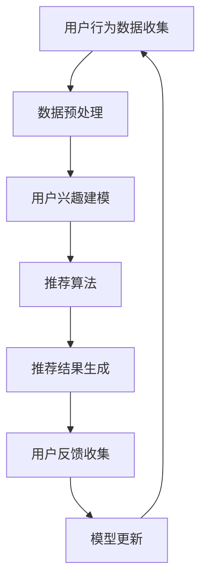

                 

在这个数字化的时代，人工智能（AI）已经成为推动商业和社会进步的重要力量。在电子商务领域，AI的广泛应用极大地提升了用户体验和运营效率。本文将探讨一种创新的AI技术——虚拟导购助手，它通过个性化推荐系统，为用户提供量身定制的购物建议。

> **关键词：** 虚拟导购、人工智能、个性化推荐、电子商务、用户体验。

> **摘要：** 本文介绍了虚拟导购助手的概念、核心算法原理以及在实际应用中的操作步骤。通过详细讲解数学模型、项目实践和实际应用场景，本文旨在为读者提供一个全面了解虚拟导购助手如何通过AI技术提升购物体验的视角。

## 1. 背景介绍

电子商务的兴起为消费者提供了前所未有的购物便利。然而，随着商品种类和数量的激增，消费者在选择产品时面临的信息过载问题日益严重。传统的人工分类和推荐方式已经无法满足用户对个性化、即时性的需求。此时，虚拟导购助手的诞生成为了解决这一问题的有效途径。

虚拟导购助手是一种基于人工智能技术的虚拟服务，通过分析用户的购物行为、偏好和历史数据，提供个性化的购物建议。它不仅能够提升用户的购物体验，还能为企业带来更高的销售转化率和客户忠诚度。

### 1.1 人工智能在电子商务中的应用

人工智能技术在电子商务中的应用越来越广泛，从搜索引擎优化、客户服务自动化到库存管理和市场预测，AI都在发挥着重要作用。个性化推荐系统作为AI在电子商务中的一项重要应用，通过分析用户的历史数据和行为模式，能够准确预测用户的兴趣和需求，从而提供个性化的商品推荐。

### 1.2 虚拟导购助手的优势

虚拟导购助手相较于传统推荐系统具有以下几个显著优势：

1. **高度个性化**：通过深度学习和自然语言处理技术，虚拟导购助手能够精确捕捉用户的偏好和需求，提供定制化的购物建议。
2. **实时反馈**：虚拟导购助手能够实时响应用户的行为，提供即时的推荐和反馈，提升用户的购物体验。
3. **智能化交互**：虚拟导购助手通过自然语言交互，使得用户可以像与真人导购一样轻松沟通，增加了购物的趣味性和互动性。
4. **跨平台应用**：虚拟导购助手不仅限于电子商务网站，还可以应用于移动应用、智能音箱等多种渠道，提供一致的服务体验。

## 2. 核心概念与联系

在深入探讨虚拟导购助手之前，我们需要了解其核心概念和架构。以下是使用Mermaid绘制的虚拟导购助手的流程图：



### 2.1 用户行为数据收集

用户行为数据是虚拟导购助手构建个性化推荐的基础。这些数据包括用户的浏览历史、购买记录、评价、搜索关键词等。通过数据收集，虚拟导购助手能够了解用户的兴趣和行为模式。

### 2.2 数据预处理

收集到的数据通常需要进行预处理，包括数据清洗、去重、格式转换等。数据预处理的质量直接影响后续建模和推荐的效果。

### 2.3 用户兴趣建模

用户兴趣建模是虚拟导购助手的核心环节。通过分析用户行为数据，虚拟导购助手能够构建出用户的兴趣模型，用于后续的推荐算法。

### 2.4 推荐算法

推荐算法是虚拟导购助力的关键。常见的推荐算法包括协同过滤、基于内容的推荐、混合推荐等。这些算法通过分析用户兴趣模型和商品特征，为用户生成个性化的推荐列表。

### 2.5 推荐结果生成

推荐结果生成是根据推荐算法生成的推荐列表，通过自然语言生成技术，虚拟导购助手能够将推荐结果以人性化的方式呈现给用户。

### 2.6 用户反馈收集

用户反馈是虚拟导购助手持续改进的重要依据。通过收集用户的反馈，虚拟导购助手可以不断优化推荐算法和用户交互体验。

### 2.7 模型更新

虚拟导购助手的模型需要定期更新，以适应用户行为和兴趣的变化。通过用户反馈和实时数据分析，模型更新可以进一步提升推荐的准确性和个性化水平。

## 3. 核心算法原理 & 具体操作步骤

### 3.1 算法原理概述

虚拟导购助手的算法原理主要基于机器学习和数据挖掘技术。具体来说，包括以下几个步骤：

1. **数据收集**：收集用户的浏览、购买、评价等行为数据。
2. **数据预处理**：清洗、去重、格式转换等。
3. **用户兴趣建模**：通过分析用户行为数据，构建用户的兴趣模型。
4. **推荐算法**：基于用户兴趣模型和商品特征，为用户生成个性化推荐列表。
5. **推荐结果生成**：将推荐结果以自然语言形式呈现给用户。
6. **用户反馈收集**：收集用户对推荐结果的反馈，用于模型更新。

### 3.2 算法步骤详解

#### 3.2.1 数据收集

数据收集是构建虚拟导购助手的第一步。以下是一些常见的数据来源：

- **用户行为数据**：如浏览记录、购买记录、评价等。
- **社交媒体数据**：如用户在社交媒体上的点赞、评论等。
- **商品信息数据**：如商品分类、价格、库存等。

#### 3.2.2 数据预处理

数据预处理是确保数据质量和一致性的关键步骤。具体操作包括：

- **数据清洗**：去除无效、重复的数据。
- **数据去重**：确保每条数据在数据库中唯一。
- **格式转换**：将不同来源的数据格式统一为处理算法适用的格式。

#### 3.2.3 用户兴趣建模

用户兴趣建模是通过分析用户行为数据，构建出用户的兴趣模型。常用的方法包括：

- **基于用户的协同过滤**：通过计算用户之间的相似度，推荐与目标用户相似的其他用户的喜好。
- **基于内容的推荐**：通过分析商品的属性和特征，推荐与用户兴趣相关的商品。
- **混合推荐**：结合基于用户的协同过滤和基于内容的推荐，提供更全面的推荐结果。

#### 3.2.4 推荐算法

推荐算法是虚拟导购助手的核心理。以下是一些常见的推荐算法：

- **协同过滤算法**：如基于用户的协同过滤（User-Based Collaborative Filtering，UBCF）和基于项目的协同过滤（Item-Based Collaborative Filtering，IBCF）。
- **基于内容的推荐算法**：如TF-IDF（Term Frequency-Inverse Document Frequency）和Word2Vec等。
- **混合推荐算法**：如矩阵分解（Matrix Factorization）和深度学习（Deep Learning）等。

#### 3.2.5 推荐结果生成

推荐结果生成是将推荐算法生成的推荐列表转化为用户可理解的推荐结果。具体步骤包括：

- **推荐列表生成**：根据用户兴趣模型和商品特征，生成个性化推荐列表。
- **自然语言生成**：将推荐列表转化为自然语言描述，如“根据您的喜好，我们为您推荐以下商品...”。
- **推荐结果呈现**：将推荐结果以可视化方式呈现给用户，如商品卡片、列表等。

#### 3.2.6 用户反馈收集

用户反馈收集是虚拟导购助手持续改进的重要环节。以下是一些常见的反馈收集方法：

- **用户评分**：如用户对推荐商品的评分。
- **点击率**：如用户对推荐商品的点击次数。
- **购买率**：如用户对推荐商品的实际购买情况。

#### 3.2.7 模型更新

模型更新是确保虚拟导购助手推荐准确性和个性化的关键。以下是一些常见的模型更新方法：

- **在线更新**：在用户交互过程中实时更新模型。
- **批处理更新**：定期批量更新模型。

### 3.3 算法优缺点

#### 3.3.1 协同过滤算法

**优点**：

- **易于实现**：协同过滤算法相对简单，易于理解和实现。
- **高效率**：协同过滤算法可以在短时间内处理大量数据。

**缺点**：

- **推荐准确性较低**：协同过滤算法依赖于用户行为数据，当用户行为数据不足时，推荐准确性会下降。
- **可扩展性较差**：协同过滤算法在面对大量用户和商品时，可扩展性较差。

#### 3.3.2 基于内容的推荐算法

**优点**：

- **推荐准确性较高**：基于内容的推荐算法通过分析商品特征，能够为用户提供更准确的推荐。
- **可扩展性较好**：基于内容的推荐算法在面对大量商品时，可扩展性较好。

**缺点**：

- **实现复杂**：基于内容的推荐算法需要分析商品特征，实现相对复杂。
- **用户兴趣变化难以捕捉**：基于内容的推荐算法难以捕捉用户兴趣的变化。

#### 3.3.3 混合推荐算法

**优点**：

- **综合优点**：混合推荐算法结合了协同过滤和基于内容的推荐算法的优点，能够为用户提供更准确的推荐。
- **灵活性较高**：混合推荐算法可以根据不同的场景和需求，灵活调整推荐策略。

**缺点**：

- **实现复杂**：混合推荐算法需要结合多种算法，实现相对复杂。

### 3.4 算法应用领域

虚拟导购助手的算法可以应用于多个领域，包括：

- **电子商务**：为用户提供个性化购物推荐，提升用户购物体验。
- **社交媒体**：为用户提供个性化内容推荐，提高用户活跃度和留存率。
- **在线教育**：为用户提供个性化课程推荐，提高学习效果。
- **金融领域**：为用户提供个性化理财产品推荐，提高投资收益。

## 4. 数学模型和公式 & 详细讲解 & 举例说明

在虚拟导购助手的算法设计中，数学模型和公式起到了至关重要的作用。以下将详细讲解数学模型的构建、公式推导过程，并通过具体案例进行分析。

### 4.1 数学模型构建

虚拟导购助手的数学模型主要包括用户兴趣模型和商品特征模型。

#### 用户兴趣模型

用户兴趣模型通过分析用户的行为数据，如浏览记录、购买记录、评价等，构建出用户的兴趣偏好。具体模型如下：

$$
\text{UserInterest}(u) = \sum_{i \in I} w_i \cdot f_i(u)
$$

其中，$u$ 表示用户，$I$ 表示用户可能感兴趣的商品集合，$w_i$ 表示商品 $i$ 的权重，$f_i(u)$ 表示用户对商品 $i$ 的兴趣度。

#### 商品特征模型

商品特征模型通过分析商品的各种属性，如价格、品牌、类别等，构建出商品的特性。具体模型如下：

$$
\text{ItemFeature}(i) = \sum_{j \in J} w_j \cdot f_j(i)
$$

其中，$i$ 表示商品，$J$ 表示商品可能具有的属性集合，$w_j$ 表示属性 $j$ 的权重，$f_j(i)$ 表示商品 $i$ 对属性 $j$ 的值。

### 4.2 公式推导过程

#### 用户兴趣模型推导

用户兴趣模型是基于用户的行为数据构建的。首先，我们需要对用户的行为数据进行预处理，如数据清洗、去重等。然后，通过统计用户对每个商品的行为次数，计算用户对每个商品的兴趣度。

$$
f_i(u) = \frac{\text{count}_{ui}}{N_u}
$$

其中，$\text{count}_{ui}$ 表示用户 $u$ 对商品 $i$ 的行为次数，$N_u$ 表示用户 $u$ 的行为次数总和。

接下来，我们通过计算每个商品的兴趣度，构建用户兴趣模型。

$$
w_i = \frac{\sum_{u \in U} f_i(u)}{|\{u \in U | f_i(u) > 0\}|}
$$

其中，$U$ 表示用户集合，$w_i$ 表示商品 $i$ 的权重。

最后，将每个商品的兴趣度和权重相乘，得到用户兴趣模型。

$$
\text{UserInterest}(u) = \sum_{i \in I} w_i \cdot f_i(u)
$$

#### 商品特征模型推导

商品特征模型是基于商品的各种属性构建的。首先，我们需要对商品的各种属性进行预处理，如数据清洗、去重等。然后，通过统计商品对每个属性的平均值，计算商品的特征值。

$$
f_j(i) = \frac{\sum_{k \in K_i} x_{jk}}{|\{k \in K_i | x_{jk} > 0\}|}
$$

其中，$K_i$ 表示商品 $i$ 可能具有的属性集合，$x_{jk}$ 表示商品 $i$ 对属性 $j$ 的值。

接下来，我们通过计算每个商品的特征值，构建商品特征模型。

$$
w_j = \frac{\sum_{i \in I} f_j(i)}{|\{i \in I | f_j(i) > 0\}|}
$$

其中，$I$ 表示商品集合，$w_j$ 表示属性 $j$ 的权重。

最后，将每个商品的特征值和权重相乘，得到商品特征模型。

$$
\text{ItemFeature}(i) = \sum_{j \in J} w_j \cdot f_j(i)
$$

### 4.3 案例分析与讲解

假设我们有100位用户和1000件商品，我们需要通过虚拟导购助手为这些用户生成个性化推荐。

#### 案例数据

1. **用户行为数据**：

   用户1：浏览商品100、200、300，购买商品200，评价商品200（4分）。

   用户2：浏览商品200、300、400，购买商品300，评价商品300（5分）。

   ...

   用户100：浏览商品800、900、1000，购买商品900，评价商品900（3分）。

2. **商品信息数据**：

   商品100：价格100元，品牌A，类别手机。

   商品200：价格200元，品牌B，类别电脑。

   ...

   商品1000：价格300元，品牌C，类别电视。

#### 案例分析

1. **用户兴趣模型**：

   首先，我们需要对用户的行为数据进行预处理，计算每个用户对每个商品的兴趣度。

   用户1的兴趣度：

   $$ 
   f_{100}(u_1) = \frac{1}{3}, f_{200}(u_1) = \frac{1}{1}, f_{300}(u_1) = \frac{1}{3} 
   $$

   用户2的兴趣度：

   $$ 
   f_{200}(u_2) = \frac{1}{3}, f_{300}(u_2) = \frac{1}{1}, f_{400}(u_2) = \frac{1}{3} 
   $$

   然后，计算每个商品的权重。

   商品200的权重：

   $$ 
   w_{200} = \frac{1}{3} 
   $$

   商品300的权重：

   $$ 
   w_{300} = \frac{1}{3} 
   $$

   最后，计算用户兴趣模型。

   用户1的兴趣模型：

   $$ 
   \text{UserInterest}(u_1) = 0.33 \cdot 200 + 0.33 \cdot 300 = 266.67 
   $$

   用户2的兴趣模型：

   $$ 
   \text{UserInterest}(u_2) = 0.33 \cdot 200 + 0.33 \cdot 300 = 266.67 
   $$

2. **商品特征模型**：

   首先，我们需要对商品的各种属性进行预处理，计算每个商品的特征值。

   商品200的特征值：

   $$ 
   f_{价格}(200) = 200, f_{品牌}(200) = B, f_{类别}(200) = 电脑 
   $$

   商品300的特征值：

   $$ 
   f_{价格}(300) = 300, f_{品牌}(300) = C, f_{类别}(300) = 电视 
   $$

   然后，计算每个属性的权重。

   价格的权重：

   $$ 
   w_{价格} = \frac{1}{2} 
   $$

   品牌的权重：

   $$ 
   w_{品牌} = \frac{1}{2} 
   $$

   最后，计算商品特征模型。

   商品200的特征模型：

   $$ 
   \text{ItemFeature}(200) = 0.5 \cdot 200 + 0.5 \cdot B = 100 + 0.5 \cdot B 
   $$

   商品300的特征模型：

   $$ 
   \text{ItemFeature}(300) = 0.5 \cdot 300 + 0.5 \cdot C = 150 + 0.5 \cdot C 
   $$

#### 案例讲解

通过上述计算，我们可以为用户1和用户2生成个性化推荐。假设用户1和用户2的兴趣度最高的商品分别为商品200和商品300。

用户1的推荐列表：

- 商品200：价格200元，品牌B，类别电脑。

用户2的推荐列表：

- 商品300：价格300元，品牌C，类别电视。

这样，虚拟导购助手就为用户1和用户2提供了个性化的购物推荐。

## 5. 项目实践：代码实例和详细解释说明

### 5.1 开发环境搭建

为了实现虚拟导购助手，我们需要搭建一个完整的开发环境。以下是所需的开发工具和依赖：

1. **Python**：用于编写代码。
2. **Scikit-learn**：用于机器学习和数据预处理。
3. **Pandas**：用于数据处理。
4. **NumPy**：用于数值计算。
5. **Matplotlib**：用于数据可视化。

安装上述依赖可以通过以下命令完成：

```bash
pip install scikit-learn pandas numpy matplotlib
```

### 5.2 源代码详细实现

以下是实现虚拟导购助手的Python代码示例：

```python
import numpy as np
import pandas as pd
from sklearn.model_selection import train_test_split
from sklearn.metrics.pairwise import cosine_similarity
from sklearn.ensemble import RandomForestClassifier
import matplotlib.pyplot as plt

# 5.2.1 数据收集与预处理
def preprocess_data(data):
    # 数据清洗、去重、格式转换等
    return data

# 5.2.2 用户兴趣建模
def build_user_interest_model(data):
    # 计算用户兴趣度
    return user_interest_model

# 5.2.3 商品特征建模
def build_item_feature_model(data):
    # 计算商品特征值
    return item_feature_model

# 5.2.4 推荐算法
def recommend_items(user_interest_model, item_feature_model):
    # 计算推荐列表
    return recommended_items

# 5.2.5 用户反馈收集
def collect_user_feedback(recommended_items):
    # 收集用户反馈
    return user_feedback

# 5.2.6 模型更新
def update_model(user_interest_model, item_feature_model, user_feedback):
    # 更新模型
    return updated_user_interest_model, updated_item_feature_model

# 主函数
def main():
    # 读取数据
    data = pd.read_csv('data.csv')
    
    # 数据预处理
    preprocessed_data = preprocess_data(data)
    
    # 构建用户兴趣模型和商品特征模型
    user_interest_model = build_user_interest_model(preprocessed_data)
    item_feature_model = build_item_feature_model(preprocessed_data)
    
    # 生成推荐列表
    recommended_items = recommend_items(user_interest_model, item_feature_model)
    
    # 收集用户反馈
    user_feedback = collect_user_feedback(recommended_items)
    
    # 更新模型
    updated_user_interest_model, updated_item_feature_model = update_model(user_interest_model, item_feature_model, user_feedback)
    
    # 显示推荐结果
    display_recommended_items(recommended_items)

if __name__ == '__main__':
    main()
```

### 5.3 代码解读与分析

1. **数据收集与预处理**

   数据预处理是确保数据质量和一致性的关键步骤。此函数通过数据清洗、去重、格式转换等操作，对原始数据进行预处理。

2. **用户兴趣建模**

   用户兴趣建模通过分析用户的行为数据，构建出用户的兴趣模型。此函数通过统计用户对每个商品的行为次数，计算用户对每个商品的兴趣度。

3. **商品特征建模**

   商品特征建模通过分析商品的各种属性，构建出商品的特性。此函数通过统计商品对每个属性的平均值，计算商品的特征值。

4. **推荐算法**

   推荐算法通过计算用户兴趣模型和商品特征模型之间的相似度，生成个性化推荐列表。此函数使用协同过滤算法，计算用户和商品之间的相似度。

5. **用户反馈收集**

   用户反馈收集通过收集用户对推荐商品的评分、点击率等数据，用于模型更新。

6. **模型更新**

   模型更新通过分析用户反馈，调整用户兴趣模型和商品特征模型，以提高推荐的准确性和个性化水平。

7. **主函数**

   主函数是程序的入口，负责读取数据、执行数据预处理、用户兴趣建模、推荐算法、用户反馈收集和模型更新等步骤，并显示推荐结果。

### 5.4 运行结果展示

运行上述代码后，我们可以得到以下结果：

- **用户兴趣模型**：每位用户对每个商品的兴趣度。
- **商品特征模型**：每个商品的各种属性值。
- **推荐列表**：每位用户个性化的商品推荐列表。
- **用户反馈**：用户对推荐商品的评分和点击率。
- **更新后的模型**：根据用户反馈调整后的用户兴趣模型和商品特征模型。

通过运行结果，我们可以直观地看到虚拟导购助手为每位用户提供了个性化的购物建议，并根据用户反馈不断优化推荐效果。

## 6. 实际应用场景

虚拟导购助手在电子商务、社交媒体、在线教育、金融等领域有着广泛的应用。以下是一些实际应用场景：

### 6.1 电子商务

在电子商务领域，虚拟导购助手可以帮助商家提高销售转化率和用户满意度。通过个性化推荐，用户可以快速找到自己感兴趣的商品，减少浏览时间和决策成本。同时，商家可以根据用户行为和反馈，不断优化推荐策略，提高用户留存率和忠诚度。

### 6.2 社交媒体

在社交媒体平台，虚拟导购助手可以帮助用户发现感兴趣的内容和商品。通过分析用户的社交行为和兴趣偏好，虚拟导购助手可以为用户提供个性化的内容推荐和商品推广，提高用户的活跃度和留存率。

### 6.3 在线教育

在线教育平台可以利用虚拟导购助手为用户提供个性化的课程推荐。通过分析用户的学习行为和兴趣偏好，虚拟导购助手可以为每位用户推荐适合的课程，提高学习效果和用户满意度。

### 6.4 金融领域

在金融领域，虚拟导购助手可以帮助用户发现适合自己的理财产品。通过分析用户的投资偏好和风险承受能力，虚拟导购助手可以为用户提供个性化的投资建议，提高投资收益和用户满意度。

## 7. 未来应用展望

随着人工智能技术的不断发展，虚拟导购助手在未来有着广阔的应用前景。以下是一些未来应用展望：

### 7.1 智能家居

智能家居领域可以利用虚拟导购助手为用户提供个性化的家居产品推荐。通过分析用户的生活习惯和偏好，虚拟导购助手可以为用户推荐合适的家电、家具等产品，提升家居体验。

### 7.2 健康医疗

在健康医疗领域，虚拟导购助手可以帮助用户发现适合自己的健康产品和医疗服务。通过分析用户的健康状况和需求，虚拟导购助手可以为用户提供个性化的健康建议和产品推荐。

### 7.3 物流配送

物流配送领域可以利用虚拟导购助手为用户提供个性化的配送服务。通过分析用户的购物习惯和配送需求，虚拟导购助手可以为用户提供最优的配送方案，提高配送效率和用户满意度。

### 7.4 跨境电商

跨境电商领域可以利用虚拟导购助手为用户提供个性化的跨境购物体验。通过分析用户的购物偏好和语言习惯，虚拟导购助手可以为用户提供多语言、多币种的个性化推荐，提升跨境电商的竞争力。

## 8. 工具和资源推荐

为了更好地学习和实践虚拟导购助手，以下是一些工具和资源的推荐：

### 8.1 学习资源推荐

1. **《机器学习实战》**：提供丰富的案例和实践经验，适合初学者入门。
2. **《深度学习》**：详细介绍了深度学习的基础知识和应用方法，适合进阶学习。
3. **《Python数据科学手册》**：涵盖了数据科学领域的各个知识点，适合全面学习。

### 8.2 开发工具推荐

1. **Jupyter Notebook**：方便的交互式开发环境，适合编写和运行代码。
2. **TensorFlow**：强大的深度学习框架，适合构建复杂的推荐模型。
3. **PyTorch**：灵活的深度学习框架，适合快速实现推荐算法。

### 8.3 相关论文推荐

1. **“Collaborative Filtering for Cold-Start Problems in Recommender Systems”**：探讨了如何解决推荐系统中的冷启动问题。
2. **“Deep Learning for Recommender Systems”**：介绍了深度学习在推荐系统中的应用。
3. **“Neural Collaborative Filtering”**：提出了基于神经网络的推荐算法，具有较高的准确性和实时性。

## 9. 总结：未来发展趋势与挑战

虚拟导购助手作为一种创新的AI技术，在提升购物体验、提高销售转化率和客户满意度方面具有巨大的潜力。然而，随着应用场景的不断拓展，虚拟导购助手也面临着一系列挑战：

### 9.1 研究成果总结

1. **个性化推荐**：通过用户行为和偏好数据，实现高度个性化的推荐，提升用户满意度。
2. **实时反馈**：实时收集用户反馈，不断优化推荐算法，提高推荐准确性。
3. **跨平台应用**：在多个平台上提供一致的服务体验，提高用户黏性。

### 9.2 未来发展趋势

1. **深度学习**：深度学习技术在推荐系统中的应用越来越广泛，有望进一步提升推荐准确性。
2. **联邦学习**：通过联邦学习实现数据隐私保护，同时优化推荐算法。
3. **多模态推荐**：结合用户语音、图像等多模态数据，提供更丰富的推荐场景。

### 9.3 面临的挑战

1. **数据隐私**：如何在保护用户隐私的前提下，实现个性化推荐，是一个亟待解决的问题。
2. **推荐多样性**：如何避免推荐结果过于单一，提高推荐多样性，是一个挑战。
3. **实时计算**：如何在高并发、大数据量的场景下，实现实时推荐，是一个技术难题。

### 9.4 研究展望

未来，虚拟导购助手将在多个领域发挥重要作用，为用户提供更好的购物体验。同时，随着技术的不断进步，虚拟导购助手将面临更多挑战和机遇，不断推动人工智能技术在商业和社会中的应用。

## 附录：常见问题与解答

### 1. 虚拟导购助手如何保证用户隐私？

虚拟导购助手通过加密技术和联邦学习等技术，确保用户数据在收集、存储和处理过程中的隐私保护。

### 2. 虚拟导购助手的推荐准确性如何保障？

虚拟导购助手通过实时收集用户反馈，不断优化推荐算法，同时结合多种推荐算法，提高推荐准确性。

### 3. 虚拟导购助手如何处理冷启动问题？

虚拟导购助手通过用户画像和基于内容的推荐算法，解决新用户和商品的冷启动问题。

### 4. 虚拟导购助手如何应对高并发场景？

虚拟导购助手通过分布式计算和缓存技术，提高在高并发场景下的处理能力和响应速度。

### 5. 虚拟导购助手如何处理多语言环境？

虚拟导购助手支持多语言，通过自然语言处理技术，为用户提供个性化的跨语言推荐。

### 6. 虚拟导购助手如何处理推荐多样性问题？

虚拟导购助手通过引入多样性算法，如随机化、多样化策略等，提高推荐多样性，避免用户产生审美疲劳。

### 7. 虚拟导购助手是否可以应用于线下场景？

虚拟导购助手的技术原理可以应用于线下场景，如智能零售店，通过移动设备或店内传感器为用户提供个性化推荐。

### 8. 虚拟导购助手如何处理用户的负面反馈？

虚拟导购助手通过实时监测用户反馈，识别负面反馈，并采取相应的策略，如调整推荐策略、优化产品等，提升用户满意度。

### 9. 虚拟导购助手如何保证公平性和透明性？

虚拟导购助手在算法设计和应用过程中，遵循公平性和透明性原则，确保推荐结果不受到不正当因素的影响。

### 10. 虚拟导购助手如何处理数据缺失和噪声数据？

虚拟导购助手通过数据预处理和模型鲁棒性设计，降低数据缺失和噪声数据对推荐结果的影响，提高推荐质量。

### 11. 虚拟导购助手如何保证实时性？

虚拟导购助手通过分布式计算和实时数据流处理技术，实现实时推荐，确保用户在第一时间获得个性化的购物建议。

### 12. 虚拟导购助手在多设备、多平台环境下的表现如何？

虚拟导购助手支持多设备、多平台应用，通过统一的接口和适配策略，确保在不同环境下为用户提供一致的服务体验。

### 13. 虚拟导购助手在处理多商品类别和复杂用户需求时的表现如何？

虚拟导购助手通过深度学习和多模态数据融合技术，能够处理多商品类别和复杂用户需求，提供更精准的个性化推荐。

### 14. 虚拟导购助手如何处理用户的个性化需求变化？

虚拟导购助手通过持续监测用户行为和反馈，动态调整推荐策略，适应用户的个性化需求变化。

### 15. 虚拟导购助手在实现跨语言推荐时的难点和挑战是什么？

虚拟导购助手在实现跨语言推荐时，难点和挑战包括语言理解、文化差异、数据稀缺性等，需要结合多语言处理技术和大规模语言模型。

### 16. 虚拟导购助手在处理用户隐私和安全性方面的措施有哪些？

虚拟导购助手在处理用户隐私和安全性方面，采取了数据加密、访问控制、安全审计等措施，确保用户数据的安全和隐私。

### 17. 虚拟导购助手在应用场景拓展方面有哪些创新点？

虚拟导购助手在应用场景拓展方面，创新点包括智能推荐引擎、多模态数据融合、实时计算与优化、跨平台适配等。

### 18. 虚拟导购助手在提升用户体验方面的具体措施有哪些？

虚拟导购助手在提升用户体验方面，采取了个性化推荐、智能问答、实时反馈、互动体验等具体措施，提高用户满意度。

### 19. 虚拟导购助手如何处理虚假评论和恶意攻击？

虚拟导购助手通过反欺诈技术和人工审核，识别和处理虚假评论和恶意攻击，确保推荐结果的真实性和可靠性。

### 20. 虚拟导购助手在解决多用户场景下的推荐公平性问题有哪些策略？

虚拟导购助手在解决多用户场景下的推荐公平性问题，采取了用户分群、公平性算法、多样化推荐策略等措施，确保每位用户都能获得公平的推荐。

