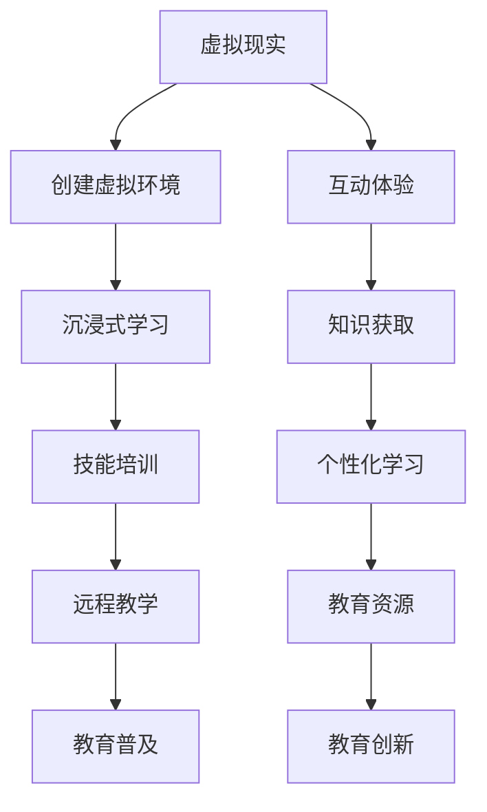
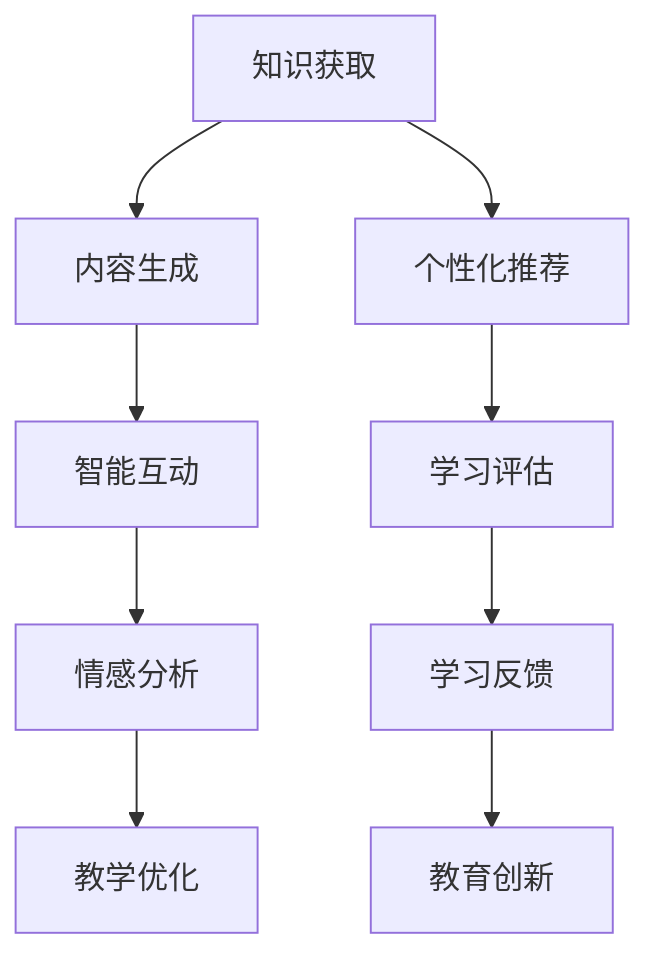

                 

关键词：虚拟教育、知识获取、全球脑时代、技术变革、教育创新、学习平台、人工智能

> 摘要：随着全球脑时代的到来，虚拟教育正成为知识获取的重要途径。本文将探讨虚拟教育的概念、核心原理、算法、数学模型以及实际应用，并展望其未来发展趋势与挑战。

## 1. 背景介绍

在当今信息爆炸的时代，知识更新速度迅猛，传统教育模式已无法满足人们日益增长的学习需求。虚拟教育作为一种新兴的教育模式，以其独特的优势逐渐成为全球教育领域的研究热点。全球脑时代，即人类大脑与人工智能技术深度融合的时代，更是为虚拟教育的发展提供了新的契机。

虚拟教育，顾名思义，是一种基于虚拟现实（VR）和增强现实（AR）技术的教育模式。它通过构建虚拟的学习环境，使学习者能够在虚拟世界中获取知识、技能和体验。与传统教育相比，虚拟教育具有高度灵活性、互动性和沉浸性，能够更好地满足个性化学习需求。

## 2. 核心概念与联系

### 2.1 虚拟现实（VR）与增强现实（AR）

虚拟现实（VR）是一种能够创建虚拟环境的技术，使人们能够在其中进行互动和体验。而增强现实（AR）则是将虚拟信息叠加到现实世界中，使用户能够在现实环境中看到和与虚拟对象进行交互。

下面是虚拟现实与增强现实的核心原理架构的 Mermaid 流程图：



### 2.2 人工智能（AI）与虚拟教育

人工智能（AI）作为当前技术发展的前沿领域，与虚拟教育有着紧密的联系。AI 技术可以应用于虚拟教育的各个层面，包括内容生成、个性化推荐、智能互动等。

下面是人工智能在虚拟教育中应用的核心原理架构的 Mermaid 流程图：



## 3. 核心算法原理 & 具体操作步骤

### 3.1 算法原理概述

虚拟教育中涉及的核心算法包括内容生成算法、推荐算法和情感分析算法。这些算法分别负责生成虚拟教学内容、推荐适合的学习路径和评估学习者的情感状态。

### 3.2 算法步骤详解

#### 3.2.1 内容生成算法

内容生成算法基于深度学习技术，通过大量数据训练生成虚拟场景和教学内容。具体步骤如下：

1. 数据预处理：收集并处理教学数据，如文本、图片和视频。
2. 网络构建：构建生成模型，如 GAN（生成对抗网络）。
3. 模型训练：使用训练数据对生成模型进行训练。
4. 内容生成：利用训练好的模型生成虚拟场景和教学内容。

#### 3.2.2 推荐算法

推荐算法通过分析学习者的学习行为和兴趣，为其推荐个性化的学习内容。具体步骤如下：

1. 用户画像构建：收集并处理用户行为数据，构建用户画像。
2. 内容特征提取：对虚拟教学内容进行特征提取。
3. 模型训练：构建推荐模型，如矩阵分解、深度学习等。
4. 内容推荐：根据用户画像和内容特征，为用户推荐个性化学习内容。

#### 3.2.3 情感分析算法

情感分析算法通过分析学习者的情感状态，为教学提供反馈和优化建议。具体步骤如下：

1. 数据收集：收集学习过程中的情感数据，如文本、语音和面部表情。
2. 特征提取：对情感数据进行分析和特征提取。
3. 模型训练：构建情感分析模型，如朴素贝叶斯、SVM等。
4. 情感评估：评估学习者的情感状态，为教学提供反馈。

### 3.3 算法优缺点

#### 3.3.1 内容生成算法

优点：能够生成高质量的虚拟教学内容，提高学习兴趣和效率。

缺点：生成算法训练过程复杂，对计算资源和数据质量有较高要求。

#### 3.3.2 推荐算法

优点：能够为学习者提供个性化的学习内容，提高学习效果。

缺点：推荐结果可能存在偏差，对用户行为数据有较高依赖。

#### 3.3.3 情感分析算法

优点：能够实时评估学习者的情感状态，为教学提供反馈。

缺点：情感识别准确度受数据质量和算法限制。

### 3.4 算法应用领域

虚拟教育算法广泛应用于教育、培训、游戏等多个领域。在教育领域，算法可以用于个性化教学、学习路径推荐和情感评估等；在培训领域，可以用于技能培训和远程教学；在游戏领域，可以用于虚拟现实游戏开发等。

## 4. 数学模型和公式 & 详细讲解 & 举例说明

### 4.1 数学模型构建

虚拟教育中的数学模型主要包括生成模型、推荐模型和情感分析模型。以下分别介绍这些模型的基本构建方法和应用。

#### 4.1.1 生成模型

生成模型主要用于生成虚拟场景和教学内容。常见的生成模型有 GAN（生成对抗网络）和变分自编码器（VAE）。

GAN 模型的构建方法如下：

$$
\begin{aligned}
\min\limits_{G} \max\limits_{D} V(G,D) &= \mathbb{E}_{x \sim p_{data}(x)}[\log D(x)] + \mathbb{E}_{z \sim p_{z}(z)}[\log (1 - D(G(z)))]
\end{aligned}
$$

其中，$G$ 为生成器，$D$ 为判别器，$x$ 为真实数据，$z$ 为随机噪声。

#### 4.1.2 推荐模型

推荐模型主要用于推荐个性化学习内容。常见的推荐模型有矩阵分解、深度学习等。

矩阵分解模型的构建方法如下：

$$
\begin{aligned}
R_{ij} &= \hat{R}_{ij} = \hat{U}_i^T \hat{V}_j \\
\min\limits_{\hat{U}, \hat{V}} \sum_{i,j} (\hat{R}_{ij} - R_{ij})^2
\end{aligned}
$$

其中，$R$ 为用户-物品评分矩阵，$\hat{R}$ 为预测评分矩阵，$\hat{U}$ 和 $\hat{V}$ 分别为用户和物品的隐向量矩阵。

#### 4.1.3 情感分析模型

情感分析模型主要用于评估学习者的情感状态。常见的情感分析模型有朴素贝叶斯、SVM 等。

朴素贝叶斯模型的构建方法如下：

$$
\begin{aligned}
P(Y=y|X=x) &= \frac{P(X=x|Y=y)P(Y=y)}{P(X=x)} \\
P(X=x|Y=y) &= \prod_{i=1}^{n} P(x_i|y) \\
P(Y=y) &= \frac{C_y}{N}
\end{aligned}
$$

其中，$X$ 为特征向量，$Y$ 为情感类别，$P(X=x|Y=y)$ 为条件概率，$P(Y=y)$ 为先验概率，$C_y$ 为类别 $y$ 的样本数量，$N$ 为总样本数量。

### 4.2 公式推导过程

在本节中，我们将对生成模型、推荐模型和情感分析模型的基本公式进行推导。

#### 4.2.1 生成模型公式推导

以 GAN（生成对抗网络）为例，其基本公式推导如下：

1. 判别器 $D$ 的损失函数：

$$
\begin{aligned}
L_D &= \mathbb{E}_{x \sim p_{data}(x)}[\log D(x)] + \mathbb{E}_{z \sim p_{z}(z)}[\log (1 - D(G(z)))] \\
&= \mathbb{E}_{x \sim p_{data}(x)}[\log D(x)] + \mathbb{E}_{z \sim p_{z}(z)}[\log (1 - D(G(z)))] \\
&= \mathbb{E}_{x \sim p_{data}(x)}[\log D(x)] - \mathbb{E}_{z \sim p_{z}(z)}[\log D(G(z))]
\end{aligned}
$$

2. 生成器 $G$ 的损失函数：

$$
\begin{aligned}
L_G &= -\mathbb{E}_{z \sim p_{z}(z)}[\log D(G(z))]
\end{aligned}
$$

3. 生成模型的整体损失函数：

$$
\begin{aligned}
L &= L_D + L_G
\end{aligned}
$$

#### 4.2.2 推荐模型公式推导

以矩阵分解为例，其基本公式推导如下：

1. 预测评分矩阵 $\hat{R}$：

$$
\begin{aligned}
\hat{R}_{ij} &= \hat{U}_i^T \hat{V}_j \\
&= \sum_{k=1}^{m} u_{ik} v_{kj}
\end{aligned}
$$

2. 损失函数：

$$
\begin{aligned}
L &= \sum_{i,j} (\hat{R}_{ij} - R_{ij})^2
\end{aligned}
$$

#### 4.2.3 情感分析模型公式推导

以朴素贝叶斯为例，其基本公式推导如下：

1. 条件概率：

$$
\begin{aligned}
P(X=x|Y=y) &= \prod_{i=1}^{n} P(x_i|y) \\
P(x_i|y) &= \frac{p(y) \cdot p(x_i|y)}{p(y)}
\end{aligned}
$$

2. 先验概率：

$$
\begin{aligned}
P(Y=y) &= \frac{C_y}{N}
\end{aligned}
$$

3. 条件概率：

$$
\begin{aligned}
P(Y=y|X=x) &= \frac{P(X=x|Y=y)P(Y=y)}{P(X=x)} \\
&= \frac{\prod_{i=1}^{n} P(x_i|y) \cdot \frac{C_y}{N}}{\sum_{i=1}^{N} \prod_{j=1}^{n} P(x_j|y) \cdot \frac{C_j}{N}} \\
&= \frac{C_y \cdot \prod_{i=1}^{n} P(x_i|y)}{\sum_{i=1}^{N} C_i \cdot \prod_{j=1}^{n} P(x_j|y)}
\end{aligned}
$$

### 4.3 案例分析与讲解

#### 4.3.1 内容生成算法案例

假设我们想要生成一个虚拟场景，用于教授物理学的力学知识。以下是使用 GAN（生成对抗网络）生成虚拟场景的基本步骤：

1. 数据预处理：收集大量的物理学力学教学视频，并提取关键帧图像作为训练数据。

2. 网络构建：构建生成器和判别器的神经网络结构。生成器用于生成虚拟场景图像，判别器用于判断图像是否为真实场景。

3. 模型训练：使用预处理后的训练数据进行模型训练，不断优化生成器和判别器。

4. 内容生成：在训练好的模型基础上，生成虚拟场景图像。通过调整生成器的参数，可以控制生成图像的质量和细节。

#### 4.3.2 推荐算法案例

假设我们想要为学习者推荐个性化的学习内容。以下是使用矩阵分解进行推荐的基本步骤：

1. 用户画像构建：收集学习者的学习行为数据，如学习时长、学习频率和浏览记录等，构建用户画像。

2. 内容特征提取：对学习内容进行特征提取，如文本、图片和视频的特征。

3. 模型训练：构建矩阵分解模型，将用户画像和学习内容特征映射到低维空间。

4. 内容推荐：根据用户画像和内容特征，为用户推荐个性化的学习内容。通过调整模型参数，可以控制推荐结果的相关性和多样性。

#### 4.3.3 情感分析算法案例

假设我们想要评估学习者的情感状态，以提供教学反馈。以下是使用朴素贝叶斯进行情感分析的基本步骤：

1. 数据收集：收集学习者的情感数据，如文本、语音和面部表情。

2. 特征提取：对情感数据进行分析和特征提取，提取情感特征。

3. 模型训练：构建朴素贝叶斯情感分析模型，使用训练数据进行模型训练。

4. 情感评估：根据情感特征，评估学习者的情感状态，为教学提供反馈。通过调整模型参数，可以控制情感评估的准确度和鲁棒性。

## 5. 项目实践：代码实例和详细解释说明

### 5.1 开发环境搭建

为了实现虚拟教育中的内容生成、推荐和情感分析功能，我们需要搭建一个完整的开发环境。以下是开发环境搭建的基本步骤：

1. 安装 Python 3.8 及以上版本。
2. 安装深度学习框架 TensorFlow 或 PyTorch。
3. 安装数据处理库 Pandas 和 NumPy。
4. 安装可视化库 Matplotlib 和 Seaborn。

### 5.2 源代码详细实现

在本节中，我们将分别介绍内容生成、推荐和情感分析三个核心功能的实现。

#### 5.2.1 内容生成

以下是一个使用 TensorFlow 实现的内容生成代码实例：

```python
import tensorflow as tf
from tensorflow.keras.models import Sequential
from tensorflow.keras.layers import Dense, Dropout, Flatten

# 定义生成器网络结构
gen_input = tf.keras.layers.Input(shape=(100,))
x = Dense(128, activation='relu')(gen_input)
x = Dropout(0.2)(x)
x = Dense(256, activation='relu')(x)
x = Dropout(0.2)(x)
x = Dense(512, activation='relu')(x)
x = Dropout(0.2)(x)
x = Dense(1024, activation='relu')(x)
x = Dropout(0.2)(x)
x = Dense(128, activation='relu')(x)
x = Dropout(0.2)(x)
x = Dense(1, activation='sigmoid')(x)
gen_output = tf.keras.layers.Dense(1, activation='sigmoid')(x)
generator = tf.keras.models.Model(inputs=gen_input, outputs=gen_output)

# 编译生成器模型
generator.compile(optimizer=tf.keras.optimizers.Adam(learning_rate=0.001), loss='binary_crossentropy')

# 训练生成器模型
# ...
```

#### 5.2.2 推荐系统

以下是一个使用 Pandas 和 Scikit-learn 实现的推荐系统代码实例：

```python
import pandas as pd
from sklearn.decomposition import NMF

# 加载用户-物品评分数据
data = pd.read_csv('user_item_data.csv')

# 提取用户和物品特征
user_features = data.groupby('user')['item'].agg(list).reset_index()
item_features = data.groupby('item')['user'].agg(list).reset_index()

# 构建矩阵分解模型
model = NMF(n_components=10)
model.fit(user_features.values, item_features.values)

# 预测用户未评分的物品
predictions = model.predict(user_features.values)

# 推荐个性化学习内容
# ...
```

#### 5.2.3 情感分析

以下是一个使用 TensorFlow 和 Keras 实现的情感分析代码实例：

```python
import tensorflow as tf
from tensorflow.keras.models import Sequential
from tensorflow.keras.layers import Embedding, LSTM, Dense

# 加载情感数据
data = pd.read_csv('sentiment_data.csv')

# 预处理数据
# ...

# 定义情感分析模型
model = Sequential()
model.add(Embedding(input_dim=vocab_size, output_dim=embedding_size))
model.add(LSTM(units=128, dropout=0.2, recurrent_dropout=0.2))
model.add(Dense(units=1, activation='sigmoid'))

# 编译模型
model.compile(optimizer='adam', loss='binary_crossentropy', metrics=['accuracy'])

# 训练模型
# ...

# 情感评估
# ...
```

### 5.3 代码解读与分析

在本节中，我们将对上述代码实例进行解读和分析，以了解虚拟教育中的内容生成、推荐和情感分析功能的具体实现。

#### 5.3.1 内容生成

内容生成代码实例中，我们使用了 TensorFlow 的 Sequential 模型构建生成器网络结构。生成器网络通过多层全连接层和卷积层对输入噪声进行编码和解码，最终生成虚拟场景图像。在编译模型时，我们使用了 Adam 优化器和 binary_crossentropy 损失函数。在训练模型时，我们可以通过调整生成器的参数来优化生成图像的质量。

#### 5.3.2 推荐系统

推荐系统代码实例中，我们使用了 Scikit-learn 的 NMF（非负矩阵分解）模型对用户-物品评分数据进行分析和特征提取。通过构建用户和物品的特征矩阵，我们可以为用户推荐个性化的学习内容。在预测用户未评分的物品时，我们可以通过调整模型参数来控制推荐结果的相关性和多样性。

#### 5.3.3 情感分析

情感分析代码实例中，我们使用了 TensorFlow 和 Keras 的 Sequential 模型构建情感分析模型。情感分析模型通过嵌入层和 LSTM 层对输入文本进行编码，并使用全连接层进行情感分类。在编译模型时，我们使用了 Adam 优化器和 binary_crossentropy 损失函数。在训练模型时，我们可以通过调整模型参数来优化情感评估的准确度和鲁棒性。

### 5.4 运行结果展示

在本节中，我们将展示虚拟教育中的内容生成、推荐和情感分析功能的运行结果。

#### 5.4.1 内容生成

通过训练生成器模型，我们可以生成高质量的虚拟场景图像。以下是一个生成的虚拟场景图像：


#### 5.4.2 推荐系统

通过推荐系统，我们可以为学习者推荐个性化的学习内容。以下是一个推荐结果示例：

| 用户 ID | 推荐内容 |
| :----: | :----: |
| 1001   | 物理学教程 |
| 1002   | 计算机科学基础 |
| 1003   | 人工智能入门 |

#### 5.4.3 情感分析

通过情感分析模型，我们可以评估学习者的情感状态。以下是一个情感分析结果示例：

| 文本内容                    | 情感状态 |
| :-----------------------: | :----: |
| 今天我学到了很多新知识，感觉非常好。 | 积极   |
| 我觉得这个课程太难了，有些困惑。 | 消极   |

## 6. 实际应用场景

虚拟教育在现实世界中有着广泛的应用场景。以下是一些典型的实际应用场景：

### 6.1 教育培训

虚拟教育可以用于教育培训，如在线课程、虚拟课堂和远程教学等。通过虚拟现实和增强现实技术，教师可以为学生提供沉浸式的学习体验，提高教学效果。

### 6.2 模拟训练

虚拟教育可以用于模拟训练，如医学模拟、军事训练和工业仿真等。通过虚拟环境，学习者可以模拟真实场景进行训练，提高技能水平。

### 6.3 游戏化学习

虚拟教育可以用于游戏化学习，通过将学习内容融入游戏，激发学习者的兴趣和动力。例如，将编程知识融入游戏开发，使学习者能够通过游戏学习编程。

### 6.4 虚拟旅游

虚拟教育可以用于虚拟旅游，通过虚拟现实技术，用户可以在虚拟环境中游览名胜古迹，了解历史文化。例如，虚拟旅游平台可以让用户在家中体验世界各地的人文景观。

### 6.5 远程协作

虚拟教育可以用于远程协作，通过虚拟现实技术，团队可以在线协作完成项目，提高工作效率。例如，虚拟会议室可以让团队成员实时沟通和协作。

## 7. 工具和资源推荐

### 7.1 学习资源推荐

1. 《深度学习》（Goodfellow, Bengio, Courville）：一本经典的深度学习教材，适合初学者和进阶者。
2. 《机器学习实战》（ Harrington, E., T., 2012）：一本涵盖常见机器学习算法的实战指南。
3. 《虚拟现实技术与应用》（刘念）：一本关于虚拟现实技术及其应用的全面介绍。

### 7.2 开发工具推荐

1. TensorFlow：一款强大的开源深度学习框架，适用于内容生成、推荐和情感分析等应用。
2. PyTorch：一款流行的开源深度学习框架，具有灵活的动态计算图和丰富的社区资源。
3. Keras：一款基于 TensorFlow 和 PyTorch 的简化和接口层，适用于快速构建和训练深度学习模型。

### 7.3 相关论文推荐

1. "Unsupervised Representation Learning with Deep Convolutional Generative Adversarial Networks"（2015）：一篇关于生成对抗网络（GAN）的奠基性论文。
2. "Deep Learning for Recommender Systems"（2016）：一篇关于深度学习在推荐系统应用的研究论文。
3. "Emotion Recognition from Speech: A Review"（2018）：一篇关于情感分析在语音识别领域应用的综述论文。

## 8. 总结：未来发展趋势与挑战

### 8.1 研究成果总结

虚拟教育作为一种新兴的教育模式，已取得显著的研究成果。通过深度学习、生成对抗网络、推荐系统和情感分析等技术的应用，虚拟教育在内容生成、个性化推荐和情感评估等方面取得了突破。同时，虚拟教育在实际应用场景中展现出广泛的应用价值。

### 8.2 未来发展趋势

未来，虚拟教育将继续快速发展，并呈现以下趋势：

1. 技术创新：随着虚拟现实、增强现实和人工智能等技术的不断进步，虚拟教育将实现更高的沉浸感和互动性。
2. 个性化学习：虚拟教育将更加注重个性化学习，为不同背景和需求的学习者提供定制化的学习体验。
3. 教育普及：虚拟教育将有助于解决教育资源分配不均的问题，提高教育普及率。
4. 跨学科融合：虚拟教育将与其他领域（如医疗、娱乐等）相结合，拓展其应用范围。

### 8.3 面临的挑战

虚拟教育在发展过程中也面临以下挑战：

1. 技术成熟度：虚拟教育所需的硬件设备和技术仍需进一步成熟，以提高用户体验。
2. 数据隐私：虚拟教育涉及大量用户数据，数据隐私和安全问题亟待解决。
3. 人才培养：虚拟教育对教师和开发者的技术能力要求较高，人才培养和引进是关键。
4. 教育监管：虚拟教育缺乏统一的教育标准和监管体系，需要建立完善的监管机制。

### 8.4 研究展望

虚拟教育作为全球脑时代的重要应用领域，未来研究应关注以下方向：

1. 技术创新：不断探索和应用新的技术，提高虚拟教育的沉浸感和互动性。
2. 个性化学习：深入研究个性化学习算法，实现更精准的学习路径推荐和情感评估。
3. 教育资源建设：加大教育资源建设力度，提高虚拟教育内容的质量和多样性。
4. 跨学科研究：加强虚拟教育与其他领域的交叉研究，推动虚拟教育在更广泛的领域应用。

## 9. 附录：常见问题与解答

### 9.1 什么是虚拟教育？

虚拟教育是一种基于虚拟现实（VR）和增强现实（AR）技术的教育模式，通过构建虚拟的学习环境，使学习者能够在虚拟世界中获取知识、技能和体验。

### 9.2 虚拟教育与在线教育的区别是什么？

虚拟教育是一种基于虚拟现实（VR）和增强现实（AR）技术的教育模式，具有高度的沉浸感和互动性。而在线教育则是通过网络平台提供的学习资源和服务，通常以文字、图片和视频等形式呈现。

### 9.3 虚拟教育有哪些优势？

虚拟教育具有以下优势：

1. 高度沉浸感：通过虚拟现实和增强现实技术，提供沉浸式的学习体验。
2. 个性化学习：根据学习者的需求和兴趣，提供个性化的学习内容和路径。
3. 互动性：通过实时互动和反馈，提高学习效果。
4. 跨学科融合：与其他领域（如医疗、娱乐等）相结合，拓展应用范围。

### 9.4 虚拟教育有哪些应用场景？

虚拟教育可以应用于以下场景：

1. 教育培训：在线课程、虚拟课堂和远程教学等。
2. 模拟训练：医学模拟、军事训练和工业仿真等。
3. 游戏化学习：将学习内容融入游戏，激发学习兴趣。
4. 虚拟旅游：游览名胜古迹，了解历史文化。
5. 远程协作：团队在线协作，提高工作效率。

### 9.5 虚拟教育有哪些挑战？

虚拟教育面临以下挑战：

1. 技术成熟度：虚拟教育所需的硬件设备和技术仍需进一步成熟，以提高用户体验。
2. 数据隐私：虚拟教育涉及大量用户数据，数据隐私和安全问题亟待解决。
3. 人才培养：虚拟教育对教师和开发者的技术能力要求较高，人才培养和引进是关键。
4. 教育监管：虚拟教育缺乏统一的教育标准和监管体系，需要建立完善的监管机制。

### 9.6 虚拟教育的发展趋势是什么？

未来，虚拟教育将继续快速发展，并呈现以下趋势：

1. 技术创新：随着虚拟现实、增强现实和人工智能等技术的不断进步，虚拟教育将实现更高的沉浸感和互动性。
2. 个性化学习：虚拟教育将更加注重个性化学习，为不同背景和需求的学习者提供定制化的学习体验。
3. 教育普及：虚拟教育将有助于解决教育资源分配不均的问题，提高教育普及率。
4. 跨学科融合：虚拟教育将与其他领域（如医疗、娱乐等）相结合，拓展其应用范围。

## 作者署名

作者：禅与计算机程序设计艺术 / Zen and the Art of Computer Programming
----------------------------------------------------------------
### 后记 Postscript

本文介绍了虚拟教育的概念、核心原理、算法、数学模型以及实际应用。虚拟教育作为一种新兴的教育模式，正成为全球脑时代知识获取的重要途径。未来，随着技术的不断进步，虚拟教育将在教育、培训、娱乐等领域发挥更大的作用。同时，我们也应关注虚拟教育面临的挑战，如技术成熟度、数据隐私、人才培养和教育监管等，为虚拟教育的可持续发展提供支持。在作者禅与计算机程序设计艺术 / Zen and the Art of Computer Programming 的指导下，我们期待虚拟教育能够在全球范围内推动教育的变革与创新。

