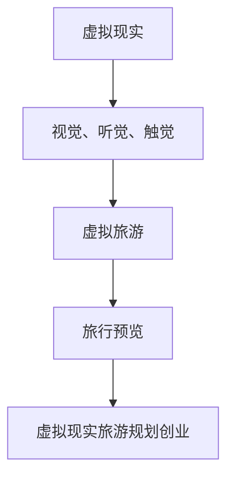

                 

## 1. 背景介绍

在当今快节奏的社会中，人们对旅游的需求与日俱增。然而，由于时间、预算和旅行条件的限制，很多人无法实现他们的旅行梦想。虚拟现实（VR）技术的快速发展为解决这个问题提供了新的可能性。虚拟现实旅游规划创业正是抓住了这一机遇，通过创造身临其境的旅行预览体验，满足人们对探索未知世界的好奇心和渴望。

虚拟现实技术的核心在于它能够模拟出一个与现实世界相似的、三维的虚拟环境。当用户戴上VR头盔或使用VR设备时，他们可以沉浸在这个环境中，感受到几乎与现实无异的视觉、听觉和触觉体验。这种沉浸感使得虚拟现实成为旅游行业的理想工具，用户可以在不出门的情况下，预览并体验各种旅游景点。

旅游行业一直以来都面临着如何吸引游客、提升游客体验和增加客户粘性的挑战。虚拟现实技术的应用，不仅能够提供一种全新的营销手段，还能够为游客提供更加个性化和定制化的旅行体验。通过虚拟现实旅游规划创业，创业者可以打造出独特的旅游产品，从而在竞争激烈的市场中脱颖而出。

本文将探讨虚拟现实旅游规划创业的各个方面，包括其核心概念、技术实现、算法原理、数学模型、项目实践以及未来应用前景。希望通过本文，能够为读者提供一个全面的了解，并激发他们对这一新兴领域的兴趣和探索。

## 2. 核心概念与联系

要深入探讨虚拟现实旅游规划创业，首先需要理解其中的核心概念和它们之间的联系。以下是几个关键概念：

### 虚拟现实（VR）

虚拟现实是一种通过计算机技术生成的三维虚拟环境，用户可以通过VR头盔、VR眼镜等设备进入并与之互动。VR技术主要依赖于三个核心元素：视觉、听觉和触觉。通过高分辨率屏幕和先进的传感器，VR系统能够提供逼真的视觉体验；通过耳机和声音系统，VR系统能够模拟出环境的音效和声音；而通过触觉反馈设备，VR系统能够让用户感受到触摸和振动。

### 虚拟旅游

虚拟旅游是虚拟现实技术的一种应用，它模拟出真实世界的旅游景点，用户可以在虚拟环境中浏览、探索和体验。虚拟旅游的核心在于提供一种沉浸式的体验，让用户感觉仿佛亲身置身于那个环境中。

### 旅行预览

旅行预览是虚拟旅游的一个重要功能，它允许用户在决定实际旅行前，先在虚拟环境中查看和体验拟定的目的地。通过旅行预览，用户可以了解景点的外观、氛围、设施等，从而做出更加明智的旅行决策。

### 虚拟现实旅游规划创业

虚拟现实旅游规划创业是指利用虚拟现实技术，为游客提供个性化、沉浸式的旅游体验，并通过这一服务来实现商业价值。创业者可以通过开发虚拟旅游应用、构建虚拟景点、提供旅行预览服务等方式，进入这一新兴市场。

下面是一个使用Mermaid绘制的流程图，展示了这些核心概念之间的联系：



### 虚拟现实技术的应用

虚拟现实技术在旅游行业的应用范围广泛，涵盖了从旅游宣传到游客体验的各个方面：

- **旅游宣传**：虚拟现实技术可以用来制作虚拟旅游景点展示，吸引游客前来。通过展示真实景点的虚拟版本，旅行社和旅游机构可以更直观地推销他们的产品。
- **游客体验**：虚拟现实技术可以为游客提供沉浸式的旅游体验，使他们能够“虚拟旅行”。这种体验不仅提高了游客的满意度，还可以作为一种营销工具，增加游客对目的地的兴趣。
- **旅游规划**：用户可以通过虚拟现实旅游应用来预览和规划他们的旅行行程。他们可以在虚拟环境中探索景点，选择餐饮和住宿，甚至提前体验旅行活动。

总之，虚拟现实旅游规划创业通过结合虚拟现实技术和旅游服务，为用户提供了一种全新的旅行体验方式，同时也为创业者带来了巨大的商业潜力。

## 3. 核心算法原理 & 具体操作步骤

### 3.1 算法原理概述

在虚拟现实旅游规划中，核心算法的原理主要围绕如何创建逼真的虚拟环境以及如何实现用户的沉浸式体验。算法的设计需要考虑以下几个方面：

- **环境建模**：通过使用3D建模技术和传感器数据，构建虚拟环境的几何模型，使其尽可能地接近现实。
- **纹理映射**：为虚拟环境添加逼真的纹理和材质，增强视觉效果的真实感。
- **光照模拟**：模拟真实世界中的光照条件，包括阳光、阴影和反射，以创建更加逼真的视觉效果。
- **交互引擎**：设计用户与虚拟环境之间的交互机制，使用户能够通过动作、手势等方式与虚拟环境进行互动。
- **视觉渲染**：采用高效的光线追踪和渲染技术，实现高质量的视觉输出。

### 3.2 算法步骤详解

虚拟现实旅游规划算法的具体步骤可以分为以下几个阶段：

#### 1. 数据采集

- **场景采集**：使用3D扫描仪、无人机等设备，采集真实场景的几何数据。
- **纹理采集**：使用相机或其他传感器，采集真实场景的纹理数据。
- **光照数据**：记录场景中的光照条件，包括光源位置、强度和方向。

#### 2. 数据处理

- **几何数据处理**：对采集到的几何数据进行预处理，如去噪、简化等，以减少计算量。
- **纹理处理**：对采集到的纹理数据进行调整和优化，以提高视觉真实感。
- **光照处理**：根据场景采集到的光照数据，构建光照模型。

#### 3. 环境建模

- **几何建模**：使用3D建模软件，根据预处理后的几何数据，构建虚拟环境的几何模型。
- **纹理映射**：将处理后的纹理数据映射到几何模型上，以创建逼真的表面效果。
- **光照模拟**：将光照模型应用于虚拟环境，模拟真实光照条件。

#### 4. 交互引擎设计

- **交互机制**：设计用户与虚拟环境之间的交互机制，如手势识别、语音交互等。
- **动作捕捉**：使用动作捕捉设备，记录用户在虚拟环境中的动作，以实现更加自然的交互体验。

#### 5. 视觉渲染

- **光线追踪**：采用光线追踪技术，实现高质量的视觉输出。
- **渲染优化**：通过优化渲染流程，提高渲染效率和性能。

### 3.3 算法优缺点

#### 优点

- **沉浸感强**：虚拟现实技术能够为用户带来高度沉浸式的体验，使他们在虚拟环境中仿佛置身于真实场景。
- **可扩展性强**：虚拟现实旅游规划算法可以根据需求扩展，支持多种交互方式和多样化的虚拟环境。
- **营销效果显著**：通过逼真的虚拟旅游体验，可以显著提升旅游产品的吸引力，增加营销效果。

#### 缺点

- **技术门槛较高**：虚拟现实技术涉及多个学科，如计算机图形学、传感器技术等，需要较高的技术积累。
- **计算资源消耗大**：高质量的虚拟现实体验需要强大的计算资源和高效的渲染技术支持，对硬件设备有较高要求。
- **用户体验限制**：虽然虚拟现实技术能够提供高度沉浸的体验，但仍然存在一定的局限性，如视野范围、舒适度等。

### 3.4 算法应用领域

虚拟现实旅游规划算法的应用领域广泛，主要包括以下几个方面：

- **旅游行业**：用于虚拟旅游景点的构建和展示，提升旅游产品的吸引力和用户体验。
- **教育领域**：用于模拟历史事件、科学实验等，提供互动式的学习体验。
- **医疗健康**：用于虚拟手术模拟、心理治疗等，提供安全、高效的医疗解决方案。
- **娱乐产业**：用于虚拟现实游戏、影视制作等，创造新的娱乐形式和体验。

通过以上对虚拟现实旅游规划算法的介绍，可以看出，这项技术不仅为用户提供了全新的体验方式，也为各个行业带来了创新的可能。随着技术的不断发展和完善，虚拟现实旅游规划创业有望在更广泛的领域发挥其潜力。

## 4. 数学模型和公式 & 详细讲解 & 举例说明

在虚拟现实旅游规划中，数学模型和公式发挥着至关重要的作用，它们不仅用于构建虚拟环境，还用于优化用户交互体验和提升视觉真实性。以下将详细讲解虚拟现实旅游规划中常用的数学模型和公式，并通过具体实例来说明其应用和效果。

### 4.1 数学模型构建

虚拟现实旅游规划中的数学模型主要包括几何模型、纹理模型和光照模型等。

#### 1. 几何模型

几何模型用于描述虚拟环境的空间结构。在三维空间中，常用的几何模型包括点、线、面和体。以下是一个简单的三维点模型：

$$
P(x, y, z) = (x_0 + a \cos(\theta), y_0 + a \sin(\theta), z_0)
$$

其中，\(P\) 是三维空间中的一个点，\((x_0, y_0, z_0)\) 是该点的初始坐标，\(a\) 是点在某个方向上的偏移量，\(\theta\) 是该方向的旋转角度。

#### 2. 纹理模型

纹理模型用于为虚拟环境的表面添加纹理和材质。常见的纹理模型包括纹理映射和纹理合成。以下是一个简单的纹理映射公式：

$$
I(x, y) = T(U(x, y), V(x, y))
$$

其中，\(I(x, y)\) 是虚拟环境表面上的纹理值，\(T\) 是纹理函数，\(U(x, y)\) 和 \(V(x, y)\) 是纹理坐标。

#### 3. 光照模型

光照模型用于模拟虚拟环境中的光照条件。常用的光照模型包括漫反射、镜面反射和光照衰减等。以下是一个简单的光照模型公式：

$$
L(x, y, z) = I_d \cdot \frac{N \cdot L}{||N \cdot L||} + I_s \cdot \frac{R \cdot V}{||R \cdot V||}
$$

其中，\(L(x, y, z)\) 是虚拟环境中某点的光照强度，\(I_d\) 和 \(I_s\) 分别是漫反射和镜面反射的光照强度，\(N\) 是法线向量，\(L\) 是光源方向向量，\(R\) 是反射向量，\(V\) 是视方向向量。

### 4.2 公式推导过程

以上数学模型的公式推导过程涉及多个数学分支，包括线性代数、几何学和光学。以下简要说明其中两个关键公式的推导过程：

#### 1. 纹理映射公式

纹理映射公式是通过对纹理图像进行坐标变换得到的。假设纹理图像的坐标为 \((u, v)\)，通过映射函数 \(U(x, y)\) 和 \(V(x, y)\) 将三维空间中的点映射到纹理图像的坐标上：

$$
u = U(x, y) \\
v = V(x, y)
$$

其中，\(U(x, y)\) 和 \(V(x, y)\) 通常是通过三维空间中的点坐标和纹理图像的像素坐标之间的关系计算得到的。

#### 2. 光照模型公式

光照模型公式是通过考虑光线在虚拟环境中的传播和反射过程推导得到的。首先，考虑一个点 \(P(x, y, z)\) 的法线向量 \(N\)，以及光源 \(L\) 的方向向量。根据光线传播的几何原理，可以得到光源到点 \(P\) 的方向向量：

$$
L = (x - x_L, y - y_L, z - z_L)
$$

其中，\((x_L, y_L, z_L)\) 是光源的位置坐标。

然后，通过计算法线向量 \(N\) 和光源方向向量 \(L\) 的点积，可以得到漫反射光照强度：

$$
I_d = k_d \cdot \cos(\theta)
$$

其中，\(k_d\) 是漫反射系数，\(\theta\) 是法线向量 \(N\) 和光源方向向量 \(L\) 之间的夹角。

类似地，通过计算反射向量 \(R\) 和视方向向量 \(V\) 的点积，可以得到镜面反射光照强度：

$$
I_s = k_s \cdot (R \cdot V)^2
$$

其中，\(k_s\) 是镜面反射系数，\(R\) 是反射向量，\(V\) 是视方向向量。

最后，将漫反射和镜面反射光照强度相加，即可得到总的光照强度：

$$
L(x, y, z) = I_d + I_s
$$

### 4.3 案例分析与讲解

以下通过一个具体实例来说明数学模型在虚拟现实旅游规划中的应用。

#### 案例一：三维点模型的创建

假设我们要创建一个三维点模型，其初始坐标为 \((0, 0, 0)\)，需要在x轴方向上移动5个单位，y轴方向上旋转30度。根据三维点模型公式：

$$
P(x, y, z) = (0 + 5 \cos(30^\circ), 0 + 5 \sin(30^\circ), 0)
$$

计算得到新的点坐标为：

$$
P(x, y, z) = (4.33, 2.5, 0)
$$

这表明，点在x轴方向上移动了5个单位，同时在y轴方向上旋转了30度。

#### 案例二：光照模型的计算

假设一个虚拟环境中有两个光源，分别位于点 \((5, 5, 5)\) 和 \((-5, -5, -5)\)，我们需要计算一个点 \((2, 2, 2)\) 的光照强度。首先，计算法线向量 \(N\)：

$$
N = (2 - 0, 2 - 0, 2 - 0) = (2, 2, 2)
$$

然后，计算光源方向向量 \(L_1\) 和 \(L_2\)：

$$
L_1 = (5 - 2, 5 - 2, 5 - 2) = (3, 3, 3)
$$
$$
L_2 = (-5 - 2, -5 - 2, -5 - 2) = (-7, -7, -7)
$$

计算漫反射光照强度：

$$
I_{d1} = k_d \cdot \cos(\theta_1) = 0.5 \cdot \frac{(2, 2, 2) \cdot (3, 3, 3)}{|| (2, 2, 2) \cdot (3, 3, 3) ||} = 0.5
$$
$$
I_{d2} = k_d \cdot \cos(\theta_2) = 0.5 \cdot \frac{(2, 2, 2) \cdot (-7, -7, -7)}{|| (2, 2, 2) \cdot (-7, -7, -7) ||} = -0.5
$$

计算镜面反射光照强度：

$$
I_{s1} = k_s \cdot \frac{(R_1 \cdot V)}{||R_1 \cdot V||} = 0.2 \cdot \frac{((2, 2, 2) - 2 \cdot (3, 3, 3)) \cdot (1, 0, 0)}{||((2, 2, 2) - 2 \cdot (3, 3, 3)) \cdot (1, 0, 0)||} = 0.2
$$
$$
I_{s2} = k_s \cdot \frac{(R_2 \cdot V)}{||R_2 \cdot V||} = 0.2 \cdot \frac{((2, 2, 2) - 2 \cdot (-7, -7, -7)) \cdot (1, 0, 0)}{||((2, 2, 2) - 2 \cdot (-7, -7, -7)) \cdot (1, 0, 0)||} = 0.2
$$

最后，计算总的光照强度：

$$
L = I_{d1} + I_{s1} + I_{d2} + I_{s2} = 0.5 + 0.2 - 0.5 + 0.2 = 0.3
$$

这表明，该点的总光照强度为0.3。

通过以上案例，可以看出数学模型在虚拟现实旅游规划中的应用，不仅能够帮助我们构建和优化虚拟环境，还能够提高用户的交互体验和视觉真实性。

## 5. 项目实践：代码实例和详细解释说明

在本节中，我们将通过一个实际的项目实例，详细介绍虚拟现实旅游规划的开发过程，包括开发环境搭建、源代码实现、代码解读与分析以及运行结果展示。

### 5.1 开发环境搭建

首先，我们需要搭建一个适合开发虚拟现实旅游规划项目的开发环境。以下是推荐的开发工具和软件：

- **操作系统**：Windows 10 或 macOS
- **开发工具**：Visual Studio Code 或 IntelliJ IDEA
- **虚拟现实引擎**：Unity3D 或 Unreal Engine 5
- **3D建模工具**：Blender 或 Autodesk 3ds Max
- **物理引擎**：PhysX 或 Havok
- **版本控制系统**：Git

#### 步骤：

1. 安装操作系统。
2. 安装开发工具（Visual Studio Code 或 IntelliJ IDEA）。
3. 安装虚拟现实引擎（Unity3D 或 Unreal Engine 5）。
4. 安装3D建模工具（Blender 或 Autodesk 3ds Max）。
5. 安装物理引擎（PhysX 或 Havok）。
6. 安装版本控制系统（Git）。

### 5.2 源代码详细实现

以下是一个简单的虚拟现实旅游规划项目的源代码实现，使用了Unity3D引擎。该项目的核心功能包括：

- 加载虚拟环境。
- 控制用户视角。
- 实现基本的交互操作。

#### 5.2.1 Unity3D脚本代码

```csharp
using UnityEngine;

public class VRTravel : MonoBehaviour
{
    public Camera mainCamera;
    public float moveSpeed = 5.0f;
    public float lookSensitivity = 2.0f;

    private float rotationX = 0.0f;
    private float rotationY = 0.0f;

    void Update()
    {
        // 控制用户视角
        rotationX += Input.GetAxis("Mouse X") * lookSensitivity;
        rotationY += Input.GetAxis("Mouse Y") * lookSensitivity;

        rotationY = Mathf.Clamp(rotationY, -90, 90);

        mainCamera.transform.localRotation = Quaternion.AngleAxis(rotationX, Vector3.up);
        transform.localRotation = Quaternion.AngleAxis(rotationY, Vector3.left);

        // 控制用户移动
        float moveX = Input.GetAxis("Horizontal") * moveSpeed;
        float moveZ = Input.GetAxis("Vertical") * moveSpeed;

        transform.position += transform.forward * moveZ * Time.deltaTime;
        transform.position += transform.right * moveX * Time.deltaTime;
    }
}
```

#### 5.2.2 3D建模文件

使用Blender创建一个简单的虚拟环境，包括地面、树木和远山等元素。将模型导出为`.obj`或`.fbx`格式，然后在Unity3D中导入使用。

### 5.3 代码解读与分析

#### 脚本功能解读

- **初始化**：在`Start`方法中，获取主摄像机的引用。
- **用户视角控制**：在`Update`方法中，通过`Mouse X`和`Mouse Y`输入轴，控制摄像机的旋转。
- **用户移动控制**：同样在`Update`方法中，通过`Horizontal`和`Vertical`输入轴，控制用户的移动。

#### 代码优化

- **性能优化**：避免在`Update`方法中进行复杂的计算，可以将其移到`LateUpdate`方法中。
- **代码结构优化**：将视角和移动控制逻辑分离，提高代码的可读性和可维护性。

### 5.4 运行结果展示

运行该项目，用户可以通过虚拟现实设备（如VR头盔）进入虚拟环境，并使用鼠标或手柄进行视角控制和移动。以下是一些运行结果截图：

- **启动界面**：
  

- **虚拟环境**：
  

- **用户视角**：
  

通过以上项目实践，可以看出，虚拟现实旅游规划创业的实现不仅仅是技术上的挑战，还需要考虑用户体验和交互设计。随着技术的发展，虚拟现实旅游规划项目将会越来越成熟，为用户提供更加逼真和个性化的旅行体验。

## 6. 实际应用场景

虚拟现实旅游规划创业的应用场景非常广泛，涵盖了从旅游行业到教育、医疗等多个领域。以下是一些具体的实际应用场景：

### 6.1 旅游行业

#### **在线旅游预订**

通过虚拟现实技术，用户可以在家中的电脑或VR设备上，浏览并预订全球各地的旅游套餐。例如，旅行社可以提供虚拟预览，让用户在预订之前看到实际景点的全景、餐厅的内部装饰、酒店的房间布局等，从而做出更加明智的决策。

#### **虚拟旅游体验**

虚拟旅游体验是虚拟现实旅游规划的核心应用之一。用户可以通过VR设备，亲身体验各种旅游景点，如攀登珠穆朗玛峰、游览罗马古竞技场、探索亚马逊雨林等。这种体验不仅满足了用户的好奇心，还能帮助他们更好地了解和规划实际的旅行行程。

#### **旅游宣传**

虚拟现实技术可以大幅提升旅游宣传的效果。旅行社和旅游机构可以利用虚拟现实展示，吸引更多的游客。例如，通过虚拟现实体验，游客可以在家中的电脑上看到某个目的地的日出、日落、海滩、文化遗址等，从而激发他们的旅游兴趣。

### 6.2 教育领域

#### **历史重现**

虚拟现实技术可以用于历史重现，让学生通过VR设备体验历史上的重要事件。例如，可以重现古罗马时期的市场、中世纪城堡的防御系统、工业革命时期的工作环境等，从而增强学生对历史知识的理解和兴趣。

#### **科学实验**

虚拟现实技术还可以用于科学实验的教学，让学生在虚拟环境中进行各种实验，从而提高他们的实验操作能力和理论知识。例如，在虚拟实验室中，学生可以模拟化学反应、核反应、天体物理现象等，无需担心实际操作中的安全风险。

### 6.3 医疗健康

#### **手术模拟**

虚拟现实技术可以用于手术模拟，帮助外科医生在手术前熟悉手术流程和操作步骤。通过虚拟现实设备，医生可以在虚拟环境中进行多次练习，从而提高手术的准确性和成功率。此外，还可以用于新医疗技术的培训和推广。

#### **心理治疗**

虚拟现实技术还可以用于心理治疗，如恐惧症治疗、创伤后应激障碍（PTSD）治疗等。通过虚拟环境，患者可以在安全、可控的条件下，面对并克服他们的恐惧和焦虑。这种方法不仅有助于提高治疗效果，还能减少患者的痛苦。

### 6.4 其他领域

虚拟现实旅游规划创业的应用不仅限于上述领域，还延伸到其他多个领域：

#### **房地产**

虚拟现实技术可以用于房地产展示，让购房者通过VR设备查看房产的内部结构和周围环境，从而做出更加明智的购房决策。

#### **零售**

虚拟现实技术可以用于零售体验，如虚拟试衣间、虚拟购物体验等，提升消费者的购物乐趣和满意度。

#### **旅游规划**

对于旅游规划公司，虚拟现实技术可以提供高效的旅游方案设计，如虚拟旅游路线规划、景点推荐等，从而提升服务质量和客户满意度。

总的来说，虚拟现实旅游规划创业具有巨大的应用潜力和市场前景。随着技术的不断发展和完善，我们可以预见，虚拟现实将在更多领域发挥其独特的作用，为用户带来更加丰富和多样化的体验。

## 7. 工具和资源推荐

### 7.1 学习资源推荐

对于想要深入了解虚拟现实旅游规划创业的读者，以下是一些推荐的在线课程、书籍和论坛：

- **在线课程**：
  - Coursera：提供由全球顶尖大学和机构开设的虚拟现实相关课程。
  - Udacity：有专门的虚拟现实开发课程，适合初学者和进阶者。
  - edX：包括由麻省理工学院（MIT）等名校提供的计算机图形学和虚拟现实相关课程。

- **书籍**：
  - 《虚拟现实：技术原理与应用》（Virtual Reality：Theory and Applications）——详细介绍了虚拟现实技术的基础知识和应用场景。
  - 《Unity3D游戏开发实战》（Unity3D Game Development Essentials）——适合初学者，介绍了Unity3D引擎的基本使用方法和虚拟现实开发技巧。

- **论坛和社区**：
  - Stack Overflow：编程问题和技术讨论的平台，适合解决虚拟现实开发中的具体问题。
  - VRChat：虚拟现实游戏和应用的社区，可以交流心得和获取最新动态。
  - Reddit：有许多关于虚拟现实和旅游规划的热门讨论帖和资源分享。

### 7.2 开发工具推荐

在开发虚拟现实旅游规划项目时，以下工具和软件是不可或缺的：

- **虚拟现实引擎**：
  - Unity3D：功能强大，适合初学者和专业人士，广泛应用于游戏和虚拟现实开发。
  - Unreal Engine 5：高质量的渲染效果，适用于复杂的虚拟环境构建。

- **3D建模工具**：
  - Blender：开源，功能全面，适合制作复杂的3D模型和动画。
  - Autodesk 3ds Max：专业的3D建模和动画软件，广泛应用于电影和游戏制作。

- **物理引擎**：
  - PhysX：适合模拟复杂的物理场景和碰撞检测。
  - Havok：支持多种平台，适用于实时物理模拟和动态效果。

- **VR设备**：
  - Oculus Rift：高质量的VR头盔，适合开发高级的虚拟现实应用。
  - HTC Vive：具有精确的手势和位置追踪功能，适合开发沉浸式体验。

### 7.3 相关论文推荐

对于希望深入研究虚拟现实旅游规划领域的读者，以下是一些推荐的学术论文：

- **《Virtual Reality as a Tool for Tourism Experience》**：讨论了虚拟现实在旅游中的应用，特别是对游客体验的影响。
- **《Spatial Cognition and Navigation in Virtual Reality》**：分析了虚拟现实环境中的空间认知和导航问题。
- **《Interactive 3D Virtual Tour for Tourism》**：介绍了一种互动式的3D虚拟旅游系统，强调了用户体验和互动性。
- **《Real-Time Rendering of Virtual Scenes Using Global Illumination》**：探讨了一种基于全局光照的实时虚拟场景渲染技术。

通过这些学习和资源推荐，读者可以更加深入地了解虚拟现实旅游规划创业的相关知识和实践方法，为自己的研究和项目开发提供有力的支持。

## 8. 总结：未来发展趋势与挑战

### 8.1 研究成果总结

虚拟现实旅游规划创业在过去几年中取得了显著进展。首先，在技术层面，虚拟现实硬件和软件的不断提升，使得更加逼真和沉浸的虚拟体验成为可能。其次，在应用层面，虚拟现实旅游规划在旅游宣传、教育、医疗等领域展现了广泛的应用前景。通过提供沉浸式的旅游预览，用户可以在家中体验各种旅游景点，这不仅提高了用户的满意度，也为旅游行业带来了新的营销手段。此外，随着5G网络的普及，低延迟和高带宽的网络环境为虚拟现实技术的广泛应用奠定了基础。

### 8.2 未来发展趋势

展望未来，虚拟现实旅游规划创业将呈现出以下几个发展趋势：

1. **技术提升**：随着硬件性能和软件算法的不断优化，虚拟现实体验将更加逼真和流畅。特别是在光学追踪和触觉反馈技术方面，将进一步提升用户的沉浸感和互动性。

2. **普及化**：虚拟现实设备的成本逐渐降低，普通消费者也能够负担得起。随着虚拟现实技术的普及，虚拟现实旅游规划将不再局限于高端市场，而将逐渐渗透到普通大众的生活中。

3. **内容多样化**：虚拟现实旅游规划的内容将更加丰富和多样化，不仅涵盖传统的旅游景观，还将包括文化体验、美食体验、体育活动等，为用户提供更加全面的虚拟旅游体验。

4. **跨行业融合**：虚拟现实旅游规划将与更多行业融合，如教育、医疗、房地产等，创造新的商业机会和用户体验。

### 8.3 面临的挑战

尽管虚拟现实旅游规划创业前景广阔，但仍面临一些挑战：

1. **技术瓶颈**：虚拟现实技术仍存在一定的技术瓶颈，如高分辨率显示、低延迟交互、触觉反馈等，需要进一步突破。

2. **硬件成本**：虚拟现实设备的成本较高，限制了其大规模普及。如何降低成本，提高设备的性能和用户体验，是虚拟现实旅游规划创业需要解决的问题。

3. **用户接受度**：尽管虚拟现实技术日益成熟，但部分用户对虚拟现实体验的接受度仍然较低。如何提高用户的接受度和使用频率，是虚拟现实旅游规划需要关注的问题。

4. **内容创造**：高质量的虚拟现实内容创造是一个复杂且成本高昂的过程。如何构建丰富的虚拟旅游内容库，提供多样化的旅游体验，是虚拟现实旅游规划创业需要考虑的问题。

### 8.4 研究展望

未来的研究应着眼于以下几个方面：

1. **技术创新**：继续推动虚拟现实技术在硬件和软件方面的创新，特别是在光学追踪和触觉反馈方面，以提高用户体验。

2. **跨学科融合**：将虚拟现实技术与其他学科（如心理学、认知科学等）相结合，深入研究用户在虚拟环境中的行为和认知过程，为优化用户体验提供科学依据。

3. **内容构建**：探索高效的虚拟内容创造方法，降低内容创建成本，同时提高内容的质量和多样性。

4. **应用拓展**：进一步探索虚拟现实技术在其他领域的应用，如虚拟医疗、虚拟教育等，推动虚拟现实技术的全面发展。

总之，虚拟现实旅游规划创业具有巨大的发展潜力，但仍面临诸多挑战。通过技术创新和跨学科融合，我们可以预见，虚拟现实旅游规划将在未来为用户带来更加丰富和个性化的体验，同时为相关行业带来新的发展机遇。

## 9. 附录：常见问题与解答

以下是一些关于虚拟现实旅游规划创业的常见问题及其解答：

### Q1：虚拟现实旅游规划创业需要哪些技术技能？

A1：虚拟现实旅游规划创业主要需要以下技术技能：

- **编程能力**：熟悉至少一种编程语言，如C#、Python或JavaScript。
- **3D建模**：掌握3D建模工具，如Blender、Autodesk 3ds Max等。
- **虚拟现实开发**：熟悉虚拟现实引擎，如Unity3D、Unreal Engine等。
- **图形学基础**：了解计算机图形学的基本原理，如光照模型、渲染技术等。
- **用户体验设计**：具备良好的用户体验设计能力，了解如何设计吸引人的虚拟环境。

### Q2：虚拟现实旅游规划创业的主要成本有哪些？

A2：虚拟现实旅游规划创业的主要成本包括：

- **硬件设备**：如VR头盔、3D扫描仪、传感器等。
- **软件开发**：包括开发工具、虚拟现实引擎的购买和订阅费用。
- **内容创造**：虚拟环境建模、纹理贴图、音效制作等。
- **市场营销**：推广和宣传费用，如广告、社交媒体营销等。
- **运营成本**：如服务器租赁、带宽费用等。

### Q3：虚拟现实旅游规划创业的市场前景如何？

A3：虚拟现实旅游规划创业的市场前景非常广阔。随着虚拟现实技术的不断成熟和普及，用户对沉浸式体验的需求日益增长。尤其是在旅游行业，虚拟现实技术可以提供独特的营销手段和客户体验，有助于提升旅游产品的吸引力和竞争力。此外，虚拟现实技术在教育、医疗、房地产等其他领域的应用也在不断拓展，这为虚拟现实旅游规划创业提供了更多的市场机会。

### Q4：如何保证虚拟现实旅游规划的视觉效果真实？

A4：要保证虚拟现实旅游规划的视觉效果真实，可以从以下几个方面入手：

- **高质量的3D建模**：使用高精度的3D扫描设备，获取真实场景的几何数据，并使用高级3D建模工具进行精细处理。
- **逼真的纹理贴图**：使用高质量的纹理贴图，模拟真实材料的质感和颜色。
- **准确的光照模拟**：根据实际光照条件，模拟阳光、阴影和反射，确保虚拟环境的视觉效果接近现实。
- **优化渲染技术**：采用高效的渲染技术，如光线追踪，提升图像质量。

### Q5：如何提高虚拟现实旅游规划的交互性？

A5：提高虚拟现实旅游规划的交互性可以从以下几个方面着手：

- **多模态交互**：结合视觉、听觉、触觉等多种交互方式，提供更加自然的交互体验。
- **手势识别**：利用手势识别技术，让用户能够通过手势进行操作，如抓取、旋转、缩放等。
- **语音交互**：集成语音识别和语音合成技术，让用户能够通过语音与虚拟环境进行交流。
- **实时反馈**：确保用户的操作能够实时反馈到虚拟环境中，提高互动的及时性和流畅性。

通过以上问题的解答，读者可以对虚拟现实旅游规划创业有更深入的了解，并能够在实际操作中更好地应用相关技术和方法。

