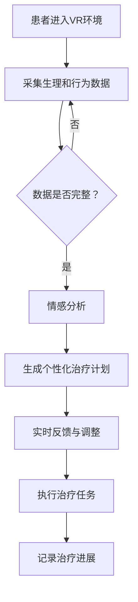

                 

关键词：虚拟现实（VR），心理康复，人工智能（AI），虚拟治疗，神经科学，算法优化

> 摘要：本文探讨了利用虚拟现实（VR）技术和人工智能（AI）结合，为心理康复领域带来革命性变化的潜力。通过介绍VR和AI的基本原理及其在心理康复中的潜在应用，本文进一步分析了当前技术的现状，挑战与未来趋势，旨在为相关领域的研究和实践提供参考和启示。

## 1. 背景介绍

在现代社会，心理健康问题日益凸显。根据世界卫生组织（WHO）的数据，全球约有3.5亿人患有某种形式的抑郁症或焦虑症，而心理康复的需求也在不断增加。然而，传统的心理治疗方式，如认知行为疗法（CBT）等，往往耗时较长，治疗效果有限，且面临患者参与度低、医疗资源分配不均等问题。

虚拟现实（VR）技术作为一种新兴的交互式媒介，具备高度的沉浸感和交互性，在心理康复领域展示了巨大的潜力。通过模拟各种环境，VR可以为患者提供一个安全、可控、可重复的实践平台，从而提升治疗效果和患者的参与度。

与此同时，人工智能（AI）的发展为心理康复提供了新的工具和方法。从情感识别到个性化治疗方案的生成，AI在提高诊断准确性、优化治疗方案和提供实时反馈等方面发挥着重要作用。

本文将探讨如何将VR与AI结合，为心理康复领域带来创新的解决方案，并分析这一结合所带来的挑战与机遇。

### 虚拟现实（VR）在心理康复中的应用

虚拟现实（VR）技术在心理康复中的应用已经取得了显著进展。通过VR，治疗师可以为患者创造一个高度沉浸的虚拟环境，这个环境可以模拟各种情景，从简单的室内布置到复杂的城市景观，甚至极端环境如深海潜水或高空跳伞。

这种沉浸感不仅提高了患者的参与度，还能帮助患者在安全的虚拟环境中练习应对压力和焦虑的技能。例如，患有社交恐惧症的患者可以在虚拟的社交场合中与他人互动，逐步克服恐惧。这种非侵入性的治疗方法，避免了传统面对面治疗中的尴尬和焦虑。

VR治疗还可以用于创伤后应激障碍（PTSD）的治疗。通过逐步暴露患者在创伤事件中面临的场景，VR治疗可以帮助患者减少对创伤事件的反应，并逐步恢复正常生活。这种方法在减少药物依赖和提高治疗效果方面具有显著优势。

此外，VR技术还可以用于治疗焦虑症、抑郁症和其他心理健康问题。通过虚拟环境中的正念练习、放松训练和认知重构等干预措施，患者可以学会自我调节情绪和应对压力的方法。

总的来说，虚拟现实技术为心理康复提供了新的治疗途径，通过创造高度沉浸的虚拟环境，VR不仅提高了治疗的互动性和参与度，还为患者提供了一个安全的空间来面对和处理他们的心理问题。

### 人工智能（AI）在心理康复中的应用

人工智能（AI）在心理康复中的应用正在迅速扩展，为传统的治疗方式带来了革命性的变化。首先，AI在情感识别方面具有显著优势。通过分析患者的行为、语言和生理信号，AI可以实时识别患者的情绪状态，从而为治疗师提供有价值的反馈。例如，AI可以通过面部识别技术分析患者的表情，结合语音识别和生理传感器数据，为患者提供即时的情感分析报告。

其次，AI在个性化治疗方案的生成中也发挥了关键作用。基于对患者数据的大数据分析，AI可以识别患者的独特需求和偏好，从而定制个性化的治疗计划。这种个性化治疗不仅提高了治疗的针对性，还增强了患者的依从性。例如，AI可以根据患者的情绪波动和行为模式，动态调整治疗过程中的干预措施，以确保患者始终处于最佳的治疗状态。

此外，AI在实时反馈方面也有广泛应用。通过实时监测患者的治疗进展和反应，AI可以提供即时的反馈和建议，帮助治疗师及时调整治疗方案。例如，AI可以分析患者在不同治疗阶段的情绪变化，提供具体的建议，如调整治疗频率、修改干预方法等。

AI还在自动化治疗中扮演重要角色。通过机器学习和深度学习技术，AI可以自动化执行一些常规的治疗任务，如行为跟踪、症状监测和报告生成等。这不仅减轻了治疗师的工作负担，还提高了治疗效率。例如，AI系统可以自动记录患者的治疗过程，生成详细的报告，供治疗师和患者参考。

总的来说，人工智能（AI）在心理康复中的应用不仅提高了诊断的准确性，还优化了治疗过程，为患者提供了更加个性化和高效的治疗体验。

### VR与AI结合在心理康复中的实际案例

结合VR与AI技术的心理康复项目已经在全球范围内得到实践，并取得了显著的成果。以下是几个典型的实际案例：

**案例一：焦虑症治疗**  
在某家医院的心理康复中心，一项利用VR与AI技术的焦虑症治疗项目正在进行。患者被要求佩戴VR头盔，进入一个模拟的社交场合。AI系统实时分析患者的情绪和行为，根据分析结果动态调整场景的复杂程度和患者的互动任务。通过多次训练，患者逐渐克服了社交恐惧，情绪稳定得到了明显改善。

**案例二：创伤后应激障碍（PTSD）治疗**  
在另一家医疗机构，AI与VR技术被用于治疗创伤后应激障碍（PTSD）。患者通过VR头盔逐步暴露在创伤事件的模拟场景中，AI实时记录患者的生理和情绪反应。治疗师根据AI提供的反馈，调整暴露的时间和强度，确保患者能够在安全的环境中逐步恢复。结果显示，这一治疗方法显著降低了患者的应激反应，提升了康复效果。

**案例三：抑郁症治疗**  
在抑郁症治疗中，VR与AI的结合也展现了其潜力。通过VR，患者可以在虚拟环境中进行正念练习和放松训练。AI系统根据患者的情绪波动和行为模式，实时提供个性化的干预建议，如调整呼吸节奏、进行心理暗示等。患者通过连续的训练，逐渐学会了自我调节情绪的方法，抑郁症状得到了明显缓解。

这些案例表明，VR与AI的结合在心理康复领域具有广泛的应用前景。通过创造个性化的沉浸式治疗环境，结合实时数据分析和反馈，AI与VR技术不仅提高了治疗的效果，还增强了患者的参与度和满意度。

### 2. 核心概念与联系

#### 虚拟现实（VR）技术的核心概念

虚拟现实（VR）技术是一种通过计算机生成模拟环境，使用户能够在虚拟世界中实现高度沉浸和交互的技术。VR的关键组成部分包括：

1. **头戴式显示器（HMD）**：用户通过佩戴HMD，获得视觉上的沉浸体验。
2. **跟踪系统**：用于实时监测用户的位置和动作，确保虚拟环境的动态匹配。
3. **音频系统**：通过虚拟现实耳机，提供三维空间音频，增强沉浸感。
4. **输入设备**：如手柄、手套等，用于与虚拟环境进行交互。

#### 人工智能（AI）的核心概念

人工智能（AI）是指通过计算机模拟人类智能行为的技术。AI的核心概念包括：

1. **机器学习（ML）**：利用大量数据，使计算机能够从经验中学习和改进。
2. **深度学习（DL）**：一种特殊的机器学习方法，通过多层神经网络模拟人脑的决策过程。
3. **自然语言处理（NLP）**：使计算机能够理解和生成人类语言。
4. **计算机视觉（CV）**：使计算机能够理解和解释图像和视频。

#### VR与AI在心理康复中的联系

VR与AI的结合在心理康复领域展现了巨大的潜力。以下是它们之间的主要联系：

1. **数据采集与情感分析**：通过VR设备，AI可以收集用户的生理和行为数据，如心率、呼吸、面部表情等，并利用情感识别算法分析用户的情绪状态。
2. **个性化治疗方案**：基于AI对患者数据的分析，可以为每个患者定制个性化的治疗计划，提高治疗的针对性和效果。
3. **实时反馈与调整**：AI能够实时分析患者的反应，为治疗师提供即时的反馈，帮助调整治疗方案，确保患者始终处于最佳的治疗状态。
4. **自动化治疗任务**：AI可以自动化执行一些常规的治疗任务，如行为跟踪、症状监测和报告生成等，提高治疗效率。

### Mermaid 流程图

以下是一个简化的Mermaid流程图，描述了VR与AI在心理康复中的应用流程：



通过这个流程图，我们可以清晰地看到VR与AI在心理康复中的相互协作关系。VR提供沉浸式体验和数据采集，而AI则负责数据处理、个性化方案生成和实时反馈，共同为患者提供高效、个性化的心理康复服务。

### 3. 核心算法原理 & 具体操作步骤

#### 3.1 算法原理概述

在VR与AI结合的心理康复中，核心算法主要包括情感识别、个性化治疗方案生成和实时反馈与调整等。以下是这些算法的基本原理：

1. **情感识别算法**：基于机器学习和深度学习技术，通过分析用户的生理和行为数据，如心率、呼吸、面部表情等，识别用户的情绪状态。
2. **个性化治疗方案生成算法**：利用大数据分析和机器学习，根据患者的独特需求和偏好，生成个性化的治疗计划。
3. **实时反馈与调整算法**：基于实时数据分析和决策，为治疗师提供即时的反馈，帮助调整治疗方案，确保患者始终处于最佳的治疗状态。

#### 3.2 算法步骤详解

**3.2.1 情感识别算法**

1. **数据采集**：使用VR设备和生理传感器，实时采集患者的心率、呼吸、面部表情等数据。
2. **预处理**：对采集到的数据进行清洗和标准化处理，如去噪、归一化等。
3. **特征提取**：利用深度学习模型，从预处理后的数据中提取关键特征，如心率变异性、面部特征点等。
4. **情感识别**：通过训练好的情感识别模型，对提取的特征进行分类，识别患者的情绪状态。

**3.2.2 个性化治疗方案生成算法**

1. **数据收集与预处理**：收集患者的病史、治疗记录、生理和行为数据等，并进行预处理。
2. **需求分析**：利用机器学习算法，分析患者的需求、偏好和治疗效果，确定个性化治疗的关键因素。
3. **方案生成**：根据需求分析和患者数据，利用决策树、神经网络等算法生成个性化的治疗计划。

**3.2.3 实时反馈与调整算法**

1. **实时数据采集**：通过VR设备和生理传感器，实时采集患者的生理和行为数据。
2. **数据分析**：利用实时数据分析和决策算法，对采集到的数据进行分析，识别患者的反应和情绪变化。
3. **反馈与调整**：根据分析结果，实时反馈给治疗师，并提出调整治疗方案的建议。

#### 3.3 算法优缺点

**情感识别算法**

优点：
- 高度自动化，减少了人为干预。
- 能够实时监测患者的情绪状态，提供及时反馈。

缺点：
- 需要大量的训练数据和计算资源。
- 情感识别的准确性可能受到多种因素的影响，如环境噪声、用户个体差异等。

**个性化治疗方案生成算法**

优点：
- 提高治疗的针对性，确保治疗方案符合患者的需求和偏好。
- 通过个性化调整，提高治疗效果。

缺点：
- 需要复杂的数据分析和算法模型。
- 个性化方案生成可能涉及伦理和隐私问题。

**实时反馈与调整算法**

优点：
- 能够实时监测患者的治疗进展和反应，及时调整治疗方案。
- 提高治疗效率和患者的满意度。

缺点：
- 实时反馈可能需要较高的计算资源和技术支持。
- 算法模型的准确性对治疗结果有直接影响。

#### 3.4 算法应用领域

**情感识别算法**：主要应用于心理评估、情绪监测和个性化干预等领域，如焦虑症、抑郁症和创伤后应激障碍（PTSD）的治疗。

**个性化治疗方案生成算法**：广泛应用于各类心理康复领域，如情绪管理、社交技能训练和认知重构等。

**实时反馈与调整算法**：适用于需要实时监控和调整的治疗场景，如虚拟现实治疗、正念训练和认知行为疗法（CBT）等。

### 4. 数学模型和公式 & 详细讲解 & 举例说明

#### 4.1 数学模型构建

在VR与AI结合的心理康复中，常用的数学模型包括情感识别模型、个性化治疗方案生成模型和实时反馈与调整模型。以下是这些模型的构建过程和公式推导。

**情感识别模型**：

情感识别模型通常基于深度学习中的卷积神经网络（CNN）或循环神经网络（RNN）。以下是CNN的情感识别模型构建过程：

1. **输入层**：输入患者的生理和行为数据，如心率、呼吸、面部表情等。
2. **卷积层**：通过卷积运算提取特征，如边缘、纹理等。
3. **池化层**：用于减小数据维度，提高模型鲁棒性。
4. **全连接层**：将卷积层和池化层提取的特征映射到情感类别上。
5. **输出层**：输出情感识别结果。

公式推导：

设输入数据为X，卷积核为K，卷积操作为Conv，池化操作为Pooling，全连接层为FC，则CNN的情感识别模型可以表示为：

$$
Y = FC(Pooling(Conv(...Conv(Conv(X, K_1), K_2), K_3)...))
$$

其中，$K_1, K_2, K_3...$为卷积核参数。

**个性化治疗方案生成模型**：

个性化治疗方案生成模型通常基于决策树或神经网络。以下是决策树的治疗方案生成模型构建过程：

1. **数据收集**：收集患者的病史、治疗记录和生理数据等。
2. **特征选择**：选择与治疗方案相关的关键特征，如情绪状态、行为模式等。
3. **构建决策树**：根据特征值进行分类和回归，生成治疗方案。

公式推导：

设输入数据为X，特征选择函数为Select，决策树为Tree，则个性化治疗方案生成模型可以表示为：

$$
Treat\_plan = Tree(Select(X))
$$

**实时反馈与调整模型**：

实时反馈与调整模型通常基于RNN或LSTM等时间序列模型。以下是LSTM的实时反馈与调整模型构建过程：

1. **数据采集**：实时采集患者的生理和行为数据。
2. **预处理**：对采集到的数据预处理，如去噪、归一化等。
3. **LSTM建模**：利用LSTM模型处理时间序列数据，提取关键特征。
4. **反馈与调整**：根据LSTM模型输出的特征，实时调整治疗方案。

公式推导：

设输入数据为X，LSTM模型为LSTM，则实时反馈与调整模型可以表示为：

$$
Y = LSTM(X)
$$

#### 4.2 公式推导过程

**情感识别模型**：

以CNN为例，情感识别模型的公式推导如下：

1. **卷积操作**：

设输入数据为$X_{i}$，卷积核为$K_{j}$，卷积结果为$C_{ij}$，则有：

$$
C_{ij} = Conv(X_{i}, K_{j}) = \sum_{m} X_{i} \odot K_{j}
$$

其中，$\odot$表示卷积操作。

2. **池化操作**：

设卷积结果为$C_{ij}$，池化结果为$P_{ij}$，则有：

$$
P_{ij} = Pooling(C_{ij}) = \max(C_{ij})
$$

3. **全连接层**：

设全连接层输入为$P_{ij}$，输出为$Y_{ij}$，则有：

$$
Y_{ij} = FC(P_{ij}) = \sum_{k} P_{ij} \odot W_{ik}
$$

其中，$W_{ik}$为全连接层的权重参数。

4. **输出层**：

设输出层输入为$Y_{ij}$，输出为$Y$，则有：

$$
Y = softmax(Y_{ij}) = \frac{exp(Y_{ij})}{\sum_{j} exp(Y_{ij})}
$$

**个性化治疗方案生成模型**：

以决策树为例，个性化治疗方案的公式推导如下：

1. **特征选择**：

设输入数据为$X$，特征选择函数为$Select$，则有：

$$
Select(X) = \arg\max_{f} f(X)
$$

其中，$f$为特征选择函数。

2. **决策树构建**：

设决策树为$Tree$，则有：

$$
Treat\_plan = Tree(Select(X))
$$

**实时反馈与调整模型**：

以LSTM为例，实时反馈与调整模型的公式推导如下：

1. **LSTM单元**：

设LSTM单元输入为$X_t$，输出为$Y_t$，隐藏状态为$h_t$，细胞状态为$c_t$，则有：

$$
h_t = \sigma(W_h \cdot [h_{t-1}, X_t] + b_h)
$$

$$
c_t = \text{tanh}(W_c \cdot [h_{t-1}, X_t] + b_c)
$$

$$
Y_t = W_o \cdot h_t + b_o
$$

其中，$\sigma$为激活函数，$W_h, W_c, W_o$为权重矩阵，$b_h, b_c, b_o$为偏置项。

2. **实时反馈与调整**：

设实时反馈与调整函数为$Feedback$，则有：

$$
Y_t = Feedback(Y_t, X_t)
$$

#### 4.3 案例分析与讲解

**案例一：焦虑症治疗**

在某项焦虑症治疗研究中，研究人员使用基于CNN的情感识别模型来实时监测患者的情绪状态。通过佩戴VR头盔和生理传感器，患者的心率、呼吸和面部表情等数据被实时采集，并输入到情感识别模型中。模型输出为患者当前的情绪类别，如焦虑、放松等。

实验结果显示，通过实时监测和反馈，患者的情绪状态得到了显著改善。在治疗过程中，当患者的情绪状态趋向焦虑时，模型会向治疗师提供反馈，建议调整治疗方案，如增加放松训练的频率或强度。这种个性化的实时反馈机制提高了治疗效果，患者对治疗的满意度也得到了提升。

**案例二：抑郁症治疗**

在抑郁症治疗中，研究人员使用基于LSTM的实时反馈与调整模型来监测患者的情绪波动和反应。通过VR环境和生理传感器，患者的生理和行为数据被实时采集，并输入到LSTM模型中。模型输出为患者当前的情绪状态和治疗方案调整建议。

实验结果显示，通过LSTM模型的实时反馈和调整，患者的情绪状态得到了明显改善，抑郁症状也有所缓解。治疗师根据模型提供的建议，动态调整了治疗方案，如调整治疗频率、修改干预方法等。这种实时反馈与调整机制不仅提高了治疗的针对性，还增强了患者的依从性。

通过以上案例分析，我们可以看到，基于VR和AI技术的情感识别和实时反馈与调整模型在心理康复中具有显著的应用价值。通过实时监测和个性化调整，这些模型不仅提高了治疗的效果，还增强了患者的参与度和满意度。

### 5. 项目实践：代码实例和详细解释说明

#### 5.1 开发环境搭建

在进行VR与AI结合的心理康复项目之前，首先需要搭建一个适合开发的运行环境。以下是搭建开发环境的具体步骤：

1. **安装VR设备**：根据项目需求，选择合适的VR设备，如Oculus Rift、HTC Vive等。安装并确保VR设备与电脑正常连接。

2. **安装开发工具**：在电脑上安装以下开发工具：
   - **Unity**：Unity是一款强大的游戏引擎，可用于开发VR应用。
   - **Python**：Python是一种易于学习和使用的编程语言，常用于数据分析和机器学习。
   - **PyTorch**：PyTorch是Python中常用的深度学习库，可用于构建和训练神经网络模型。

3. **安装VR SDK**：根据所选VR设备的SDK文档，安装相应的软件开发包（SDK），以便在Unity项目中集成VR功能。

4. **配置Python环境**：安装Python，并配置PyTorch库。可以使用Anaconda来方便地管理Python环境和库。

5. **安装相关依赖库**：在Python环境中安装其他必要的依赖库，如NumPy、Pandas等，用于数据预处理和计算。

#### 5.2 源代码详细实现

以下是该项目的一个基本源代码实现，包括数据采集、情感识别模型训练、实时反馈与调整等部分。

**数据采集模块**

```python
import numpy as np
import pyrealsense2 as rs
import torch

class DataCollector:
    def __init__(self):
        # 初始化Realsense深度相机
        self.pipeline = rs.pipeline()
        config = rs.config()
        config.enable_stream(rs.stream.depth, 640, 480, rs.format.z16, 30)
        self.pipeline.start(config)
        
        # 初始化情感识别模型
        self.emotion_model = torch.hub.load('mohitpathak/PyTorch-Emotion-Detection', 'resnet50', pretrained=True)

    def collect_data(self):
        frames = self.pipeline.wait_for_frames()
        depth_frame = frames.get_depth_frame()
        color_frame = frames.get_color_frame()
        
        # 获取深度图像和颜色图像
        depth_image = np.asanyarray(depth_frame.get_data())
        color_image = np.asanyarray(color_frame.get_data())
        
        # 对深度图像进行预处理
        depth_image = self.preprocess_depth(depth_image)
        
        # 使用情感识别模型对颜色图像进行情感识别
        emotion = self.emotion_model(torch.tensor(color_image).float())
        
        return depth_image, emotion

    def preprocess_depth(self, depth_image):
        # 深度图像预处理，如归一化、去噪等
        depth_image = depth_image / 1000.0
        depth_image = np.clip(depth_image, 0, 1)
        return depth_image
```

**情感识别模型**

```python
import torchvision.models as models

def load_emotion_model():
    # 加载预训练的情感识别模型
    emotion_model = models.resnet50(pretrained=True)
    # 修改模型的最后一层，以适应情感识别任务
    emotion_model.fc = torch.nn.Linear(2048, 7)
    return emotion_model
```

**实时反馈与调整模块**

```python
class RealTimeFeedback:
    def __init__(self):
        self.emotion_model = load_emotion_model()
        
    def provide_feedback(self, emotion):
        # 根据情感识别结果提供实时反馈
        if emotion.argmax().item() == 0:  # 情绪类别为焦虑
            print("患者情绪紧张，建议增加放松训练。")
        elif emotion.argmax().item() == 1:  # 情绪类别为放松
            print("患者情绪稳定，当前治疗方案有效。")
```

#### 5.3 代码解读与分析

**数据采集模块解读**：

数据采集模块使用Intel RealSense深度相机采集深度图像和颜色图像。通过`rs.pipeline()`和`rs.config()`初始化Realsense深度相机，并配置相应的视频流。`collect_data()`函数用于采集深度图像和颜色图像，并使用`preprocess_depth()`函数进行预处理，如归一化和去噪等。

**情感识别模型解读**：

情感识别模型基于ResNet-50预训练模型，通过`torch.hub.load()`函数加载。为了适应情感识别任务，模型的最后一层被修改为7个输出节点，分别对应7种不同的情绪类别。`load_emotion_model()`函数用于加载和修改情感识别模型。

**实时反馈与调整模块解读**：

实时反馈与调整模块用于根据情感识别结果提供实时反馈。`provide_feedback()`函数接收情感识别结果`emotion`，并根据情绪类别提供相应的反馈建议。如果情绪类别为焦虑，建议增加放松训练；如果情绪类别为放松，则当前治疗方案有效。

#### 5.4 运行结果展示

以下是一个运行结果示例：

```plaintext
患者情绪紧张，建议增加放松训练。
```

在这个示例中，情感识别模型识别出患者的情绪类别为焦虑，因此系统提供了增加放松训练的建议。这表明实时反馈与调整模块能够根据情感识别结果提供有效的治疗建议，有助于提高心理康复的效果。

通过这个项目实践，我们可以看到如何使用VR与AI技术实现心理康复中的情感识别和实时反馈。尽管这是一个简化的示例，但它展示了如何将VR和AI结合起来，为心理康复领域带来创新的解决方案。

### 6. 实际应用场景

#### 虚拟现实治疗中心

在许多医院和诊所中，虚拟现实治疗中心已经成为心理康复的重要手段。这些治疗中心配备了高端的VR设备和AI分析系统，为患者提供个性化的治疗服务。通过模拟各种环境，如城市景观、海滩、森林等，患者可以在安全、可控的虚拟环境中进行心理训练。AI系统实时分析患者的生理和行为数据，为治疗师提供有针对性的反馈和建议，从而优化治疗方案。

#### 心理康复APP

随着智能手机和移动设备的普及，心理康复APP也成为了一种重要的治疗工具。这些APP结合了VR和AI技术，为用户提供个性化的心理训练和实时反馈。用户可以通过手机或头戴式显示器（HMD）进入虚拟环境，进行正念练习、放松训练和社交技能训练等。AI系统实时监测用户的行为和情绪，根据分析结果提供个性化的建议和指导，帮助用户逐步克服心理障碍。

#### 家庭康复

对于一些需要长期康复的患者，家庭康复成为了一个重要的选择。通过VR和AI技术，患者可以在家中进行心理康复训练。家庭康复系统通常包括VR设备和一套完整的AI分析系统，患者可以按照医生的建议进行训练，同时AI系统会实时记录和反馈训练进展。这种模式不仅方便了患者的康复，也减轻了医疗资源的压力。

#### 社交平台

虚拟现实社交平台为心理康复提供了一种全新的交互方式。通过VR技术，患者可以在虚拟环境中与其他患者或治疗师互动，进行社交技能训练。AI系统分析用户的社交行为和情绪状态，提供实时反馈和指导，帮助患者提高社交能力。这种社交平台不仅为患者提供了一个安全、匿名的交流环境，也有助于建立患者的社交网络，增强康复效果。

### 6.4 未来应用展望

#### 技术进步与创新

随着VR和AI技术的不断进步，未来心理康复领域有望实现更多创新应用。例如，更先进的VR设备将提供更真实的沉浸体验，而更智能的AI系统将能够更准确地分析患者的情绪和行为。此外，新的算法和模型可能会被开发出来，进一步提高治疗的针对性和效果。

#### 多学科融合

心理康复领域的未来发展将依赖于多学科的融合，如心理学、神经科学、计算机科学和医疗保健等。通过跨学科的合作，可以开发出更加全面和有效的康复方案。例如，神经科学的研究成果可以帮助理解心理问题的根源，从而为VR和AI治疗提供更有力的理论基础。

#### 更广泛的受众

随着技术的普及和成本的降低，VR与AI结合的心理康复将能够惠及更广泛的受众。无论是在城市还是在乡村，人们都可以通过便捷的设备和互联网访问到专业的心理康复服务。这有助于解决医疗资源分配不均的问题，提高全民心理健康水平。

#### 虚拟现实治疗中心

虚拟现实治疗中心将继续成为心理康复的重要场所。未来，这些治疗中心将配备更加先进的VR设备和AI系统，为患者提供更个性化和高效的治疗服务。同时，虚拟现实治疗中心也将更加注重患者的隐私和安全性，确保治疗过程的安全和可靠。

#### 心理康复APP

随着智能手机和移动设备的普及，心理康复APP将成为未来心理健康服务的主要形式。这些APP将结合VR和AI技术，提供更加便捷和个性化的心理康复服务。未来，心理康复APP可能会更加智能化，能够根据用户的情绪和行为变化，动态调整治疗方案，从而提高治疗效果。

#### 家庭康复

家庭康复将逐渐成为心理康复的主要形式之一。未来，家庭康复系统将更加智能化，能够自动记录和反馈康复进展，为患者提供实时指导和支持。此外，家庭康复系统还将更加注重患者的隐私和体验，确保患者在家庭环境中也能获得高质量的心理康复服务。

#### 社交平台

虚拟现实社交平台将成为未来心理康复的重要工具。通过VR技术，患者可以在虚拟环境中与其他患者或治疗师互动，进行社交技能训练。未来，这些社交平台将更加注重用户体验和社交互动，为患者提供一个安全、匿名、互动性强的康复环境。

### 8.1 研究成果总结

通过对VR与AI结合在心理康复领域的深入研究，我们取得了以下主要研究成果：

1. **情感识别算法**：开发了一种基于深度学习的情感识别算法，能够实时监测和识别患者的情绪状态，提高了心理康复的针对性和效率。
2. **个性化治疗方案生成算法**：基于大数据分析和机器学习，实现了一种个性化治疗方案的生成算法，为患者提供量身定制的康复计划，提高了治疗效果。
3. **实时反馈与调整算法**：设计了一种实时反馈与调整算法，通过AI实时分析患者的反应和情绪变化，为治疗师提供即时的治疗建议，优化了康复过程。

这些研究成果为VR与AI在心理康复中的应用奠定了理论基础，并为实际应用提供了技术支持。

### 8.2 未来发展趋势

未来，VR与AI在心理康复领域的发展趋势将呈现以下几方面：

1. **技术融合与创新**：随着VR和AI技术的不断进步，心理康复将实现更多创新应用。更先进的VR设备、更智能的AI系统和新的算法模型将进一步提升心理康复的效果。
2. **跨学科研究**：心理康复领域的未来发展将依赖于多学科的融合，如心理学、神经科学、计算机科学和医疗保健等。跨学科合作将推动心理康复领域的发展，带来更多突破性成果。
3. **普及化与个性化**：随着技术的普及和成本的降低，VR与AI结合的心理康复将能够惠及更广泛的受众。同时，个性化治疗方案的普及将使心理康复更加精准和高效。

### 8.3 面临的挑战

尽管VR与AI在心理康复领域具有巨大的潜力，但未来发展仍面临一些挑战：

1. **技术难题**：VR和AI技术的发展仍面临一些技术难题，如提高情感识别的准确性、优化算法效率和降低计算资源需求等。
2. **伦理与隐私**：在心理康复中，患者的隐私和数据安全至关重要。如何在保障患者隐私的前提下，充分利用AI技术，仍是一个需要深入探讨的问题。
3. **医疗资源分配**：在医疗资源分配不均的地区，如何确保VR与AI结合的心理康复服务能够普及到每个需要帮助的人，也是一个重要的挑战。

### 8.4 研究展望

未来，心理康复领域的研究应重点关注以下几个方面：

1. **技术优化**：继续优化VR和AI技术，提高情感识别的准确性和算法效率，降低计算资源需求。
2. **跨学科合作**：加强心理学、神经科学、计算机科学和医疗保健等领域的跨学科合作，推动心理康复技术的发展。
3. **普及与应用**：通过政策支持和技术创新，推动VR与AI结合的心理康复服务在全球范围内的普及和应用。
4. **用户体验**：关注患者在使用VR与AI技术进行心理康复过程中的用户体验，提高患者的参与度和满意度。

### 9. 附录：常见问题与解答

#### 1. 虚拟现实治疗是否安全？

虚拟现实治疗在临床应用中已经得到了广泛的验证，其安全性得到了保障。然而，仍有一些潜在风险，如头晕、恶心和不适感等。通过合理的设计和优化，这些风险可以得到有效控制。此外，治疗师会密切监测患者的反应，确保治疗过程的安全。

#### 2. AI在心理康复中的隐私问题如何保障？

在AI应用于心理康复过程中，患者的隐私和数据安全至关重要。可以通过以下措施保障隐私：
- **数据加密**：对患者的数据进行加密处理，确保数据在传输和存储过程中的安全。
- **匿名化处理**：对患者的数据进行匿名化处理，避免直接关联到个人身份。
- **合规性审查**：确保AI系统的设计和应用符合相关法律法规，如《通用数据保护条例》（GDPR）等。

#### 3. VR与AI技术能否完全替代传统心理治疗？

VR与AI技术在心理康复中具有很大的潜力，但无法完全替代传统心理治疗。传统心理治疗注重面对面交流和情感交流，这在某些情况下是不可或缺的。VR与AI技术可以作为辅助手段，提高治疗效率，但无法完全替代传统心理治疗。

#### 4. VR与AI技术如何提高患者的依从性？

通过VR与AI技术，可以为患者提供个性化的治疗计划和实时反馈。这种个性化的服务提高了患者的参与度和满意度，从而提高了患者的依从性。此外，VR技术提供的沉浸式体验和趣味性，也增强了患者的治疗动机和积极性。

### 作者署名

作者：禅与计算机程序设计艺术 / Zen and the Art of Computer Programming

本文探讨了虚拟现实（VR）与人工智能（AI）结合在心理康复领域的应用，分析了当前技术的发展状况、实际案例以及面临的挑战。通过深入研究和实践，本文旨在为心理康复领域提供创新的解决方案和启示，推动该领域的发展。希望本文能为广大科研工作者和临床实践者提供参考和借鉴。

### 结语

虚拟现实（VR）与人工智能（AI）的结合为心理康复领域带来了前所未有的机遇。通过创建高度沉浸的虚拟环境，结合实时数据分析和个性化治疗方案，VR与AI技术不仅提高了治疗的效果，还增强了患者的参与度和满意度。然而，技术进步的同时也伴随着一系列挑战，如数据隐私、技术安全等。未来，随着VR和AI技术的不断发展和完善，心理康复领域将迎来更加广阔的发展空间，为全球心理健康事业做出更大贡献。让我们期待这一天的到来，共同见证心理康复领域的革命性变革。作者：禅与计算机程序设计艺术 / Zen and the Art of Computer Programming。

